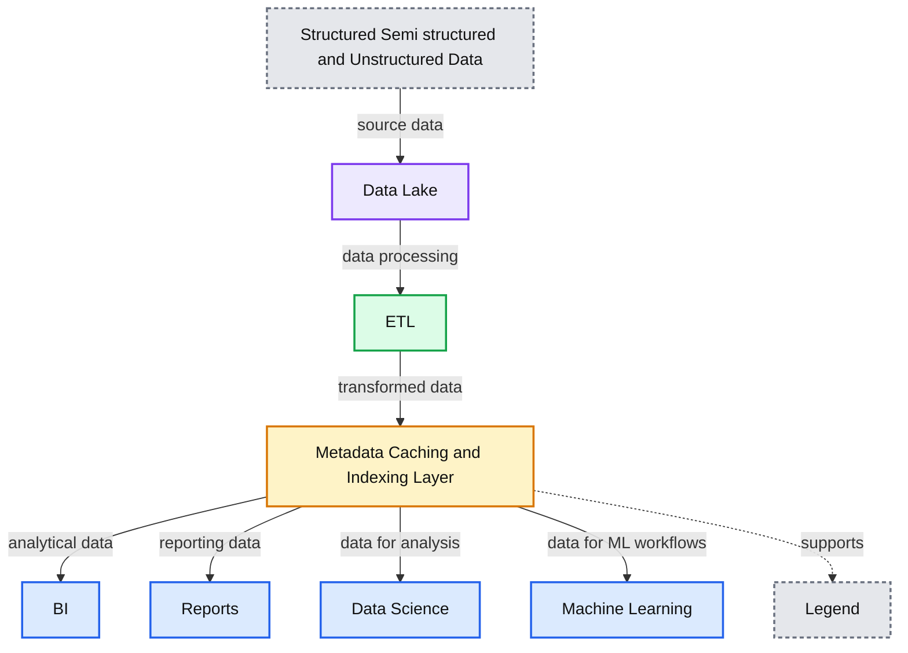
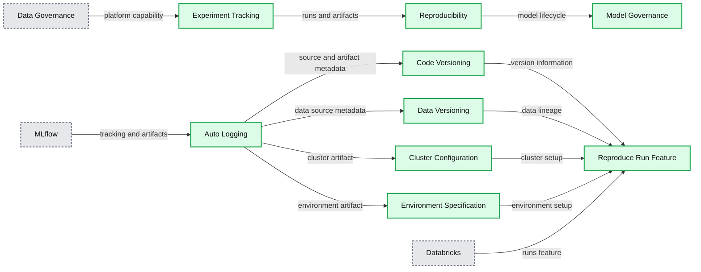

# Need for Data-centric ML Platforms

*Why switching from a model-centric to a data-centric approach solves the biggest challenges facing MLOps*

- Source: https://www.databricks.com/blog/2021/06/23/need-for-data-centric-ml-platforms.html
- Published: 2021-06-23
- Authors: Rafi Kurlansik, ML SMEs at Databricks
- Categories: engineering, data-science-machine-learning
- Images: 7 total, 4 extracted as architecture

This blog is the first in a series on MLOps and Model Governance. [The next blog](https://www.databricks.com/blog/2021/06/24/three-principles-for-selecting-machine-learning-platforms.html) will be by Joseph Bradley and will discuss how to choose the right technologies for data science and machine learning based on his experience working with customers.

### Introduction

Recently, I learned that the failure rate for machine learning projects is still astonishingly high. Studies suggest that between 85-96% of projects never make it to production. These numbers are even more remarkable given the growth of machine learning (ML) and data science in the past five years. What accounts for this failure rate?

For businesses to be successful with ML initiatives, they need a comprehensive understanding of the risks and how to address them. In this post, we attempt to shed light on how to achieve this by moving away from a model-centric view of ML systems towards a data-centric view. We’ll also dive into [MLOps](https://www.databricks.com/glossary/mlops) and model governance and the importance of leveraging data-centric ML platforms such as Databricks.

### The data of ML applications

Of course, everyone *knows* that data is the most important component of ML. Nearly every data scientist has heard: "garbage in, garbage out" and "80% of a data scientist’s time is spent cleaning data". These aphorisms remain as true today as they did five years ago, but both refer to data purely in the context of successful model training. If the input training data is garbage, then the model output will be garbage, so we spend 80% of our time ensuring that our data is clean and our model makes useful predictions. Yet model training is only one component of a production ML system.

In *Rules of Machine Learning*, research scientist Martin Zinkevich emphasizes implementing reliable data pipelines and infrastructure for all business metrics and telemetry *before* training your first model. He also advocates testing pipelines on a simple model or heuristic to ensure that data is flowing as expected prior to any production deployment. According to Zinkevich, successful ML application design considers the broader requirements of the system first, and does not overly focus on training and inference data.

Zinkevich isn’t the only one who sees the world this way. The Tensorflow Extended (TFX) team at Google has cited Zinkevich and echoes that building real world ML applications “necessitates some mental model shifts (or perhaps augmentations).”

Prominent AI researcher Andrew Ng has also recently spoken about the need to embrace a *data-centric* approach to machine learning systems, as opposed to the historically predominant *model-centric* approach. Ng talked about this in the context of improving models through better training data, but I think he is touching upon something deeper. The message from both of these leaders is that deploying successful ML applications requires a shift in focus. Instead of asking, *What data do I need to train a useful model?*, the question should be: *What data do I need to measure and maintain the success of my ML application?*

To confidently measure and maintain success, a variety of data must be collected to satisfy business and engineering requirements. For example, how do we know if we’re hitting business KPIs for this project? Or, where is our model and its data documented? Who is accountable for the model, and how do we trace its lineage? Looking at the flow of data in a ML application can shed some light on where these data points are found.

The diagram below illustrates one possible flow of data in a fictional web app that uses ML to recommend plants to shoppers and the personas that own each stage.

**Summary:** Data flows through a plant recommendation ML application from source data and logs to derived datasets, model training, testing, deployment, monitoring, and production promotion.

**Components:**

- plantly.shop: fictional web application
- Sales: source sales data
- Raw Logs and Predictions: application records
- PostgreSQL database: intermediate storage
- Object storage buckets: raw, server, and test logs
- Kafka: monitoring event stream
- Events, KPIs, and Sales: derived datasets
- Features: engineered model inputs
- Data Scientist: model development owner
- Data Engineer: data pipeline owner
- ML Engineer: model serving and deployment owner
- Model Training: trained ML model
- Experiment Tracking: model metadata and lineage tracking
- Model Server: REST API model serving
- Jenkins: testing and release automation
- Testing checks: baseline performance, resource efficiency, compliance, documentation and code review, integration testing, and A/B testing

**Flows:**

- plantly.shop -> PostgreSQL database: sales data
- plantly.shop -> object storage buckets: raw logs and predictions
- plantly.shop -> Kafka: monitoring events
- PostgreSQL database -> derived Sales dataset: copy
- object storage buckets -> derived Sales dataset: parse
- Kafka -> Events dataset: filter
- Events dataset -> Features: slice
- KPIs -> Features: aggregate
- Sales dataset -> Features: join
- Features -> Model Training: one-hot encode and scale
- Model Training -> Experiment Tracking: model binary and experiment metadata
- Experiment Tracking -> Jenkins: promote to production
- Jenkins -> Model Server: release
- Model Server -> plantly.shop: REST API predictions
- Model Server -> server log bucket: server logs
- Jenkins -> test log bucket: test logs
- server log bucket -> Kafka: monitoring input

**Numbers:** none

source image: https://www.databricks.com/wp-content/uploads/2021/06/Need-for-Data-centric-ML-Platforms-blog-img-7.jpg

 

```mermaid
%% Data flow for a plant recommendation ML application
flowchart LR
    APP[plantly shop]
    SRC[Sales and raw logs]
    DB[(PostgreSQL database)]
    OBJ[(Object storage buckets)]
    KAFKA[Kafka monitoring stream]
    DATA[Derived datasets]
    FEAT[Features]
    TRAIN[Model training]
    TRACK[Experiment tracking]
    TEST[Jenkins testing]
    SERVE[Model server]
    LOGS[Server and test logs]

    APP -->|sales and predictions| SRC
    SRC -->|write source data| DB
    SRC -->|write raw records| OBJ
    APP -->|monitoring events| KAFKA
    DB -->|copy and parse| DATA
    OBJ -->|parse logs| DATA
    KAFKA -->|filter events| DATA
    DATA -->|join aggregate and slice| FEAT
    FEAT -->|one hot encode and scale| TRAIN
    TRAIN -->|model and metadata| TRACK
    TRACK -->|promote model| TEST
    TEST -->|release| SERVE
    SERVE -->|REST API predictions| APP
    SERVE -->|server logs| LOGS
    TEST -->|test logs| LOGS
    LOGS -->|monitoring input| KAFKA

    LEGEND[Legend: client edge or gateway, service stateless compute, store durable storage, cache losable storage, queue async stream, critical bottleneck, external third party, decision trade off]

    classDef client fill:#dbeafe,stroke:#2563eb,stroke-width:2px,color:#111
    classDef service fill:#dcfce7,stroke:#16a34a,stroke-width:2px,color:#111
    classDef store fill:#ede9fe,stroke:#7c3aed,stroke-width:2px,color:#111
    classDef cache fill:#fef3c7,stroke:#d97706,stroke-width:2px,color:#111
    classDef queue fill:#cffafe,stroke:#0891b2,stroke-width:2px,color:#111
    classDef critical fill:#fee2e2,stroke:#dc2626,stroke-width:4px,color:#111
    classDef external fill:#e5e7eb,stroke:#6b7280,stroke-width:2px,color:#111,stroke-dasharray:4 3
    classDef decision fill:#fce7f3,stroke:#db2777,stroke-width:2px,color:#111

    class APP client
    class SRC,DATA,FEAT,TRAIN,TRACK,TEST,SERVE service
    class DB,OBJ,LOGS store
    class KAFKA queue
    class LEGEND external
```

In this diagram, source data flows from the web app to intermediate storage, and then to derived tables. These are used for monitoring, reporting, feature engineering and model training. Additional metadata about the model is extracted, and logs from testing and serving are collected for auditing and compliance. A project that neglects or is incapable of managing this data is at risk of underperforming or failing entirely, regardless of how well the ML model performs on its specific task.

### ML engineering, MLOps & model governance

Much like DevOps and data governance have lowered risk and become disciplines in their own right, ML engineering has emerged as a discipline to handle the operations (aka  *MLOps*) and governance of ML applications. There are basically two kinds of risk that need to be managed in this context: risk inherent to the ML application system and risk of non-compliance with external systems. If data pipeline infrastructure, KPIs, model monitoring and documentation are lacking, then the risk of your system becoming destabilized or ineffective increases. On the other hand, a well-designed app that fails to comply with corporate, regulatory and ethical requirements runs the risk of losing funding, receiving fines or reputational damage.

How can organizations manage this risk?  MLOps and model governance are still in their early stages, and there are no official standards or definitions for them. Therefore, based on our experience working with customers, we propose useful definitions to help you think about it.

MLOps (machine learning operations) is *the active management of a productionized model and its task, including its stability and effectiveness.* In other words, MLOps is primarily concerned with maintaining the function of the ML application through better data, model and developer operations. Simply put, MLOps = ModelOps + DataOps + DevOps.

Model governance, on the other hand, is *the control and regulation of a model, its task and its effect on surrounding systems*. It is primarily concerned with the broader consequences of how an ML application functions in the real world.

To illustrate this distinction, imagine an extreme case in which someone builds a highly-functional ML application that is used to secretly mine Bitcoin on your devices. That would be very effective, but its lack of governance has negative consequences on society. At the same time, you could write 400 page compliance and auditing reports for a credit risk model to satisfy federal regulations, but if the application isn't stable or effective, then it is lacking in the operational dimension.

So, to build a system that is functional and respects human values, we need both. At a minimum, operations are responsible for maintaining uptime and stability, and each organization assumes legal and financial responsibility for the ML applications they create. Today, this responsibility is relatively limited because the regulatory environment for AI is in its infancy. However, leading corporations and academic institutions in the space are working to shape its future. Much like GDPR caused major waves in the data management space, it seems that similar regulation is an inevitability for ML.

### Essential Capabilities

Having distinguished between operations and governance, we are now in a position to ask: What specific capabilities are required to support them?  The answers fall into roughly six categories:

#### Data processing and management

Since the bulk of innovation in ML happens in open source, support for structured *and* unstructured data types with open formats and APIs is a prerequisite. The system must also process and manage pipelines for KPIs, model training/inference, [target drift](https://en.wikipedia.org/wiki/Concept_drift), testing and logging. Note that not all pipelines process data in the same way or with the same SLA. Depending on the use case, a training pipeline may require GPUs, a monitoring pipeline may require streaming and an inference pipeline may require low latency online serving. Features must be kept consistent between training (offline) and serving (online) environments, leading many to look to feature stores as a solution. How easy is it for engineers to manage features, retry failed jobs, understand data lineage, and comply with regulatory mandates like GDPR? The choices made to deliver these capabilities can result in significant swings in ROI.

#### Secure collaboration

Real world ML engineering is a cross-functional effort - thorough project management and ongoing collaboration between the data team and business stakeholders are critical to success. Access controls play a large role here, allowing the right groups to work together in the same place on data, code and models while limiting the risk of human error or misconduct. This notion extends to separation of dev and prod environments too.

#### Testing

To ensure the system meets expectations for quality, tests should be run on code, data and models. This includes unit tests for pipeline code covering feature engineering, training, serving and metrics, as well as end-to-end integration testing. Models should be tested for baseline accuracy across demographic and geographic segments, feature importance, bias, input schema conflicts and computational efficiency. Data should be tested for the presence of sensitive PII or HIPAA data and training/serving skew, as well as validation thresholds for feature and target drift. Ideally automated, tests reduce the likelihood of human error and aid in compliance.

#### Monitoring

Regular surveillance over the system helps identify and respond to events that pose a risk to its stability and effectiveness. How soon can it be discovered when a key pipeline fails, a model becomes stale or a new release causes a memory leak in production?  When was the last time all input feature tables were refreshed or someone tried to access restricted data? The answers to these questions may require a mix of live (streaming), periodic (batch) and event driven updates.

#### Reproducibility

This refers to the ability to validate the output of a model by recreating its definition (code), inputs (data) and system environment (dependencies). If a new model shows unexpectedly poor performance or contains bias towards a segment of the population, organizations need to be able to audit the code and data used for feature engineering and training, reproduce an alternate version, and re-deploy. Also, if a model in production is behaving strangely, how will we be able to debug it without reproducing it?

#### Documentation

Documenting a ML application scales operational knowledge, lowers the risk of technical debt and acts as a bulwark against compliance violations. This includes an accounting and visualization of the system architecture; the schemas, parameters and dependencies of features, models and metrics; and reports of every model in production and accompanying governance requirements.

### The need for a data-centric machine learning platform

In a recent webinar, Matei Zaharia listed *ease of adoption* by data teams alongside *integration with data infrastructure* and *collaboration functions* as desirable features in a ML platform.

In this regard, data science tools that emerged from a model-centric approach are fundamentally limited. They offer advanced model management features in software that is separated from critical data pipelines and production environments. This disjointed architecture relies on other services to handle the most critical component of the infrastructure – *data*.

As a result, access control, testing and documentation for the entire flow of data are spread across multiple platforms. To separate these at this point seems arbitrary and, as has been established, unnecessarily increases the complexity and risk of failure for any ML application.

A data-centric ML platform brings models and features alongside data for business metrics, monitoring and compliance. It unifies them, and in doing so, is fundamentally simpler. Enter *lakehouse* *architecture*.

**Summary:** The diagram shows a lakehouse platform where structured, semi-structured, and unstructured data flows through a data lake, ETL, and a metadata, caching, and indexing layer to support BI, reports, data science, and machine learning.

**Components:**

- Structured, semi-structured, and unstructured data - technology not specified
- Data lake - technology not specified
- ETL - technology not specified
- Metadata, caching, and indexing layer - technology not specified
- BI - technology not specified
- Reports - technology not specified
- Data science - technology not specified
- Machine learning - technology not specified

**Flows:**

- Structured, semi-structured, and unstructured data -> Data lake: source data
- Data lake -> ETL: data processing
- ETL -> Metadata, caching, and indexing layer: transformed and prepared data
- Metadata, caching, and indexing layer -> BI: analytical data
- Metadata, caching, and indexing layer -> Reports: reporting data
- Metadata, caching, and indexing layer -> Data science: data for analysis
- Metadata, caching, and indexing layer -> Machine learning: data for ML workflows

**Numbers:** none

source image: https://www.databricks.com/wp-content/uploads/2021/06/Need-for-Data-centric-ML-Platforms-blog-img-2.jpg

Lakehouses are by definition data-centric and combine the flexibility and scalability of data lakes with the performance and data management of a data warehouse. Their open source nature makes it easy to integrate ML with where the data lives. There’s no need to export data out of a proprietary system in order to use ML frameworks like Tensorflow, PyTorch or scikit-learn. This also makes them considerably easier to adopt.

Databricks Machine Learning is built upon a lakehouse architecture and supports critical MLOps and governance needs including secure collaboration, model management, testing and documentation.

#### Data processing and management

To manage and process the variety and volume of data sources required by a ML application, Databricks uses a high performance combination of Apache Spark and Delta Lake. These unify batch and streaming workloads, operate at petabyte scale and are used for monitoring, metrics, logging and training/inference pipelines that are built with or without GPUs. Delta Lake’s data management capabilities make it easy to [maintain compliance with regulations](https://docs.databricks.com/security/privacy/gdpr-delta.html). [The Feature Store](https://www.databricks.com/blog/2021/05/27/databricks-announces-the-first-feature-store-integrated-with-delta-lake-and-mlflow.html) is tightly integrated with Delta, Spark and MLflow to make feature discovery and serving simple for training and inference jobs. Multi-step pipelines can be executed as scheduled [jobs](https://docs.databricks.com/jobs.html) or invoked via API, with retries and email notifications. For low latency online serving, Databricks offers hosted [MLflow model serving](https://docs.databricks.com/applications/mlflow/model-serving.html) for testing, publishing features to an online store, and [integrating](https://mlflow.org/docs/latest/models.html) with Kubernetes environments or managed cloud services like Azure ML and Sagemaker for production.

#### Secure collaboration

In addition to defining data access privileges at the table, cloud resource or user identity level, Databricks also supports [access control](https://docs.databricks.com/security/access-control/index.html) of models, code, compute and credentials. These enable users to co-edit and co-view notebooks in the workspace in compliance with security policies. The administrative features that limit access to production environments and sensitive data are used by customers in financial services, health care, and government around the world.

#### Testing

[Databricks Repos](https://docs.databricks.com/repos.html#best-practices-for-integrating-repos-with-cicd-workflows) allow users to integrate their project with version control systems and automated build and test servers like [Jenkins](https://docs.databricks.com/dev-tools/ci-cd/ci-cd-jenkins.html) or [Azure DevOps](https://docs.microsoft.com/en-us/azure/databricks/dev-tools/ci-cd/ci-cd-azure-devops). These can be used for unit and integration tests whenever code is committed. Databricks also offers [MLflow webhooks](https://www.databricks.com/blog/2020/11/19/mlflow-model-registry-on-databricks-simplifies-mlops-with-ci-cd-features.html) that can be triggered at key stages of a model’s lifecycle - for example promotion to staging or production. These events can force an evaluation of the model for baseline accuracy, feature importance, bias, and computational efficiency, rejecting candidates that fail to pass or inviting a code review and [tagging](https://www.mlflow.org/docs/latest/python_api/mlflow.html#mlflow.set_tag) models accordingly. The [signature](https://www.mlflow.org/docs/latest/models.html#model-signature-and-input-example) or input schema of a MLflow model can also be provided at logging time and tested for compatibility with the data contract of the production environment.

#### Monitoring

For ongoing surveillance, Structured Streaming and Delta Lake can be used in conjunction with [Databricks SQL](https://docs.databricks.com/sql/get-started/concepts.html) to visualize system telemetry, KPIs, and feature distributions to stakeholders in real time dashboards. Periodic, scheduled batch jobs keep static historical and [audit log](https://www.databricks.com/blog/2020/06/02/monitor-your-databricks-workspace-with-audit-logs.html) tables fresh for analysis. To stay abreast of important events teams can receive [email or Slack notifications for job failures](https://docs.databricks.com/jobs.html#alerts). To maintain the validity of input features, routine statistical testing of feature distributions should be performed and logged with MLflow. [Comparing runs](https://docs.databricks.com/applications/mlflow/tracking.html#compare-runs) makes it easy to tell if the shape of feature and target distributions is changing. If a distribution or application latency metric breaches a threshold value, an [alert](https://docs.databricks.com/sql/user/alerts/index.html#alerts) from SQL Analytics can trigger a training job using webhooks to automatically redeploy a new version. Changes to the state of a model in the MLflow Model Registry can be monitored via the same webhooks mentioned for testing. These alerts are critical to maintaining the efficacy of a model in production.

#### Reproducibility

MLflow is a general framework to [track](https://docs.databricks.com/applications/mlflow/tracking.html) and manage models from experimentation through deployment. The code, [data source](https://www.mlflow.org/docs/latest/python_api/mlflow.spark.html), [library dependencies](https://mlflow.org/docs/latest/models.html), infrastructure and model can be logged (or [auto-logged](https://www.mlflow.org/docs/latest/tracking.html#automatic-logging)) at training time alongside other arbitrary artifacts like [SHAP explainers](https://www.databricks.com/blog/2020/11/13/mlflow-1-12-features-extended-pytorch-integration.html) or [pandas-profiling](https://github.com/pandas-profiling/pandas-profiling). This allows for reproducing a training run at the [click of a button](https://www.databricks.com/blog/2021/02/10/accelerating-ml-experimentation-in-mlflow.html). This data is preserved when models are promoted to the centralized [Model Registry](https://docs.databricks.com/applications/mlflow/model-registry.html), serving as an audit trail of their design, data lineage and authorship. Maintaining model versions in the registry makes it easy to quickly roll back breaking changes while engineers trace a model artifact back to its source for debugging and investigation.

**Summary:** MLflow combines auto-logged source and artifacts with a reproducibility checklist and run-cloning feature, supported by data governance, experiment tracking, reproducibility, and model governance.

**Components:**

- Auto-Logging using MLflow Model Registry and MLflow artifacts
- Code versioning
- Data versioning
- Cluster configuration
- Environment specification using `cluster_spec.json` and `conda.yml`
- Reproduce Run Feature using Databricks
- Data Governance
- Experiment Tracking
- Reproducibility
- Model Governance
- Databricks
- MLflow

**Flows:**

- Auto-Logging -> Code versioning: source code metadata
- Auto-Logging -> Data versioning: data source metadata
- Auto-Logging -> Cluster configuration: cluster specification artifact
- Auto-Logging -> Environment specification: environment artifact
- Code versioning -> Reproduce Run Feature: version information
- Data versioning -> Reproduce Run Feature: data lineage information
- Cluster configuration -> Reproduce Run Feature: cluster setup
- Environment specification -> Reproduce Run Feature: environment setup
- Data Governance -> Experiment Tracking: platform capability
- Experiment Tracking -> Reproducibility: tracked runs and artifacts
- Reproducibility -> Model Governance: reproducible model lifecycle

**Numbers:** 0.20.2; run identifier `cb55d06262448d99b08cb5e9dd2e98`; screenshot date beginning with `202`

source image: https://www.databricks.com/wp-content/uploads/2021/06/Need-for-Data-centric-ML-Platforms-blog-img-5.jpg

#### Documentation

Following the notion that documentation should be easy to find, Databricks Notebooks are a natural fit for documenting pipelines that run on the platform and system architecture. In addition to notebooks, models can also be elucidated by conveniently logging relevant artifacts alongside them to the MLflow tracking server, as described above. The tracking server and registry also support [annotation](https://www.databricks.com/blog/2020/11/19/mlflow-model-registry-on-databricks-simplifies-mlops-with-ci-cd-features.html) of a model and a description of its lifecycle stage transitions via the UI and [API](https://mlflow.org/docs/latest/python_api/mlflow.tracking.html#mlflow.tracking.MlflowClient.create_registered_model). These are important features that bring human judgement and feedback to an AI system.

### Putting it all together

To illustrate what the experience of developing a ML application on a data-centric ML platform like Databricks looks like, consider the following scenario:

*A team of three practitioners (data engineer, scientist, machine learning engineer) are tasked with building a recommender to improve sales for their online store - plantly.shop. *

*At first, the team meets with business stakeholders to **identify KPI and metric requirements for the model, application, and corresponding data pipelines, identifying any data access and regulatory issues up front. ** The data engineer starts a project in version control, syncs their code to a Databricks Repo, then gets to work using Apache Spark to ingest sales and application log data into Delta Lake from an OLTP database and Apache Kafka. All pipelines are built with Spark Structured Streaming and TriggerOnce** to provide turnkey streaming in the future. Data expectations are defined on the tables to ensure quality, and unit and integration tests are written with Spark in local mode in their IDE. Table definitions are documented with markdown in shared notebooks on Databricks and copied into an internal wiki. *

*The data scientist is granted access to the tables using SQL, and they use *[*Databricks AutoML*](https://docs.databricks.com/applications/machine-learning/automl-hyperparam-tuning/index.html)*, *[*koalas*](https://koalas.readthedocs.io/en/latest/)* and notebooks to develop a simple baseline model predicting if a user will purchase plants shown to them. The system environment, code, model binary, data lineage and feature importance of this baseline are automatically logged to the MLflow tracking server, making auditing and reproducibility simple. *

*Eager to test in a production pipeline, the data scientist promotes the model to the MLflow Model Registry. This  triggers a webhook, which in turn kicks off a series of validation tests written by the ML engineer. After passing checks for prediction accuracy, compatibility with the production environment, computational performance, and any compliance concerns with the training data or predictions (can’t recommend invasive species, can we!), the ML engineer approves the transition to production. MLflow model serving is used to expose the model to the application via REST API. *

*In the next release, the model is tested by sending a subset of production traffic to the API endpoint and the monitoring system comes to life!  Logs are streaming into Delta Lake, parsed and served in SQL Analytics dashboards that visualize conversion rates, compute utilization, rolling prediction distributions and any outliers. These give the business stakeholders direct visibility into how their project is performing. *

*In the meantime the data scientist is busy working on version 2 of the model, a recommender using deep learning. They spin up a single node, GPU enabled instance with the *[*ML Runtime*](https://docs.databricks.com/runtime/mlruntime.html)* and develop a solution with PyTorch that is *[*automatically tracked*](https://medium.com/pytorch/mlflow-and-pytorch-where-cutting-edge-ai-meets-mlops-1985cf8aa789)* by MLflow. This model performs far better than the baseline model, but uses features that are completely different. They save these to Delta Lake, documenting each feature, its source tables and the code used to generate it. After passing all tests, the model is registered as version 2 of the plant recommender. *

*The pandemic has certainly caused plant sales to spike and to cope with the higher than expected traffic the team uses the *[*mlflow.pyfunc.spark_udf*](https://mlflow.org/docs/latest/models.html#export-a-python-function-model-as-an-apache-spark-udf)* to generate predictions with the new model in near real-time with Spark Structured Streaming. In the next release, everyone is recommended a variegated ficus elastica, which immediately sells out. No surprise there!  The team celebrates their success, but in a quiet moment, the data scientist can be heard muttering something about ‘overfitting’...*

**Summary:** Data flows through a Databricks machine learning application from sales and logs to feature engineering, model training, testing, and production monitoring.

**Components:**

- Plantly.shop application
- Sales data
- Raw logs and predictions
- Infrastructure monitoring
- Kafka event streaming
- Apache Spark
- Spark Structured Streaming UDF
- Driver logs
- Test logs
- Data Engineer
- Data Scientist
- ML Engineer
- Events Delta Lake tables
- KPIs Delta Lake tables
- Sales Delta Lake tables
- Features Delta Lake tables
- Apache Spark data processing
- Koalas
- Delta Lake
- Model training
- MLflow tracking server
- Production model

**Flows:**

- Plantly.shop -> Sales data: sales
- Plantly.shop -> Raw logs and predictions: raw logs and predictions
- Infrastructure monitoring -> Kafka: infrastructure monitoring
- Kafka -> Events tables: filtered events with ACLs
- Raw logs and predictions -> KPIs tables: parsed KPIs
- Sales data -> Sales tables: copied sales
- Events tables -> Features tables: one hot encoding and scaling
- KPIs tables -> Features tables: slicing and aggregation
- Sales tables -> Features tables: feature preparation
- Features tables -> Model training: features
- Model training -> MLflow tracking server: trained model and metadata
- MLflow tracking server -> Testing: model release
- Testing -> MLflow tracking server: promotion to production
- MLflow tracking server -> Plantly.shop: production model
- Plantly.shop -> Apache Spark: application data
- Apache Spark -> Driver logs: driver logs
- Apache Spark -> Plantly.shop: near real time predictions
- MLflow tracking server -> Test logs: test logs

**Numbers:** none

source image: https://www.databricks.com/wp-content/uploads/2021/06/Need-for-Data-centric-ML-Platforms-blog-img-1.jpg

```mermaid
%% Data flow in a Databricks machine learning application
flowchart LR
    app[Plantly shop] -->|sales| sales[Sales data]
    app -->|raw logs and predictions| logs[Raw logs and predictions]
    monitor[Infrastructure monitoring] -->|monitoring events| kafka[Kafka]
    kafka -->|filtered events with ACLs| events[Events tables]
    logs -->|parsed KPIs| kpis[KPIs tables]
    sales -->|copied sales| salesTables[Sales tables]
    events -->|one hot encoding and scaling| features[Features tables]
    kpis -->|slicing and aggregation| features
    salesTables -->|feature preparation| features
    features -->|features| train[Model training]
    train -->|model and metadata| mlflow[MLflow tracking server]
    mlflow -->|release| test[Testing]
    test -->|promote to production| mlflow
    mlflow -->|production model| app
    app -->|application data| spark[Apache Spark]
    spark -->|driver logs| driver[Driver logs]
    spark -->|near real time predictions| app
    mlflow -->|test logs| testLogs[Test logs]

    classDef client fill:#dbeafe,stroke:#2563eb,stroke-width:2px,color:#111
    classDef service fill:#dcfce7,stroke:#16a34a,stroke-width:2px,color:#111
    classDef store fill:#ede9fe,stroke:#7c3aed,stroke-width:2px,color:#111
    classDef cache fill:#fef3c7,stroke:#d97706,stroke-width:2px,color:#111
    classDef queue fill:#cffafe,stroke:#0891b2,stroke-width:2px,color:#111
    classDef critical fill:#fee2e2,stroke:#dc2626,stroke-width:4px,color:#111
    classDef external fill:#e5e7eb,stroke:#6b7280,stroke-width:2px,color:#111,stroke-dasharray:4 3
    classDef decision fill:#fce7f3,stroke:#db2777,stroke-width:2px,color:#111

    class app client
    class monitor,train,spark service
    class sales,logs,events,kpis,salesTables,features,driver,testLogs store
    class kafka queue
    class mlflow critical
    class test decision
```

This simplified example of a real-life workflow helps animate MLOps and governance alongside traditional work on a data-centric ML platform.

### Conclusion

In this blog, we endeavoured to understand why ML initiatives continue to fail. We discovered that a model-centric approach to ML applications can unintentionally be a tremendous source of risk. Switching to a data-centric approach clarifies the nature of that risk as belonging to the application function itself, or to compliance with external systems. MLOps and governance are emerging disciplines that seek to establish confidence in and derisk ML initiatives, which they accomplish through a set of essential capabilities. The Databricks Lakehouse is one proven data-centric ML platform that delivers these capabilities while remaining open and easy to adopt.

We may still be early in the days of machine learning, but it doesn’t feel like that will be the case for much longer. AI will continue to change every sector of the economy and our lives. Organizations that adopt a data-centric ML platform with strong MLOps and governance practices will play a role in that transformation.

### Next steps

To see a live demonstration of many of these concepts, see the DAIS 2021 session [Learn to Use Databricks for the Full ML Lifecycle](https://dataaisummit.com/session-virtual/?v26dd132ae80017cdaf764437c30ebe6f10c1b1eeaab01165e44366654b368dfaeab6baf7e386a642ecb238989334530e=D69F408507BF28A0D9470737ADC1EBE4264043281D65294CD606080241F47BD334183898A7E534548A57939A3715E106&return=profile-speaker/?b=BFE4AAEF166B234294E6FBDCC2F102A2479BB361784B3F2C48CB02E0D02E9FBAA97A693474B40AB696DE575BC60C9136).

In future posts, we hope to dive deeper into how Databricks realizes these capabilities for its customers. In the meantime, here are some resources to learn more:

- [Operationalizing Machine Learning at Scale](https://www.databricks.com/resources/webinar/operationalizing-machine-learning-at-scale) featuring [Matei Zaharia](mailto:matei@databricks.com), J.B. Hunt, H&M (2021)
- [Tech Talk: MLOps on Azure Databricks with MLflow](https://www.youtube.com/watch?v=l36u1_9Gopk) (2021)

---

- 1. [*Most Data Science Projects Fail, But Yours Doesn’t Have To*](https://www.datanami.com/2020/10/01/most-data-science-projects-fail-but-yours-doesnt-have-to/), Datanami, Oct. 2020
- 2. [*Rules of Machine Learning: Best Practices for ML Engineering*](https://developers.google.com/machine-learning/guides/rules-of-ml), Zinkevich, M. 2017
- 3. [*Towards ML Engineering: A Brief History of Tensorflow Extended (TFX)*](https://arxiv.org/pdf/2010.02013.pdf), Katsiapis et al., page 3, 2020.
- 4. See [Andrew Ng’s discussion on ML Ops](https://youtu.be/06-AZXmwHjo)
- 5. For a more comprehensive discussion on mitigating risk in ML applications, see [*ML Engineering in Action*](https://www.manning.com/books/machine-learning-engineering-in-action), Wilson, B., 2021
-  6. [EU outlines ambitious AI regulations focused on risky uses](https://apnews.com/article/technology-business-government-and-politics-artificial-intelligence-data-privacy-5226382bb316f8aad4cbc5637f03a44c), Associated Press 2021
-  7. See “Data Dependencies Cost More Than Code Dependencies”, [*Hidden Technical Debt in Machine Learning Systems*](https://papers.nips.cc/paper/2015/file/86df7dcfd896fcaf2674f757a2463eba-Paper.pdf), Scully, et al.,  2015.
- 8. See “Data Dependencies Cost More Than Code Dependencies”, [*Hidden Technical Debt in Machine Learning Systems*](https://papers.nips.cc/paper/2015/file/86df7dcfd896fcaf2674f757a2463eba-Paper.pdf), Scully, et al.,  2015.
- 9. See Chapter 3, “Before you model: Planning and Scoping”, [*ML Engineering in Action*](https://www.manning.com/books/machine-learning-engineering-in-action), Wilson, B., 2021
-  10. For an excellent treatment of testing, see [*The ML Test Score: A Rubric for ML Production Readiness and Technical Debt Reduction*](https://static.googleusercontent.com/media/research.google.com/en//pubs/archive/aad9f93b86b7addfea4c419b9100c6cdd26cacea.pdf), Breck, et al., 2017.
- 11. Ibid.
- 12. [*Keynote: Operationalizing Machine Learning Systems at Scale*](https://vimeo.com/509952942/1826330ce8), 2021
- 13. See [*Lakehouse: A New Generation of Open Platforms that Unify Data Warehousing and Advanced Analytics*](http://cidrdb.org/cidr2021/papers/cidr2021_paper17.pdf), Armbrust, et al., 2021
- 14. Ibid., especially the section ‘Efficient Access for Advanced Analytics’.
- 15. See [*Running Streaming Jobs Once a Day for 10x Cost Savings*](https://www.databricks.com/blog/2017/05/22/running-streaming-jobs-day-10x-cost-savings.html)*, *Yavuz, B., Condie, T., 2017
- 16. [https://www.databricks.com/customers](https://www.databricks.com/customers)
