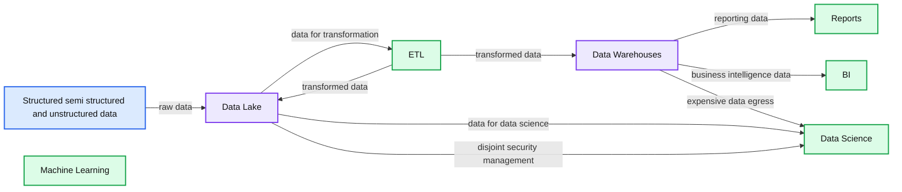
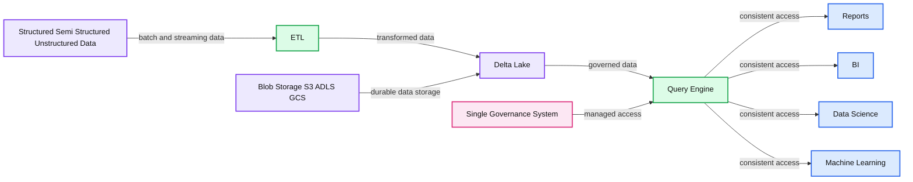

# Three Principles for Selecting Machine Learning Platforms

- Source: https://www.databricks.com/blog/2021/06/24/three-principles-for-selecting-machine-learning-platforms.html
- Published: 2021-06-24
- Authors: Joseph Bradley
- Categories: engineering, data-science-machine-learning
- Images: 3 total, 3 extracted as architecture

This blog post is the second in a series on ML platforms, operations, and governance. For the first post, see Rafi Kurlansik’s post on the["Need for Data-centric ML Platforms."](https://www.databricks.com/blog/2021/06/23/need-for-data-centric-ml-platforms.html)

I recently spoke with a  Sr. Director of Data Platforms at a cybersecurity company, who commented, “I don’t understand how you can be future-proof for machine learning since there’s such a mess of constantly changing tools out there.”  This is a common sentiment. Machine learning (ML) has progressed more rapidly than almost any other recent technology; libraries are often fresh from the research lab, and there are countless vendors advertising tools and platforms (Databricks included). Yet, as we talked, the platform director came to understand they were in a perfect position to future-proof the company’s data science (DS) and ML initiatives. **Their company needed a *****platform***** that could support ever-changing technology on top.**

In my years at Databricks, I’ve seen many organizations build data platforms to support DS & ML teams for the long term. The initial challenges commonly faced by these organizations can be grouped into a few areas: separation between their data platforms and ML tools, poor communication and collaboration between engineering and DS & ML teams, and past tech choices inhibiting change and growth. In this blog post, I have collected my high-level recommendations which guided these organizations as they selected new technologies and improved their DS & ML platforms. These common mistakes — and their solutions — are organized into three principles.

## Principle 1: Simplify data access for ML

DS and ML require easy access to data. Common barriers include proprietary data formats, data bandwidth constraints and governance misalignment.

One company I’ve worked with provides a representative example. This company had a data warehouse with clean data, maintained by data engineering. There were also data scientists working with business units, using modern tools like XGBoost and TensorFlow, but they could not easily get data from the warehouse into their DS & ML tools, delaying many projects. Moreover, the platform infrastructure team worried that data scientists had to copy data onto their laptops or workstations, opening up security risks. To address these frictions caused by their data warehouse-centric approach to ML, we broke down the challenges into three parts.

### Open data formats for Python and R

In this example, the first problem was the use of a proprietary data store. **Data warehouses use proprietary formats** and require an expensive data egress process to extract data for DS & ML. On the other side, DS & ML tools are commonly based on Python and R — not SQL — and expect open formats: Parquet, JSON, CSV, etc. on disk and Pandas or Apache Spark DataFrames in memory.  This challenge is exacerbated for unstructured data like images and audio, which do not fit naturally in data warehouses and require specialized libraries for processing.

**Re-architecting data management around Data Lake storage** (Azure ADLS, AWS S3, GCP GCS) allowed this company to consolidate data management for both data engineering and DS & ML, making it much easier for data scientists to access data. Data scientists could now use Python and R, loading data directly from primary storage to a DataFrame — allowing faster model development and iteration. They could also work with specialized formats like image and audio — unblocking new ML-powered product directions.

### Data bandwidth and scale

Beyond DS & ML-friendly formats, this company faced data bandwidth and scale challenges. Feeding an ML algorithm with data from a data warehouse can work for small data. But application logs, images, text, IoT telemetry and other **modern data sources can easily max out data warehouses**, becoming very expensive to store and impossibly slow to extract for DS & ML algorithms.

By making data lake storage their primary data layer, this company was **able to work with datasets 10x the size, while reducing costs** for data storage and movement. More historical data boosted their models’ accuracies, especially in handling rare outlier events.

### Unified data security and governance

Of the challenges this company faced from its previous data management system, the most complex and risky was in data security and governance. The teams managing data access were Database Admins, familiar with table-based access. But the **data scientists needed to export datasets** from these governed tables to get data into modern ML tools. The security concerns and ambiguity from this disconnect resulted in months of delays whenever data scientists needed access to new data sources.

These pain points led them towards selecting a more **unified platform that allowed DS & ML tools to access data under the same governance model** used by data engineers and database admins. Data scientists were able to load large datasets into Pandas and PySpark dataframes easily, and database admins could restrict data access based on user identity and prevent data exfiltration.

### Success in simplifying data access

**This customer made two key technical changes to simplify data access for DS & ML**: (1) using data lake storage as their primary data store and (2) implementing a shared governance model over tables and files backed by data lake storage. These choices led them towards a [lakehouse architecture](https://www.databricks.com/blog/2021/05/19/evolution-to-the-data-lakehouse.html), which took advantage of [Delta Lake](https://delta.io/) to provide data engineering with data pipeline reliability, data science with the open data formats they needed for ML and admins with the governance model they needed for security. With this modernized data architecture, the data scientists were able to show value on new use cases in less than half the time.

**Summary:** The diagram shows a previous architecture where structured and unstructured data enters a data lake, ETL feeds separate data warehouses, and downstream analytics and machine learning systems create costly data movement and disconnected security management.

**Components:**

- Structured, semi-structured and unstructured data using Parquet, Delta, JSON, CSV, JPG and DICOM
- Data Lake using mixed data formats
- ETL for data transformation and movement
- Data Warehouses for analytical storage
- Reports for reporting
- BI for business intelligence
- Data Science for analytical and ML workloads
- Machine Learning for model development and use

**Flows:**

- Structured, semi-structured and unstructured data -> Data Lake: raw data
- Data Lake -> ETL: data for extraction and transformation
- ETL -> Data Lake: transformed data
- ETL -> Data Warehouses: transformed data
- Data Warehouses -> Reports: reporting data
- Data Warehouses -> BI: business intelligence data
- Data Warehouses -> Data Science: expensive data egress
- Data Lake -> Data Science: data for data science
- Data Lake -> Data Science: disjoint management of data security

**Numbers:** none



<sub>source image: https://www.databricks.com/wp-content/uploads/2021/06/Three-Principles-for-Selecting-Machine-Learning-Platforms-blog-img-2.jpg</sub>

**Summary:** Lakehouse architecture centralizes structured, semi-structured, and unstructured data in blob storage with ETL, Delta Lake, and a query engine serving multiple data consumers.

**Components:**

- Reports
- BI
- Data Science
- Machine Learning
- ETL
- Query engine
- Delta Lake
- Structured data
- Semi-structured data
- Unstructured data
- Blob storage using S3, ADLS, and GCS
- Single governance system

**Flows:**

- Structured, semi-structured, and unstructured data -> ETL: batch and streaming ingestion
- ETL -> Delta Lake: transformed data
- Delta Lake -> Query engine: governed lakehouse data
- Query engine -> Reports: consistent data access
- Query engine -> BI: consistent data access
- Query engine -> Data Science: consistent data access
- Query engine -> Machine Learning: consistent data access
- Blob storage -> Delta Lake: low-cost durable storage

**Numbers:** 0 and 1



<sub>source image: https://www.databricks.com/wp-content/uploads/2021/06/Previous-architecture-combining-data-lake-and-data-warehouse-blog-img-3.jpg</sub>

A few of my favorite customer success stories on simplifying data access include:

- At [Outreach](https://www.databricks.com/customers/outreach), ML engineers used to waste time setting up pipelines to access data, but moving to a managed platform supporting both ETL and ML reduced this friction.

- At [Edmunds](https://www.databricks.com/customers/edmunds), data silos used to hamper data scientists’ productivity. Now, as Greg Rokita (Executive Director), said, “Databricks democratizes data, data engineering and machine learning, and allows us to instill data-driven principles within the organization.”
- At [Shell](https://www.databricks.com/customers/shell), Databricks democratized access to data and allowed advanced analytics on much larger data, including inventory simulations across all parts and facilities and recommendations for 1.5+ million customers.

## Principle 2: Facilitate collaboration between data engineering and data science

A data platform must simplify collaboration between data engineering and DS & ML teams, beyond the mechanics of data access discussed in the previous section. Common barriers are caused by these two groups using disconnected platforms for compute and deployment, data processing and governance.

A second customer of mine had a mature data science team but recognized that they were too disconnected from their data engineering counterparts. Data science had a DS-centric platform they liked, complete with notebooks, on-demand (cloud) workstations and support for their ML libraries. They were able to build new, valuable models, and data engineering had a process for hooking the models into Apache Spark-based production systems for batch inference. Yet this process was painful. While the data science team was familiar with using Python and R from their workstations, they were unfamiliar with the Java environment and cluster computing used by data engineering. These gaps led to an awkward handoff process: rewriting Python and R models in Java, checking to ensure identical behavior, rewriting featurization logic and manually sharing models as files tracked in spreadsheets. These practices caused months of delays, introduced errors in production and did not allow management oversight.

### Cross-team environment management

In the above example, the first challenge was environment management. **ML models are not isolated objects; their behavior depends upon their environment**, and model predictions can change across library versions. This customer’s teams were bending over backwards to replicate ML development environments in the data engineering production systems. The modern ML world requires Python (and sometimes R), so they needed tools for environment replication like virtualenv, conda and Docker containers.

Recognizing this requirement, they turned to [MLflow](https://mlflow.org/), which uses these tools under the hood but **shields data scientists from the complexity of environment management**. With MLflow, their data scientists shaved over a month off of productionization delays and worried less about upgrading to the latest ML libraries.

**Summary:** The diagram shows an ML workflow from data preparation and model development through MLflow tracking, model registration, and deployment.

**Components:**

- Data sources: databases, documents, images, audio, and video
- Data prep and featurization: Notebooks, Delta Lake, and Databricks Jobs
- Model development: TensorFlow, Spark, PyTorch, scikit-learn, XGBoost, Keras, H2O.ai, custom libraries, and Databricks ML Runtime
- MLflow Tracking: parameters, metrics, metadata, and models
- MLflow Model Registry: Staging and Production model versions
- MLflow deployment: Apache Spark, Kubernetes, Azure Machine Learning, Amazon SageMaker, and MLflow Serving

**Flows:**

- Data sources -> Data prep and featurization: raw data
- Data prep and featurization -> Model development: prepared features
- Model development -> MLflow Tracking: models and environment information
- MLflow Tracking -> MLflow Model Registry: tracked models and metadata
- MLflow Model Registry -> MLflow deployment: promoted production models
- Staging -> Production: promoted model versions

**Numbers:** v1, v2

```text
%% mermaid failed to render; kept as text
%% Machine learning workflow from data preparation to deployment
flowchart LR
    A[Data sources] -->|raw data| B[Data prep and featurization]
    B -->|prepared features| C[Model development]
    C -->|models and environment info| D[MLflow Tracking]
    D -->|tracked models and metadata| E[MLflow Model Registry]
    E -->|promoted production models| F[MLflow deployment]
    E -->|model promotion| G[Staging to Production]

    class A external
    class B,C,D,F service
    class E store
    class G decision

    classDef client fill:#dbeafe,stroke:#2563eb,stroke-width:2px,color:#111
    classDef service fill:#dcfce7,stroke:#16a34a,stroke-width:2px,color:#111
    classDef store fill:#ede9fe,stroke:#7c3aed,stroke-width:2px,color:#111
    classDef cache fill:#fef3c7,stroke:#d97706,stroke-width:2px,color:#111
    classDef queue fill:#cffafe,stroke:#0891b2,stroke-width:2px,color:#111
    classDef critical fill:#fee2e2,stroke:#dc2626,stroke-width:4px,color:#111
    classDef external fill:#e5e7eb,stroke:#6b7280,stroke-width:2px,color:#111,stroke-dasharray:4 3
    classDef decision fill:#fce7f3,stroke:#db2777,stroke-width:2px,color:#111
    client = clients edge gateway LB
    service = stateless compute
    store = databases durable storage
    cache = Redis CDN or anything losable
    queue = Kafka streams or async pipes
    critical = bottleneck or SPOF
    external = third-party
    decision = trade-off point
```

<sub>source image: https://www.databricks.com/wp-content/uploads/2021/06/Three-Principles-for-Selecting-Machine-Learning-Platforms-blog-img-1.jpg</sub>

### Data preparation to featurization

For DS & ML, good data is everything, and **the line between ETL/ELT (often owned by data engineers) and featurization (often owned by data scientists) is arbitrary**. For this customer, when data scientists needed new or improved features in production, they would request data engineers to update pipelines. Long delays sometimes caused wasted work when business priorities changed during the wait.

When selecting a new platform, they looked for tools to support the handoff of data processing logic. In the end, they selected Databricks Jobs as the hand-off point: data scientists could wrap Python and R code into units (Jobs), and data engineering could deploy them, using their existing orchestrator (Apache AirFlow) and CI/CD system (Jenkins). **The new process of updating featurization logic was almost fully automated.**

### Sharing machine learning models

ML models are essentially vast amounts of data and business goals distilled into concise business logic. As I worked with this customer, **it felt ironic and frightening to me that such valuable assets were being stored and shared without proper governance**. Operationally, the lack of governance led to laborious, manual processes for production (files and spreadsheets), as well as less oversight from team leads and directors.

It was game-changing for them to move to a managed MLflow service, which provided mechanisms for sharing ML models and moving to production, all secured under access controls in a single Model Registry. **Software enforced and automated previously manual processes, and management could oversee models as they moved towards production.**

### Success in facilitating collaboration

This customer’s key technology choices for facilitating collaboration were around a unified platform that supports both data engineering and data science needs with shared governance and security models. With Databricks, some of the key technologies that enabled their use cases were the [Databricks Runtime](https://docs.databricks.com/runtime/index.html) and cluster management for their compute and environment needs, jobs for defining units of work ([AWS](https://docs.databricks.com/jobs.html)/[Azure](https://docs.microsoft.com/en-us/azure/databricks/jobs)/[GCP](https://docs.gcp.databricks.com/jobs.html) docs), open APIs for [orchestration](https://www.databricks.com/glossary/orchestration) ([AWS](https://docs.databricks.com/dev-tools/data-pipelines.html#)/[Azure](https://docs.microsoft.com/en-us/azure/databricks/dev-tools/data-pipelines)/[GCP](https://docs.gcp.databricks.com/dev-tools/data-pipelines.html#) docs) and CI/CD integration ([AWS](https://docs.databricks.com/dev-tools/ci-cd/index.html)/[Azure](https://docs.microsoft.com/en-us/azure/databricks/dev-tools/ci-cd/ci-cd-azure-devops)/[GCP](https://docs.gcp.databricks.com/dev-tools/ci-cd/index.html) docs), and [managed MLflow](https://www.databricks.com/product/managed-mlflow) for [MLOps](https://www.databricks.com/glossary/mlops) and governance.

Customer success stories specific to collaboration between data engineering and data science include:

- [Condé Nast](https://www.databricks.com/customers/conde_nast) benefited from breaking down walls between teams managing data pipelines and teams managing advanced analytics. As Paul Fryzel (Principal Engineer of AI Infrastructure) said, “Databricks has been an incredibly powerful end-to-end solution for us. It’s allowed a variety of different team members from different backgrounds to quickly get in and utilize large volumes of data to make actionable business decisions.”
- At [Iterable](https://www.databricks.com/customers/iterable), disconnects between data engineering and data science teams prevented training and deploying ML models in a repeatable manner. By moving to a platform shared across teams that streamlined the ML lifecycle, their data teams simplified reproducibility for models and processes.
- At [Showtime](https://www.databricks.com/customers/showtime), ML development and deployment were manual and error-prone until migrating to a managed MLflow-based platform. Databricks removed operational overhead from their workflows, reducing time-to-market for new models and features.

## Principle 3: Plan for change

Organizations and technology will change. Data sizes will grow; team skill sets and goals will evolve; and technologies will develop and be replaced over time. An obvious, but common, strategic error is not planning for scale. Another common but more subtle error is selecting non-portable technologies for data, logic and models.

I’ll share a third customer story to illustrate this last principle. I worked with an early stage customer who hoped to create ML models for content classification. They chose Databricks but relied heavily on our professional services due to lack of expertise. A year later, having shown some initial value for their business, they were able to hire more expert data scientists and had meanwhile collected almost 50x more data. They needed to scale, to switch to distributed ML libraries, and to integrate more closely with other data teams.

### Planning for scaling

As this customer found, **data, models, and organizations will scale over time**. Their data could originally have fit within a data warehouse, but it would have required migration to a different architecture as the data size and analytics needs grew. Their DS & ML teams could have worked on laptops initially, but a year later, they needed more powerful clusters. By planning ahead with a Lakehouse architecture and a platform supporting both single-machine and distributed ML, this organization prepared a smooth path for rapid growth.

### Portability and the “build vs. buy” decision

Portability is a more subtle challenge. **Tech strategy is sometimes oversimplified into a “build vs. buy” decision**, such as “building an in-house platform using open source technologies can allow customization and avoid lock-in, whereas buying a ready-made, proprietary toolset can allow faster setup and progress.” This argument presents an unhappy choice: either make a huge up-front investment in a custom platform or get locked in to a proprietary technology.

However, that argument is misleading, for it does not **distinguish between data platform and infrastructure, on the one hand, and project-level data technology, on the other**. Data storage layers, orchestration tools and metadata services are common platform-level technology choices; data formats, languages and ML libraries are common project-level technology choices. These two types of choices should be handled differently when planning for change. It helps to think of the data platform and infrastructure as the generic containers and pipelines for a company’s specialized data, logic and models.

### Planning for project-level technology changes

**Project-level technologies should be simple to swap in and out**. New data- and ML-powered products may have different requirements, requiring new data sources, ML libraries or service integrations. Flexibility in changing these project-level technology choices allows a business to adapt and be competitive.

The platform must allow this flexibility and, ideally, encourage teams to avoid proprietary tools and formats for data and models. For my customer, though they began with scikit-learn, they were able to switch to Spark ML and distributed TensorFlow without changing their platform or MLOps tools.

### Planning for platform changes

**Platforms should allow portability**. For a platform to serve a company long-term, the platform must avoid lock-in: moving data, logic and models to and from the platform must be simple and inexpensive. When data platforms are not a company’s core mission and strength, it makes sense for the organization to buy a platform to move faster — as long as that platform allows the company to stay nimble and move its valuable assets elsewhere when needed.

For my customer, selecting a platform that allowed them to use open tools and APIs like scikit-learn, Spark ML and MLflow helped in two ways. First, it simplified the platform decision by giving them confidence that the decision was reversible. Second, they were able to integrate with other data teams by moving code and models to and from other platforms.

| **Type of change** | **Platform needs** | **Project-level technology examples** |
|---|---|---|
| **Scaling** | Process both small and big data efficiently. Provide single-node and distributed compute. | Scale pandas → Apache Spark or Koalas. Scale scikit-learn → Spark ML.Scale Keras → Horovod. |
| **New data types and application domains ** | Support arbitrary data types and open data formats. Support both batch and streaming.Integrate easily with other systems. | Use and combine Delta, Parquet, JSON, CSV, TXT, JPG, DICOM, MPEG, etc. Stream data from web app backends. |
| **New personas and orgs** | Support data scientists, data engineers, and business analysts. Provide scalable governance and access controls. | Visualize data in both (a) plotly in notebooks and (b) dashboards in pluggable BI tools. Run ML via both (a) custom code and (b) AutoML. |
| **Change of platform** | User owns their data and ML models; no egress tax. User owns their code; sync with git. | Use open code APIs such as Keras and Spark ML to keep project-level workloads independent of the platform. |

### Success in planning for change

This customer’s key technology choices that allowed them to adapt to change were a [lakehouse architecture](https://www.databricks.com/blog/2020/01/30/what-is-a-data-lakehouse.html), a [platform](https://www.databricks.com/product/data-lakehouse) supporting both single-machine and distributed ML, and [MLflow](https://mlflow.org/) as a library-agnostic framework for MLOps. These choices simplified their path of scaling data by 50x, switching to more complex ML models, and scaling their team and its skill sets.

Some of my top picks for customer success stories on change planning and portability are:

- At [Edmunds](https://www.databricks.com/customers/edmunds), data teams needed infrastructure that supported data processing and ML requirements, such as the latest ML frameworks. Maintaining this infrastructure on their own required significant DevOps effort. The Databricks managed platform provided flexibility, while reducing the DevOps overhead.
- As [Quby](https://www.databricks.com/company/newsroom/press-releases/quby-relies-on-databricks-for-collaborative-approach-to-analysis-of-internet-of-things-data) experienced data growth to multiple petabytes and the number of ML models grew to 1+ million, legacy data infrastructure could not scale or run reliably. Migrating to Delta Lake and MLflow provided the needed scale, and migration was simplified since Databricks supported the variety of tools needed by the data engineering and data science teams.
- Data teams at [Shell](https://www.databricks.com/customers/shell) range widely both in skills and in analytics projects (160 AI projects with more coming). With Databricks as one of the foundational components of the Shell.ai platform, Shell has the flexibility needed to handle current and future data needs.

## Applying the principles

It’s easy to list out big principles and say, “go do it!”  But implementing them requires candid assessments of your tech stack, organization and business, followed by planning and execution. Databricks offers a wealth of experience in building data platforms to support DS & ML.

**The most successful organizations we work with follow a few best practices**: They recognize that long-term architectural planning should happen concurrently with short-term demonstrations of impact and value. That value is communicated to executives by aligning data science teams with business units and their prioritized use cases. Cross-organization alignment helps to guide organizational improvements, from simplifying processes to creating Centers of Excellence (CoE).

This blog post is just scratching the surface of these topics. Some other great material includes:

- [Data + AI Summit 2021 keynotes](https://youtu.be/zQEiwJqqeeA): These announce the release of [Databricks Machine Learning](https://www.databricks.com/product/machine-learning), a data-native and collaborative ML solution for the full ML lifecycle.
- [Building Machine Learning Platforms](https://www.databricks.com/p/webinar/building-machine-learning-platforms): Recorded webinar including Matei Zaharia (CTO and co-founder, Databricks), Ben Lorica (Chief Data Scientist, Databricks), and Clemens Mewald (Director, Product Management, Data Science and ML, Databricks)
- [MLOps Virtual Event: Operationalizing machine learning at scale](https://www.databricks.com/p/webinar/operationalizing-machine-learning-at-scale): Recorded webinar including Matei Zaharia (CTO and co-founder, Databricks) and invited speakers from H&M, J.B. Hunt Transport, and Artis Consulting
- Databricks pages for [Data Science Solutions](https://www.databricks.com/product/data-science) and [Managed MLflow](https://www.databricks.com/product/managed-mlflow)

*The next post will be a deep dive into ML Ops---how to monitor and manage your models post-deployment and how to leverage the full Databricks platform to close the loop on a model’s lifecycle.*
