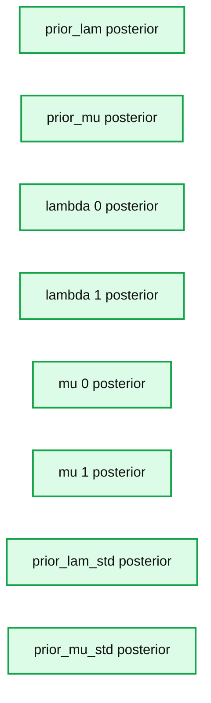
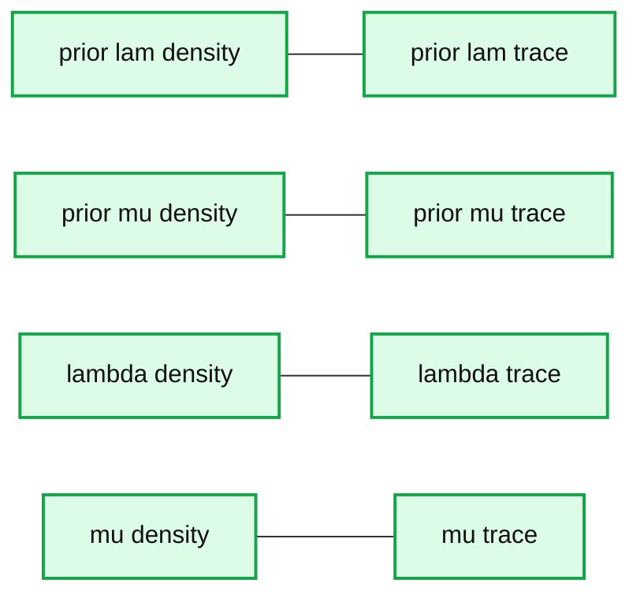
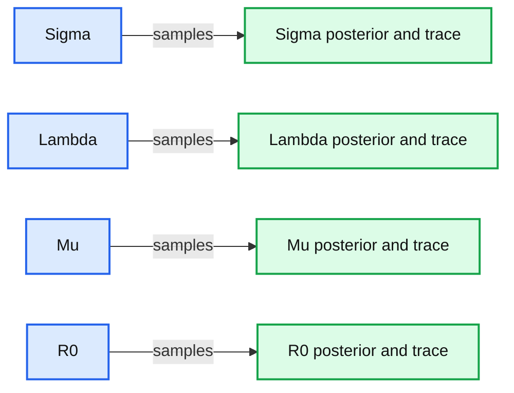
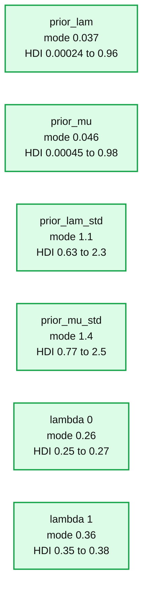
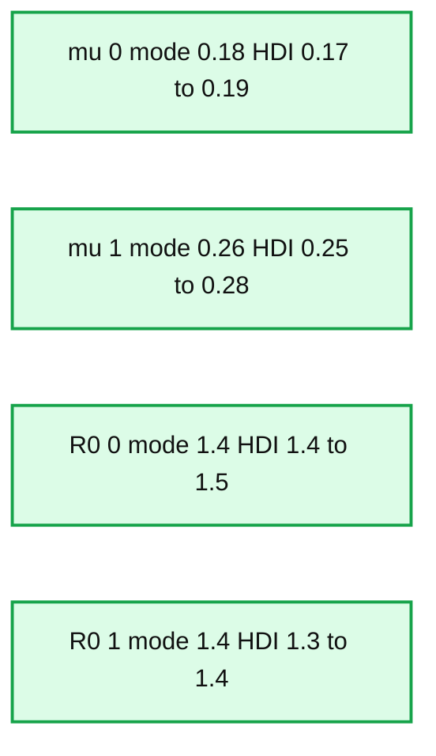
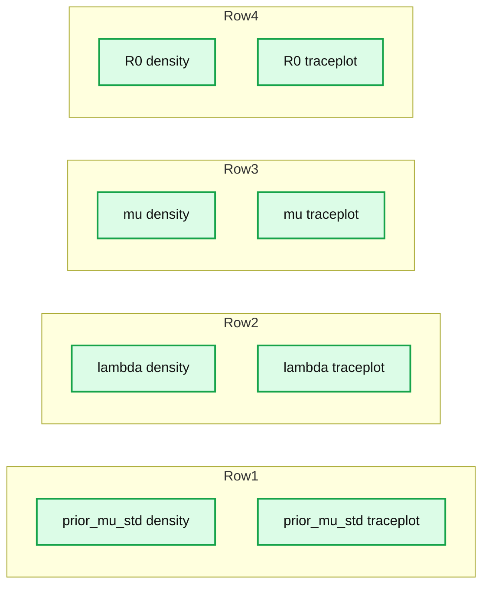

# Using Bayesian Hierarchical Models to Infer the Disease Parameters of COVID-19

- Source: https://www.databricks.com/blog/2021/06/29/using-bayesian-hierarchical-models-to-infer-the-disease-parameters-of-covid-19.html
- Published: 2021-06-29
- Authors: Srijith Rajamohan, Ph.D.
- Categories: engineering, data-science-machine-learning
- Images: 13 total, 9 extracted as architecture

In a previous post, we looked at how to use [PyMC3 to model the disease dynamics of COVID-19](https://www.databricks.com/blog/2021/01/06/bayesian-modeling-of-the-temporal-dynamics-of-covid-19-using-pymc3.html). This post builds on this use case and explores how to use Bayesian hierarchical models to infer COVID-19 disease parameters and the benefits compared to a pooled or an unpooled model. We fit an [SIR model](https://mathworld.wolfram.com/SIRModel.html) to synthetic data, generated from the Ordinary Differential Equation (ODE), in order to estimate the disease parameters such as *R**0*. We then show how this framework can be applied to a real-life dataset (i.e. the number of infections per day for various countries). We conclude with the limitations of this model and outline the steps for improving the inference process.

I have also launched a series of courses on Coursera covering this topic of Bayesian modeling and inference, courses 2 and 3 are particularly relevant to this post. Check them out on the [Coursera Databricks Computational Statistics course page](https://www.coursera.org/specializations/compstats).

## The SIR model

The SIR model, as shown in our previous post to model COVID-19, includes the set of three Ordinary Differential Equations (ODEs). There are three compartments in this model: S, I and R.

Here ‘S’, ‘I’ and ‘R’ refer to the susceptible, infected and recovered portions of the population of size ‘N’ such that

 

**S + I + R = N**

 

The assumption here is that once you have recovered from the disease, lifetime immunity is conferred on an individual. This is not the case for a lot of diseases and, hence, may not be a valid model.

λ is the rate of infection and μ is the rate of recovery from the disease. The fraction of people who recover from the infection is given by ‘f’ but for the purpose of this work, ‘f’ is set to 1 here. We end up with an Initial Value Problem (IVP) for our set of ODEs, where I(0) is assumed to be known from the case counts at the beginning of the pandemic and S(0) can be estimated as N - I(0). Here we make the assumption that the entire population is susceptible. Our goal is to accomplish the following:

- Use Bayesian Inference to make estimates about λ and μ
- Use the above parameters to estimate I(t) for any time ‘t’
- Compute *R**0*

## Pooled, unpooled and hierarchical models

Suppose you have information regarding the number of infections from various states in the United States. One way to use this data to infer the disease parameters of COVID-19 (e.g. *R**0*) is to sum it all up to estimate a single parameter. This is called a *pooled model*. However, the problem with this approach is that fine-grained information that might be contained in these individual states or groups is lost. The other extreme would be to estimate an individual parameter *R**0* per state. This approach results in an *unpooled model*. However, considering that we are trying to estimate the parameters corresponding to the same virus, there has to be a way to perform this collectively, which brings us to the *hierarchical model*. This is particularly useful when there isn’t sufficient information in certain states to create accurate estimates. Hierarchical models allow us to share the information from other states using a shared ‘hyperprior’. Let us look at this formulation in more detail using the example for λ :

For a pooled model, we can draw λ from a single distribution with fixed parameters λμ, λσ.

For an unpooled model, we can draw each λ with fixed parameters λμ, λι.

For a hierarchical model, we have a prior that is parameterized by non-constant parameters drawn from other distributions. Here, we draw λs for each state, however, they are connected through shared hyperprior distributions as shown below.

Check out course 3 *Introduction to PyMC3 for Bayesian Modeling and Inference* in the recently-launched Coursera specialization on hierarchical models.

## Hierarchical models on synthetic data

To implement and illustrate the use of hierarchical models, we generate data using the set of ODEs that define the SIR model. These values are generated at preset timesteps; here the time interval is 0.25. We also select two groups for ease of illustration, however, one can have as many groups as needed. The values for λ and μ are set as [4.0, 3.0] and [1.0, 2.0] respectively for the two groups. The code to generate this along with the resulting time-series curves are shown below.

### Generate synthetic data

 

**Summary:** Two stacked SIR-model time-series plots compare susceptible S t and infected I t curves with observed data points.

**Components:**

- Upper SIR time-series panel
- Lower SIR time-series panel
- Susceptible S t curve
- Infected I t curve
- Susceptible observations
- Infected observations

**Flows:**

- none

**Numbers:**

- X-axis ticks: 0, 1, 2, 3, 4
- Y-axis ticks: 0.0, 0.2, 0.4, 0.6, 0.8, 1.0
- Lower-panel visible value: approximately 1.1

source image: https://www.databricks.com/wp-content/uploads/2021/06/Hierarchical-Model-COVID-blog-img-9.jpg

### Performing inference using a hierarchical model

 

**Summary:** Posterior distributions and 94% highest density intervals for eight Bayesian model variables.

**Components:**

- prior_lam posterior distribution
- prior_mu posterior distribution
- lambda 0 posterior distribution
- lambda 1 posterior distribution
- mu 0 posterior distribution
- mu 1 posterior distribution
- prior_lam_std posterior distribution
- prior_mu_std posterior distribution

**Flows:**

- none

**Numbers:** 94%; means 5, 2, 3.6, 2.7, 0.94, 1.8, 1.6, 0.7; interval endpoints 4.98 and 5.02, 1.98 and 2.02, 3.5 and 3.6, 2.4 and 3, 0.93 and 0.96, 1.7 and 2, 0.82 and 2.4, 0.34 and 1.1; axis ticks 4.96, 4.98, 5.00, 5.02, 5.04, 1.96, 1.97, 1.98, 1.99, 2.00, 2.01, 2.02, 2.03, 2.04, 3.45, 3.50, 3.55, 3.60, 3.65, 2.0, 2.2, 2.4, 2.6, 2.8, 3.0, 3.2, 0.92, 0.94, 0.96, 0.98, 1.4, 1.5, 1.6, 1.7, 1.8, 1.9, 2.0, 2.1, 2.2, 0.5, 1.0, 1.5, 2.0, 2.5, 3.0, 3.5, 4.0, 0.5, 1.0, 1.5, 2.0, 2.5; labels lambda 0, lambda 1, mu 0, mu 1

source image: https://www.databricks.com/wp-content/uploads/2021/06/Hierarchical-Model-COVID-blog-img-10.jpg

**Summary:** Trace and density plots show posterior distributions and sampling traces for prior lam, prior mu, lambda, and mu.

**Components:**

- prior lam density plot
- prior lam trace plot
- prior mu density plot
- prior mu trace plot
- lambda density plot
- lambda trace plot
- mu density plot
- mu trace plot

**Flows:**

- none

**Numbers:** 0, 0.8, 1.0, 1.2, 1.4, 1.5, 1.6, 1.8, 1.96, 1.97, 1.98, 1.99, 2.0, 2.00, 2.01, 2.02, 2.03, 2.04, 2.2, 2.4, 2.5, 2.6, 2.7, 2.8, 3.0, 3.2, 3.4, 3.5, 3.6, 2000, 4000, 6000, 8000

source image: https://www.databricks.com/wp-content/uploads/2021/06/Hierarchical-Model-COVID-blog-img-11.jpg

**Summary:** Posterior density and MCMC trace plots show inferred distributions and sampling convergence for sigma, lambda, mu, and R0.

**Components:**

- Sigma posterior density using Bayesian hierarchical inference
- Lambda posterior density using Bayesian hierarchical inference
- Mu posterior density using Bayesian hierarchical inference
- R0 posterior density using Bayesian hierarchical inference
- Posterior density plots with 95% HDI markers
- MCMC trace plots across sampling iterations

**Flows:**

- MCMC samples -> Posterior density plots: parameter distributions
- MCMC samples -> Trace plots: sampled values across iterations

**Numbers:**

- Sigma mean 0.00031
- Sigma 95% HDI 0.00026 to 0.00036
- Sigma x-axis 0.000250, 0.000275, 0.000300, 0.000325, 0.000350, 0.000375, 0.000400, 0.000425
- Lambda mean 0.047
- Lambda 95% HDI 0.043 to 0.051
- Lambda x-axis 0.038, 0.040, 0.042, 0.044, 0.046, 0.048, 0.050, 0.052, 0.054
- Mu mean 0.038
- Mu 95% HDI 0.034 to 0.041
- Mu x-axis 0.030, 0.032, 0.034, 0.036, 0.038, 0.040, 0.042, 0.044
- R0 mean 1.25
- R0 95% HDI 1.23 to 1.27
- R0 x-axis 1.23, 1.24, 1.25, 1.26, 1.27, 1.28, 1.29, 1.30
- Trace iterations 0, 1000, 2000, 3000, 4000
- Trace plot y-axis values approximately 0.0002 to 0.0004, 0.030 to 0.050, and 1.225 to 1.300
- 95%
- 4 parameters

source image: https://www.databricks.com/wp-content/uploads/2021/06/Hierarchical-Model-COVID-blog-img-13.jpg

## Real-life COVID-19 data

The data used here is obtained from the [Johns Hopkins CSSE Github page](https://github.com/CSSEGISandData/COVID-19/tree/master/csse_covid_19_data/csse_covid_19_time_series) where case counts are regularly updated. Here we plot and use the case count of infections-per-day for two countries, the United States and Brazil. However, there is no limitation on either the choice or number of countries that can be used in a hierarchical model. The cases below are from Mar 1, 2020 to Jan 1, 2021. The graphs seem to follow a similar trajectory, even though the scales on the *y-axis* are different for these countries. Considering that these cases are from the same COVID-19 virus, this is reasonable. However, there are differences to account for, such as the different variants, different geographical structures and social distancing rules, healthcare infrastructure and so on.

**Summary:** Two cumulative COVID-19 case trajectories are plotted over time for different countries, with distinct y-axis scales.

**Components:**

- Upper country case-count time series
- Lower country case-count time series

**Flows:**

- none

**Numbers:** 1e7; y-axis upper plot: 0.00, 0.25, 0.50, 0.75, 1.00, 1.25, 1.50, 1.75, 2.00; y-axis lower plot: 0, 250000, 500000, 750000, 1000000, 1250000, 1500000, 1750000; dates: 2020-03, 2020-04, 2020-05, 2020-06, 2020-07, 2020-08, 2020-09, 2020-10, 2020-11, 2020-12, 2021-01

source image: https://www.databricks.com/wp-content/uploads/2021/06/Hierarchical-Model-COVID-blog-img-15.jpg

### Inference of parameters

The sampled posterior distributions are shown below, along with their 94% Highest Density Interval (HDI).

**Summary:** Posterior distributions for six inferred COVID-19 model parameters, each showing its mode and 94% HDI.

**Components:**

- prior_lam posterior distribution
- prior_mu posterior distribution
- prior_lam_std posterior distribution
- prior_mu_std posterior distribution
- lambda 0 posterior distribution
- lambda 1 posterior distribution
- mu 0 posterior distribution
- mu 1 posterior distribution
- R0 0 posterior distribution

**Flows:**

- none

**Numbers:**

- prior_lam: mode 0.037; HDI 0.00024 to 0.96
- prior_mu: mode 0.046; HDI 0.00045 to 0.98
- prior_lam_std: mode 1.1; HDI 0.63 to 2.3
- prior_mu_std: mode 1.4; HDI 0.77 to 2.5
- lambda 0: mode 0.26; HDI 0.25 to 0.27
- lambda 1: mode 0.36; HDI 0.35 to 0.38
- x-axis ticks: 0, 1, 2, 3, 4, 5, 6, 7
- x-axis ticks: 0.24, 0.25, 0.26, 0.27
- x-axis ticks: 0.33, 0.34, 0.35, 0.36, 0.37, 0.38, 0.39, 0.40
- x-axis ticks: 1, 2, 3, 4

source image: https://www.databricks.com/wp-content/uploads/2021/06/Hierarchical-Model-COVID-blog-img-20.jpg

**Summary:** Posterior distributions and 94% highest density intervals for four inferred COVID-19 disease parameters.

**Components:**

- mu 0 posterior distribution plot using Bayesian statistical inference
- mu 1 posterior distribution plot using Bayesian statistical inference
- R0 0 posterior distribution plot using Bayesian statistical inference
- R0 1 posterior distribution plot using Bayesian statistical inference

**Flows:**

- none visible

**Numbers:** 94%, mode 0.18, interval endpoints 0.17 and 0.19, x-axis ticks 0.155, 0.160, 0.165, 0.170, 0.175, 0.180, 0.185, 0.190, 0.195; mode 0.26, interval endpoints 0.25 and 0.28, x-axis ticks 0.24, 0.25, 0.26, 0.27, 0.28, 0.29, 0.30, 0.31; mode 1.4, interval endpoints 1.4 and 1.5, x-axis ticks 1.42, 1.44, 1.46, 1.48, 1.50; mode 1.4, interval endpoints 1.3 and 1.4, x-axis ticks 1.32, 1.34, 1.36, 1.38, 1.40

source image: https://www.databricks.com/wp-content/uploads/2021/06/Hierarchical-Model-COVID-blog-img-21.jpg

We can also inspect the traceplots for convergence, which shows good mixing in all the variables – a good sign that the sampler has explored the space well. There is good agreement between all the traces. This behavior can be confirmed with the fairly narrow HDI intervals in the plots above.

**Summary:** Posterior density plots and MCMC traceplots for prior_mu_std, lambda, mu, and R0.

**Components:**

- prior_mu_std density plot and traceplot, technology not shown
- lambda density plot and traceplot, technology not shown
- mu density plot and traceplot, technology not shown
- R0 density plot and traceplot, technology not shown

**Flows:**

- none visible

**Numbers:** 0, 1, 2, 3, 4, 1000, 2000, 3000, 4000, 5000, 6000, 7000, 0.15, 0.16, 0.17, 0.18, 0.19, 0.20, 0.22, 0.24, 0.25, 0.26, 0.27, 0.28, 0.30, 0.32, 0.325, 0.35, 0.375, 0.40, 1.300, 1.325, 1.350, 1.375, 1.400, 1.425, 1.450, 1.475, 1.500, 130, 135, 140, 145, 150

source image: https://www.databricks.com/wp-content/uploads/2021/06/Hierarchical-Model-COVID-blog-img-23.jpg

 

The table below summarizes the distributions of the various inferred variables and parameters, along with the sampler statistics. While estimates about the variables are essential, this table is particularly useful for informing us about the quality and efficiency of the sampler. For example, the Rhat is all equal to 1, indicating good agreement between all the chains. The effective sample size is another critical metric. If this is small compared to the total number of samples, that is a sure sign of trouble with the sampler. Even if the Rhat values look good, be sure to inspect the effective sample size!

**Summary:** Table of inferred COVID-19 disease parameter distributions and sampler diagnostics.

**Components:**

- prior_lam: inferred prior lambda distribution
- prior_mu: inferred prior mu distribution
- prior_lam_std: inferred prior lambda standard deviation
- prior_mu_std: inferred prior mu standard deviation
- lambda[0]: inferred lambda parameter
- lambda[1]: inferred lambda parameter
- mu[0]: inferred mu parameter
- mu[1]: inferred mu parameter
- R0[0]: inferred basic reproduction number
- R0[1]: inferred basic reproduction number
- Sampling statistics: mean, standard deviation, HDI, MCSE, effective sample size, and Rhat

**Flows:**

- none

**Numbers:**

- prior_lam: mean 0.320, sd 0.363, hdi_3% 0.000, hdi_97% 0.961, mcse_mean 0.002, mcse_sd 0.001, ess_bulk 39707.0, ess_tail 30770.0, r_hat 1.0
- prior_mu: mean 0.327, sd 0.369, hdi_3% 0.000, hdi_97% 0.979, mcse_mean 0.002, mcse_sd 0.001, ess_bulk 39024.0, ess_tail 29306.0, r_hat 1.0
- prior_lam_std: mean 1.388, sd 0.471, hdi_3% 0.635, hdi_97% 2.283, mcse_mean 0.002, mcse_sd 0.002, ess_bulk 44750.0, ess_tail 37652.0, r_hat 1.0
- prior_mu_std: mean 1.554, sd 0.475, hdi_3% 0.767, hdi_97% 2.461, mcse_mean 0.002, mcse_sd 0.002, ess_bulk 45651.0, ess_tail 40146.0, r_hat 1.0
- lambda[0]: mean 0.257, sd 0.005, hdi_3% 0.247, hdi_97% 0.267, mcse_mean 0.000, mcse_sd 0.000, ess_bulk 26230.0, ess_tail 23397.0, r_hat 1.0
- lambda[1]: mean 0.361, sd 0.008, hdi_3% 0.346, hdi_97% 0.377, mcse_mean 0.000, mcse_sd 0.000, ess_bulk 30948.0, ess_tail 30325.0, r_hat 1.0
- mu[0]: mean 0.177, sd 0.005, hdi_3% 0.167, hdi_97% 0.186, mcse_mean 0.000, mcse_sd 0.000, ess_bulk 26271.0, ess_tail 23627.0, r_hat 1.0
- mu[1]: mean 0.265, sd 0.008, hdi_3% 0.250, hdi_97% 0.280, mcse_mean 0.000, mcse_sd 0.000, ess_bulk 30875.0, ess_tail 31322.0, r_hat 1.0
- R0[0]: mean 1.451, sd 0.011, hdi_3% 1.430, hdi_97% 1.472, mcse_mean 0.000, mcse_sd 0.000, ess_bulk 28516.0, ess_tail 27176.0, r_hat 1.0
- R0[1]: mean 1.364, sd 0.011, hdi_3% 1.343, hdi_97% 1.385, mcse_mean 0.000, mcse_sd 0.000, ess_bulk 34228.0, ess_tail 38344.0, r_hat 1.0

source image: https://www.databricks.com/wp-content/uploads/2021/06/Hierarchical-Model-COVID-blog-img-24.jpg

Although this yielded satisfactory estimates for our parameters, often we run into the issue of the sampler not performing effectively. In the next post of this series, we will look at a few ways to diagnose the issues and improve the modeling process. These are listed, in increasing order of difficulty, below:

1. Increase the tuning size and the number of samples drawn.
2. Decrease the target_accept parameter for the sampler so as to reduce the autocorrelation among the samples. Use the autocorrelation plot to confirm this.
3. Add more samples to the observed data, i.e. increase the sample frequency.
4. Use better priors and hyperpriors for the parameters.
5. Use an alternative parameterization of the model.
6. Incorporate changes such as social-distancing measures into the model.

You can learn more about these topics at my Coursera specialization that consists of the following courses:

1. Introduction to Bayesian Statistics
2. Bayesian Inference with MCMC
3. Introduction to PyMC3 for Bayesian Modeling and Inference

 

[SEE THE COURSE LISTINGS](https://www.coursera.org/specializations/compstats)
