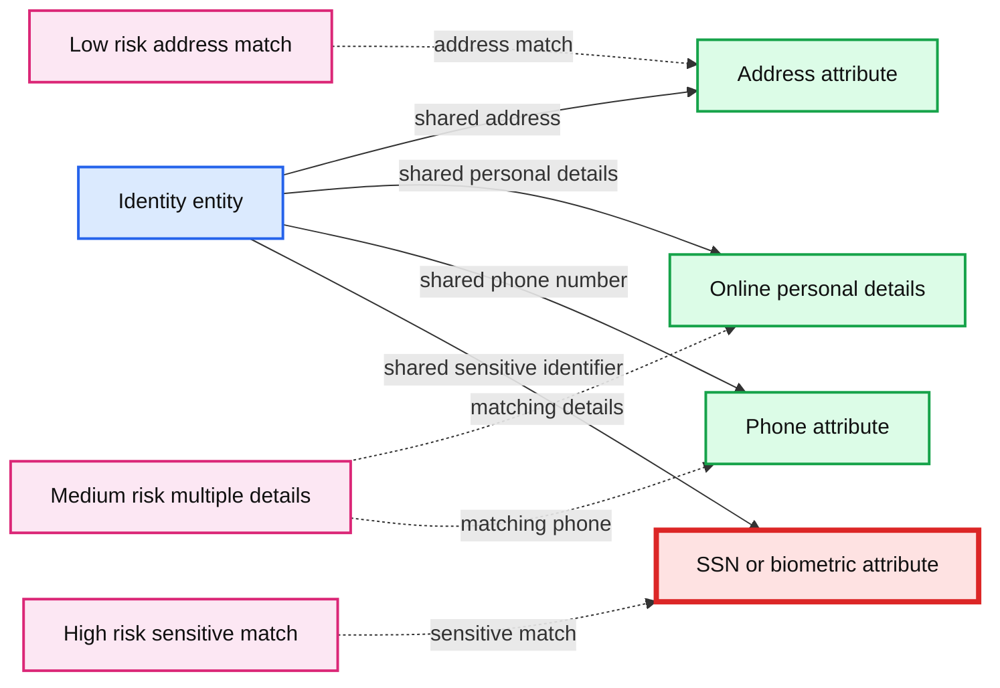
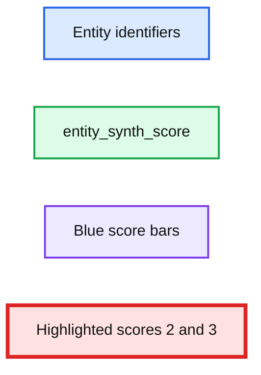
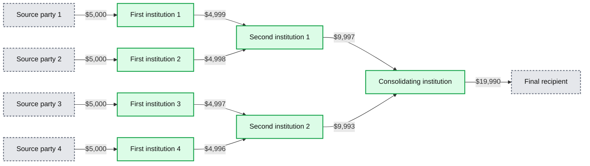
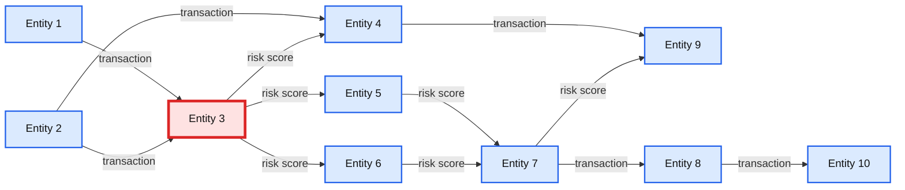
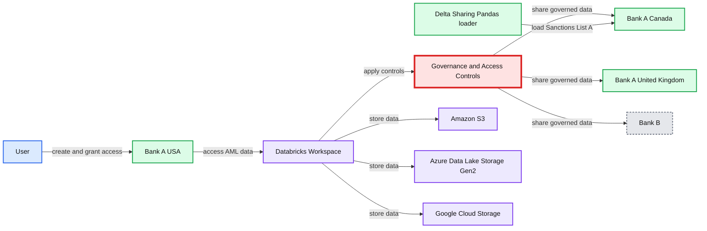

# AML Solutions at Scale Using Databricks Lakehouse Platform

- Source: https://www.databricks.com/blog/2021/07/16/aml-solutions-at-scale-using-databricks-lakehouse-platform.html
- Published: 2021-07-16
- Authors: Sri Ghattamaneni, Ricardo Portilla, Anindita Mahapatra
- Categories: engineering, open-source, data-science-machine-learning, solution-accelerators
- Images: 12 total, 6 extracted as architecture

Anti-Money Laundering (AML) compliance has been undoubtedly one of the top agenda items for regulators providing oversight of financial institutions across the globe. As AML evolved and became more sophisticated over the decades, so have the regulatory requirements designed to counter modern money laundering and terrorist financing schemes. The [Bank Secrecy Act of 1970](https://en.wikipedia.org/wiki/Bank_Secrecy_Act) provided guidance and framework for financial institutions to put in proper controls to monitor financial transactions and report suspicious fiscal activity to relevant authorities. This law provided set the framework for how financial institutes combat money laundering and financial terrorism.

## Why anti-money laundering is so complex

Current AML operations bear little resemblance to those of the last decade. The shift to digital banking, with financial institutions (FI's) processing billions of transactions daily, has resulted in the ever increasing  scope of money laundering,  even with stricter transaction  monitoring systems and robust Know Your Customer (KYC) solutions. In this blog, we  share our experiences working with our FI customers to build  enterprise-scale AML solutions on the  [lakehouse platform](https://www.databricks.com/blog/2020/01/30/what-is-a-data-lakehouse.html) that both provides strong oversight and delivers innovative, scalable solutions to adapt to the reality of modern online money laundering threats.

## Building an AML solution with lakehouse

The operational burden of processing billions of transactions a day comes from the need to store the data from multiple sources and power intensive, next-gen AML solutions. These solutions provide powerful risk analytics and reporting while supporting the use of  advanced machine learning models to reduce false positives and improve downstream investigation efficiency. FIs have already taken steps to solve the infrastructure and scaling problems by moving from on-premises to cloud for better security, agility and the economies of scale required to store massive amounts of data.

But then there is the issue of how to make sense of the massive amounts of structured and unstructured data collected and stored on cheap object storage. While cloud vendors provide an inexpensive way to store the data, making sense of the data for downstream AML risk management and compliance activities starts with storage of the data in high-quality and performant formats for downstream consumption. The Databricks [Lakehouse](https://www.databricks.com/blog/2020/01/30/what-is-a-data-lakehouse.html) Platform does exactly this. By combining the low storage cost benefits of data lakes with the robust transaction capabilities of data warehouses, FIs can truly build the modern AML platform.

On top of the data storage challenges outlined above, AML analysts face some key domain-specific challenges:

- Improve time-to-value parsing unstructured data such as images, textual data and network links
- Reduce DevOps burden for supporting critical ML capabilities such as entity resolution, computer vision and graph analytics on entity metadata
- Break down silos by introducing analytics engineering and dashboarding layer on AML transactions and enriched tables

Luckily, Databricks helps solve these by leveraging [Delta Lake](https://delta.io/) to store and combine both unstructured and structured data to build entity relationships; moreover, Databricks' Delta engine provides efficient access using the new [Photon compute](https://www.databricks.com/blog/2021/06/17/announcing-photon-public-preview-the-next-generation-query-engine-on-the-databricks-lakehouse-platform.html) to speed up BI queries on tables. On top of these capabilities, ML is a first-class citizen in lakehouse, which means analysts and data scientists do not waste time subsampling or moving data to share dashboards and stay one-step ahead of bad actors.

**Summary:** AML lakehouse reference architecture showing data ingestion, Delta Lake processing, analytics capabilities, and serving outputs.

**Components:**

- Data sources: CRM, third party and open banking data APIs, transaction data, and sanctions list.
- Ingest: on prem services and cloud services.
- Data analytics and NLP plus AI ML pipeline.
- Store: raw entity data in Delta Lake.
- Extract: transactional enrichment in Delta Lake.
- Surface: insights and visualization in Delta Lake.
- Analytics capabilities: entity resolution with Splink, graph analytics with GraphX, computer vision with TensorFlow and PyTorch, and data visualization.
- Serve: case management, data analysis and visualization tools, and suspicious activity reports.

**Flows:**

- Data sources -> Ingest: source data.
- Ingest -> Store: ingested data.
- Store -> Extract: raw entity data.
- Extract -> Surface: transactionally enriched data.
- Surface -> Serve: surfaced insights and visualizations.
- Analytics capabilities -> Extract: entity resolution, graph analytics, computer vision, and data visualization support.

**Numbers:** none

source image: https://www.databricks.com/wp-content/uploads/2021/07/aml-blog-img-1-a.png

```mermaid
%% AML lakehouse reference architecture and data flow
flowchart LR
    S[Data sources]
    I[Ingest]
    R[Store raw entity data]
    E[Extract transactional enrichment]
    U[Surface insights and visualization]
    V[Serve AML outputs]
    A[Analytics capabilities]

    S -->|source data| I
    I -->|ingested data| R
    R -->|raw entity data| E
    E -->|enriched data| U
    U -->|insights and visualizations| V
    A -->|analytics support| E

    classDef client   fill:#dbeafe,stroke:#2563eb,stroke-width:2px,color:#111
    classDef service  fill:#dcfce7,stroke:#16a34a,stroke-width:2px,color:#111
    classDef store    fill:#ede9fe,stroke:#7c3aed,stroke-width:2px,color:#111
    classDef cache    fill:#fef3c7,stroke:#d97706,stroke-width:2px,color:#111
    classDef queue    fill:#cffafe,stroke:#0891b2,stroke-width:2px,color:#111
    classDef critical fill:#fee2e2,stroke:#dc2626,stroke-width:4px,color:#111
    classDef external fill:#e5e7eb,stroke:#6b7280,stroke-width:2px,color:#111,stroke-dasharray:4 3
    classDef decision fill:#fce7f3,stroke:#db2777,stroke-width:2px,color:#111

    class S external
    class I,A service
    class R,E,U store
    class V client
```

## Detecting AML patterns with graph capabilities

One of the main data sources that AML analysts use as part of a case is *transaction data*. Even though this data is tabular and easily accessible with SQL, it becomes cumbersome to track chains of transactions that are three or more layers deep with SQL queries. For this reason, it is important to have a flexible suite of languages and APIs to express simple concepts such as a connected network of suspicious individuals transacting illegally together. Luckily, this is simple to accomplish using GraphFrames, a graph API pre-installed in the [Databricks Runtime for Machine Learning.](https://docs.databricks.com/runtime/mlruntime.html)

In this section, we will show how graph analytics can be used to detect AML schemes such as synthetic identity and layering / structuring. We are going to utilize a dataset consisting of transactions, as well as entities derived from transactions, to detect the presence of these patterns with Apache Spark™, GraphFrames and Delta Lake. The persisted patterns are saved in Delta Lake so that [Databricks SQL](https://docs.databricks.com/sql/index.html)can be applied on the gold-level aggregated versions of these findings, offering the power of graph analytics to end-users.

## Scenario 1 -- Synthetic identities

As mentioned above, the existence of synthetic identities can be a cause for alarm. Using graph analysis, all of the entities from our transactions can be analyzed in bulk to detect a risk level. In our analysis, this is done in three phases:

1. Based on the transaction data, extract the entities
2. Create links between entities based on address, phone number or email
3. Use GraphFrames connected components to determine whether multiple entities (identified by an ID and other attributes above) are connected via one or more links.

Based on how many connections (i.e. common attributes) exist between entities, we can assign a lower or higher risk score and create an alert based on high-scoring groups. Below is a basic representation of this idea.

**Summary:** The diagram shows identity entities linked to shared personal attributes, with matching patterns assigned low, medium, or high AML risk.

**Components:**

- Identity entity: technology unspecified
- Address attribute: technology unspecified
- Online personal details attribute: technology unspecified
- Phone attribute: technology unspecified
- SSN or biometric attribute: technology unspecified
- Low-risk matching pattern: address match
- Medium-risk matching pattern: multiple personal details
- High-risk matching pattern: SSN or biometric match

**Flows:**

- Identity entity -> Address attribute: shared address
- Identity entity -> Online personal details attribute: shared personal details
- Identity entity -> Phone attribute: shared phone number
- Identity entity -> SSN or biometric attribute: shared sensitive identifier
- Low-risk matching pattern -> Address attribute: address match
- Medium-risk matching pattern -> Online personal details attribute: matching personal details
- Medium-risk matching pattern -> Phone attribute: matching phone details
- High-risk matching pattern -> SSN or biometric attribute: sensitive identifier match

**Numbers:** none

source image: https://www.databricks.com/wp-content/uploads/2021/07/AML-on-Lakehouse-Platform-blog-img-2.jpg

First, we create an identity graph using an address, email and phone number to link individuals if they match any of these attributes.

Next, we'll run queries to identify when two entities have overlapping personal identification and scores. Based on the results of these querying graph components, we would expect a cohort consisting of only one matching attribute (such as address), which isn't  too much cause for concern. However, as more attributes match, we should expect to be alerted. As shown below, we can flag cases where all three attributes match, allowing SQL analysts to get daily results from graph analytics run across all entities.

**Summary:** Bar chart showing entity similarity scores, with most entities scoring 1 and outliers scoring 2 or 3.

**Components:**

- Entity identifiers on the x-axis
- `entity_synth_score` metric on the y-axis
- Blue score bars
- Highlighted score labels 3

**Flows:**

- none

**Numbers:** 0, 0.5, 1, 1.5, 2, 2.5, 3; highlighted scores 2 and 3

source image: https://www.databricks.com/wp-content/uploads/2021/07/AML-on-Lakehouse-Platform-blog-img-3.jpg

## Scenario 2 - Structuring

Another common pattern is called *structuring, *which occurs when multiple entities collude and send smaller 'under the radar' payments to a set of banks, which subsequently route larger aggregate amounts to a final institution (as depicted below on the far right). In this scenario, all parties have stayed under the $10,000 threshold amount, which would typically alert authorities. Not only is this easily accomplished with graph analytics, but the *motif finding technique* can be automated to extend to other permutations of networks and locate other suspicious transactions in the same way.

**Summary:** The diagram shows money flowing through multiple institutions in amounts below the $10,000 threshold before converging at a final institution.

**Components:**

- Four anonymous source parties using unspecified entities.
- Four first-level financial institutions using unspecified banks.
- Two second-level financial institutions using unspecified banks.
- One consolidating financial institution using an unspecified bank.
- One final anonymous recipient using an unspecified entity.

**Flows:**

- Source party 1 -> First-level institution 1: $5,000
- Source party 2 -> First-level institution 2: $5,000
- Source party 3 -> First-level institution 3: $5,000
- Source party 4 -> First-level institution 4: $5,000
- First-level institution 1 -> Second-level institution 1: $4,999
- First-level institution 2 -> Second-level institution 1: $4,998
- First-level institution 3 -> Second-level institution 2: $4,997
- First-level institution 4 -> Second-level institution 2: $4,996
- Second-level institution 1 -> Consolidating institution: $9,997
- Second-level institution 2 -> Consolidating institution: $9,993
- Consolidating institution -> Final recipient: $19,990

**Numbers:** $5,000, $4,999, $4,998, $4,997, $4,996, $9,997, $9,993, $19,990

source image: https://www.databricks.com/wp-content/uploads/2021/07/AML-on-Lakehouse-Platform-blog-img-4.jpg

Now we'll write the basic motif-finding code to detect the scenario above using graph capabilities. Note that the output here is semi-structured JSON; all data types, including unstructured types,  are easily accessible in the lakehouse -- we will save these particular results for SQL reporting.

Using motif finding, we extracted interesting patterns where money is flowing through 4 different entities and kept under a $10,000 threshold. We join our graph metadata back to structured datasets to generate insights for an AML analyst to investigate further.

## Scenario 3 -- Risk score propagation

The identified high-risk entities will have an influence (a network effect) on their circle. So, the risk score of all the entities that they interact with must be adjusted to reflect the zone of influence. Using an iterative approach, we can follow the flow of transactions to any given depth and adjust the risk scores of others affected in the network. As mentioned previously, running graph analytics avoids multiple repeated SQL joins and complex business logic, which can impact performance due to memory constraints. Graph analytics and Pregel API was built for that exact purpose. Initially developed by Google, [Pregel](https://spark.apache.org/docs/latest/graphx-programming-guide.html#pregel-api) allows users to recursively "propagate" messages from any vertex to its corresponding neighbours, updating vertex state (their risk score here) at each step. We can represent our dynamic risk approach using Pregel API as follows.

**Summary:** The diagram shows iterative AML risk propagation through a transaction network using the Pregel API.

**Components:**

- Entity 1, network vertex
- Entity 2, network vertex
- Entity 3, high risk actor and risk source
- Entity 4, network vertex
- Entity 5, network vertex
- Entity 6, network vertex
- Entity 7, network vertex
- Entity 8, network vertex
- Entity 9, network vertex
- Entity 10, network vertex
- Pregel API, recursive graph message propagation

**Flows:**

- Entity 1 -> Entity 3: transaction relationship
- Entity 2 -> Entity 3: transaction relationship
- Entity 2 -> Entity 4: transaction relationship
- Entity 3 -> Entity 4: risk score propagation
- Entity 3 -> Entity 5: risk score propagation
- Entity 3 -> Entity 6: risk score propagation
- Entity 4 -> Entity 9: transaction relationship
- Entity 5 -> Entity 7: risk score propagation
- Entity 6 -> Entity 7: risk score propagation
- Entity 7 -> Entity 8: transaction relationship
- Entity 7 -> Entity 9: risk score propagation
- Entity 8 -> Entity 10: transaction relationship

**Numbers:** Entity IDs 1, 2, 3, 4, 5, 6, 7, 8, 9, 10; starting scores 0 and 10; iteration 1; propagated score 5; iteration 2; propagated score 2.5; score 5 equals 2.5 plus 2.5

source image: https://www.databricks.com/wp-content/uploads/2021/07/AML-on-Lakehouse-Platform-blog-img-6.jpg

The diagram above shows the starting state of the network and two subsequent iterations. Say we started with one bad actor (Node# 3) with a risk score of 10. We want to penalize all the people who transact with that node (namely Nodes 4, 5 and 6) and receive funds by passing on, for instance, half the risk score of the bad actor, which then is added to their base score. In the next iteration, all nodes that are downstream from Nodes 4, 5, 6 will get their scores adjusted.

| Node # | Iteration #0 | Iteration #1 | Iteration #2 |
|---|---|---|---|
| 1 | 0 | 0 | 0 |
| 2 | 0 | 0 | 0 |
| 3 | 10 | 10 | 10 |
| 4 | 0 | 5 | 5 |
| 5 | 0 | 5 | 5 |
| 6 | 0 | 5 | 5 |
| 7 | 0 | 0 | 5 |
| 8 | 0 | 0 | 0 |
| 9 | 0 | 0 | 2.5 |
| 10 | 0 | 0 | 0 |

 

Using the [Pregel API](https://graphframes.github.io/graphframes/docs/_site/api/python/graphframes.lib.html#graphframes.lib.Pregel) from GraphFrame, we can do this computation and persist the modified scores for other applications downstream to consume.

## Address matching

A pattern we want to briefly touch upon is address matching of text to actual street view images. Oftentimes, there is a need for an AML analyst to validate the legitimacy of addresses that are linked to entities on file. Is this address a commercial building, a residential area or a simple postbox? However, analysing pictures is often a tedious, time-consuming and manual process to obtain, clean and validate. A  lakehouse data architecture allows us to automate most of this task using Python and ML runtimes with PyTorch and pre-trained open-source models. Below is an example of a valid address to the human eye. To automate validation, we will use a pre-trained VGG model for which there are hundreds of valid objects we can use to detect a residence.

Using the code below, which can be automated to run daily, we'll now have a label attached to all our images -- we've loaded all the image references and labels up into a SQL table for simpler querying also. Notice in the code below how simple it is to query a set of images for the objects inside them -- the ability to query such unstructured data with Delta Lake is an enormous time-saver for analysts, and speeds up the validation process to minutes instead of days or weeks.

As we start to summarize, we notice some interesting categories appear. As seen below from the breakdown, there are a few obvious labels such as patio, mobile home and motor scooter we would expect to see as items detected in a residential address. On the other hand, the CV model has labeled a solar dish from surrounding objects in one image. (*note: since we are restricted to an open source model not trained on a custom set of images, the solar dish label is not accurate.) *Upon further analysis of the image, we drill down and immediately see that i) there is not a real solar dish here and more importantly ii) this address is not a real residence (pictured in our side-by-side comparison above). The Delta Lake format allows us to store a reference to our unstructured data along with a label for simple querying in our classification breakdown below.

## Entity resolution

The last category of AML challenges that we'll focus on is *entity resolution*. Many open-source libraries tackle this problem, so for some basic entity fuzzy matching, we chose to highlight [Splink](https://github.com/moj-analytical-services/splink), which  achieves the linkage at scale and offers configurations to specify matching columns and blocking rules.

In the context of the entities derived from our transactions, it is a simple exercise to insert our Delta Lake transactions into the context of Splink.

Splink works by assigning a match probability that can be used to identify transactions in which entity attributes are highly similar, raising a potential alert with respect to a reported address, entity name or transaction amount. Given the fact that entity resolution can be highly manual for matching account information, having open-source libraries that automate this task and save the information in Delta Lake can make investigators much more productive for case resolution. While there are several options available for entity matching, we recommend using Locality-Sensitive Hashing (LSH) to identify the right algorithm for the job. You can learn more about LSH and its benefits in [this blog post](https://www.databricks.com/blog/2021/05/24/machine-learning-based-item-matching-for-retailers-and-brands.html).

As reported above, we quickly found some inconsistencies for the NY Mellon bank address, with "Canada Square, Canary Wharf, London, United Kingdom" similar to "Canada Square, Canary Wharf, London, UK". We can store our de-duplicated records back to a delta table that can be used for AML investigation.

## AML lakehouse dashboard

Databricks SQL on the lakehouse is closing the gap with respect to traditional data warehouses in terms of simplified data management, performance with new query engine Photon and user concurrency. This is important since many organizations do not have the budget for overpriced proprietary AML software to support the myriad use cases, such as combatting the financing of terrorism (CFT), that help fight financial crime. In the market, there are dedicated solutions that can perform the graph analytics above, dedicated solutions to address BI in a warehouse, and dedicated solutions for ML. The AML lakehouse design unifies all three. AML data platform teams can leverage Delta Lake at the lower cost of cloud storage while easily integrating open source technologies to produce curated reports based on graph technology, computer vision and SQL analytics engineering. Below we will show a materialization of the reporting for AML.

The attached notebooks produced a transactions object, entities object, as well as summaries such as structuring prospects, synthetic identity tiers and address classifications using pre-trained models. In the Databricks SQL visualization below, we used our Photon SQL engine to execute summaries on these and built-in visualization to produce a reporting dashboard within minutes. There are full ACLs on both tables, as well as the dashboard itself, to allow users to share with executives and data teams --  a scheduler to run this report periodically is also built-in. The dashboard is a culmination of AI, BI and analytics engineering built into the AML solution.

## The open banking transformation

The rise of open banking enables FIs to provide a better customer experience via data sharing between consumers, FIs and third-party service providers through APIs. An example of this is [Payment Services Directive (PSD2)](https://www.ecb.europa.eu/paym/intro/mip-online/2018/html/1803_revisedpsd.en.html), which transformed financial services in the EU region as part of [Open Banking Europe](https://www.openbankingeurope.eu/) regulation. As a result, FIs have access to more data from multiple banks and service providers, including customer account and transaction data. This trend has expanded within the world of fraud and financial crimes with the latest guidance from FinCEN under [section 314(b)](https://www.fincen.gov/section-314b) of USA Patriot Act;  covered FIs can now share information with other FIs and within domestic and foreign branches regarding individuals, entities, organizations and so on that are suspected to be involved in potential money laundering.

While information sharing provision helps with transparency and protects the United States financial systems against money laundering and terrorism financing, the information exchange must be done using protocols with proper data and security protections. To solve the problem of securing information sharing, Databricks recently announced [Delta Sharing](https://www.databricks.com/blog/2021/05/26/introducing-delta-sharing-an-open-protocol-for-secure-data-sharing.html), an open and secure protocol for data sharing. Using familiar open source API's, such as Pandas and Spark, data producers and consumers can now share data using secure and open protocols and maintain a full audit of all the data transactions to maintain compliance with FinCEN regulations.

**Summary:** The diagram shows governed AML sanctions-list sharing from Bank A USA with affiliated banks and an external financial institution through Databricks and Delta Sharing.

**Components:**

- User
- Bank A USA
- Databricks Workspace
- Delta Lake Sanctions Lists
- Delta Lake Entities
- Amazon S3
- Azure Data Lake Storage Gen2
- Google Cloud Storage
- Governance and Access Controls
- Bank A Canada
- Bank A United Kingdom
- Delta Sharing Pandas loader
- Bank B

**Flows:**

- User -> Bank A USA: creates and grants select access to Sanctions List A
- Bank A USA -> Databricks Workspace: accesses AML data
- Databricks Workspace -> Governance and Access Controls: applies governance and access controls
- Governance and Access Controls -> Bank A Canada: shares governed data
- Governance and Access Controls -> Bank A United Kingdom: shares governed data
- Governance and Access Controls -> Bank B: shares governed data
- Delta Sharing Pandas loader -> Bank A Canada: loads Sanctions List A
- Databricks Workspace -> Amazon S3: uses cloud storage
- Databricks Workspace -> Azure Data Lake Storage Gen2: uses cloud storage
- Databricks Workspace -> Google Cloud Storage: uses cloud storage

**Numbers:** none

source image: https://www.databricks.com/wp-content/uploads/2021/07/AML-on-Lakehouse-Platform-blog-img-12.jpg

## Conclusion

The lakehouse architecture is the most scalable and versatile platform to enable analysts in their AML analytics. Lakehouse supports use cases ranging from fuzzy match to image analytics to BI with built-in dashboards, and all of these capabilities will allow organizations to reduce total cost of ownership compared to proprietary AML solutions. The Financial Services team at Databricks is working on a variety of business problems in the Financial Services space and enabling data engineering and data science professionals to start the Databricks journey through [Solution Accelerators](https://www.databricks.com/solutions/industries/financial-services) like AML.

Try the [notebooks](https://notebooks.databricks.com/notebooks/FSI/aml_introduction/index.html) on Databricks to accelerate your AML development strategy today and [contact us](https://www.databricks.com/company/contact) to learn more about how we assist customers with similar use cases.
