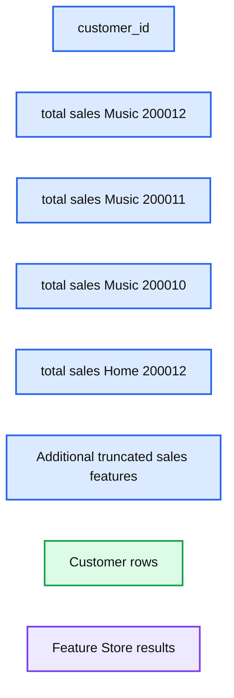
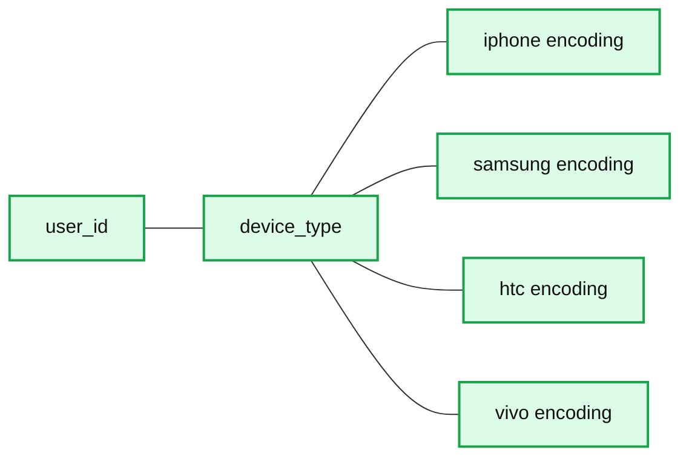
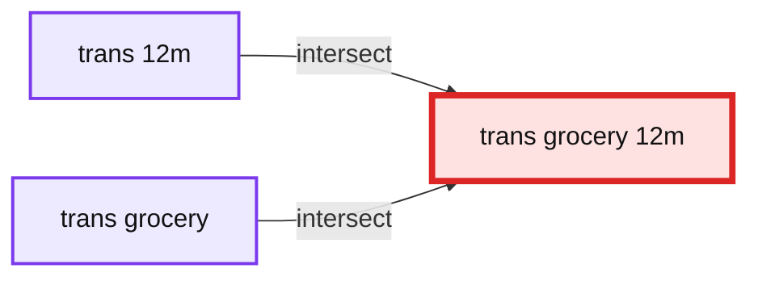

# Feature Engineering at Scale

- Source: https://www.databricks.com/blog/2021/07/16/feature-engineering-at-scale.html
- Published: 2021-07-16
- Authors: Li Yu, Daniel Tomes
- Categories: engineering, data-science-machine-learning
- Images: 7 total, 6 extracted as architecture

Feature engineering is one of the most important and time-consuming steps of the machine learning process. Data scientists and analysts often find themselves spending a lot of time experimenting with different combinations of features to improve their models and to generate BI reports that drive business insights. The larger, more complex datasets with which data scientists find themselves wrangling exacerbate ongoing challenges, such as how to:

1. Define features in a simple and consistent way
2. Find and reuse existing features
3. Build upon existing features
4. Maintain and track versions of features and models
5. Manage the lifecycle of feature definitions
6. Maintain efficiency across feature calculations and storage
7. Calculate and persist wide tables (>1000 columns) efficiently
8. Recreate features that created a model that resulted in a decision that must be later defended (i.e. audit / interpretability)

In this blog, we present design patterns for generating large-scale features. A reference implementation of the design patterns is provided in the attached notebooks to demonstrate how first-class design patterns can simplify the feature engineering process and facilitate efficiency across the silos in your organization. The approach can be integrated with the recently-launched [Databricks Feature Store](https://www.databricks.com/blog/2021/05/27/databricks-announces-the-first-feature-store-integrated-with-delta-lake-and-mlflow.html), the first of its kind co-designed with an [MLOps](https://www.databricks.com/glossary/mlops) and data platform, and can leverage the storage and MLOps capabilities of [Delta Lake](https://delta.io/) and [MLFlow](https://mlflow.org/).

In our example, we use the [TPC-DS](http://www.tpc.org/tpcds/) training dataset to demonstrate the benefits of a first-class feature-engineering workflow with Apache Spark™ at scale. We twist and transform base metrics, such as sales and transactions, across dimensions like customer and time to create model-ready features. These complex transformations are self-documenting, efficient and extensible. A first-class feature-engineering framework is not industry specific, yet must be easily extended to facilitate the nuance of specific organizational goals. This extensibility is demonstrated in this blog through the use of adapted, higher-order functions applied within the framework.

Our approach to feature engineering is also designed to address some of the biggest challenges around scale. For nearly every business, data growth is exploding, and more data leads to more features, which exponentially compounds the challenge of feature creation and management – regardless of the industry. The framework discussed in this blog has been explored and implemented across several industries, some of which are highlighted below.

Our approach to feature engineering is also designed to address some of the biggest challenges around scale. For nearly every business, data growth is exploding, and more data leads to more features, which exponentially compounds the challenge of feature creation and management – regardless of the industry. The framework discussed in this blog has been explored and implemented across several industries, some of which are highlighted below.

**Summary:** The diagram groups feature-engineering use cases into seven industry and business domains.

**Components:**

- Retail - technology not specified
- Farming Oil - technology not specified
- Fraud Pattern - technology not specified
- Ads - technology not specified
- Marketing - technology not specified
- InfoSec - technology not specified
- General - technology not specified

**Flows:**

- none

**Numbers:** none



<sub>source image: https://www.databricks.com/wp-content/uploads/2021/07/Feature-Engineering-At-Scale-blog-img-1.png</sub>

```mermaid
%% Feature engineering use cases grouped by domain
flowchart LR
  A[Retail<br/>Sales Channel<br/>Costs<br/>Revenue<br/>Employee<br/>Vendor<br/>Coupon<br/>Campaign]
  B[Farming Oil<br/>Geospatial<br/>IoT<br/>Weather<br/>Customer<br/>Equipment<br/>Service<br/>Gov]
  C[Fraud Pattern<br/>Manipulation<br/>Market<br/>Purchase<br/>Contract<br/>Social<br/>Interaction]
  D[Ads<br/>Campaign<br/>Bids<br/>Social]
  E[Marketing<br/>Partners<br/>Sales<br/>Customer<br/>Region<br/>Competitor<br/>Loyalty]
  F[InfoSec<br/>Intrusions<br/>Octets<br/>ISPs]
  G[General<br/>Weather<br/>Geo<br/>Municipal<br/>Market<br/>Competitor]

  classDef client fill:#dbeafe,stroke:#2563eb,stroke-width:2px,color:#111
  classDef service fill:#dcfce7,stroke:#16a34a,stroke-width:2px,color:#111
  classDef store fill:#ede9fe,stroke:#7c3aed,stroke-width:2px,color:#111
  classDef cache fill:#fef3c7,stroke:#d97706,stroke-width:2px,color:#111
  classDef queue fill:#cffafe,stroke:#0891b2,stroke-width:2px,color:#111
  classDef critical fill:#fee2e2,stroke:#dc2626,stroke-width:4px,color:#111
  classDef external fill:#e5e7eb,stroke:#6b7280,stroke-width:2px,color:#111,stroke-dasharray:4 3
  classDef decision fill:#fce7f3,stroke:#db2777,stroke-width:2px,color:#111

  class A,B,C,D,E,F,G service
```

## Architectural overview

The design patterns in this blog are based upon the work of [Feature Factory](https://github.com/databrickslabs/feature-factory). The diagram below shows a typical workflow. First of all, base features are defined from the raw data and are the building blocks of more features. For example, *a total_sales feature* can be defined as a base feature, which sums up *the sales_value* grouped by customers. Derived features can be used as inputs to create more complex manipulations from the base. A multitude of features can be rapidly generated, documented, tested, validated and persisted in a few lines of code.

**Summary:** The diagram shows raw data transformed into base features and derived features, then saved in a feature store’s feature registry.

**Components:**

- Raw Data - technology not specified
- Features - technology not specified
- Derived Features - technology not specified
- Feature Store - technology not specified
- Feature Registry - technology not specified

**Flows:**

- Raw Data -> Features: feature definitions generate base features
- Features -> Derived Features: base features are used to create derived features
- Derived Features -> Feature Store: generated features are persisted
- Feature Store -> Feature Registry: features are saved to the registry

**Numbers:** none



<sub>source image: https://www.databricks.com/wp-content/uploads/2021/07/Feature-Engineering-At-Scale-blog-img-2.png</sub>

```mermaid
%% Shows raw data transformed into registered features
flowchart LR
    A[Raw Data] -->|generate base features| B[Features]
    B -->|create derived features| C[Derived Features]
    C -->|persist generated features| D[Feature Store]
    D -->|save features| E[Feature Registry]

    class A external
    class B,C service
    class D store
    class E store

    classDef client   fill:#dbeafe,stroke:#2563eb,stroke-width:2px,color:#111
    classDef service  fill:#dcfce7,stroke:#16a34a,stroke-width:2px,color:#111
    classDef store    fill:#ede9fe,stroke:#7c3aed,stroke-width:2px,color:#111
    classDef cache    fill:#fef3c7,stroke:#d97706,stroke-width:2px,color:#111
    classDef queue    fill:#cffafe,stroke:#0891b2,stroke-width:2px,color:#111
    classDef critical fill:#fee2e2,stroke:#dc2626,stroke-width:4px,color:#111
    classDef external fill:#e5e7eb,stroke:#6b7280,stroke-width:2px,color:#111,stroke-dasharray:4 3
    classDef decision fill:#fce7f3,stroke:#db2777,stroke-width:2px,color:#111
```

Feature definitions are applied to the raw data to generate features as dataframes and can be saved to the Feature Registry using Feature Store APIs. Delta Lake provides multiple optimizations that the feature generation engine leverages. Furthermore, feature definitions are version controlled, enabling traceability, reproduction, temporal interpretability and audit as needed.

The code example below shows how feature definitions can be materialized and registered to the Feature Store.

Result from simple feature multiplication

**Summary:** A Feature Store table shows customer-level monthly sales features, including total music sales for customer 46952.

**Components:**

- `customer_id`: customer identifier
- `total_sales_Music_200012`: December 2000 music sales
- `total_sales_Music_200011`: November 2000 music sales
- `total_sales_Music_200010`: October 2000 music sales
- `total_sales_Home_200012`: December 2000 home-category sales
- Additional truncated sales feature columns
- Tabular result rows

**Flows:**

- none

**Numbers:** 1, 2, 3, 4, 5, 6, 7, 8, 9, 114503, 7880, 75039, 46952, 94265, 177496, 154464, 144414, 100986, 200012, 200011, 200010, 0, 1752.6800537109375, 1079.199951171875, 3636.450005054474, 3507.60009765625, 2517.85009765625, 9448.240245819092, 2238.529968, 1431.719970703125, 1067.2899780273438, 2483.710090637207, 2651.760009765625, 3346.610107421875, 348.3900146, 1728.6199951171875, 4079.260009, 1000, 1752.68



<sub>source image: https://www.databricks.com/wp-content/uploads/2021/07/Feature-Engineering-At-Scale-blog-img-5.jpg</sub>

Features created in Feature Store

Example: The result shows that *total_sales_Music_200012* for *customer_id* 46952 was 1752.68 which, in plain english, means that this customer purchased $1,752.68 worth of music as defined by *total_sales* in December of the year 2000.

## Dataset

The reference implementation is based on, but not limited to, the [TPC-DS](http://www.tpc.org/tpc_documents_current_versions/pdf/tpc-ds_v2.1.0.pdf), which has three sales channels: Web, Store, and Catalog. The code examples in this blog show features created from the StoreSales table joined by *date_dim* and item tables, defined as:

- Store_Sales: Transactional revenue on product generated from within a brick and mortar
- Date_Dim: A calendar-type table representing a date dimension
- Item: A sku that can be sold

## Base feature definition

The Spark APIs provide powerful functions for data engineering that can be harnessed for feature engineering with a wrapper and some contextual definitions that abstract complexity and promote reuse. The Feature class provides a unified interface to define features with these components:

- `_base_col` column or other feature, both of which are simply columnar expressions.
- list of conditions or, more specifically, true/false columnar expressions. If the expression is True, the logic defined in _base_col will be taken as the feature, otherwise the feature will be calculated using the `_negative_value`
- `_negative_value` expression to be evaluated if the _filter returns False
- `_agg_func` defines the Spark SQL functions to be used to aggregate the base column. If _agg_func is not defined, the feature is not an aggregate expression (i.e. “feature”).

This example shows how to define an aggregate feature to sum up sales over first half of year 2019:

It is equivalent to:

## Feature modularization

A common issue with feature engineering is that data science teams are defining their own features, but the feature definitions are not documented, visible or easily shared with other teams. This commonly results in duplicated efforts, code, and worst of all, features with the same intent but different logic / results. Bug fixes, improvements and documentation are rarely accessible across teams. Modularizing feature definitions can alleviate these common challenges.

Sharing across the broader organization and silos requires another layer of abstraction, as different areas of the organization often calculate similar concepts in different ways. For example, the calculation of *net_sales* is necessary for all lines of business, store, web and catalog, but the inputs, and even the calculation, is likely different across these lines of business. Enabling *net_sales* to be derived differently across the broader organization requires that *net_sales* and its commonalities be promoted to a *common_module* (e.g. *sales_common*) into which users can inject their business rules. Many features do not sufficiently overlap with other lines of business and as such, are never promoted to common. However, this does not mean that such a feature is not valuable for another line of business. Combining features across conceptual boundaries is possible, but when no common super exists, usage must follow the rules of the source concept (e.g. *channel*). For example, machine learning (ML) models that predict store sales often gain value from catalog features. Assuming *catalog_sales* is a leading indicator of store sales, features may be combined across these conceptual boundaries; it simply requires that the user understand the defining rules according to the construct of the foreign module (e.g. namespace)*. *Further discussion on this abstraction layer is outside the scope of this blog post.

In the reference implementation, a module is implemented as a *Feature Family* (a collection of features). A read-only property is defined for each feature to provide easy access. A feature family extends an `ImmutableDictBase` class, which is generic and can serve as base class for collections of features, filters and other objects. In the code example below, filter definitions are extracted from features and form a separate `Filters` class. The common features shared by multiple families are also extracted into a separate Common `Features` class for reuse. Both filters and common features are inherited by the `StoreSales` family class, which defines a new set of features based upon the common definitions.

In the code example, there is only one channel; multiple channels share the same CommonFeatures. Retrieving a feature definition from a specific channel is as simple as accessing a property of that family class, e.g. `store_channel.total_sales`

## Feature operations

There are often common patterns found in feature generation; a feature can be extended to include higher-order functions that reduce verbosity, simplify reuse, improve legibility and its definition. Examples may include:

- An analyst often likes to measure and compare various product trends over various time periods, such as the last month, last quarter, last year, etc..
- A data scientist analyzing customer purchasing patterns across product categories and market segments when developing recommender systems for ad placements.

Many very different use cases implement a very similar series of operations (e.g. filters) atop a very similar (or equal) set of base features to create deeper, more powerful, more specific features.

In the reference implementation, a feature is defined as a Feature class. The operations are implemented as methods of the Feature class. To generate more features, base features can be multiplied using multipliers, such as a list of distinct time ranges, values or a data column (i.e. Spark Sql Expression). For example, a total sales feature can be multiplied by a range of months to generate a feature vector of total sales by months.

The multiplication can be applied to categorical values as well. The following example shows how a total_sales feature can derive sales by categorical features:

Note that these processes can be combinatorial such that the resulting features of various multipliers can be combined to further transform features.

Higher-order lambdas can be applied to allow list comprehension over list of features multiplied by list of features and so on, depending on the need. To clarify, the output variable, *total_sales_1M_home* below is the derived total store sales for home goods in the past 1 month. Data scientists often spend days wrangling this data through hundreds of lines of inefficient code that only they can read; this framework greatly reduces that cumbersome challenge.

### Feature vectors

The feature operations can be further simplified by storing the features with the same operations in a vector. A feature vector can be created from a Feature Dictionary by listing feature names.

A feature vector can create another feature vector by simple multiplication or division, or even via stats functions on an existing vector. A feature vector implements methods such as multiplication, division and statistical analysis to simplify the process of generating features from a list of existing base features. Similarly, Spark’s feature transformers can be wrapped to perform common featurization tactics such as scalers, binarizes, etc. Here’s an example of OHE:

As a result, new features will be created for total_sales and total_trans by each category (grocery, meat, dairy). To make it more dynamic, the categorical values can be read from a column of a dimensional table instead of hard-coded. Note that the output of the multiplication is a 2d vector.

|  | GROCERY | MEAT | DAIRY |
|---|---|---|---|
| total_sales | total_sales_grocery | total_sales_meat | total_sales_dairy |
| total_trans | total_trans_grocery | total_trans_meat | total_trans_dairy |

Below shows how to implement `FeatureVector.`

## One-hot encoding

One-hot encoding is straightforward with feature multiplication and is walked through in the code below. The encoding feature defines *base_col as 1* and *negative_value* as 0 so that when the feature is multiplied by a categorical column, the matched column will be set to 1 and all others 0.

**Summary:** A feature table shows one-hot encoded device-type columns for four users.

**Components:**

- user_id
- device_type
- device_type_encode_iphone
- device_type_encode_samsung
- device_type_encode_htc
- device_type_encode_vivo

**Flows:**

- none

**Numbers:** 1, 2, 3, 4, and binary values 0 and 1.



<sub>source image: https://www.databricks.com/wp-content/uploads/2021/07/Feature-Engineering-At-Scale-blog-img-4.png</sub>

## Multiplication with estimation

The dynamic approach can generate a large number of features with only a few lines of code. For example, multiplying a feature vector of 10 features with a category column of 100 distinct values will generate 1000 columns, 3000 if subsequently multiplied by 3 time periods. This is a very common scenario for time-based statistical observations through time, (e.g. max, min, average, trending of transactions over a year).

With the number of features increasing, the Spark job takes longer to finish. Recalculation happens frequently for the features with overlapping ranges. For example, to calculate transactions over a month, a quarter, half year and a year, the same set of data is counted multiple times.  How can we enjoy the easy process of feature generation and still keep the performance under control?

One method to improve model performance is to pre-aggregate the source table and calculate the features from the pre-aggregated data. *Total_sales* can be pre-aggregated per category and per month, such that subsequent roll-ups will be based on this smaller set of data. This method is straightforward to implement on narrow transformations like sum and count but what about wide transformations like median and distinct count? Below, two methods are introduced that employ estimation to maintain performance while preserving low margins of error for large datasets.

### HyperLogLog

HyperLogLog (HLL) is a machine learning algorithm used to approximate a distinct count of values in a dataset. It provides a fast way to count distinct values and, more importantly, produces a binary sketch,  a fixed sized set with a small memory footprint. HLL can compute the union of multiple sketches efficiently, and the distinct count is approximated as the cardinality of a sketch. With HLL, total transactions per month can be pre-aggregated as sketches, and total transactions of a quarter will simply become the union of the three pre-computed monthly sketches

The calculation is shown in the picture below.

**Summary:** The diagram shows three overlapping monthly transaction sketches: `trans_1m`, `trans_2m`, and `trans_3m`.

**Components:**

- `trans_1m` - first monthly transaction sketch
- `trans_2m` - second monthly transaction sketch
- `trans_3m` - third monthly transaction sketch

**Flows:**

- none

**Numbers:** 1m, 2m, 3m

```text
%% mermaid failed to render; kept as text
%% Shows three overlapping monthly transaction sketches
flowchart LR
    A((trans_1m))
    B((trans_2m))
    C((trans_3m))

    classDef client fill:#dbeafe,stroke:#2563eb,stroke-width:2px,color:#111
    classDef service fill:#dcfce7,stroke:#16a34a,stroke-width:2px,color:#111
    classDef store fill:#ede9fe,stroke:#7c3aed,stroke-width:2px,color:#111
    classDef cache fill:#fef3c7,stroke:#d97706,stroke-width:2px,color:#111
    classDef queue fill:#cffafe,stroke:#0891b2,stroke-width:2px,color:#111
    classDef critical fill:#fee2e2,stroke:#dc2626,stroke-width:4px,color:#111
    classDef external fill:#e5e7eb,stroke:#6b7280,stroke-width:2px,color:#111,stroke-dasharray:4 3
    classDef decision fill:#fce7f3,stroke:#db2777,stroke-width:2px,color:#111
    A,B,C service
```

<sub>source image: https://www.databricks.com/wp-content/uploads/2021/07/Feature-Engineering-At-Scale-blog-img-5.png</sub>

### MinHash

Another approach to approximate the result of multiplication is to intersect the two sketches and compute the cardinality of the intersection.

For example, `total_trans_grocery_12m = cardinality(total_trans_12m total_trans_grocery)`

**Summary:** The diagram shows the overlap between `trans_12m` and `trans_grocery`, representing the estimated `trans_grocery_12m` intersection.

**Components:**

- `trans_12m`: transaction sketch for 12 months
- `trans_grocery`: grocery transaction sketch
- `trans_grocery_12m`: intersection of the two sketches

**Flows:**

- `trans_12m` + `trans_grocery` -> `trans_grocery_12m`: intersect sketches and compute cardinality

**Numbers:** 12m



<sub>source image: https://www.databricks.com/wp-content/uploads/2021/07/Feature-Engineering-At-Scale-blog-img-7.png</sub>

The intersection can be computed with inclusion-exclusion principle:

However the intersection computed this way will have the compounding error from estimation.

MinHash is a fast algorithm to estimate Jaccard Similarity between two sets. The tradeoff of accuracy and computing/storage resources can be tuned by using different hash functions and the number of permutation functions. With MinHash, the distinct count of two joined sets can be calculated in linear time with small and fixed memory footage.

The details of multiplication with MinHash can be found in the notebooks below.

## Feature definition governance

Databricks notebooks manage and track the versions of feature definitions and can be linked and backed in Github repos. An automated job will run the functional and integration tests against the new features. Additional stress tests can be integrated to determine performance impact in different scenarios as well. If the performance is out of some bounds, the feature gets a performance warning flag. Once all tests passed and code approved, the new feature definitions are promoted to production.

[MLflow tracking](https://www.mlflow.org/docs/latest/tracking.html) tracks and logs the code version and source data when building models from the features `.mlflow.spark.autolog()` enables and configures logging of Spark datasource path, version and format. The model can be linked with the training data and feature definitions in the code repository.

To reproduce an experiment, we also need to use consistent datasets. Delta Lake’s [Time Travel](https://docs.databricks.com/delta/delta-batch.html#query-an-older-snapshot-of-a-table-time-travel) capability enables queries from a specific snapshot of data in the past. **Disclaimer, Time Travel is not meant to be used as long-term, persistent historical versioning; standard archival processes are still required for longer-term historical persistence even when using Delta.

## Feature exploration

As the number of features increases, it becomes more difficult to browse and find specific feature definitions.

The abstracted feature class enables us to add a description attribute to each feature, and text mining algorithms can be applied to the feature descriptions to cluster features into different categories automatically.

At Databricks, we’ve experimented with an automatic feature clustering approach and seen promising results. This approach assumes that proper description of features is provided as input. Descriptions are transformed into a TF-IDF feature space, and then Birch clustering is applied to gather similar descriptions into the same group. The topics of each group are the high-rank terms in the group of features.

The feature clustering can serve multiple purposes. One is to group similar features together so that a developer can explore more easily. Another use case could be to validate the feature description. If a feature is not properly documented, the feature will not be clustered in the same group as expected.

## Summary

In this blog, design patterns for feature creation are presented to showcase how features can be defined and managed at scale. With this automated feature engineering, new features can be generated dynamically using feature multiplication as well as efficiently stored and manipulated using Feature Vectors. The calculation of derived features can be improved by union/intersect pre-computed features via estimation-based methods. Features can be further extended to simplistically and efficiently implement complex operations on otherwise extremely costly functions and simplify it for users from several backgrounds.

Hopefully this blog enables you to bootstrap your own implementation of a feature factory that streamlines workflows, enables documentation, minimizes duplicity, and guarantees consistency among your feature sets.

 

Preview the Notebook

 

[DOWNLOAD THE NOTEBOOK](https://www.databricks.com/notebooks/feature_engineering_at_scale.dbc)
