# Monitoring ML Models With Model Assertions

- Source: https://www.databricks.com/blog/2021/07/22/monitoring-ml-models-with-model-assertions.html
- Published: 2021-07-22
- Authors: Daniel Kang, Deepti Raghavan, Peter Bailis, Matei Zaharia
- Categories: engineering, data-science-machine-learning
- Images: 3 total, 1 extracted as architecture

This is a guest post from the Stanford University Computer Science Department. We thank Daniel Kang, Deepti Raghavan and Peter Bailis of Stanford University for their contributions.

 

Machine learning (ML) models are increasingly used in a wide range of business applications. Organizations deploy hundreds of ML models to predict [customer churn](https://www.kdnuggets.com/2019/05/churn-prediction-machine-learning.html), [optimal pricing](https://tryolabs.com/blog/price-optimization-machine-learning), [fraud](https://aws.amazon.com/solutions/implementations/fraud-detection-using-machine-learning/) and more. Many of these models are deployed in situations where humans can’t verify all of the predictions - the data volumes are simply too large! As a result, monitoring these ML models is becoming crucial to successfully and accurately applying ML use cases.

In this blog post, we’ll show why monitoring models is critical and the catastrophic errors that can occur if we do not. Our solution leverages a simple, yet effective, tool for monitoring ML models we developed at Stanford University (published in [MLSys 2020](https://arxiv.org/abs/2003.01668)) called *model assertions*. We’ll also describe how to use our open-source Python library [model_assertions](https://github.com/stanford-futuredata/omg)to detect errors in real ML models.

### Why we need monitoring

Let’s consider a simple example of [estimating housing prices in Boston](https://amitg0161.medium.com/sklearn-linear-regression-tutorial-with-boston-house-dataset-cde74afd460a) (dataset included in scikit-learn). This example is representative of standard use cases in the industry on a publicly available dataset. A data scientist might try to fit a linear regression model using features such as the average number of rooms to predict the price – such models are standard in practice. Using aggregate statistics to measure performance, like RMSE, shows that the model is performing reasonably well:

Unfortunately, while this model performs well on average, it makes some critical mistakes:

As highlighted above, the model predicts *negative* housing prices for some of the data. Using this model for setting housing prices would result in giving customers cash to purchase a house! If we only look at the aggregate metrics for our models, we would miss errors like these.

While seemingly simple, these kinds of errors are ubiquitous when using ML models. In our [full paper](https://arxiv.org/abs/2003.01668), we also describe how to apply model assertions to autonomous vehicle and vision data (with an example about [predicting attributes of TV news anchors](https://arxiv.org/abs/2008.06007) [here](https://github.com/stanford-futuredata/omg/blob/main/examples/Consistency.ipynb)).

### Model assertions

In the examples above, we see that ML models widely used in practice can produce inconsistent or nonsensical results. As a first step toward addressing these issues, we’ve developed an API called *model assertions*.

Model assertions let data scientists, developers and domain experts specify when errors in ML models may be occurring. A model assertion takes the inputs and outputs of a model and returns records containing potential errors.

#### Tabular data

Let’s look at an example with the housing price prediction model above. As a simple sanity check, a data scientist specifies that housing price predictions must be positive. After specifying and registering the assertion, it will flag potentially erroneous data points:

#### Autonomous vehicle and vision data

In many cases, models are used to predict over unstructured data to produce structured outputs. For example, autonomous vehicles predict pedestrian and car positions, and researchers studying TV news may be interested in predicting attributes of TV news anchors. Many assertions over this data deal with the predicted attributes or the temporal nature of the data. As a result, we’ve designed a *consistency API* that allows users to specify that 1) attributes should be consistent with the same identifier (e.g., the person in a scene, bounding box) and 2) that identifiers should not change too rapidly. In the second case, we’re taking advantage of the strong temporal consistency present in many applications (e.g., that a person shouldn’t appear, disappear and reappear within 0.5 seconds). As an example, we’re showing a vision and LIDAR model predicting trucks in the screenshot below. As you can see, the predictions are inconsistent; the prediction in green is from the vision model, and the prediction in purple is the LIDAR model.

 As another example, we’re showing a model predicting [attributes about TV news anchors](https://arxiv.org/abs/2008.06007). The scene identifier tracks a person’s prediction across time. The news anchor’s name, gender and hair color are inconsistently predicted by the model. The gender or hair color shouldn’t change frame to frame!

**Summary:** The table shows model predictions and assertion errors for TV news anchor attributes across frames.

**Components:**

- Frame column
- Scene identifier column
- Name column
- Gender column
- Hair color column
- Assertion column
- Error index column

**Flows:**

- none

**Numbers:** Out[6]; row indices 0, 1, 2, 3, 4, 5; frame values 0, 4, 0, 1, 1, 3; scene identifier value 1; error indices 0, 0, 1, 1, 2, 2; window of 3

```mermaid
%% Shows model assertion results across video frames
flowchart LR
    T[Assertion output table]

    classDef client   fill:#dbeafe,stroke:#2563eb,stroke-width:2px,color:#111
    classDef service  fill:#dcfce7,stroke:#16a34a,stroke-width:2px,color:#111
    classDef store    fill:#ede9fe,stroke:#7c3aed,stroke-width:2px,color:#111
    classDef cache    fill:#fef3c7,stroke:#d97706,stroke-width:2px,color:#111
    classDef queue    fill:#cffafe,stroke:#0891b2,stroke-width:2px,color:#111
    classDef critical fill:#fee2e2,stroke:#dc2626,stroke-width:4px,color:#111
    classDef external fill:#e5e7eb,stroke:#6b7280,stroke-width:2px,color:#111,stroke-dasharray:4 3
    classDef decision fill:#fce7f3,stroke:#db2777,stroke-width:2px,color:#111

    class T store
```

source image: https://www.databricks.com/wp-content/uploads/2021/07/OMG-Databricks-blog-post-img-4.png

`The IdentifierConsistencyAssertion` specifies that the attributes `(hair_color) ` of a particular entity `(scene_identifier)` consistent, e.g., that a specific newscaster should have the same hair color in the same scene. The `TimeConsistencyAssertion` specifies that an entity `(scene_identifier)` should not appear and disappear too many times in a time window.

### Using model assertions

We’ve implemented model assertions as a [Python library](https://github.com/stanford-futuredata/omg). To use it in your own code, simply install the package

Our library currently supports:

- Per-row assertions (e.g., that the output should be positive).
- Identifier consistency assertions that specify attributes of the same identifier should agree.
- Time consistency assertions that specify entities should not appear and disappear too many times in a time window.

And we plan on adding more!

In [our full paper](https://arxiv.org/abs/2003.01668), we show other examples of how to use model assertions, including in autonomous vehicles, video analytics and ECG applications. In addition, we describe how to use model assertions for selecting training data. Using model assertions to select training data can be up to 40% cheaper than standard methods of selecting training data. Instead of selecting data at random or via uncertainty, selecting “hard” data points (i.e. data points with errors or ones that trigger model assertions) can be more informative.

Try the notebooks:

- [Tabular example](https://docs.databricks.com/_static/notebooks/machine-learning/model-assertions-tabular.html)
- [Consistency example](https://docs.databricks.com/_static/notebooks/machine-learning/model-assertions-consistency.html)

Visit the [GitHub repository](https://github.com/stanford-futuredata/omg) for more details and examples. Please reach out to [ddkang@stanford.edu](mailto:ddkang@stanford.edu) if you have any questions, feedback or would like to contribute!
