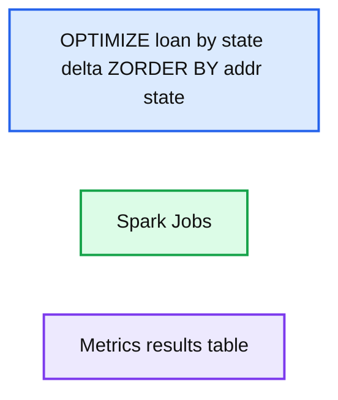
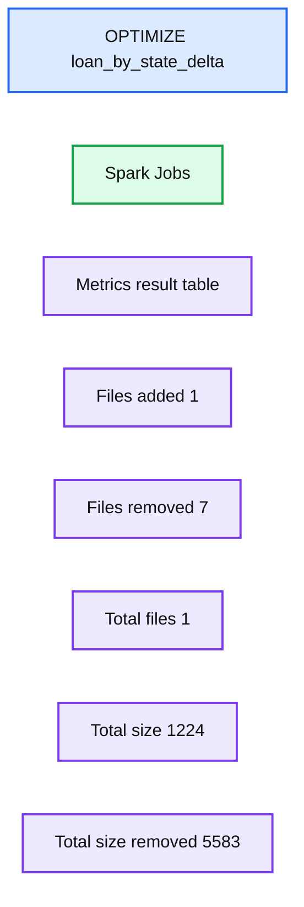
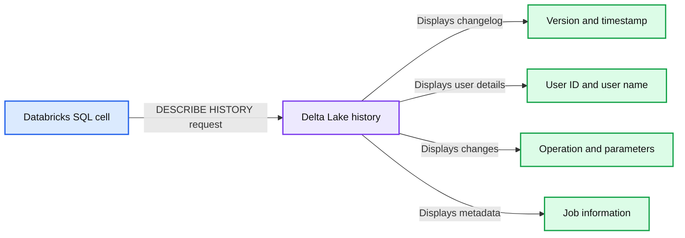
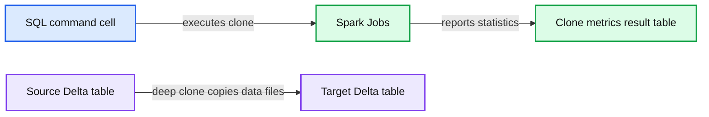

# The Delta Between ML Today and Efficient ML Tomorrow

- Source: https://www.databricks.com/blog/2021/07/22/the-delta-between-ml-today-and-efficient-ml-tomorrow.html
- Published: 2021-07-22
- Authors: Marijse van den Berg, Maria Zervou
- Categories: engineering, open-source, data-science-machine-learning
- Images: 9 total, 5 extracted as architecture

*Delta Lake and MLflow both come up frequently in conversation but often as two entirely separate products. This blog will focus on the synergies between Delta Lake and MLflow for machine learning use cases and explain how you can leverage Delta Lake to deliver strong ML results based on solid data foundations.*

If you are working as a data scientist, you might have your full modelling process sorted and potentially have even deployed a machine learning model into production using MLflow. You might have experimented using MLflow tracking and promoted models using the MLflow Model Registry. You are probably quite happy with the reproducibility this provides, as you are able to track things like code version, cluster set-up and also data location.

But what if you could reduce the time you spend on data exploration? What if you could see the exact version of the data used for development? What if the performance of a training job isn't quite what you had hoped or you keep experiencing out of memory (OOM) errors?

All of these are valid thoughts and are likely to emerge throughout the ML development and deployment process. Coming up with a solution can be quite challenging, but one way to tackle some of these scalability problems is through using Delta Lake.

[Delta Lake](https://docs.databricks.com/delta/index.html) (Delta for short) is an open-source storage layer that brings reliability to your data lake. It does not require you to change your way of working or learn a new API to experience the benefits. This blog focuses on common problems experienced by data scientists and ML engineers and highlights how Delta can alleviate these.

### My query is slow, but I don't understand why.

Depending on the size of your dataset, you might find that learning more about your data is a time-consuming process. Even when parallelizing queries, different underlying processes might still make a query slow. Delta has an optimized Delta Engine, which adds performance to various types of queries, including ETL, as well as ad hoc queries that can be used for exploratory data analysis. If performance is still not as expected, the Delta format enables you to use the [DESCRIBE DETAIL](https://docs.databricks.com/spark/2.x/spark-sql/language-manual/describe-table.html#describe-detail-delta-lake-on-databricks) functionality. This allows you to quickly gain insight into the size of the table you are querying and how many files it consists of, as well as some of the key information regarding schema. In this way, Delta gives you the built-in tools to identify the performance problems from inside your notebook and abstract away some of the complexity.

 

Waiting for a query to run is a common issue and only gets worse as data volumes get increasingly large. Luckily, Delta provides some optimizations that you can leverage, such as [data skipping](https://docs.databricks.com/delta/optimizations/file-mgmt.html#data-skipping)**.** As our data grows and new data is inserted into a Databricks Delta table, file-level min/max statistics are collected for all the columns of supported types. Then, when you try to query the table, Databricks Delta first consults these statistics in order to determine which files can safely be skipped and which ones are relevant. Delta Lake on Databricks takes advantage of this information at query time to provide faster queries and it requires no configuration.

Another way to take advantage of the data skipping functionality is to explicitly advise Delta to optimize the data with respect to a column(s). This can be done with [Z-Ordering](https://www.databricks.com/blog/2018/07/31/processing-petabytes-of-data-in-seconds-with-databricks-delta.html), a [technique](https://en.wikipedia.org/wiki/Z-order_curve) to colocate related information in the same set of files. In simple terms, applying ZORDER BY on a column will help get your results back faster if you are repeatedly querying the table with a filter on that same column. This will hold true especially if the column has high cardinality, or in other words, a large number of distinct values.

**Summary:** Databricks runs an OPTIMIZE ZORDER operation on `loan_by_state_delta` and displays Spark job metrics.

**Components:**

- SQL command using Databricks SQL and Delta Lake Z-Ordering
- Spark Jobs execution panel
- Metrics results table showing file optimization statistics

**Flows:**

none

**Numbers:** 1, 2, 12, 1, 7, 1291, 1291, 1291, 1, 1291, 735, 1224, 804.8571428571429, 7, 5634, 0, 0, 7, 5634, 0, 0, 7, 5634, 0, 7, 5634, 0, 1, 7, 1, 7, 0, 1 row

source image: https://www.databricks.com/wp-content/uploads/2021/07/Delta-for-ML-Draft-blog-img-2.png

Finally, if you don't know the most common predicates for the table or are in an exploration phase, you can just optimize the table by coalescing small files into larger ones. This will reduce the scanning of files when querying your data and, in this way, improve performance. You can use the [OPTIMIZE](https://docs.databricks.com/spark/latest/spark-sql/language-manual/delta-optimize.html) command without specifying the ZORDER column.

**Summary:** The Databricks SQL result shows `OPTIMIZE loan_by_state_delta` completing 9 Spark jobs and reducing 7 files to 1 optimized file.

**Components:**

- SQL command using Delta Lake OPTIMIZE
- Spark Jobs execution indicator
- Metrics result table
- Optimization metrics for files added and removed

**Flows:**

- none

**Numbers:** 1, 2, 9, 1, 7, 1224, 735, 1173, 797.5714285714286, 5583, 0, 1, 0, 1

source image: https://www.databricks.com/wp-content/uploads/2021/07/Delta-for-ML-Draft-blog-img-3.png

If you have a large amount of data and only want to optimize a subset of it, you can specify an optional partition predicate using WHERE to indicate you only want to optimize a subset of the data (e.g. only recently added data).

**Summary:** A Databricks SQL result showing a partition-filtered Delta Lake OPTIMIZE operation with ZORDER metrics.

**Components:**

- SQL cell using Delta Lake OPTIMIZE and ZORDER
- Spark Jobs result indicator
- Result table with path and metrics columns
- Optimization metrics JSON output

**Flows:**

- SQL cell -> Spark Jobs: executes optimization query
- Spark Jobs -> Result table: returns optimization metrics

**Numbers:** 1, 2, 3, 4, 11, 1, 553, 523, 6, 3138, 107374182400, 0, 1, 3138, 6

```mermaid
%% Shows a Databricks Delta Lake optimization query and its result metrics
flowchart LR
    A[SQL cell] -->|executes query| B[Spark Jobs]
    B -->|returns metrics| C[Result table]
    C --> D[Optimization metrics JSON]

    classDef client   fill:#dbeafe,stroke:#2563eb,stroke-width:2px,color:#111
    classDef service  fill:#dcfce7,stroke:#16a34a,stroke-width:2px,color:#111
    classDef store    fill:#ede9fe,stroke:#7c3aed,stroke-width:2px,color:#111
    classDef cache    fill:#fef3c7,stroke:#d97706,stroke-width:2px,color:#111
    classDef queue    fill:#cffafe,stroke:#0891b2,stroke-width:2px,color:#111
    classDef critical fill:#fee2e2,stroke:#dc2626,stroke-width:4px,color:#111
    classDef external fill:#e5e7eb,stroke:#6b7280,stroke-width:2px,color:#111,stroke-dasharray:4 3
    classDef decision fill:#fce7f3,stroke:#db2777,stroke-width:2px,color:#111

    class A client
    class B service
    class C store
    class D store
```

source image: https://www.databricks.com/wp-content/uploads/2021/07/Delta-for-ML-Draft-blog-img-4.png

### My data doesn't fit in memory.

During model training, there are cases in which you may need to train a model on a specific subset of data or filter the data to be in a specific date range instead of the full dataset. The usual workflow would be to read all the data, at which point all the data is scanned and loaded in memory, and then keep the relevant part of it. If the process doesn't break at this stage, it will definitely be very slow. But what about just reading the necessary files from the beginning and in this way not allowing your machine to overload with data that will be dropped anyway? This is where partition pruning can be very handy.

In simple terms, when talking about a partition, we are actually referring to the subdirectory for every distinct value of the partition column(s). If the data is partitioned on the columns you want to apply filters on, then [pruning techniques](https://docs.databricks.com/data/tables.html#partition-pruning-1) will be utilized to read only the necessary files by just scanning the right subdirectory and ignoring the rest. This may seem like a small win, but if you factor in the number of iterations/reads required to finalize a model, then this becomes more significant. So understanding the frequent patterns of querying the data leads to better partition choices and less expensive operations overall.

Alternatively, in some cases, your data is not partitioned and you experience OOM errors, as your data simply does not fit in a single executor. Using a combination of DESCRIBE DETAIL, partitioning and ZORDER can help you understand if this is the cause of the error and  resolve it.

### I spend half my days improving data quality.

It happens regularly that data teams are working with a dataset and find that variables hold erroneous data, for instance a timestamp from 1485. Identifying these data problems and removing values like this can be a cumbersome process. Removing these rows is often also costly from a computational perspective, as queries using .filter() can be quite expensive. In an ideal scenario, you would avoid erroneous data being added to a table entirely. This is where [Delta Constraints](https://docs.databricks.com/delta/delta-constraints.html) and [Delta Live Tables](https://docs.databricks.com/data-engineering/delta-live-tables/index.html) expectations can help. In particular, Delta Live Tables allow you to specify expected data quality and also what should happen to data that does not meet the requirement. Rather than removing the data retrospectively, you can now proactively keep your data clean and ready for use.

 

In a similar fashion, we might want to avoid people accidentally adding columns to the data we are using for modeling. Also here Delta offers a simple solution: [automatic schema updates](https://docs.databricks.com/delta/delta-batch.html#automatic-schema-update-1). By default, data written to a Delta table needs to adhere to the known schema unless otherwise specified.

If someone has changed the schema anyhow, this can be easily checked by using the describe detail command, followed by a [DESCRIBE HISTORY](https://docs.databricks.com/sql/language-manual/delta-describe-history.html) to give a quick overview of what the schema looks like now and who might have changed the schema. This allows you to communicate with your fellow Data Scientist, Data Engineer or Data Analyst to understand why they made the change and whether that change was legitimate or not.

**Summary:** A Databricks SQL query displays Delta Lake table history, including schema changes, users, timestamps, and operation details.

**Components:**

- Databricks SQL cell using `%sql`
- Delta Lake history command using `DESCRIBE HISTORY`
- History table with version, timestamp, user ID, user name, operation, operation parameters, and job columns
- Spark Jobs indicator

**Flows:**

- SQL cell -> Delta history output: requests table history
- Delta history output -> History rows: displays recorded table operations

**Numbers:** 1, 2, 1 Spark Job, versions 10, 9, 8, 7, 2021-03-11T11:42:51.000+0000, 2021-03-11T11:41:29.000+0000, 2021-03-11T11:39:00.000+0000, 2021-03-11T11:38:25.000+0000, user ID 101755, state ID 5958469, 11 rows

source image: https://www.databricks.com/wp-content/uploads/2021/07/Delta-for-ML-Draft-blog-img-7.png

If you find the change illegitimate or still accidental, you also have the option to revert back to or restore a previous version of your data using the [Time Travel](https://docs.databricks.com/delta/delta-batch.html#query-an-older-snapshot-of-a-table-time-travel) capability.

### I don't know what data I used for training and cannot reproduce the results.

When creating features for a particular model, we might try different versions of features in the process. Using different versions of the same feature can lead to a number of challenges down the line.

- The training results are no longer reproducible from losing track of the specific version of your feature used for training.
- The results of your model in production don't meet the standard of the training results, as the features used in production might not be quite the same as used during the training.

To avoid this, one solution is to create multiple versions of the feature tables and store them in blob storage (using e.g. Apache Parquet). The specific path to the data used can then be logged as a parameter during your MLflow run. However, this is still a manual process and can take up significant amounts of data storage space. Here, Delta offers an alternative. Rather than saving different versions of your data manually, you can use Delta versioning to automatically track changes that have been made to your data. On top of this, Delta integrates with various MLflow flavors, which supports autologging such as [mlflow.spark.autolog()](https://www.mlflow.org/docs/latest/python_api/mlflow.spark.html#mlflow.spark.autolog) to track  the location of the data used for model training and the version if your data is stored in Delta. In this manner, you can avoid storing multiple versions of your data, allowing you to reduce storage cost as well as confusion around what data was used for a particular training run.

However, storing endless versions of your data might still make you worry about storage costs. Delta easily takes care of this by providing a retention threshold ([VACUUM](https://docs.databricks.com/sql/language-manual/delta-vacuum.html)) on the number of data versions you want to keep. In cases where you would like to archive data for longer periods for retrieval at a later point in time, for instance when you want to A/B test a new model down the line, you can use [Delta clones](https://docs.databricks.com/delta/delta-utility.html#clone-delta-table). Deep clones make a full copy of the metadata and data files being cloned for the specified version, including partitioning, constraints and other information. As the syntax for deep clones is simple, archiving a table for model testing down the line becomes very simple.

**Summary:** A Databricks SQL deep clone operation creates `loan_by_state_delta_clone` from `loan_by_state_delta` and reports file copy statistics.

**Components:**

- SQL command cell using Spark SQL
- Spark Jobs indicator
- Clone metrics result table
- Source Delta table `loan_by_state_delta`
- Target Delta table `loan_by_state_delta_clone`

**Flows:**

- Source Delta table -> Target Delta table: deep clone copies metadata and data files
- SQL command cell -> Spark Jobs: executes the clone operation
- Spark Jobs -> Clone metrics result table: reports clone statistics

**Numbers:** 1, 2, 7, 26143, 50, 0, 50, 0, 26143, 1, 1

source image: https://www.databricks.com/wp-content/uploads/2021/07/Delta-for-ML-Draft-blog-img-9.png

 

### My features in prod don't match the features I used to develop.

With the data versioning challenges sorted, you might still worry about code reproducibility for particular features. The solution here would be the Databricks Feature Store, which is fully underpinned by Delta and supports the approach outlined in this blog. Any development of features done on Delta tables can be easily logged to the Feature Store, keeping track of the code and version from where they were created. Moreover, it provides additional governance on your features, as well as look-up logic to make your feature better findable and more usable and many other capabilities.

### More information

If you are interested in learning more about the various concepts discussed in this blog, have a look at the following resources.

- [Easily Clone your Delta Lake for Testing, Sharing, and ML Reproducibility](https://www.databricks.com/blog/2020/09/15/easily-clone-your-delta-lake-for-testing-sharing-and-ml-reproducibility.html)
- [Databricks Announces the First Feature Store Co-designed with a Data and MLOps Platform](https://www.databricks.com/blog/2021/05/27/databricks-announces-the-first-feature-store-integrated-with-delta-lake-and-mlflow.html)
- [ACID Transactions on Data Lakes Tech Talks: Getting Started with Delta Lake](https://www.databricks.com/blog/2020/11/23/acid-transactions-on-data-lakes.html)
- [Announcing the Launch of Delta Live Tables: Reliable Data Engineering Made Easy](https://www.databricks.com/blog/2021/05/27/announcing-the-launch-of-delta-live-tables-reliable-data-engineering-made-easy.html)
- [Time Travel by Delta Time Machine](https://www.databricks.com/session_eu20/data-time-travel-by-delta-time-machine-2)
- [Delta Lake: The definitive guide (Chapter 3: Time Travel)](https://www.databricks.com/blog/2021/06/22/get-your-free-copy-of-delta-lake-the-definitive-guide-early-release.html)

### Conclusion

In conclusion, in this blog, we have reviewed some of the common challenges faced by data scientists. We have learned that Delta Lake can alleviate or remove these challenges, which in turn leads to a greater chance of data science and machine learning projects succeeding.

Learn more about [Delta Lake](https://www.databricks.com/product/delta-lake-on-databricks)
