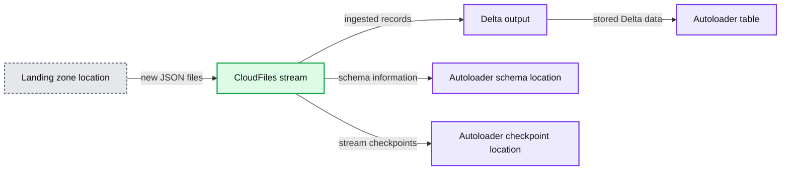

# Getting Started With Ingestion into Delta Lake

- Source: https://www.databricks.com/blog/2021/07/23/getting-started-with-ingestion-into-delta-lake.html
- Published: 2021-07-23
- Authors: John O'Dwyer, Nancy Shah
- Categories: data-engineering, engineering, data-streaming
- Images: 3 total, 2 extracted as architecture

Ingesting data can be hard and complex since you either need to use an always-running streaming platform like Kafka or you need to be able to keep track of which files haven’t been ingested yet. In this blog, we will discuss Auto Loader and COPY INTO, two methods of ingesting data into a Delta Lake table from a folder in a data lake. These two features are especially useful for data engineers, as they make it possible to ingest data directly from a data lake folder incrementally, in an idempotent way, without needing a distributed real-time streaming data system like Kafka. In addition to significantly simplifying the Incremental ETL process, it is extremely efficient for ingesting data since it only ingests new data vs reprocessing existing data.

Now we just threw two concepts out there, idempotent and Incremental ETL, so let’s walk through what these mean:

- **Idempotent**  refers to when processing the same data always results in the same outcome. For example, the buttons in an elevator are idempotent. You can hit the 11th floor button, and so can everyone else that enters the elevator after you; all these 11th floor button pushes are the same data  so it's processed only once. But when someone hits the 3rd floor button, this is new data and will be processed as such. Regardless of who presses it, and on which floor they arrive, pressing a specific button to get to its corresponding floor always produces the same outcome.
- **Incremental ETL** - Idempotency is the basis for Incremental ETL. Since only new data is processed incrementally, Incremental ETL is extremely efficient. Incremental ETL starts with idempotent ingestion then carries that ethos through multiple staging tables and transformations until landing on a gold set of tables that are easily consumed for business intelligence and machine learning.

---

[Explore why lakehouses are the data architecture of the future](https://www.databricks.com/resources/ebook/rise-data-lakehouse?itm_data=ingestiondeltalake-blog-riselakehousebook) with the father of the data warehouse, Bill Inmon.

---

Below is an Incremental ETL architecture. This blog focuses on methods for ingesting into tables from outside sources, as shown on the left hand side of the diagram. .

You can incrementally ingest data continuously or with a scheduled job. COPY INTO and Auto Loader cover both cases.

**Summary:** Delta Lake supports continuous or scheduled ingestion into progressively refined Bronze, Silver, and Gold tables for business intelligence and machine learning.

**Components:**

- Continuous ingest - ingestion source using Delta Lake
- Scheduled ingest - scheduled ingestion source using Delta Lake
- Ingestion tables Bronze - Delta Lake
- Refined tables Silver - Delta Lake
- Feature and aggregate tables Gold - Delta Lake
- Business intelligence - downstream analytics consumer
- Machine learning - downstream modeling consumer

**Flows:**

- Continuous ingest -> Ingestion tables Bronze: continuously ingested data
- Scheduled ingest -> Ingestion tables Bronze: scheduled ingested data
- Ingestion tables Bronze -> Refined tables Silver: raw data refinement
- Refined tables Silver -> Feature and aggregate tables Gold: refined data transformation
- Feature and aggregate tables Gold -> Business intelligence: analytical data
- Feature and aggregate tables Gold -> Machine learning: features and aggregates

**Numbers:** none

source image: https://www.databricks.com/wp-content/uploads/2021/07/Getting-Started-With-Ingestion-into-Delta-Lake-blog-img-1.jpg

```mermaid
%% Delta Lake ingestion and refinement flow
flowchart LR
    CI[Continuous ingest] -->|continuous data| B[Ingestion tables Bronze]
    SI[Scheduled ingest] -->|scheduled data| B
    B -->|raw data refinement| S[Refined tables Silver]
    S -->|data transformation| G[Feature and aggregate tables Gold]
    G -->|analytical data| BI[Business intelligence]
    G -->|features and aggregates| ML[Machine learning]

    subgraph Legend
        L1[client = clients edge gateway LB]
        L2[service = stateless compute]
        L3[store = databases durable storage]
        L4[cache = Redis CDN or losable data]
        L5[queue = Kafka streams or async pipes]
        L6[critical = bottleneck or SPOF]
        L7[external = third party]
        L8[decision = trade off point]
    end

    classDef client   fill:#dbeafe,stroke:#2563eb,stroke-width:2px,color:#111
    classDef service  fill:#dcfce7,stroke:#16a34a,stroke-width:2px,color:#111
    classDef store    fill:#ede9fe,stroke:#7c3aed,stroke-width:2px,color:#111
    classDef cache    fill:#fef3c7,stroke:#d97706,stroke-width:2px,color:#111
    classDef queue    fill:#cffafe,stroke:#0891b2,stroke-width:2px,color:#111
    classDef critical fill:#fee2e2,stroke:#dc2626,stroke-width:4px,color:#111
    classDef external fill:#e5e7eb,stroke:#6b7280,stroke-width:2px,color:#111,stroke-dasharray:4 3
    classDef decision fill:#fce7f3,stroke:#db2777,stroke-width:2px,color:#111

    class CI,SI client
    class B,S,G store
    class BI,ML service
    class L1,L2,L3,L4,L5,L6,L7,L8 external
```

### COPY INTO

[COPY INTO](https://docs.databricks.com/spark/latest/spark-sql/language-manual/delta-copy-into.html) is a SQL command that loads data from a folder location into a Delta Lake table. The following code snippet shows how easy it is to copy JSON files from the source location ingestLandingZone to a Delta Lake table at the destination location ingestCopyIntoTablePath. This command is now re-triable and idempotent, so it can be scheduled to be called by a job over and over again. When run, only new files in the source location will be processed.

A couple of things to note:

- COPY INTO command is perfect for scheduled or ad-hoc ingestion use cases in which the data source location has a small number of files, which we would consider in the thousands of files.
- File formats include JSON, CSV, AVRO, ORC PARQUET, TEXT and BINARYFILE.
- The destination can be an existing Delta Lake table in a database or the location of a Delta Lake Table, as in the example above.
- Not only can you use COPY INTO in a notebook, but it is also the best way to ingest data in [Databricks SQL](https://www.databricks.com/product/databricks-sql).

### Auto Loader

[Auto Loader](https://docs.databricks.com/spark/latest/structured-streaming/auto-loader.html) provides Python and Scala methods to ingest new data from a folder location into a Delta Lake table by using directory listing or file notifications. While Auto Loader is an Apache Spark™ Structured Streaming source, it does not have to run continuously. You can use the [trigger once](https://www.databricks.com/blog/2017/05/22/running-streaming-jobs-day-10x-cost-savings.html) option to turn it into a job that turns itself off, which will be discussed below.  The directory listing method monitors the files in a directory and identifies new files or files that have been changed since the last time new data was processed.  This method is the default method and is preferred when file folders have a smaller number of files in them.  For other scenarios, the file notification method relies on the cloud service to send a notification when a new file appears or is changed. 

[Checkpoints](https://spark.apache.org/docs/latest/streaming-programming-guide.html#checkpointing) save the state if the ETL is stopped at any point. By leveraging checkpoints, Auto Loader can run continuously and also be a part of a periodic or scheduled job. If the Auto Loader is terminated and then restarted, it will use the checkpoint to return to its latest state and will not reprocess files that have already been processed. In the example below, the trigger once option is configured as another method to control the Auto Loader job. It runs the job only once, which means the stream starts and then stops after processing all new data that is present at the time the job is initially run. 

Below is an example of how simple it is to set up Auto Loader to ingest new data and write it out to the Delta Lake table.

**Summary:** Auto Loader reads JSON files from a landing location and writes them to a Delta table with schema and checkpoint management.

**Components:**

- CloudFiles stream using Spark Structured Streaming
- JSON input format
- Landing zone location
- Autoloader schema location
- Delta output format
- Autoloader checkpoint location
- Autoloader table

**Flows:**

- Landing zone location -> CloudFiles stream: new JSON files
- CloudFiles stream -> Delta output: ingested records
- CloudFiles stream -> Autoloader schema location: schema information
- CloudFiles stream -> Autoloader checkpoint location: stream checkpoints
- Delta output -> Autoloader table: stored Delta data

**Numbers:** none

source image: https://www.databricks.com/wp-content/uploads/2021/07/Getting-Started-With-Ingestion-into-Delta-Lake-blog-img-3.png

This one Auto Loader statement:

- Configures the cloudFiles stream.
- Identifies the format of the files expected.
- Defines a location of the schema information.
- Identifies the path to check for new data.
- Writes the data out to a file in the specified format.
- Triggers and runs this Auto Loader statement once, and only once.
- Defines where to manage the checkpoints for this autoloader job.
- Identifies the table to where new data is stored.

In the example above, the initial schema is inferred, but a defined schema can be used instead.  We’ll dive more into inferring schema, schema evolution and rescue data in the next blog of this series.

### Conclusion

At Databricks, we strive to make the impossible possible and the hard easy. COPY INTO and Auto Loader make incremental ingest easy and simple for both scheduled and continuous ETL. Now that you know how to get started with COPY INTO and Auto Loader, we can’t wait to see what you build with them!

 

[DOWNLOAD THIS NOTEBOOK](https://www.databricks.com/notebooks/ingest-getting-started.html)
