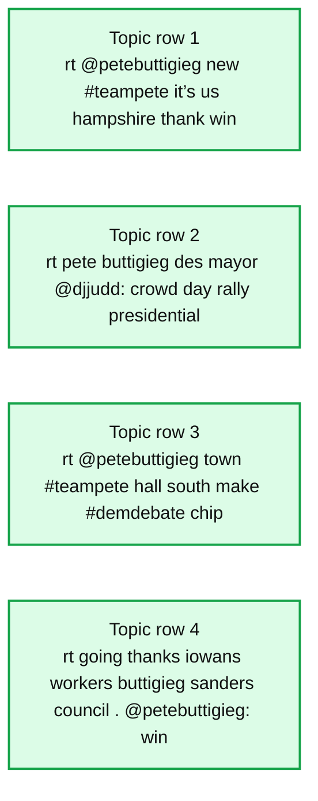

# An Experimentation Pipeline for Extracting Topics From Text Data Using PySpark

- Source: https://www.databricks.com/blog/2021/07/29/an-experimentation-pipeline-for-extracting-topics-from-text-data-using-pyspark.html
- Published: 2021-07-29
- Authors: Srijith Rajamohan, Ph.D.
- Categories: engineering, open-source, data-science-machine-learning
- Images: 1 total, 1 extracted as architecture

This post is part of a series of posts on topic modeling. Topic modeling is the process of extracting topics from a set of text documents. This is useful for understanding or summarizing large collections of text documents.  A document can be a line of text, a paragraph or a chapter in a book. The abstraction of a document refers to a standalone unit of text over which we operate. A collection of documents is referred to as a corpus, and multiple corpus, a corpora.

In this work, we will extract topics from a corpus of documents using the open source Pyspark ML library and visualize the relevance of the words in the extracted topics using Plot.ly. While ideally, one would want to couple the data engineering and model development process, there are times when a  data scientist might want to experiment on model building with a certain dataset.  Therefore, it might be wasteful to run the entire ETL pipeline when the intent is to model experimentation. In this blog, we will showcase how to separate the ETL process from the data science experimentation step using the Databricks Feature Store to save the extracted features so that they can be reused for experimentation. This makes it easier to experiment using various topic modeling algorithms such as LDA  and perform hyperparameter optimization. It also makes the experimentation more systematic and reproducible since the Feature Store allows for versioning as well.

## Outline of the process

In this work, we have downloaded  tweets from various political figures and stored them in the JSON format. The workflow to extract topics from these tweets consists of the following steps

1. Read the JSON data
2. Clean and transform the data to generate the text features
3. Create the Feature Store database
4. Write the generated features to the Feature Store
5. Load the features from the Feature Store and perform topic modeling

## What is the Feature Store?

The general idea behind a feature store is that it acts as a central repository to store the features for different models. The Databricks Feature Store allows you to do the same thing while being integrated into the Databricks unified platform. The Feature Store encourages feature discovery, sharing and lineage tracking. Feature Stores are built on [Delta tables](https://github.com/delta-io/delta), which bring ACID transactions to Spark and other processing engines,

### Load and transform the data

We start by loading the data using Apache Pyspark™ and extracting the necessary fields required for extracting the topics. The duplicate tweets are removed, and the tweets are then tokenized and cleaned by removing the stopwords. While further processing is not done in this work, it is highly recommended to remove links and emoticons.

The words in the corpus are vectorized by word count and the Inverse Document Frequency is then computed (IDF). These are the extracted features in this model that can then be saved and reused in the model building process. Since the feature *rawFeatures*, which stores the IDF values, is a Sparse Vector type and the Feature Store does not support storing arrays, we convert this column into a string so that it can be saved in the Feature Store. We cast this back to a vector while reading it from the Feature Store since we know the schema of the feature, so we can use it in our model.

### Feature Store

#### Save the features

We start off by creating a database to hold our feature table. A feature store client object is created for interacting with this feature store. We create the feature store by specifying at least the name of the store, the keys and the columns to be saved. In the example below, we save four columns from the data frame generated above. Since Feature Stores are Delta tables, the features can be rewritten, and the feature values are simply version controlled so they can be retrieved later, allowing for reproducible experiments.

#### Load the Feature Store

Once the features have been saved, one does not have to rerun the ETL pipeline the next time a data scientist wants to experiment with a different model, saving a considerable amount of time and compute resources. The features can simply be reloaded from the table using fs.read_table by passing the table name and, if desired, the timestamp to retrieve a specific version of the set of features.

Since the transformed IDF values were stored as a string, we need to extract the values and cast it into a Sparse Vector format. The transformation is shown below and the data frame *df_new* is created, which will be fed to the topic modeling algorithm.

### Building the topic model

Once we have set up the data frame with the extracted features, the topics can be extracted using the Latent Dirichlet Allocation (LDA) algorithm from the PySpark ML library.  LDA is [defined](https://www.jmlr.org/papers/volume3/blei03a/blei03a.pdf) as the following:

"*Latent Dirichlet Allocation (LDA) is a generative, probabilistic model for a collection of documents, which are represented as mixtures of latent topics, where each topic is characterized by a distribution over words."*

In simple terms, it means that each document is made up of a number of topics, and the proportion of these topics vary between the documents. The topics themselves are represented as a combination of words, with the distribution over the words representing their relevance to the topic. There are two hyperparameters that determine the extent of the mixture of topics. The topic concentration parameter called 'beta'  and the document concentration parameter called 'alpha' is used to suggest the level of similarity between topics and documents respectively. A high alpha value will result in documents having similar topics and a low value will result in documents with fewer but different topics. At very large values of alpha, as alpha approaches infinity, all documents will consist of the same topics. Similarly, a higher value of beta will result in topics that are similar while a smaller value will result in topics that have fewer words and hence are dissimilar.

Since LDA is an unsupervised algorithm, there is no 'ground truth' to establish the model accuracy. The number of topics *k* is a hyperparameter that can often be tuned or optimized through a metric such as the model perplexity. The alpha and beta hyperparameters can be set using the parameters *setDocConcentration* and *setTopicConcentration,* respectively.

Once the model has been fit on the extracted features, we can create a topic visualization using Plot.ly.

The plot below illustrates the topic distribution as sets of bar charts, where each row corresponds to a topic. The bars in a row indicate the various words associated with a topic and their relative importance to that topic. As mentioned above, the number of topics is a hyperparameter that either requires domain-level expertise or hyperparameter tuning.

*Bar charts of words per topic, each row indicating a topic and the height of the bars indicating the weight of each word*

**Summary:** Bar charts show the relative word weights for multiple extracted text topics.

**Components:**

- Topic row 1 with words rt, @petebuttigieg, new, #teampete, it’s, us, hampshire, thank, win
- Topic row 2 with words rt, pete, buttigieg, des, mayor, @djjudd:, crowd, day, rally, presidential
- Topic row 3 with words rt, @petebuttigieg, town, #teampete, hall, south, make, #demdebate, chip
- Topic row 4 with words rt, going, thanks, iowans, workers, buttigieg, sanders, council, . @petebuttigieg:, win

**Flows:**

- none

**Numbers:** 0, 0.002, 0.004, 0.006, 0.008, 0.02, 0.04, 0.06, 0.08, 0.05, 0.1

source image: https://www.databricks.com/wp-content/uploads/2021/07/Topic-Modeling-Pipeline-Using-Pyspark-blog-img-1.jpg

Bar charts of words per topic, each row indicating a topic and the height of the bars indicating the weight of each word

## Conclusion

We have seen how to load a collection of JSON files of tweets and obtain relatively clean text data. The text was then vectorized so that it could be utilized by one of several machine learning algorithms for NLP). The vectorized data was then saved as features using the Databricks Feature Store so that it can enable reuse and experimentation by the data scientist. The topics were then fed to the  PySpark LDA algorithm and the extracted topics were then visualized using Plot.ly. I would encourage you to try out the notebook and experiment with this pipeline by adjusting the hyperparameters, such as the number of topics, to see how it can work for you!

[TRY THE NOTEBOOK](https://www.databricks.com/notebooks/lda_etl.html)
