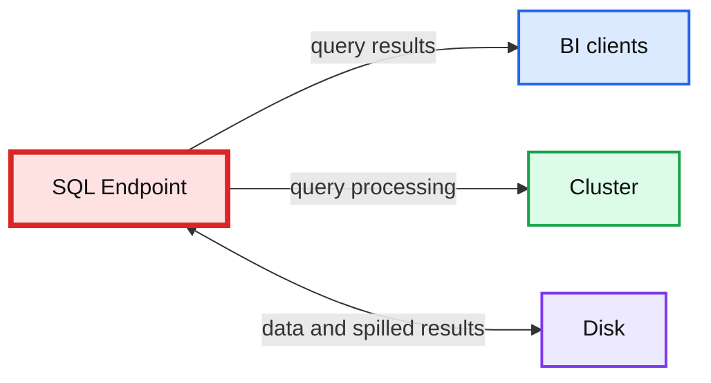
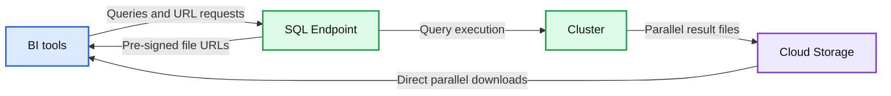
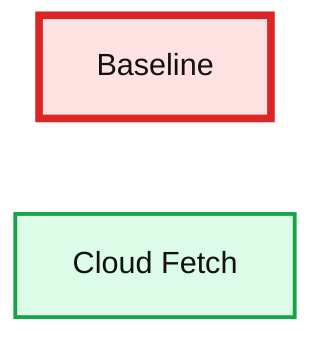

# How We Achieved High-bandwidth Connectivity With BI Tools

- Source: https://www.databricks.com/blog/2021/08/11/how-we-achieved-high-bandwidth-connectivity-with-bi-tools.html
- Published: 2021-08-11
- Authors: Bogdan Ionut Ghit, Juliusz Sompolski, Stefania Leone, Reynold Xin
- Categories: platform, engineering, data-warehousing
- Images: 3 total, 3 extracted as architecture

[Databricks SQL](https://www.databricks.com/product/databricks-sql) is now generally available on AWS and Azure.

 Business Intelligence (BI) tools such as Tableau and Microsoft Power BI are notoriously slow at extracting large query results from traditional data warehouses because they typically fetch the data in a single thread through a SQL endpoint that becomes a data transfer bottleneck. Data analysts can connect their BI tools to Databricks SQL endpoints to query data in tables through an ODBC/JDBC protocol integrated in our Simba drivers. With Cloud Fetch, which we released in Databricks Runtime 8.3 and Simba ODBC 2.6.17 driver, we introduce a new mechanism for fetching data in parallel via cloud storage such as AWS S3 and Azure Data Lake Storage to bring the data faster to BI tools. In our experiments using Cloud Fetch, we observed a 10x speed-up in extract performance due to parallelism.

### Motivation and challenges

BI tools have become increasingly popular in large organizations, as they provide great data visualizations to data analysts  running analytics applications while hiding the intricacies of query execution. The BI tool communicates with the SQL endpoint through a standard ODBC/JDBC protocol to execute queries and extract results. Before introducing Cloud Fetch, Databricks employed a similar approach to that used by Apache Spark™. In this setting, the end-to-end extract performance is usually dominated by the time it takes the single-threaded SQL endpoint to transfer results back to your BI tool.

Prior to Cloud Fetch, the data flow depicted in Figure 1 was rather simple. The BI tool connects to a SQL endpoint backed by a cluster where the query executes in parallel on compute slots. Query results are all collected on the SQL endpoint, which acts as a coordinator node in the communication between the clients and the cluster. To serve large amounts of data without hitting the resource limits of the SQL endpoints, we enable disk-spilling on the SQL endpoint so that results larger than 100 MB are stored on a local disk. When all results have been collected and potentially disk-spilled, the SQL endpoint is ready to serve results back to the BI clients requesting it. The server doesn’t return the entire data at once, but instead it slices it into multiple smaller chunks.

*Figure 1. An overview of the data flow for single-thread BI extracts from a typical data warehouse.*

**Summary:** The diagram shows data flow between BI clients, a SQL endpoint, a compute cluster, and disk storage.

**Components:**

- BI clients - business intelligence tools
- SQL Endpoint - SQL query serving endpoint
- Cluster - compute cluster
- Disk - local disk storage

**Flows:**

- SQL Endpoint -> BI clients: query results
- SQL Endpoint -> Cluster: query processing
- SQL Endpoint <-> Disk: data and spilled results

**Numbers:** none

source image: https://www.databricks.com/wp-content/uploads/2021/08/large-query-blog-single-img.png

Figure 1. An overview of the data flow for single-thread BI extracts from a typical data warehouse.

We identify two main scalability issues that make this data flow inefficient, and put the SQL endpoint at risk of becoming a bottleneck when extracting hundreds of MB:

- **Multi-tenancy. **The limited egress bandwidth may be shared by multiple users accessing the same SQL endpoint. As the number of concurrent users increases, each of them will be extracting data with degraded performance.

- **Lack of parallelism. **Even though the cluster executes the query in parallel, collecting the query results from executors and returning them to the BI tool are performed in a single-thread. While the client fetches results sequentially in chunks of a few MB each, the storing and serving the results are bottlenecked by a single thread on the SQL endpoint.

### Cloud Fetch architecture

To address these limitations, we reworked the data extract architecture in such a way that both the writing and reading of results are done in parallel. At a high-level, each query is split into multiple tasks running across all available compute resources, with each of these tasks writing their results to Azure Data Lake Storage, AWS S3, or Google Cloud Storage. The SQL endpoint sends a list of files as pre-signed URLs to the client, so that the client can download data in parallel directly from cloud storage.

*Figure 2. An overview of the parallel data extract with the Cloud Fetch architecture.*

**Summary:** The diagram shows parallel query result extraction from a Databricks cluster through cloud storage, with BI clients receiving file URLs from the SQL endpoint and downloading results directly.

**Components:**

- BI tools: client applications
- SQL Endpoint: Databricks SQL query service
- Cluster: distributed compute resources
- Cloud Storage: Azure Data Lake Storage, AWS S3, or Google Cloud Storage

**Flows:**

- BI tools -> SQL Endpoint: queries and result file URL list
- SQL Endpoint -> BI tools: pre-signed URLs for result files
- SQL Endpoint -> Cluster: query execution requests
- Cluster -> Cloud Storage: parallel Arrow serialized result files
- Cloud Storage -> BI tools: parallel direct data downloads

**Numbers:** none

source image: https://www.databricks.com/wp-content/uploads/2021/08/large-query-blog-parallel-img.png

Figure 2. An overview of the parallel data extract with the Cloud Fetch architecture.

 

**Data layout.** Query tasks process individual partitions of the input dataset and generate Arrow serialized results. [Apache Arrow](https://arrow.apache.org/) has recently become the de-facto standard for columnar in-memory data analytics, and is already adopted by a plethora of open-source projects. Each query task writes data to cloud storage in 20 MB chunks using the Arrow streaming format. Inside each file, there may be multiple Arrow batches that consist of a fixed number of rows and bytes. We further apply LZ4 compression to the uploaded chunks to address users fetching in bandwidth constrained setups.

**Result collection. **Instead of collecting MBs or GBs of query results, the SQL endpoint is now storing links to cloud storage, so that the memory footprint and the disk-spilling overhead are significantly reduced. Our experiments show that Cloud Fetch delivers more than 2x throughput improvement for query result sizes that are larger than 1 MB. However, uploading results that are smaller than 1 MB to the cloud store is prone to suffer from non-negligible latency. Therefore, we designed a hybrid fetch mechanism that allows us either to inline results and avoid latency on small query results or to upload results and improve throughput for large query results. We identify three possible scenarios when collecting the results on the SQL endpoint:

1. All tasks return Arrow batches and their total size is smaller than 1 MB. This is a case of very short queries that are latency-sensitive and for which fetching via the cloud store is not ideal. We return these results directly to the client via the single-threaded mechanism described above.
2. All tasks return Arrow batches and their total size is higher than 1 MB or tasks return a mix of Arrow batches and cloud files. In this case we upload the remaining Arrow batches to the cloud store from the SQL endpoint using the same data layout as the tasks and store the resulting list of files.
3. All tasks return links to cloud files. In this case, we store the cloud links in-memory and return them to the client upon fetch requests.

**Fetch requests. **When the data is available on the SQL endpoint, BI tools can start fetching it by sequentially requesting small chunks. Upon a fetch request, the SQL Endpoint takes the file corresponding to the current offset and returns a set of pre-signed URLs to the client. Such URLs are convenient for BI clients because they are agnostic of the cloud provider and can be downloaded using a basic HTTP client. The BI tool downloads the returned files in parallel, decompresses their content, and extracts the individual rows from the Arrow batches.

**Experimental results. **We performed data extract experiments with a synthetic dataset consisting of 20 columns and 4 million rows for a total amount of 3.42 GB. With Cloud Fetch enabled we observed a 12x improvement in the extract throughput when compared to the single-threaded baseline.

*Figure 3. The extract throughput of Cloud Fetch versus the single-threaded baseline.*

**Summary:** The chart compares extract throughput for a single-threaded baseline and Cloud Fetch, with Cloud Fetch substantially higher.

**Components:**

- Baseline throughput, approximately 40 MB/s
- Cloud Fetch throughput, approximately 470 MB/s
- Throughput axis measured in MB/s

**Flows:**

- none

**Numbers:** 0, 100, 200, 300, 400, 500, approximately 40 MB/s, approximately 470 MB/s

source image: https://www.databricks.com/wp-content/uploads/2021/08/How-We-Achieved-High-Bandwidth-Connectivity-with-BI-Tools-blog-img-3.png

Figure 3. The extract throughput of Cloud Fetch versus the single-threaded baseline.

## Get started

Want to speed up your data extracts? Get started with Cloud Fetch by downloading and installing the latest [ODBC driver](https://www.databricks.com/spark/odbc-drivers-download). The feature is available in Databricks SQL and interactive Databricks clusters deployed with Databricks Runtime 8.3 or higher both on Azure Databricks and Amazon. We incorporated the Cloud Fetch mechanism in the latest version of the Simba ODBC driver 2.6.17 and in the forthcoming Simba JDBC driver 2.6.18.
