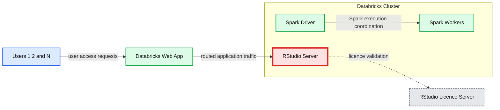
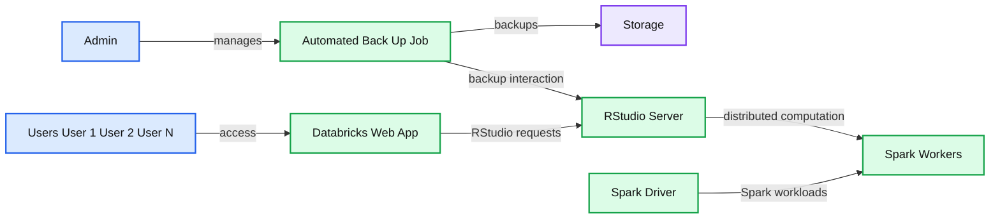

# Make Your RStudio on Databricks More Durable and Resilient

- Source: https://www.databricks.com/blog/2021/08/19/make-your-rstudio-on-databricks-more-durable-and-resilient.html
- Published: 2021-08-19
- Authors: Milos Colic, Robert Whiffin
- Categories: engineering, platform, solutions
- Images: 3 total, 2 extracted as architecture

One of the questions that we often hear from our customers these days is, “Should I develop my solution in Python or R?” There is no right or wrong answer to this question, as it largely depends on the available talent pool, functional requirements, availability of packages that fit the problem domain and many other factors.

It is a valid question, and we believe the answer is actually not to choose, but to embrace the power of being a polyglot data practitioner.

If we elevate our consideration from the individual level to the organizational level, it’s clear that most organizations have a talent pool of experts in Python, R, Scala, Java and other languages. So the question is not which language to choose, but how can data teams support all of them in the most flexible way.

The talent pool of R experts is vast, especially among data scientists, and the pool has matured into an essential component of many solutions; this is why the R language is integral to Databricks as a platform.

In this blog, we will cover the durability of R code in RStudio on Databricks and how to achieve automated code backups to battle potential disastrous code losses.

### A gateway or a roadblock?

Why is RStudio so important? For many individuals, this tool is a favorite coding environment when it comes to R. If properly positioned in your architecture,  RStudio can be the first step for users’ onboarding onto the platform – but it can be a roadblock to cloud adoption if not properly strategized. Through the adoption of cloud concepts, such as SparkR or Sparklyr, users can become more comfortable with using notebooks (and alternative tools) and better equiped for the cloud journey ahead.

However, RStudio can create challenges around code efficiency.  It is often mentioned that other coding languages can run faster, but training your talent on another language, hiring new talent and migrating solutions between two code bases can all easily diminish any efficiency gains produced by a language that executes faster.

Another angle to the matter is that of intellectual property. Many organizations throughout the years have accumulated priceless knowledge in custom-built R packages that embed a huge amount of domain expertise. Migration of such IP would be costly and inefficient.

With these considerations in mind, we can only conclude: R is here to stay!

### RStudio on Databricks

R is a first-class language in Databrick and is supported both in Databricks notebooks and via RStudio on Databricks deployment. Databricks integrates with RStudio Server, which is a popular integrated development environment (IDE) for R. Databricks Runtime ML comes with RStudio Server version 1.2 out of the box.

**Summary:** The diagram shows users accessing an RStudio Server running on a Spark driver within a Databricks cluster, with Spark workers and an external RStudio Licence Server.

**Components:**

- User 1, User 2, and User N clients
- Databricks Web App gateway
- Databricks Cluster
- Spark Driver
- RStudio Server
- Five Spark Worker nodes
- RStudio Licence Server

**Flows:**

- Users -> Databricks Web App: user access requests
- Databricks Web App -> RStudio Server: routed application traffic
- Spark Driver -> Spark Workers: Spark execution coordination
- RStudio Server -> RStudio Licence Server: licence validation

**Numbers:** 1, 2, N, five Spark Worker nodes

source image: https://www.databricks.com/wp-content/uploads/2021/08/Make-your-RStudio-on-Databricks-More-Durable-and-Resilient-blog-img-1.png

RStudio Server runs on a driver node of a Databricks Apache Spark cluster. This means that the driver node of the cluster will act as your virtual laptop. This approach is flexible and allows for considerations that physical PCs do not allow for. Many users can easily share the same cluster and maximize utilisation of resources, and it is fairly easy to upgrade the driver node by provisioning a more performant instance. RStudio comes with integrated Git support, and you can easily pull all your code, which makes migration from physical machine to cloud seamless.

One of the greatest advantages of RStudio on Databricks is its out-of-the-box integration with Spark. RStudio on Databricks supports SparkR and Sparklyr packages that can scale your R code over Apache Spark clusters. This will bring the power of dozens, hundreds or even thousands of machines to your fingertips. This particular feature will supercharge and modernize data science capabilities while decoupling data from compute in a cloud-first solution on a cloud provider of your choice: Microsoft Azure, Google Cloud Platform or AWS. Oh, and the best part? You’re not just restricted to one provider.

### Where has my code gone? 

Of course, even the best solutions aren’t perfect, so let’s dive into some of the challenges. One of the main problems with this deployment is resilience and durability. The clusters that have RStudio running on them require auto-termination to be disabled (more on requisites of RStudio [here](https://docs.databricks.com/spark/latest/sparkr/rstudio.html)), and the reason is simple. All of the user data that is created in RStudio is stored on the driver node.

In this deployment, the driver node contains data for each authenticated user; this data includes their R code, ssh keys used for authentication with Git providers and personal access tokens generated during the first access to RStudio (clicking on “Set up RStudio” button).

Auto-termination is off: Am I safe or not? Not exactly. By disabling auto-termination, you can ensure that the cluster won’t terminate while you’re away from your code. When back in RStudio, you can save your code and back it up against your Git remote repository. However, this is not the only danger to the durability of our code; the admins can potentially terminate clusters, depending on how you are managing permissions. For the sake of this blog, we won't go into details about how to properly structure permissions and entitlements. We will assume that there is a user that can terminate the cluster.

If there is such a user that can terminate the cluster at any given point of time, this increases the fragility of your R code developed in RStudio. The only way to make sure your code will survive such an event is to back up your code against the Git remote repository. This is a manual action that can easily be forgotten.

One other event that can cause loss of work is a catastrophic failure of the driver node, for example, if a user tries to bring an inappropriate amount of data into the driver’s memory. In such cases, the driver node can go down and the cluster will require a restart. In practical terms, any event in code that overutilizes allocated heap memory can lead to the termination of the driver node. If you have not explicitly backed up your data and your code, you can lose substantial amounts of valuable work. Let’s walk through some solutions to this problem.

### Databricks RStudio Guardian 

Given the importance of RStudio in your overall technology ecosystem, we have come up with a solution that can drastically reduce the chances of losing work in RStudio on Databricks: a guardian job.

We propose a guardian job running in the background of the RStudio with a predefined frequency that will take a snapshot of the project files for each onboarded user, and back it up on DBFS (Databricks File System) location or a dedicated mount on your storage layer. While DBFS can be used for a small amount of users’ data, a dedicated mount would be a preferred solution.  For details on how to set up a job in Databricks, please refer to the [documentation](https://docs.databricks.com/jobs.html).

Each user has a directory created on the driver node under /home/ directory. This directory contains all the relevant RStudio files. An example of such folder structure is shown below:

In this list,you can identify three different project directories. In addition, there are several other important directories, most notably the .ssh directory containing your ssh key pair.

For brevity’s sake, this blog focuses on the project directories and .ssh directory, but the below approach can easily be extended to other directories of interest. We treat project directories as a set of documents that can simply be copied to a dedicated directory in your DBFS. We advise that the location to which you are backing up the code only be accessible to an admin account and that the job associated with the backup process is run by that admin account. This will reduce the chance of undesired access to any R code that is stored in the backup. The full code required for such a process is shared in the notebooks attached to this blog.

**Summary:** The diagram shows a Databricks cluster running RStudio Server, connected to users, a web application, Spark workers, storage, and an automated backup job.

**Components:**

- Admin - administrator account
- Users - User 1, User 2, and User N
- Databricks Web App - web application
- Databricks Cluster - compute cluster
- Spark Driver - Spark driver node
- RStudio Server - RStudio server
- Spark Workers - Spark worker nodes
- Automated Back Up Job - scheduled backup process
- Storage - durable storage

**Flows:**

- Admin -> Automated Back Up Job: manages the backup job
- Users -> Databricks Web App: user access
- Databricks Web App -> RStudio Server: RStudio requests
- Automated Back Up Job -> Storage: backups
- Automated Back Up Job -> RStudio Server: backup-related interaction
- Spark Driver -> Spark Workers: Spark workloads
- RStudio Server -> Spark Workers: distributed computation

**Numbers:** 1, 2

source image: https://www.databricks.com/wp-content/uploads/2021/08/Protecting-end-user-data-in-RStudio-blog-img-3.png

On the other hand, the .ssh directory requires a slightly different approach. Inside the .ssh directory, both users' public and private keys are stored. While the public key does not require any further care than that of any other file, the private key is considered sensitive data and does require proper care. Enter scene Databricks CLI and Databricks Secrets. With Databricks CLI, we get an easy way to interact programmatically with Databricks Secrets and via secrets a way to securely store sensitive data. We can easily install Databricks CLI on a cluster by running:

This allows to run the following command in shell:

There are few considerations to keep in mind. Ssh keys generated by RStudio will implement the RSA algorithm, with a default private key size of 2048 bits. Secrets do have a limit on how much data can be stored in a single scope; up to a 1000 individual secrets can be stored in a single scope. Furthermore, each secret must be 128KB of data or less. Given these considerations and constraints, we propose one secret per user that contains any sensitive data. This would require storing data as a JSON string in case of multiple sensitive values:

The previous example illustrates how to construct a JSON string containing a private key payload together with the two additional secrets required for the user to carry out their work. This approach can be extended to contain any number of sensitive values as long as their combined size fits within the 128KB limit. An alternative approach would be to have a separate secret for each stored value; this would reduce the maximum number of users per RStudio cluster that can be backed up to 1000/N users, where N is the number of stored secrets per user.

In the case where more than 1000 users are accessing the same RStudio instance and require automatic backups (or 333 users if we keep 3 separate secrets per user), you can create multiple secret scopes and iterate through scopes per each 1000 user batch.

### Restoring the state

Now that backups are being created, in case of termination of RStudio cluster, we can easily restore the last known previous state of the cluster’s home directory and all the important users’ data that we have backed up, including ssh keys. Backing up ssh keys is important from an automation perspective, if we chose not to store ssh keys, each time we have RStudio cluster restarted, we would require a recreation of such keys and reintegration of such keys with the settings of our account on our Git provider. Storing ssh keys inside a dedicated secret scope removes this burden from the end user.

Databricks has created a second notebook that restores all backed up R projects for all RStudio users and their code. This notebook should be run on demand once the RStudio has been created and warmed up.

This functionality unlocks several different aspects of the platform; the code is now more durable and automatically backed up. If the cluster requires reconfiguration, the last known state can be easily restored and is no longer conditioned on everyone manually pushing their code to a Git repository. Note that storing your code against Git frequently is still the best practice, and our solution intends to augment such best practices – not replace them.

## Get started

To implement this solution please use the following notebooks as a baseline for the automated backup and on-demand restore procedure.

- [Automated Backup Notebook](https://www.databricks.com/notebooks/rstudio/rstudio-automated-backup.html)
- [On-demand Restore Notebook](https://www.databricks.com/notebooks/rstudio/rstudio-manual-restore.html)
