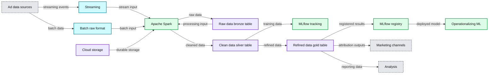
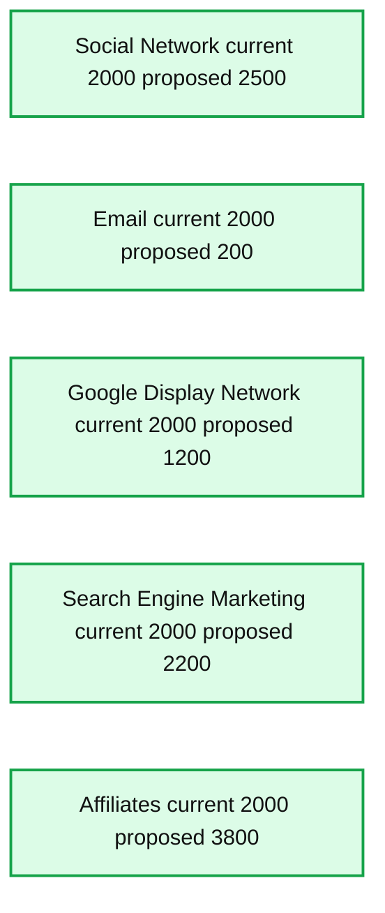

# Solution Accelerator: Multi-touch Attribution

- Source: https://www.databricks.com/blog/2021/08/23/solution-accelerator-multi-touch-attribution.html
- Published: 2021-08-23
- Authors: Debu Sinha, Dan Morris
- Categories: solutions, engineering, solution-accelerators, data-science-machine-learning, data-engineering
- Images: 2 total, 2 extracted as architecture

Behind the growth of every consumer-facing product is the acquisition and retention of an engaged user base. When it comes to customer acquisition, the goal is to attract high-quality users as cost effectively as possible. With marketing dollars dispersed across a wide array of different touchpoints -- campaigns, channels, and creatives -- measuring effectiveness is a challenge. In other words, it's difficult to know how best to assign credit. This is where multi-touch attribution comes into play.

## Introducing the Multi-touch Attribution Solution Accelerator from Databricks

Based on best practices from our work with leading global brands across all industries, we've developed [solution accelerators](https://www.databricks.com/solutions/accelerators) for common analytics and machine learning (ML) use cases to save weeks or months of development time for your data engineers and data scientists.

Marketers and ad agencies are being held responsible to 1) demonstrate return on investment of their marketing dollars and 2) optimize marketing channel spend to drive sales. This solution accelerator complements our [Sales Forecasting & Ad Attribution Solution Accelerator](https://www.databricks.com/blog/2020/10/05/measuring-advertising-effectiveness-with-sales-forecasting-and-attributing.html) by helping to optimize marketing spend via accurately assigning credit to marketing channels using multi-touch attribution.

Using a synthetic dataset that consists of ad impressions and conversions, this solution accelerator:

- introduces a new multi-touch attribution model, with a collection of methods used to optimize ad spend across multiple customer channels.
- compares and contrasts heuristic-based attribution methods, such as first-touch and last-touch attribution models, as well as data-driven methods, such as markov chains.
- implements first-touch, last-touch, and markov chain attribution models.
- walks through the steps required to productionalize multi-touch attribution on your existing Databricks Lakehouse.
- creates a dashboard that marketers can use to optimize their spend across various channels.

By deploying this use case on Databricks, you can easily incorporate any type of data -- whether batch or streaming, raw or curated -- and then surface your results through your BI tool of choice.

*Fig 1: Multi-touch Attribution Reference Architecture*

**Summary:** Reference architecture for multi-touch attribution, from batch and streaming ad data ingestion through Databricks processing, MLflow-managed training, operationalization, marketing channels, and analysis.

**Components:**

- Ad server user activity logs
- Ad exchange
- DMP logs
- DSP logs
- Ad spending
- Streaming sources using Azure Event Hubs, GCP Pub/Sub, Kafka, and AWS Kinesis
- Batch raw format
- Apache Spark unified batch and streaming processing
- Raw data bronze table
- Clean data silver table
- Refined data gold table
- MLflow tracking and registry
- Operationalizing ML using Docker, Kubernetes, and cloud ML platforms
- Marketing channels including Google AdWords, Facebook Marketing, banner ads, YouTube, email, and Snapchat
- Analysis tools including AWS QuickSight, Databricks SQL, Looker, Power BI, and Tableau
- Storage using Google Cloud Storage, Azure Data Lake, and Amazon S3

**Flows:**

- Ad server user activity logs -> Streaming: streaming events
- Ad exchange -> Batch: batch data
- DMP logs -> Batch: batch data
- DSP logs -> Batch: batch data
- Ad spending -> Batch: batch data
- Streaming -> Apache Spark: streaming input
- Batch -> Raw data bronze table: raw batch data
- Apache Spark -> Raw data bronze table: processed raw data
- Raw data bronze table -> Apache Spark: raw data processing
- Apache Spark -> Clean data silver table: cleaned data
- Clean data silver table -> Apache Spark: transformation input
- Clean data silver table -> MLflow tracking: training data
- MLflow tracking -> Clean data silver table: tracked training workflow
- Clean data silver table -> Refined data gold table: refined attribution data
- Refined data gold table -> MLflow registry: model or result registration
- MLflow registry -> Refined data gold table: registered model or result access
- MLflow registry -> Operationalizing ML: deployed model
- Refined data gold table -> Marketing channels: attribution outputs
- Refined data gold table -> Analysis: reporting data
- Google Cloud Storage, Azure Data Lake, and Amazon S3 -> data pipeline: durable storage

**Numbers:** 10, 01

source image: https://www.databricks.com/wp-content/uploads/2021/08/multi-touch-attribution-solution-accelerator-hub-blog-img-1.jpg

Fig 1: Multi-touch Attribution Reference Architecture

## About attribution modeling

A customer can have dozens of interactions with a brand before making a purchase. In this scenario, should we simply assign credit for the purchase to the ad that the customer converted on, or should we assign some portion of the credit to each and every interaction? If the latter, how should we decide how much credit to assign each interaction?

This is the problem that attribution modeling helps solve.

*Attribution modeling* is an approach to assigning credit to various touchpoints in a conversion path. It helps marketers visualize and understand the customer journey, trends, and how prospects move through the sales cycle. At a high level, credit assignment is typically done using one of two methods: heuristic or data-driven. Heuristic methods are rule-based, whereas data-driven methods use probabilities and statistics to assign credit.

Commonly used heuristic-based methods include the following:

- **First-touch** attribution model is a single-touch method that assigns full credit to the first channel that a customer interacts with prior to a conversion.
- **Last-touch** attribution is a single-touch method that assigns full credit to the last channel that a customer interacts with prior to a conversion.
- **Linear attribution** model is a multi-touch method that assigns credit uniformly across all channels.
- **Time decay model** is a multi-touch method that assigns an increasing amount of credit to channels that appear closer in time to a conversion event.

Heuristic methods are relatively easy to implement but are less accurate than data-driven methods. With marketing dollars at stake, data-driven methods are highly recommended.

Commonly used data-driven methods include the following:=

- **Markov chains:** this approach generates a probabilistic graph between all marketing channels by taking into account each customer's journey, in sequential order. Once this probabilistic graph is generated, credit is assigned by calculating the 'removal effect' for each and every channel.
- **Shapley:** this approach takes into account each customer's journey as well but disregards the sequence in which interactions take place.

## Using multi-touch attribution in production

To realize the full value of multi-touch attribution, it's critical that the output is used to guide how marketing spend is allocated on an ongoing basis. For example, suppose you start a campaign by allocating your spend equally across five digital marketing channels. After your marketing campaign has been live for some time, you find that your affiliates channel is extremely efficient, accounting for 39% of attribution with just 20% of total spend. With this insight, you could then adjust your spend allocation accordingly and yield a higher return on ad spend (ROAS).

*Fig 2: Data Driven Budget Allocation*

**Summary:** The chart compares current and proposed budget allocations across five marketing channels.

**Components:**

- Social Network channel: current budget $2,000, proposed budget $2,500
- Email channel: current budget $2,000, proposed budget $200
- Google Display Network channel: current budget $2,000, proposed budget $1,200
- Search Engine Marketing channel: current budget $2,000, proposed budget $2,200
- Affiliates channel: current budget $2,000, proposed budget $3,800
- Spending legend: current spending and proposed spending

**Flows:**

- none

**Numbers:** $0, $500, $1,000, $1,500, $2,000, $2,500, $3,000, $3,500; Social Network current $2,000 and proposed $2,500; Email current $2,000 and proposed $200; Google Display Network current $2,000 and proposed $1,200; Search Engine Marketing current $2,000 and proposed $2,200; Affiliates current $2,000 and proposed $3,800

source image: https://www.databricks.com/wp-content/uploads/2021/08/multi-touch-attribution-solution-accelerator-hub-blog-img-2-1.png

Fig 2: Data Driven Budget Allocation

## Getting started

The purpose of this solution accelerator is to demonstrate how to assign conversion credit to marketing channels using multi-touch attribution. Get started today by importing this solution accelerator into your Databricks workspace.

 
[Try the Notebook](https://notebooks.databricks.com/notebooks/CME/Multi-touch_Attribution/index.html)
