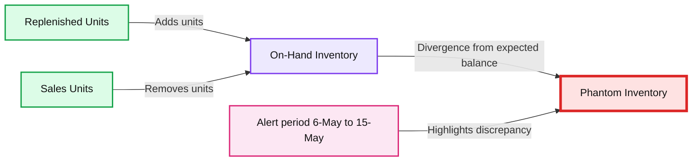
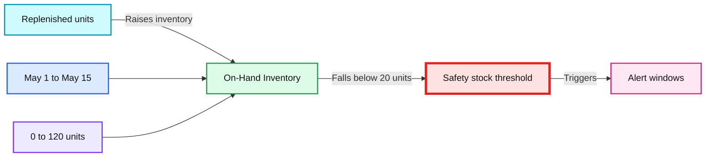
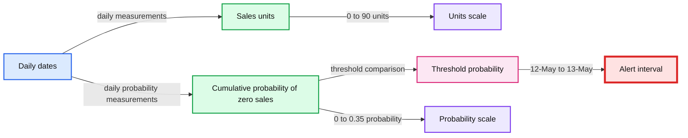
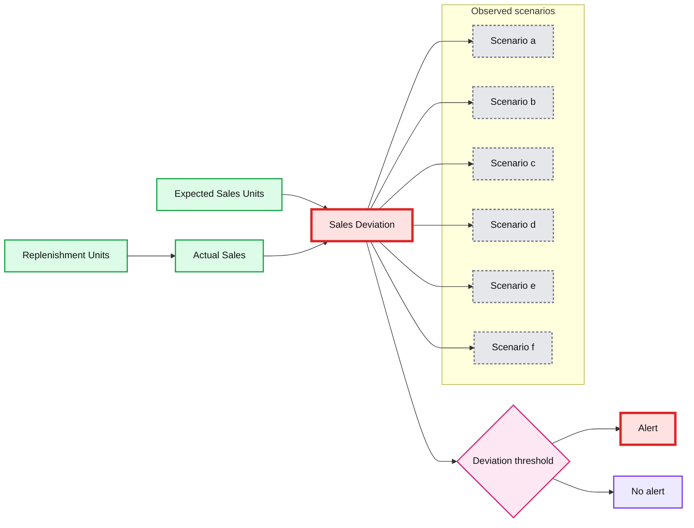

# Improving On-Shelf Availability for Items With AI Out of Stock Modeling

- Source: https://www.databricks.com/blog/2021/08/24/improving-on-shelf-availability-for-items-with-ai-out-of-stock-modeling.html
- Published: 2021-08-24
- Authors: Rich Williams, Morgan Seybert, Rob Saker, Bryan Smith
- Categories: engineering, solution-accelerators, data-science-machine-learning, data-engineering
- Images: 5 total, 4 extracted as architecture

This post was written in collaboration with Databricks partner Tredence. We thank Rich Williams, Vice President Data Engineering, and Morgan Seybert, Chief Business Officer, of Tredence for their contributions.

 
 Retailers are missing out on nearly [$1 trillion in global sales](https://www.retaildive.com/news/out-of-stocks-could-be-costing-retailers-1t/526327/) because they don't have on-hand what customers want to buy in their stores. Adding to the challenge, a  [study](https://www.retaildive.com/news/out-of-stocks-could-be-costing-retailers-1t/526327/) of 600 households and several retailers by research firm IHL Group details that shoppers encounter out-of-stocks (OOS) as often as one in three shopping trips, according to the report. And a study by [IRI](https://cdn.ymaws.com/www.theipm.org.uk/resource/resmgr/communities/connected_shopper/osa_white_paper_-_final__1_.pdf) found that 20% of all out-of-stocks remain unresolved for more than 3 days.

Overall, studies [show](https://www.winsightgrocerybusiness.com/operations/inventory-management-out-time-out-stocks) that the average OOS rate is about **8%**. That means that **one out of 13 products** is not purchasable at the exact moment the customer wants to get it in the store. OOS is one of the biggest problems in retail, but thankfully it can be solved with real-time data and analytics.

In this write-up, we showcase the new Tredence-Databricks combined On-Shelf Availability Solution Accelerator. The accelerator is a robust quick-start guide that is the foundation for a full Out of Stock or Supply Chain solution. We outline how to approach out-of-stocks with the Databricks Lakehouse to solve for  on-shelf availability in real-time.

And the impact of solving this problem? A 2% improvement in on-shelf availability is worth 1% in increased sales for retailers.

## Growth in e-commerce makes item availability more important

The significance of this problem has been amplified by the availability of e-commerce for delivery and curbside pickup orders. While customers that face an out-of-stock at the store level may just not purchase that item, they are likely to purchase other items in the store. Buying online means that they may just switch to a different retailer.

The impact is not just limited to a bottom line loss in revenue. Research from NielsenIQ [shows](https://www.theshelbyreport.com/2021/03/25/nielseniq-830m-in-lost-toilet-paper-sales-due-to-out-of-stocks/) that 30% of shoppers will visit new stores when they can't find the product they are looking for, leading to a loss in long-term loyalty.  Members of e-commerce membership programs are most likely to switch retailers in the event of an out of stock. IHL [estimates](https://qz.com/1319700/amazon-profits-when-us-stores-dont-have-products-in-stock/) that "upwards of 24% of Amazon's current retail revenue comes from customers who first tried to buy the product in-store."

Retailers have responded to this with a variety of tactics including over-ordering of items, which increases carrying costs and lowers margins when they are forced to sell excess inventory at a discount. In some instances, retailers and distributors will rush order products or use intra-delivery "hot shots" for additional deliveries which come at an additional cost. Some retailers have invested in robotics, but many pull  out of their pilots citing costs. And other retailers are experimenting with computer vision, although these approaches merely notify when an item is unavailable and don't predict item availability.

It's not just retailers that are impacted by OOS.  Retailers, consumer goods companies, distributors, brokers and other firms each invest in third-party audits, which typically involve employees visiting stores to identify gaps on the shelf. On any given day, tens of thousands of individuals are visiting stores to validate item availability. Is this really the best use of time and resources?

## Why hasn't technology solved out-of-stocks yet?

Out-of-stock issues have been around for decades, so why hasn't the retail industry been able to solve an issue of this magnitude that impacts shoppers, retailers and brands alike?  The seemingly simple solution is to require employees to manually count the items on hand. But with potentially hundreds of thousands of individual SKUs distributed across a large format retail location that may be servicing customers nearly 24-hours a day, this simply isn't a realistic task to perform on a regular basis.

Individual stores   do perform inventory counts periodically and then rely on point-of-sale (POS) and inventory management software to track changes that drive unit counts up and down. But with so much activity within a store location, some of the day-to-day recordkeeping falls through the cracks, not to mention the impact of shrinkage, which can be hard to detect, on in-store supplies.

So the industry falls back on modeling. But given fundamental problems in data accuracy, these approaches can drive a combination of false positives and false negatives that make model predictions difficult to employ. Time sensitivities further exacerbate the problem, as the large volume of data that often must be crunched in order to arrive at model predictions must be handled fast enough for the results to be actionable. The problem of building a reliable system for stockout prediction and alerting is not as straightforward as it might appear.

## Introducing the On-shelf Availability Solution Accelerator

Our partners at [Tredence](https://www.tredence.com/) approached us with the idea of publishing a Solution Accelerator that they've created as the core of a broader Supply Chain Control Tower offering. Tredence works with the largest retailers on the planet and understands the nuances of modeling OOS and knew that Databricks' processing and their advanced data science capabilities were a winning combination.

While the OSA solution focuses on driving sales through improved stock availability on the shelves, the broader Retail Supply Chain Control Tower solves for multiple adjacent merchandising problems – inventory design for the stores, efficient store replenishments, design of store network for omnichannel operations, etc. Knowing how big a problem this is in retail, we immediately took them up on their offer.

The first step in addressing OSA challenges is to examine their occurrence in the historical data. Past occurrences point to systemic issues with suppliers and internal processes, which will continue to cause problems if not addressed.

To support this analysis, Tredence made available a set of historical inventory and sales data.  These data sets were simulated given the obvious sensitivities any retailer would have around this information, but were created in a manner that frequently observed OSA challenges manifested in the data.  These challenges were:

1. Phantom inventory
2. Safety stock violations
3. Zero-sales events
4. On-shelf availability

**Phantom inventory**

In a phantom inventory scenario, the units reported to be on-hand do not align with units expected based on reported sales and replenishment.

*Figure 1. The misalignment of reported inventory with inventory expected based on sales and replenishment creating phantom inventory*

**Summary:** The chart shows reported on-hand inventory diverging from inventory implied by sales and replenishment, creating phantom inventory during an alert period.

**Components:**

- On-Hand Inventory - technology not specified
- Sales Units - technology not specified
- Replenished Units - technology not specified
- Phantom Inventory - calculated inventory gap
- Alert period - marked from 6-May to 15-May
- Units axis and date timeline - chart axes

**Flows:**

- Replenished Units -> On-Hand Inventory: increases reported inventory
- Sales Units -> On-Hand Inventory: decreases expected inventory
- On-Hand Inventory -> Phantom Inventory: divergence creates an inventory gap
- Alert period -> Phantom Inventory: highlights sustained discrepancy

**Numbers:** 0, 20, 40, 60, 80, 100, 120, 140, 160 units; 1-May, 2-May, 3-May, 4-May, 5-May, 6-May, 7-May, 8-May, 9-May, 10-May, 11-May, 12-May, 13-May, 14-May, 15-May

source image: https://www.databricks.com/wp-content/uploads/2021/08/SA-Improving-On-shelf-Availability-W_-AI-blog-img-2.jpg

Figure 1. The misalignment of reported inventory with inventory expected based on sales and replenishment creating phantom inventory

 

Poor tracking of replenishment units, unreported or undetected shrinkage, and out-of-band processes coupled with infrequent and sometimes inaccurate inventory counts create a situation where retailers believe they have more units on hand than they actually do. If large enough, this phantom inventory may delay or even prevent the ordering of replenishment units leading to an out-of-stock scenario.

**Safety stock violations**

Most organizations establish a threshold for a given product's inventory below, which replenishment orders are triggered. If set too low, inadequate lead times or even minor disruptions to the supply chain may lead to an out-of-stock scenario while new units are moving through the replenishment pipeline.

*Figure 2. Safety stock levels not providing adequate lead time to prevent out-of-stock issues*

**Summary:** The chart shows on-hand inventory declining below a 20-unit safety stock threshold, with replenishment events and alert windows across May 1-15.

**Components:**

- Safety stock threshold
- Replenished units
- On-hand inventory
- Alert windows
- Date axis from 1-May to 15-May
- Units axis from 0 to 120

**Flows:**

- On-hand inventory -> Safety stock threshold: Inventory falls below the replenishment trigger
- Safety stock threshold -> Alert window: Safety stock violation generates an alert
- Replenished units -> On-hand inventory: Replenishment raises inventory levels

**Numbers:** 0, 20, 40, 60, 80, 100, 120 units; 1-May, 2-May, 3-May, 4-May, 5-May, 6-May, 7-May, 8-May, 9-May, 10-May, 11-May, 12-May, 13-May, 14-May, 15-May; visible inventory values approximately 100, 90, 70, 65, 50, 20, 8, 5, 0, 75, 40, 25, 18, 12, 80; alert intervals 6-May to 9-May and 13-May to 14-May

source image: https://www.databricks.com/wp-content/uploads/2021/09/osa_tredence_safetystock.png

Figure 2. Safety stock levels not providing adequate lead time to prevent out-of-stock issues

The flip side of this is that if set too high, retailers risk overstocking products that may expire, risk damage or theft or otherwise consume space and capital that may be better employed in other areas. Finding the right safety stock level for a product in a specific location is a critical task for effective inventory management.

**Zero-sales events**

Phantom inventory and safety stock violations are the two most common causes of out-of-stocks. Regardless of the cause, out-of-stock events manifest themselves in periods when no units of a product are sold.

Not every occurrence of a zero-sales event reflects an out-of-stock concern. Some products don't sell every day, and for some slow-moving products, multiple days may go by within which zero units are sold while the product remains adequately stocked.

*Figure 3. Examining the cumulative probability of consecutive zero-sales events to identify potential out-of-stock issues*

**Summary:** The chart compares sales units with cumulative probability of consecutive zero-sales events against a probability threshold to identify out-of-stock alerts.

**Components:**

- Threshold probability band
- Sales units series
- Cumulative probability of zero sales series
- Units axis
- Probability axis
- Date axis
- Alert interval

**Flows:**

- Date axis -> Sales units: daily sales measurements
- Date axis -> Cumulative probability of zero sales: daily zero-sales probability measurements
- Cumulative probability of zero sales -> Threshold probability band: threshold comparison
- Threshold probability band -> Alert interval: out-of-stock alert when probability remains below threshold

**Numbers:** 1-May, 2-May, 3-May, 4-May, 5-May, 6-May, 7-May, 8-May, 9-May, 10-May, 11-May, 12-May, 13-May, 14-May, 15-May; units axis 0, 10, 20, 30, 40, 50, 60, 70, 80, 90; probability axis 0, 0.05, 0.1, 0.15, 0.2, 0.25, 0.3, 0.35; alert interval from 12-May to 13-May

source image: https://www.databricks.com/wp-content/uploads/2021/08/SA-Improving-On-shelf-Availability-W_-AI-blog-img-3.jpg

Figure 3. Examining the cumulative probability of consecutive zero-sales events to identify potential out-of-stock issues

The trick for scrutinizing zero-sales events at the item level is to understand the probability with which at least one unit of a product sells on a given day and to then to set a cumulative probability threshold for consecutive days reflecting zero-sales. When the cumulative probability of back-to-back zero-sales events exceeds the threshold, it's time for the inventory of that product to be examined.

**On-shelf availability**

While understanding scenarios in which items are not in-stock is critical, it's equally important to recognize when products are technically available for sale but underperforming because of non-optimal inventory management practices. These merchandising problems may be due to poor placement of displays within the store, the stocking of products deep within a shelf, the slow transfer of product from the backroom to shelves, or a myriad of other scenarios in which inventory is adequate to meet demand but customers cannot easily view or access them.

*Figure 4. Depressed sales due to poor product placement leading to an on-shelf availability problem.*

**Summary:** Six scenarios show on shelf availability alerts generated by deviations between actual and expected sales, including replenishment effects.

**Components:**

- Actual Sales, shown as a solid blue curve
- Expected Sales Units, shown as a dashed gray curve
- Replenishment Units, shown as solid gray vertical markers
- Deviation below threshold, shown as green arrows
- Deviation above threshold, shown as red arrows
- Alert, shown beneath affected periods

**Flows:**

- Expected Sales Units -> Actual Sales: sales deviation is measured
- Replenishment Units -> Actual Sales: replenishment changes observed sales
- Actual Sales -> Alert: sustained deviation triggers an alert
- Deviation below threshold -> Alert: indicates a lower-than-expected condition
- Deviation above threshold -> Alert: indicates a higher-than-expected condition

**Numbers:** none

source image: https://www.databricks.com/wp-content/uploads/2021/08/SA-Improving-On-shelf-Availability-W_-AI-blog-img-4.jpg

Figure 4. Depressed sales due to poor product placement leading to an on-shelf availability problem.

To detect these kinds of problems, it is helpful to compare actual sales to those forecasted for the period. While not every missed sales goal indicates an on-shelf availability problem, a sustained miss might signal a problem that requires further attention.

## How we approach out-of-stocks with the Databricks Lakehouse Platform

The evaluation of phantom inventories, safety stock violations, zero sales events and on-shelf availability problems requires a platform capable of performing a wide range of tasks. Inventory and sales data must be aggregated and reconciled at a per-period level. Complex logic must be applied across these data to examine aggregate and series patterns. Forecasts may need to be generated for a wide range of products across numerous locations. And the results of all this work must be made accessible to the business analysts responsible for scrutinizing the findings before soliciting action from those in the field.

Databricks provides a single platform capable of all this work. The [elastic scalability](https://www.databricks.com/product/production-ready) of the platform ensures that the processing of large volumes of data can be performed in an efficient and timely manner. The flexibility of its development environment allows data engineers to pivot between common languages, such as [SQL](https://docs.databricks.com/spark/latest/spark-sql/index.html) and [Python](https://docs.databricks.com/languages/python.html), to perform data analysis in a variety of modes.

[Pre-integrated libraries](https://docs.databricks.com/runtime/index.html) provide support for classic time series forecasting algorithms and techniques, and easy [programmatic installation](https://docs.databricks.com/libraries/notebooks-python-libraries.html)s of alternative libraries such as Facebook Prophet allow data scientists to deliver the right forecast for the business's needs. [Scalable patterns](https://www.databricks.com/blog/2021/04/06/fine-grained-time-series-forecasting-at-scale-with-facebook-prophet-and-apache-spark-updated-for-spark-3.html) ensure data science tasks are also tackled in an efficient and timely manner with little deviation from the standard approaches data scientists typically employ.

And the [SQL Analytics](https://www.databricks.com/product/databricks-sql) interface, as well as robust integrations with [Tableau](https://docs.databricks.com/integrations/bi/tableau.html) and [PowerBI](https://docs.databricks.com/integrations/bi/power-bi.html), allows analysts to consume the results of the data scientists' and data engineers' work without having to first port the data to alternative platforms.

## Getting started

Be sure to check out and download the notebooks for Out-of-Stock modeling. As with any of our Solution Accelerators, these are a foundation for a full solution. If you would like help with implementing a full Out-of-Stock or Supply Chain solution, go visit our friends at [Tredence](https://www.tredence.com/).

To see these features in action, please check out the [following notebooks](https://www.databricks.com/solutions/accelerators/on-shelf-availability) demonstrating how Tredence tackled out-of-stocks on the Databricks platform.
