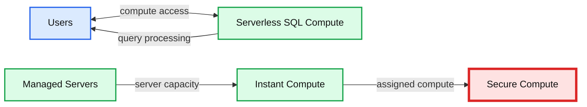
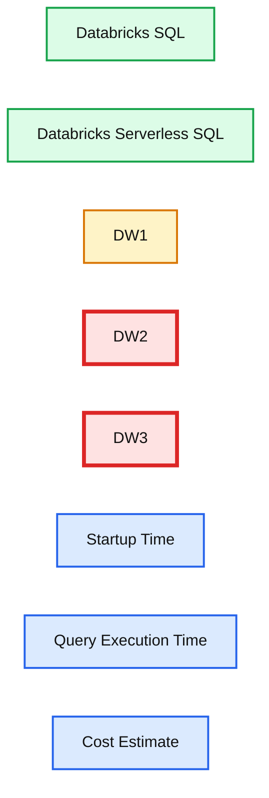

# Announcing serverless compute for Databricks SQL

*Instant compute with minimal management and lower costs for BI and SQL*

- Source: https://www.databricks.com/blog/2021/08/30/announcing-databricks-serverless-sql.html
- Published: 2021-08-30
- Authors: Nikhil Jethava, Kevin Clugage
- Categories: platform, announcements, data-warehousing
- Images: 4 total, 2 extracted as architecture

[Databricks SQL Serverless](https://www.databricks.com/product/databricks-sql) is now generally available. Read [our blog](https://www.databricks.com/blog/announcing-general-availability-databricks-sql-serverless) to learn more.

 

[Databricks SQL](https://www.databricks.com/product/databricks-sql) already provides a first-class user experience for BI and SQL directly on the data lake, and today, we are excited to announce another step in making data and AI simple with serverless compute for Databricks SQL. This new capability for Databricks SQL provides instant compute to users for their BI and SQL workloads, with minimal management required and capacity optimizations that can lower overall cost by an average of 40%. This makes it even easier for organizations to expand adoption of the lakehouse for business analysts who are looking to access the rich, real-time datasets of the lakehouse with a simple and performant solution.

[Under the hood](https://www.databricks.com/resources/ebook/bring-data-warehousing-data-lakes?itm_data=announcingserverless-blog-whylakehouseisnextdw) of this capability is an active server fleet, fully managed by Databricks, that can transfer compute capacity to user queries, typically in about 15 seconds. The best part? You only pay for serverless compute when users start running reports or queries.

Organizations with business analysts who want to analyze data in the data lake with their favorite BI tools will benefit from this capability. First, connecting BI tools to Databricks SQL Serverless is easy, especially with built-in connectors using optimized JDBC/ODBC drivers for easy authentication support and high performance.

 Connect your favorite BI or SQL tool

Second, Serverless SQL was built for the modern business analyst, who works on their own schedules and wants instant compute available to process their queries without waiting for clusters to start up or scale out. Administrators are the ones battling to stay ahead of these user workloads with manual configurations and cluster startups/shutdown schedules, but it’s imperfect at best and incurs extra costs for over-provisioning and excess idle time.

 Enable Serverless SQL
 with 1-click

This is where Serverless SQL shines with instant compute availability for all users. It only takes one click to enable, there is no performance tuning, and patching and upgrades are managed automatically. By default, if at any point the cluster is idle for 10 minutes, Serverless SQL will automatically shut it down, remove the resources and prepare to start the instant compute process over again for the next query. This is how Serverless SQL helps lower overall costs – by matching capacity to usage that avoids over-provisioning and idle capacity when users are inactive.

Customers have already started using Serverless SQL and seen the benefits:

>  “Having the ability to fetch data ad-hoc with compute available within seconds helps our teams get answers quickly. Being able to autoscale up and down aggressively given the fast startup time makes our spiky workloads with BI and reporting tools easier to manage.” Anup Segu, Data Engineering Tech Lead, YipitData

>  “Serverless SQL is easy to use and allows us to unlock more performance at the same price point. We already see improved query performance and lower costs using this feature for our spiky BI workloads.” Ben Thwaites, Sr. Data Engineer, Intelematics

## Inside Serverless SQL Compute

At the core of Serverless SQL is a compute platform that operates a pool of servers, located in Databricks’ account, running Kubernetes containers that can be assigned to a user within seconds.

*Serverless SQL compute platform*

**Summary:** Serverless SQL compute assigns secure instant compute from a managed server pool to users.

**Components:**

- Users
- Managed Servers
- Serverless SQL Compute
- Instant Compute
- Secure compute environment

**Flows:**

- Users -> Serverless SQL Compute: compute access
- Serverless SQL Compute -> Users: query processing service
- Managed Servers -> Instant Compute: server capacity
- Instant Compute -> Secure compute environment: assigned compute

**Numbers:** none

source image: https://www.databricks.com/wp-content/uploads/2021/08/db-sql-blog-img-3.png

Serverless SQL compute platform

When many users are running reports or queries at the same time, the compute platform adds more servers to the cluster (again, within seconds) to handle the concurrent load. Databricks manages the entire configuration of the server and automatically performs the patching and upgrades as needed.

Each server is running a secure configuration and all processing is secured by three layers of isolation – the Kubernetes container hosting the runtime, the virtual machine (VM) hosting the container and the virtual network for the workspace. Each layer is isolated to one workspace with no sharing or cross-network traffic allowed. The containers use hardened configurations, VMs are shut down and not reused, and network traffic is restricted to nodes in the same cluster.

## Comparing startup time, execution time and cost

We ran a set of internal tests to compare Databricks SQL Serverless to the current Databricks SQL and several traditional cloud data warehouses. We found Serverless SQL to be the most cost-efficient and performant environment to run SQL workloads when considering cluster startup time, query execution time and overall cost.

*2021 Cloud Data Warehouse Benchmark Report: Databricks research*

**Summary:** The benchmark compares Databricks SQL environments and traditional cloud data warehouses by startup time, query execution time, and cost estimate.

**Components:**

- Databricks SQL, low cost
- Databricks Serverless SQL, low cost
- DW1, medium cost
- DW2, high cost
- DW3, high cost
- Startup Time axis
- Query Execution Time axis
- Cost Estimate legend

**Flows:**

- none

**Numbers:** 2021, approximately 5 min, approximately 10 sec

source image: https://www.databricks.com/wp-content/uploads/2021/08/db-sql-blog-img-4.png

2021 Cloud Data Warehouse Benchmark Report: Databricks research

## Getting started

Databricks SQL Serverless is another step in making BI and SQL on the Lakehouse simple. Customers benefit from the instant compute, minimal management and lower cost from a high-performance platform that is accessible to their favorite BI and SQL tools. Users will love the boost to their productivity, while administrators have peace of mind knowing their users are productive without blowing the budget from over-provisioning capacity or wasted idle compute. Everybody wins!

Serverless SQL is available today in public preview on AWS; customers should contact their account team to request access.
