# How Incremental ETL Makes Life Simpler With Data Lakes

- Source: https://www.databricks.com/blog/2021/08/30/how-incremental-etl-makes-life-simpler-with-data-lakes.html
- Published: 2021-08-30
- Authors: John O'Dwyer
- Categories: platform, solutions, engineering, data-engineering, data-streaming
- Images: 1 total, 1 extracted as architecture

Get an early preview of [O'Reilly's new ebook](https://www.databricks.com/resources/ebook/delta-lake-running-oreilly?itm_data=incrementaletldl-blog-oreillydlupandrunning) for the step-by-step guidance you need to start using Delta Lake.

---

Incremental ETL (Extract, Transform and Load) in a conventional data warehouse has become commonplace with CDC (change data capture) sources, but scale, cost, accounting for state and the lack of machine learning access make it less than ideal. In contrast, incremental ETL in a data lake hasn't been possible due to factors such as the inability to update data and identify changed data in a big data table. Well, it hasn't been possible until now. The incremental ETL process has many benefits including that it is efficient, simple and produces a flexible data architecture that both data scientists and data analysts can use. This blog walks through these advantages of incremental ETL and the data architectures that support this modern approach.

Let's first dive into *what *exactly incremental ETL is. At a high level, it is the movement of data between source and destination – but only when moving new or changed data. The data moved through incremental ETL can be virtually anything – web traffic events or IoT sensor readings (in the case of append data) or changes in enterprise databases (in the case of CDC). Incremental ETL can either be scheduled as a job or run continuously for low-latency access to new data, such as that for business intelligence (BI) use cases. The architecture below shows how incremental data can move and transform through multiple tables, each of which can be used for different purposes.

**Summary:** Incremental ETL transforms continuously or periodically ingested data through bronze, silver, and gold tables for business intelligence and machine learning.

**Components:**

- Continuous Ingest - technology not specified
- Scheduled Ingest - technology not specified
- Ingestion Tables Bronze - technology not specified
- Refined Tables Silver - technology not specified
- Feature and Agg Tables Gold - technology not specified
- Business Intelligence - technology not specified
- Machine Learning - technology not specified

**Flows:**

- Continuous Ingest -> Ingestion Tables Bronze: continuous data
- Scheduled Ingest -> Ingestion Tables Bronze: scheduled data
- Ingestion Tables Bronze -> Refined Tables Silver: incremental transformation
- Refined Tables Silver -> Feature and Agg Tables Gold: refinement and curation
- Feature and Agg Tables Gold -> Business Intelligence: curated data
- Feature and Agg Tables Gold -> Machine Learning: curated data

**Numbers:** none

```mermaid
%% Shows incremental ETL from ingestion through bronze, silver, and gold tables
flowchart LR
    CI[Continuous Ingest] -->|continuous data| Bronze[Ingestion Tables Bronze]
    SI[Scheduled Ingest] -->|scheduled data| Bronze
    Bronze -->|incremental transformation| Silver[Refined Tables Silver]
    Silver -->|refinement and curation| Gold[Feature and Agg Tables Gold]
    Gold -->|curated data| BI[Business Intelligence]
    Gold -->|curated data| ML[Machine Learning]

    classDef client fill:#dbeafe,stroke:#2563eb,stroke-width:2px,color:#111
    classDef service fill:#dcfce7,stroke:#16a34a,stroke-width:2px,color:#111
    classDef store fill:#ede9fe,stroke:#7c3aed,stroke-width:2px,color:#111
    classDef cache fill:#fef3c7,stroke:#d97706,stroke-width:2px,color:#111
    classDef queue fill:#cffafe,stroke:#0891b2,stroke-width:2px,color:#111
    classDef critical fill:#fee2e2,stroke:#dc2626,stroke-width:4px,color:#111
    classDef external fill:#e5e7eb,stroke:#6b7280,stroke-width:2px,color:#111,stroke-dasharray:4 3
    classDef decision fill:#fce7f3,stroke:#db2777,stroke-width:2px,color:#111

    class CI,SI client
    class Bronze,Silver,Gold store
    class BI,ML service
```

source image: https://www.databricks.com/wp-content/uploads/2021/08/What-Is-Incremental-ETL-and-Why-You-Need-it-blog-img-1.jpg

## Advantages of incremental ETL with data lakes

There are many reasons to leverage incremental ETL. Open source big data technologies, such as Delta Lake and Apache Spark™, make it even more seamless to do this work at scale, cost-efficiently and without needing to worry about vendor lock-in. The top advantages of taking this approach include:

- **Inexpensive big data storage**: Using big data storage as opposed to data warehousing makes it possible to separate storage from compute and retain all historical data in a way that is not cost prohibitive, giving you the flexibility to go back and run different transformations that are unforeseen at design time.
- **Efficiency:** With incremental ETL, you can process only data that needs to be processed, either new data or changed data. This makes the ETL efficient, reducing costs and processing time.
- **Multiple datasets and use cases**: Each landed dataset in the process serves a different purpose and can be consumed by different end-user personas. For example, the refined and aggregated datasets (gold tables) are used by data analysts for reporting, and the refined event-level data is used by data scientists to build ML models. This is where the [medallion table architecture](https://www.databricks.com/blog/2021/06/09/how-to-simplify-cdc-with-delta-lakes-change-data-feed.html) can really help get more from your data.
- **Atomic and always available data**: The incremental nature of the processing makes the data usable at any time since you are not blowing away or re-processing data. This makes the intermediate and also end state tables available to different personas at any given point in time. Atomicity of the data means that, at a row level, either the row will wholly succeed or fail, and this makes it possible to read data as it is committed. Until now, in big data technologies, atomicity at a row level has not been possible. Incremental ETL changes that.
- **Stateful changes**: Knowing where the ETL is at any given point is the *state*. State can be very hard to track in ETL, but the features in incremental ETL track the state by default, which makes coding ETL significantly easier. This helps for both scheduled jobs and when there is an error to pick up where you left off.
- **Latency**: Easily drop the cadence of the jobs from daily to hourly to continual in incremental ETL. Latency is the time difference between when data is available to process and when it is processed, which can be reduced by dropping the cadence of a job.
- **Historic datasets/reproducibility**: The sequence of data and how it comes in is kept in order so that if there is an error or the ETL needs to be reproduced, it can be done.

## If incremental ETL is so great, why are we not already doing it?

You may be asking yourself this question. You are probably familiar with parts of the architecture or how this would work in a data warehouse, where it can be prohibitively expensive. Let's explore some of the reasons why in the past, such an architecture would be hard to pull off before exploring the big data technologies that make it possible.

- **Cost**: The idea of CDC/event-driven ETL is not new to the data warehousing world, but it can be cost prohibitive to keep all historical data in a data warehouse, as well as having multiple tables available as the data moves through the architecture. Not to mention the cost and resource allocation in the case of continuously running incremental ETL processes or ELT in a data warehouse. ELT is Extract, Load and THEN Transform, which is commonly used in a data warehouse architecture.
- **Updating data**: It sounds trivial, but until recently, updating the data in a data lake has been extremely difficult, and sometimes not possible, especially at scale or when the data is being read simultaneously.
- **State**: Incrementally knowing where the last ETL job left off and where to pick up can be tough if you are accounting for state ad hoc, but now there are technologies that make it easy to pick up where you left off. This problem can be compounded when a process stops unexpectedly because of an exception.
- **Inefficient**: Dealing with more than just changes can take considerably longer and more resources.
- **Big data table as an incremental data source**: This is now possible because of the atomic nature of specific big data tables such as Delta Lake. It makes the intermediate table architecture possible.

## What are the technologies that help get us to incremental ETL nirvana?

I'm glad you asked! Many of the innovations in Apache Spark™ and Delta Lake make it possible and easy to build data architecture built on incremental ETL. Here are the technologies that make it possible:

- **ACID Transactions in Delta Lake: **Delta Lake provides ACID (atomicity, consistency, isolation, durability) transactions, which is novel to big data architectures and essential in [data lakehouses](https://www.databricks.com/blog/2021/05/06/rise-of-the-lakehouse.html). The ACID transactions make updating at a row level, as well as identifying row level changes, in source/intermediate Delta Lake tables possible. The [MERGE operation](https://docs.delta.io/latest/delta-update.html#upsert-into-a-table-using-merge) makes upserts (row level inserts and updates in one operation) very easy.
- **Checkpoints:** [Checkpoints](https://docs.databricks.com/spark/latest/structured-streaming/production.html#recover-from-query-failures) in Spark Structured Streaming allow for easy state management so that the state of where an ETL job left off is inherently accounted for in the architecture.
- **Trigger.Once:** Trigger.Once is a feature of Spark Structured Streaming that turns continuous use cases, like reading from Apache Kafka, into a scheduled job. This means that if continuous/low latency ETL is out of scope, you can still employ many of the features. It also gives you the flexibility to drop the cadence of the scheduled jobs and eventually go to a continuous use case without changing your architecture.

Now that incremental ETL is possible using big data and open source technologies, you should evaluate how it could be used in your organization so that you can build all the curated data sets you need as efficiently and easily as possible!

To read more about the open source technologies that make incremental ETL possible, check out [delta.io](https://delta.io/) and [spark.apache.org](https://spark.apache.org/)
