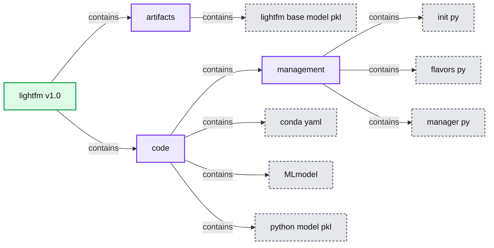
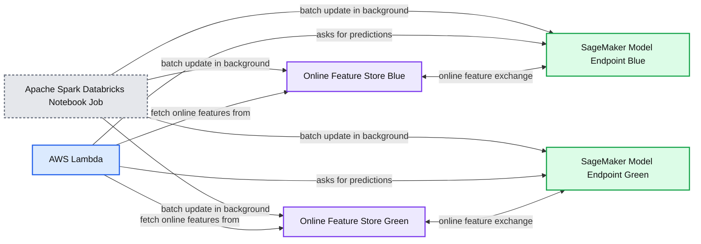

# Infrastructure Design for Real-time Machine Learning Inference

- Source: https://www.databricks.com/blog/2021/09/01/infrastructure-design-for-real-time-machine-learning-inference.html
- Published: 2021-09-01
- Authors: Yu Chen
- Categories: data-streaming, company, customers
- Images: 7 total, 4 extracted as architecture

This is a guest authored post by Yu Chen, Senior Software Engineer, Headspace.

[Headspace's](https://www.headspace.com/) core products are iOS, Android and web-based apps that focus on improving the health and happiness of its users through mindfulness, meditation, sleep, exercise and focus content. Machine learning (ML) models are core to our user experiences by offering recommendations that engage users with new relevant, personalized content that builds consistent habits in their lifelong journey.

Data fed to ML models is often most valuable when it can be immediately leveraged to make decisions in the moment, but, traditionally, consumer data is ingested, transformed, persisted and sits dormant for lengthy periods of time before machine learning and data analytics teams leverage it.

Finding a way to leverage user data to generate real-time insights and decisions means that consumer-facing products like the Headspace app can dramatically shorten the end-to-end user feedback loop: actions that users perform just moments prior can be incorporated into the product to generate more relevant, personalized and context-specific content recommendation for the user.

This means our ML models could incorporate dynamic features that update throughout the course of a user's day, or even an individual session. Examples of these features include:

- Current session bounce rates for sleep content
- Semantic embeddings for recent user search terms. For instance, if a user recently searched for "preparing for big exam", the ML model can assign more weight to Focus-themed meditations that fit this goal.
- Users' biometric data (e.g., if step counts and heart rate are increasing over the last 10 minutes, we can recommend Move or Exercise content)

With the user experience in mind, the Headspace Machine Learning team architected a solution by decomposing the infrastructure systems into modular Publishing, Receiver, [Orchestration](https://www.databricks.com/glossary/orchestration) and Serving layers. The approach leverages **Apache Spark™, Structured Streaming on Databricks, AWS SQS, Lambda and Sagemaker** to deliver real-time inference capabilities for our ML models.

In this blog post, we provide a technical deep dive into our architecture.  After describing our requirements for real-time inference, we discuss challenges adapting traditional, offline ML workflows to meet our requirements.  We then give an architecture overview before discussing details of key architectural components.

## Real-time inference requirements

In order to facilitate real-time inference that personalizes users' content recommendations, we need to

- **Ingest, process, and forward **along the relevant events (actions) that our users perform on our client apps (iOS, Android, web)
- **Quickly compute, store and fetch online features** (millisecond latency) that enrich the feature set used by a real-time inference model
- **Serve and reload the real-time inference model** in a way that synchronizes the served model with online feature stores while minimizing (and ideally avoiding) any downtime.

Our ballpark end-to-end latency target (from user event forwarded to Kinesis stream to real-time inference prediction available) was **30 seconds**.

## Challenges adapting the traditional ML model workflow

The above requirements are problems that are often not solved (and don't need to be solved) with offline models that serve daily batch predictions. ML models that make inferences from records pulled and transformed from an ELT / ETL data pipeline usually have** lead times of multiple hours for raw event data**. Traditionally, an ML model's training and serving workflow would involve the following steps, executed via periodic jobs that run every few hours or daily:

- **Pull relevant raw data from upstream data stores: **For Headspace, this involves using Spark SQL to query from the upstream data lake maintained by our Data Engineering team.
  - For real-time inference: We experience up to thousands of prediction requests per second, so using SQL to query from a backend database introduces unacceptable latency. While model training requires pulling complete data sets, real-time inference often involves small, individual user subset slices of this same data. Therefore, we use AWS Sagemaker Online Feature Groups, which is capable of fetching and writing individual user features with single-digit millisecond response times (**Step 3 in diagram**).
- **Perform data preprocessing **(feature engineering, feature extraction, etc.) using a mix of SQL and Python.
  - For real-time inference: We enrich Spark Structured Streaming micro-batches of raw event data with real-time features from Sagemaker Feature Store Groups.
- **Train the model and log relevant experiment metrics: **With MLflow, we register models and then log their performance across different experiment runs from within the Databricks Notebook interface.
- **Persist the model to disk: **When MLflow logs a model, it serializes the model using the ML library's native format. For instance, *scikit-learn models* are serialized using the [pickle library](https://docs.python.org/3/library/pickle.html).
- **Make predictions on the relevant inference dataset:** In this case, we use our newly-trained recommendation model to generate fresh content recommendations for our user base.
- **Persist the predictions to be served to users.** This depends on the access patterns in production to deliver a ML prediction to an end user.
  - For real-time inference: We can register predictions to our Prediction Service so that end users who navigate to ML-powered tabs can pull down predictions. Alternatively, we can forward the predictions to another SQS queue, which will send content recommendations via push iOS/Android notifications.
- **Orchestration: **Traditional batch-inference models utilize tools like Airflow to schedule and coordinate the different stages/steps.
  - For real-time inference: We use lightweight Lambda functions to unpack/pack data in the appropriate messaging formats, invoke the actual Sagemaker endpoints and perform any required post-processing and persistence.

**Summary:** High-level architecture for Headspace’s real-time ML inference pipeline, from user events through feature processing, prediction, and notification delivery.

**Components:**

- User client
- Amazon Kinesis Data Stream
- Stream Receiver using Spark Structured Streaming and a Databricks notebook job
- Prediction queue
- AWS Lambda
- SageMaker Model Endpoint
- Prediction Service
- Push notification job queue
- SageMaker Online Feature Store
- SageMaker Offline Feature Store
- Databricks notebook job using Apache Spark
- DBFS SQL-queryable Delta Tables

**Flows:**

- User client -> Amazon Kinesis Data Stream: forwards user events
- Amazon Kinesis Data Stream -> Stream Receiver: processes events in micro batches
- Stream Receiver -> Prediction queue: sends prediction message
- Stream Receiver -> SageMaker Online Feature Store: puts online features
- Prediction queue -> AWS Lambda: invokes Lambda
- AWS Lambda -> SageMaker Model Endpoint: asks for prediction
- SageMaker Model Endpoint -> AWS Lambda: returns prediction
- AWS Lambda -> Prediction Service: publishes prediction
- User client -> Prediction Service: asks for content recommendations
- Prediction Service -> Push notification job queue: pushes notification job
- SageMaker Online Feature Store -> AWS Lambda: fetches online and offline features
- Stream Receiver -> SageMaker Offline Feature Store: eventually replicates features
- SageMaker Offline Feature Store -> Databricks notebook job: provides offline features
- Databricks notebook job -> DBFS SQL-queryable Delta Tables: mounts transformed data
- DBFS SQL-queryable Delta Tables -> Databricks notebook job: supplies raw features for offline training

**Numbers:** 1, 2, 3, 4, 5, 6, 7

```mermaid
%% Real-time machine learning inference architecture and data flow
flowchart LR
    UC[User client]
    KS[Amazon Kinesis Data Stream]
    SR[Stream Receiver Spark Structured Streaming]
    PQ[Prediction queue]
    L[AWS Lambda]
    ME[SageMaker Model Endpoint]
    PS[Prediction Service]
    NQ[Push notification job queue]
    OFS[SageMaker Online Feature Store]
    OFF[SageMaker Offline Feature Store]
    DB[Databricks notebook Apache Spark]
    DT[DBFS SQL-queryable Delta Tables]

    UC -->|forwards user events| KS
    KS -->|micro batch processing| SR
    SR -->|sends prediction message| PQ
    SR -->|puts online features| OFS
    PQ -->|invokes| L
    L -->|asks for prediction| ME
    ME -->|returns prediction| L
    L -->|publishes prediction| PS
    UC -->|asks for recommendations| PS
    PS -->|pushes notification job| NQ
    L -->|fetches online and offline features| OFS
    SR -->|eventually replicates offline features| OFF
    OFF -->|provides offline features| DB
    DB -->|transforms raw features| DT
    DT -->|SQL-queryable training data| DB

    classDef client fill:#dbeafe,stroke:#2563eb,stroke-width:2px,color:#111
    classDef service fill:#dcfce7,stroke:#16a34a,stroke-width:2px,color:#111
    classDef store fill:#ede9fe,stroke:#7c3aed,stroke-width:2px,color:#111
    classDef cache fill:#fef3c7,stroke:#d97706,stroke-width:2px,color:#111
    classDef queue fill:#cffafe,stroke:#0891b2,stroke-width:2px,color:#111
    classDef critical fill:#fee2e2,stroke:#dc2626,stroke-width:4px,color:#111
    classDef external fill:#e5e7eb,stroke:#6b7280,stroke-width:2px,color:#111,stroke-dasharray:4 3
    classDef decision fill:#fce7f5,stroke:#db2777,stroke-width:2px,color:#111

    UC:::client
    KS:::queue
    SR:::service
    PQ:::queue
    L:::service
    ME:::external
    PS:::service
    NQ:::queue
    OFS:::store
    OFF:::store
    DB:::service
    DT:::store
```

source image: https://www.databricks.com/wp-content/uploads/2021/08/design-4-rt-inf-blog-img-1.jpg

Users generate events by performing actions inside of their Headspace app — these are ultimately forwarded to our Kinesis Streams to be processed by Spark Structured Streaming. User apps fetch the near real-time predictions by making RESTful HTTP requests to our backend services, passing along their user IDs and feature flags to indicate which type of ML recommendations to send back. The other components of the architecture will be described in more detail below.

## The publishing and serving layer: model training and deployment lifecycle

ML models are developed in Databricks Notebooks and evaluated via MLflow experiments on core offline metrics such as **recall at k **for recommendation systems. The Headspace ML team has written wrapper classes that extend the base Python Function Model Flavor class in MLflow:

[View on github](https://gist.github.com/ychennay/5f2dd8dfa166086ba46d432afd8074ad)

The Headspace ML team's model wrapper class invokes MLflow's own save_model method to perform much of the implementation logic, creating a directory in our ML Models S3 bucket that contains the metadata, dependencies and model artifacts needed to build an MLflow model Docker image:

**Summary:** The diagram shows the directory structure of an MLflow model package named lightfm v1.0.

**Components:**

- lightfm v1.0: MLflow model package
- artifacts: model artifact directory
- lightfm base model pkl: serialized model artifact
- code: source code directory
- management: Python package
- init py: package initializer
- flavors py: MLflow flavor definition
- manager py: model management code
- conda yaml: Conda environment specification
- MLmodel: MLflow model metadata
- python model pkl: serialized Python model

**Flows:**

- lightfm v1.0 -> artifacts: contains
- artifacts -> lightfm base model pkl: contains
- lightfm v1.0 -> code: contains
- code -> management: contains
- management -> init py: contains
- management -> flavors py: contains
- management -> manager py: contains
- code -> conda yaml: contains
- code -> MLmodel: contains
- code -> python model pkl: contains

**Numbers:** 1.0

source image: https://www.databricks.com/wp-content/uploads/2021/08/Infrastructure-Design-for-RT-ML-Inference-blog-img-2.jpg

We can then create a formal Github Release that points to the model we just saved in S3. This can be picked up by CI/CD tools such as CircleCI that test and build MLflow model images that are ultimately pushed to AWS ECR, where they are deployed onto Sagemaker model endpoints.

#### Updating and reloading real-time models

We retrain our models frequently, but updating a real-time inference model in production is tricky. AWS has a variety of deployment patterns (gradual rollout, canary, etc.) that we can leverage to update the actual served Sagemaker model. However, real-time models also require in-sync online feature stores, which — given the size of Headspace's user base, can take up to 30 minutes to fully update. Given that we do not want downtime each time we update our model images, we need to be careful to ensure we synchronize our feature store with our model image.

Take, for example, a model that maps a Headspace user ID to a user sequence ID as part of a collaborative filtering model — our feature stores must contain the most updated mapping of user ID to sequence ID. Unless user populations remain completely static, if we only update the model, our user IDs will be mapped to stale sequence ID at inference time, resulting in the model generating a prediction for a random user instead of the target user.

#### Blue-green architecture

To address this issue, we can adopt a blue-green architecture that follows from the DevOps practice of blue-green deployments. The workflow is illustrated below:

**Summary:** The diagram shows a blue-green architecture for updating real-time ML models and online feature stores while production traffic uses the active environment.

**Components:**

- Apache Spark and Databricks Notebook Job for background batch updates
- Online Feature Store Blue
- SageMaker Model Endpoint Blue
- Online Feature Store Green
- SageMaker Model Endpoint Green
- AWS Lambda for prediction requests and feature retrieval
- Production Environment

**Flows:**

- Databricks Notebook Job -> Online Feature Store Blue: batch update in background
- Databricks Notebook Job -> SageMaker Model Endpoint Blue: batch update in background
- AWS Lambda -> SageMaker Model Endpoint Green: asks for predictions
- AWS Lambda -> Online Feature Store Green: fetch online features from
- Online Feature Store Green -> SageMaker Model Endpoint Green: online feature exchange
- AWS Lambda -> SageMaker Model Endpoint Blue: asks for predictions
- AWS Lambda -> Online Feature Store Blue: fetch online features from
- Online Feature Store Blue -> SageMaker Model Endpoint Blue: online feature exchange
- Databricks Notebook Job -> Online Feature Store Green: batch update in background
- Databricks Notebook Job -> SageMaker Model Endpoint Green: batch update in background

**Numbers:** Day 1; Day 2

source image: https://www.databricks.com/wp-content/uploads/2021/08/design-4-rt-inf-blog-img-3.jpg

- Maintain two parallel pieces of infrastructure (two copies of feature stores, in this case).
- Designate one as the production environment (let's call it the "green" environment, to start) and route requests for features and predictions towards it via our Lambda.
- Every time we wish to update our model, we use a batch process/script to update the complementary infrastructure (the "blue" environment) with the latest features. Once this update is complete, switch the Lambda to point towards the blue production environment for features/predictions.
- Repeat this each time we want to update the model (and its corresponding feature store).

## The receiver layer: event stream ingestion with Apache Spark Structured Streaming scheduled job

Headspace user event actions (logging into the app, playing a specific piece of content, renewing a subscription, searching for content, etc.) are aggregated and forwarded onto Kinesis Data Streams (**Step 1 in diagram**). We leverage the Spark Structured Streaming framework on top of Databricks to consume from these Kinesis Streams. There are several benefits to Structured Streaming, including that it:

- Leverages the same** unified language (Python/Scala) and framework (Apache Spark**) shared by data scientists, data engineers and analysts, allowing multiple Headspace teams to reason about user data using familiar Dataset / DataFrame APIs and abstractions.
- Allows our teams to **implement custom micro-batching logic** to meet business requirements. For example, we could trigger and define micro-batches based on custom event-time windows and session watermarks logic on a per-user basis.
- **Comes with existing Databricks infrastructure tools** that significantly reduce the infrastructure administration burden on ML engineers. These tools include Scheduled Jobs, automatic retries, efficient DBU credit pricing, email notifications for process failure events, built-in Spark Streaming dashboards and the ability to quickly auto-scale to meet spikes in user app event activity.

Structured Streaming uses** micro-batching** to break up the continuous stream of events into discrete chunks, processing incoming events in small micro-batch dataframes.

Streaming data pipelines must differentiate between event-time (when the event actually occurs on the client device) and processing-time (when the data is seen by servers).  Network partitions, client-side buffering and a whole host of other issues can introduce non-trivial discrepancies between these two timestamps. The Structured Streaming API allows simple customization of logic to handle these discrepancies:

[View on github](https://gist.github.com/ychennay/afc79f0a03a25cee562b1fa114303cf0)

We configure the Structured Streaming Job with the following parameters:

- 1 Maximum Concurrent Runs
- Unlimited retries
- New Scheduled Job clusters (as opposed to an All-Purpose cluster)

Using **Scheduled Job clusters** significantly reduces compute DBU costs while also mitigating the likelihood of correlated infrastructure failures. Jobs that run on a faulty cluster---perhaps with missing/incorrect dependencies, instance profiles or overloaded availability zones---will fail until the underlying cluster issue is fixed, but separating jobs across clusters prevents interference.

We then point the stream query to read from a specially configured Amazon Kinesis Stream that aggregates user client-side events (**Step 2 of diagram**). The stream query can be configured using the following logic:

[View on github](https://gist.github.com/ychennay/19d54b79066cf8a8a34de07f803db98d)

Here, **outputMode** defines the policy for how data is written to a streaming sink and can take on three values:** append, complete and update.** Since our Structured Streaming Job is concerned with handling incoming events, we select append to only process "new" rows.

It is a good idea to configure a checkpoint location to gracefully restart a failed streaming query, allowing "replays" which pick back up processing just before the failure.

Depending on the business use case, we can also choose to reduce latency by setting the argument to *processingTime = "0 seconds"*, which starts each micro-batch as soon as possible:

[View on github](https://gist.github.com/ychennay/19d54b79066cf8a8a34de07f803db98d)

In addition, our Spark Structured Streaming job cluster assumes a special** EC2 Instance Profile** with the appropriate IAM policies to interact with AWS Sagemaker Feature Groups and put messages onto our prediction job SQS queue.

Ultimately, since each Structured Streaming job incorporates different business logic, we will need to implement different micro-batch processing functions that will be invoked once per micro-batch.

In our case, we've implemented a **process_batch** method that first computes/updates online features on **AWS Sagemaker Feature Store**, and then forwards user events to the job queue (**Step 3**):

[View on github](https://gist.github.com/ychennay/19d54b79066cf8a8a34de07f803db98d)

## The orchestration layer: decoupled event queues and Lambdas as feature transformers

Headspace users produce events that our real-time inference models consume downstream to make fresh recommendations. However, user event activity volume is not uniformly distributed. There are various peaks and valleys — our users are often most active during specific times of day.

**Summary:** The diagram shows an event-driven real-time inference orchestration layer using SQS queues, AWS Lambda, SageMaker feature storage, and a SageMaker model endpoint.

**Components:**

- Prediction Service
- Push notification job queue using Amazon SQS
- Prediction queue using Amazon SQS
- AWS Lambda feature transformer and orchestrator
- SageMaker Online Feature Store
- SageMaker Model Endpoint
- Unlabeled upstream event source

**Flows:**

- Unlabeled upstream event source -> Prediction Service: incoming event
- Prediction Service -> Push notification job queue: prediction notification job
- Prediction queue -> AWS Lambda: invokes
- AWS Lambda -> SageMaker Online Feature Store: fetch online and offline features
- AWS Lambda -> SageMaker Model Endpoint: ask for prediction
- AWS Lambda -> Push notification job queue: publish prediction
- SageMaker Online Feature Store -> Unlabeled upstream source: incoming or connected data flow

**Numbers:** 4, 5, 6, 7

```mermaid
%% Event-driven real-time inference orchestration with queues and Lambda
flowchart LR
    U[Unlabeled upstream event source] -->|incoming event| PS[Prediction Service]
    PS -->|prediction notification job| PNQ[Push notification job queue]
    PQ[Prediction queue] -->|invokes| L[AWS Lambda]
    L -->|fetch online and offline features| FS[SageMaker Online Feature Store]
    L -->|ask for prediction| ME[SageMaker Model Endpoint]
    L -->|publish prediction| PNQ
    FS -->|connected data flow| U

    classDef client fill:#dbeafe,stroke:#2563eb,stroke-width:2px,color:#111
    classDef service fill:#dcfce7,stroke:#16a34a,stroke-width:2px,color:#111
    classDef store fill:#ede9fe,stroke:#7c3aed,stroke-width:2px,color:#111
    classDef cache fill:#fef3c7,stroke:#d97706,stroke-width:2px,color:#111
    classDef queue fill:#cffafe,stroke:#0891b2,stroke-width:2px,color:#111
    classDef critical fill:#fee2e2,stroke:#dc2626,stroke-width:4px,color:#111
    classDef external fill:#e5e7eb,stroke:#6b7280,stroke-width:2px,color:#111,stroke-dasharray:4 3
    classDef decision fill:#fce7f3,stroke:#db2777,stroke-width:2px,color:#111

    class U client
    class PS,L service
    class FS,ME store
    class PNQ,PQ queue
```

source image: https://www.databricks.com/wp-content/uploads/2021/08/Infrastructure-Design-for-RT-ML-Inference-blog-img-4.jpg

Messages that are placed into the SQS prediction job queue are processed by AWS Lambda functions (**Step 4 in diagram**), which performs the following steps:

- Unpack the message and fetch the corresponding online and offline features for the user whom we want to make a recommendation for (**Step 5 in diagram**). For instance, we may augment the event's temporal/session-based features with attributes such as the user tenure level, gender and locale.
- Perform any final pre-processing business logic. One example is the mapping of Headspace user IDs to user sequence IDs usable by collaborative filtering models.
- Select the appropriate served Sagemaker model and invoke it with the input features (**Step 6 in diagram**).
- Forward along the recommendation to its downstream destination (**Step 7 in diagram**). The actual location depends on whether we want users to pull down content recommendations or push recommendations out to users:

**Pull**: This method involves persisting the final recommended content to our internal Prediction Service, which is responsible for ultimately supplying users with their updated personalized content for many of the Headspace app's tabs upon client app request. Below is an example experiment using real-time inference infrastructure that allows users to fetch personalized recommendations from the app's Today tab:

**Push: **This method involves placing the recommendation onto another SQS queue for push notifications or in-app modal content recommendations. See the images below for examples of (above) in-app modal push recommendations triggered from a user recent search for sleep content and (below) iOS push notification from a recent user content completion:

Within minutes of completing a specific meditation or performing a search, these push notifications can serve a relevant next piece of content while the context is still top of mind for the user.

In addition, utilizing this event queue allows prediction job requests to be retried — a small visibility timeout window (10-15 seconds) for the SQS queue can be set so that if a prediction job is not completed within that time window, another Lambda function is invoked to retry.

## Summary

From an infrastructure and architecture perspective, a key learning is prioritizing designing flexible hand-off points between different services — in our case, the Publishing, Receiver, Orchestrator, and Serving layers. For instance,

- What format should the message payload that our Structured Stream jobs send to the prediction SQS queue use?
- What is in the model signature and HTTP POST payload that each Sagemaker model expects?
- How do we synchronize the model image and the online feature stores so that we can safely and reliably update retrained models once in production?

Proactively addressing these questions will help decouple the various components of a complex ML architecture into smaller, modular sets of infrastructure.

The Headspace ML team is still rolling out production use cases for this infrastructure, but initial A/B tests and experiments have seen strong lifts in content start rates, content completion rates and direct/total push open rates relative to both other Headspace initiatives and industry benchmarks.

By leveraging models capable of real-time inference, Headspace significantly reduces the end-to-end lead time between user actions and personalized content recommendations. Events stream — recent searches, content starts/exits/pauses, in-app navigation actions, even biometric data — within the current session can all be leveraged to constantly update the recommendations we serve to users while they are still interacting with the Headspace application.

To learn more about Databricks Machine Learning, listen to the Data+AI Summit 2021 keynotes for excellent overviews, and find more resources on the [Databricks ML homepage](https://www.databricks.com/product/machine-learning).

Learn more about Headspace at [www.headspace.com](https://www.headspace.com).
