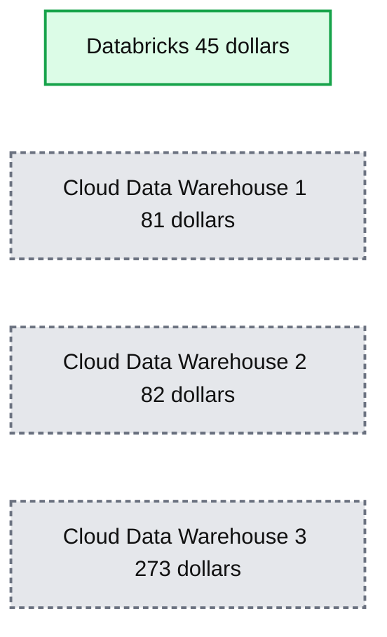
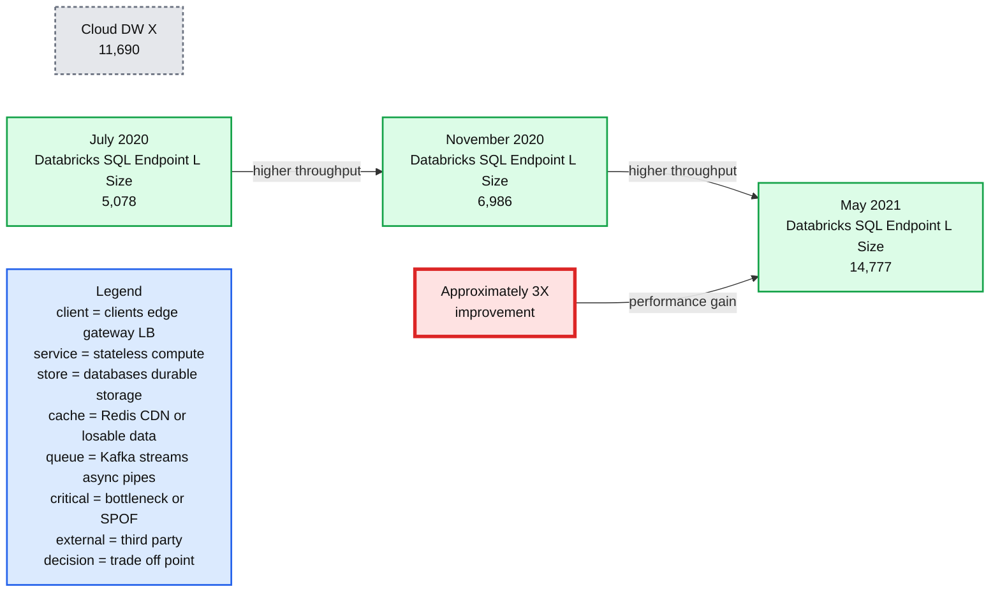
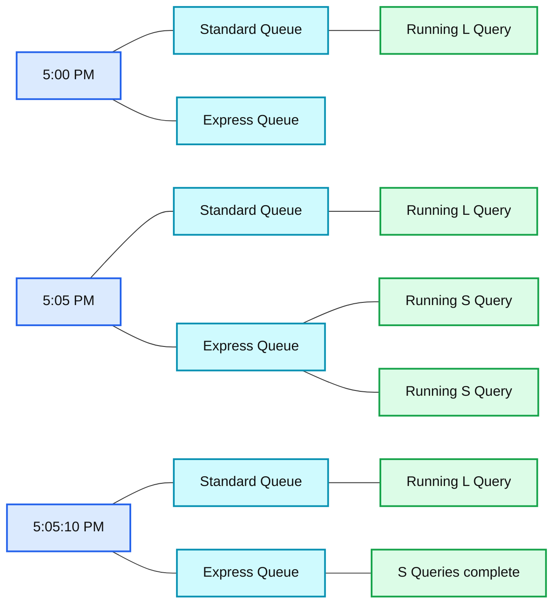
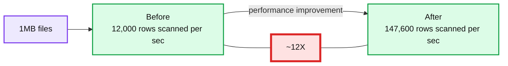
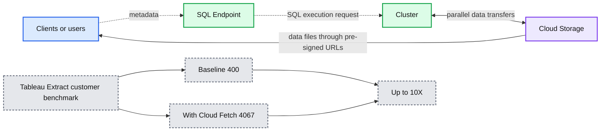

# New Performance Improvements in Databricks SQL

- Source: https://www.databricks.com/blog/2021/09/08/new-performance-improvements-in-databricks-sql.html
- Published: 2021-09-08
- Authors: Reynold Xin, Can Efeoglu, Cyrielle Simeone
- Categories: platform, product, data-warehousing
- Images: 6 total, 6 extracted as architecture

[Databricks SQL](https://www.databricks.com/product/databricks-sql) is now generally available on AWS and Azure.

 Originally [announced](https://www.databricks.com/blog/2020/11/12/announcing-the-launch-of-databricks-sql.html) at Data + AI Summit 2020 Europe, [Databricks SQL](https://www.databricks.com/product/databricks-sql) lets you operate a multi-cloud [lakehouse](https://www.databricks.com/blog/2021/05/19/evolution-to-the-data-lakehouse.html) architecture that provides data warehousing performance at data lake economics. Our vision is to give data analysts a simple yet delightful tool for obtaining and sharing insights from their lakehouse using a purpose-built SQL UI and world-class support for popular BI tools.

This blog is the first of a series on Databricks SQL that aims at covering the innovations we constantly bring to achieve this vision: performance, ease of use and governance. This blog will cover recent performance optimizations as part of Databricks SQL for:

- Highly concurrent analytics workloads
- Intelligent workload management
- Highly parallel reads
- Improving business intelligence (BI) results retrieval with Cloud Fetch

[Explore why lakehouses are the data architecture of the future](https://www.databricks.com/resources/ebook/rise-data-lakehouse?itm_data=performancedatabrickssql-blog-riselakehousebook) with the father of the data warehouse, Bill Inmon.

## Real-life performance beyond large queries

The initial release of Databricks SQL started off with significant performance benefits -- up to 6x price/performance -- compared to traditional cloud data warehouses as per the TPC-DS 30 TB scale benchmark below. Considering that the TPC-DS is an industry standard benchmark defined by data warehousing vendors, we are really proud of these results.

**Summary:** The chart compares 30TB TPC-DS price performance across Databricks and three cloud data warehouses, where lower total cost is better.

**Components:**

- Databricks, technology not specified, total cost $45
- Cloud Data Warehouse 1, technology not specified, total cost $81
- Cloud Data Warehouse 2, technology not specified, total cost $82
- Cloud Data Warehouse 3, technology not specified, total cost $273

**Flows:**

- none

**Numbers:** 30TB, $0, $100, $200, $300, $45, $81, $82, $273

source image: https://www.databricks.com/wp-content/uploads/2021/08/sql-perf-blog-img-1.png

 30TB TPC-DS Price/Performance (Lower is better)

While this benchmark simulates large queries such as ETL workloads or deep analytical workloads well, it does not cover everything our customers run. That's why we've worked closely with hundreds of customers in recent months to provide fast and predictable performance for real-life data analysis workloads and SQL data queries.

As we officially ungate the preview today, we are very excited to share some of the results and performance gains we've achieved to date.

## Scenario 1: Highly concurrent analytics workloads

In working with customers, we noticed that it is common for highly concurrent analytics workloads to execute over small datasets. Intuitively, this makes sense - analysts usually apply filters and tend to work with recent data more than historical data. We decided to make this common use-case faster. To optimize concurrency, we used the same TPC-DS benchmark with a much smaller scale factor (10GB) and 32 concurrent streams. So, we have 32 bots submitting queries continuously to the system, which actually simulates a much larger number of real users because bots don’t rest between running queries.

We analyzed the results to identify and remove bottlenecks, and repeated this process multiple times. Hundreds of optimizations later, we improved concurrency by 3X! Databricks SQL now outperforms some of the best cloud data warehouses for both large queries and small queries with lots of users.

*10 GB TPC-DS Queries/Hr at 32 Concurrent Streams (Higher is better)*

**Summary:** Benchmark chart comparing query throughput across Cloud DW X and Databricks SQL Endpoint L Size over time, showing approximately 3X concurrency improvement.

**Components:**

- Cloud DW X benchmark: 11,690 queries per hour
- Databricks SQL Endpoint L Size in July 2020: 5,078 queries per hour
- Databricks SQL Endpoint L Size in November 2020: 6,986 queries per hour
- Databricks SQL Endpoint L Size in May 2021: 14,777 queries per hour
- Approximately 3X performance improvement annotation

**Flows:**

- July 2020 -> November 2020: increased benchmark throughput
- November 2020 -> May 2021: increased benchmark throughput
- Performance improvement -> May 2021: approximately 3X concurrency improvement

**Numbers:** 11,690; 5,078; 6,986; 14,777; ~3X; 10 GB; 32 concurrent streams; July 2020; November 2020; May 2021

source image: https://www.databricks.com/wp-content/uploads/2021/08/Databricks-SQL-Perf-Gain-Blog-img-2.png

10 GB TPC-DS Queries/Hr at 32 Concurrent Streams (Higher is better)

## Scenario 2: Intelligent workload management

Real-world workloads, however, are not just about either large or small queries. They typically include a mix of small and large queries. Therefore the queuing and load balancing capabilities of Databricks SQL need to account for that too. That's why Databricks SQL uses a dual queuing system that prioritizes small queries over large, as analysts typically care more about the latency of short queries versus large.

**Summary:** Databricks SQL uses standard and express queues so small queries can start and complete while a large query remains in progress.

**Components:**

- Standard Queue - Databricks SQL queue
- Express Queue - Databricks SQL queue
- L Query - large query
- S Query - small query
- Running - query execution state
- S Queries complete - completion state

**Flows:**

- none

**Numbers:** 5:00 PM; 5:05 PM; 5:05:10 PM

source image: https://www.databricks.com/wp-content/uploads/2021/08/Databricks-SQL-Perf-Gain-Blog-img-3.png

 Queuing and load balancing mixed queries with dual queues

## Scenario 3: Highly parallel reads

It is common for some tables in a lakehouse to be composed of many files e.g. in streaming scenarios such as IoT ingest when data arrives continuously. In legacy systems, the execution engine can spend far more time listing these files than actually executing the query! Our customers also told us they do not want to sacrifice performance for data freshness.

We are proud to announce the inclusion of async and highly parallel IO in Databricks SQL. When you execute a query, Databricks automatically reads the next blocks of data from cloud storage while the current block is being processed. This considerably increases overall query performance on small files (by 12x for 1MB files) and "cold data" (data that is not cached) use cases as well.

**Summary:** Benchmark showing highly parallel reads increasing scan throughput for 1MB files from 12,000 before to 147,600 after, an approximately 12x improvement.

**Components:**

- Before: baseline scan performance
- After: improved scan performance
- 1MB files: benchmark file size
- ~12X: performance improvement indicator

**Flows:**

- Before -> After: approximately 12x higher rows scanned per second

**Numbers:** 12,000; 147,600; ~12X; 1MB

source image: https://www.databricks.com/wp-content/uploads/2021/08/sql-perf-blog-img-2.png

Highly parallel reads scenario benchmark on small files(# rows scanned/sec) (Higher is better)

## Scenario 4: Improving BI results retrieval with Cloud Fetch

Once query results are computed, the last mile is to speed up how the system delivers results to the client - typically a BI tool like PowerBI or Tableau. Legacy cloud data warehouses often collect the results on a leader (aka driver) node, and stream it back to the client. This greatly slows down the experience in your BI tool if you are fetching anything more than a few megabytes of results.

That's why we've reimagined this approach with a new architecture called [Cloud Fetch](https://www.databricks.com/blog/2021/08/11/how-we-achieved-high-bandwidth-connectivity-with-bi-tools.html). For large results, Databricks SQL writes results in parallel across all of the compute nodes to cloud storage, and then sends the list of files using pre-signed URLs back to the client. The client then can download in parallel all the data from cloud storage. We are delighted to report up to 10x performance improvement in real-world customer scenarios! We are working with the most popular BI tools to enable this capability automatically.

*“Cloud Fetch enables faster, higher bandwidth connectivity*

**Summary:** Cloud Fetch parallelizes data transfers between the cluster and cloud storage, enabling clients to retrieve large SQL results faster.

**Components:**

- Clients or users
- SQL Endpoint
- Cluster
- Cloud Storage
- Tableau Extract customer benchmark
- Baseline performance
- Cloud Fetch performance

**Flows:**

- Clients or users -> SQL Endpoint: metadata
- SQL Endpoint -> Cluster: SQL execution request
- Cluster -> Cloud Storage: parallel data transfers
- Cloud Storage -> Cluster: parallel data transfers
- Cloud Storage -> Clients or users: data files through pre-signed URLs

**Numbers:** 10X, 400, 4,067

source image: https://www.databricks.com/wp-content/uploads/2021/08/Databricks-SQL-Perf-Gain-Blog-img-4.jpg

“Cloud Fetch enables faster, higher bandwidth connectivity

## Unpacking Databricks SQL

These are just a few examples of performance optimizations and innovations brought to Databricks SQL to provide you with best-in-class SQL performance on your data lake, while retaining the benefits of an open approach. So how does this work?

*Databricks SQL Under the Hood*

**Summary:** Databricks SQL connects analyst and administrator experiences with SQL Endpoints, Photon, Unity Catalog, and curated data stored on an open data lake.

**Components:**

- BI and analytics tools: dbt, ThoughtSpot, Qlik, Tableau, Power BI, Looker, Mode, and Databricks
- Analyst Experience: analyst-facing SQL access
- Admin Experience: administrative SQL management
- SQL Endpoints: SQL query endpoints
- Photon Native Vectorized Engine: vectorized query execution
- Unity Catalog: centralized governance
- Curated Data: curated data stores
- Delta Lake: open data storage foundation
- Structured, Semi-Structured, and Unstructured Data: supported data types
- Ease of Use: user-facing benefit
- Real-world Performance: performance benefit
- Centralized Governance: governance benefit
- Open and Reliable Data Lake as our Foundation: foundational principle

**Flows:**

- BI and analytics tools -> Analyst Experience: analyst access
- BI and analytics tools -> Admin Experience: administrative access
- Analyst Experience -> SQL Endpoints: SQL queries
- Admin Experience -> SQL Endpoints: SQL administration
- SQL Endpoints -> Photon Native Vectorized Engine: query execution
- Photon Native Vectorized Engine -> Unity Catalog: governed query access
- Unity Catalog -> Curated Data: governed data access
- Curated Data -> Structured, Semi-Structured, and Unstructured Data: stores supported data
- Databricks SQL platform -> Ease of Use: enables usability
- Databricks SQL platform -> Real-world Performance: enables performance
- Databricks SQL platform -> Centralized Governance: enables governance
- Databricks SQL platform -> Open and Reliable Data Lake as our Foundation: built on the data lake

**Numbers:** none

```mermaid
%% Shows Databricks SQL layers, connected tools, governance, and data foundation
flowchart LR
    tools[BI and analytics tools]
    analyst[Analyst Experience]
    admin[Admin Experience]
    endpoints[SQL Endpoints]
    photon[Photon Native Vectorized Engine]
    catalog[Unity Catalog]
    curated[Curated Data]
    delta[Delta Lake]
    data[Structured Semi-Structured and Unstructured Data]
    benefits[Ease of Use and Real-world Performance]
    governance[Centralized Governance]
    foundation[Open and Reliable Data Lake as our Foundation]

    tools -->|access| analyst
    tools -->|access| admin
    analyst -->|queries| endpoints
    admin -->|administration| endpoints
    endpoints -->|execution| photon
    photon -->|governed access| catalog
    catalog -->|data access| curated
    curated -->|stores| data
    delta -->|foundation| curated
    endpoints -->|enables| benefits
    catalog -->|provides| governance
    delta -->|provides| foundation

    classDef client   fill:#dbeafe,stroke:#2563eb,stroke-width:2px,color:#111
    classDef service  fill:#dcfce7,stroke:#16a34a,stroke-width:2px,color:#111
    classDef store    fill:#ede9fe,stroke:#7c3aed,stroke-width:2px,color:#111
    classDef cache    fill:#fef3c7,stroke:#d97706,stroke-width:2px,color:#111
    classDef queue    fill:#cffafe,stroke:#0891b2,stroke-width:2px,color:#111
    classDef critical fill:#fee2e2,stroke:#dc2626,stroke-width:4px,color:#111
    classDef external fill:#e5e7eb,stroke:#6b7280,stroke-width:2px,color:#111,stroke-dasharray:4 3
    classDef decision fill:#fce7f3,stroke:#db2777,stroke-width:2px,color:#111

    class tools client
    class analyst,admin,endpoints,photon,benefits,governance service
    class catalog,curated,delta,data,foundation store
```

source image: https://www.databricks.com/wp-content/uploads/2021/08/Databricks-SQL-Perf-Gain-Blog-img-5.jpg

Databricks SQL Under the Hood

Open source [Delta Lake](https://delta.io/) is the foundation for Databricks SQL. It is the open data storage format that brings the best of data warehouse systems to data lakes, with ACID transactions, data lineage, versioning, [data sharing](https://www.databricks.com/blog/2021/05/26/introducing-delta-sharing-an-open-protocol-for-secure-data-sharing.html) and so on, to structured, unstructured and semi-structured data alike.

At the core of Databricks SQL is [Photon](https://www.databricks.com/product/photon), a new native vectorized engine on Databricks written to run SQL workloads faster. Read our [blog](https://www.databricks.com/blog/2021/06/17/announcing-photon-public-preview-the-next-generation-query-engine-on-the-databricks-lakehouse-platform.html) and watch [Radical Speed for SQL Queries on Databricks: Photon Under the Hood](https://www.databricks.com/session_na21/radical-speed-for-sql-queries-on-databricks-photon-under-the-hood) to learn more.

And last but not least, we have worked very closely with a large number of software vendors to make sure that data teams -- analysts, data scientists and SQL developers-- can easily use their tools of choice on Databricks SQL. We made it easy to connect, get data in and authenticate using single-sign-on while boosting speed thanks to the concurrency and short query performance improvements we covered before.

## Next steps

This is just the start, as we plan to continuously listen and add more innovations to the service. Databricks SQL is already bringing a tremendous amount of value to many organizations like [Atlassian](https://youtu.be/Xo1U617T-mU) or [Comcast](https://www.databricks.com/session_na21/sql-analytics-powering-telemetry-analysis-at-comcast), and we can't wait to hear your feedback as well!

If you’re an existing Databricks user, you can start using Databricks SQL today using our Get Started guide for [Azure Databricks](https://docs.microsoft.com/en-us/azure/databricks/scenarios/sql/) or [AWS](https://docs.databricks.com/sql/get-started/index.html). If you’re not yet a Databricks user, visit [databricks.com/try-databricks](https://www.databricks.com/try-databricks) to start a free trial.

Finally, if you’d like to learn more about Databricks Lakehouse platform, watch our webinar – [Data Management, the good, the bad, the ugly](https://www.databricks.com/p/webinar/data-management-the-good-the-bad-the-ugly). In addition, we are offering Databricks SQL online [training](https://www.databricks.com/learn/training/home) for hands-on experience, and personalized workshops. Contact your sales representative to learn more. We’d love to hear how you use Databricks SQL and how we can make BI and data analytics on your data lake even simpler.

**Watch DAIS Keynote and Demo Below**
