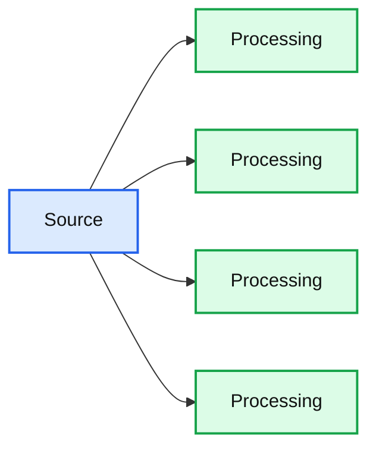

# Real-time Point-of-Sale Analytics With a Data Lakehouse

- Source: https://www.databricks.com/blog/2021/09/09/real-time-point-of-sale-analytics-with-a-data-lakehouse.html
- Published: 2021-09-09
- Authors: Bryan Smith, Rob Saker
- Categories: engineering, data-science-machine-learning, data-engineering, data-streaming
- Images: 3 total, 3 extracted as architecture

Disruptions in the supply chain – from reduced product supply and diminished warehouse capacity – coupled with rapidly shifting consumer expectations for seamless [omnichannel experiences](https://www.mckinsey.com/industries/retail/our-insights/into-the-fast-lane-how-to-master-the-omnichannel-supply-chain) are driving retailers to rethink how they use data to manage their operations. Prior to the pandemic, [71% of retailers](https://risnews.com/1-trillion-problem-managing-out-stocks-and-omnichannel-fulfillment-during-covid-19) named lack of real-time visibility into inventory as a top obstacle to achieving their omnichannel goals. The pandemic only increased [demand for integrated online and in-store experiences](https://nielseniq.com/global/en/insights/analysis/2020/covid-19-has-flipped-the-value-proposition-of-omnichannel-shopping-for-constrained-consumers/), placing even more pressure on retailers to present accurate product availability and manage order changes on the fly. Better access to [real-time information](https://www.databricks.com/product/data-streaming) is the key to meeting [consumer demands in the new normal](https://www.mckinsey.com/error.aspx?e=1).

In this blog, we will address the need for real-time data in retail, and how to overcome the challenges of moving real-time streaming of point-of-sale data at scale with a data lakehouse. To learn more, check out our [Solution Accelerator for Real-Time Point-of-Sale Analytics](https://www.databricks.com/solutions/accelerators/real-time-point-of-sale-analytics).

 Read [Rise of the Data Lakehouse](https://www.databricks.com/resources/ebook/rise-data-lakehouse?itm_data=posanalyticsblog-textpromo-riselakehousebook) to explore why lakehouses are the data architecture of the future with the father of the data warehouse, Bill Inmon.

## The point-of-sale system

The point-of-sale (POS) system has long been the central piece of in-store infrastructure, recording the exchange of goods and services between retailer and customer. To sustain this exchange, the POS typically tracks product inventories and facilitates replenishment as unit counts dip below critical levels. The importance of the POS to in-store operations cannot be overstated, and as the system of record for sales and inventory operations, access to its data is of key interest to business analysts.

Historically, limited connectivity between individual stores and corporate offices meant the POS system (not just its terminal interfaces) physically resided within the store. During off-peak hours, these systems might phone home to transmit summary data, which when consolidated in a data warehouse, provide a day-old view of retail operations performance that grows increasingly stale until the start of the next night’s cycle.

*Figure 1. Inventory availability with traditional, batch-oriented ETL patterns*

**Summary:** A daily timeline showing batch-oriented POS data ingestion, ETL, data warehousing, and business reporting availability.

**Components:**

- POS for Data Ingest - technology not specified
- ETL - technology not specified
- EDW - technology not specified
- Business Reports & Analytics - technology not specified

**Flows:**

- POS for Data Ingest -> ETL: scheduled batch data transfer
- ETL -> EDW: transformed data load
- EDW -> Business Reports & Analytics: reporting data availability

**Numbers:** 12 AM, 2 AM, 4 AM, 6 AM, 8 AM, 10 AM, 12 PM, 2 PM, 4 PM, 6 PM, 8 PM, 10 PM, 12 AM, 2 AM, 4 AM

source image: https://www.databricks.com/wp-content/uploads/2021/09/pos-blog-img-1.png

Figure 1. Inventory availability with traditional, batch-oriented ETL patterns

Modern connectivity improvements have enabled more retailers to move to a centralized, cloud-based POS system, while many others are developing near real-time integrations between in-store systems and the corporate backoffice. Near real-time availability of information means that retailers can continuously update their estimates of item availability. No longer is the business managing operations against their knowledge of inventory states as they were a day prior but instead is taking actions based on their knowledge of inventory states as they are now.

**Summary:** The timeline shows successive stages of point-of-sale data processing from ingestion through business reporting and analytics.

**Components:**

- POS Data Ingest
- ETL for EDW
- Business Reports and Analytics

**Flows:**

- POS Data Ingest -> ETL for EDW: POS data
- ETL for EDW -> Business Reports and Analytics: transformed data

**Numbers:** 12 AM, 2 AM, 4 AM, 6 AM, 8 AM, 10 AM, 12 PM, 2 PM, 4 PM, 6 PM, 8 PM, 10 PM, 12 AM, 2 AM, 4 AM

source image: https://www.databricks.com/wp-content/uploads/2021/09/pos-blog-img-2.png

 Figure 2. Inventory availability with streaming ETL patterns

## Near real-time insights

As impactful as near real-time insights into store activity are, the transition from nightly processes to continuous streaming of information brings particular challenges, not only for the data engineer who must design a different kind of data processing workflow, but also for the information consumer. In this post, we share some lessons learned from customers who’ve recently embarked on this journey and examine how key patterns and capabilities available through the [lakehouse](https://www.databricks.com/blog/2020/01/30/what-is-a-data-lakehouse.html)pattern can enable success.

### Lesson 1: Carefully consider scope

POS systems are not often limited to just sales and inventory management. Instead, they can provide a sprawling range of functionality from payment processing, store credit management, billing and order placement, loyalty program management, employee scheduling, time-tracking and even payroll, making them a veritable Swiss Army knife of in-store functionality.

As a result, the data housed within the POS is typically spread across a large and complex database structure. If lucky, the POS solution makes a data access layer available, which makes this data accessible through more easily interpreted structures. But if not, the data engineer must sort through what can be an opaque set of tables to determine what is valuable and what is not.

Regardless of how the data is exposed, the [classic guidance](https://books.google.com/books?id=ONQio9do_70C&pg=PA22&lpg=PA22&dq=kimball+scope+justification+lifecycle&source=bl&ots=XuPbKLt1H_&sig=ACfU3U3zFCb-d1UzRyoRVtPeL0OXs1XuZw&hl=en&sa=X&ved=2ahUKEwigydC2lJjyAhVUa80KHeiPAzsQ6AF6BAgVEAM#v=onepage&q=kimball%20scope%20justification%20lifecycle&f=false) holds true: identify a compelling business justification for your solution and use that to limit the scope of the information assets you initially consume. Such a justification often comes from a strong business sponsor, who is tasked with addressing a specific business challenge and sees the availability of more timely information as critical to their success.

To illustrate this, consider a key challenge for many retail organizations today: the enablement of omnichannel solutions. Such solutions, which enable buy-online, pickup in-store (BOPIS) and cross-store transactions, depend on reasonably accurate information about store inventory. If we were to limit our initial scope to this one need, the information requirements for our monitoring and analytics system become dramatically reduced. Once a real-time inventory solution is delivered and value recognized by the business, we can expand our scope to consider other needs, such as promotions monitoring and fraud detection, expanding the breadth of information assets leveraged with each iteration.

### Lesson 2: Align transmission with patterns of data generation & time-sensitivities

Different processes generate data differently within the POS. Sales transactions are likely to leave a trail of new records appended to relevant tables. Returns may follow multiple paths triggering updates to past sales records, the insertion of new, reversing sales records and/or the insertion of new information in returns-specific structures. Vendor documentation, tribal knowledge and even some independent investigative work may be required to uncover exactly how and where event-specific information lands within the POS.

Understanding these patterns can help build a data transmission strategy for specific kinds of information. Higher frequency, finer-grained, insert-oriented patterns may be ideally suited for continuous streaming. Less frequent, larger-scale events may best align with batch-oriented, bulk data styles of transmission. But if these modes of data transmission represent two ends of a spectrum, you are likely to find most events captured by the POS fall somewhere in between.

The beauty of the data lakehouse approach to data architecture is that multiple modes of data transmission can be employed in parallel. For data naturally aligned with the continuous transmission, streaming may be employed. For data better aligned with bulk transmission, batch processes may be used. And for those data falling in the middle, you can focus on the timeliness of the data required for decision making and allow that to dictate the path forward. All of these modes can be tackled with a consistent approach to ETL implementation, a challenge that thwarted many earlier implementations of what were frequently referred to as lambda architectures.

The beauty of the data lakehouse approach to data architecture is that [multiple modes of data transmission](https://www.databricks.com/p/ebook/the-delta-lake-series-streaming) can be employed in parallel. For data naturally aligned with the continuous transmission, streaming may be employed. For data better aligned with bulk transmission, batch processes may be used. And for those data falling in the middle, you can focus on the timeliness of the data required for decision making and allow that to dictate the path forward.  All of these modes can be tackled with a consistent approach to ETL implementation, a challenge that thwarted many earlier implementations of what were frequently referred to as [lambda architectures](https://www.oreilly.com/radar/questioning-the-lambda-architecture/).

### Lesson 3: Land the data in stages

Data arrives from the in-store POS systems with different frequencies, formats, and expectations for timely availability. Leveraging the [Bronze, Silver & Gold design pattern](https://www.databricks.com/blog/2019/08/14/productionizing-machine-learning-with-delta-lake.html) popular within lakehouses, you can separate initial cleansing, reformatting, and persistence of the data from the more complex transformations required for specific business-aligned deliverables.

*Figure 3. A data lakehouse architecture for the calculation of current inventory leveraging the Bronze, Silver & Gold pattern of data persistence*

**Summary:** none visible

**Components:**

- Unlabeled source component
- Three unlabeled processing components
- One unlabeled processing component

**Flows:**

- none visible

**Numbers:** none

source image: https://www.databricks.com/wp-content/uploads/2021/09/pos-blog-img-3.png

Figure 3. A data lakehouse architecture for the calculation of current inventory leveraging the Bronze, Silver & Gold pattern of data persistence

### Lesson 4: Manage expectations

The move to near real-time analytics requires an organizational shift. Gartner describes through their[Streaming Analytics Maturity model](https://blogs.gartner.com/nick-heudecker/five-levels-of-streaming-analytics-maturity/) within which analysis of streaming data becomes integrated into the fabric of day-to-day operations. This does not happen overnight.

Instead, Data Engineers need time to recognize the challenges inherent to streaming delivery from physical store locations into a centralized, cloud-based back office. Improvements in connectivity and system reliability coupled with increasingly more robust ETL workflows land data with greater timeliness, reliability and consistency. This often entails enhancing partnerships with Systems Engineers and Application Developers to support a level of integration not typically present in the days of batch-only ETL workflows.

Business Analysts will need to become familiar with the inherent noisiness of data being updated continuously. They will need to relearn how to perform diagnostic and validation work on a dataset, such as when a query that ran seconds prior now returns a slightly different result. They must gain a deeper awareness of the problems in the data which are often hidden when presented in daily aggregates. All of this will require adjustments both to their analysis and their response to detected signals in their results.

All of this takes place in just the first few stages of maturation. In later stages, the organization’s ability to detect meaningful signals within the stream may lead to more automated sense and response capabilities. Here, the highest levels of value in the data streams are unlocked. But monitoring and governance must be put into place and proven before the business will entrust its operations to these technologies.

## Implementing POS streaming

To illustrate how the lakehouse architecture can be applied to POS data, we’ve developed a demonstration workflow within which we calculate a near real-time inventory. In it, we envision two separate POS systems transmitting inventory-relevant information associated with sales, restocks and shrinkage data along with buy-online, pickup in-store (BOPIS) transactions (initiated in one system and fulfilled in the other) as part of a streaming inventory change feed. Periodic (snapshot) counts of product units on-shelf are captured by the POS and transmitted in bulk. These data are simulated for a one-month period and played back at 10x speed for greater visibility into inventory changes.

The ETL processes (as pictured in Figure 3 above) represent a mixture of streaming and batch techniques. A two-staged approach with minimally transformed data captured in Delta tables representing our Silver layer separates our initial, more technically-aligned ETL approach with the more business-aligned approach required for current inventory calculations. The second stage has been implemented using traditional structured streaming capabilities, something we may revisit with the new [Delta Live Tables](https://docs.databricks.com/data-engineering/delta-live-tables/index.html) functionality as it makes its way towards general availability.

The demonstration makes use of Azure IOT Hubs and Azure Storage for data ingestion but would work similarly on the AWS and GCP clouds with appropriate technology substitutions. Further details about the setup of the environment along with the replayable ETL logic can be found in the following notebooks:

[Get the Solution Accelerator](https://www.databricks.com/solutions/accelerators/real-time-point-of-sale-analytics)
