# Large Scale ETL and Lakehouse Implementation at Asurion

- Source: https://www.databricks.com/blog/2021/09/16/large-scale-etl-and-lakehouse-implementation-at-asurion.html
- Published: 2021-09-16
- Authors: Tomasz Magdanski
- Categories: data-warehousing, company, customers
- Images: 1 total, 1 extracted as architecture

This is a guest post from Tomasz Magdanski, Sr Director of Engineering, Asurion.

With its insurance and installation, repair, replacement and 24/7 support services, Asurion helps people protect, connect and enjoy the latest tech – to make life a little easier. Every day our team of 10,000 experts helps nearly 300 million people around the world solve the most common and uncommon tech issues. We're just a call, tap, click or visit away for everything from getting a same-day replacement of your smartphone to helping you stream or connect with no buffering, bumps or bewilderment.

We think you should stay connected and get the most from the tech you love… no matter the type of tech or where you purchased it.

 Read [Rise of the Data Lakehouse](https://www.databricks.com/resources/ebook/rise-data-lakehouse?itm_data=largescaleetlblog-textpromo-riselakehousebook) to explore why lakehouses are the data architecture of the future with the father of the data warehouse, Bill Inmon.

## Background and challenges

Asurion's Enterprise Data Service team is tasked with gathering over 3,500 data assets from the entire organization, providing one place where all the data can be cleaned, joined, analyzed, enriched and leveraged to create data products.

Previous iterations of data platforms, built mostly on top of traditional databases and data warehouse solutions, encountered challenges with scaling and cost due to the lack of compute and storage separation. With ever-increasing data volumes, a wide variety of data types (from structured database tables and APIs to data streams), demand for lower latency and increased velocity, the platform engineering team began to consider moving the whole ecosystem to Apache Spark™ and Delta Lake using a [lakehouse architecture](https://www.databricks.com/glossary/data-lakehouse) as the new foundation.

The previous platform was based on [Lambda architecture](https://www.databricks.com/glossary/lambda-architecture), which introduced hard-to-solve problems, such as:

- data duplication and synchronization
- logic duplication, often using different technologies for batch and speed layer
- different ways to deal with late data
- data reprocessing difficulty due to the lack of transactional layer, which forced very close [orchestration](https://www.databricks.com/glossary/orchestration) between rewrite updates or deletions
- readers trying to access that data, forcing platform maintenance downtimes.

Using traditional extract, transform, and load (ETL) tools on large data sets was restricted to Day-Minus-1 processing frequency, and the technology stack was vast and complicated.

Asurion's legacy data platform was operating at a massive scale, processing over 8,000 tables, 10,000 views, 2,000 reports and 2,500 dashboards. Ingestion data sources varied from database CDC feeds, APIs and flat files to streams from Kinesis, Kafka, SNS and SQS. The platform included a data warehouse combining hundreds of tables with many complicated dependencies and close to 600 data marts. Our next lakehouse had to solve for all of these use cases to truly unify on a single platform.

## The Databricks Data + AI Platform Solution

A lakehouse architecture simplifies the platform by eliminating batch and speed layers, providing near real-time latency, supporting a variety of data formats and languages, and simplifying the technology stack into one integrated ecosystem.

To ensure platform scalability and future efficiency of our development lifecycle, we focused our initial design phases on ensuring decreased platform fragility and rigidity.

Platform fragility could be observed when a change in one place breaks functionality in another portion of the ecosystem. This is often seen in closely coupled systems. Platform rigidity is the resistance of the platform to accept changes. For example, to add a new column to a report, many jobs and tables have to be changed, making the change lifecycle long, large and more prone to errors. The Databricks Data + AI Platform simplified our approach to architecture and design of the underlying codebase, allowing for a unified approach to data movement from traditional ETL to streaming data pipelines between Delta tables.

**Summary:** The diagram shows data flowing from multiple platform sources through a Landing Zone and structured streaming ingestion into layered Delta Lake tables, an EDW, data marts, and consumer tools.

**Components:**

- Platform sources using CDC, streaming, files, and APIs
- Landing Zone for incoming data
- Ingestion using Spark Structured Streaming and Auto Loader
- L1 SCD 2 layer using Databricks Delta Lake
- L2 SCD 1 layer using Databricks Delta Lake
- EDW using Databricks Delta Lake and Apache Spark
- L3 layer using Databricks Delta Lake
- Data Marts for analytical outputs
- Presto and Databricks SQL Warehouse for querying
- Consumers including BI tools, applications, dashboards, and notebooks

**Flows:**

- Platform sources -> Landing Zone: CDC, streaming, files, and API data
- Landing Zone -> L1 SCD 2: structured streaming and Auto Loader ingestion
- L1 SCD 2 -> L2 SCD 1: structured streaming and Auto Loader processing
- L2 SCD 1 -> EDW: Delta table data
- EDW -> L3: Delta table data
- L3 -> Data Marts: curated data
- L3 -> EDW: cross-layer data flow
- Data Marts -> Presto and Databricks SQL Warehouse: query access
- Presto and Databricks SQL Warehouse -> Consumers: analytical results

**Numbers:** 1, 2, 3, SCD 1, SCD 2

```mermaid
%% Shows the Asurion lakehouse data flow from sources to consumers
flowchart LR
    A[Platform sources CDC streaming files API] -->|data ingestion| B[Landing Zone]
    B -->|structured streaming and Auto Loader| C[L1 SCD 2 Delta Lake]
    C -->|structured streaming and Auto Loader| D[L2 SCD 1 Delta Lake]
    D -->|Delta table data| E[EDW Delta Lake]
    E -->|Delta table data| F[L3 Delta Lake]
    F -->|curated data| G[Data Marts]
    F -->|cross layer flow| E
    G -->|query access| H[Presto and Databricks SQL Warehouse]
    H -->|analytical results| I[Consumers BI apps dashboards notebooks]

    classDef client fill:#dbeafe,stroke:#2563eb,stroke-width:2px,color:#111
    classDef service fill:#dcfce7,stroke:#16a34a,stroke-width:2px,color:#111
    classDef store fill:#ede9fe,stroke:#7c3aed,stroke-width:2px,color:#111
    classDef cache fill:#fef3c7,stroke:#d97706,stroke-width:2px,color:#111
    classDef queue fill:#cffafe,stroke:#0891b2,stroke-width:2px,color:#111
    classDef critical fill:#fee2e2,stroke:#dc2626,stroke-width:4px,color:#111
    classDef external fill:#e5e7eb,stroke:#6b7280,stroke-width:2px,color:#111,stroke-dasharray:4 3
    classDef decision fill:#fce7f3,stroke:#db2777,stroke-width:2px,color:#111

    class A external
    class B queue
    class C,D,E,F,G store
    class H service
    class I client
```

source image: https://www.databricks.com/wp-content/uploads/2021/09/asurion-blog-img-1.png

### ETL job design

In the previous platform version, every one of the thousands of ingested tables had its own ETL mapping, making management of them and the change cycle very rigid. The goal of the new architecture was to create a single job that’s flexible enough to run thousands of times with different configurations. To achieve this goal, we chose Spark Structured Streaming, as it provided 'exactly-once' and 'at-least once' semantics, along with [Auto Loader](https://www.databricks.com/blog/2020/02/24/introducing-databricks-ingest-easy-data-ingestion-into-delta-lake.html), which greatly simplified state management of each job. Having said that, having over 3,500 individuals Spark jobs would inevitably lead to a similar state as 3,500 ETL mappings. To avoid this problem, we built a framework around Spark using Scala and the fundamentals of object-oriented programming. (*Editor’s note: Since this solution was implemented, [Delta Live Tables](https://www.databricks.com/product/delta-live-tables) has been introduced on the Databricks platform to substantially streamline the ETL process.*)

We have created a rich set of readers, transformations and writers, as well as Job classes accepting details through run-time dependency injection. Thanks to this solution, we can configure the ingestion job to read from Kafka, Parquet, JSON, Kinesis and SQS into a data frame, then apply a set of common transformations and finally inject the steps to be applied inside of Spark Structured Streaming’s 'foreachBatch’ API to persist data into Delta tables.

### ETL job scheduling

Databricks recommends running structured streaming jobs using ephemeral clusters, but there is a limit of 1,000 concurrently running jobs per workspace. Additionally, even if that limit wasn’t there, let's consider the smallest cluster to consist of one master and two worker nodes. Three nodes for each job would add up to over 10,000 nodes in total and since these are streaming jobs, these clusters would have to stay up all the time. We needed to devise a solution that would balance cost and management overhead within these constraints.
 To achieve this, we divided the tables based on how frequently they are updated at the source and bundled them into job groups, one assigned to each ephemeral notebook.

The notebook reads the configuration database, collects all the jobs belonging to the assigned group, and executes them in parallel on the ephemeral cluster. To speed the processing up, we use Scala parallel collections, allowing us to run jobs in parallel up to the number of the cores on the driver node. Since different jobs are processing different amounts of data, running 16 or 32 jobs at a time provides equal and full CPU utilization of the cluster. This setup allowed us to run up to 1,000 slow-changing tables on one 25 node cluster, including appending and merging into bronze and silver layers inside of the foreachBatch API.

### Data marts with Databricks SQL

We have an application where business users define SQL-based data transformations that they want to store as data marts. We take the base SQL and handle the execution and maintenance of the tables. This application must be available 24x7 even if we aren’t actively running anything. We love Databricks, but weren’t thrilled about paying interactive cluster rates for idle compute. Enter [Databricks SQL](https://www.databricks.com/product/databricks-sql). With this solution, SQL Endpoints gave us a more attractive price point and exposed an easy JDBC connection for our user-facing SQL application. We now have 600 data marts and are growing more in production in our lakehouse.

## Summary

Our engineering teams at Asurion implemented a lakehouse architecture at large scale, including Spark Structured Streaming, Delta Lake and Auto Loader. In an upcoming blog post, we will discuss how we encountered and resolved issues related to scaling our solution to meet our needs.
