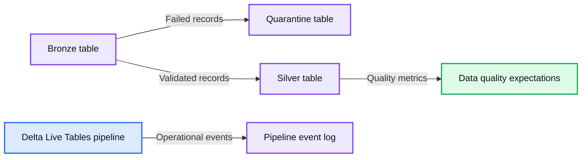
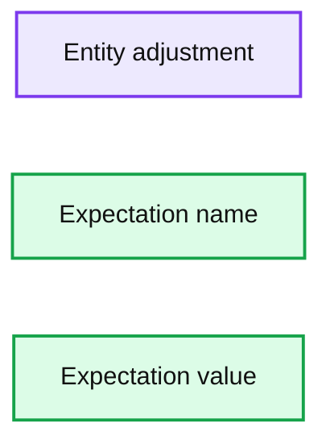

# Timeliness and Reliability in the Transmission of Regulatory Reports

- Source: https://www.databricks.com/blog/2021/09/17/timeliness-and-reliability-in-the-transmission-of-regulatory-reports.html
- Published: 2021-09-17
- Authors: Antoine Amend, Fahmid Kabir
- Categories: security-and-trust, engineering, solution-accelerators
- Images: 4 total, 3 extracted as architecture

Managing risk and regulatory compliance is an increasingly complex and costly endeavour. Regulatory change has [increased 500%](https://www.ascentregtech.com/blog/the-not-so-hidden-costs-of-compliance/) since the 2008 global financial crisis and boosted the regulatory costs in the process. Given the fines associated with non-compliance and SLA breaches (banks hit an all-time high in fines of [$10 billion in 2019 for AML](https://www.ascentregtech.com/blog/the-not-so-hidden-costs-of-compliance/)), processing reports has to proceed even if data is incomplete. On the other hand, a track record of poor data quality is also "fined" because of "insufficient controls." As a consequence, many Financial Services Institutions (FSIs) are often left battling between poor data quality and strict SLAs, balancing between data reliability and data timeliness.

In this regulatory reporting solution accelerator, we demonstrate how [Delta Live Tables](https://www.databricks.com/product/delta-live-tables) can guarantee the acquisition and processing of regulatory data in real time to accommodate regulatory SLAs. With Delta Sharing and Delta Live Tables combined, analysts gain real-time confidence in the quality of regulatory data being transmitted. In this blog post, we demonstrate the benefits of the Lakehouse architecture to combine financial services industry data models with the flexibility of cloud computing to enable high governance standards with low development overhead. We will now explain what a FIRE data model is and how DLT can be integrated to build robust data pipelines.

## FIRE data model

The Financial Regulatory data standard (FIRE) defines a common specification for the transmission of granular data between regulatory systems in finance. Regulatory data refers to data that underlies regulatory submissions, requirements and calculations and is used for policy, monitoring and supervision purposes. The [FIRE data standard](https://suade.org/fire/) is supported by the [European Commission](https://ec.europa.eu/info/index_en), the [Open Data Institute](https://theodi.org/) and the [Open Data Incubator](https://opendataincubator.eu/) FIRE data standard for Europe via the Horizon 2020 funding programme. As part of this solution, we contributed a PySpark module that can interpret FIRE data models into Apache Spark™ operating pipelines.

## Delta Live Tables

Databricks recently announced a new product for data pipelines [orchestration](https://www.databricks.com/glossary/orchestration), Delta Live Tables, which makes it easy to build and manage reliable data pipelines at enterprise scale. With the ability to evaluate multiple expectations, discard or monitor invalid records in real time, the benefits of integrating the FIRE data model on Delta Live Tables are obvious. As illustrated in the following architecture, Delta Live Table will **ingest** granular regulatory data landing onto cloud storage, **schematize** content and **validate** records for consistency in line with the FIRE data specification. Keep reading to see us demo the use of Delta Sharing to exchange granular information between regulatory systems in a safe, scalable, and transparent manner.

**Summary:** The diagram shows regulatory data flowing from source systems through cloud storage and Delta Live Tables for ingestion, schema enforcement, validation, and serving.

**Components:**

- Data sources: agreements, loans, securities, and other regulatory systems
- Cloud Storage: landing area for incoming data
- Delta Live Table: processing platform
- Ingest: Delta Live Tables Auto Loader
- Schematize: FIRE schema application using Delta Live Tables
- Validate: expectation checks using Delta Live Tables
- FIRE data model: regulatory data specification
- FIRE schema: standardized data structure
- FIRE constraints: validation rules
- Operation dashboard: served operational information
- Delta Sharing: secure data exchange
- Regulators: recipients of shared regulatory information
- European Commission, Bank of Italy, and ODINE: organizations associated with the FIRE specification

**Flows:**

- Data sources -> Cloud Storage: granular regulatory data
- Cloud Storage -> Ingest: landed regulatory files
- Ingest -> Schematize: ingested records
- Schematize -> Validate: schema-enforced records
- Validate -> Operation dashboard: validated regulatory data
- Validate -> Delta Sharing: validated data for sharing
- Regulators -> Delta Sharing: regulatory data exchange
- FIRE data model -> Delta Live Table: data model guidance
- FIRE schema -> Schematize: schema definition
- FIRE constraints -> Validate: validation constraints

**Numbers:** none

```mermaid
%% Regulatory data flows through Delta Live Tables and Delta Sharing
flowchart LR
    sources[Data sources] -->|Regulatory data| storage[Cloud Storage]
    storage -->|Landed files| ingest[Ingest with Auto Loader]
    ingest -->|Ingested records| schema[Apply FIRE schema]
    schema -->|Schema enforced records| validate[Run expectations]
    validate -->|Validated data| dashboard[Operation dashboard]
    validate -->|Validated data| sharing[Delta Sharing]
    regulators[Regulators] -->|Receive shared data| sharing
    firemodel[FIRE data model] -->|Guidance| dlt[Delta Live Table]
    fireschema[FIRE schema] -->|Schema definition| schema
    constraints[FIRE constraints] -->|Validation rules| validate
    orgs[European Commission Bank of Italy ODINE] -->|FIRE organizations| dlt

    classDef client   fill:#dbeafe,stroke:#2563eb,stroke-width:2px,color:#111
    classDef service  fill:#dcfce7,stroke:#16a34a,stroke-width:2px,color:#111
    classDef store    fill:#ede9fe,stroke:#7c3aed,stroke-width:2px,color:#111
    classDef cache    fill:#fef3c7,stroke:#d97706,stroke-width:2px,color:#111
    classDef queue    fill:#cffafe,stroke:#0891b2,stroke-width:2px,color:#111
    classDef critical fill:#fee2e2,stroke:#dc2626,stroke-width:4px,color:#111
    classDef external fill:#e5e7eb,stroke:#6b7280,stroke-width:2px,color:#111,stroke-dasharray:4 3
    classDef decision fill:#fce7f3,stroke:#db2777,stroke-width:2px,color:#111

    class sources,regulators client
    class ingest,schema,validate,sharing,dlt service
    class storage store
    class dashboard external
    class firemodel,fireschema,constraints,orgs external
```

source image: https://www.databricks.com/wp-content/uploads/2021/09/tr-blog-og2-1024x538.png

## Enforcing schema

Even though some data formats may "look" structured (e.g. JSON files), enforcing a schema is not just a good engineering practice; in enterprise settings, and especially in the space of regulatory compliance, schema enforcement guarantees any missing field to be expected, unexpected fields to be discarded and data types to be fully evaluated (e.g. a date should be treated as a date object and not a string). It also proof-tests your systems for eventual data drift. Using the FIRE pyspark module, we programmatically retrieve the Spark schema required to process a given FIRE entity (collateral entity in that example) that we apply on a stream of raw records.

In the example below, we enforce schema to incoming CSV files. By decorating this process using `@dlt` annotation, we define our entry point to our Delta Live Table, reading raw CSV files from a mounted directory and writing schematized records to a bronze layer.

## Evaluating expectations

Applying a schema is one thing, enforcing its constraints is another. Given the schema definition of a FIRE entity (see example of the collateral schema definition), we can detect if a field is required or not. Given an enumeration object, we ensure its values are consistent (e.g. currency code). In addition to the technical constraints from the schema, the FIRE model also reports business expectations, such as minimum, maximum, monetary and maxItems. All these technical and business constraints will be programmatically retrieved from the FIRE data model and interpreted as a series of Spark SQL expressions.

With Delta Live Tables, users have the ability to evaluate multiple expectations at once, enabling them to drop invalid records, simply monitoring data quality or abort an entire pipeline. In our specific scenario, we want to drop records failing any of our expectations, which we later store to a quarantine table, as reported in the notebooks provided in this blog.

With only a few lines of code, we ensured that our silver table is both syntactically (valid schema) and semantically (valid expectations) correct. As shown below, compliance officers have full visibility around the number of records being processed in real time. In this specific example, we ensured our collateral entity to be exactly 92.2% complete (quarantine handles the remaining 7.8%).

**Summary:** Databricks Delta Live Tables pipeline showing bronze data flowing into quarantine and silver outputs with data quality metrics.

**Components:**

- Bronze table in the Delta Live Tables pipeline
- Quarantine table for rejected records
- Silver table containing validated records
- Data quality expectations monitor
- Pipeline event log

**Flows:**

- Bronze -> Quarantine: records failing quality expectations
- Bronze -> Silver: records passing validation
- Silver -> Data quality expectations monitor: validation results
- Pipeline -> Pipeline event log: operational events and progress updates

**Numbers:**

- 9,224 clean records
- 92.24% clean records
- 0 allowed records
- 0.00% allowed
- 776 dropped records
- 7.76% dropped
- 10,000 rows processed
- 92.2% records clean
- 9 expectations
- 776 failed records
- 92.2% pass percentage
- 100.0% pass percentage
- 2.42 - 7.26 cluster runtime
- 5 minutes ago
- 2 minutes ago
- 9,224 records
- 776 records

source image: https://www.databricks.com/wp-content/uploads/2021/09/tr-blog-img-3_rev-1024x542.png

## Operations data store

In addition to the actual data stored as delta files, Delta Live Tables also stores operation metrics as "delta" format under system/events. We follow a standard pattern of the Lakehouse architecture by "subscribing" to new operational metrics using AutoLoader, processing system events as new metrics unfold -- in batch or in real time. Thanks to the transaction log of Delta Lake that keeps track of any data update, organizations can access new metrics without having to build and maintain their own checkpointing process.

With all metrics available centrally into an operation store, analysts can use [Databricks SQL](https://www.databricks.com/product/databricks-sql) to create simple dashboarding capabilities or more complex alerting mechanisms to detect data quality issues in real time.

**Summary:** A data quality expectations table for the `adjustment` entity, including mandatory fields and permitted currency codes.

**Components:**

- `entity` column using the `adjustment` entity
- `expectation_name` column containing validation rules
- `expectation_value` column containing SQL-style validation expressions

**Flows:**

- none visible

**Numbers:** 1, 2, 3, 4, 5, 6

source image: https://www.databricks.com/wp-content/uploads/2021/09/tr-blog-img-4_rev-1024x197.png

The immutability aspect of the Delta Lake format coupled with the transparency in data quality offered by Delta Live Tables allows financial institutions to "time travel" to specific versions of their data that matches both volume and quality required for regulatory compliance. In our specific example, replaying our 7.2% of invalid records stored in quarantine will result in a different Delta version attached to our silver table, a version that can be shared amongst regulatory bodies.

## Transmission of regulatory data

With full confidence in both data quality and volume, financial institutions can safely exchange information between regulatory systems using [Delta Sharing](https://www.databricks.com/blog/2021/05/26/introducing-delta-sharing-an-open-protocol-for-secure-data-sharing.html), an open protocol for enterprise data exchange. Not constraining end users to a same platform nor relying on complex ETL pipelines to consume data (accessing data files through a SFTP server for instance), the open source nature of Delta Lake makes it possible for data consumers to access schematized data natively from Python, Spark or directly through MI/BI dashboards (such as Tableau or PowerBI).

Although we could be sharing our silver table as-is, we may want to use business rules that only share regulatory data when a predefined data quality threshold is met. In this example, we clone our silver table at a different version and to a specific location segregated from our internal networks and accessible by end users (demilitarized zone, or DMZ).

Although the Delta Sharing open source solution relies on a sharing server to manage permission, Databricks leverages [Unity Catalog](https://www.databricks.com/product/unity-catalog) to centralize and enforce access control policies, provide users with full audit logs capability and simplify access management through its SQL interface. In the example below, we create a SHARE that includes our regulatory tables and a RECIPIENT to share our data with.

Any regulator or user with granted permissions can access our underlying data using a personal access token exchanged through that process. For more information about Delta Sharing, please visit our product page and contact your Databricks representative.

## Proof test your compliance

Through this series of notebooks and Delta Live Tables jobs, we demonstrated the benefits of the Lakehouse architecture in the ingestion, processing, validation and transmission of regulatory data. Specifically, we addressed the need for organizations to ensure consistency, integrity and timeliness of regulatory pipelines that could be easily achieved using a common data model (FIRE) coupled with a flexible orchestration engine (Delta Live Tables). With Delta Sharing capabilities, we finally demonstrated how FSIs could bring full transparency and confidence to the regulatory data exchanged between various regulatory systems while meeting reporting requirements,reducing operation costs and adapting to new standards.

Get familiar with the FIRE data pipeline using the attached [notebooks](https://notebooks.databricks.com/notebooks/reg_reporting/index.html) and visit our [Solution Accelerators Hub](https://www.databricks.com/solutions/accelerators) to get up to date with our latest solutions for financial services.
