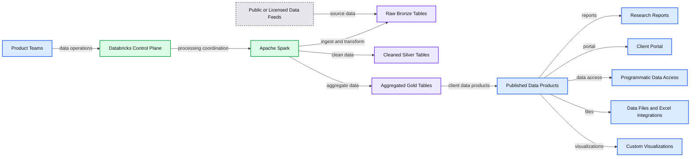

# How YipitData Extracts Insights From Alternative Data Using Delta Lake

- Source: https://www.databricks.com/blog/2021/09/21/how-yipitdata-extracts-insights-from-alternative-data-using-delta-lake.html
- Published: 2021-09-21
- Authors: Anup Segu, Bobby Muldoon
- Categories: engineering, data-engineering, data-streaming
- Images: 2 total, 2 extracted as architecture

[Get an early preview of O'Reilly's new ebook](https://www.databricks.com/resources/ebook/delta-lake-running-oreilly?itm_data=yipitdataextractsinsightsdata-blog-oreillydlupandrunning) for the step-by-step guidance you need to start using Delta Lake.

---

This is a guest post from YipitData. We thank Anup Segu, Data Engineering Tech Lead, and Bobby Muldoon: Director of Data Engineering, at YipitData for their contributions.

 
 Choosing the right storage format for any data lake is an important responsibility for data administrators. Tradeoffs between storage costs, performance, migration cost, and compatibility are top of mind when evaluating options. One option to absolutely consider for your data lake is [Delta Lake](https://delta.io/), an open source, performant storage format that can radically change how to interact with datasets of any size.

With Delta Lake and its streaming capabilities, [YipitData](https://www.yipitdata.com/) efficiently analyzes petabytes of raw, alternative data to answer key questions from leading financial institutions and corporations. This blog will outline YipitData’s general design and approach with alternative data using the Delta Lake.

### How YipitData produces insights for its clients

YipitData specializes in sourcing, productizing, and distributing [alternative data](https://en.wikipedia.org/wiki/Alternative_data_(finance)) to the world's largest investment funds and corporations. Product teams of data analysts complete deep research on raw datasets, design accurate methodologies to answer client questions, and distribute that research over a variety of mediums. Data engineers operate as administrators to provide tooling on top of the databricks platform to make data operations convenient, reliable, and secure for product teams. Early on, product teams were focused on analyzing public web data that was relatively small in scale. The data was stored in Parquet and transformed in a series of batch transformations using Apache Spark™ to inform the analyses in reports, charts, and granular data files delivered to clients.

*that are cleaned, aggregated, and distributed to clients*

**Summary:** YipitData product teams use Databricks, Apache Spark, and Delta Lake to transform multiple data feeds into published client products.

**Components:**

- Public or Licensed Data Feeds: Dataset A, Dataset B, Dataset C, Dataset D, and Dataset E
- Product Teams: analysts and data product users
- Databricks Control Plane: platform control layer
- Apache Spark: data processing engine
- Delta Lake: storage and table management layer
- Raw, Bronze Tables: ingested source data
- Cleaned, Silver Tables: cleaned data
- Aggregated, Gold Tables: aggregated data
- Published Data Products: research reports, client portal, programmatic data access, data files, Excel integrations, and custom visualizations

**Flows:**

- Dataset A, Dataset B, Dataset C, Dataset D, Dataset E -> Raw, Bronze Tables: source data
- Product Teams -> Databricks Control Plane: data operations
- Databricks Control Plane -> Apache Spark: processing coordination
- Apache Spark -> Raw, Bronze Tables: ingest and transform
- Apache Spark -> Cleaned, Silver Tables: cleaned data
- Apache Spark -> Aggregated, Gold Tables: aggregated data
- Aggregated, Gold Tables -> Published Data Products: client-facing data products

**Numbers:** none

source image: https://www.databricks.com/wp-content/uploads/2021/09/Analyzing-Alternative-Data-with-the-Delta-Lake-to-Unlock-New-Opportunities-at-YipitData-blog-img-1.jpg

 Figure 1: YipitData product teams analyze a variety of data sources that are cleaned, aggregated, and distributed to clients

Over the last few years, teams increasingly work with a variety of new source data,  such as card, email, and many other data types, to deliver research on 100+ companies and counting. These new data sources are dramatically increasing YipitData's ability to provide market insights across a variety of verticals and better service its clients.

### **Challenges with Alternative Data**

As the number of data sources increased, the scale and volume of new datasets were concurrently growing. Traditional approaches of using batch transformations were not scaling to meet the needs of product teams.

- Large, frequent data deliveries required constant refreshes of downstream analyses in a short timeframe.
- Batch transformations would take too long, which was an important consideration in providing timely insights to clients from new data sources.
- Techniques to understand shifting data trends on production tables became complicated and unreliable for analysts with data at this scale.
- Attempts to use incremental streaming transformations were plagued by unexpected and unverifiable changes in ETL pipelines.

YipitData needed to update its approach to ingesting, cleaning, and analyzing very large datasets, to continue to fulfill its mission of helping clients answer their key questions.

## **Delta is a robust data storage solution that improves analytics**

YipitData analysts now use [Delta Lake](https://www.databricks.com/product/delta-lake-on-databricks?utm_medium=cpc&utm_source=google&utm_campaign=14270641620&utm_offer=product_delta-lake-on-databricks&utm_content=delta&utm_term=delta%20databricks&utm_ad_group_c=CTX-Delta-Core-P&gclid=Cj0KCQjwkIGKBhCxARIsAINMioKY7YUppXgeo1abMFo6kC20pkSg8WXLFYAGiRfLuh67ERh3a1bFQEMaAnDkEALw_wcB) as the storage layer for all ETL processes and ad hoc exploration to analyze alternative data. This allows them to:

- Leverage [Delta's structured streaming](https://docs.databricks.com/delta/delta-streaming.html) APIs that offer intuitive, reliable, and efficient transformations on high volume datasets.
- Track changes in transformed data and retain past versions using Delta’s transaction layer to reduce the risk of data loss or corruption.
- Perform QA using Delta time travel on data generated via complex batch transformations.
- Gain a "source of truth" as Databricks autoloader reliably converts data feeds from third-party providers into "bronze" Delta tables.

### Delta streaming facilitates high-volume data ingestion

Product teams are increasingly focused on extracting value from large datasets that YipitData sources externally. These raw datasets can be upwards of several TBs in size and add 10-20 GB of new data across hundreds of files each day. Prior to Delta, applying transformations via batch was time-consuming and costly. Such transformations were inefficiently reprocessing ~99% of the dataset every day to refresh downstream analyses. To generate a clean table of up-to-date records, the following code was used:

With Delta streaming, analysts can reliably and exclusively operate on the incremental data delivered and exponentially increase the efficiency of ETL workflows. Delta's declarative APIs make it easy to surgically add, replace, or delete data from a downstream Delta target table with transaction guarantees baked in to prevent data corruption:

Using [APIs](https://docs.delta.io/latest/delta-update.html#merge-examples) such as .merge, .whenMatchedDelete, and .whenMatchedUpdate, data processing costs on this dataset were reduced 50% and runtime by 75%.

While some ETL workflows created by YipitData analysts are conducive to structured streaming, many others are only possible via batch transformations. Retaining outdated data from batch transformations is useful to audit and validate the data products that are shipped to clients. With Delta, this functionality comes out of the box as each table operation creates a new version of that table. Analysts can quickly understand what operations were performed to the datasets they publish and even restore versions to revert any unanticipated changes.

Using the [HISTORY](https://docs.delta.io/latest/delta-utility.html#retrieve-delta-table-history) operation, YipitData analysts gain visibility into the "who, what, where, and when" regarding actions on a table. They can also query past data from a table using [Delta Time Travel](https://docs.delta.io/latest/delta-batch.html#query-an-older-snapshot-of-a-table-time-travel) to understand the state of the table at any point in time.

In the scenarios where a table was overwritten incorrectly, Delta offers a handy [RESTORE](https://docs.databricks.com/spark/latest/spark-sql/language-manual/delta-restore.html) operation to undo changes relatively quickly. This has substantially improved the durability of production data without requiring complex solutions from the engineering team. It also empowers analysts to be more creative and experimental in creating new analyses as modifying data stored in Delta is far less risky.

### Creating a "source of truth" with Databricks Autoloader

As YipitData increasingly ingests alternative data from a variety of sources (web, card, email, etc.), keeping an organized data lake is paramount to ensuring new data feeds get to the right product owners. [Databricks Autoloader](https://docs.databricks.com/spark/latest/structured-streaming/auto-loader-s3.html#file-discovery-modes) has allowed YipitData to standardize the ingestion of these data sources by generating "Bronze Tables" in Delta format. Bronze tables serve as the starting point(s) for analyst-owned ETL workflows that create productized data in new, downstream "Silver" and "Gold" tables. YipitData analysts complete their analysis only on Delta tables and do not have to deal with the challenges of working with raw data formats that typically offer worse read performance, among other drawbacks.

*of any raw format into "Bronze" delta tables with transactional guarantees*

**Summary:** Raw files are incrementally streamed from cloud storage through Spark Structured Streaming with Auto Loader into Bronze Delta tables.

**Components:**

- Raw file deliveries
- Cloud object storage bucket
- Spark readStream using the cloudFiles connector
- Delta Lake
- Bronze Delta tables

**Flows:**

- Raw file deliveries -> Cloud object storage bucket: file delivery
- Cloud object storage bucket -> Spark readStream: incremental file discovery
- Spark readStream -> Delta Lake: streamed writes
- Delta Lake -> Bronze Delta tables: transactional table storage

**Numbers:** none

source image: https://www.databricks.com/wp-content/uploads/2021/09/Analyzing-Alternative-Data-with-the-Delta-Lake-to-Unlock-New-Opportunities-at-YipitData-blog-img-2.jpg

```mermaid
%% Raw files stream through cloudFiles into Bronze Delta tables
flowchart LR
    A[Raw file deliveries] -->|file delivery| B[Cloud object storage bucket]
    B -->|incremental file discovery| C[Spark readStream cloudFiles load]
    C -->|streamed writes| D[Delta Lake]
    D -->|transactional table storage| E[Bronze Delta tables]

    classDef client fill:#dbeafe,stroke:#2563eb,stroke-width:2px,color:#111
    classDef service fill:#dcfce7,stroke:#16a34a,stroke-width:2px,color:#111
    classDef store fill:#ede9fe,stroke:#7c3aed,stroke-width:2px,color:#111
    classDef cache fill:#fef3c7,stroke:#d97706,stroke-width:2px,color:#111
    classDef queue fill:#cffafe,stroke:#0891b2,stroke-width:2px,color:#111
    classDef critical fill:#fee2e2,stroke:#dc2626,stroke-width:4px,color:#111
    classDef external fill:#e5e7eb,stroke:#6b7280,stroke-width:2px,color:#111,stroke-dasharray:4 3
    classDef decision fill:#fce7f3,stroke:#db2777,stroke-width:2px,color:#111

    class A external
    class B store
    class C service
    class D store
    class E store
```

 Figure 2: Use the cloudFiles connector in databricks to stream incremental file deliveries of any raw format into "Bronze" delta tables with transactional guarantees

Autoloader specifically manages data ingestion from common file formats (JSON, CSV, Parquet, etc.) and updates Delta tables incrementally as the data lands. The HISTORY of the table is also used to understand how much data has been delivered and to query the past versions of these tables to debug issues with downstream ETL workflows.

### **Migrating YipitData's data lake to Delta**

To fully realize the benefits of Delta, migrating all existing workloads to store data in Delta format instead of Parquet was necessary. YipitData has over 60,000 tables housing petabytes of data, so the migration process was important to consider. Prior to this migration, analysts had an in-house PySpark function developed by the data engineering team to generate tables from SQL queries or dataframes. This "create table" utility standardized table creations in Parquet format by wrapping the PySpark dataframe APIs.

Delta operations support all [spark dataframe APIs](https://docs.delta.io/latest/delta-batch.html#write-to-a-table), so it was straightforward to switch to writing as Delta instead of Parquet. For tables that were in Parquet format, the [CONVERT](https://docs.databricks.com/spark/latest/spark-sql/language-manual/delta-convert-to-delta.html) operation migrates the tables to Delta in place without duplicating cloud storage files. Through the use of these two features, the create table utility is reimplemented under the hood and all data in ETL workflows are converted to or written out in Delta automatically. As a result, YipitData's entire data lake switched to using Delta with minimal impact for its analysts.

## Conclusion

YipitData’s success is driven by its ability to answer clients' questions quickly and accurately. With structured streaming ingestion backed by Delta, YipitData is able to quickly and reliably ingest, clean, and analyze very large, valuable alternative datasets.

- Declarative streaming APIs drastically reduce ETL runtime leading to timely, valuable insights for clients.
- Delta provides transactions for every table operation, which allows YipitData analysts to create resilient ingestion pipelines that they can monitor.
- Data streamed into Bronze Delta tables via autoloader can be queried and transformed by any number of downstream users, helping permeate raw data across numerous product teams.

As a result, YipitData analysts can independently incorporate new data sources using delta into multiple data products to answer their clients' questions. These sources even fuel new product development for the company. At the same time, Delta is evolving, and YipitData is excited to continue to unlock business opportunities through its data lakehouse platform.

---

## Read More

[How yipitdata slashed over 2.5 million off of aws bill](https://medium.com/yipitdata-engineering/how-yipitdata-slashed-over-2-5-million-off-of-our-aws-bill-43ca1125e03b)

[Using Databricks as an Analytic Platform at Yipitdata](https://www.databricks.com/session_na20/using-databricks-as-an-analysis-platform)

[Recurring data delivery and ingestion with S3 bucket replication](https://medium.com/yipitdata-engineering/recurring-data-delivery-and-ingestion-with-s3-bucket-replication-1ee2ad2b34ac)

[How Yipitdata uses Databricks integration with AWS glue](https://www.databricks.com/blog/2020/01/06/yipitdata-example-highlights-benefits-of-databricks-integration-with-aws-glue.html)

[Data Team effect at Yipitdata](https://www.databricks.com/customers/data-team-effect/yipit)

Customer Story - [YipitData turns to its data team to transform financial market information overload into insight.](https://www.databricks.com/customers/yipitdata)
