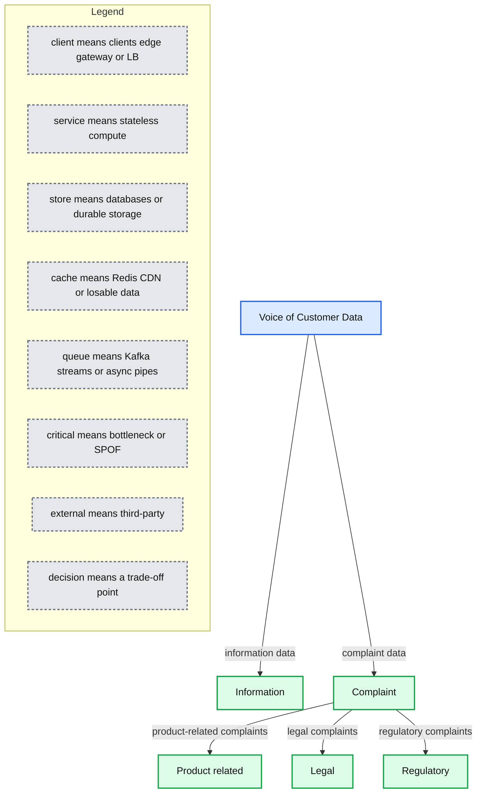
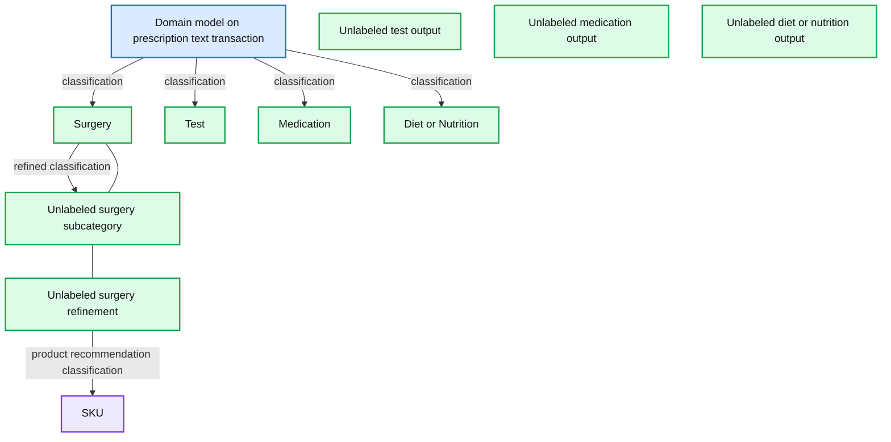
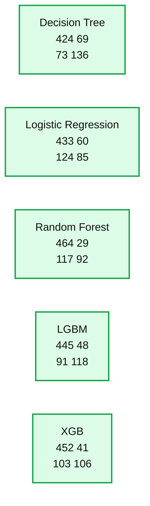
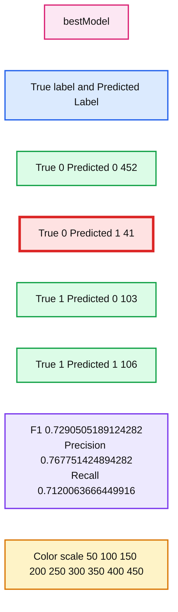
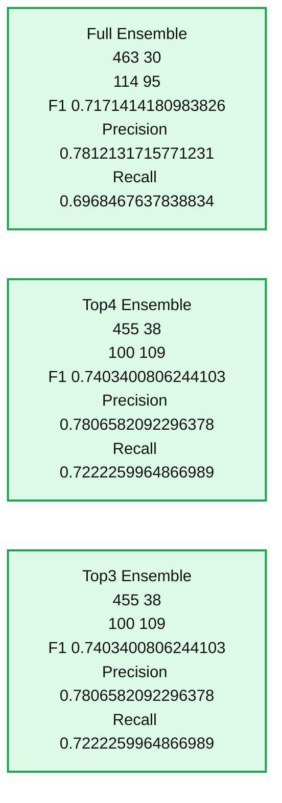

# Managing Model Ensembles With MLflow

- Source: https://www.databricks.com/blog/2021/09/21/managing-model-ensembles-with-mlflow.html
- Published: 2021-09-21
- Authors: Anindita Mahapatra, Rafi Kurlansik, Sri Tikkireddy
- Categories: engineering, data-science-machine-learning
- Images: 6 total, 6 extracted as architecture

In machine learning, an *ensemble* is a collection of diverse models that provide more predictive power together than any single model would on its own. The outputs of multiple learning algorithms are combined through a process of averaging or voting, resulting in potentially a better prediction for a given set of inputs.

However, there are tradeoffs to the ensemble learning approach; each prediction becomes more difficult to ‘explain’ (model interpretability). In addition, this approach can increase engineering complexity, and it's often not immediately obvious how to manage ensemble models throughout their lifecycle. Apart from the fact that we are creating N different models, there are several additional concerns around their management such as:

- If one model changes, how does this impact the ensemble versioning?
- How do we detect model drift of an ensemble?
- How do we package the ensemble artifacts and maintain lineage?

This blog post walks through the process of creating and managing ensembles aided by MLflow and Databricks AutoML. If creating and productionizing a single model is hard, then doing the same for an ensemble of models is even harder! Since Databricks AutoML does the heavy lifting of creating all the models, we now have the opportunity of leveraging ensembles with far less effort. A simple stacking strategy using the top N models from some of the architecture types may outperform the single best model.

### Ensembles

Some algorithms are natural ensembles ([Random forest](https://en.wikipedia.org/wiki/Random_forest), [AdaBoost](https://en.wikipedia.org/wiki/AdaBoost#:~:text=AdaBoost%2C%20short%20for%20Adaptive%20Boosting,learning%20algorithms%20to%20improve%20performance.)), while others are combinations of decision trees and more traditional algorithms like logistic and linear regression. They can even extend into neural networks and deep learning scenarios. Since each algorithm has its own method of modeling the relationships in data, their ensemble can reduce overall variance and bias while improving accuracy.

There are several factors to consider while building an ensemble:

- What is the size of the dataset?
- How many models to include in the ensemble?
- How diverse are the individual models?
- How are multiple versions of the model maintained?
- How should they be packaged?
- Is the model reused across different use cases?

Ensembles usually perform better if there is a lot of variation in the data characteristics. Having a set of diverse learners will help in the overall prediction. However, there is a plateau point, beyond which adding models does not have much impact on the performance. Hence, it is important to balance the cost of creating and managing ensembles with the additional performance gains. Each sub-model in the ensemble will have its own life cycle. Some may have stronger inter-dependencies while others may be more stand-alone. So it is important to consider how the sub-models are trained and packaged for flexible reuse and upgrade.

Let’s take a look at a few use cases that benefit most from an ensemble strategy:

- Analyzing the ‘**Voice of the Custome**r’ data

Complaint data needs to be addressed as per regulatory guidelines. This requires swift and accurate classification of the complaints as well as human intervention to redress. This data comes along with the regular customer chatter. While it is alright to respond to some customer queries at leisure, the ones which are labelled ‘legal’ or ‘regulatory’ need to be addressed immediately. This is an excellent candidate use case for ensembles as even a small accuracy boost has a magnified impact on business.

**Summary:** The diagram shows Voice of Customer Data divided into Information and Complaint categories, with complaints further classified by type.

**Components:**

- Voice of Customer Data - technology unspecified
- Information - technology unspecified
- Complaint - technology unspecified
- Product related - technology unspecified
- Legal - technology unspecified
- Regulatory - technology unspecified

**Flows:**

- Voice of Customer Data -> Information: information data
- Voice of Customer Data -> Complaint: complaint data
- Complaint -> Product related: product-related complaints
- Complaint -> Legal: legal complaints
- Complaint -> Regulatory: regulatory complaints

**Numbers:** none

source image: https://www.databricks.com/wp-content/uploads/2021/09/Model-Ensemble-blog-img-1.png

- Finding the best fit in a multi-classification scenario for **product recommendations**

Prescription data is analyzed to find the appropriate product SKU fit. Models at each layer take the data from the previous layer and refine the classification.

**Summary:** The diagram shows a prescription-text domain model refining classifications across surgery, tests, medication, and diet or nutrition to determine a product SKU.

**Components:**

- Domain model on prescription text transaction - technology unspecified
- Surgery - technology unspecified
- Test - technology unspecified
- Medication - technology unspecified
- Diet or Nutrition - technology unspecified
- Unlabeled surgery subcategory - technology unspecified
- Unlabeled surgery refinement - technology unspecified
- Unlabeled test output - technology unspecified
- Unlabeled medication output - technology unspecified
- Unlabeled diet or nutrition output - technology unspecified
- SKU - technology unspecified

**Flows:**

- Domain model on prescription text transaction -> Surgery: prescription classification
- Domain model on prescription text transaction -> Test: prescription classification
- Domain model on prescription text transaction -> Medication: prescription classification
- Domain model on prescription text transaction -> Diet or Nutrition: prescription classification
- Surgery -> Unlabeled surgery subcategory: refined classification
- Unlabeled surgery refinement -> SKU: product recommendation classification

**Numbers:** none

source image: https://www.databricks.com/wp-content/uploads/2021/09/Model-Ensemble-blog-img-2.png

 Once created and deployed, the model becomes a living artifact that needs to be managed. There are several challenges to consider while managing dependencies and versions of the ensemble and the individual sub-models. In addition, there are various stages(environments), and a model has to successfully perform at each stage to be promoted to the next higher one. It is further exacerbated when the model is part of an ensemble. Yet another level of complexity is if the model is shared by different use cases where the version across each use case may be different. So pulling the latest version from production may not be the right thing to do for all the dependent use cases.

### Simplify ensemble creation and management with Databricks AutoML + MLflow

[MLflow](https://www.mlflow.org/) is an open source, scalable framework for end-to-end model management. It aids the entire [MLOps](https://www.databricks.com/glossary/mlops) cycle from artifact development all the way to deployment with reproducible runs.

An ML practitioner can either create models from scratch or leverage Databricks AutoML. For any set of models logged in MLflow,  not only can you take the best one, but you could also see how well a combination of the top N models performs.

Databricks [AutoML](https://docs.databricks.com/applications/machine-learning/automl.html) is a fully automated, glass box approach model development solution to democratize machine learning for rapid prototyping and using a selected dataset. Under the hood, it leverages MLflow. AutoML solves two key pain points for data scientists, namely quickly verifying the  predictive power of a dataset and getting a baseline model to use as is or start refining and includes:

- Data pre-processing including Exploratory Data Analytics (EDA) notebooks.
- Feature engineering & selection.
- Automated training with hyperparameter tuning and tracking of each run with [MLflow Tracking](https://www.mlflow.org/docs/latest/tracking.html#:~:text=The%20MLflow%20Tracking%20component%20is,API%2C%20and%20Java%20API%20APIs.), aiding in the selection of the best model and registering in [MLflow Registry](https://www.mlflow.org/docs/latest/model-registry.html#:~:text=The%20MLflow%20Model%20Registry%20component,lifecycle%20of%20an%20MLflow%20Model.).

It is not uncommon for data teams  to spend a lot of time and effort to produce several models of different architecture types in pursuit of optimal model performance. With AutoML, the model creation process has been completely auto-generated, thereby simplifying the subsequent process of model selection.

AutoML currently supports both regression and classification and includes these phases:

- **Configuration: **This is where we specify the dataset, problem type, target or label column to predict, the metric for evaluating and scoring the experiment runs, and stopping conditions (such as number of trials or maximum amount of time to run)
- **Training** : Each ML training runs in an experiment that we can query and explore subsequently since all the details (code, parameters, metrics, models, artifacts) are logged.
- **Evaluation: **The top model based on our selection criteria is highlighted for scrutiny and subsequent registration. This is where we can use either the single best model (champion) or a combination of top models (challenger) if that outperforms the champion.

Let’s examine the kaggle[telco dataset](https://www.kaggle.com/blastchar/telco-customer-churn) that is used to predict which customers may churn in the next round. Based on the selection criteria, AutoML recommends not only the single best model but also provides details on all the runs across all the model types. We’ll start by logging the recommended Best Model (**Champion**) in the MLflow model registry, along with the top models in each sub-category (**Challengers**)

Using a test dataset, we compare the performance between the Champion and the Challengers in this [notebook](https://www.databricks.com/notebooks/automl_ensemble.html). In the case of the ensemble, a voting strategy was used for final classification. If the ensemble performance is significantly better, that can be the new champion model. Users have different options on how to consume the ensemble model, either individually or collectively.

*Figure: Flow to determine the best ensemble, log it in the tracking server, promote to registry*

**Summary:** The diagram shows how AutoML models are compared, assembled, logged, promoted, and used for inference through two ensemble deployment options.

**Components:**

- Data: input dataset.
- Regression Classification: modeling task.
- Metric of Importance: model selection criterion.
- AutoML: automated model training.
- Random Forest: candidate model architecture.
- Decision Tree: candidate model architecture.
- XGB: candidate model architecture.
- Light GBM: candidate model architecture.
- Logistic Regression: candidate model architecture.
- BestModel: selected champion model.
- Ensemble: combined candidate models.
- Compare: performance comparison decision.
- Option 1: independently registered models with inference-time voting.
- Option 2: single custom ensemble pyfunc model.
- Model Registry: staging and production promotion.
- Ready for Inferencing: deployable model state.

**Flows:**

- Data -> AutoML: training data.
- Regression Classification -> AutoML: modeling objective.
- Metric of Importance -> AutoML: optimization metric.
- AutoML -> BestModel: selects the best model.
- AutoML -> Random Forest: produces candidate model.
- AutoML -> Decision Tree: produces candidate model.
- AutoML -> XGB: produces candidate model.
- AutoML -> Light GBM: produces candidate model.
- AutoML -> Logistic Regression: produces candidate model.
- Random Forest -> Ensemble: candidate model input.
- Decision Tree -> Ensemble: candidate model input.
- XGB -> Ensemble: candidate model input.
- Light GBM -> Ensemble: candidate model input.
- Logistic Regression -> Ensemble: candidate model input.
- BestModel -> Compare: champion performance.
- Ensemble -> Compare: ensemble performance.
- Compare -> Option 1: choose independent model deployment.
- Compare -> Option 2: choose single ensemble deployment.
- Option 1 -> Model Registry: log each individual model.
- Model Registry -> Option 1: load registered models.
- Option 1 -> Ready for Inferencing: score data with each model and apply voting.
- Option 2 -> Custom Ensemble Pyfunc: combine individual models.
- Custom Ensemble Pyfunc -> Model Registry: log the single ensemble model.
- Model Registry -> Production: promote through registry stages.
- Production -> Ready for Inferencing: deploy promoted ensemble.

**Numbers:** Option 1, Option 2, 2 or more, 1, 2

```mermaid
%% Model ensemble selection, registration, promotion, and inference flow
flowchart LR
    D[Data] -->|training data| A[AutoML]
    T[Regression Classification] -->|modeling objective| A
    M[Metric of Importance] -->|selection metric| A
    A -->|best candidate| B[BestModel]
    A -->|candidate models| C[Candidate Models]
    C -->|selected models| E[Ensemble]
    B -->|champion score| X[Compare]
    E -->|ensemble score| X
    X -->|independent models| O1[Option 1]
    X -->|single ensemble| O2[Option 2]
    O1 -->|log each model| R[Model Registry]
    R -->|load registered models| I1[Inference Voting]
    I1 -->|ready to infer| Q[Ready for Inferencing]
    O2 -->|create custom pyfunc| P[Ensemble Pyfunc]
    P -->|log single model| R2[Ensemble Registry]
    R2 -->|promote stages| Prod[Production]
    Prod -->|deploy| Q2[Ready for Inferencing]

    classDef client fill:#dbeafe,stroke:#2563eb,stroke-width:2px,color:#111
    classDef service fill:#dcfce7,stroke:#16a34a,stroke-width:2px,color:#111
    classDef store fill:#ede9fe,stroke:#7c3aed,stroke-width:2px,color:#111
    classDef cache fill:#fef3c7,stroke:#d97706,stroke-width:2px,color:#111
    classDef queue fill:#cffafe,stroke:#0891b2,stroke-width:2px,color:#111
    classDef critical fill:#fee2e2,stroke:#dc2626,stroke-width:4px,color:#111
    classDef external fill:#e5e7eb,stroke:#6b7280,stroke-width:2px,color:#111,stroke-dasharray:4 3
    classDef decision fill:#fce7f3,stroke:#db2777,stroke-width:2px,color:#111

    class D,T,M client
    class A,C,B,E,I1,P,Prod service
    class R,R2 store
    class X decision
    class O1,O2,Q,Q2 external
```

source image: https://www.databricks.com/wp-content/uploads/2021/09/Model-Ensemble-blog-img-3.jpg

Figure: Flow to determine the best ensemble, log it in the tracking server, promote to registry

| **Option #1** | **Option #2** |
|---|---|
| - Log each model of the ensemble separately in the registry - Promote to staging/production. - At inference time, load all registered models and use ensemble voting strategy to predict. | - Load individual models. - Create an ensemble pyfunc model by passing each individual model to it and the login tracking server. - Perform test inference using model details from the tracking server. - Promote ensemble model to registry and transition model to production. - Load ensemble from registry to do inference on new data. |

In this example, we opt for option #2, which entails logging each model independently and as a single ensemble wrapper model in MLflow.

The ensemble encapsulates all the independent models as a single pickle file. This allows us to deploy the ensemble as one artifact that has a life cycle of its own, separate from the individual contributing models, which can continue to evolve independently. This is very similar to shipping a docker container or an uber jar after combining relevant individual libraries.

#### Step #1: Fetch the "best" models of each architecture type from the AutoML experiment:

 

*(In the example chosen, AutoML identified XGB to be the best model)*

**Summary:** Confusion matrices compare the best Decision Tree, Logistic Regression, Random Forest, LGBM, and XGB models generated by AutoML.

**Components:**

- Decision Tree using a decision tree classifier
- Logistic Regression using logistic regression
- Random Forest using a random forest classifier
- LGBM using LightGBM
- XGB using XGBoost

**Flows:**

- none

**Numbers:** Decision Tree: 424, 69, 73, 136; Logistic Regression: 433, 60, 124, 85; Random Forest: 464, 29, 117, 92; LGBM: 445, 48, 91, 118; XGB: 452, 41, 103, 106; class labels 0 and 1; colorbar values include 50, 100, 150, 200, 250, 300, 350, 400, and 450.

source image: https://www.databricks.com/wp-content/uploads/2021/09/Model-Ensemble-blog-img-10-scaled.jpg

 Figure: Best Models of each model type generated by AutoML (In the example chosen, AutoML identified XGB to be the best model)

#### Step #2: Build a custom pyfunc model class that encapsulates the best models

This will pickle the different models along with the ensemble. The required functions for the ensemble class are the __init__, load_context, decide, ensembleTopN and predict methods  – all of which will be fleshed further down.

#### Step #3: Provide a predict function for the ensemble

The predict function for any pyfunc model needs to fit the following [paradigm](https://www.mlflow.org/docs/latest/python_api/mlflow.pyfunc.html#inference-api)), which is what will be used at inference time to score new data.

The predict function accepts data as a pandas dataframe and returns another pandas dataframe. This allows the model to be interoperable as a web API via MLflow model serving or via Apache Spark™ UDFs/pandas functions.

#### Step #4: Provide a voting function

The meat of the prediction is determined by the voting algorithm, which can have several variations. Here is an example with the simple approach of majority vote.

*Figure: Champion Model*

**Summary:** Confusion matrix showing the Champion Model bestModel performance for binary classification.

**Components:**

- bestModel: Champion classification model
- Confusion matrix: True labels versus predicted labels
- Performance metrics: F1, precision, and recall scores
- Color scale: Heatmap count scale

**Flows:**

- none

**Numbers:** 452, 41, 103, 106, 0, 1, 50, 100, 150, 200, 250, 300, 350, 400, 450, F1 Score 0.7290505189124282, Precision Score 0.767751424894282, Recall Score 0.7120063666449916

source image: https://www.databricks.com/wp-content/uploads/2021/09/ensemble-blog-img-champion.png

Figure: Champion Model

*(In the example chosen, Top4 and Top3 Ensembles are the clear winners.)*

**Summary:** A benchmark comparison shows Full Ensemble, Top4 Ensemble, and Top3 Ensemble performance using confusion matrices and F1, precision, and recall scores.

**Components:**

- Full Ensemble benchmark with confusion matrix and metrics
- Top4 Ensemble benchmark with confusion matrix and metrics
- Top3 Ensemble benchmark with confusion matrix and metrics

**Flows:**

- none

**Numbers:** 463, 30, 114, 95, 455, 38, 100, 109, 0, 1, 450, 400, 350, 300, 250, 200, 150, 100, 50, 0.7171414180983826, 0.7812131715771231, 0.6968467637838834, 0.7403400806244103, 0.7806582092296378, 0.7222259964866989

source image: https://www.databricks.com/wp-content/uploads/2021/09/Model-Ensemble-Blog-img-11.jpg

 Figure: Ensemble challenger models compared to AutoML generated champion model (In the example chosen, Top4 and Top3 Ensembles are the clear winners.)

#### Step# 5: Package and log the model in MLflow as a custom pyfunc model

Provenance back to the encapsulated models needs to be maintained, and this is where the MLflow tracking server and parameters/tags are used to save the parent model URIs in the ensemble run.

This process becomes very easy to manage and version because there is a single artifact. If something in the pipeline is not functioning, there are significantly fewer moving parts, which make it easy to debug and validate before the model gets placed in the registry. This paradigm is very similar to shipping a [sklearn pipeline](https://scikit-learn.org/stable/modules/generated/sklearn.pipeline.Pipeline.html), where the pipeline encapsulates all the transformations needed before the predictor. In the end, you also only need to manage just one registry for the prediction.

#### Step #6: Scoring

The model is now ready to score new data:

### Nuances of ensembles

#### Multiple models do not necessarily mean an ensemble!

Let us consider the scenario of IoT data sent from different machines across several factories. Each machine has a different operating cycle, so it would be wrong to baseline them together. A model needs to be built per machine. The incoming data is filtered by the type of machine and an appropriate model is applied. Some may argue this is an ensemble. It is a divide-and-conquer approach but the data is trained/scored by a single model. Multiple models are not combined to improve accuracy; hence, this is not an ensemble scenario -- it is just N models. The voting strategy discussed earlier can, however, be used on the input data characteristics to invoke the right sub-model.

## Summary

The ensemble method is a layering approach where moderately performant un-correlated models are combined to produce a supermodel that improves accuracy while improving stability and is often a divide and conquer strategy used in large, diverse datasets. Apart from the increased engineering complexity and manageability, there is often a tradeoff between accuracy and explainability, which is why people sometimes shy away from ensembles in production, although it is the preferred approach in Kaggle competitions. AutoML, with its inherent use of MLflow, comes to aid by automating and simplifying the creation and management of the underlying models, thereby helping ML practitioners to push the boundaries in their quest to extract value from data.

 

[TRY THE NOTEBOOK](https://www.databricks.com/notebooks/automl_ensemble.html)

---

### Related blogs:

[Automl blog](https://www.databricks.com/blog/2021/05/27/introducing-databricks-automl-a-glass-box-approach-to-automating-machine-learning-development.html)

[Mlflow model registry blog](https://www.databricks.com/blog/2020/04/15/databricks-extends-mlflow-model-registry-with-enterprise-features.html)
