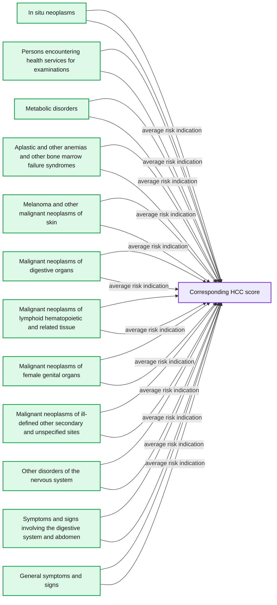
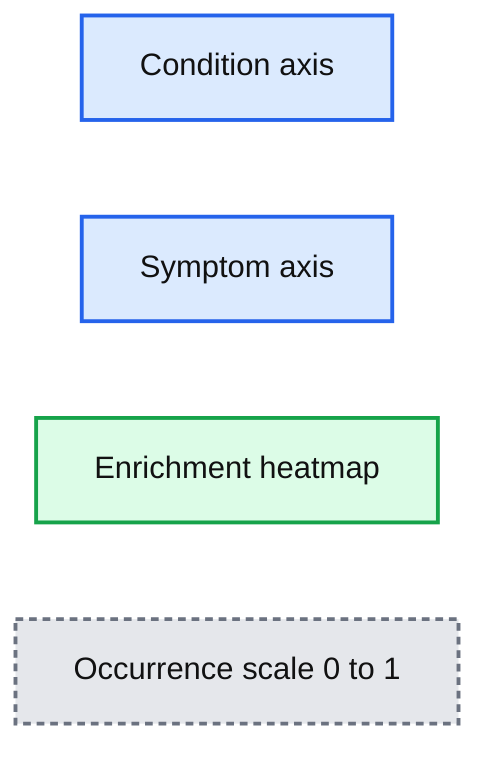
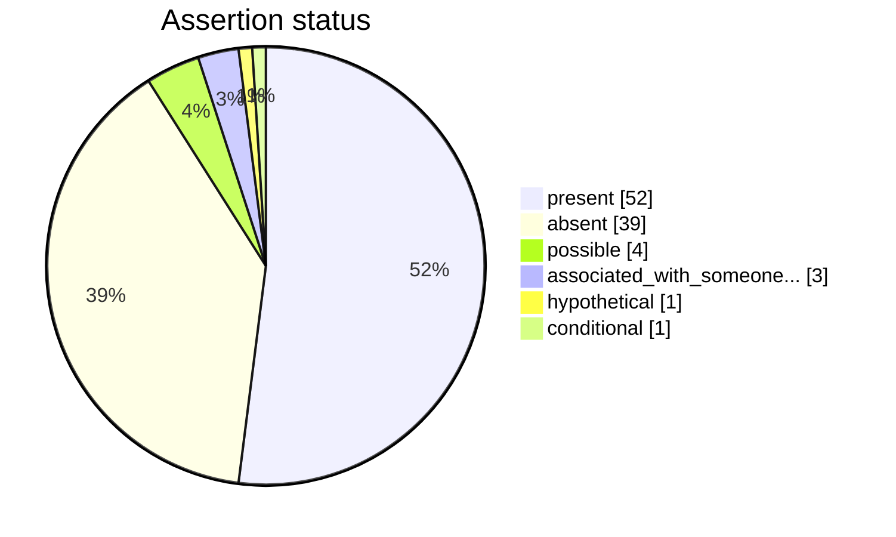
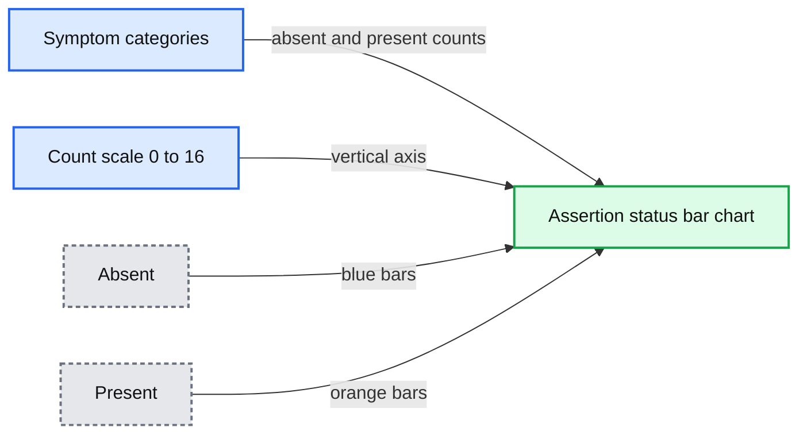

# Extracting Oncology Insights From Real-World Clinical Data With NLP

- Source: https://www.databricks.com/blog/2021/09/22/extracting-oncology-insights-from-real-world-clinical-data-with-nlp.html
- Published: 2021-09-22
- Authors: Amir Kermany, Moritz Steller, David Talby, Michael Sanky
- Categories: engineering, solution-accelerators
- Images: 10 total, 8 extracted as architecture

Preview the solution accelerator notebooks referenced in this blog [online](https://notebooks.databricks.com/notebooks/HLS/oncology/index.html) or get started right away by [downloading](https://www.databricks.com/solutions/accelerators/nlp-oncology) and importing the notebooks into your Databricks account.

Cancer is the [leading cause of death](https://www.fightcancer.org/sites/default/files/National%20Documents/Costs-of-Cancer-2020-10222020.pdf) and disease in the U.S., and  the numbers are staggering with nearly [2 million new cases of cancer](https://www.cancer.org/research/cancer-facts-statistics/all-cancer-facts-figures/cancer-facts-figures-2021.html) expected to be diagnosed in the U.S. this coming year. Cancer also represents a significant portion of total U.S. healthcare spending, estimated at more than $200B in 2020. As such, the biopharmaceutical industry is heavily focused on oncology drug development. Nearly 40 new cancer drugs were approved by the FDA in 2019 and 2020 alone, and more than 1300 new medications and vaccines are in clinical development.

Measuring the efficacy of oncology interventions is critical to matching patients with the right intervention. Oncology data, and related real-world evidence, have the potential to inform clinical research, trial design, regulatory decisions, safety assessments, treatment pathways and more.  Unfortunately, given the highly specialized nature of oncology care, disease criteria and endpoints typically are not available in structured formats and remain locked in data silos, making them hard to aggregate and analyze.

In oncology, pathology reports (often captured in PDF format and siloed in EMR systems), contain critical information, such as tumor size, grade, stage and histology. These variables, once extracted with a natural language processing (NLP) system, can be used to define disease cohorts, assess disease severity and create a baseline for disease progression, which then can be applied to the aforementioned use cases, ranging from clinical trial matching to treatment pathways. But extracting this information from unstructured clinical text data is often a huge pain point for data teams.

John Snow Labs, the leader in healthcare NLP, and Databricks are tackling these challenges head-on and working with many customers across the healthcare ecosystem to translate unstructured oncology data into actionable evidence.

## Clinical natural language processing at scale with Databricks & John Snow Labs

The path forward begins with [the Databricks Lakehouse Platform](https://www.databricks.com/product/data-lakehouse), a modern data platform that combines the best elements of a data warehouse—such as data management and performance —with the low cost, flexibility and scale of a cloud data lake. This new, [simplified architecture enables health systems](https://www.databricks.com/blog/2021/07/19/unlocking-the-power-of-health-data-with-a-modern-data-lakehouse.html) to unify all their data—structured (e.g. diagnoses and procedure codes found in EHR databases), semi-structured (e.g. HL7, FHIR messages) and unstructured (e.g. free-text notes and images)— into a single, high-performance platform for both traditional analytics and data science.

**Summary:** Databricks Lakehouse Platform layers healthcare NLP capabilities over governed and open data lakes for clinical data analysis.

**Components:**

- Databricks
- Lakehouse Platform
- Data Engineering
- BI and SQL Analytics
- Real-time Data Applications
- Data Science and Machine Learning
- NLP for Healthcare
- John Snow Labs
- Data Management and Governance
- Delta Lake
- Open Data Lake
- Provider Notes
- Lab Reports
- Medical Claims
- Research
- Social and Behavioral

**Flows:**

- none visible

**Numbers:** none



<sub>source image: https://www.databricks.com/wp-content/uploads/2021/09/Extracting-Oncology-Insights-from-Real-World-Data-with-NLP-blog-img-1.png</sub>

```mermaid
%% Databricks healthcare NLP lakehouse platform layout
flowchart TD
  D[Databricks]
  L[Lakehouse Platform]
  DE[Data Engineering]
  BI[BI and SQL Analytics]
  RT[Real-time Data Applications]
  DS[Data Science and Machine Learning]
  NLP[NLP for Healthcare]
  JSL[John Snow Labs]
  GOV[Data Management and Governance]
  DL[Delta Lake]
  ODL[Open Data Lake]
  PN[Provider Notes]
  LR[Lab Reports]
  MC[Medical Claims]
  R[Research]
  SB[Social and Behavioral]

  classDef client fill:#dbeafe,stroke:#2563eb,stroke-width:2px,color:#111
  classDef service fill:#dcfce7,stroke:#16a34a,stroke-width:2px,color:#111
  classDef store fill:#ede9fe,stroke:#7c3aed,stroke-width:2px,color:#111
  classDef cache fill:#fef3c7,stroke:#d97706,stroke-width:2px,color:#111
  classDef queue fill:#cffafe,stroke:#0891b2,stroke-width:2px,color:#111
  classDef critical fill:#fee2e2,stroke:#dc2626,stroke-width:4px,color:#111
  classDef external fill:#e5e7eb,stroke:#6b7280,stroke-width:2px,color:#111,stroke-dasharray:4 3
  classDef decision fill:#fce7f3,stroke:#db2777,stroke-width:2px,color:#111

  class D,L,DE,BI,RT,DS,NLP,JSL,GOV,DL,ODL,PN,LR,MC,R,SB service
```

At the core of the Databricks Lakehouse Platform is [Delta Lake](https://delta.io/), an open-source storage layer that brings performance (via Apache Spark™), reliability and governance to a data lake. Healthcare organizations can land all of their data – including raw provider notes, radiology reports and PDF pathology reports – into Delta Lake. This preserves the original source of truth before applying any data transformations. By contrast, with a traditional data warehouse, transformations occur prior to loading the data, which means that all structured variables extracted from unstructured text are disconnected from the native text.

Building on this foundation is John Snow Labs' Spark NLP for Healthcare, the [most widely-used NLP library](https://gradientflow.com/2020nlpsurvey/) in the healthcare and life science industries. Optimized to run on Databricks, Spark NLP for Healthcare seamlessly extracts, classifies and structures clinical and biomedical text data with state-of-the-art accuracy at scale. It is the only native distributed open-source text processing library for Python, Java and Scala, and since every Spark NLP pipeline is a Spark ML pipeline, it is particularly well suited to building unified NLP and machine learning pipelines. Spark NLP provides Python, Java and Scala libraries with [the full functionality of traditional NLP libraries](https://blog.dominodatalab.com/comparing-nlp-libraries-in-python) (like spaCy, nltk, Stanford CoreNLP and Open NLP) and adds additional functionality, such as spell-checking, sentiment analysis and document classification. You can learn more about the joint Databricks and John Snow Labs solution in our previous blog, [*Applying Natural Language Processing to Health Text at Scale*](https://www.databricks.com/blog/2021/07/01/applying-natural-language-processing-to-healthcare-text-at-scale.html).

## Real-world oncology data abstraction in action

To demonstrate the power of Databricks and John Snow Labs, we created a [Solution Accelerator](https://notebooks.databricks.com/notebooks/HLS/oncology/index.html)for abstracting real-world data from oncology notes. The solution accelerator contains sample data, prebuilt code and step-by-step instructions for ingesting and preparing oncology reports for downstream analytics and real-world evidence generation. The solution is ready to go in a Databricks notebook and to help you get started, we've included a brief walkthrough of the solution below.

**Summary:** End-to-end Databricks Lakehouse workflow for extracting structured oncology insights from protected clinical data.

**Components:**

- Cloud storage: HIPAA protected provider notes, PDF oncology reports, and medical images.
- OCR and PHI removal: converts source documents into de-identified text.
- Bronze layer: stores de-identified raw data using Delta Lake.
- NER: extracts named entities from clinical text.
- Silver layer: stores coded records such as ICD-10 and RX using Delta Lake.
- Gold layer: stores cleaned, mapped, billable data using Delta Lake.
- Serve: provides data analysis and visualizations.

**Flows:**

- Cloud storage -> OCR and PHI removal: HIPAA protected clinical data.
- OCR and PHI removal -> Bronze layer: de-identified raw data.
- Bronze layer -> NER: raw clinical text for entity extraction.
- NER -> Silver layer: coded records.
- Silver layer -> Gold layer: cleaned and mapped data.
- Gold layer -> Serve: analytics-ready data.

**Numbers:** none



<sub>source image: https://www.databricks.com/wp-content/uploads/2021/09/Extracting-Oncology-Insights-from-Real-World-Data-with-NLP-blog-img-2.jpg</sub>

```mermaid
%% Shows an end-to-end oncology data processing workflow
flowchart LR
    A[Cloud storage] -->|Protected clinical data| B[OCR and PHI removal]
    B -->|De-identified raw data| C[Bronze layer]
    C -->|Clinical text| D[NER]
    D -->|Coded records| E[Silver layer]
    E -->|Cleaned mapped data| F[Gold layer]
    F -->|Analytics-ready data| G[Serve]

    classDef client fill:#dbeafe,stroke:#2563eb,stroke-width:2px,color:#111
    classDef service fill:#dcfce7,stroke:#16a34a,stroke-width:2px,color:#111
    classDef store fill:#ede9fe,stroke:#7c3aed,stroke-width:2px,color:#111
    classDef cache fill:#fef3c7,stroke:#d97706,stroke-width:2px,color:#111
    classDef queue fill:#cffafe,stroke:#0891b2,stroke-width:2px,color:#111
    classDef critical fill:#fee2e2,stroke:#dc2626,stroke-width:4px,color:#111
    classDef external fill:#e5e7eb,stroke:#6b7280,stroke-width:2px,color:#111,stroke-dasharray:4 3
    classDef decision fill:#fce7f7,stroke:#db2777,stroke-width:2px,color:#111

    class A external
    class B,D service
    class C,E,F store
    class G client
```

For this solution we used the [MT ONCOLOGY NOTES](https://www.mtsamplereports.com/) dataset. It offers resources primarily in the form of transcribed sample medical reports across medical specialties and common medical transcription words/phrases encountered in specific sections that form part of a medical report  – sections such as physical examination or PE, review of systems or ROS, laboratory data and mental status exam, among others.

We chose 50 de-identified oncology reports from the MT Oncology notes dataset as the source of the unstructured text and landed the raw text data into the Delta Lake bronze layer. For demonstration purposes, we limited the number of samples to 50, but the framework presented in this solution accelerator can be scaled to accommodate millions of clinical notes and text files.

The first step in our accelerator is to extract variables using various models for Named-Entity Recognition (NER). To do that, we first set up our NLP pipeline, which contains [annotators](https://nlp.johnsnowlabs.com/docs/en/annotators) such as documentAssembler and sentenceDetector and tokenizer  that are trained specifically for healthcare-related NER. In the example below, we combined [bionlp_ner](https://nlp.johnsnowlabs.com/2021/03/31/ner_bionlp_en.html), which is a clinical NER model, and [jsl_ner](https://nlp.johnsnowlabs.com/2021/01/18/jsl_ner_wip_clinical_en.html), which is a pre-trained deep NER model for clinical terminology. We see that the mesothelioma patient is experiencing symptoms such as coughing.

Extracting named entities from texts is a great example of AI-assisted ETL: pre-trained deep learning (DL) models enable us to transform unstructured data into a structured format that can be used for downstream clinical analysis.

Once we have the symptoms extracted, we can map to [ICD-10 codes](https://www.who.int/standards/classifications/classification-of-diseases), which can be used for coding automation and improving [Hierarchical Condition Category](https://www.aafp.org/fpm/2016/0900/p24.html#fpm20160900p24-b1) (HCC) coding accuracy for Medicare Risk Adjustment. We can further use this data to analyze treatment patterns and analyze the association between symptoms and oncological entities.

*Figure 1: Average risk indication for coded symptoms in the clinical dataset*

**Summary:** Horizontal box plot showing average HCC risk scores for coded clinical symptoms and conditions.

**Components:**

- In situ neoplasms, coded condition category
- Persons encountering health services for examinations, coded condition category
- Metabolic disorders, coded condition category
- Aplastic and other anemias and other bone marrow failure syndromes, coded condition category
- Melanoma and other malignant neoplasms of skin, coded condition category
- Malignant neoplasms of digestive organs, coded condition category
- Malignant neoplasms of lymphoid hematopoietic and related tissue, coded condition category
- Malignant neoplasms of female genital organs, coded condition category
- Malignant neoplasms of ill-defined other secondary and unspecified sites, coded condition category
- Other disorders of the nervous system, coded condition category
- Symptoms and signs involving the digestive system and abdomen, coded condition category
- General symptoms and signs, coded condition category
- Corresponding HCC score, quantitative risk score axis

**Flows:**

- Coded condition categories -> Corresponding HCC score: average risk indication

**Numbers:** 0, 20, 40, 60, 80, 100



<sub>source image: https://www.databricks.com/wp-content/uploads/2021/09/Extracting-Oncology-Insights-from-Real-World-Data-with-NLP-blog-img-4.jpg</sub>

Figure 1: Average risk indication for coded symptoms in the clinical dataset

*Figure 2: A visualization of symptom enrichment among most frequent conditions in the dataset*

**Summary:** Heatmap showing symptom enrichment across frequent oncology-related conditions, with occurrence values from 0 to 1.

**Components:**

- Condition axis: clinical conditions, technology not specified
- Symptom axis: extracted symptoms, technology not specified
- Enrichment heatmap: symptom-condition occurrence visualization
- Occurrence scale: color legend ranging from 0 to 1

**Flows:**

- none

**Numbers:** 0, 0.2, 0.4, 0.6, 0.8, 1



<sub>source image: https://www.databricks.com/sites/default/files/inline-images/screenshot-2023-10-30-at-3.17.16-pm.png</sub>

Figure 2: A visualization of symptom enrichment among most frequent conditions in the dataset

We can also generate a chart to study the assertion status of these symptoms as being present, absent or associated with someone else (for example, a family member).

**Summary:** Donut chart showing assertion statuses for oncology symptoms.

**Components:**

- Present assertion status, technology not visible
- Hypothetical assertion status, technology not visible
- Conditional assertion status, technology not visible
- Possible assertion status, technology not visible
- Absent assertion status, technology not visible
- Associated with someone assertion status, technology not visible

**Flows:**

- none

**Numbers:** 52%, 39%, 4%, 3%, 1%, 1%



<sub>source image: https://www.databricks.com/wp-content/uploads/2021/09/Extracting-Oncology-Insights-from-Real-World-Data-with-NLP-blog-img-6.png</sub>

Continuing with the same note set, we run descriptive and visual statistics to display the most common oncology entities (example below) stratified by their assertion status.

*Figure 3: Assertion Status Of Most Common Symptoms.*

**Summary:** Bar chart showing assertion status counts for common oncology symptoms, categorized as absent or present.

**Components:**

- Chunk axis with symptom categories
- Count axis ranging from 0 to 16
- Absent assertion series
- Present assertion series
- Symptom categories including edema, murmurs, hepatosplenomegaly, acute distress, night sweats, mass, chills, pain, nausea, vomiting, non distended, gallops, lymphadenopathy, cyanosis, shortness of breath, masses, diarrhea, vomiting, nontender, cough, and chest pain

**Flows:**

- none

**Numbers:** 0, 2, 4, 6, 8, 10, 12, 14, 16



<sub>source image: https://www.databricks.com/wp-content/uploads/2021/09/Extracting-Oncology-Insights-from-Real-World-Data-with-NLP-blog-img-7.png</sub>

Figure 3: Assertion Status Of Most Common Symptoms.

Next, we can look at treatments, including drug frequency and duration, which form the basis of oncology regimens. Below is a screenshot of the NLP model included in our solution notebook extracting drug treatment and duration information.

We can then associate symptoms in relation to treatments, as well as disease statuses such as relapse, with confidence scores.

**Summary:** A tabular NLP extraction record linking the BEAM regimen to relapse after treatment, with a confidence score.

**Components:**

- Record index 6483
- Path field with Databricks DBFS oncology note location
- Relation field
- Entity1 field
- Chunk1 field
- Entity2 field
- Chunk2 field
- Confidence field

**Flows:**

- none

**Numbers:** 6483, 72, 0.9916402

```text
%% mermaid failed to render; kept as text
%% Shows one oncology NLP extraction record
flowchart LR
  i[6483]
  p[path dbfs oncology notes mt mt oncology 72 txt]
  r[relation AFTER]
  e1[entity1 TREATMENT]
  c1[chunk1 BEAM regimen]
  e2[entity2 PROBLEM]
  c2[chunk2 relapse]
  cf[confidence 0.9916402]

  classDef client fill:#dbeafe,stroke:#2563eb,stroke-width:2px,color:#111
  classDef service fill:#dcfce7,stroke:#16a34a,stroke-width:2px,color:#111
  classDef store fill:#ede9fe,stroke:#7c3aed,stroke-width:2px,color:#111
  classDef cache fill:#fef3c7,stroke:#d97706,stroke-width:2px,color:#111
  classDef queue fill:#cffafe,stroke:#0891b2,stroke-width:2px,color:#111
  classDef critical fill:#fee2e2,stroke:#dc2626,stroke-width:4px,color:#111
  classDef external fill:#e5e7eb,stroke:#6b7280,stroke-width:2px,color:#111,stroke-dasharray:4 3
  classDef decision fill:#fce7f3,stroke:#db2777,stroke-width:2px,color:#111
  client = clients edge gateway LB
  service = stateless compute
  store = databases durable storage
  cache = Redis CDN or losable data
  queue = Kafka streams async pipes
  critical = bottleneck or SPOF
  external = third party
  decision = trade off point

  class i,p,r,e1,c1,e2,c2,cf service
```

<sub>source image: https://www.databricks.com/wp-content/uploads/2021/09/Extracting-Oncology-Insights-from-Real-World-Data-with-NLP-blog-img-9.jpg</sub>

This data is critical for ensuring both the quality of individual patient care and population-level research, which can help determine the efficacy and safety of interventions in the real world.

Using the Databricks Lakehouse Platform, we can also easily create a database of conditions, symptoms and procedures, along with other relevant extracted information from the unstructured notes, which can then be used for downstream analysis, clinical decision support and research.

**Summary:** Dashboard showing oncology entities, ICD-10 mappings, procedures, risk by indication, and assertion status extracted from clinical notes.

**Components:**

- Insights from Oncology Reports dashboard using John Snow Labs NLP models
- icd10_hcc_table with note IDs, chunks, entities, ICD-10 codes, and code names
- top_10_mapped_icds donut chart
- count of icd10_entities bar chart
- top_10_procedures horizontal bar chart
- avg-risk-per-indic bar chart
- assertion_status pie chart

**Flows:**

- none

**Numbers:** 10, 40, 1, 2, 3, 4, 5, 187c82b4063db33e49d81e3787095466, R05, R074, 31.8%, 19.5%, 19.1%, 14.6%, 7.94%, 1500, 1000, 500, 0, 70, 60, 50, 40, 30, 20, 10

```text
%% mermaid failed to render; kept as text
%% Dashboard showing extracted oncology insights and analytical panels
flowchart LR
    A[Insights from Oncology Reports]
    B[ICD 10 HCC table]
    C[Top 10 mapped ICDs]
    D[Count of ICD 10 entities]
    E[Top 10 procedures]
    F[Average risk per indication]
    G[Assertion status]

    A --- B
    A --- C
    B --- D
    C --- E
    D --- F
    E --- G

    classDef client   fill:#dbeafe,stroke:#2563eb,stroke-width:2px,color:#111
    classDef service  fill:#dcfce7,stroke:#16a34a,stroke-width:2px,color:#111
    classDef store    fill:#ede9fe,stroke:#7c3aed,stroke-width:2px,color:#111
    classDef cache    fill:#fef3c7,stroke:#d97706,stroke-width:2px,color:#111
    classDef queue    fill:#cffafe,stroke:#0891b2,stroke-width:2px,color:#111
    classDef critical fill:#fee2e2,stroke:#dc2626,stroke-width:4px,color:#111
    classDef external fill:#e5e7eb,stroke:#6b7280,stroke-width:2px,color:#111,stroke-dasharray:4 3
    classDef decision fill:#fce7f3,stroke:#db2777,stroke-width:2px,color:#111
    client = clients edge gateway LB, service = stateless compute, store = databases durable storage
    cache = Redis CDN anything losable, queue = Kafka streams async pipes, critical = bottleneck or SPOF
    external = third party, decision = trade off point

    class A client
    class B,C,D,E,F,G service
```

<sub>source image: https://www.databricks.com/wp-content/uploads/2021/09/Extracting-Oncology-Insights-from-Real-World-Data-with-NLP-blog-img-10.jpg</sub>

With this solution accelerator, Databricks and John Snow Labs have opened the door to extract oncology data at scale with the quality required for real-world evidence generation.

## Get started extracting RWD from oncology notes with NLP

To use this solution, preview the [notebooks online](https://notebooks.databricks.com/notebooks/HLS/oncology/index.html) or get started right away by [downloading and importing the notebooks](https://www.databricks.com/solutions/accelerators/nlp-oncology) into your Databricks account. The notebooks include guidance for installing the related John Snow Labs NLP libraries and license keys.

You can also visit our industry pages to learn more about our [Healthcare](https://www.databricks.com/solutions/industries/healthcare-industry-solutions) and [Life Sciences](https://www.databricks.com/solutions/industries/life-sciences-industry-solutions) solutions.
