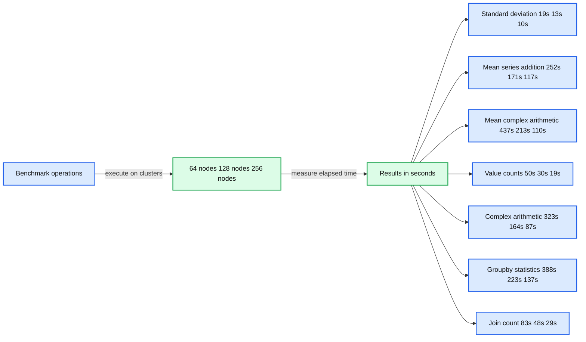
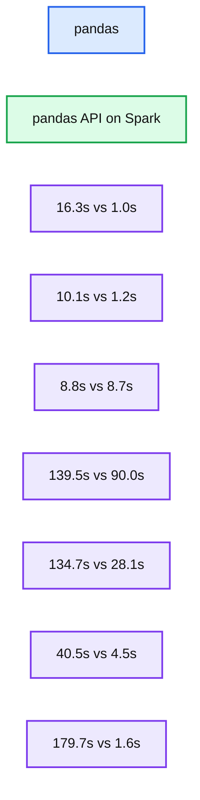
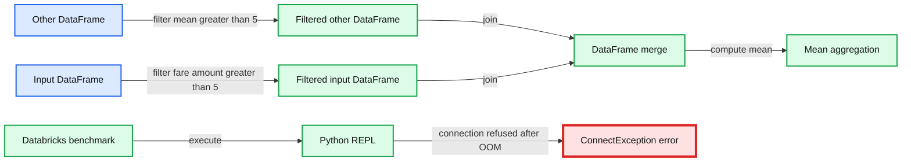
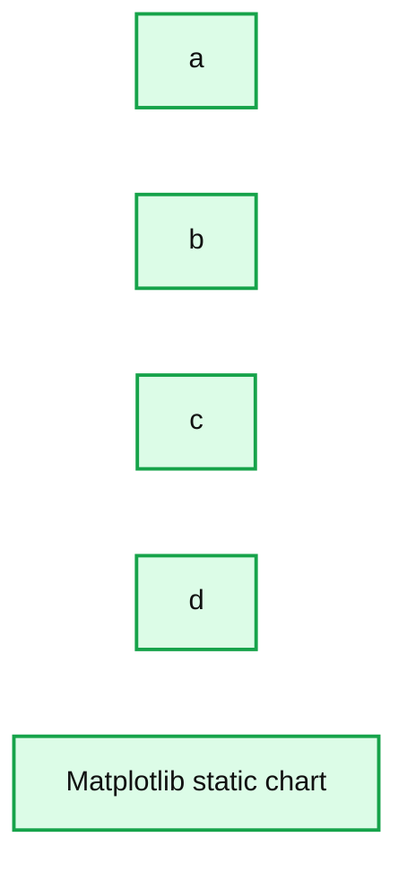
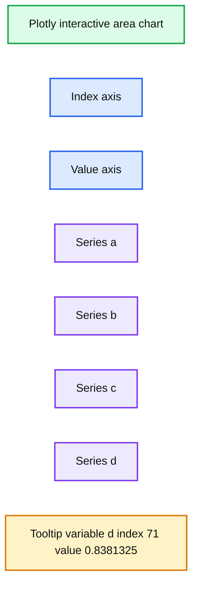

# Pandas API on Upcoming Apache Spark™ 3.2

- Source: https://www.databricks.com/blog/2021/10/04/pandas-api-on-upcoming-apache-spark-3-2.html
- Published: 2021-10-04
- Authors: Hyukjin Kwon, Xinrong Meng
- Categories: engineering, open-source, data-science-machine-learning
- Images: 8 total, 5 extracted as architecture

*Free Edition has replaced Community Edition, offering enhanced features at no cost. Start using *[*Free Edition *](https://login.databricks.com/?intent=SIGN_UP&amp;signup_experience_step=EXPRESS&amp;provider=DB_FREE_TIER&amp;dbx_source=www)*today.*
 

We're thrilled to announce that the pandas API will be part of the upcoming Apache Spark™ 3.2 release. [pandas](https://pandas.pydata.org/docs/) is a powerful, flexible library and has grown rapidly to become one of the standard data science libraries. Now pandas users will be able to leverage the pandas API on their existing Spark clusters.

A few years ago, we launched [Koalas](https://koalas.readthedocs.io/en/latest/), an open source project that implements the pandas DataFrame API on top of Spark, which became widely adopted among data scientists. Recently, Koalas was officially merged into PySpark by [SPIP: Support pandas API layer on PySpark](https://issues.apache.org/jira/browse/SPARK-34849) as part of [Project Zen](https://issues.apache.org/jira/browse/SPARK-32082) (see also [Project Zen: Making Data Science Easier in PySpark](https://www.databricks.com/session_na21/project-zen-making-data-science-easier-in-pyspark) from Data + AI Summit 2021).

pandas users will be able scale their workloads with one simple line change in the upcoming Spark 3.2 release:

This blog post summarizes pandas API support on Spark 3.2 and highlights the notable features, changes and roadmap.

## **Scalability beyond a single machine**

One of the known limitations in pandas is that it does not scale with your data volume linearly due to single-machine processing. For example, pandas fails with out-of-memory if it attempts to read a dataset that is larger than the memory available in a single machine:

pandas: reading a large CSV causes out-of-memory

pandas API on Spark overcomes the limitation, enabling users to work with large datasets by leveraging Spark:

pandas API on Spark: reading a large CSV

The pandas API on Spark also scales well to large clusters of nodes. The chart below shows its performance when analyzing a 15TB Parquet dataset with different-sized clusters. Each machine in the cluster has 8 vCPUs and 61 GiBs memory.

*pandas API on Spark scaling out*

**Summary:** Benchmark chart showing pandas API on Spark elapsed times across seven operations for clusters of 64, 128, and 256 nodes.

**Components:**

- Standard deviation benchmark using pandas API on Spark
- Mean of series addition benchmark using pandas API on Spark
- Mean of complex arithmetic benchmark using pandas API on Spark
- Value counts benchmark using pandas API on Spark
- Complex arithmetic benchmark using pandas API on Spark
- Groupby statistics benchmark using pandas API on Spark
- Join count benchmark using pandas API on Spark
- Cluster sizes of 64 nodes, 128 nodes, and 256 nodes
- Elapsed time measured in seconds

**Flows:**

- Benchmark operations -> Cluster sizes: execute benchmarks
- Cluster sizes -> Elapsed time: produce measured results

**Numbers:** 64 nodes, 128 nodes, 256 nodes, 19s, 13s, 10s, 252s, 171s, 117s, 437s, 213s, 110s, 50s, 30s, 19s, 323s, 164s, 87s, 388s, 223s, 137s, 83s, 48s, 29s, 0, 100, 200, 300, 400

source image: https://www.databricks.com/wp-content/uploads/2021/09/Pandas-API-on-Upcoming-Apache-Spark-3.2-blog-img-5.jpg

pandas API on Spark scaling out

Distributed execution of pandas API on Spark scales almost linearly in this test. The elapsed time decreases by half when the number of machines within a cluster doubles. The speedup compared to a single machine is also significant. For example, on the *Standard deviation* benchmark, a cluster of 256 machines can process ~250 times more data than a single machine in roughly the same time (each machine has 8 vCPUs and 61 GiBs memory):

 

|  | Single machine | Cluster of 256 machines |
|---|---|---|
| Parquet Dataset | 60GB | 60GB x 250 (15TB) |
| Elapsed time (sec) of Standard deviation | 12s | 10s |

## **Optimized single-machine performance**

The pandas API on Spark often outperforms pandas even on a single machine thanks to the optimizations in the Spark engine. The chart below demonstrates pandas API on Spark compared to pandas on a machine (with 96 vCPUs and 384 GiBs memory) against a 130GB CSV dataset:

*pandas vs. pandas API on Spark*

**Summary:** The benchmark chart compares pandas with pandas API on Spark across seven unlabeled operations.

**Components:**

- pandas
- pandas API on Spark
- Seven benchmark operation groups with unlabeled names

**Flows:**

- none

**Numbers:** 16.3s, 1.0s, 10.1s, 1.2s, 8.8s, 8.7s, 139.5s, 90.0s, 134.7s, 28.1s, 40.5s, 4.5s, 179.7s, 1.6s

source image: https://www.databricks.com/wp-content/uploads/2021/09/Pandas-API-on-Upcoming-Apache-Spark-3.2-blog-img-4.png

pandas vs. pandas API on Spark

Both multi-threading and Spark SQL [Catalyst Optimizer](https://www.databricks.com/glossary/catalyst-optimizer) contribute to the optimized performance. For example, *Join count* operation is ~4 times faster with the whole-stage code generation: 5.9s without code generation, 1.6s with code generation.

Spark has an especially significant advantage in chaining operations. The Catalyst query optimizer can recognize filters to skip data wisely and can apply disk-based joins, while pandas tend to load all data into memory per step.

Considering a query that joins two filtered frames and then computes the mean of the joined frame, pandas API on Spark succeeds within 4.5s, whereas pandas fails because of the OOM(Out of memory) error as below:

*pandas: chaining operation causes out-of-memory*

**Summary:** A pandas chained operation runs out of memory after filtering, merging, and computing a mean.

**Components:**

- pandas DataFrame operations
- Filtered other DataFrame
- Filtered input DataFrame
- DataFrame merge
- Mean aggregation
- Python REPL
- Databricks benchmark
- ConnectException error

**Flows:**

- Other DataFrame -> Filtered other DataFrame: filter fare amount mean greater than 5
- Input DataFrame -> Filtered input DataFrame: filter fare amount greater than 5
- Filtered input DataFrame -> DataFrame merge: merge with filtered other
- Filtered other DataFrame -> DataFrame merge: merge with filtered input
- DataFrame merge -> Mean aggregation: compute mean
- Databricks benchmark -> Python REPL: execute chained operation
- Python REPL -> ConnectException error: connection refused after out of memory

**Numbers:** 5, 5, 1.56 minutes, 8/12/2021, 12:06:05 PM

source image: https://www.databricks.com/wp-content/uploads/2021/09/Pandas-API-on-Upcoming-Apache-Spark-3.2-blog-img-6.jpg

pandas: chaining operation causes out-of-memory

## **Interactive data visualization**

pandas uses [matplotlib](https://matplotlib.org/) by default, which provides static plot charts. For example, the codes below generates a static chart:

**Summary:** A static matplotlib area chart displays four plotted data series labeled a, b, c, and d.

**Components:**

- a: plotted data series
- b: plotted data series
- c: plotted data series
- d: plotted data series
- Matplotlib: static chart rendering technology

**Flows:**

- none

**Numbers:** x-axis: 0, 20, 40, 60, 80, 100. y-axis: 0.0, 0.5, 1.0, 1.5, 2.0, 2.5, 3.0, 3.5.

source image: https://www.databricks.com/wp-content/uploads/2021/09/Pandas-API-on-Upcoming-Apache-Spark-3.2-blog-img-7.png

In contrast, the pandas API on Spark uses a [plotly](https://plotly.com/python/) backend by default, which provides interactive charts. For example, it allows users to interactively zoom in and out. Based on the type of plot, the pandas API on Spark automatically determines the best way to execute the computation internally when generating interactive charts:

**Summary:** Interactive Plotly chart showing four stacked area series across index values.

**Components:**

- Interactive Plotly chart backend
- X axis labeled index
- Y axis labeled value
- Series a
- Series b
- Series c
- Series d
- Hover tooltip showing variable d

**Flows:**

- none

**Numbers:** 0, 10, 20, 30, 40, 50, 60, 70, 80, 90, 0.5, 1, 1.5, 2, 2.5, 3, index 71, value 0.8381325

source image: https://www.databricks.com/wp-content/uploads/2021/09/Pandas-API-on-Upcoming-Apache-Spark-3.2-blog-img-8.jpg

## **Leveraging unified analytics functionality in Spark**

pandas is designed for Python data science with batch processing, whereas Spark is designed for unified analytics, including SQL, streaming processing and machine learning. To fill the gap between them, the pandas API on Spark provides many different ways for advanced users to leverage the Spark engine, for example:

- Users can directly query data via SQL with Spark's optimized SQL engine, as shown below:

- It also supports string interpolation syntax to interact with Python objects naturally:

- pandas API on Spark also supports streaming processing:

- Users can easily call the scalable machine learning libraries in Spark:

See also [the blog post](https://www.databricks.com/blog/2020/08/11/interoperability-between-koalas-and-apache-spark.html) about the interoperability between PySpark and pandas API on Spark.

## What's next?

For the next Spark releases, the roadmap focuses on:

**• More type hints**
The code in the pandas API on Spark is currently partially [typed](https://www.python.org/dev/peps/pep-0484/), which still enables static analysis and auto-completion. In the future, all of the code will be fully-typed.

**• Performance improvements**
There are several places in pandas API on Spark where we can improve performance further by more closely interacting with the engine and SQL optimizer.

**• Stabilization**
There are several places to fix especially related to missing values such as NaN and NA have the corner cases of behavior differences.

In addition, the pandas API on Spark will follow and match its behavior to the latest version of pandas in these cases.

**• More API coverage**
The pandas API on Spark reached 83% coverage of the pandas API, and this number continues to increase. Now the target is up to 90%.

Please [file an issue](https://issues.apache.org/jira/projects/SPARK) if there are bugs or missing features that you need, and of course, we always welcome contributions from the community.

## Getting started

Databricks Runtime 10.0

If you want to try out pandas API on Spark in Databricks Runtime 10.0 Beta (upcoming Apache Spark 3.2), sign up for[Databricks Community Edition or Databricks Trial for free](https://www.databricks.com/try-databricks) and get started in minutes.
