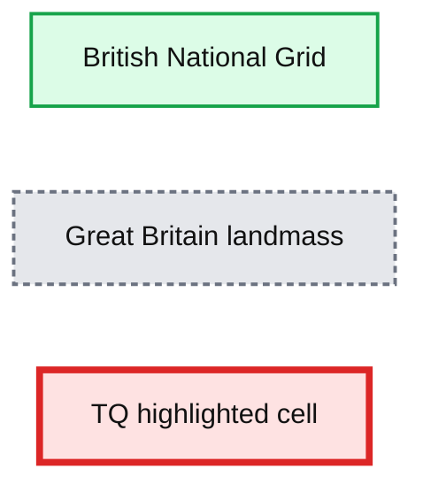
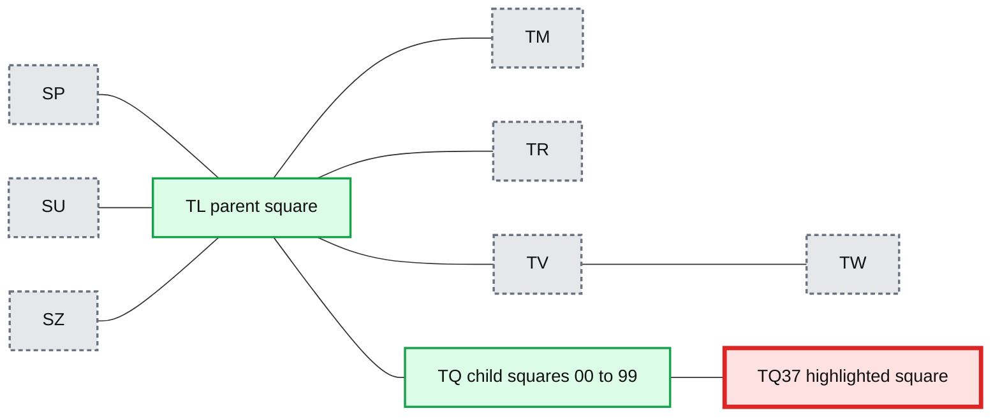
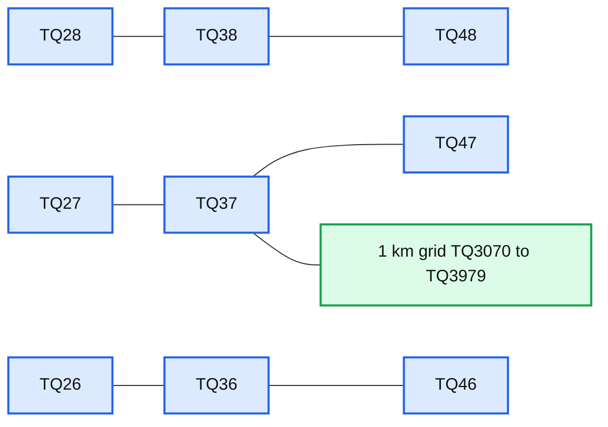
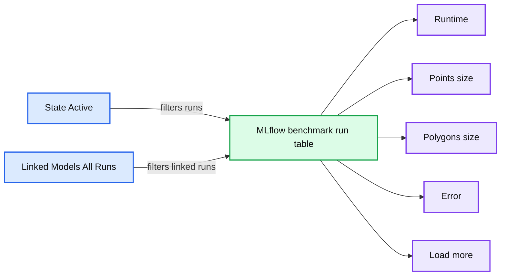
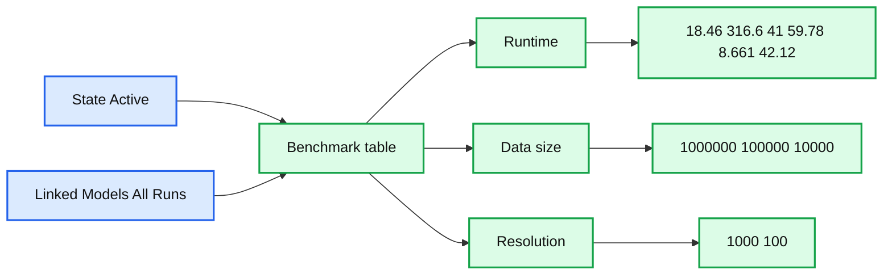
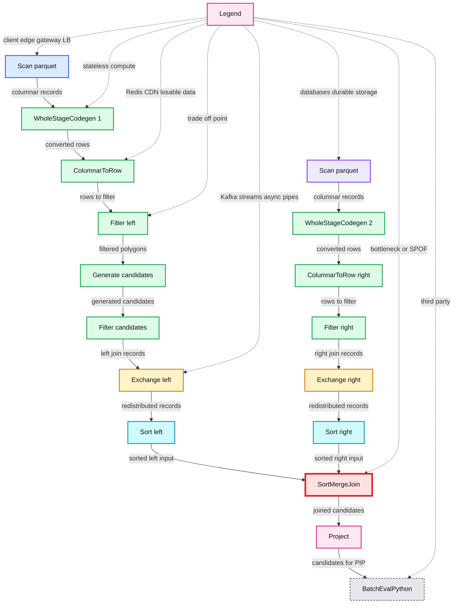
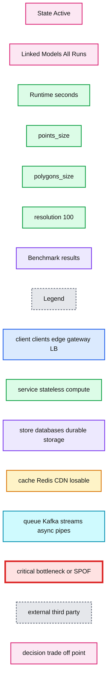
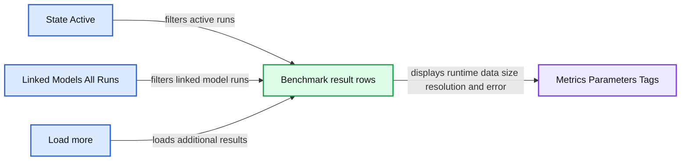
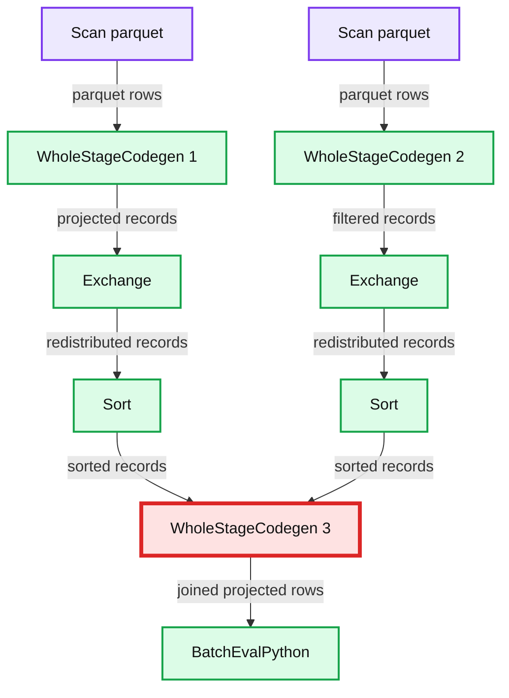

# Efficient Point in Polygon Joins via PySpark and BNG Geospatial Indexing

- Source: https://www.databricks.com/blog/2021/10/11/efficient-point-in-polygon-joins-via-pyspark-and-bng-geospatial-indexing.html
- Published: 2021-10-11
- Authors: Milos Colic, Robert Whiffin, Pritesh Patel, Charis Doidge, Steve Kingston, Linda Sheard
- Categories: engineering, open-source
- Images: 18 total, 13 extracted as architecture

This blog is outdated. Please refer to [this Spatial SQL blog](https://www.databricks.com/blog/introducing-spatial-sql-databricks-80-functions-high-performance-geospatial-analytics) for up-to-date approaches to storing and processing geospatial data within your Databricks Lakehouse.

 

This blog presents a collaboration between Ordnance Survey (OS), Databricks and Microsoft that explores spatial partitioning using the British National Grid (BNG).

OS is responsible for the design and development of a new [National Geographic Database](https://www.ordnancesurvey.co.uk/governance/public-task) (NGD) data delivery for Great Britain (GB) under the [Public Sector Geospatial Agreement](https://www.ordnancesurvey.co.uk/business-government/public-sector-geospatial-agreement).

OS has been working closely with Databricks and Microsoft on the architectural strategy and data engineering capabilities that underpin the NGD as part of a Core Data Services Platform. This platform enables OS to migrate geospatial data processing that has traditionally been carried out on on-prem machines in single-threaded processes and applications, such as FME to cloud compute, that are available and scalable on-demand — thus, achieving the processing and analysis of geospatial data at scale. OS is using Azure Databricks to add Apache Spark™ capability to the cloud platform, and this brings the opportunity to re-think how to optimize both data and approach to perform geospatial joins at scale using parallelized processing.

Indexing spatial data appropriately is one aspect of such optimization work, and it doesn’t just stop at selecting an index. The focus of this blog is on how we designed a process that makes maximal use of the index to allow the optimizers provided by Azure Databricks to tune the way that data is loaded from disk during scaled geospatial joins.

There are various grid indexes such as BNG, Geohash, Uber's H3, and Google's S2 that divide the spatial world into bins with identifiers. While some of these have been developed specifically in the context of modern geoanalytics, and therefore tend to be well supported with associated libraries and practical examples of use in that context, the British National Grid indexing system was defined in 1936 and is deeply embedded in the Great Britain geospatial data ecosystem, but not yet exploited and made accessible for geoanalytics at scale. Our secondary motivation here, therefore, was to show that it can be used directly for optimizing spatial joins, avoiding the need to convert Great Britain's geospatial datasets to other indexing systems first. Our team implemented a mosaic technique that decomposed polygons into simplified geometries bounded by their presence in a given BNG index. By effectively limiting index space comparisons and spatial predicate evaluations, the approach yielded notable query performance gains.

## The point-in-polygon: how hard can it be?

How hard is it to determine whether a point is inside a polygon (PIP)? The question of how to determine whether a point is contained within a polygon has already been answered years ago. This fact can introduce bias, making us jump to conclusions like, “it is easy; it has already been solved.” However, with the advancement of technology and the introduction of parallel systems, we have found ourselves asking this same question but in a new context. That context is using a PIP as a join relation over big (geospatial) data. The new problem is ensuring that we have high levels of parallelism in our approach. Unfortunately, the old answers no longer apply in this new context.

We can think of the join relationship as a pairing problem. We can observe it as having two datasets that contain rows that match with a set of rows from the other dataset while satisfying the join condition. The complexity of join relation is [O(n*m)](https://en.wikipedia.org/wiki/Big_O_notation) or what is commonly known as the Cartesian Product (complexity). This is the worst-case complexity for a join relation and, in simple terms, means that we need to compare each record from one dataset with each record of the other dataset to resolve all matches. Many systems implement techniques and heuristics to push this complexity to a lower level. However, this is the baseline, and we will start our considerations from this baseline.

In the context of OS’s geospatial data processing, one of the most common PIP joins routinely undertaken is between all address point geometries (approx. 37 million) and all large-scale building polygon geometries (approx. 46 million) in GB.

Diagram A

## The (not so) hidden cost?

While discussing join relation complexity, we have made an oversight. The traditional complexity assumes a fixed cost for each pair resolution, that is, the cost of arriving at a conclusion of match or no match for each pair of records during the join operation, which we will call O(join). The true cost of the join is O(n*m)*O(join). In the traditional equivalence relationship class, where we are just looking whether a join key on the left matches a join key on the right, we assume O(join) is O(1) or to put it simply, the cost of comparison is one arithmetic operation, and it is constant. This is not always the case; for example, joining on a string comparison is more expensive than an equivalence between two integers.

But what of PIP, how costly is it relatively? The most widely used algorithm to answer PIP is the [ray-tracing method](https://en.wikipedia.org/wiki/Point_in_polygon). The complexity of this algorithm is O(v), where v is the number of vertices of the polygon in question. The algorithm is applicable to both convex and non-convex shapes, and it maintains the same complexity in both cases.

Adding the comparison cost to our cost model brings our total complexity to cubic form. If we replace O(join) with O(v), where v is the average number of vertices, we have the total complexity of O(n*m)*O(v). And this is both expensive and time-consuming!

## Work smarter, not harder!

We can do better than O(n*m)*O(v). We can use Spark to help us beat the Cartesian Product complexity. Spark leverages hash joins under the hood. Depending on the join predicate, Spark can execute one of the following [join strategies](https://www.databricks.com/session/optimizing-apache-spark-sql-joins):

- broadcast [hash join](https://en.wikipedia.org/wiki/Hash_join) with complexity of O(max(n,m))*O(join)
- [shuffle hash join](https://en.wikipedia.org/wiki/Hash_join) (similar to Grace Hash Join) with complexity of O(n+m)*O(join)
- [shuffle sort-merge join](https://en.wikipedia.org/wiki/Sort-merge_join) with complexity of O(n*log(n)+m*log(m))*O(join)
- broadcast [nested loop join](https://en.wikipedia.org/wiki/Nested_loop_join) (Cartesian join) with complexity O(n*m)*O(join)

Amazing! We can just use Spark, and we will avoid the most costly outcome, can’t we? No! Unfortunately, Spark will default to Cartesian join for PIP joins. Why? Where PIP differs from traditional equi-based joins is that it is based on a general relation. These joins are commonly known as a [Theta Join](https://www.w3computing.com/sqlserver2012/theta-join-self-join-semi-join/) class. These are usually much harder to execute and require the end-user to help the system. While we are starting from a disadvantageous position, we can still achieve the desired performance.

## Spatial indices (PIP as a pseudo-equivalence)

Is there a way to make PIP an equivalence relationship? Strictly speaking no, however, in practice, we can make PIP approach the efficiency of an equivalence relation if we employ spatial indexing techniques.

Spatial indices help us index coordinate space in an efficient way by logically grouping geometries that are close to one another in said space. We achieve this by uniquely associating a point in the coordinate system to an index ID. These systems allow us to represent reference space at different levels of detail, or simply, a different resolution. In addition, geospatial index systems are hierarchical systems; this means that there is a well-defined parent-child relationship between indices on different levels of representation.

How does this help us? If we assign to each geometry an index to which it belongs, we can use index ID to index ID equivalence as an equivalence relation proxy. We will perform PIP (or any other geometry-based relation) only on geometries that belong to the same indices.

It is important to note that while POINT geometries belong to one and only one index, all other geometry types, including LINESTRINGs and POLYGONs, may span over a set of indices. This implies that the cost of resolving a PIP relation via index space is O(k)*O(v), where k is the number of indices used to represent the geometry and v is the number of vertices of such geometry. This indicates that we are increasing the price of each comparison by exploding records of complex geometries into multiple index records carrying the same geometry.

Why is this a wise choice? While we are increasing the price of comparing a single pair of geometries, we are avoiding a full Cartesian Product, our archnemesis in large-scale geospatial joins. As we will show in more detail later, index ID to index ID join will allow us to skip large amounts of unnecessary comparisons.

Lastly, data sources that contain complex geometries do not evolve as fast as do point-wise data sources. Complex geometries usually represent regions, areas of interest, buildings, etc., and these concepts have a fairly stable timeline, objects that change over time change rarely, and objects that change are relatively few. This means that while we do spend extra time to preprocess complex geometries, for the majority of them, this preprocessing is a one-off event. This approach is still applicable even for frequently updated data; the amount of data we can skip when joining via index ID to index ID relationship outweighs the increased number of rows used to represent a single geometry.

## The BNG Index System

The BNG is a local coordinate reference (CRS) system ([EPSG:27700](https://epsg.io/27700)) established in 1936 and designed for national mapping that covers Great Britain. Unlike global CRS', BNG has been fitted and shaped to the landmass of Great Britain, projecting coordinates onto a flat, regular square grid with an origin (0, 0) to the southwest of the [Isles of Scilly](https://en.wikipedia.org/wiki/Isles_of_Scilly).

Within the grid bounds, geographic grid references (or indices) are used to identify grid squares at different resolutions expressed in meters which can be translated from and to BNG easting (x) and northing (y) coordinates. Given the location of the grid origin, easting and northing values are always positive. BNG serves as the primary reference system for all OS location data captured under their national mapping public task and, therefore, has been widely adopted by public and private users of OS data operating within Great Britain.

Each grid square can be represented as a polygon geometry where the length of each side is equal to the resolution of the grid reference. This makes BNG a much easier starting point for geospatial data partitioning strategies. We are starting with a square as a building block, and it will make a lot of the starting considerations simple while not losing on the generalization of the approach.

By convention, BNG grid references are expressed as strings, using the letters and coordinates of the southwest corner of a given grid square quoted to a particular resolution. The first two characters of any reference are letters (prefixes) (e.g., TQ) identifying one of the 91 grid squares measuring 100.000m (100km) across. Only 55 of the 91 100km grid squares cover some landmass within Great Britain. The remainder of these squares falls into British waters.

*Diagram B*

**Summary:** British National Grid cells are shown at 100km resolution over Great Britain, with the TQ cell highlighted.

**Components:**

- British National Grid: regular grid of labeled cells
- Great Britain landmass: geographic area overlaid on the grid
- TQ cell: highlighted grid square

**Flows:**

- none

**Numbers:** none



<sub>source image: https://www.databricks.com/wp-content/uploads/2021/10/Geospatial-Indexing-with-British-National-Grid-in-Pyspark-blog-img-2.png</sub>

Diagram B

References identifying more granular grid resolutions below 100km will have additional x and y integer values appended after the two letters locating a child grid square are within the parent grid square hierarchy. Child squares are numbered from 0 to 9 from the lower-left (southwest) corner, in an easterly (x) and northerly (y) direction.

*Diagram B*

**Summary:** British National Grid cells are shown at 100km resolution over Great Britain, with the TQ cell highlighted.

**Components:**

- British National Grid: regular grid of labeled cells
- Great Britain landmass: geographic area overlaid on the grid
- TQ cell: highlighted grid square

**Flows:**

- none

**Numbers:** none


<sub>source image: https://www.databricks.com/wp-content/uploads/2021/10/Geospatial-Indexing-with-British-National-Grid-in-Pyspark-blog-img-2.png</sub>

Diagram B

*Diagram C*

**Summary:** British National Grid hierarchy showing 10 km child squares within the 100 km TL parent square.

**Components:**

- TL parent grid square
- TQ child grid squares numbered by eastward and northward position
- Adjacent parent squares SP, TM, SU, TR, SZ, TV, TW

**Flows:**

- none

**Numbers:** 10 km, 1 km, 0, 1, 2, 3, 4, 5, 6, 7, 8, 9. Visible child labels: TQ00, TQ01, TQ02, TQ03, TQ04, TQ05, TQ06, TQ07, TQ08, TQ09, TQ10, TQ11, TQ12, TQ13, TQ14, TQ15, TQ16, TQ17, TQ18, TQ19, TQ20, TQ21, TQ22, TQ23, TQ24, TQ25, TQ26, TQ27, TQ28, TQ29, TQ30, TQ31, TQ32, TQ33, TQ34, TQ35, TQ36, TQ37, TQ38, TQ39, TQ40, TQ41, TQ42, TQ43, TQ44, TQ45, TQ46, TQ47, TQ48, TQ49, TQ50, TQ51, TQ52, TQ53, TQ54, TQ55, TQ56, TQ57, TQ58, TQ59, TQ60, TQ61, TQ62, TQ63, TQ64, TQ65, TQ66, TQ67, TQ68, TQ69, TQ70, TQ71, TQ72, TQ73, TQ74, TQ75, TQ76, TQ77, TQ78, TQ79, TQ80, TQ81, TQ82, TQ83, TQ84, TQ85, TQ86, TQ87, TQ88, TQ89, TQ90, TQ91, TQ92, TQ93, TQ94, TQ95, TQ96, TQ97, TQ98, TQ99.



<sub>source image: https://www.databricks.com/wp-content/uploads/2021/10/Geospatial-Indexing-with-British-National-Grid-in-Pyspark-blog-img-3.jpg</sub>

Diagram C

*Diagram D*

**Summary:** British National Grid diagram showing a 100 km grid subdivided into 10 km and 1 km squares, with hierarchical alphanumeric labels.

**Components:**

- Outer grid squares labeled TQ26, TQ27, TQ28, TQ36, TQ38, TQ46, TQ47, and TQ48.
- Central 10 km grid labeled TQ37.
- Inner 1 km grid squares labeled TQ3070 through TQ3979, arranged in ten columns and ten rows.

**Flows:**

- none

**Numbers:** 26, 27, 28, 36, 37, 38, 46, 47, 48, 3070, 3071, 3072, 3073, 3074, 3075, 3076, 3077, 3078, 3079, 3170, 3171, 3172, 3173, 3174, 3175, 3176, 3177, 3178, 3179, 3270, 3271, 3272, 3273, 3274, 3275, 3276, 3277, 3278, 3279, 3370, 3371, 3372, 3373, 3374, 3375, 3376, 3377, 3378, 3379, 3470, 3471, 3472, 3473, 3474, 3475, 3476, 3477, 3478, 3479, 3570, 3571, 3572, 3573, 3574, 3575, 3576, 3577, 3578, 3579, 3670, 3671, 3672, 3673, 3674, 3675, 3676, 3677, 3678, 3679, 3770, 3771, 3772, 3773, 3774, 3775, 3776, 3777, 3778, 3779, 3870, 3871, 3872, 3873, 3874, 3875, 3876, 3877, 3878, 3879, 3970, 3971, 3972, 3973, 3974, 3975, 3976, 3977, 3978, 3979, 10 km, 1 km



<sub>source image: https://www.databricks.com/wp-content/uploads/2021/10/Geospatial-Indexing-with-British-National-Grid-in-Pyspark-blog-img-4.jpg</sub>

Diagram D

## Why BNG?

Whilst there are alternative global index systems that we could have adopted for this work, we chose to use BNG because:

- The BNG system is native to OS’s geospatial data collection, with almost all OS data referenced against the BNG CRS ([EPSG:27700](https://epsg.io/27700)). This includes OS aerial imagery tiles and other raster datasets, such as Digital Terrain Models (DTMs) and Digital Surface Models (DSMs).
- The use of BNG enables the efficient retrieval and colocation of vector and raster data for analysis, including the clipping or masking of raster data for deriving training patches for deep learning applications, as an example.
- Using BNG avoids the costly transformation to the World Geodetic System 1984 (WGS-84) ([EPSG:4326](https://epsg.io/4326)) or European Terrestrial Reference System 1989 (ETRS89) ([EPSG:4258](https://epsg.io/4258)) CRSs via the [OSTN15](https://www.ordnancesurvey.co.uk/documents/resources/updated-transformations-uk-ireland-geoid-model.pdf) transformation grid. Different CRSs realize their model of the Earth using different parameters, and a global system (e.g., WGS84) will show an offset when compared to a local system (e.g., BNG). The true cost of this conversion is reflected in the fact that OS published OSTN15, a 15MB corrections file containing approx. 1.75 million parameters to transform accurately between satellite-derived coordinates and BNG coordinates.

Due to the GB-local nature of the problems OS is trying to solve, BNG is a natural choice. In the case of a more global context, we should switch our focus on H3 or [S2](https://s2geometry.io/) as more suitable global alternatives.

## BNG as a Spatial Partitioning Strategy

A spatial partitioning strategy defines an approach to segmenting geospatial data into non-overlapping regions. BNG grid squares at different resolutions provide the non-overlapping regions across Great Britain in this context. By retrieving the BNG indices, which cover geometries we can use the indices attribute as a join key to collocate rows and then only test a spatial predicate within those collocated rows (e.g., does geometry A intersect geometry B or does geometry A contain geometry B).

This is very important! Splitting the original data into geospatially collocated portions of data makes our problem “embarrassingly parallel,” and, therefore, very suitable for Spark/PySpark. We can send different chunks of data to different machines and only compare local portions of the data that are likely to join one to another. There is little point in checking if a building in London contains an address in Manchester. Geospatial indices are our way to convey this intuition to the machine.

## The baseline

We used Python and PySpark to bring our solution to life. OS provided the logic for converting the pair of coordinates provided as eastings and northings to a unique BNG index ID. Lastly, to ensure an unbiased output, we used a randomized dataset of points and a randomized dataset of polygons; 10 million points were scattered all over the territory of GB, 1 million polygons were scattered in the same manner. To generate such a set of polygonal data, we have loaded a GeoJSON set into a Spark dataframe, we have used a random function in conjunction with a generator function (*explode*) to generate an unbiased dataset. Due to randomness introduced in the data, one should expect that the relationship between points and polygons is many-to-many.

The baseline algorithm we used for our considerations is the naive join that would result in the unoptimized theta join. This approach will, at the execution time, be evaluated as a Broadcasted Nested Loop Join.

*Diagram E*

**Summary:** The diagram shows a naive point-to-polygon join executed through Spark’s broadcast nested loop join, requiring approximately one billion comparisons.

**Components:**

- Scan parquet: Apache Spark parquet scan
- WholeStageCodegen 1: Apache Spark whole-stage code generation
- ColumnarToRow: Apache Spark columnar-to-row conversion
- BroadcastExchange: Apache Spark broadcast exchange
- WholeStageCodegen 2: Apache Spark whole-stage code generation
- BroadcastNestedLoopJoin: Apache Spark broadcast nested loop join

**Flows:**

- Scan parquet -> WholeStageCodegen 1: parquet data
- WholeStageCodegen 1 -> ColumnarToRow: columnar rows
- ColumnarToRow -> BroadcastExchange: rows for broadcast
- Scan parquet -> WholeStageCodegen 2: parquet data
- ColumnarToRow -> BroadcastNestedLoopJoin: point or polygon rows
- BroadcastExchange -> BroadcastNestedLoopJoin: broadcast rows

**Numbers:**

- WholeStageCodegen 1: 1
- WholeStageCodegen 1 duration: 4.8 m
- WholeStageCodegen 1 timings: 102 ms, 151 ms, 5.9 s
- WholeStageCodegen 2: 2
- WholeStageCodegen 2 duration: 99.16 h
- WholeStageCodegen 2 timings: 5.6 m, 18.3 m, 40.6 m
- ColumnarToRow input batches: 320
- ColumnarToRow rows output: 10,030
- BroadcastExchange time to broadcast: 47 ms, 47 ms, 47 ms, 47 ms
- BroadcastExchange time to build: 18 ms, 18 ms, 18 ms, 18 ms
- BroadcastExchange time to collect: 6.8 s, 6.8 s, 6.8 s, 6.8 s
- BroadcastExchange data size: 2.3 MB, 2.3 MB, 2.3 MB, 2.3 MB
- BroadcastExchange rows output: 99,895
- BroadcastNestedLoopJoin rows output: 1,001,946,850

```text
%% mermaid failed to render; kept as text
%% Shows the Spark execution flow for a naive point to polygon join
flowchart LR
    SP1[Scan parquet] -->|parquet data| WS1[WholeStageCodegen 1]
    WS1 -->|columnar rows| C2R1[ColumnarToRow]
    C2R1 -->|rows for broadcast| BE[BroadcastExchange]
    SP2[Scan parquet] -->|parquet data| WS2[WholeStageCodegen 2]
    WS2 -->|columnar rows| C2R2[ColumnarToRow]
    C2R2 -->|point or polygon rows| BNJ[BroadcastNestedLoopJoin]
    BE -->|broadcast rows| BNJ

    classDef client fill:#dbeafe,stroke:#2563eb,stroke-width:2px,color:#111
    classDef service fill:#dcfce7,stroke:#16a34a,stroke-width:2px,color:#111
    classDef store fill:#ede9fe,stroke:#7c3aed,stroke-width:2px,color:#111
    classDef cache fill:#fef3c7,stroke:#d97706,stroke-width:2px,color:#111
    classDef queue fill:#cffafe,stroke:#0891b2,stroke-width:2px,color:#111
    classDef critical fill:#fee2e2,stroke:#dc2626,stroke-width:4px,color:#111
    classDef external fill:#e5e7eb,stroke:#6b7280,stroke-width:2px,color:#111,stroke-dasharray:4 3
    classDef decision fill:#fce7f3,stroke:#db2777,stroke-width:2px,color:#111
    client = clients edge gateway LB
    service = stateless compute
    store = databases durable storage
    cache = Redis CDN or anything losable
    queue = Kafka streams or async pipes
    critical = bottleneck or SPOF
    external = third party
    decision = trade off point

    class SP1,SP2 store
    class WS1,WS2,C2R1,C2R2 service
    class BE cache
    class BNJ critical
```

<sub>source image: https://www.databricks.com/wp-content/uploads/2021/10/Geospatial-Indexing-with-British-National-Grid-in-Pyspark-blog-img-5.jpg</sub>

Diagram E

The broadcast nested loop join runs very slowly. And the reason for this is the fact it is evaluated similarly to a Cartesian join. Each of the point-polygon pairs is evaluated against a PIP relation before the join is resolved. The outcome is that we require one billion comparisons for 100 thousand points to be joined to 10 thousand polygons. Note that neither of these datasets is large enough to be called big data.

*Diagram F*

**Summary:** MLflow displays naive point in polygon join benchmark runs, including runtimes, dataset sizes, and a failed Spark run.

**Components:**

- State filter showing Active
- Linked Models filter showing All Runs
- Metrics columns showing runtime, points size, and polygons size
- Tags column showing error
- MLflow benchmark run table
- Load more control

**Flows:**

- State filter -> Benchmark run table: filters active runs
- Linked Models filter -> Benchmark run table: filters linked model runs

**Numbers:** 17808, -1, 100000, 1506.2, 10000, 735.4, 101.4



<sub>source image: https://www.databricks.com/wp-content/uploads/2021/10/Geospatial-Indexing-with-British-National-Grid-in-Pyspark-blog-img-6.jpg</sub>

Diagram F

We used MLflow to conduct a series of naive joins to evaluate the baseline performance we are trying to outperform. For the naive approach, the largest join we were able to successfully execute was 10 thousand points to 100 thousand polygons. Any further increase in data volume resulted in our Spark jobs failing without producing the desired outputs. These failures were caused by the unoptimized nature of the workloads we were trying to run.

## Let’s frame our problem 

What if we represented all of our geometries, no matter their shape, with a corresponding BNG-aligned bounding box? A bounding box is a rectangular polygon that can fit the entirety of the original geometry within. And what if we represented said bounding box as a set of BNG indices at a given resolution that together covers the same area.

Diagram G

Now we can execute our joins via a more optimized theta join. We will only check whether a point is inside the polygon via PIP relation if a point falls into one of the BNG indices that are used to represent the polygon. This reduces our join effort by multiple orders of magnitude.

In order to produce the said set of BNG indices, we have used the following code; note that the bng_to_geom, coords_to_bng and bng_get_resolution functions are not provided with this blog.

This code ensures that we can represent any shape in a lossless manner. We are using intersects relation between a BNG index candidate and the original geometry to avoid blindspots in representation. Note that a more efficient implementation is possible by using contains relation and a centroid point; that approach is only viable if false positives and false negatives are acceptable. We assume the existence of the *bng_to_geom* function that given a BNG index ID can produce a geometry representation, the *bng_get_resolution* function that given a BNG index ID determines the selected resolution and *coords_to_bng* function that given the coordinates returns a BNG index ID.

*Diagram H*

**Summary:** Benchmark table showing runtime results for different data sizes and BNG resolutions.

**Components:**

- State filter set to Active
- Linked Models filter set to All Runs
- Metrics column showing runtime
- Parameters columns showing data_size and resolution
- Run selection checkboxes
- Benchmark result rows

**Flows:**

- none

**Numbers:** 18.46, 1000000, 1000, 316.6, 100, 41, 100000, 59.78, 8.661, 10000, 42.12



<sub>source image: https://www.databricks.com/wp-content/uploads/2021/10/Geospatial-Indexing-with-British-National-Grid-in-Pyspark-blog-img-8.png</sub>

Diagram H

We have run our polygon bounding box representation for different resolutions of the BNG index system and for different dataset sizes. Note that running this process was failing consistently for resolutions below 100. Resolutions are represented in meters in these outputs. The reason for consistent failures at resolutions below 100m can be found in over-representation; some polygons (due to random nature) are much larger than others, and while some polygons would be represented by a set of a dozen indices, other polygons can be represented by thousands of indices, and this can result in a big disparity in compute and memory requirements between partitions in a Spark job that is generating this data.

We have omitted the benchmarks for points dataset transformations since this is a relatively simple operation that does not yield any new rows; only a single column is added, and the different resolutions do not affect execution times.

With both sides of the join being represented with their corresponding BNG representations, all we have to do is to execute the adjusted join logic:

These modifications in our code have resulted in a different Spark execution plan. Spark is now able to first run a sort merge join based on the BNG index ID and vastly reduce the total number of comparisons. In addition, each pair comparison is a string-to-string comparison which is much shorter than a PIP relationship. This first stage will generate all the join set candidates. We will then perform a PIP relationship test on this set of candidates to resolve the final output. This approach ensures that we limit the number of times we have to run the PIP operation.

*Diagram I*

**Summary:** Spark execution plan for a bounding-box point-to-polygon join using code generation, filtering, sorting, and a SortMergeJoin before final PIP evaluation.

**Components:**

- Scan parquet: reads point and polygon data from Parquet files.
- WholeStageCodegen 1: combines columnar processing, filtering, and candidate generation.
- ColumnarToRow: converts columnar data into rows.
- Filter: reduces records to 991,329 rows on the left branch.
- Generate: creates join candidates.
- WholeStageCodegen 2: processes the second input branch.
- Filter: reduces records to 9,801,097 rows on the right branch.
- Exchange: redistributes data for joining.
- Sort: orders both inputs by join keys.
- WholeStageCodegen 3: executes the join stage.
- SortMergeJoin: produces 185,785,140 candidate matches.
- Project: selects output fields.
- BatchEvalPython: performs final point-in-polygon evaluation.

**Flows:**

- Scan parquet -> WholeStageCodegen 1: columnar records
- WholeStageCodegen 1 -> ColumnarToRow: converted rows
- ColumnarToRow -> Filter: rows to be filtered
- Filter -> Generate: filtered polygon records
- Generate -> Filter: generated candidates
- Filter -> Exchange: left-side join records
- Exchange -> Sort: redistributed records
- Sort -> WholeStageCodegen 3: sorted left input
- Scan parquet -> WholeStageCodegen 2: columnar records
- WholeStageCodegen 2 -> ColumnarToRow: converted rows
- ColumnarToRow -> Filter: rows to be filtered
- Filter -> Exchange: right-side join records
- Exchange -> Sort: redistributed records
- Sort -> WholeStageCodegen 3: sorted right input
- WholeStageCodegen 3 -> SortMergeJoin: coordinated join execution
- SortMergeJoin -> Project: joined candidate rows
- Project -> BatchEvalPython: projected candidates for PIP evaluation

**Numbers:** 1; 50.89 h; 7.3 m; 9.3 m; 12.9 m; 991,329; 2; 48.0 s; 116 ms; 139 ms; 498 ms; 9,801,097; 3; 116.96 h; 17.1 m; 35.9 m; 39.7 m; 185,785,140



<sub>source image: https://www.databricks.com/wp-content/uploads/2021/10/Geospatial-Indexing-with-British-National-Grid-in-Pyspark-blog-img-9.jpg</sub>

Diagram I

From the execution plan, we can see that Spark is performing a very different set of operations in comparison to the naive approach. Most notably, Spark is now executing Sort Merge Join instead of Broadcast Nested Loop Join, which is bringing a lot of efficiencies. We are now performing about 186 million PIP operations instead of a billion. This alone is allowing us to run much larger joins with better response time whilst avoiding any breaking failures that we have experienced in the naive approach.

*Diagram J*

**Summary:** Benchmark table showing point-to-polygon join runtimes for different point and polygon dataset sizes at resolution 100.

**Components:**

- State filter set to Active
- Linked Models filter set to All Runs
- Metrics column showing runtime
- Parameters columns showing points_size, polygons_size, and resolution
- Benchmark result rows

**Flows:**

- none visible

**Numbers:**

- Runtime values: 2548.7, 2023.9, 202.7, 134.6, 8.518, 7.344, 5.895, 5.063, 4.933, 3.367, 1.429, 1.393
- Point sizes: 10000000, 1000000, 100000, 10000
- Polygon sizes: 1000000, 100000, 10000
- Resolution: 100 for every row



<sub>source image: https://www.databricks.com/wp-content/uploads/2021/10/Geospatial-Indexing-with-British-National-Grid-in-Pyspark-blog-img-10.jpg</sub>

Diagram J

This simple yet effective optimization has enabled us to run a PIP join between 10 million points and 1 million polygons in about 2500 seconds. If we compare that to the baseline execution times, the largest join we were able to successfully execute was 10 thousand points to 100 thousand polygons, and even that join required about 1500 seconds on the same hardware.

## Divide and conquer

Being able to run joins between datasets in the million rows domain is great; however, our largest benchmark join took almost 45 minutes (2500 seconds). And in the world where we want to run ad hoc analytics over large volumes of geospatial data, these execution times are simply too slow.

We need to further optimize our approach. The first candidate for optimization is our bounding box representation. If we are representing polygons via bounding boxes, we include too many false positive indices, i.e., indices that do not overlap at all with the original geometry.

Diagram K

The way to optimize that portion of the code is to simply use intersects function call in our polyfill method on the original geometry.

This optimization, while increasing the cost by utilizing *intersects* call, will result in smaller resulting index sets and will make our joins run faster due to the smaller join surface

Diagram L

The second optimization we can employ is splitting the representation into two sets of indices. Not all indices are equal in our representation. Indices that touch the border of the polygon require a PIP filtering after an index to index join. Indices that do not touch the border and belong to the representation of the polygon do not require any additional filtering. Any point that falls into such an index definitely belongs to the polygon and, in such cases, we can skip the PIP operation.

*Diagram M*

**Summary:** Shows a polygon overlaid with a BNG grid, highlighting indices fully contained within the geometry.

**Components:**

- Original geometry
- BNG grid indices
- Contained BNG indices

**Flows:**

- none

**Numbers:** none


<sub>source image: https://www.databricks.com/wp-content/uploads/2021/10/Geospatial-Indexing-with-British-National-Grid-in-Pyspark-blog-img-13-e1633540471463.png</sub>

Diagram M

The third and final optimization we can implement is the mosaic approach. Instead of associating the complete original geometry with each index that belongs to the set of indices that touch the polygon border (border set), we can only keep track of the section of interest. If we intersect the geometry that represents the index in question and the polygon, we get the local representation of the polygon; only that portion of the original polygon is relevant over the area of the index in question. We refer to these pieces as polygon chips.

Diagram N

Polygon chips serve two purposes from the optimization perspective. Firstly, they vastly improve the efficiency of the PIP filter that occurs after the index-to-index join is executed. This is due to the fact that the ray tracing algorithm runs in O(v) complexity and individual chips on average have an order of magnitude fewer vertices than the original geometry. Secondly, the representation of chips is much smaller than the original geometry, as a result of this, we are shuffling much less data as part of the shuffle stage in our sort merge join stage.

Putting all of these together yields the following code:

This code is very similar to the original bounding box methods, and we have only done a few minor changes to make sure we are not duplicating some portions of the code; hence, we have isolated the *add_children* helper method.

*Diagram O*

**Summary:** Databricks benchmark table showing runtime results for polygon representations across data sizes and resolutions.

**Components:**

- State filter using Active
- Linked Models filter using All Runs
- Metrics columns showing runtime
- Parameters columns showing data_size and resolution
- Tags column showing error
- Benchmark result rows
- Load more control

**Flows:**

- State filter -> Benchmark result rows: filters active runs
- Linked Models filter -> Benchmark result rows: filters linked model runs
- Load more control -> Benchmark result rows: loads additional results

**Numbers:** 42.25, 1000000, 1000, 600.2, 100, -1, 10, 8.771, 100000, 75.66, 16661.6, 25.99, 10000, 15.56, 2579.8



<sub>source image: https://www.databricks.com/wp-content/uploads/2021/10/Geospatial-Indexing-with-British-National-Grid-in-Pyspark-blog-img-15.jpg</sub>

Diagram O

We have performed the same data generation benchmarking as we have done for our bounding box polygon representation. One thing we found in common with the original approach is that resolutions below 100m were causing over-representation of the polygons. In this case, we were, however, able to generate data up to 100 thousand polygons on a resolution of 10m, granted the runtime of such data generation process was too slow to be considered for production workloads.

At the resolution of 100m, we have got some very promising results; it took about 600 seconds to generate and write out the dataset of 1 million polygons. For reference, it took about 300 seconds to do the same for the bounding box approach. Bounding box was a simpler procedure, and we are adding some processing time in the data preparation stage. Can we justify this investment?

## Mosaics are pretty (fast!)

We have run the same benchmark for PIP joins using our mosaic data. We have adapted our join logic slightly in order to make sure our border set and core set of indices are both utilized correctly and in the most efficient way.

*is_dirty *column is introduced by our polyfill method. Any index that touches the border of the original geometry will be marked as dirty (i.e., *is_dirty=True*). These indices will require post-filtering in order to correctly determine if any point that falls into said index is contained within the comparing geometry. It is crucial that *is_dirty *filtering happens first before the *pip_fiter *call because the logical operators in Spark have a short-circuiting capability; if the first part of the logical expression is true, the second part won't execute.

*Diagram P*

**Summary:** Spark execution plan for a point to polygon Mosaic join, showing parquet scans, filtering, repartitioning, sorting, a sort merge join, and Python evaluation.

**Components:**

- Scan parquet: Apache Spark parquet reader.
- WholeStageCodegen 1: Spark whole-stage code generation with ColumnarToRow, filters, generation, and projection.
- Scan parquet: Apache Spark parquet reader.
- WholeStageCodegen 2: Spark whole-stage code generation with ColumnarToRow and filtering.
- Exchange: Spark data redistribution.
- Sort: Spark sorting.
- WholeStageCodegen 3: Spark whole-stage code generation with SortMergeJoin and projection.
- SortMergeJoin: Spark sort merge join.
- BatchEvalPython: Spark Python batch evaluation.

**Flows:**

- Scan parquet -> WholeStageCodegen 1: parquet rows.
- WholeStageCodegen 1 -> Exchange: projected records.
- Scan parquet -> WholeStageCodegen 2: parquet rows.
- WholeStageCodegen 2 -> Exchange: filtered records.
- Exchange -> Sort: redistributed records.
- Sort -> WholeStageCodegen 3: sorted records.
- Sort -> WholeStageCodegen 3: sorted records.
- WholeStageCodegen 3 -> BatchEvalPython: joined projected rows.

**Numbers:**

- WholeStageCodegen 1
- 24.5 m
- 2.9 s
- 4.4 s
- 6.7 s
- 977,560 rows output
- WholeStageCodegen 2
- 43.9 s
- 48 ms
- 58 ms
- 2.6 s
- 980,403 rows output
- WholeStageCodegen 3
- 14.2 m
- 2.0 s
- 4.2 s
- 6.4 s
- 10,305,985 rows output



<sub>source image: https://www.databricks.com/wp-content/uploads/2021/10/Geospatial-Indexing-with-British-National-Grid-in-Pyspark-blog-img-16.jpg</sub>

Diagram P

This code will yield a much more efficient execution plan in Spark. Due to better representation in the index space, our join surfaces are much smaller. In addition, our post-filters benefit from 2 set representation and mosaic splitting of the geometries.

*Diagram Q*

**Summary:** Benchmark table showing point-to-polygon join runtimes sorted from highest to lowest, with point and polygon dataset sizes.

**Components:**

- State filter: Active
- Linked Models filter: All Runs
- Metrics column: runtime
- Parameters column: points_size
- Parameters column: polygons_size
- Benchmark rows with selectable checkboxes

**Flows:**

- none

**Numbers:**

- Runtime seconds: 36.44, 12.44, 11.43, 8.79, 7.911, 7.063, 4.599, 3.446, 3.085, 2.356, 2.177, 1.781
- Point sizes: 10000000, 1000000, 10000, 100000, 100000, 10000, 10000000, 100000, 10000, 1000000, 10000000, 1000000
- Polygon sizes: 1000000, 1000000, 1000000, 1000000, 100000, 100000, 100000, 10000, 10000, 10000, 10000, 10000
- Sort direction: descending

```text
%% mermaid failed to render; kept as text
%% Shows the benchmark table and its visible filters and columns
flowchart LR
    A[State Active]
    B[Linked Models All Runs]
    C[Metrics]
    D[Runtime seconds descending]
    E[Parameters]
    F[Points size]
    G[Polygons size]
    H[Selectable benchmark rows]

    classDef client   fill:#dbeafe,stroke:#2563eb,stroke-width:2px,color:#111
    classDef service  fill:#dcfce7,stroke:#16a34a,stroke-width:2px,color:#111
    classDef store    fill:#ede9fe,stroke:#7c3aed,stroke-width:2px,color:#111
    classDef cache    fill:#fef3c7,stroke:#d97706,stroke-width:2px,color:#111
    classDef queue    fill:#cffafe,stroke:#0891b2,stroke-width:2px,color:#111
    classDef critical fill:#fee2e2,stroke:#dc2626,stroke-width:4px,color:#111
    classDef external fill:#e5e7eb,stroke:#6b7280,stroke-width:2px,color:#111,stroke-dasharray:4 3
    classDef decision fill:#fce7f3,stroke:#db2777,stroke-width:2px,color:#111
    A,B,C,D,E,F,G,H service
```

<sub>source image: https://www.databricks.com/wp-content/uploads/2021/10/Geospatial-Indexing-with-British-National-Grid-in-Pyspark-blog-img-17.png</sub>

Diagram Q

We can finally quantify our efforts. A PIP type join between 10 million points and 1 million polygons via our new mosaic approach has been executed in 37 seconds. To bring this into context, the bounding box equivalent join at the same index resolution was executed in 2549 seconds. This results in a 69X improvement in run time.

This improvement purely focuses on the serving run time. If we include the preparation times, which were 600 seconds for the mosaic approach and 317 seconds for the bounding box approach, we have the total adjusted performance improvement of 4.5X.

The total potential of these improvements largely depends on how often you are updating your geometrical data versus how often you query it.

## A general approach

In this post, we have focused on Point in Polygon (PIP) joins using the British National Grid (BNG) as the reference index system. However, the approach is more general than that. The same optimizations can be adapted to any hierarchical geospatial system. The difference is that of the chip shapes and available resolutions. Furthermore, the same optimizations can help you scale up theta joins between two complex geometries, such as large volume polygon intersection joins.

Our focus remained on a PySpark first approach, and we have consciously avoided introducing any third-party frameworks. We believe that ensures a low barrier to consume our solution, and it is custom-tailored primarily to Python users.

The solution has proved that with few creative optimizations we can achieve up to 70 times the performance improvements of the bounding box approach with a minimal increase in the preprocessing investment.

We have brought large-scale PIP joins into the execution time domain of seconds, and we have unlocked the ad-hoc analytical capabilities against such data.
