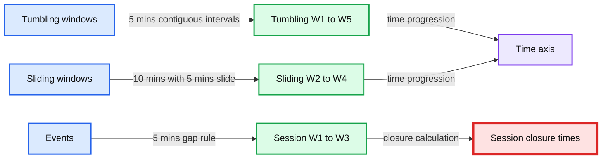
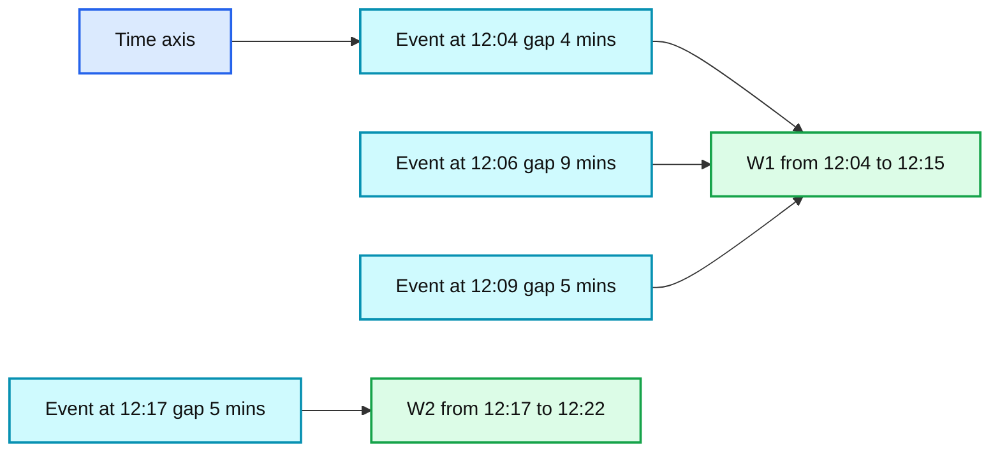

# Native Support of Session Window in Spark Structured Streaming

- Source: https://www.databricks.com/blog/2021/10/12/native-support-of-session-window-in-spark-structured-streaming.html
- Published: 2021-10-12
- Authors: Jungtaek Lim, Yuanjian Li, Shixiong Zhu
- Categories: engineering, open-source, data-streaming
- Images: 3 total, 2 extracted as architecture

*Free Edition has replaced Community Edition, offering enhanced features at no cost. Start using *[*Free Edition *](https://login.databricks.com/?intent=SIGN_UP&amp;signup_experience_step=EXPRESS&amp;provider=DB_FREE_TIER&amp;dbx_source=www)*today.*
 

Apache Spark™ Structured Streaming allowed users to do aggregations on [windows over event-time](https://www.databricks.com/blog/2017/05/08/event-time-aggregation-watermarking-apache-sparks-structured-streaming.html). Before Apache Spark 3.2™, Spark supported tumbling windows and sliding windows. In the upcoming Apache Spark 3.2, we add “session windows” as new supported types of windows, which works for both streaming and batch queries

## What is a "session window"?

**Summary:** The diagram compares tumbling, sliding, and session time windows using timelines and event-time boundaries.

**Components:**

- Tumbling windows: fixed, non-overlapping intervals labeled W1 through W5.
- Sliding windows: overlapping intervals labeled W2 through W4.
- Session windows: activity-based intervals labeled W1 through W3.
- Time axes: horizontal event-time progression for each window type.
- Session closure markers: event timestamps and calculated close times.

**Flows:**

- Time axis -> Tumbling windows: advances through contiguous fixed intervals.
- Time axis -> Sliding windows: advances through overlapping intervals.
- Events -> Session windows: extend or create sessions based on event gaps.
- Session W1 -> Session closure: closes at 12:14.
- Session W2 -> Session closure: closes at 12:20.
- Session W3 -> Time axis: continues beyond 12:22.

**Numbers:**

- 5 mins
- 10 mins
- Slide 5 mins
- Gap duration 5 mins
- 12:00
- 12:04
- 12:05
- 12:09
- 12:10
- 12:14
- 12:15
- 12:20
- 12:22
- W1
- W2
- W3
- W4
- W5

source image: https://www.databricks.com/wp-content/uploads/2021/10/Native-Support-4-Session-Window-in-Spark-Streaming-blog-img-1.jpg

 

Tumbling windows are a series of fixed-sized, non-overlapping and contiguous time intervals. An input can only be bound to a single window.

Sliding windows are similar to the tumbling windows from the point of being "fixed-sized", but windows can overlap if the duration of the slide is smaller than the duration of the window, and in this case, an input can be bound to the multiple windows.

Session windows have a different characteristic compared to the previous two types. Session window has a dynamic size of the window length, depending on the inputs. A session window starts with an input and expands itself if the following input has been received within the gap duration. A session window closes when there's no input received within the gap duration after receiving the latest input. This enables you to group events until there are no new events for a specified time duration (inactivity).

It works similar to a session on a website that has session timeout -- if you log into a website and don’t show any activity for some duration, the website will prompt you to retain login status and force logging out if you are still inactive after the timeout has been exceeded. The session timeout is extended whenever you show activity.

Applying this to the session window: a new session window is initiated when a new event, such as a streaming job, occurs, and following events within the timeout will be included in the same session window. Each event will extend the session timeout, which introduces a different characteristic compared to the other time windows -- the time duration of the session window is not static, whereas both tumbling and sliding windows have a static time duration.

## How to implement a query using a session window?

Previously, Spark required you to leverage flatMapGroupsWithState to deal with session windows. You were required to craft your own logic to define the session window and how to aggregate the inputs in the same session. This brought with it several downsides:

1. You can’t leverage built-in aggregate functions like count, sum, etc and have to do them by yourself.
2. It is non-trivial to craft the logic considering various output modes and the lateness of the input.
3. flatMapGroupsWithState is not available in PySpark; hence, you’re required to craft your queries via Java/Scala.

Now, Spark provides the same user experience as using time windows. The sentence remains true, “In Structured Streaming, expressing such windows on event-time is simply performing a special grouping”. For tumbling and sliding windows, `window` function is provided. For session windows, a new function `session_window` is introduced.

For example, counts over 5 minute tumbling (non-overlapping) windows on the eventTime column in the event can be described as following.

You can simply replace the function  “window” with “session_window” to count over session windows with a 5-minute gap on the eventTime column in the event.

## Session window with dynamic gap duration

In addition to the session window, which has the same gap duration across sessions, there is another type of session window, which has a different gap duration per session. We call this “dynamic gap duration.”

**Summary:** Dynamic session windows merge events according to each event’s individual gap duration, producing sessions W1 and W2.

**Components:**

- Time axis
- Event at 12:04 with a 4 minute gap
- Event at 12:06 with a 9 minute gap
- Event at 12:09 with a 5 minute gap
- Event at 12:17 with a 5 minute gap
- Session W1 from 12:04 to 12:15
- Session W2 from 12:17 to 12:22

**Flows:**

- Event at 12:04 -> Session W1: session coverage
- Event at 12:06 -> Session W1: session coverage
- Event at 12:09 -> Session W1: session coverage
- Event at 12:17 -> Session W2: session coverage
- Time axis -> Timeline: events ordered by event time

**Numbers:** 12:00, 12:04, 12:06, 12:09, 12:15, 12:17, 12:22, 4 mins, 9 mins, 5 mins, 5 mins, W1, W2

source image: https://www.databricks.com/wp-content/uploads/2021/10/Native-Support-4-Session-Window-in-Spark-Streaming-blog-img-2.jpg

 

The boxes below the line of time denote each event with its gap duration. There are four events and their (event time, gap duration) pairs are (12:04, 4 mins) in blue, (12:06, 9 mins) in orange, (12:09, 5 mins) in yellow, and (12:15, 5 mins) in green.

The box above the line denotes the actual session which is made from these events. You can consider each event as an individual session, and sessions having an intersection are merged into one. As you may indicate, the time range of the session is “union” of the time range of all events included in the session. Note that the end time of the session is no longer the time + gap duration of the latest event in the session.

The new function “session_window” receives two parameters, event time column and gap duration.

For dynamic session windows, you can provide an “expression” to the “gap duration” parameter in the “session_window” function. The expression should resolve to an interval, like “5 minutes”. Since the “gap duration” parameter receives an expression, you can also leverage UDF as well.

For example, counting over session windows with dynamic gap duration based on the eventType column can be described as follows.

## Native support of session window vs. FlatMapGroupsWithState

`flatMapGroupsWithState` provides more flexibility on implementing session windows, but it requires users to write a bunch of lines of code. For example, please refer to [the sessionization example](https://github.com/apache/spark/blob/branch-3.1/examples/src/main/scala/org/apache/spark/examples/sql/streaming/StructuredSessionization.scala) on Apache Spark which implements session windows via flatMapGroupsWithState. Note that the sessionization example on Apache Spark is very much simplified and only works with processing time & append mode pairs. The overall complexities of dealing with event time and various output modes are abstracted away with native support of session windows.

 

Spark sets a goal of native support of session windows to cover general use cases, as it enables Spark to optimize performance and state store usages. You may still want to leverage flatMapGroupsWithState when your business use case requires a complicated session window, for example, if the case session should also be closed on a specific type of event regardless of inactivity.

## Conclusion

We have covered the session window in streaming aggregation, which also works for batch queries. With learning how to use the new function `session_window`, you can leverage your knowledge of streaming data aggregation with time window and be able to handle session windows. You can leverage built-in aggregation functions, as well as your own UDAFs on session window aggregation queries This also enables SQL/PySpark users to deal with session windows, as flatMapGroupsWithState API is not available in PySpark and cannot be represented as a SQL statement.

There are still more rooms to improve on-time windowing operations, which requires you to use the flatMapGroupsWithState API for now. We are planning to look into custom window operations in the near future.

If you want to try out the upcoming Apache Spark 3.2 in the Databricks Runtime 10.0, sign up for [Databricks Community Edition or Databricks Trial for free](https://www.databricks.com/try-databricks) and get started in minutes. Using Spark 3.2 is as simple as selecting version "10.0" when launching a cluster.
