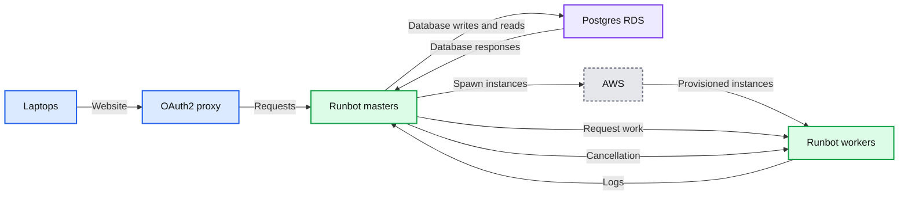
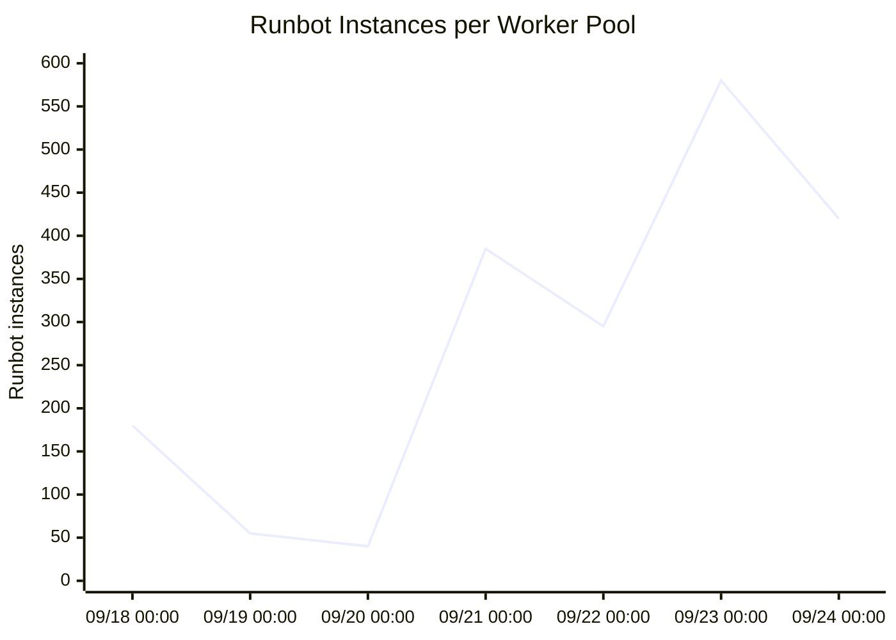
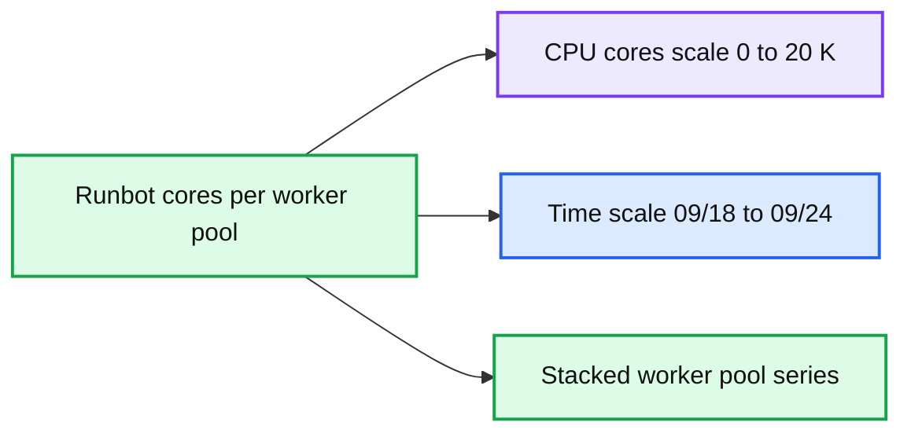

# Developing Databricks' Runbot CI Solution

- Source: https://www.databricks.com/blog/2021/10/14/developing-databricks-runbot-ci-solution.html
- Published: 2021-10-14
- Authors: Li Haoyi
- Categories: engineering, data-engineering
- Images: 11 total, 5 extracted as architecture

Runbot is a bespoke continuous integration (CI) solution developed specifically for Databricks' needs. Originally developed in 2019, Runbot incrementally replaces our aging Jenkins infrastructure with something more performant, scalable, and user friendly for both users and maintainers of the service. This blog post will explore the motivations behind developing Runbot, the core design decisions that went into it, and how we used it to greatly improve the experience of all the developers within the Databircks engineering organization.

## Background: Why Runbot?

### Jenkins issues

Traditionally, Databricks has used Jenkins as the primary component of our CI pipeline that validates pull requests (PRs) before merging into master. Jenkins is a widely used and battle-tested piece of software, and has served Databricks well for many years. We had over time built up some ancillary services and infrastructure surrounding it:

**Summary:** The diagram shows ancillary services and infrastructure surrounding Jenkins for GitHub-based CI, test exploration, worker scaling, and laptop access.

**Components:**

- Github, using GitHub
- Github Receiver, using a GitHub webhook receiver
- Kinesis, using Amazon Kinesis
- Github Consumer, using a GitHub event consumer
- Jenkins, using Jenkins CI
- Worker, using AWS worker instances
- AWS Autoscaling, using AWS Auto Scaling
- Autoscaling, using an autoscaling service
- Test Explorer, using a test result exploration service
- Laptop, using developer laptops

**Flows:**

- Github -> Github Receiver: GitHub events
- Github Receiver -> Kinesis: GitHub events
- Kinesis -> Github Consumer: streamed events
- Github Consumer -> Jenkins: CI triggers
- AWS Autoscaling -> Worker: worker capacity
- Worker -> Jenkins: build and test execution
- Jenkins -> Autoscaling: autoscaling requests
- Autoscaling -> AWS Autoscaling: scaling control
- Jenkins -> Test Explorer: test results
- Laptop -> Test Explorer: test exploration requests
- Jenkins -> Laptop: CI status and results

**Numbers:** none

source image: https://www.databricks.com/wp-content/uploads/2021/10/Developing-Databricks-Runbot-CI-Solution-blog-img-1.jpg

```mermaid
%% Shows GitHub events flowing through Kinesis to Jenkins, with AWS workers, autoscaling, test exploration, and laptops
flowchart LR
    GH[Github] -->|GitHub events| GR[Github Receiver]
    GR -->|GitHub events| K[Kinesis]
    K -->|Streamed events| GC[Github Consumer]
    GC -->|CI triggers| J[Jenkins]
    AA[AWS Autoscaling] -->|Worker capacity| W[Worker]
    W -->|Build and test execution| J
    J -->|Scaling requests| AS[Autoscaling]
    AS -->|Scaling control| AA
    J -->|Test results| TE[Test Explorer]
    L[Laptop] -->|Exploration requests| TE
    J -->|CI status and results| L

    classDef client   fill:#dbeafe,stroke:#2563eb,stroke-width:2px,color:#111
    classDef service  fill:#dcfce7,stroke:#16a34a,stroke-width:2px,color:#111
    classDef store    fill:#ede9fe,stroke:#7c3aed,stroke-width:2px,color:#111
    classDef cache    fill:#fef3c7,stroke:#d97706,stroke-width:2px,color:#111
    classDef queue    fill:#cffafe,stroke:#0891b2,stroke-width:2px,color:#111
    classDef critical fill:#fee2e2,stroke:#dc2626,stroke-width:4px,color:#111
    classDef external fill:#e5e7eb,stroke:#6b7280,stroke-width:2px,color:#111,stroke-dasharray:4 3
    classDef decision fill:#fce7f3,stroke:#db2777,stroke-width:2px,color:#111

    class GH,L client
    class GR,GC,W,TE,AS service
    class K queue
    class J critical
    class AA external
```

However, over time Jenkins' weaknesses were becoming more apparent. Despite our best efforts of stabilizing and improving the user experience, we faced continual complaints about our Jenkins infrastructure in our internal surveys:

“Test infrastructure is frequently breaking.”

“Jenkins error message is not well presented.“

“The jenkins test results are very hard to explore”

“I would guess that weekly or biweekly I have to adjust my workflows or priorities to work around an issue with build infrastructure.”

Jenkins was becoming a constant thorn in the side of our development teams. Newbies continued to trip over the same known idiosyncrasies that are unfixed for years. Veteran developers continue to waste time in inefficient workflows. Our team tending to the CI system itself needed to spend time responding to outages, fielding questions due to the poor user experience, or managing chronic issues like flaky tests with inadequate tooling.

### Why couldn't we fix it?

Despite many attempts over the years to improve it, this situation had remained largely unchanged. Weeks to months of work to try and e.g. better integrate our testing infrastructure with the Github Checks UI, or better manage resources usage on the Jenkins master, had proven unsuccessful. The whole experience remained clunky and unstable, and it was becoming clear that more effort expended in the same way would always have the same outcome. Working around Jenkins' limitations with auxiliary services and integrations was no longer enough, and we needed to try something different if we wanted to provide a significant improvement to the experience for those around the company using Databricks CI.

The issues with our Jenkins infrastructure could largely be boiled down to two main issues:

1. Our Jenkins Infrastructure was complex and difficult to work on. A mix of microservices, open source software (OSS) and bespoke, JVM and Python, kubernetes and raw-EC2. This made any improvements a slow process, with time spent wrangling services and ETL rather than on the user-facing features we wanted.
2. Jenkins is operationally difficult to manage. The Jenkins server had long-running stability, usability and complexity issues that we had not managed to solve or mitigate well, and its fundamental architecture made it seem unlikely we would ever manage to solve to our satisfaction

I will discuss each in turn.

### Complexity preventing improvement

Over the years, we had implemented many common CI features as a collection of separate services specialized to Databricks’ specific needs:

1. Our Autoscaling service delegates work to our instance pools, autoscaling the pools up and down job-balancing latency and cost
2. A bespoke JJB/Bazel configuration pipeline configures Jenkins via config-as-code, and we try to avoid configuring jobs “manually” through the web UI
3. Our own Github Event Consumer service handles [orchestration](https://www.databricks.com/glossary/orchestration) of which jobs to trigger based on details about the pull request: files changed, labels, author, owners, etc.
4. A custom Github web hook, Kinesis queue, and Github Receiver service handles the integration with Github
5. A Test Explorer service provides useful Web UIs to view and slice and dice test results, to investigate breakage or flakiness

While Jenkins itself provides many of these features already, we often found we had our own needs or specific requirements that Jenkins and its plugins did not satisfy. We would have loved to not have to build and maintain all this stuff, but our hand was forced by the needs of the team and organization.

This sprawling complexity makes incremental improvement difficult, things such as:

1. New views to help manage our core jobs and keep our master branch green. e.g., a dashboard showing the history of multiple jobs, to help us distinguish between localized flakiness, single-job breakage, and system-wide breakage either in the infrastructure or in the code under test.
2. Up to date test results in the Test Explorer service. This could not  be done due to the asynchronous ETL needed to extract data from Jenkins. This meant that we had one UI for viewing test results that was ugly but current, and one historical view that was prettier but delayed; together, there was no single UI that a developer could browse to see test results with a good developer experience.
3. Seeing which worker a particular job was running on. This is very useful: sometimes a worker (which we re-use for performance) gets into a bad state, causing scattered flaky failures, which are confusing until you notice they're all on the same node. Other times you need to SSH into the worker to debug a particularly thorny issue that only arises on CI and need to know which one to go into.

In general, if you wanted to make a small change to the Databricks' CI experience, there just wasn't a place to "put things". Jenkins' own source code was external and non-trivial to modify for our needs, and none of the various services we had spun up were a good platform for implementing general-purpose CI-related features. Data, UIs, and business logic were scattered across the cluster of microservices and a web of tangled integrations between them.

Now, these issues weren't *insurmountable*, e.g., to get a multi-job-history dashboard, we ended up opening multiple browsers on our office-wall dashboard, positioned them painstakingly side by side, and then opened each one to a different Jenkins job:

Left for hours/days, Jenkins' "Blue Ocean" UI would sometimes mysteriously stop updating, and so we installed a chrome plugin to auto-refresh the browsers at an interval. Even then sometimes Jenkins' "Blue Ocean" web UI would somehow bring down the whole OSX operating system (!) if left open for too long with too many tabs (n > 4) forcing us to power-cycle the mac-mini running the dashboard! It worked, but it couldn't be said to have worked *well*.

Improving this experience with our current service architecture was very difficult.

Apart from our own menagerie of microservices, Jenkins itself is a sprawl of functionality. With multiple HTML UIs, multiple configuration subsystems, endless plugins, all with their own bugs and interacting in unintuitive ways. While this is all expected from a project grown over a decade and a half, it definitely levies a tax on anyone trying to understand how it all fits together.

Consider the multi-browser Jenkins dashboard shown above. Let's say we wanted to add a tooltip showing how long each job run was queued before being picked up by a worker? Or imagine we wanted to make the COMMIT column link back to the commit page on Github. Trivial to describe, but terrible to implement: do we fork Jenkins' to patch its Blue Ocean UI? Write a Chrome plugin that we ask everyone to install? Write a separate web service that pulls Jenkins' data through its API to render as HTML? All of these were bad options for someone just wanting to add a tooltip or a link!

Over the years we had made multiple attempts to improve the CI developer experience, with only marginal success. Essentially, attempts to add user-facing features to our CI system get bogged down in ETL data plumbing, microservice infrastructure deployment, and other details that dwarf the actual business logic of the feature we want to implement.

### Architecture and operational stability

Apart from making it difficult to make forward progress, the existing architecture was problematic for us trying to manage the service operationally. In particular, Jenkins was an operational headache, causing frequent outages and instability, due to some of its fundamental properties:

1. A single stateful “master” process, coordinating one or more pools of worker nodes
2. The master stores its state either in-memory, or on-disk as a folder tree full of XML files
3. Each worker is constantly connected to the master via an SSH connection

This architecture has the following consequences:

1. It is impossible to have more than one master node, or more than one master process, due to the in-memory state
2. The master node/process is very CPU/memory/disk heavy, managing its in-memory state and on-disk XML datastores
3. Any downtime in the single master causes all ongoing jobs to fail

These consequences caused us pain on a regular basis:

1. Our master in the best case scenario was taking 150+gb of memory in order to work, and this number would occasionally spike high enough to bring the whole process grinding to a halt
2. Every time the Jenkins master needed to be re-booted, all in-progress job runs failed, resulting in frequent inconveniences to our developers trying to test their code.
3. We couldn't easily spin up replica Jenkins masters to share the load, and were approaching limits on the Amazon Web Services (AWS) instance size to vertically scale our single Jenkins master
4. We could not upgrade Jenkins without causing downtime and inconveniencing our users

In experiments, we found Jenkins could manage about 100-200 worker instances before the stability of the master started deteriorating, independent of what those workers actually did. The failure modes were varied: thread explosions, heap explosions, `ConnectionClosedExceptions `etc. Attempts to isolate the issue via monitoring, profiling, heap dumps, etc. had largely been unsuccessful.

As engineering grew, we found the Jenkins master falling over once every few days, always causing ongoing test runs to fail, and sometimes requiring a significant amount of manual effort to recover. These outages even occur at times when the Jenkins load was minimal (e.g. on weekends). Databricks’ bespoke integration also sometimes caused issues, e.g., the test explorer ETL job caused outages. As engineering continued to grow, we expected system stability to become ever more problematic as the load on the CI system increased further.

## Goals, non-goals, and requirements

### Goals

In finding a replacement for our Jenkins infrastructure, we had the following high-level goals:

1. The system should be able to run on its own with minimal manual troubleshooting, and scale up smoothly as load increases without the user experience deteriorating
2. We should be able to make changes, upgrades, and improvements to our CI experience without causing any downtime or inconvenience to our developers
3. An intern should be able to contribute a new feature to the CI system in a week, just knowing Scala, SQL, HTML, and CSS, without knowing the intricacies of our cloud infrastructure
4. Using the above properties, we should be able to quickly improve upon and streamline common workflows, building a coherent developer experience to reduce the quantity of CI-related questions asked

### Non-goals

In any plan, what you hope to do and accomplish is only half the story. Below are some of the explicit non-goals -- things we decided early on that we did not want to do accomplish:

1. We did not need to re-implement our entire CI system; some components work well and without issue overhead. We wanted to be strategic in replacing the ones that caused us the most issues (Test Explorer, Jenkins, etc.) while leaving others in place
2. We did not need to implement Jenkins’ breadth of functionality and plugins. As mentioned above, we had already extracted various Jenkins’ features, leaving only a very small subset of Jenkins’ features that we actually relied upon
3. We did not want to support arbitrarily complex build pipelines. The vast majority of CI jobs were simple, run pre-merge on PRs or post-merge on master, and do not have other jobs upstream or downstream. Graph-based execution engines are cool, but out of scope for this project.
4. We did not need an infinitely scalable system. Something that can handle the CI load at the time (~500 job runs a day, ~50 concurrent runs), along with another 1-2 orders of magnitude growth, would be enough. We could always evolve the system if usage increases
5. We did not need to replace the Github UI. Databricks uses the Github UI as the “hub” for any user trying to merge a PR, with PR/commit statuses shown for each CI job running. We just intended improve the experience beyond that, e.g., digging into a job to see what failed, or digging into job/test history to investigate flakiness or breakages, but the Github UI side of things worked great and didn't need replacing

### Requirements

Any CI system we ended up picking would need to do the following things:

1. Run shell commands: in response to github events, triggers, or on schedules,
2. Be operationally easy: to deploy (not too many moving parts), manage, and update (zero downtime)
3. Configuration-as-code: so changes to configuration can be
 version-controlled and code-reviewed. We used [Jsonnet](https://jsonnet.org/)-generated-YAMLs throughout the rest of the company and were quite happy with the workflow
4. Use the same EC2/AMI-based test environment we already use, for our Jenkins workers and Devboxes. We had a big and messy codebase, with a significant amount of supporting AWS cloud infrastructure (build caches, kubernetes clusters, etc.), and didn't want to spend time containerizing it or having to do a cross-cloud migration.
5. Have a nice UI for viewing the state of the service, jobs, individual runs, or logs; that's basically all we used Jenkins for anyway.
6. Be easily extensible with custom features: big (e.g., overview dashboards, flaky test views, etc.) and small (tooltips, links, etc.). We would inevitably want to customize the system to Databricks-specific requirements and workflows, and continue evolving it as usage patterns changed over time.
7. Autoscale a worker pool, since CI system usage is by nature variable during the workday and workweek.
8. Allow engineers to competently create or modify jobs, without needing to become an expert in the specific system (not possible with Jenkins' Groovy config!)

## Alternatives

Building your own bespoke CI system is a big project, and not one you want to do if you have any other alternatives. Before even considering this effort, we investigated a number of alternatives:

- [Kubernetes Prow](https://github.com/kubernetes/test-infra/tree/master/prow): this was the most thoroughly investigated, including a full test deployment running some sample jobs. We found the usability wasn't great at the time, e.g., needing to run kubectl to re-trigger job runs, and it didn't have a streaming log viewer for in-progress logs. There was also some built-in infrastructure that seemed hardcoded to the Google Cloud Platform (GCP) (e.g., storing logs in Google Cloud Storage) that wouldn't work with our AWS-based cloud infrastructure

1. [Github Actions](https://github.com/features/actions): at the time this did not include bring-your-own-infra, and could only work in one specific class of Microsoft Azure VMs with 2CPU/7GBmemory that wouldn't suffice for us
2. [SAAS Jenkins](https://www.cloudbees.com/): in theory would solve the stability issues with Jenkins, but it wouldn't solve the UI or complexity issues
3. [Jenkins X](https://jenkins-x.io/): seemed more like a CD tool than a CI solution, with a focus on deployment CD pipelines and orchestration rather than CI validation
4. [Travis-CI](https://www.travis-ci.com/): no bring-your-own-infra. Also they had just been acquired at the time so their future prospects as a company and project were unclear.
5. [Infrabox](https://github.com/SAP/InfraBox): had difficulty setting it up to do a proof-of-concept deployment

One common thread throughout the investigation of alternatives was the lack of "bare metal" EC2 support or bring-your-own-infra in most "modern" CI systems. They all assumed you were running inside containers, often *their* specific containers inside *their* specific infrastructure. As an organization which already had a good amount of cloud infrastructure we were perfectly happy with, running inside someone else's container inside someone else's cloud was a non-starter.

There were other alternatives that we did not investigate deeply: [Concourse CI](https://concourse-ci.org/), [CircleCI](https://circleci.com/), [Gitlab CICD](https://docs.gitlab.com/ee/ci/), [Buildkite](https://buildkite.com/), and many others. This is not due to any value judgement, but simply the reality of having to draw a line at some point. After digging into a half-dozen alternatives, some deeply, we felt we had a good sense for what was out there and what we wanted. Anyway, all we wanted was something to run bash commands on EC2 instances and show us logs in the browser; how hard could that be?

## Designing Runbot

So that brings us to Runbot; the CI system we developed in house. At its core, Runbot is a traditional "three tier" web application, with a SQL database, stateless application server(s), and a website people can look at:

**Summary:** Runbot is a three-tier CI system connecting laptops through an OAuth2 proxy to runbot masters, PostgreSQL RDS, and AWS-hosted workers.

**Components:**

- AWS: cloud infrastructure
- Runbot workers: CI worker processes
- Runbot masters: CI coordination servers
- PostgreSQL RDS: SQL database
- OAuth2 proxy: authentication proxy
- Laptops: user clients

**Flows:**

- Laptops -> OAuth2 proxy: Website traffic
- OAuth2 proxy -> Runbot masters: Authenticated requests
- Runbot masters -> PostgreSQL RDS: Database writes and reads
- PostgreSQL RDS -> Runbot masters: Database responses
- Runbot masters -> AWS: Spawn instances
- AWS -> Runbot workers: Provisioned worker instances
- Runbot masters -> Runbot workers: Request work
- Runbot workers -> Runbot masters: Logs
- Runbot masters -> Runbot workers: Cancellation

**Numbers:** none

source image: https://www.databricks.com/wp-content/uploads/2021/10/Developing-Databricks-Runbot-CI-Solution-blog-img-3.jpg

Apart from the backend system that manages CI workers to validate PRs and master commits and reporting statuses to Github, a large portion of Runbot's value is in its Web UI. This lets a user quickly figure out what's going on in the system, or what's going on with a particular job that they care about.

Written in Scala, Runbot has about ~7,000 lines of code all-included: database access, Web/API servers, cloud interactions, worker processes, HTML Web UI, etc. It has since grown to about ~10,000 lines with the addition of new features and use cases.

### Basic system architecture

The technical design of Runbot can be summarized as "not Jenkins". All the issues we had with Jenkins, we strove hard to avoid having with Runbot.

| Jenkins | Runbot |
|---|---|
| XML file system datastore | PostgreSQL database |
| Stateful Server | Stateless Application Servers |
| Requires constant connection to workers | Tolerates intermittent connection to workers |
| Extensible via plugins | Extensible by just changing its code |
| Groovy config language | Jsonnet config language |
| Groovy workflow language | No workflow language; it just runs your executable and you do your own thing |

Runbot is a much simpler system than Jenkins is: as mentioned earlier it started out around ~7,000 lines of Scala (smaller than [java.util.regex](https://github.com/openjdk-mirror/jdk7u-jdk/tree/master/src/share/classes/java/util/regex)!), and has grown modestly since then.

At its core, Runbot is just a traditional three-tier website. HTTP requests come in (GETs from user browsers or JSON POSTs from workers and API clients), we open a database transaction, do some queries, commit the transaction and return a response. Not unlike what someone may learn in an introductory web programming class.

### Interesting design techniques

On top of the common system architecture described above, Runbot does do a few notable things in order to support its featureset:

- We use PostgreSQL's LISTEN/NOTIFY capability to implement a basic publish-subscribe workflow; whether it's a browser waiting for updated logs, or an idle worker waiting for new work to be queued, using LISTEN/NOTIFY lets us notify them immediately without the performance/latency overhead of polling. Combined with SQL tables storing events, this turns Postgres into quite a competent real-time event queue, letting us keep things simple and avoid introducing other infrastructural components like Kafka or RabbitMQ

1. A number of "scheduled" jobs run housekeeping logic on a regular basis to keep things running: spawning new EC2 workers instances when too much work is queued, terminating old/unused EC2 instances, etc. These are run directly on the Web/API servers, with coordination between the replicas again done through the Postgres database, again keeping our infrastructure simple
2. A small agent process runs on each worker to coordinate the core interactions with the application servers: listening-for/acquiring work, running the necessary subprocess commands the job is configured to run, streaming logs, etc. All the worker-server interactions go through the same Web/API servers as JSON/HTTP/Websockets, just like Runbot's other APIs and Web UIs.

Despite being a distributed cluster manager with real-time pub/sub and a live-updating website, at its core Runbot works similarly to any other website you may have seen. We reuse the same database-backed HTTP/JSON web servers as a platform to overlay all other necessary domain-specific systems. This simplicity of implementation has definitely been a boon to maintenance and ease of operating and extending the system over time.

### Worker management

One part of Runbot's design that deserves special discussion is the worker lifecycle. While Runbot manages several elastic clusters of cloud EC2 instances, the actual logic involved is relatively naive. The lifecycle of a job-run and worker can be summarized as follows:

- Jobs are configured statically via config-as-code: when Runbot is deployed, we bundle the config together with it. Config changes require a re-deploy, though as the Runbot servers are stateless this doesn't incur downtime

- Our Github event pipeline POSTs to Runbot's Web/API server to queue up a job run, with some parameters (e.g. just the `sha` for a post-merge master job, or `pr` ID for a pre-merge PR job)

- If there are already idle workers, one of them will receive the push-event from the queued job run and immediately claim it. Otherwise a scheduled job running a few times a minute will notice that there's more queued jobs runs than workers, and use the AWS SDK to spin up a new worker EC2 instance (up to a `maxWorkers` limit)

- A new worker runs a set of configured `initCommands` to initialize itself (e.g., cloning the git repo for the first time), and once done it subscribes for an unclaimed job run from the Runbot server.

- Once the worker claims a job run, it runs a set of configured `runCommands` to actually perform the job logic: checking out the relevant SHA/PR-branch using the parameters given with the queued job run, `bazel build` or `bazel test` or `sbt testing` things as appropriate.

- Once `runCommands` is complete, it runs some pre-configured `cleanupCommands` to try and get the working directory ready to pick up another job run (`bazel shutdown, git clean -xdf, etc.`), and re-subscribes with the Runbot server and either receives or waits for more work.

- If a worker is idle for more than `timeouts.waiting` (typically configured to be 10 minutes), it calls `sudo shutdown -P now` and terminates itself. We also have a scheduled background job on the Runbot server that regularly cleans up workers where shutdown fails (which happens!)

The above description is intentionally simplified, and leaves out some details in the interest of brevity. Nonetheless, it gives a good overview of how Runbot manages its workers.

Some things worth noting about the above workflow include:

- The behavior of the worker cluster is an emergent property of the system config: the `maxWorkers`, the frequency of running the spawn-instance background job, the `timeout.waiting`. While not precise, it does give us plenty of knobs we can turn to make long-lived single-worker jobs or short-lived multi-worker jobs. timeout.waiting can be tweaked to tradeoff between idle workers and job-run queue times: longer worker idle times means there's more likely to be a waiting worker to pick up your job run immediately upon you queuing it.

1. We re-use workers aggressively between job runs *within a single job*. While this introduces potential interference between job runs, it increases performance dramatically due to local build caches, long-lived daemon processes, etc. Every once in a while we have to investigate and deal with a worker getting into a bad state.
2. We do not reuse workers *between jobs*. We actually had this feature in our Jenkins' auto scaling system, and could in theory improve utilization of workers by sharing them between jobs, but we didn't think the increased complexity was worth it. We didn't end up implementing it on Runbot.
3. We don't do any clever CPU/Memory/Disk-level resource optimization. This is partly because that kind of system normally requires running everything inside containers, and our jobs typically run on "raw" EC2. With different jobs being configured to use different instance types, and us scaling the size of our instance pool up and down as usage fluctuates, we're effectively letting AWS perform a coarse-grained resource-optimization on our behalf.

Runbot's worker management system can be thought of similar to "objects" in object-oriented programming: you "allocate" a worker by calling the EC2 API, invoke the "constructor" by running `initCommands` and then call "methods" on it with parameters by running `runCommands`. Like "objects", Runbot workers use internal mutability and data locality for performance, but try to preserve some invariants between runs.

It's almost a bit surprising how well Runbot's worker management works. "ask for instances when there's work, have them shut themselves down when there isn't" isn't going to win any awards for novelty. Nevertheless, it has struck a good balance of efficiency, utilization, simplicity, and understandability. While we have definitely encountered problems as usage has grown over the past two years, the naivete of its worker-management system isn't one of them.

### User-facing design

Scalability and stability were not the only motivations for Runbot. The other half of the picture was to provide a vastly better user experience, based on the learnings from the Jenkins-related microservices that had organically grown over time.

Part of the goal of Runbot is *information density*: every inch of screen real estate should be something that a user of the system may want to see. Consider again the home page dashboard shown earlier: It's relatively straightforward page, with each job having a number of workers (small squares on the left) and a number of job runs (histogram of durations on the right), with workers and job runs both colored to show their status (yellow/grey = initializing, green = idle/success, blue = in progress, red/black = failed). At a glance we're able to draw many conclusions about the nature of the jobs we are looking at:

Even when things are going well, we can already notice some things. Why is compilation on `Compile-MacOS-Master` flaky? Why was `Compile-Master` broken for a while, and could that have been avoided?

But this ability is even more important when things are going wrong. Maybe a job started becoming super flaky, maybe a worker instance got corrupted and is in a bad state, maybe AWS is out of instances in that region and new EC2 workers cannot start. All of those are things can be often be seen at a glance, and every element on the page has tooltips and links to further information:

It's worth contrasting Runbot's main dashboard with the equivalent Jenkins UI:

While Jenkins theoretically has all the same data if you drill in, it generally requires a lot more drilling in to find the information you need. Something obvious at a glance on Runbot may take a dozen clicks and multiple side-by-side browser windows to notice on Jenkins. (Above I show the traditional UI, but the newer "Blue Ocean" UI isn't much better). For example, while at-a-glance Jenkins may show only the most basic of summary information, Runbot is able to show you the whole history of the job and its variation over time, giving a visceral feel for how a job is behaving.

Using Runbot, someone investigating an issue is thus able to quickly drill down to information about the job, about the job run, about the worker, all to aid them in figuring out what's going wrong. Front-end UI design is often overlooked when building these internal backend systems, but Runbot's UI is a core part of its value proposition and why people at Databricks like to use it.

### Static HTML UI

By and large, Runbot's UI is a simple server-side HTML/CSS UI. There is hardly any interactiveness -- any configuration is done through updating and deploying the Jsonnet config files -- and what little interactiveness there is (starting, cancelling, and re-starting a job run) is implemented via simple HTML forms/buttons and POST endpoints. We have some custom logic to allow live-updating dashboards and streaming logs without a page refresh, but that's purely a progressive enhancement and the UI is perfectly usable without it.

One interesting consequence of this static HTML UI is how performant it is. The Github Actions team had published a [blog post](https://github.blog/2021-03-25-how-github-actions-renders-large-scale-logs/) about how they used clever virtualization techniques to render large log files up to 50k lines. Runbot, with it's static server-side rendered logs UI (including server-side syntax highlighting), is able to render 50k lines without issue in a browser like Chrome, without any client-side Javascript at all!

Perhaps the larger benefit of static HTML is how simple it is for anyone to contribute. Virtually any programmer knows *some* HTML and CSS, and would be able to bang out some text and links and colored-rectangles if necessary. The same can't be said for modern Javascript frameworks, which while powerful, are deep and complex and require front-end expertise to set up and use correctly.

While many projects these days use a front-end framework of some sort, Runbot, being mostly static HTML, has its own benefits. We do not have any front-end specialists maintaining Runbot, and any software engineer is able to bang out a quick page querying the data they want and rendering it in a presentable format.

## Rolling out Runbot

### Scale

Since its introduction in 2019, we have been gradually offloading jobs from Jenkins and moving them to Runbot. Usage of Runbot has grown considerably, and it now processes around ~15,000 job runs a day.

**Summary:** Time-series chart showing daily Runbot job queue volume rising from near zero in early 2020 to roughly 15,000 by mid-to-late 2021.

**Components:**

- Date axis: January 2020 through late 2021
- Jobs queued on Runbot each day axis
- Daily queued-job series

**Flows:**

- none

**Numbers:**

- 0
- 5,000
- 10,000
- 15,000
- 20,000
- 1/1/2020
- 7/1/2020
- 1/1/2021
- 7/1/2021

source image: https://www.databricks.com/wp-content/uploads/2021/10/Developing-Databricks-Runbot-CI-Solution-blog-img-10-e1634169885614.jpg

This gradual migration has allowed us to reap benefits immediately. By moving the most high-load/high-importance jobs from Jenkins to Runbot, not only do those jobs get the improved UX and stability that Runbot provides, but those jobs left behind on Jenkins also benefit from the reduced load and improved stability. Right now we are at about 1/3 on Jenkins and 2/3 on Runbot, and while the old Jenkins master still has occasional issues, the reduced load has definitely given it a new lease on life. We expect to gradually move more jobs from Jenkins to Runbot as time progresses.

The growth of usage on Runbot has not been without issue. From the original plan of 50 concurrent workers, we're now approaching 500 concurrent workers with 15,000 CPU cores during peak hours:

**Summary:** Runbot instances per worker pool over time, showing stacked usage peaks approaching 600 instances.

**Components:**

- Runbot instances per worker pool
- Time axis from 09/18 through 09/24
- Instance-count axis from 0 to 600

**Flows:**

- none

**Numbers:** 0, 100, 200, 300, 400, 500, 600; 09/18 00:00, 09/19 00:00, 09/20 00:00, 09/21 00:00, 09/22 00:00, 09/23 00:00, 09/24 00:00; peak approximately 580

source image: https://www.databricks.com/wp-content/uploads/2021/10/Developing-Databricks-Runbot-CI-Solution-blog-img-11.jpg

**Summary:** Stacked time-series chart showing Runbot CPU cores by worker pool from September 18 through September 24.

**Components:**

- Runbot cores per worker pool
- Time axis
- CPU cores axis
- Multiple stacked worker pool series

**Flows:**

- none

**Numbers:** 0, 5 K, 10 K, 15 K, 20 K; 09/18 00:00, 09/19 00:00, 09/20 00:00, 09/21 00:00, 09/22 00:00, 09/23 00:00, 09/24 00:00

source image: https://www.databricks.com/wp-content/uploads/2021/10/Developing-Databricks-Runbot-CI-Solution-blog-img-12.jpg

### Problems

While we performed load testing before the initial rollout to make sure things worked at the expected scale, we did end up hitting some speed bumps as the usage of our system grew 10x over the past two years. Given the Runbot application servers are stateless and easily replaceable, most of the problems ended up being with the Postgres RDS database which is a Single Point of Failure:

1. Sometimes the query planner can be mercurial and uncooperative. Nothing like having Postgres spontaneously decide a millisecond-long query no longer needs the index and instead should start doing minutes-long full table scans, at 1am (local time), just as the rest engineering at HQ (in a different time zone) are starting to wake up and try to use your CI system!
2. The Postgres read replica could sometimes get overloaded, fall behind on replication, and *bring the master down with it*. Turns out the transaction logs that the master keeps around waiting for the replica to catch up grew enough to consume all disk space on the master, not something we expected the replica to be able to do.
3. By default, RDS disk *throughput* is throttled because of your configured disk *size*. That means if you have a small database with a lot of disk traffic, you may do well to configure a larger disk even if you don't expect to use it all.

Despite being problems that caused outages, it is comforting to see that these issues are *common problems* shared by basically everyone who is operating a database-backed web service. Common problems have common solutions, which sure beats trying to untangle the interactions between Jenkins threadpool explosions, its multi-terabyte XML disk store, and our menagerie of custom microservices surrounding it.

### Extensibility

Part of Runbot's sales pitch was how much it simplified development on our CI system. This has largely been borne out over the past two years it's been running.

We have had several individuals contribute useful features to the Runbot codebase, from smaller UI improvements like improved test-name truncation or more informative tooltips to bigger features like binary artifact storage or job run history search. We've had experienced folks join the company and immediately tweak the UI to smooth over some rough edges. We've had interns contribute significant features as a small part of their main internship project.

None of the individuals contributing these improvements were experts in the Runbot system, but because Runbot runs as a simple database-backed web application, they were able to find their way around without issue and modify Runbot to their liking. This ease of making improvements would have been unheard of with the old Jenkins infrastructure.

This has validated our original hope that we'd be able to make Runbot simple enough that anyone would be able to contribute just by writing some Scala/SQL/HTML/CSS. Runbot may not have the huge ecosystem of plugins that Jenkins has, but its ability to be easily patched to do whatever we want more than makes up for it!

## Going forward

So far we have talked about what we have done with Runbot in the past; what about the future? There are a few major efforts going into Runbot now and in future.

### Scale and stability

Runbot's usage has grown around 10x in the past two years, and we expect it to continue to grow rapidly in future. Databricks' engineering team continues to grow and, as we mentioned, will continue to port jobs off our old Jenkins master. Not just that, but as the company matures, people's expectations continue to grow: a level of reliability that was acceptable in 2019 Databricks is no longer acceptable in 2021.

This means we will have to continue streamlining our processes, hardening our system, and scaling out the Runbot system to handle ever more capacity. From the current scale of ~500 concurrent workers, we could expect that to double or triple over the next year, and Runbot needs to be able to handle that. Scaling database-backed web services is a well-trodden path, and we just need to execute on this to continue supporting Databricks' engineering as it grows.

### Supporting new use cases

One of Runbot's selling points was that as a fully-bespoke system, we can make it do whatever we want by changing its (relatively small) codebase. As the CI workflows within Databricks evolve, with new integration testing workflows and pre/post-merge workflows and flaky test management, we will need to adapt Runbot with new UI and new code paths to support these workflows.

One interesting example of this is using Runbot as a general-purpose job runner in restricted environments. While we're familiar with both Jenkins and Runbot, the fact that Runbot is such a small system means that it has a minimal attack surface area. No complex permissions system, no user account management, no UI for re-configuring jobs at runtime, a tiny codebase that's easily audited. That makes it much easier to be confident you can deploy it securely without any room for vulnerabilities.

Another use case may be building out an experience for managing the deployment validation pipeline. Currently per-commit Master tests, N-hourly integration tests, and others are handled in an ad-hoc manner when deciding whether or not a commit is safe to promote to staging and beyond. This is a place where Runbot's extensibility really shines, as we could build out any workflow imaginable on Runbot's simple web-application platform.

## Self-service

From its conception, Runbot was developed as a product managed and operated by the team that developed it. As time goes on, other teams are adopting it more and more, and the system is making the transition from a bespoke piece of infrastructure to a self-service commodity, like Github Actions or Travis CI.

Over the past two years we have already polished over a lot of the rough edges back from when Runbot was operated by the team that developed it, but there's a lot of work to do to turn it into an "appliance" that someone can operate without ever needing to peak under the hood to understand what's going on. The goal here would be to make Runbot as simple to use as Travis-CI or Github Actions, turning it from "internal infrastructure" to a "product" or "appliance" anyone can just pick up and start using without help.

## Conclusion

In this blog post, we have discussed the motivation, design, and rollout of Databricks' Runbot CI system. As a bespoke CI system tailored to Databricks' specific requirements, Runbot has several advantages over our old Jenkins infrastructure: stability, simplicity, improved UX, and easier development and evolution over time.

Runbot is an interesting challenge: a mix of cloud infrastructure, distributed systems, full-stack web, front-end UI, and developer experience all mixed into one project. Despite the common adage about re-inventing the wheel, over the past two years Runbot has proven itself a worthy investment, cutting through a decade-and-half of organic growth to provide a streamlined CI system and experience that does exactly what we need and nothing more. Runbot has proved crucial to supporting Databricks as it has grown over the past two years, and we expect it will play a pivotal role in supporting Databricks as it continues to grow in future.

If you're interested in joining Databricks engineering, whether as a user or developer of our world class internal systems, [we're hiring](https://www.databricks.com/company/careers)!
