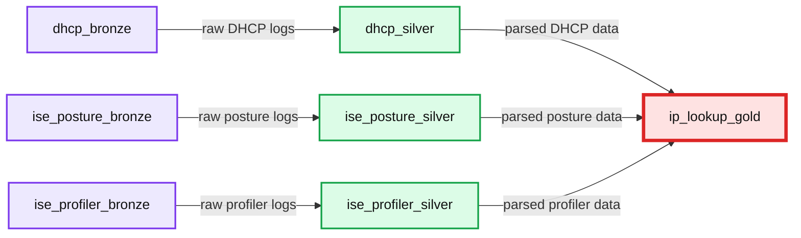
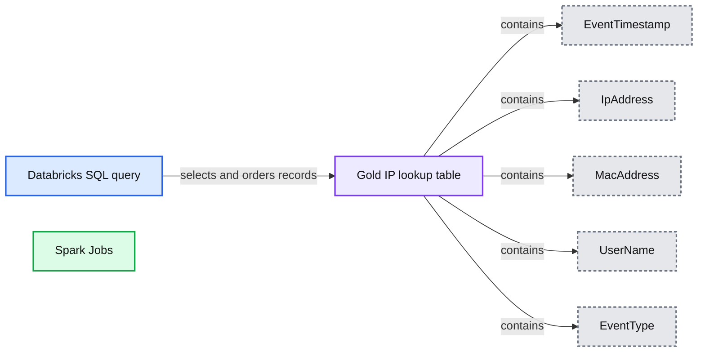

# Creating an IP Lookup Table of Activities in a SIEM Architecture

- Source: https://www.databricks.com/blog/2021/10/18/creating-an-ip-lookup-table-of-activities-in-a-siem-architecture.html
- Published: 2021-10-18
- Authors: Sepideh Ebrahimi, Andy Hutchinson
- Categories: engineering, data-engineering
- Images: 4 total, 4 extracted as architecture

When working with cyber security data, one thing is for sure: there is no shortage of available data sources. If anything, there are too many data sources with overlapping data. Your traditional SIEM (security information and event management) tool is not really fit to handle the complex transformation and stitching of multiple data sources in an efficient manner. Besides, it is not cost-effective to process terabytes or petabytes of event data on a daily basis in a SIEM system.

One common network security use case requiring marrying multiple data sources is the attribution of an IP address to a certain user. When working with a traditional SIEM tool, to determine malicious or suspicious activities on the network, SOC (security operation center) analysts have to launch multiple queries against different data sources (VPN, DHCP, etc.) and manually stitch them together to find out the timeline and actions of an IP address. This could take up to 15 minutes per IP address. Precious time in the event of a security incident that could be saved if you automated aggregation and curation of data before landing it in the SIEM solution.

In this blog, we will cover a simplistic approach to data collection, combining multiple data sources and automation to create an IP lookup table. This table is a fundamental building block of threat intelligence to create a holistic picture of the activities in your network. It will enable you to query IP addresses in a given time window, attribute them to users/ MAC addresses and track events in the order they happened.

We will use Cisco ISE Posture and Profiler events as VPN logs and Infoblox DHCP logs for off-VPN activities. We are using [Databricks Labs Data Generator](https://github.com/databrickslabs/dbldatagen) to simulate these event logs and push them into an S3 bucket. In a real-world scenario, you can use a real-time streaming service such as [Kinesis Firehose](https://aws.amazon.com/kinesis/data-firehose/?kinesis-blogs.sort-by=item.additionalFields.createdDate&kinesis-blogs.sort-order=desc) to push such logs from on-premise servers into S3. These logs are then ingested using [the Databricks Lakehouse Platform](https://www.databricks.com/product/data-lakehouse). We have built the entire end-to-end pipeline using [Delta Live Tables](https://www.databricks.com/product/delta-live-tables), which allows us to ensure data quality in each stage of the incremental data curation, as well as lineage for the end-to-end pipeline. Once data is curated into a master IP lookup table, a SIEM tool such as Splunk (using [Databricks Splunk add-on](https://splunkbase.splunk.com/app/5416/)) or a BI tool or dashboard such as Tableau, PowerBI or Looker can be used as the presentation layer.

## Cyber security lakehouse architecture

Figure 1 illustrates an example of a typical cyber security ecosystem. It is an entangled web of different data sources and systems with a SIEM tool in the mix. The SOC analyst has to query different sources and stitch results together to get meaningful insights, which gets even more complicated with increasing volumes of event data. An average enterprise will have petabytes of data to comb through, and without the right tools to handle these massive datasets, this task could be quite tedious, if not impossible.

*)*

**Summary:** The diagram shows a typical cybersecurity ecosystem connecting endpoint agents, security tools, inventories, intelligence sources, SIEM, and the SOC.

**Components:**

- Endpoint Agents using AV
- DLP
- IAM
- Email
- Intel
- SIEM
- SOC
- Network
- Proxy
- IDS
- Firewall
- CMDB inventory
- Code Scans
- Vuln
- Patching
- Other unspecified systems

**Flows:**

- Endpoint Agents -> DLP: security activity
- DLP -> Endpoint Agents: security responses
- Endpoint Agents -> IAM: identity and endpoint activity
- Endpoint Agents -> SIEM: security events
- Endpoint Agents -> Network: network activity
- Endpoint Agents -> CMDB: inventory data
- Network -> Proxy: network traffic
- Network -> IDS: network traffic
- Network -> Firewall: network traffic
- Proxy -> SOC: alerts and activity
- IDS -> SOC: alerts and activity
- Firewall -> SOC: alerts and activity
- IAM -> SIEM: identity events
- Email -> SIEM: email security events
- Intel -> SIEM: threat intelligence
- CMDB -> SIEM: asset inventory
- Code Scans -> CMDB: scan findings
- Vuln -> CMDB: vulnerability findings
- Patching -> CMDB: patching status
- SIEM -> SOC: correlated alerts
- SOC -> SIEM: queries and investigation activity
- SOC -> Endpoint Agents: investigation or response actions
- SOC -> Network: investigation or response actions
- SOC -> Proxy: investigation or response actions
- SOC -> IDS: investigation or response actions
- SOC -> Firewall: investigation or response actions
- SOC -> CMDB: inventory queries
- SIEM -> DLP: security coordination
- SIEM -> Email: security coordination
- SIEM -> Intel: security coordination

**Numbers:** none

```mermaid
%% Typical cybersecurity ecosystem connecting tools, inventories, SIEM, and SOC
flowchart LR
    E[Endpoint Agents and AV] -->|security events| S[SIEM]
    D[DLP] -->|security activity| S
    I[IAM] -->|identity events| S
    M[Email] -->|email security events| S
    T[Intel] -->|threat intelligence| S
    N[Network] -->|network activity| S
    P[Proxy] -->|alerts and activity| O[SOC]
    X[IDS] -->|alerts and activity| O
    F[Firewall] -->|alerts and activity| O
    C[CMDB Inventories] -->|asset inventory| S
    K[Code Scans] -->|scan findings| C
    V[Vuln] -->|vulnerability findings| C
    H[Patching] -->|patching status| C
    S -->|correlated alerts| O
    O -->|queries and responses| S
    O -->|investigation actions| E
    O -->|investigation actions| N
    O -->|investigation actions| C

    classDef client fill:#dbeafe,stroke:#2563eb,stroke-width:2px,color:#111
    classDef service fill:#dcfce7,stroke:#16a34a,stroke-width:2px,color:#111
    classDef store fill:#ede9fe,stroke:#7c3aed,stroke-width:2px,color:#111
    classDef cache fill:#fef3c7,stroke:#d97706,stroke-width:2px,color:#111
    classDef queue fill:#cffafe,stroke:#0891b2,stroke-width:2px,color:#111
    classDef critical fill:#fee2e2,stroke:#dc2626,stroke-width:4px,color:#111
    classDef external fill:#e5e7eb,stroke:#6b7280,stroke-width:2px,color:#111,stroke-dasharray:4 3
    classDef decision fill:#fce7f3,stroke:#db2777,stroke-width:2px,color:#111

    class E,N,P,X,F client
    class D,I,M,T,K,V,H service
    class C store
    class S critical
    class O service

<sub>source image: https://www.databricks.com/wp-content/uploads/2021/10/Creating-a-holistic-picture-of-activities-in-your-network-blog-img-1.jpg</sub>

 Figure 1: An example of a standard Cyber Security ecosystem (source [Empower Splunk and other SIEMs with the Databricks Lakehouse for Cybersecurity](https://www.databricks.com/session_na21/empower-splunk-and-other-siems-with-the-databricks-lakehouse-for-cybersecurity) )

We propose an alternative cyber security lakehouse architecture, as illustrated in figure 2 below. The key steps to realize this architecture are:

- Land data from all sources into cheap object storage
- Shift the heavy lifting into a highly-optimized Big Data platform: Process and curate and stitch data using Delta Lake
- Only move curated data once it is ready to be consumed into your SIEM solution

Among other advantages, the Lakehouse architecture delivers the following benefits:

- Breaking silos: As data is available to everyone on the same platform, each data persona can use their favorite tools (Notebooks, DBSQL, etc.) on top of Delta Lake to access a single source of truth. Furthermore, they can easily review code, pair program and collaborate on the same platform without having to export code or data somewhere else.
- Combining batch and streaming: Batch and streaming queries are made almost identical using Delta Lake. You can build your pipelines once and make them future-proof in case processing mode changes in the future.
- Quality assurance: You can set data quality constraints in different stages of your processing pipeline using [EXPECTATIONS](https://docs.databricks.com/data-engineering/delta-live-tables/index.html#expectations). This will allow you to choose how to react to unexpected data.

*Figure 2: Cyber security Lakehouse architecture*

**Summary:** Cyber security data flows from Cisco ISE and Infoblox through Databricks bronze, silver, and gold layers to ML, BI, and Splunk destinations.

**Components:**

- Cisco ISE - security event source
- Infoblox - network data source
- Raw events - ingested event records
- Autoloader Raw data Bronze - Databricks ingestion
- Parsed data Silver - Databricks processed data
- Refined data Gold - Databricks curated data
- MLflow - ML lifecycle management
- Databricks SQL - SQL analytics
- Databricks Splunk Connector - Splunk integration
- Cloud ML - cloud machine learning tools
- BI - Tableau, Power BI, and Looker
- SIEM Tool - Splunk

**Flows:**

- Cisco ISE -> Raw events: security events
- Infoblox -> Raw events: network events
- Raw events -> Autoloader Raw data Bronze: raw event ingestion
- Autoloader Raw data Bronze -> Parsed data Silver: data parsing
- Parsed data Silver -> Refined data Gold: data refinement
- MLflow -> Parsed data Silver: ML workflow
- Databricks SQL -> Parsed data Silver: SQL processing
- Databricks SQL -> Refined data Gold: SQL processing
- MLflow -> Cloud ML: ML outputs
- Databricks SQL -> BI: analytical queries
- Refined data Gold -> Databricks Splunk Connector: refined security data
- Databricks Splunk Connector -> SIEM Tool: SIEM data export

**Numbers:** none

```mermaid
%% Shows the cyber security Lakehouse architecture and its data flows
flowchart LR
    ISE[Cisco ISE] -->|security events| RAW[Raw events]
    INFO[Infoblox] -->|network events| RAW
    RAW -->|raw event ingestion| BRONZE[Autoloader Raw data Bronze]
    BRONZE -->|data parsing| SILVER[Parsed data Silver]
    SILVER -->|data refinement| GOLD[Refined data Gold]
    MLFLOW[MLflow] -->|ML workflow| SILVER
    SQL[Databricks SQL] -->|SQL processing| SILVER
    SQL -->|SQL processing| GOLD
    MLFLOW -->|ML outputs| CLOUD[Cloud ML]
    SQL -->|analytical queries| BI[BI Tableau Power BI Looker]
    GOLD -->|refined security data| CONN[Databricks Splunk Connector]
    CONN -->|SIEM data export| SPLUNK[SIEM Tool Splunk]

    subgraph Legend
        L1[client clients edge gateway LB]
        L2[service stateless compute]
        L3[store databases durable storage]
        L4[cache Redis CDN losable]
        L5[queue Kafka streams async pipes]
        L6[critical bottleneck or SPOF]
        L7[external third party]
        L8[decision trade off point]
    end

    classDef client fill:#dbeafe,stroke:#2563eb,stroke-width:2px,color:#111
    classDef service fill:#dcfce7,stroke:#16a34a,stroke-width:2px,color:#111
    classDef store fill:#ede9fe,stroke:#7c3aed,stroke-width:2px,color:#111
    classDef cache fill:#fef3c7,stroke:#d97706,stroke-width:2px,color:#111
    classDef queue fill:#cffafe,stroke:#0891b2,stroke-width:2px,color:#111
    classDef critical fill:#fee2e2,stroke:#dc2626,stroke-width:4px,color:#111
    classDef external fill:#e5e7eb,stroke:#6b7280,stroke-width:2px,color:#111,stroke-dasharray:4 3
    classDef decision fill:#fce7f3,stroke:#db2777,stroke-width:2px,color:#111

    class ISE,INFO external
    class RAW queue
    class BRONZE,SILVER,GOLD,MLFLOW,SQL,CONN service
    class CLOUD,BI,SPLUNK external
    class L1 client
    class L2 service
    class L3 store
    class L4 cache
    class L5 queue
    class L6 critical
    class L7 external
    class L8 decision
```

<sub>source image: https://www.databricks.com/wp-content/uploads/2021/10/Creating-a-holistic-picture-of-activities-in-your-network-blog-img-2.jpg</sub>

Figure 2: Cyber security Lakehouse architecture

## Building cyber security data pipelines with Delta Live Tables

From Delta Live Tables official [documentation](https://docs.databricks.com/data-engineering/delta-live-tables/index.html):

>  Delta Live Tables is a framework for building reliable, maintainable, and testable data processing pipelines. You define the transformations to perform on your data, and Delta Live Tables manages task [orchestration](https://www.databricks.com/glossary/orchestration), cluster management, monitoring, data quality, and error handling.

The diagram below shows the end-to-end pipeline to create an IP Lookup table from VPN and DHCP logs. We chose to use Delta Live Tables (DLT) to build the pipeline because of its simplicity, the data quality assurance measures it provides and the ability to track the lineage of the entire pipeline. With DLT, you can easily build your ETL pipelines using either Python or SQL. The below shows the DAG of the ETL pipeline we built to create an IP Lookup table.

*Diagram 1: Delta Live Table DAG*

**Summary:** Delta Live Tables pipeline flowing from three Bronze source tables through Silver parsing tables into one Gold IP lookup table.

**Components:**

- dhcp_bronze - Delta Live Tables Bronze table
- ise_posture_bronze - Delta Live Tables Bronze table
- ise_profiler_bronze - Delta Live Tables Bronze table
- dhcp_silver - Delta Live Tables Silver table
- ise_posture_silver - Delta Live Tables Silver table
- ise_profiler_silver - Delta Live Tables Silver table
- ip_lookup_gold - Delta Live Tables Gold table

**Flows:**

- dhcp_bronze -> dhcp_silver: raw DHCP logs
- ise_posture_bronze -> ise_posture_silver: raw posture logs
- ise_profiler_bronze -> ise_profiler_silver: raw profiler logs
- dhcp_silver -> ip_lookup_gold: parsed DHCP data
- ise_posture_silver -> ip_lookup_gold: parsed posture data
- ise_profiler_silver -> ip_lookup_gold: parsed profiler data

**Numbers:** none



<sub>source image: https://www.databricks.com/wp-content/uploads/2021/10/Creating-a-holistic-picture-of-activities-in-your-network-blog-img-3.jpg</sub>

Diagram 1: Delta Live Table DAG

## Code walkthrough

You can find the [notebooks](https://e2-demo-field-eng.cloud.databricks.com/login.html#folder/348061989424805) here. As illustrated in diagram 1, we land each data source in a raw (Bronze) layer. Then we parse the raw logs using appropriate parsers into a Silver layer. Finally, we get the columns of interest (IpAddress, MacAddress, Username, etc.) from the parsed tables and combine them into a curated, ready to consume IP Lookup table (Gold).

To parse Cisco ISE Profiler events, as they come in a semi key-value style, we can use PySpark’s `from_json` method. In addition, we have extracted event timestamps from metadata (header) accompanying the logs. We have used a similar method to parse CISCO ISE Posture events.

We use regex mapping (PySpark’s regexp_extract method) to parse DHCP logs. Each message type (DHCPACK, DHCPREQUEST, etc.) is parsed using its expected regex pattern. We have chosen to parse DHCP messages of types ACK,NACK, OFFER, REQUEST, RELEASE, DECLINE, and EXPIRE for simplicity.

This is what DHCP records look like before parsing:

And here is what the schema of the parsed Delta table looks like:

Finally, once the three data sources are parsed and combined, we have access to IP activities and their timelines, as illustrated in figure 3:

*Figure 3: Gold IP lookup table*

**Summary:** Gold IP lookup table combining DHCP and VPN activity records with event timestamps, IP addresses, MAC addresses, usernames, and event types.

**Components:**

- SQL query using Databricks SQL
- Gold IP lookup table using Delta Lake
- Spark Jobs using Apache Spark
- EventTimestamp column
- IpAddress column
- MacAddress column
- UserName column
- EventType column

**Flows:**

- SQL query -> Gold IP lookup table: selects all records and randomly orders them

**Numbers:** SQL lines 1, 2, 3, 4; 3 Spark Jobs; rows 1 through 7; first 1000 rows; timestamps 2021-06-28 08:00:06.557, 2021-01-04 18:49:10, 2021-07-14 10:23:19, 2021-06-10 17:13:53.224, 2021-06-10 17:13:56.305, 2021-06-10 17:13:53.224, 2021-06-18 17:13:53.305; IP addresses 168.78.167.200, 199.104.221.138, 218.137.22.46, 64.202.147.120, 99.173.249.10, 137.86.166.183, 217.41.94.62, 4.97.24.146; MAC addresses 02:00:00:75:6b:52, 02:00:00:cc:20:04, 02:00:00:04:d5:ce, 02:00:00:85:44:6e, 02:00:00:2a:9e:15, 02:00:00:22:b6:a3, 02:00:00:53:45:d4.



<sub>source image: https://www.databricks.com/wp-content/uploads/2021/10/Creating-a-holistic-picture-of-activities-in-your-network-blog-img-4.jpg</sub>

Figure 3: Gold IP lookup table

## Next steps

In this blog post, we have walked you through the steps to build a simple IP attribution table. This table is the first building block to construct a holistic picture of activities in your network for threat detection and incident response at all times. A sensible next step is to onboard more data sources and add more columns to this table.

As you have more and more information about IP addresses in your table, you can start extracting patterns of “normal” behavior for an IP in your network using machine learning algorithms. Then you can detect anomalies and flag an IP if it behaves outside the normal boundaries.

You can run the accompanying notebooks by following the links posted directly below:

- [Mock Data Generator](https://www.databricks.com/notebooks/ip-lookup-table/00_mock_data_generator.html#)
- [End-to-end Pipeline](https://www.databricks.com/notebooks/ip-lookup-table/01_end_to_end_pipeline.html)

For more Cyber Security content, check out [Building a Cybersecurity Lakehouse for CrowdStrike Falcon Events](https://www.databricks.com/blog/2021/05/20/building-a-cybersecurity-lakehouse-for-crowdstrike-falcon-events.html) and [Detecting Criminals and Nation States through DNS Analytics](https://www.databricks.com/blog/2020/10/05/detecting-criminals-and-nation-states-through-dns-analytics.html) blogs.
