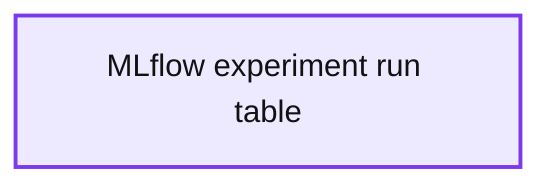

# MLflow for Bayesian Experiment Tracking

- Source: https://www.databricks.com/blog/2021/10/18/mlflow-for-bayesian-experiment-tracking.html
- Published: 2021-10-18
- Authors: Srijith Rajamohan, Ph.D.
- Categories: engineering, data-science-machine-learning
- Images: 1 total, 1 extracted as architecture

This post is the third in a series  on Bayesian inference ([[1]](https://www.databricks.com/blog/2021/01/06/bayesian-modeling-of-the-temporal-dynamics-of-covid-19-using-pymc3.html),[[2]](https://www.databricks.com/blog/2021/06/29/using-bayesian-hierarchical-models-to-infer-the-disease-parameters-of-covid-19.html) ). Here we will illustrate how to use managed [MLflow](https://mlflow.org/) on [Databricks](https://www.databricks.com/) to perform and track Bayesian experiments using the Python package PyMC3. This results in systematic and reproducible experimentation ML pipelines that can be shared across data science teams due to the version control and variable tracking features. The data tracked by MLflow can either be accessed through the managed service provided through Databricks either using the UI or the API.  Data scientists who are not using the managed MLflow service can use the API to access the experiments and the associated data.  On Databricks, access to the data and the different models are managed through the ACL that MLflow provides. The models can then be easily productionized and deployed through a variety of frameworks.

## Tracking Bayesian experiments

### What does MLflow do?

MLflow is an open-source framework for managing your ML lifecycle.  MLflow can either be used using the managed service on Databricks or can be installed as a stand-alone deployment using the open-source libraries available. This post primarily deals with experiment tracking, but we will also share how MLflow can help with storing the trained models in a central repository along with model deployment.  In the context of tracking, MLflow allows you to store:

1. Metrics -- usually related to the model performance, such as deviance or Rhat.
2. Parameters -- variables that help to define your model or run. In a Bayesian setting, this can be your hyperparameter, prior or hyperprior distribution parameters. Note that these are always stored as string values.
3. Tags -- key-value pairs to keep track of information regarding your run, such as the information regarding a major revision of the code to add a feature.
4. Notes -- any information regarding your run that you can enter in the MLflow UI. This can be a qualitative evaluation of the run results and can be quite a useful tool for systematic experimentation.
5. Artifacts  -- this stores a byproduct or output of your experiment such as files, images, etc.

### Setting up a store for open-source MLflow

This section only applies to the open-source deployment of MLflow, since this is automatically taken care of with the hosted MLflow on Databricks. MLflow has a backend store and an artifact store. As the name indicates, the artifact store holds all the artifacts (including metadata) associated with a model run and everything else exists in the backend store. If you are running MLflow locally, you can configure this backend store, which can be a file store or a database-backed store.  You can run a tracking server anywhere if you so choose, as shown below:

You can then specify the tracking server to be the one you set above as:

### The workflow for tracking a Bayesian experiment

On Databricks, all of this is managed for you, minimizing the configuration time needed to get started on your model development workflow. However, the following should be applicable to both managed and opne-source MLflow deployments.  MLflow creates an experiment, identified by an experiment ID, and each experiment consists of a series of runs identified using a run ID. Each run has the associated parameters and artifacts logged per run. Here are the steps to create a workflow:

1. Create an experiment by passing the path to the folder of the experiments, this returns an experiment ID. You can provide a path to store your artifacts, such as files, images etc.
2. Start the experiment with the experiment ID returned from the above step. The PyMC3 inference code is under this context manager.
3. Use tags to version your code and data used.
4. Log the model/ run parameters, specifically the  prior and hyperprior distribution parameters, the number of samples and  tuning samples and the likelihood distribution.

1. Once the model has finished the sampling, the results contained in the trace can be saved as an artifact using the log_artifacts() method. This will be a folder called ‘trace’ that contains all the information regarding the samples that were drawn by each of the chains. The trace information can be summarized by invoking the PyMC3 summary() method on the trace object. The trace summary is a data frame that can be saved as a JSON string object using the log_text() method from MLflow.

### Inspecting an experiment

Once the experiment has completed, you can go back and inspect the MLflow UI or programmatically extract the run information. For example, if  the current experiment ID is ‘10618537’, you can extract the information about the experiment:

### Search for an experiment run

Assuming that you know your experiment ID, you can search for all the runs within an experiment and extract the data stored for this run, as indicated below:

**Summary:** The table shows MLflow runs for experiment 10618537, including statuses, artifact locations, timestamps, and Bayesian tuning parameters.

**Components:**

- MLflow experiment run table
- run_id
- experiment_id
- status
- artifact_uri
- start_time
- end_time
- params.Tuning samples
- params.Prior
- params.Hyperprior
- params.Samples

**Flows:**

- none

**Numbers:** 0, 1, 2, 3, 4, 5, 6; 10618537; 4000; 8000; 0.75; 1.0; 2; 2021-07-14; 03:22:46.494000+00:00; 03:14:00.496000+00:00; 02:23:01.954000+00:00; 02:23:29.134000+00:00; 02:20:56.871000+00:00; 02:21:25.025000+00:00; 02:00:11.119000+00:00; 02:00:38.206000+00:00; 01:35:49.570000+00:00; 01:36:14.184000+00:00; 01:33:20.263000+00:00; 01:33:20.483000+00:00; 01:20:56.571000+00:00; 01:21:21.781000+00:00; 018508223d60464b905c9c863898d63c; 393287b22e59466ddab8ea85052782a9; 4afd12c8dffe44d7bce9792895963ab7; 1f95ea9ad15a43f9bdaecf3228af2051; e0219212905b48218b5cf83b4696cd6e; 353d96140cc94cc18332df364e80297c; 5c37a20c131b4daa88de0e0617456f19; None

source image: https://www.databricks.com/wp-content/uploads/2021/10/MLflow-for-Bayesian-Experiment-Tracking-blog-img-1.jpg

### Accessing the artifacts from a run

The artifacts associated with this run can be listed as shown below. The file size and path are shown for each file

MLflow manages the artifacts for each run, however one can either view and download them using the UI or use the API to access them. In the example below, we load the trace information and the trace summary from a prior run.

If you run the above, you would notice that the trace summary contains the same information as before. The estimates of the parameters that were loaded from the artifacts file or the trace summary, as indicated by their distributions, now become the parameters of the current models. If desired, one can continue to fit new data to our model by using the currently estimated posteriors as the priors for a future training cycle.

## Conclusion

In this post, we have seen how one can use MLflow to systematically perform Bayesian experiments using PyMC3. The logging and tracking functionality provided by MLflow can be accessed either through the managed MLflow provided by Databricks or for open-source users through the API. Models and model summaries can be saved as artifacts and can be shared or reloaded into PyMC3 at a later time.

To learn more, please check out the [attached notebook](https://www.databricks.com/notebooks/hierarchical_bayesian_mlflow_production-2.html).

Check out the notebook to learn more about managed MLflow for Bayesian experiments. Learn more about Bayesian inference in my Coursera courses:

- **Bayesian Inference with MCMC**
- **Introduction to PyMC3 for Bayesian Modeling and Inference**
