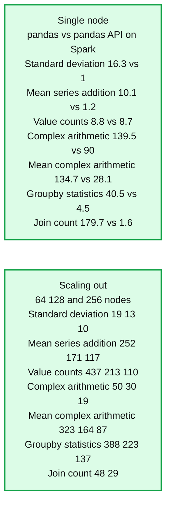
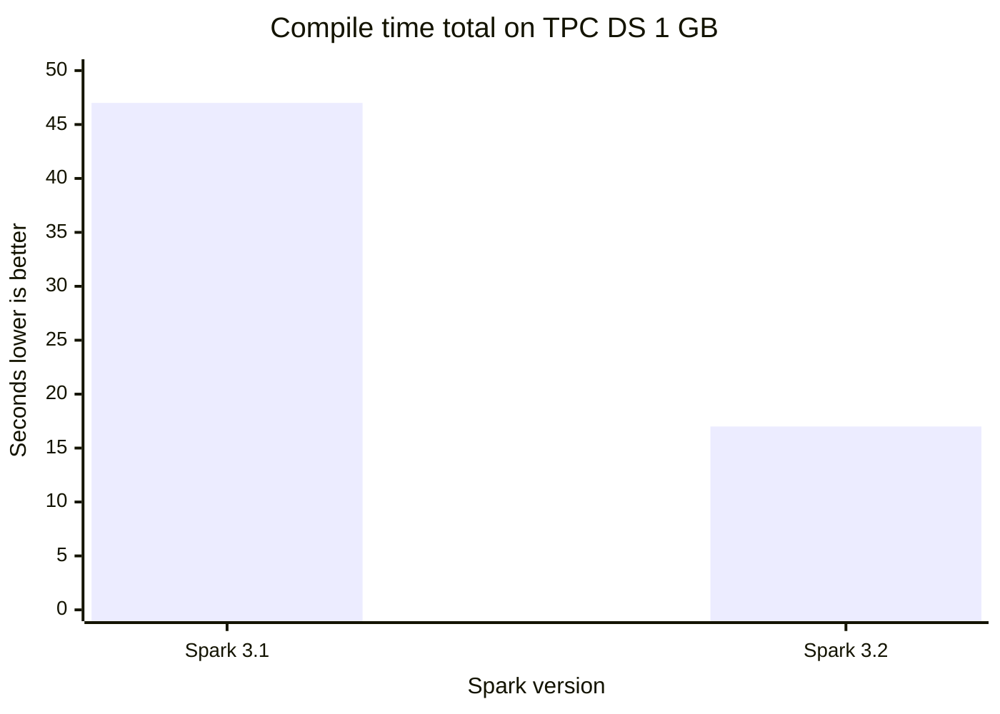
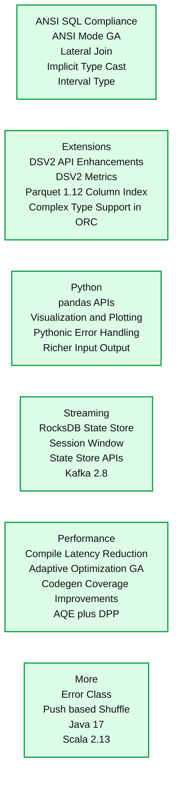

# Introducing Apache Spark™ 3.2

*Now available on Databricks Runtime 10.0*

- Source: https://www.databricks.com/blog/2021/10/19/introducing-apache-spark-3-2.html
- Published: 2021-10-19
- Authors: Gengliang Wang, Wenchen Fan, Hyukjin Kwon, Xiao Li, Reynold Xin
- Categories: engineering, open-source, data-engineering, data-science-machine-learning
- Images: 7 total, 5 extracted as architecture

*Free Edition has replaced Community Edition, offering enhanced features at no cost. Start using *[*Free Edition *](https://login.databricks.com/?intent=SIGN_UP&amp;signup_experience_step=EXPRESS&amp;provider=DB_FREE_TIER&amp;dbx_source=www)*today.*
 

We are excited to announce the availability of [Apache Spark™ 3.2](https://spark.apache.org/releases/spark-release-3-2-0.html) on Databricks as part of [Databricks Runtime 10.0](https://docs.databricks.com/release-notes/runtime/10.0.html). We want to thank the Apache Spark community for their valuable contributions to the Spark 3.2 release.

The number of monthly maven downloads of Spark has rapidly increased to **20 million**. The year-over-year growth rate represents a doubling of monthly Spark downloads in the last year. Spark has become the most widely-used engine for executing data engineering, data science and machine learning on single-node machines or clusters.

**Summary:** The chart shows monthly Maven downloads of Apache Spark rising from roughly 9 million in August 2020 to 20,156,336 in August 2021, with year-over-year growth exceeding 100%.

**Components:**

- Maven Downloads of Apache Spark: monthly download metric
- Monthly bars: Maven download totals from Aug 20 through Aug 21
- Growth trend line: year-over-year download growth
- Y-axis: download-count scale
- X-axis: monthly timeline
- YoY Growth annotation: greater than 100%

**Flows:**

- Aug 20 -> Aug 21: Increasing monthly Maven downloads
- Monthly bars -> Growth trend line: Download totals forming an upward trend

**Numbers:**

- 22,000,000
- 16,500,000
- 11,000,000
- 5,500,000
- 0
- 20,156,336
- >100%
- Aug 20
- Oct 20
- Dec 20
- Feb 21
- Apr 21
- Jun 21
- Aug 21

source image: https://www.databricks.com/wp-content/uploads/2021/10/Introducing-Apache-Spark-3.2-blog-img-2.jpg

Continuing with the objectives to make Spark even more unified, simple, fast and scalable, Spark 3.2 extends its scope with the following features:

- **Introducing pandas API on Apache Spark** to unify small data API and big data API (learn more [here](https://www.databricks.com/blog/2021/10/04/pandas-api-on-upcoming-apache-spark-3-2.html)).
- **Completing the ANSI SQL compatability mode** to simplify migration of SQL workloads.
- **Productionizing adaptive query execution **to speed up Spark SQL at runtime.
- **Introducing RocksDB statestore **to make state processing more scalable.

In this blog post, we summarize some of the higher-level features and improvements. Keep an eye out for upcoming posts that dive deeper into these features. For a comprehensive list of major features across all Spark components and JIRA tickets resolved, please see the Apache Spark 3.2.0 [release notes](https://spark.apache.org/releases/spark-release-3-2-0.html).

## Unifying small data API and big data API

Python is the most widely used language on Spark. To make Spark more Pythonic, the pandas API was introduced to Spark, as part of [Project Zen](https://issues.apache.org/jira/browse/SPARK-32082) (see also [Project Zen: Making Data Science Easier in PySpark](https://www.databricks.com/session_na21/project-zen-making-data-science-easier-in-pyspark) from Data + AI Summit 2021). Now, the existing users of pandas can scale out their pandas applications with one line change. As shown below, performance can be greatly improved in both single-node machines [left] and multi-node Spark clusters [right], thanks to the sophisticated optimizations in the Spark engine.

*Figure. pandas vs. pandas API on Spark*

**Summary:** The benchmark compares pandas with pandas API on Spark for single-node performance and multi-node scaling across six operations.

**Components:**

- pandas, the baseline Python data analysis technology
- pandas API on Spark, the Spark-optimized pandas-compatible technology
- Single node benchmark, measuring elapsed time in seconds
- Multi-node Spark cluster benchmark, measuring elapsed time across 64, 128, and 256 nodes
- Benchmark operations: standard deviation, mean of series addition, value counts, complex arithmetic, mean of complex arithmetic, groupby statistics, and join count

**Flows:**

- none

**Numbers:**

- Left panel axis: 0, 45, 90, 135, 180 seconds
- Right panel axis: 0, 125, 250, 375, 500 seconds
- Single node values in operation order:
  - Standard deviation: pandas 16.3, pandas API on Spark 1
  - Mean of series addition: pandas 10.1, pandas API on Spark 1.2
  - Value counts: pandas 8.8, pandas API on Spark 8.7
  - Complex arithmetic: pandas 139.5, pandas API on Spark 90
  - Mean of complex arithmetic: pandas 134.7, pandas API on Spark 28.1
  - Groupby statistics: pandas 40.5, pandas API on Spark 4.5
  - Join count: pandas 179.7, pandas API on Spark 1.6
- Scaling out values in operation order:
  - Standard deviation: 64 nodes 19, 128 nodes 13, 256 nodes 10
  - Mean of series addition: 64 nodes 252, 128 nodes 171, 256 nodes 117
  - Value counts: 64 nodes 437, 128 nodes 213, 256 nodes 110
  - Complex arithmetic: 64 nodes 50, 128 nodes 30, 256 nodes 19
  - Mean of complex arithmetic: 64 nodes 323, 128 nodes 164, 256 nodes 87
  - Groupby statistics: 64 nodes 388, 128 nodes 223, 256 nodes 137
  - Join count: 64 nodes 48, 128 nodes 29

source image: https://www.databricks.com/wp-content/uploads/2021/10/Introducing-Apache-Spark-3.2-blog-img-3.jpg

Figure. pandas vs. pandas API on Spark

At the same time, Python users can also seamlessly leverage the unified analytics functionality provided in Spark, including querying data via SQL, streaming processing and scalable machine learning (ML). The new pandas API also provides interactive data visualization powered by the [plotly](https://plotly.com/python/) backend.

For more details, see the blog post  "[Pandas API on Upcoming Apache Spark™ 3.2](https://www.databricks.com/blog/2021/10/04/pandas-api-on-upcoming-apache-spark-3-2.html)"

## Simplifying SQL migration

More ANSI SQL features (e.g., lateral join support) were added. After more than one year of development, the ANSI SQL mode is GA in this release. To avoid massive behavior-breaking changes, the mode `spark.sql.ansi.enabled` is still disabled by default. The ANSI mode includes the following major behavior changes:

- Runtime error throwing instead of silent ignorance with null results when the inputs to a SQL operator/function are invalid ([SPARK-33275](https://issues.apache.org/jira/browse/SPARK-33275)). For example, integer value overflow errors on arithmetic operations, or parsing errors on casting string to numeric/timestamp types.
- Standardized type coercion syntax rules ([SPARK-34246](https://issues.apache.org/jira/browse/SPARK-34246)). The new rules define whether values of a given data type can be promoted to another data type implicitly based on [the data type precedence list](https://docs.databricks.com/sql/language-manual/sql-ref-datatype-rules.html), which is more straightforward than the default non-ANSI mode.
- New explicit cast syntax rules ([SPARK-33354](https://issues.apache.org/jira/browse/SPARK-33354)). When Spark queries contain illegal type casting (e.g., date/timestamp types are cast to numeric types) compile-time errors are thrown informing the user of invalid conversions.

This release also includes some new initiatives that have not been fully finished yet. For example, standardize exception messages in Spark ([SPARK-33539](https://issues.apache.org/jira/browse/SPARK-33539)); introducing ANSI interval type ([SPARK-27790](https://issues.apache.org/jira/browse/SPARK-27790)) and improving the coverage of correlated subqueries ([SPARK-35553](https://issues.apache.org/jira/browse/SPARK-35553)).

## Speeding up Spark SQL at runtime

[Adaptive Query Execution (AQE)](https://www.databricks.com/blog/2020/05/29/adaptive-query-execution-speeding-up-spark-sql-at-runtime.html) is enabled by default in this release ([SPARK-33679](https://issues.apache.org/jira/browse/SPARK-33679)). For performance improvements, the AQE can re-optimize the query execution plans based on the accurate statistics collected at runtime. Maintenance and pre-collection of statistics are expensive in big data. Lacking accurate statistics often causes inefficient plans, no matter how advanced the optimizer is. In this release, AQE becomes fully compatible with all the existing query optimization techniques (e.g., [Dynamic Partition Pruning](https://www.databricks.com/session_eu19/dynamic-partition-pruning-in-apache-spark)) to re-optimize the join strategies, skew join and shuffle partition coalescence.

Both small data and big data should be processed in a highly efficient manner in the unified data analytics system. Short query performance becomes also critical. The overhead of Spark query compilation in complex queries is significant when the volume of processed data is considerably small. To further reduce the query compilation latency, Spark 3.2.0 prunes unnecessary query plan traversals in analyzer/optimizer rules ([SPARK-35042](https://issues.apache.org/jira/browse/SPARK-35042), [SPARK-35103](https://issues.apache.org/jira/browse/SPARK-35103)) and speeds up the construction of new query plans ([SPARK-34989](https://issues.apache.org/jira/browse/SPARK-34989)). As a result, the compile time of TPC-DS queries is reduced by **61%**, compared to Spark 3.1.2.

**Summary:** Benchmark chart comparing compile time for TPC-DS 1 GB queries in Spark 3.1 and Spark 3.2, where lower seconds are better.

**Components:**

- Spark 3.1 benchmark
- Spark 3.2 benchmark
- Compile time measured in seconds

**Flows:**

- none

**Numbers:** 3.1, 3.2, 1 GB, 0, 12.5, 25, 37.5, 50, 61%

source image: https://www.databricks.com/wp-content/uploads/2021/10/Introducing-Apache-Spark-3.2-blog-img-5.png

## More scalable state processing streaming

The default implementation of state store in Structured Streaming is not scalable since the amount of state that can be maintained is limited by the heap size of the executors. In this release, Databricks contributed to the Spark community RocksDB-based state store implementation, which has been used in Databricks production for more than four years. This state store can avoid full scans by sorting keys, and serve data from the disk without relying on the heap size of executors.

**Summary:** The diagram shows a Spark Executor using a RocksDB-backed state store for stateful tasks and synchronizing local RocksDB files with a distributed file system.

**Components:**

- Spark Executor
- Stateful Task
- State store API
- State store
- RocksDB
- Distributed File System

**Flows:**

- Stateful Task -> State store: Read and write state for the task's partition
- State store -> Stateful Task: Return partition state
- State store -> Distributed File System: Sync local RocksDB files
- Distributed File System -> State store: Sync local RocksDB files

**Numbers:** none

```mermaid
%% RocksDB state store architecture inside a Spark Executor
flowchart LR
    task[Stateful Task<br/>Read and write state for task partition]
    api[State store API]
    store[State store]
    rocks[RocksDB]
    dfs[Distributed File System]

    task <--> |read and write partition state| api
    api <--> |state access| store
    store --> |local database files| rocks
    rocks <--> |sync local RocksDB files| dfs

    classDef client   fill:#dbeafe,stroke:#2563eb,stroke-width:2px,color:#111
    classDef service  fill:#dcfce7,stroke:#16a34a,stroke-width:2px,color:#111
    classDef store    fill:#ede9fe,stroke:#7c3aed,stroke-width:2px,color:#111
    classDef cache    fill:#fef3c7,stroke:#d97706,stroke-width:2px,color:#111
    classDef queue    fill:#cffafe,stroke:#0891b2,stroke-width:2px,color:#111
    classDef critical fill:#fee2e2,stroke:#dc2626,stroke-width:4px,color:#111
    classDef external fill:#e5e7eb,stroke:#6b7280,stroke-width:2px,color:#111,stroke-dasharray:4 3
    classDef decision fill:#fce7f3,stroke:#db2777,stroke-width:2px,color:#111

    class task client
    class api service
    class store,rocks store
    class dfs external
```

source image: https://www.databricks.com/wp-content/uploads/2021/10/Introducing-Apache-Spark-3.2-blog-img-6.jpg

In addition, state store APIs are enriched with the API for prefix match scan ([SPARK-35861](https://issues.apache.org/jira/browse/SPARK-35861)) for efficiently supporting event time based sessionization ([SPARK-10816](https://issues.apache.org/jira/browse/SPARK-10816)), which allow users to do aggregations `on session windows over eventTime`. For more details, please read the blog post "[Native support of session window in Apache Spark's Structured Streaming](https://www.databricks.com/blog/2021/10/12/native-support-of-session-window-in-spark-structured-streaming.html)".

## Other updates in Spark 3.2

In addition to these new features, the release focuses on usability, stability, and refinement, resolving around 1700 JIRA tickets. It’s the result of contributions from over 200 contributors, including individuals as well as companies such as Databricks, Apple, Linkedin, Facebook, Microsoft, Intel, Alibaba, Nvidia, Netflix, Adobe and many more. We’ve highlighted a number of key SQL, Python and streaming data advancements in Spark for this blog post, but there are many additional capabilities in the 3.2 milestone, including codegen coverage improvements and connector enhancements, which you can  learn more about in the [release notes](https://spark.apache.org/releases/spark-release-3-2-0.html).

**Summary:** Apache Spark 3.2 feature overview organized across ANSI SQL compliance, extensions, Python, streaming, performance, and additional capabilities.

**Components:**

- ANSI SQL Compliance: ANSI Mode GA, Lateral Join, Implicit Type Cast, Interval Type
- Extensions: DSV2 API Enhancements, DSV2 Metrics, Parquet 1.12 Column Index, Complex Type Support in ORC
- Python: pandas APIs, Visualization and Plotting, Pythonic Error Handling, Richer Input Output
- Streaming: RocksDB State Store, Session Window, State Store APIs, Kafka 2.8
- Performance: Compile Latency Reduction, Adaptive Optimization GA, Codegen Coverage Improvements, AQE plus DPP
- More: Error Class, Push based Shuffle, Java 17, Scala 2.13

**Flows:**

- none

**Numbers:** 3.2, 1.12, 2.8, 17, 2.13

source image: https://www.databricks.com/wp-content/uploads/2021/10/Introducing-Apache-Spark-3.2-blog-img-7.jpg

## Get started with Spark 3.2 today

If you want to try out Apache Spark 3.2 in the Databricks Runtime 10.0, sign up for the [Databricks Community Edition or Databricks Trial](https://www.databricks.com/try-databricks), both of which are free, and get started in minutes. Using Spark 3.2 is as simple as selecting version "10.0" when launching a cluster.
