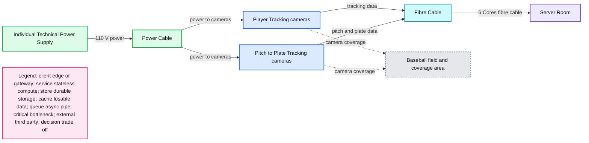
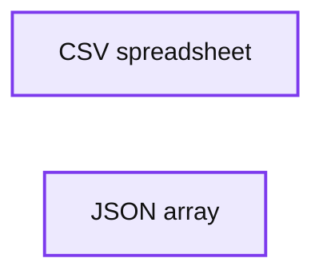
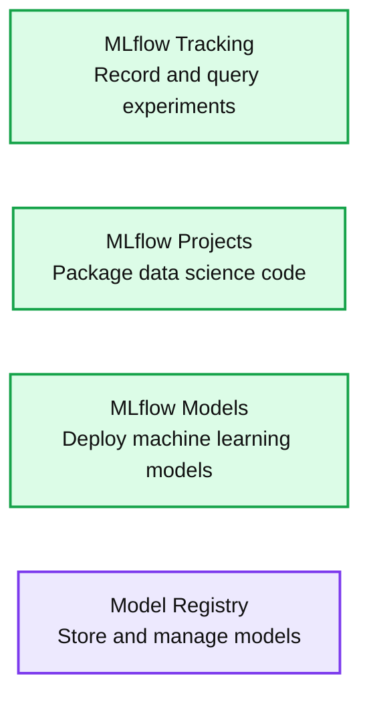
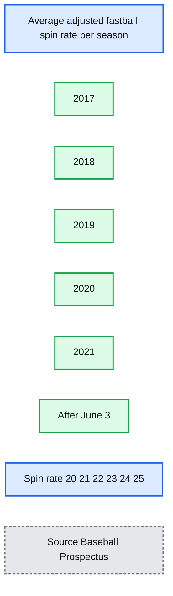

# Moneyball 2.0: Real-time Decision Making With MLB’s Statcast Data

- Source: https://www.databricks.com/blog/2021/10/28/moneyball-2-0-real-time-decision-making-with-mlbs-statcast-data.html
- Published: 2021-10-28
- Authors: Max Wittenberg
- Categories: engineering, data-science-machine-learning
- Images: 8 total, 6 extracted as architecture

The Oakland Athletics baseball team in 2002 used data analysis and quantitative modeling to identify undervalued players and create a competitive lineup on a limited budget. The book *Moneyball*, written by Michael Lewis, highlighted the A’s ‘02 season and gave an inside glimpse into how unique the team’s strategic data modeling was, for its time. Fast forward 20 years – the use of data science and quantitative modeling is now a common practice among all sports franchises and plays a critical role in scouting, roster construction, game-day operations and season planning.

In 2015, the Major League Baseball (MLB) introduced [Statcast](https://en.wikipedia.org/wiki/Statcast), a set of cameras and radar systems installed in all 30 MLB stadiums. Statcast generates up to seven terabytes of data during a game, capturing every imaginable data point and metric related to pitching, hitting, running and fielding, which the system collects and organizes for consumption. This explosion of data has created opportunities to analyze the game in real-time, and with the application of machine learning, teams are now able to make decisions that influence the outcome of the game, pitch by pitch. It’s been 20 seasons since the A's first introduced the use of data modeling to baseball. Here’s an inside look at how professional baseball teams use technologies like [Databricks](https://www.databricks.com/) to create the modern-day *Moneyball* and gain competitive advantages that data teams provide to coaches and players on the field.

*Figure 1: Position and scope of Hawkeye cameras at a baseball stadium*

**Summary:** Hawkeye cameras surround a baseball field, using fibre cables to connect tracking data to a server room and individual 110 V power supplies for each camera.

**Components:**

- Player Tracking cameras using yellow markers
- Pitch to Plate Tracking cameras using orange markers
- Server Room
- Individual Technical Power Supply
- Fibre Cable
- Power Cable
- Baseball field and camera coverage area

**Flows:**

- Player Tracking cameras -> Server Room: tracking data over fibre cable
- Pitch to Plate Tracking cameras -> Server Room: pitch and plate tracking data over fibre cable
- Individual Technical Power Supply -> Player Tracking cameras: 110 V power over power cable
- Individual Technical Power Supply -> Pitch to Plate Tracking cameras: 110 V power over power cable

**Numbers:** 6 Cores; 110 V

source image: https://www.databricks.com/wp-content/uploads/2021/10/moneyball-2-bog-img-1.jpg

*Figure 2: Numbers represent events during a play captured by Statcast*

*Figure 3: Sample of data collected by Statcast*

**Summary:** A sample Statcast data table showing pitch details, game date, player identifiers, pitch outcomes, and descriptions.

**Components:**

- pitch_type column, technology unspecified
- game_date column, technology unspecified
- release_speed column, technology unspecified
- release_pos_x column, technology unspecified
- release_pos_z column, technology unspecified
- player_name column, technology unspecified
- batter column, technology unspecified
- pitcher column, technology unspecified
- events column, technology unspecified
- description column, technology unspecified

**Flows:**

- none

**Numbers:** 2020-09-18T00:00:00.000+0000; 91; 90.8; 91.2; 91.4; 90.5; 91.8; 89.7; 89.8; 95; 1.59; 1.57; 1.8; 1.83; 1.69; 1.74; 1.7; 1.6; 1.61; 2.9; 5.02; 5; 4.95; 4.81; 4.93; 4.84; 4.96; 4.95; 5.01; 5.38; 600524; 595411; 669720; 578428; 664040; 656945

source image: https://www.databricks.com/wp-content/uploads/2021/10/moneyball-2-0-real-time-decision-making-with-mlbs-statcast-data-img-3.png

## Background

Data teams need to be faster than ever to provide analytics to coaches and players so they can make decisions as the game unfolds. The decisions made from real-time analytics can dramatically change the outcome of a game and a team’s season. One of the more memorable examples of this was in Game six of the 2020 world series. The Tampa Bay Rays were leading the Los Angeles Dodgers 1-0 in the sixth inning when Rays Pitcher Blake Snell was [pulled from the mound](https://www.sportingnews.com/us/mlb/news/blake-snell-kevin-cash-analytics-explained-world-series/15ja52nunza2b1b37untxyltk3) while pitching arguably one of the best games of his career, a decision head coach Kevin Cash said was made with the insights from their data analytics. The Rays went on to lose the game and world series. Hindsight is always 20-20, but it goes to show how impactful data has become to the game. Coaching staff task their data teams with assisting them in making critical decisions, for example, should a pitcher throw another inning or make a substitution to avoid a potential injury? Does a player have a greater probability of success stealing from first to second base, or from second to third?

I have had the opportunity to work with many MLB franchises and discuss what their priorities and challenges are related to data analytics. Typically, I hear three recurring themes their data teams are focused on that have the most value in helping set their team up for success on the field:

1. **Speed:** Since every MLB team has access to the Statcast data during a game, one way to create a competitive advantage is to ingest and process the data faster than your opponent. The average length of time between pitches is 23 seconds, and this window of time represents a benchmark from which Statcast data can be ingested and processed for coaches to use to make decisions that can impact the outcome of the game.
2. **Real-Time Analytics:** Another competitive advantage for teams is the creation of insights from their machine learning models in real-time. An example of this is knowing when to substitute out a pitcher from fatigue, where a model interprets pitcher movement and data points created from the pitch itself and is able to forecast deterioration of performance pitch by pitch.
3. **Ease of Use:** Analytics teams run into problems ingesting the volumes of data Statcast produces when running data pipelines on their local computers. This gets even more complicated when trying to scale their pipelines to capture minor league data and integrate with other technologies. Teams want a collaborative, scalable analytics platform that automates data ingestion with performance, creating the ability to impact in-game decision-making.

Baseball teams using Databricks have developed solutions for these priorities and [several others](https://www.databricks.com/blog/2020/06/04/how-the-minnesota-twins-scaled-pitch-scenario-analysis-to-measure-player-performance-part-1.html). They have shaped what the modern-day version of *Moneyball* looks like. What follows is their successful framework explained in an easy-to-understand way.

## Getting the data

When a pitcher throws a baseball, Hawkeye cameras collect the data and save it to an application that teams are able to access using an application programming interface (API) owned by the MLB. You can think of an API as an intermediate connection between two computers to exchange information. The way this works is: a user sends a request to an API, the API confirms that the user has permission to access the data and then sends back the requested data for the user to consume. To use a restaurant as an analogy – a customer tells a waiter what they want to eat, the waiter informs the kitchen what the customer wants to eat, the waiter serves the food to the customer. The waiter in this scenario is the API.

*Figure 4: Example of how an API works using a restaurant analogy.*

**Summary:** The diagram shows a user sending requests through an API to an application and receiving responses containing requested data.

**Components:**

- User - technology not specified
- API - technology not specified
- Application - technology not specified

**Flows:**

- User -> API: Request
- API -> User: Response
- API -> Application: Request
- Application -> API: Response

**Numbers:** none

source image: https://www.databricks.com/wp-content/uploads/2021/10/moneyball-2-0-real-time-decision-making-with-mlbs-statcast-data-img-4.png

This simple method of retrieving data is called a “batch” style of data collection and processing, where data is gathered and processed once. As noted earlier, however, data is typically available through the API every 23 seconds (the average time between pitches). This means data teams need to make continuous requests to the API in a method known as “streaming,” where data is continuously collected and processed. Just as a waiter can quickly become overworked fulfilling customers' needs, making continuous API requests for data creates some challenges in data pipelines. With the assistance from these data teams, however, we have created code to accommodate continuously collecting Statcast data during a game. You can see an example of the code using a test API below.

*Figure 5: Interacting with an API to retrieve and save data.*

This code decouples the steps of getting data from the API and transforming it into usable information which in the past, we have seen, can cause latency in data pipelines. Using this code, the Statcast data is saved as a file to cloud storage automatically and efficiently. The next step is to ingest it for processing.

## Automatically load data with Auto Loader

As pitch and play data is continuously saved to cloud storage, it can be ingested automatically using a Databricks feature called [Auto Loader](https://docs.databricks.com/spark/latest/structured-streaming/auto-loader.html). Auto Loader scans files in the location they are saved in cloud storage and loads the data into Databricks where data teams begin to transform it for their analytics. Auto Loader is easy to use and incredibly reliable when scaling to ingest larger volumes of data in batch and streaming scenarios. In other words, Auto Loader works just as well for small and large data sizes in batch and streaming scenarios. The Python code below shows how to use Auto Loader for streaming data.

*Figure 6: Set up of Auto Loader to stream data*

One challenge in this process is working with the file format in which the Statcast is saved, a format called JSON. We are typically privileged to work with data that is already in a structured format, such as the CSV file type, where data is organized in columns and rows. The JSON format organizes data into arrays and despite its wide use and adoption, I still find it difficult to work with, especially in large sizes. Here’s a comparison of data saved in a CSV format and a JSON format.

*Figure 7: Comparison of CSV and JSON formats*

**Summary:** Comparison of tabular CSV data organized in rows and columns with JSON data organized as arrays of objects.

**Components:**

- CSV spreadsheet representation
- JSON array representation

**Flows:**

- none

**Numbers:** 1, 2, 3, 4, 5, 6, 7, 8, 9, 10, 11, 12, 13, 14, 15, 16, 20,000, 22,500, 24,000, 25,000, 27,000, 28,000, 30,000, 35,000, 45,000, 70,000, 75,000, 100,000, JSON id 1, JSON id 2, salary 1,000

source image: https://www.databricks.com/wp-content/uploads/2021/10/moneyball-2-0-real-time-decision-making-with-mlbs-statcast-data-img-7.png

It should be obvious which of these two formats data teams prefer to work with. The goal then is to load Statcast data in the JSON format and transform it into the friendlier CSV format. To do this, we can use the [semi-structured data support](https://docs.databricks.com/spark/latest/structured-streaming/auto-loader-json.html) available in Databricks, where basic syntax allows us to extract and transform the nested data you see in the JSON format to the structured CSV style format. Combining the functionality of Auto Loader and the simplicity of semi-structured data support creates a powerful data ingestion method that makes the transformation of JSON data easy.

*Using Databricks’ semi-structured data support with Auto Loader*

As the data is loaded in, we save it to a Delta table to start working with it further. [Delta Lake](https://www.databricks.com/product/delta-lake-on-databricks)is an open format storage layer that brings reliability, security, and performance to a data lake for both streaming and batch processing and is the foundation of a cost-effective, highly scalable data platform. Semi-structured support with Delta allows you to retain some of the nested data if needed. The syntax allows flexibility to maintain nested data objects as a column within a Delta table without the need to flatten out all of the JSON data. Baseball analytics teams use Delta to version Statcast data and enforce specific needs to run their analytics on while organizing it in a friendly structured format.

*Auto Loader writing data to a Delta table as a stream*

With Auto Loader continuously streaming in data after each pitch, semi-structured data support transforming it into a consumable format, and Delta Lake organizing it for use, data teams are now ready to build analytics that gives their team the competitive edge on the field.

## Machine learning for insights

Recall the Rays pulling Blake Snell from the mound during the World Series -- that decision came from insights coaches saw in their predictive models. Statistical analysis of Snell’s historical Statcast data provided by Billy Heylen of sportingnews.com indicated Snell had not pitched more than six innings since July 2019, had a lower probability of striking out a batter when facing them for the third time in a game, and was being relieved by teammate Nick Anderson, whose own pitch data suggests was one the strongest closers in the MLB with a 0.55 earned run average (ERA) and 0.49 walks and hits per innings pitched (WHIP) during 19 regular-season games he pitched in 2020. Predictive models analyze data like this in real-time and provide supporting evidence and recommendations coaches use to make critical decisions.

Machine learning models are relatively easy to build and use, but data teams often struggle to implement them into streaming use cases. Add in the complexity of how models are managed and stored and machine learning can quickly become out of reach. Fortunately, data teams use [MLflow](https://docs.databricks.com/applications/mlflow/index.html)to manage their machine learning models and implement them into their data pipelines. MLflow is an open-source platform for managing the end-to-end machine learning lifecycle and includes support for tracking predictive results, a model registry for centralizing models that are in use and others in development, and a serving capability for using models in data pipelines.

*Figure 10: MLFlow overview*

**Summary:** The diagram presents four MLflow capabilities for managing the machine learning lifecycle.

**Components:**

- MLflow Tracking - records and queries experiment code, data, configuration, and results.
- MLflow Projects - packages data science code for reproducible runs.
- MLflow Models - deploys machine learning models across serving environments.
- Model Registry - centrally stores, annotates, discovers, and manages models.

**Flows:**

- none

**Numbers:** none

source image: https://www.databricks.com/wp-content/uploads/2021/10/moneyball-2-0-real-time-decision-making-with-mlbs-statcast-data-img-10.png

To implement machine learning algorithms and models to real-time use cases, data teams use the model registry where a model is able to read data sitting in a Delta table and create predictions that are then used during the game. Here’s an example of how to use a machine learning model while data is automatically loaded with Auto Loader:

*Getting a machine learning model from the registry and using it with Auto Loader*

The outputs a machine learning model creates can then be displayed in a data visualization or dashboard and used as printouts or shared on a tablet during a game. MLB franchises working on Databricks are developing fascinating use cases that are being used during games throughout the season. Predictive models are proprietary to the individual teams, but here’s an actual use case running on Databricks that demonstrates the power of real-time analytics in baseball.

## Bringing it all together with spin ratios and sticky stuff

The MLB introduced a [new rule](https://www.washingtonpost.com/sports/2021/06/15/mlb-pitchers-sticky-stuff-enforcement-suspensions/) for the 2021 season meant to discourage pitcher’s use of “sticky stuff,” a substance hidden in mitts, belts, or hats that when applied to a baseball can dramatically increase the spin ratio of a pitch, making it difficult for batters to hit. The rule suspends for 10 games pitchers discovered using sticky stuff. Coaches on opposing teams have the ability to request an umpire check for the substance if they suspect a pitcher to be using it during a game. Spin ratio is a data point that is captured by Hawkeye cameras and with real-time analytics and machine learning, teams are now able to make justified requests to umpires with the hopes of catching a pitcher using the material.

*Figure 12: Illustration of how spin affects a pitch*

*Figure 13: Trending spin rate of fastballs per season and after rule introduction on June 3, 2021*

**Summary:** The chart compares average adjusted fastball spin rate by season from 2017 through 2021 and after June 3.

**Components:**

- 2017 season bar
- 2018 season bar
- 2019 season bar
- 2020 season bar
- 2021 season bar
- After June 3 bar
- Spin rate scale from 20 to 25
- Source Baseball Prospectus

**Flows:**

- none

**Numbers:** 20, 21, 22, 23, 24, 25, 2017, 2018, 2019, 2020, 2021, June 3

source image: https://www.databricks.com/wp-content/uploads/2021/10/moneyball-2-0-real-time-decision-making-with-mlbs-statcast-data-img-13.png

Following the same framework outlined above, we ingest Statcast data pitch by pitch and have a dashboard that tracks the spin ratio of the ball for all pitchers during all MLB games. Using machine learning models, predictions are sent to the dashboard that flag outliers against historical data and the pitcher's performance in the active game, which can alert coaches when they fall outside of ranges anticipated by the model. With Auto Loader, Delta Lake, and MLflow all data ingestion and analytics happen in real-time.

*Figure 14: Dashboard for Sticky Stuff detection in real-time*

Technologies like Statcast and Databricks have brought real-time analytics to sports and changed the paradigm of what it means to be a data-driven team. As data volumes continue to grow, having the right architecture in place to capture real-time insights will be critical to staying one step ahead of the competition. Real-time architectures will be increasingly important as teams acquire and develop players, plan for the season and develop an analytically enhanced approach to their franchise. [Ask about](https://www.databricks.com/company/contact) our Solution Accelerator with Databricks partner [Lovelytics](https://lovelytics.com/), which provides sports teams with all the resources they need to quickly create use cases like the ones described in this blog.
