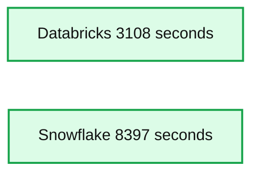
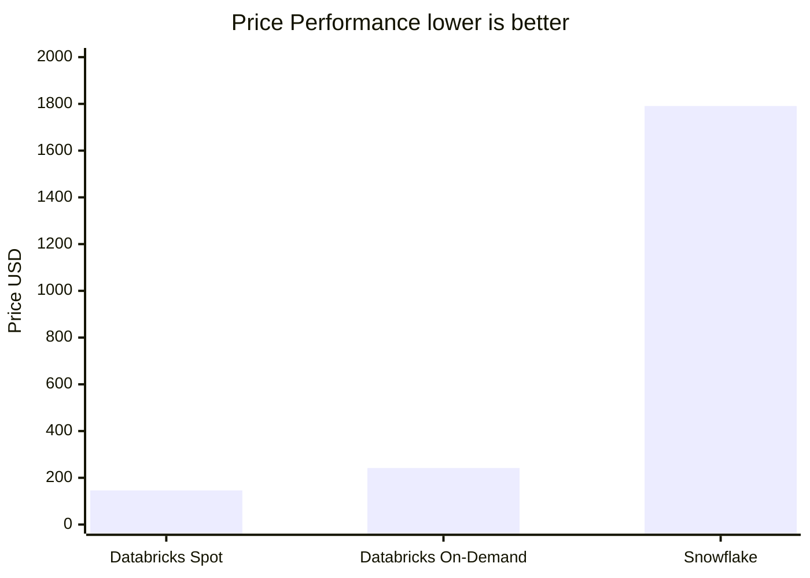

# Databricks Sets Official Data Warehousing Performance Record

- Source: https://www.databricks.com/blog/2021/11/02/databricks-sets-official-data-warehousing-performance-record.html
- Published: 2021-11-02
- Authors: Reynold Xin, Mostafa Mokhtar
- Categories: data-warehousing, company, news
- Images: 2 total, 2 extracted as architecture

Today, we are proud to announce that [Databricks SQL](https://www.databricks.com/product/databricks-sql) has set a [new world record in 100TB TPC-DS](http://www.tpc.org/tpcds/results/tpcds_result_detail5.asp?id=121103001), the gold standard performance benchmark for data warehousing. **Databricks SQL outperformed the previous record by 2.2x**. Unlike most other benchmark news, this result has been formally audited and reviewed by the TPC council.

These results were corroborated by research from Barcelona Supercomputing Center, which frequently runs benchmarks that are derivative of TPC-DS on popular data warehouses. **Their latest research benchmarked Databricks and Snowflake, and found that Databricks was 2.7x faster and 12x better in terms of price performance**. This result validated the thesis that data warehouses such as Snowflake become prohibitively expensive as data size increases in production.

Databricks has been rapidly developing full blown data warehousing capabilities directly on data lakes, bringing the best of both worlds in one data architecture dubbed [the data lakehouse](https://www.databricks.com/discoverlakehouse). We announced our full suite of data warehousing capabilities as Databricks SQL in November 2020. The open question since then has been whether an open architecture based on a lakehouse can provide the performance, speed, and cost of the classic data warehouses. This result proves beyond any doubt that this is possible and achievable by the lakehouse architecture.

Rather than just sharing the results, we would like to take this opportunity to share with you the story of how we accomplished this level of performance and the effort that went into it. But we'll start with the results:

## TPC-DS World Record

Databricks SQL delivered [32,941,245 QphDS @ 100TB](http://www.tpc.org/tpcds/results/tpcds_result_detail5.asp?id=121103001). This beats the previous world record held by Alibaba's custom built system, which achieved [14,861,137 QphDS @ 100TB](http://tpc.org/tpcds/results/tpcds_result_detail5.asp?id=119091601), by 2.2x. (Alibaba had an impressive system supporting the world's largest e-commerce platform). Not only did Databricks SQL significantly beat the previous record, it did so by lowering the total cost of the system by 10% (based on published listed pricing without any discounts).

It's perfectly normal if you don't know what the unit QphDS means. (We don't either without looking at the formula.) QphDS is the primary metric for TPC-DS, which represents the performance of a combination of workloads, including (1) loading the data set, (2) processing a sequence of queries (power test), (3) processing several concurrent query streams (throughput test), and (4) running data maintenance functions that insert and delete data.

The aforementioned conclusion is further supported by the research team at Barcelona Supercomputing Center (BSC) that recently ran a different benchmark derived from TPC-DS comparing Databricks SQL and Snowflake, and found that Databricks SQL was 2.7x faster than a similarly sized Snowflake setup.

*Chart 1: Elapsed time for test derived from TPC-DS 100TB Power Run, by Barcelona Supercomputing Center.*

**Summary:** Benchmark chart comparing elapsed time for Databricks and Snowflake on a TPC-DS 100TB Power Run test.

**Components:**

- Databricks: Databricks SQL
- Snowflake: Snowflake data warehouse
- Barcelona Supercomputing Center: benchmark source

**Flows:**

- none

**Numbers:** 100TB, 10,000 seconds, 7,500 seconds, 5,000 seconds, 2,500 seconds, 0 seconds, 3,108 seconds, 8,397 seconds

source image: https://www.databricks.com/wp-content/uploads/2021/11/tpc-ds-blog-img-3.png

Chart 1: Elapsed time for test derived from TPC-DS 100TB Power Run, by Barcelona Supercomputing Center.

---

*Chart 2: Price/Performance for test derived from TPC-DS 100TB Power Run, by Barcelona Supercomputing Center.*

**Summary:** The chart compares price performance for a TPC-DS 100TB Power Run test across Databricks Spot, Databricks On-Demand, and Snowflake, where lower cost is better.

**Components:**

- Databricks Spot - Spot compute pricing
- Databricks On-Demand - On-demand compute pricing
- Snowflake - Snowflake data warehouse pricing
- Price USD - Cost axis

**Flows:**

- none

**Numbers:** 100TB; $2,000; $1,500; $1,000; $500; 0; $146; $242; $1,791; lower is better

source image: https://www.databricks.com/wp-content/uploads/2021/11/tpc-ds-blog-img-4.png

Chart 2: Price/Performance for test derived from TPC-DS 100TB Power Run, by Barcelona Supercomputing Center.

## What is TPC-DS?

[TPC-DS](http://tpc.org/tpcds/default5.asp) is a data warehousing benchmark defined by the Transaction Processing Performance Council (TPC). TPC is a non-profit organization started by the database community in the late 80s, focusing on creating benchmarks that emulate real-world scenarios and, as a result, can be used objectively to measure database systems' performance. TPC has had a profound impact in the field of databases, with decade-long "benchmarking wars" between established vendors like Oracle, Microsoft, and IBM that have pushed the field forward.

The "DS" in TPC-DS stands for "decision support." It includes 99 queries of varying complexity, from very simple aggregations to complex pattern mining. It is a relatively new (work started in mid 2000s) benchmark to reflect the growing complexity of analytics. In the last decade or so, TPC-DS has become the de facto standard data warehousing benchmark, adopted by virtually all vendors.

However, due to its complexity, many data warehouse systems, even the ones built by the most established vendors, have tweaked the official benchmark so their own systems would perform well. (Some common tweaks include removing certain SQL features such as rollups or changing data distribution to remove skew). This is one of the reasons why there have been very few submissions to the official TPC-DS benchmark, despite more than 4 million pages on the Internet about TPC-DS. The tweaks also ostensibly explain why most vendors seem to beat all other vendors according to their own benchmarks.

## How did we do it?

As mentioned earlier, there have been open questions whether it's possible for Databricks SQL to outperform data warehouses in SQL performance. Most of the challenges can be distilled into the following four issues:

1. Data warehouses leverage proprietary data formats and, as a result, can evolve them quickly, whereas Databricks (based on Lakehouse) relies on open formats (such as Apache Parquet and Delta Lake) that don't change as quickly. As a result, EDWs would have an inherent advantage.
2. Great SQL performance requires the MPP (massively parallel processing) architecture, and Databricks and Apache Spark were not MPP.
3. The classic tradeoff between throughput and latency implies that a system can be great for either large queries (throughput focused) or small queries (latency focused), but not both. Since Databricks focused on large queries, we had to perform poorly for small queries.
4. Even if it is possible, the conventional wisdom is that it'd take a decade or longer to build a data warehouse system. There's no way progress can be made so quickly.

In the rest of the blog post, we will discuss them one by one.

## Proprietary vs open data formats

One of the key tenets of the [Lakehouse architecture](https://www.databricks.com/blog/2021/08/30/frequently-asked-questions-about-the-data-lakehouse.html) is the open storage format. "Open" not only avoids vendor lock-in but also enables an ecosystem of tools to be developed independent of the vendor. One of the major benefits of open formats is standardization. As a result of this standardization, most of the enterprise data is sitting in open data lakes and Apache Parquet has become the de facto standard for storing data. By bringing data warehouse-grade performance to open formats, we hope to minimize data movement and simplify the data architecture for BI and AI workloads.

An obvious attack against "open" is that open formats are hard to change, and as a result hard to improve. Although in theory this argument makes sense, it is in practice not accurate.

First, it is definitely possible for open formats to evolve. Parquet, the most popular open format for large data storage, has gone through [multiple iterations of improvements](https://github.com/apache/parquet-format/blob/master/CHANGES.md). One of the main motivations for us introducing [Delta Lake](https://www.databricks.com/product/delta-lake-on-databricks) was to introduce additional capabilities that were difficult to do at the Parquet layer. Delta Lake brought additional indexing and statistics to Parquet.

Second, the Databricks system automatically transcodes raw Delta Lake and Parquet data into a more efficient format when loading data from object stores to local NVMe SSDs (without user intervention). This enables further optimization opportunities.

That said, for most data warehousing workloads, Delta Lake and Parquet already provide sufficient optimizations when compared with the proprietary formats used by data warehouses. For these workloads, optimization opportunities come primarily from the ability to process the queries faster, instead of scanning more data faster. As a matter of fact, for TPC-DS, querying data cached in a more optimized internal format is only 10% faster than querying cold data in S3 (we've found that to be true for both data warehouses we benchmarked and Databricks).

## MPP architecture

A common misconception is that data warehouses employ the MPP architecture that is great for SQL performance, while Databricks does not. MPP architecture refers to the ability to leverage multiple nodes to process a single query. This is exactly how Databricks SQL is architected. It is not based on Apache Spark, but rather [Photon](https://www.databricks.com/product/photon), a complete rewrite of an engine, built from scratch in C++, for modern SIMD hardware and does heavy parallel query processing. Photon is thus an MPP engine.

## Throughput vs latency trade off

Throughput vs latency is the classic tradeoff in computer systems, meaning that a system cannot get high throughput and low latency simultaneously. If a design favors throughput (e.g. by batching data), it would have to sacrifice latency. In the context of data systems, this means a system cannot process large queries and small queries efficiently at the same time.

We won't deny that this tradeoff exists. In fact, we often discuss it in our technical design docs. However, current state of the art systems, including our own and all the popular warehouses are far away from the optimal frontier on both throughput and latency fronts.

Consequently, it is entirely possible to come up with a new design and implementation that simultaneously improves both its throughput and latency. That is exactly how we've built almost all our key enabling technologies in the last two years: Photon, Delta Lake, and many other cutting-edge technologies have improved the performance of both large and small queries, pushing the frontier to a new performance record.

## Time and focus

Finally, conventional wisdom is that it would take at least a decade or so for a database system to mature. Given Databricks' recent focus on Lakehouse (to support SQL workloads), it would take additional effort for SQL to be performant. This is valid, but let us explain how we did it much faster than one might expect.

First and foremost, this investment didn't start just a year or two ago. Since the inception of Databricks, we have been investing in various foundational technologies to support SQL workloads that would also benefit AI workloads on Databricks. This includes a full blown cost-based query optimizer, a native vectorized execution engine, and various capabilities like window functions. The vast majority of workloads on Databricks run through these thanks to Spark's DataFrame API, which maps into its SQL engine, so these components have had years of testing and optimization. What we haven't done as much was to emphasize SQL workloads. The positioning change towards Lakehouse is a recent one, driven by our customers' desire to simplify their data architectures.

Second, the SaaS model has accelerated software development cycles. In the past, most vendors had yearly release cycles and then another multi-year cycle for customers to install and adopt the software. In SaaS, our engineering team can come up with a new design, implement it, and release it to a subset of customers in a matter of days. This shortened development cycle enabled teams to get feedback quickly and innovate faster.

Third, Databricks could bring significantly more focus both in terms of leadership bandwidth and capital to this problem. Past attempts at building a new data warehouse system were done either by startups or a new team within a large company. There has never been a database startup as well funded as Databricks (over $3.5B raised) to attract the talent needed to build this. A new effort within a large company would be just yet another effort, and wouldn't have the leadership's full attention.

We had a unique situation here: we focused initially on establishing our business not on data warehousing, but on related fields (data science and AI) that shared a lot of the common technological problems. This initial success then enabled us to fund the most aggressive SQL team build out in history; in a short period of time, we've assembled a team with extensive data warehouse background, a feat that would take many other companies around a decade. Among them are lead engineers and designers of some of the most successful data systems, including Amazon Redshift; Google's BigQuery, F1 (Google's internal data warehouse system), and Procella (Youtube's internal data warehouse system); Oracle; IBM DB2; and Microsoft SQL Server.

To summarize, it takes multiple years to build out great SQL performance. Not only did we accelerate this leveraging our unique circumstances, but we also started years ago even though we didn't use a megaphone to advertise the plan.

## Real-world customer workloads

We are excited to see these benchmark results validated by our customers. Over 5,000 global organizations have been leveraging the Databricks Lakehouse Platform to solve some of the world's toughest problems. For example:

- Bread Finance is a technology-driven payments platform with big data use cases such as financial reporting, fraud detection, credit risk, loss estimation and a full-funnel recommendation engine. On the Databricks Lakehouse Platform, they are able to move from nightly batch jobs to near real time ingestion, and reduce data processing time by 90%. Moreover, the data platform can scale to 140x the volume of data at only 1.5x the cost.
- [Shell](https://www.databricks.com/customers/shell) is using our lakehouse platform to enable hundreds of data analysts execute rapid queries on petabyte scale datasets using standard BI tools, which they consider to be a "game changer."
- [Regeneron](https://www.databricks.com/customers/regeneron) is accelerating drug target identification, providing faster insights to computational biologists by reducing the time it takes to run queries on their entire dataset from 30 minutes to down 3 seconds – a 600x improvement.

## Summary

Databricks SQL, built on top of the Lakehouse architecture, is the fastest data warehouse in the market and provides the best price/performance. Now you can get great performance on all your data at low latency as soon as new data is ingested without having to export to a different system.

This is a testament to the Lakehouse vision, to bring world-class data warehousing performance to data lakes. Of course, we didn't build just a data warehouse. The Lakehouse architecture provides the ability to cover all data workloads, from warehousing to data science and machine learning.

But we are not done yet. We have assembled the best team on the market, and they are working hard to deliver the next performance breakthrough. In addition to performance, we are also working on a myriad of improvements on ease-of-use and governance. Expect more news from us in the coming year.

*The TPC does not audit or validate results of benchmarks derived from the TPC-DS and does not consider results of derived benchmarks to be comparable to published TPC-DS results.*
