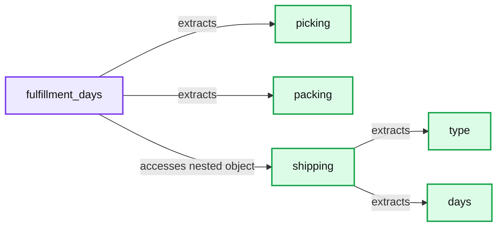
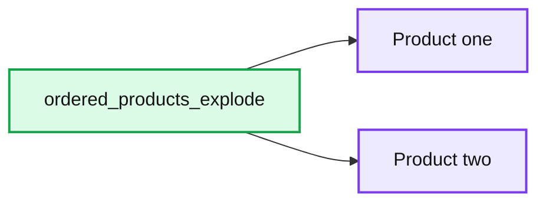

# 10 Powerful Features to Simplify Semi-structured Data Management in the Databricks Lakehouse

*Ingest and query complex JSON data like a pro with Delta Lake and SQL*

- Source: https://www.databricks.com/blog/2021/11/11/10-powerful-features-to-simplify-semi-structured-data-management-in-the-databricks-lakehouse.html
- Published: 2021-11-11
- Authors: John O'Dwyer, Emma Liu
- Categories: engineering, data-engineering
- Images: 7 total, 4 extracted as architecture

**Hassle Free Data Ingestion**
 Discover how Databricks simplifies semi-structured data ingestion into Delta Lake with detailed use cases, a demo, and live Q&A.

[WATCH NOW](https://www.databricks.com/p/webinar/hassle-free-data-ingestion-part-2?itm_data=blog-CTAtop-hasslefreedataingestion2)

 

Ingesting and querying JSON with semi-structured data can be tedious and time-consuming, but Auto Loader and [Delta Lake](https://delta.io/) make it easy. JSON data is very flexible, which makes it powerful, but also difficult to ingest and query. The biggest challenges include:

- **It’s a tedious and fragile process** to define a schema of the JSON file being ingested.
- **The schema can change over time**, and you need to be able to handle those changes automatically.
- **Software does not always pick the correct schema for your data**, and you may need to hint at the correct format. For example, the number 32 could be interpreted as either an integer or a long.
- **Often data engineers have no control of upstream data sources generating the semi-structured data**. For example, the column name may be upper or lower case but denotes the same column, or the data type sometimes changes, and you may not want to completely rewrite the already ingested data in Delta Lake.
- **You may not want to do the upfront work of flattening out JSON documents** and extracting every single column, and doing so may make the data very hard to use.
- **Querying semi-structured data in SQL is hard**. You need to be able to query this data in a manner that is easy to understand.

In this blog and [the accompanying notebook](https://www.databricks.com/notebooks/autoloader-ingest-complex-json-sql-query.html), we will show what built-in features make working with JSON simple at scale in the Databricks Lakehouse. Below is an incremental ETL architecture. The left-hand side represents continuous and scheduled ingest, and we will discuss how to do both types of ingest with Auto Loader. After the JSON file is ingested into a bronze Delta Lake table, we will discuss the features that make it easy to query complex and semi-structured data types that are common in JSON data.

**Summary:** The diagram shows data flowing from continuous or scheduled ingest through Delta Lake bronze, silver, and gold tables to business intelligence and machine learning.

**Components:**

- Continuous Ingest
- Scheduled Ingest
- Delta Lake
- Ingestion Tables - Bronze
- Refined Tables - Silver
- Feature and Agg Tables - Gold
- Business Intelligence
- Machine Learning

**Flows:**

- Continuous Ingest -> Ingestion Tables - Bronze: continuous data
- Scheduled Ingest -> Ingestion Tables - Bronze: scheduled data
- Ingestion Tables - Bronze -> Refined Tables - Silver: ingested data
- Refined Tables - Silver -> Feature and Agg Tables - Gold: refined data
- Feature and Agg Tables - Gold -> Business Intelligence: analytics data
- Feature and Agg Tables - Gold -> Machine Learning: feature and aggregate data

**Numbers:** none

```mermaid
%% Shows ingest flowing through Delta Lake table layers to analytics consumers
flowchart LR
    CI[Continuous Ingest] -->|continuous data| BR[Ingestion Tables - Bronze]
    SI[Scheduled Ingest] -->|scheduled data| BR
    BR -->|ingested data| SL[Refined Tables - Silver]
    SL -->|refined data| GD[Feature and Agg Tables - Gold]
    GD -->|analytics data| BI[Business Intelligence]
    GD -->|feature and aggregate data| ML[Machine Learning]

    classDef client   fill:#dbeafe,stroke:#2563eb,stroke-width:2px,color:#111
    classDef service  fill:#dcfce7,stroke:#16a34a,stroke-width:2px,color:#111
    classDef store    fill:#ede9fe,stroke:#7c3aed,stroke-width:2px,color:#111
    classDef cache    fill:#fef3c7,stroke:#d97706,stroke-width:2px,color:#111
    classDef queue    fill:#cffafe,stroke:#0891b2,stroke-width:2px,color:#111
    classDef critical fill:#fee2e2,stroke:#dc2626,stroke-width:4px,color:#111
    classDef external fill:#e5e7eb,stroke:#6b7280,stroke-width:2px,color:#111,stroke-dasharray:4 3
    classDef decision fill:#fce7f3,stroke:#db2777,stroke-width:2px,color:#111
    class CI,SI,BI,ML client
    class BR,SL,GD store
```

source image: https://www.databricks.com/wp-content/uploads/2021/11/easily-ingest-blog-img-1.png

In the accompanying notebook, we used sales order data to demonstrate how to easily ingest JSON. The nested JSON sales order datasets get complex very quickly.

 

Read [Rise of the Data Lakehouse](https://www.databricks.com/resources/ebook/rise-data-lakehouse?itm_data=simplifysemistructureddatablog-textpromo-riselakehousebook) to explore why lakehouses are the data architecture of the future with the father of the data warehouse, Bill Inmon.

## Hassle-free JSON ingestion with Auto Loader

[Auto Loader](https://docs.databricks.com/spark/latest/structured-streaming/auto-loader.html) provides Python and Scala interfaces to ingest new data from a folder location in object storage (S3, ADLS, GCS) into a Delta Lake table. Auto Loader makes ingestion easy and hassle-free by enabling data ingestion into Delta Lake tables directly from object storage in either a continuous or scheduled way.

Before discussing the general features of Auto Loader, let’s dig into the features that make ingesting the JSON extremely easy. Below is an example of how to ingest very complex JSON data.

**Flexibility and ease of defining the schema**: In the code above, we use two features of Auto Loader to easily define the schema while giving guardrails for problematic data. The two useful features are cloudFiles.inferColumnTypes and cloudFiles.schemaHints. Let’s take a closer look at the definitions:

**Feature 1 - Use cloudFiles.inferColumnTypes for automatically inferring data types during the schema inference process:** The default value for cloudFiles.inferColumnTypes is false because, in most cases, it is better to have the top-level columns be strings for schema evolution robustness and avoid issues such as numeric type mismatches(integers, longs, floats) during the schema evolution process.

**Feature 2 - Use cloudFiles.schemaHints for specifying the desired data type to complement schema inference:** Schema hints are used **only if** you do not provide a schema to Auto Loader. You can use schema hints whether cloudFiles.inferColumnTypes is enabled or disabled. More details can be found [here](https://docs.databricks.com/spark/latest/structured-streaming/auto-loader-schema.html#schema-hints).

In this use case ([notebook](https://www.databricks.com/notebooks/autoloader-ingest-complex-json-sql-query.html)), we actually set cloudFiles.inferColumnTypes to true since we want the columns and the complex data types to be inferred, instead of Auto Loader’s default inferred data type of string. Inferring most columns will give the fidelity of this complex JSON and provide flexibility for querying later. In addition, while inferring the column types is very convenient, we also know there are problematic columns ingested. This is where cloudFiles.schemaHints comes into play, working together with cloudFiles.inferColumnTypes. The combination of the two options allows for inferring most columns’ complex data types while specifying the desired data type (string in this example) for **only two** of the columns.

source image: https://www.databricks.com/wp-content/uploads/2021/11/easily-ingest-blog-img-2.png

Let’s take a closer look at the two problematic columns. From the semi-structured JSON data we use in the [notebook](https://www.databricks.com/notebooks/autoloader-ingest-complex-json-sql-query.html), we have identified two columns of problematic data: “ordered_products.element.promotion_info” and “clicked_items”. Hence, we hint that they should come in as strings (see data snippets for one of the columns above: “ordered_products.element.promotion_info”). For these columns, we can easily query the semi-structured JSON in SQL, which we will discuss later. You can see that one of the hints is on a nested column inside an array, which makes this feature really functional on complex schemas!

**Feature 3 - Use [Schema Evolution](https://docs.databricks.com/spark/latest/structured-streaming/auto-loader-schema.html#schema-evolution) to handle schema changes over time make the ingest and data more resilient:** Like schema inference, schema evolution is simple to implement with Auto Loader. All you have to do is set cloudFiles.schemaLocation, which saves the schema to that location in the object storage, and then the schema evolution can be accommodated over time. To clarify, schema evolution is when the schema of the ingested data changes and the schema of the Delta Lake table changes accordingly.

For example, in [the accompanying notebook](https://www.databricks.com/notebooks/autoloader-ingest-complex-json-sql-query.html), an extra column named fulfillment_days is added to the data ingested by Auto Loader. This column is identified by Auto Loader and applied automatically to the Delta Lake table. Per the [documentation](https://docs.databricks.com/spark/latest/structured-streaming/auto-loader-schema.html#schema-evolution), you can change the schema evolution mode to your liking. Here is a quick overview of the supported modes for Auto Loader’s option cloudFiles.schemaEvolutionMode:

- addNewColumns: The default mode when a schema is not provided to Auto Loader. New columns are added to the schema. Existing columns do not evolve data types.
- failOnNewColumns: If Auto Loader detects a new column, the stream will fail. It will not restart unless the provided schema is updated or the offending data file is removed.
- rescue: The stream runs with the very first inferred or provided schema. Any data type changes or new columns are automatically saved in the rescued data column as _rescued_data in your stream’s schema. In this mode, your stream will not fail due to schema changes.
- none: The default mode when a schema is provided to Auto Loader. It does not evolve the schema. New columns are ignored, and data is not rescued unless the rescued data column is provided separately as an option.

The example above (also in the [notebook](https://www.databricks.com/notebooks/autoloader-ingest-complex-json-sql-query.html)) does not include a schema, hence we use the default option .option("cloudFiles.schemaEvolutionMode", "addNewColumns") on readStream to accommodate schema evolution.

**Feature 4 - Use [rescued data column](https://docs.databricks.com/spark/latest/structured-streaming/auto-loader-schema.html#rescued-data-column) to capture bad data in an extra column, so nothing is lost:** The rescued data column is where all unparsed data is kept, which ensures that you never lose data during ETL. If data doesn’t adhere to the current schema and can’t go into its required column, the data won’t be lost with the rescued data column. In this use case ([notebook](https://www.databricks.com/notebooks/autoloader-ingest-complex-json-sql-query.html)), we did not use this option. To turn on this option, you can specify the following: .option("cloudFiles.schemaEvolutionMode", "rescue"). Please see more information [here](https://docs.databricks.com/spark/latest/structured-streaming/auto-loader-schema.html#prevent-data-loss-in-well-structured-data).

Now that we have explored the Auto Loader features that make it great for JSON data and tackled [challenges](https://accounts.google.com/ServiceLogin?service=wise&passive=1209600&continue=https://docs.google.com/document/d/1UlQs9FbtQNNQnRQ5ZiLuib4j7MxLSs5jXgaSLibNpOk/edit&followup=https://docs.google.com/document/d/1UlQs9FbtQNNQnRQ5ZiLuib4j7MxLSs5jXgaSLibNpOk/edit&ltmpl=docs#bookmark=id.elgwwmi4x09a)mentioned at the beginning, let’s look at some of the features that make it hassle-free for all ingest:

**Feature 5 - Use [Trigger Once](https://docs.databricks.com/spark/latest/structured-streaming/auto-loader-s3.html#use-cloudfiles-source) and [Trigger AvailableNow](https://docs.databricks.com/release-notes/runtime/10.1.html#triggeravailablenow-for-auto-loader) for continuous vs. scheduled ingest:** While Auto Loader is an Apache Spark™ Structured Streaming source, it does not have to run continuously. You can use the [trigger once](https://www.databricks.com/blog/2017/05/22/running-streaming-jobs-day-10x-cost-savings.html)option to turn it into a scheduled job that turns itself off when all files have been ingested. This comes in handy when you don’t have the need for continuously running ingest. Yet, it also gives you the ability to drop the cadence of the schedule over time and then eventually go to continuously running ingest without changing the code. In DBR 10.1 and later, we have introduced [Trigger.AvailableNow](https://docs.databricks.com/release-notes/runtime/10.1.html#triggeravailablenow-for-auto-loader), which provides the same data processing semantics as trigger once, but can also perform rate limiting to ensure that your data processing can scale to very large amounts of data.

**Feature 6 - Use [Checkpoints](https://docs.databricks.com/spark/latest/structured-streaming/auto-loader-s3.html#use-cloudfiles-source)to handle state:** State is the information needed to start up where the ingestion process left off if the process is stopped. For example, with Auto Loader, the state would include the set of files already ingested. [Checkpoints](https://spark.apache.org/docs/latest/streaming-programming-guide.html#checkpointing)save the state if the ETL is stopped at any point, whether on purpose or due to failure. By leveraging checkpoints, Auto Loader can run continuously and also be a part of a periodic or scheduled job. In the example above, the checkpoint is saved in the option checkpointLocation . If the Auto Loader is terminated and then restarted, it will use the checkpoint to return to its latest state and will not reprocess files that have already been processed.

## Querying semi-structured and complex structured data

Now that we have our JSON data in a Delta Lake table, let's explore the powerful ways you can query semi-structured and complex structured data. Let’s tackle the last challenge of querying semi-structured data.

Until this point, we have used Auto Loader to write a Delta Table to a particular location. We can access this table by location in SQL, but for readability, we point an external table to the location using the following SQL code.

**Easily access top level and nested data in semi-structured JSON columns using syntax for casting values:**

When ingesting data, you may need to keep it in a JSON string, and some data may not be in the correct data type. In those cases, syntax in the above example makes querying parts of the semi-structured data simple and easy to read. To double click on this example, let’s look at data in the column filfillment_days, which is a JSON string column:

**Summary:** A table shows JSON-string records in the `fulfillment_days` column, containing picking, packing, and nested shipping values.

**Components:**

- `fulfillment_days` - JSON string column
- `picking` - JSON numeric field
- `packing` - JSON numeric field
- `shipping` - Nested JSON object with `type` and `days`

**Flows:**

- `fulfillment_days -> picking`: extracts top-level picking value
- `fulfillment_days -> packing`: extracts top-level packing value
- `fulfillment_days -> shipping`: accesses nested shipping object
- `shipping -> days`: extracts nested shipping days value

**Numbers:** 0.32, 1.99, 3.7, 0.3, 1.12, 4.5, 0.7, 1.73, 3.31

source image: https://www.databricks.com/wp-content/uploads/2021/11/easily-ingest-blog-img-3.png

**Feature 7 - **Use single colon (:) to [extract the top-level](https://docs.databricks.com/spark/latest/spark-sql/semi-structured.html#extract-a-top-level-column) of a JSON string column: For example, filfillment_days:picking returns the value 0.32 for the first row above.

**Feature 8 - Use** [Dot Notation](https://docs.databricks.com/spark/latest/spark-sql/semi-structured.html#extract-nested-fields) to access nested fields: For example, fulfillment_days:shipping.days returns the value 3.7 for the first row above.

**Feature 9 - ** Use double colon (::) to specify the desired data type to return for [casting value](https://docs.databricks.com/spark/latest/spark-sql/semi-structured.html#cast-values):
 For example, fulfillment_days:packing::double returns the double data type value 1.99 for the string value of packing for the first row above.

**Extracting values from semi-structured arrays even when the data is ill-formed: **

Unfortunately, not all data comes to us in a usable structure. For example, the column clicked_items is a confusing array of arrays in which the count comes in as a string. Below is a snippet of the data in the column clicked_items:

**Feature 10 - [Extracting Values From Arrays](https://docs.databricks.com/spark/latest/spark-sql/semi-structured.html#extract-values-from-arrays):** Use an asterisk (*) to extract all values in a JSON array string. For the specific array indices, use a 0-based value. For example, SQL clicked_items:[*][1]returns the string value of ["54","85"].

**Casting complex array values**: After extracting the correct values for the array of arrays, we can use from_json and ::ARRAY to cast the array into a format that can be summed using reduce. In the end, the first row returns the summed value of 139 (54 + 89). It’s pretty amazing how easily we can sum values from ill-formed JSON in SQL!

**Aggregations in SQL with complex structured data: **

Accessing complex structured data, as well as moving between structured and semi-structured data, has been available for quite some time in Databricks.

In the SQL query above, we explored how to access and aggregate data from the complex structured data in the column ordered_products. To show the data complexity, below is an example of one row of the column ordered_products, and our goal here is to find the quantity of each product sold on a daily basis. As you can see, both the product and quantity are nested in an array.

**Accessing array elements as rows**: Use explode on the ordered_products column so that each element is its own row, as seen below.

**Summary:** The image shows one exploded array row containing product details and quantities.

**Components:**

- ordered_products_explode: exploded product record with product name, price, promotion info, quantity, and unit

**Flows:**

- none

**Numbers:** 39.6 x 69.6, 84, 1, 149, 2

source image: https://www.databricks.com/wp-content/uploads/2021/11/easily-ingest-blog-img-6.png

**Accessing nested fields**: Use the dot notation to access nested fields in the same manner as semi-structured JSON. For example, ordered_products_explode.qty returns the value 1 for the first row above. We can then group and sum the quantities by date and the product name.

**Additional Resources**: we have covered many topics on querying structured and semi-structured JSON data, but you can find more information here:

- [Documentation on querying semi-structured JSON in SQL.](https://docs.databricks.com/spark/latest/spark-sql/semi-structured.html)
- [A blog on working complex structured and semi-structured data](https://www.databricks.com/blog/2017/02/23/working-complex-data-formats-structured-streaming-apache-spark-2-1.html). The specific use case is working with complex data while streaming.

## Conclusion

At Databricks, we strive to make the impossible possible and the hard easy. Auto Loader makes ingesting complex JSON use cases at scale easy and possible. The SQL syntax for semi-structured and complex data makes manipulating data easy. Let’s recap the 10 features:

- Feature 1 - [Infer Column Types](https://docs.databricks.com/spark/latest/structured-streaming/auto-loader-schema.html#schema-inference) for inferring data types during schema inference
- Feature 2 - [Schema Hints](https://docs.databricks.com/spark/latest/structured-streaming/auto-loader-schema.html#schema-hints) for specifying desired data types to complement schema inference
- Feature 3 - [Schema Evolution](https://docs.databricks.com/spark/latest/structured-streaming/auto-loader-schema.html#schema-evolution) for handling schema changes in ingested data over time
- Feature 4 - [Rescued Data Column](https://docs.databricks.com/spark/latest/structured-streaming/auto-loader-schema.html#rescued-data-column) for capturing bad data in an extra column, so nothing is lost
- Feature 5 - [Trigger Once](https://docs.databricks.com/spark/latest/structured-streaming/auto-loader-s3.html#use-cloudfiles-source) and [Trigger AvailableNow](https://docs.databricks.com/release-notes/runtime/10.1.html#triggeravailablenow-for-auto-loader) for continuous and scheduled ingest for large amounts of data
- Feature 6 - [Checkpoints](https://docs.databricks.com/spark/latest/structured-streaming/auto-loader-s3.html#use-cloudfiles-source)for handling the state of the ingestion process
- Feature 7 - [Extract JSON Columns](https://docs.databricks.com/spark/latest/spark-sql/semi-structured.html#extract-a-top-level-column) for accessing top-level columns in JSON file
- Feature 8 - [Dot Notation](https://docs.databricks.com/spark/latest/spark-sql/semi-structured.html#extract-nested-fields) for accessing nested fields
- Feature 9 - [Casting Values](https://docs.databricks.com/spark/latest/spark-sql/semi-structured.html#cast-values) for converting values to specified data types
- Feature 10 - [Extracting Values From Arrays](https://docs.databricks.com/spark/latest/spark-sql/semi-structured.html#extract-values-from-arrays) for accessing arrays and structs within arrays

Now that you know how to ingest and query complex JSON with Auto Loader and SQL, we can’t wait to see what you build with them.

[Try the notebook](https://www.databricks.com/notebooks/autoloader-ingest-complex-json-sql-query.html)
