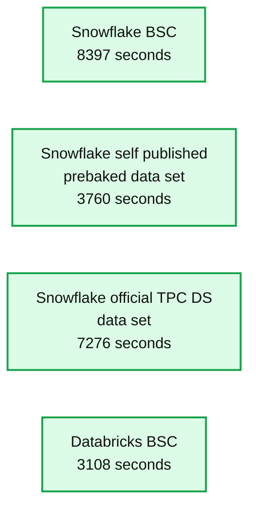

# Snowflake Claims Similar Price/Performance to Databricks, but Not So Fast!

- Source: https://www.databricks.com/blog/2021/11/15/snowflake-claims-similar-price-performance-to-databricks-but-not-so-fast.html
- Published: 2021-11-15
- Authors: Mostafa Mokhtar, Reynold Xin, Matei Zaharia
- Categories: data-warehousing, company, news
- Images: 1 total, 1 extracted as architecture

On Nov 2, 2021, we announced that [we set the official world record](https://www.databricks.com/blog/2021/11/02/databricks-sets-official-data-warehousing-performance-record.html) for the fastest data warehouse with our Databricks SQL lakehouse platform. These results were audited and reported by the official Transaction Processing Performance Council (TPC) in a 37-page document [available online](http://tpc.org/results/fdr/tpcds/databricks~tpcds~100000~databricks_sql_8.3~fdr~2021-11-02~v01.pdf) at tpc.org. We also shared a third-party benchmark by the Barcelona Supercomputing Center (BSC) outlining that Databricks SQL is significantly faster and more cost effective than Snowflake.

A lot has happened since then: many congratulations, some questions, and some sour grapes. We take this opportunity to reiterate that **we stand by our blog post and the results: Databricks SQL provides superior performance and price performance over Snowflake, even on data warehousing workloads (TPC-DS)**.

### Snowflake’s response: “lacking integrity”?

Snowflake responded 10 days after our publication (last Friday) claiming that our results were “lacking integrity.” They then presented their own benchmarks, claiming that their offering has roughly the same performance and price at $267 as Databricks SQL at $242. At face value, this ignores the fact that they are comparing the price of their cheapest offering with that of our most expensive SQL offering. (Note that Snowflake’s “Business Critical” tier is 2x the cost of the cheapest tier.) They also gloss over the fact that Databricks can use spot instances, which most customers use, and bring the price down to $146. But none of this is the focus of this post.

The gist of Snowflake’s claim is that they ran the same benchmarks as BSC and found that they could run the whole benchmark in 3,760 seconds vs 8,397 seconds that BSC measured. They even urged readers to sign up for an account and try it out for themselves. After all, the TPC-DS dataset comes with Snowflake out of the box and they even have a tutorial on how to run it. So it should be easy to verify the results. We did exactly that.

First, we want to commend Snowflake for following our lead and [removing the DeWitt clause](https://www.databricks.com/blog/2021/11/08/eliminating-the-dewitt-clause-for-database-benchmarking.html), which had prohibited competitors from benchmarking their platform. Thanks to this, we were able to get a trial account and verify the basis for claims of “lacking integrity”.

### Reproducing TPC-DS on Snowflake

We logged into Snowflake and ran Tutorial 4 for TPC-DS. The results in fact closely matched what they claimed at 4,025 seconds, indeed much faster than the 8,397 seconds in the BSC benchmark. But what unfolded next is much more interesting.

While performing the benchmarks, we noticed that the Snowflake pre-baked TPC-DS dataset had been recreated two days after our benchmark results were announced. An important part of the official benchmark is to verify the creation of the dataset. So, instead of using Snowflake’s pre-baked dataset, we uploaded an official TPC-DS dataset and used identical schema as Snowflake uses on its pre-baked dataset (including the same clustering column sets), on identical cluster size (4XL). We then ran and timed the POWER test three times. The first cold run took 10,085 secs, and the fastest of the three runs took 7,276 seconds. Just to recap, **we loaded the official TPC-DS dataset into Snowflake, timed how long it takes to run the power test, and it took 1.9x longer (best of 3) than what Snowflake reported in their blog.**

**Summary:** Benchmark chart comparing TPC-DS 100TB-derived POWER test runtimes for Snowflake and Databricks, where lower runtime is better.

**Components:**

- Snowflake BSC using Snowflake
- Snowflake self published prebaked data set using Snowflake
- Snowflake official TPC-DS data set using Snowflake
- Databricks BSC using Databricks
- Runtime axis measured in seconds

**Flows:**

- none

**Numbers:** 100TB, 8000, 7000, 6000, 5000, 4000, 3000, 2000, 1000, 0, 8397 seconds, 3760 seconds, 7276 seconds, 3108 seconds

source image: https://www.databricks.com/wp-content/uploads/2021/11/TPC-DS-100TB-DERIVED-POWER-TEST-min-1024x642.png

These results can easily be verified by anyone. Get a Snowflake account, use the official TPC-DS scripts to generate a 100 TB data warehouse. Ingest those files into Snowflake. Then run a few POWER runs and measure the time for yourself. We bet the results will be closer to 7000 seconds, or even higher numbers if you don’t use their clustering columns (see next section). You can also just run the POWER test on the dataset they ship with Snowflake. Those results will likely be closer to the time they reported in their blog.

### Why official TPC-DS

Why is there such a big discrepancy between running TPC-DS on the pre-baked dataset in Snowflake vs loading the official dataset into Snowflake? We don’t exactly know. But how you lay out your data significantly impacts TPC-DS, and in general all, workloads. In most systems, clustering or partitioning the data for a specific workload (e.g., sorting by the combination of fields used in a query) can improve performance for that workload, but such optimizations come with additional cost. That time and cost need to be included in the benchmark results.

It is for this reason that the official benchmark requires you to report the time it takes to **load** the data into the data warehouse so that they can correctly account for any time and cost the system takes to optimize the layout. This time can be substantially more than the POWER test queries for some storage schemes. The official benchmark also includes **data updates and maintenance**, just like real-world datasets and workloads (how often do you query a dataset that never changes?). This is all done to prevent the following scenario: a system spends massive resources optimizing a static dataset offline for an exact set of immutable workloads, and then can run those workloads super quickly.

In addition, the official benchmark requires reproducibility. That’s why you can find all the code to reproduce our record in the [submission](http://tpc.org/tpcds/results/tpcds_result_detail5.asp?id=121103001).

This brings us to our final point. We agree with Snowflake that benchmarks can quickly devolve into industry players “adding configuration knobs, special settings, and very specific optimizations that would improve a benchmark”. Everyone looks really good in their own benchmarks. So instead of taking any one vendor’s word on how good they are, we challenge Snowflake to participate in the official TPC benchmark.

### Customer-obsessed benchmarking

When we decided to participate in this benchmark, we set a constraint for our engineering team that they should only use commonly applied optimizations done by virtually all our customers, unlike past entries. They were not allowed to apply any optimizations that would require deep understanding of the dataset or queries (as done in the Snowflake pre-baked dataset, with additional clustering columns). This matches real world workloads and what most customers would like to see (a system that achieves great performance without tuning).

If you read our submission in detail, you can find the reproducible steps that match how a typical customer would like to manage their data. Minimizing the effort to get productive with a new dataset was one of our top design goals for Databricks SQL.

### Conclusion

A final word from us at Databricks. As co-founders, we care deeply about delivering the best value to our customers, and the software we build to solve their business needs. Benchmark results that don’t resonate with our understanding of the world can lead to an emotional or visceral reaction. We try to not let that get the best of us. We will seek the truth, and publish end-to-end results that are verifiable. We therefore won’t accuse Snowflake of lacking integrity in the results they published in their blog. We only ask them to verify their results with the official TPC council.

Our primary motivation to participate in the official TPC data warehousing benchmark was not to prove which data warehouse is faster or cheaper. Rather, we believe that every enterprise should be able to become data driven the way the FAANG companies are. Those companies don’t build on data warehouses. They instead have a much simpler data strategy: store all data (structured, text, video, audio) in open formats and use a single copy towards all kinds of analytics, be it data science, machine learning, real-time analytics, or classic business intelligence and data warehousing. They don’t do everything in just SQL. But rather, SQL is one of the key tools in their arsenal, together with Python, R, and a slew of other tools in the open-source ecosystem that leverage their data. We call this paradigm the [Data Lakehouse](https://www.databricks.com/blog/2020/01/30/what-is-a-data-lakehouse.html). The Data Lakehouse, unlike Data Warehouses, has native support for Data Science, Machine Learning, and real-time streaming. But it also has native support for SQL and BI. Our goal was to dispel the myth that the Data Lakehouse cannot have best-in-class price and performance. Rather than making our own benchmarks, we sought the truth and participated in the official TPC benchmark. We are therefore very happy that the **Data Lakehouse paradigm provides superior performance and price over data warehouses, even on classic data warehousing workloads** (TPC-DS). This will benefit enterprises who no longer need to maintain multiple data lakes, data warehouses, and streaming systems to manage all of their data. This simple architecture enables them to redeploy their resources toward solving the business needs and problems that they face every day.
