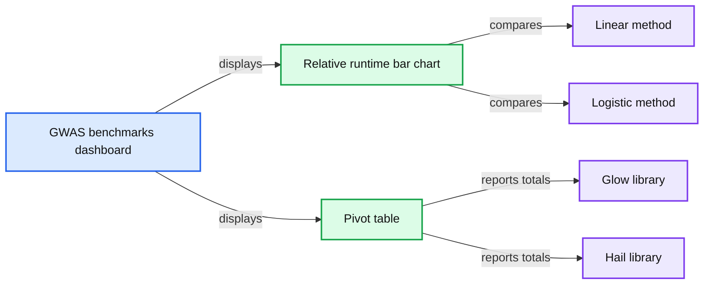
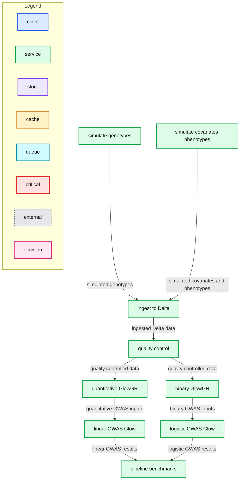

# Databricks’ Open Source Genomics Toolkit Outperforms Leading Tools

- Source: https://www.databricks.com/blog/2021/11/17/databricks-open-source-genomics-toolkit-outperforms-leading-tools.html
- Published: 2021-11-17
- Authors: William Brandler
- Categories: engineering, solution-accelerators
- Images: 2 total, 2 extracted as architecture

Check out the [solution accelerator](https://www.databricks.com/solutions/accelerators/genome-wide-association-studies) to download the notebooks referred throughout this blog. 

Genomic technologies are driving the creation of new therapeutics, from RNA vaccines to gene editing and diagnostics. Progress in these areas motivated us to build [Glow](https://github.com/projectglow/glow), an open-source toolkit for genomics machine learning and data analytics. The toolkit is natively built on Apache Spark™, the leading engine for big data processing, enabling population-scale genomics.

The project started as an industry collaboration between Databricks and the Regeneron Genetics Center. The goal is to advance research by building the next generation of genomics data analysis tools for the community. We took inspiration from bioinformatics libraries such as [Hail](https://www.hail.is/), [Plink](https://secure.jbs.elsevierhealth.com/action/cookieAbsent) and [bedtools](https://bedtools.readthedocs.io/en/latest/), married with best-in-class techniques for large-scale data processing. Glow is now 10x more computationally efficient than industry leading tools for genetic association studies.

## The vision for Glow and genomic analysis at scale

The primary bottleneck slowing the growth in genomics is the complexity of data management and analytics. Our goal is to make it simple for data engineers and data scientists who are not trained in bioinformatics to contribute to genomics data processing in distributed cloud computing environments. Easing this bottleneck will in turn drive up the demand for more sequencing data in a positive feedback loop.

## When to use Glow

Glow's domain of applicability falls in aggregation and mining of genetic variant data. Particularly for data analyses that are run many times iteratively or that take more than a few hours to complete, such as:

1. Annotation pipelines
2. Genetic association studies
3. GPU-based deep learning algorithms
4. Transforming data into and out of bioinformatics tools.

As an example, Glow includes a distributed implementation of the [Regenie method](https://rgcgithub.github.io/regenie/). You can run Regenie on a single node, which is recommended for academic scientists. But for industrial applications, Glow is the world's most cost effective and scalable method of running thousands of association tests. Let's walk through how this works.

## Benchmarking Glow against Hail

We focused on genetic association studies for benchmarks because they are the most computationally intensive steps in any analytics pipeline. Glow is >10x more performant for Firth regression relative to Hail without trading off accuracy **(Figure 1)**. We were able to achieve this performance because we apply an approximate method first, restricting the full method to variants with a suggestive association with disease (P Glow documentation.

**Summary:** Databricks SQL dashboard compares Glow and Hail relative runtimes for linear and logistic GWAS benchmarks.

**Components:**

- GWAS benchmarks dashboard
- Relative runtime bar chart
- Pivot table
- Glow library
- Hail library
- Linear method
- Logistic method

**Flows:**

- GWAS benchmarks dashboard -> Relative runtime bar chart: displays benchmark runtimes
- GWAS benchmarks dashboard -> Pivot table: displays benchmark totals

**Numbers:** 14, 12, 10, 8, 6, 4, 2, 0, 0.81, 1.29, 1.00, 13.81

source image: https://www.databricks.com/wp-content/uploads/2021/11/next-generation-blog-img-1.png

 Figure 1: Databricks SQL dashboard showing Glow and Hail benchmarks on a simulated dataset of 500k samples, and 250k variants (1% of UK Biobank scale) run across a 768 core cluster with 48 memory-optimized virtual machines. We used Glow v1.1.0 and Hail v0.2.76. Relative runtimes are shown. To reproduce these benchmarks, please download the notebooks from the [Glow Github repository](https://github.com/projectglow/glow/tree/master/docs/source/_static) and use the associated docker containers to set up the environment.

## Glow on the Databricks Lakehouse Platform

We had a small team of engineers working on a tight schedule to develop Glow. So how were we able to catch up with the world's leading biomedical research institute, the brain power behind Hail? We did it by developing Glow on the [Databricks Lakehouse Platform](https://www.databricks.com/product/data-lakehouse) in collaboration with [industry partners](https://github.com/projectglow/glow/graphs/contributors). Databricks provides infrastructure that makes you productive with genomics data analytics. For example, you can use [Databricks Jobs](https://www.databricks.com/blog/2021/07/13/announcement-orchestrating-multiple-tasks-with-databricks-jobs-public-preview.html) to build complex pipelines with multiple dependencies (**Figure 2**).

Furthermore, Databricks is a secure platform trusted by both Fortune 100 and healthcare organizations with their most sensitive data, adhering to principles of data governance ([FAIR](https://www.databricks.com/blog/2021/09/07/implementing-more-effective-fair-scientific-data-management-with-a-lakehouse.html)), security and compliance ([HIPAA](https://docs.databricks.com/security/privacy/hipaa-compliant-deployment.html) and [GDPR](https://docs.databricks.com/security/privacy/gdpr-delta.html)).

*Figure 2: Glow on the Databricks Lakehouse Platform*

**Summary:** Glow’s Databricks job workflow runs genomics simulation, ingestion, quality control, GWAS analyses, and benchmarking across configured Spark clusters.

**Components:**

- simulate_genotypes - Glow compute optimized cluster
- simulate_covariates_phenotypes - single node cluster
- ingest_to_delta - Glow compute optimized cluster
- quality_control - Glow compute optimized cluster
- quantitative_glowgr - Glow memory optimized cluster
- binary_glowgr - Glow memory optimized cluster
- linear_gwas_glow - Glow memory optimized cluster
- logistic_gwas_glow - Glow memory optimized cluster
- pipeline_benchmarks - Glow compute optimized cluster
- Databricks schedule - monthly job execution
- Glow compute optimized cluster - c5d.2xlarge driver, c5d.2xlarge workers
- Glow memory optimized cluster - r5d.2xlarge driver, r5d.2xlarge workers
- Single node cluster - i3.xlarge driver and workers

**Flows:**

- simulate_genotypes -> ingest_to_delta: simulated genotypes
- simulate_covariates_phenotypes -> ingest_to_delta: simulated covariates and phenotypes
- ingest_to_delta -> quality_control: ingested Delta data
- quality_control -> quantitative_glowgr: quality-controlled data
- quality_control -> binary_glowgr: quality-controlled data
- quantitative_glowgr -> linear_gwas_glow: quantitative GWAS inputs
- binary_glowgr -> logistic_gwas_glow: binary GWAS inputs
- linear_gwas_glow -> pipeline_benchmarks: linear GWAS results
- logistic_gwas_glow -> pipeline_benchmarks: logistic GWAS results

**Numbers:** 12:40 AM; day 2; UTC+00:00; 6 workers; c5d.2xlarge; 9.1 LTS; Apache Spark 3.1.2; Scala 2.12; r5d.2xlarge; 6 workers; i3.xlarge; 0 workers

source image: https://www.databricks.com/wp-content/uploads/2021/11/glow-bm-blog-image-2.png

Figure 2: Glow on the Databricks Lakehouse Platform

## What lies in store for the future?

Glow is now at a v1 level of maturity, and we are looking to the community to help [contribute to build and extend it](https://glow.readthedocs.io/en/latest/contributing.html). There's lots of exciting things in store.

Genomics datasets are so large that batch processing with Apache Spark can hit capacity limits of certain cloud regions. This problem will be solved by the open [Delta Lake](https://delta.io/) format, which unifies batch and stream processing. By leveraging streaming, Delta Lake enables incremental processing of new samples or variants, with edge cases quarantined for further analysis. Combining Glow with Delta Lake will solve the ["n+1 problem"](https://www.databricks.com/session/solving-the-n1-problem-in-personalized-genomics) in genomics.

A further problem in genomics research is data explosion. There are over 50 copies of the Cancer Genome Atlas on Amazon Web Services alone. The solution proposed today is a walled garden, managing datasets inside genomics domain platforms. This solves data duplication, but then locks data into platforms.

This friction will be eased through [Delta Sharing](https://www.databricks.com/blog/2021/05/26/introducing-delta-sharing-an-open-protocol-for-secure-data-sharing.html), an open protocol for secure real-time exchange of large datasets, which will enable secure data sharing between organizations, clouds and domain platforms. [Unity Catalog](https://www.databricks.com/product/unity-catalog) will then make it easy to discover, audit and govern these data assets.

We're just at the beginning of the industrialization of genomics data analytics. To learn more, please see the [Glow documentation](https://glow.readthedocs.io/en/latest/), tech talks on [YouTube](https://www.youtube.com/watch?v=SQxGx6RTMA8&t=1114s), [and workshops.](https://www.databricks.com/p/webinar/life-sciences-data-ai-workshop)
