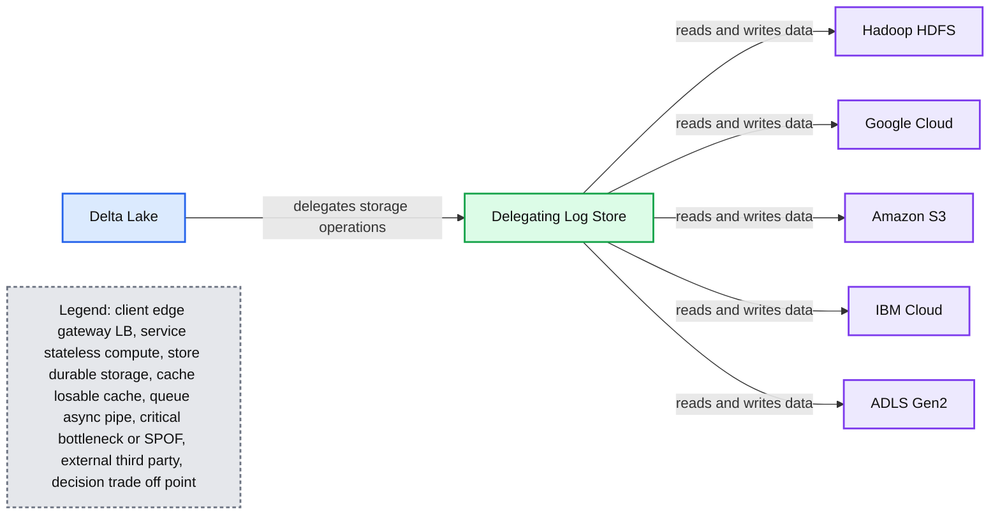
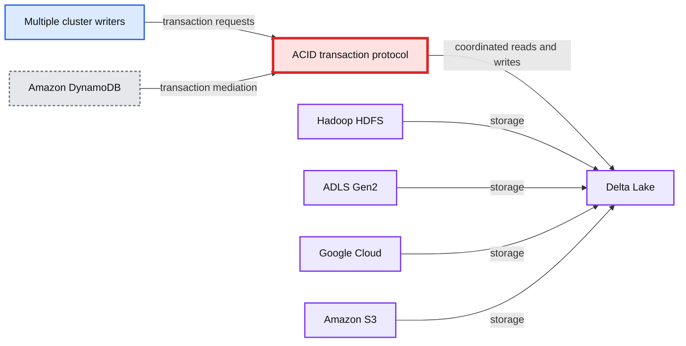
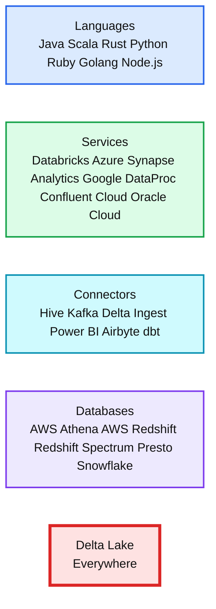
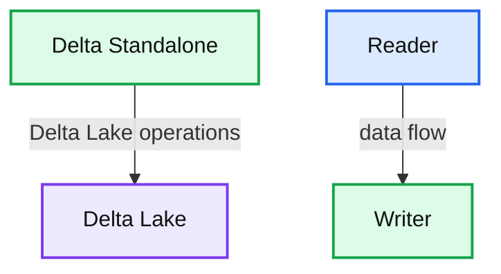
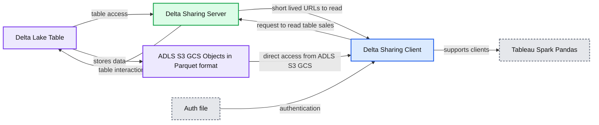
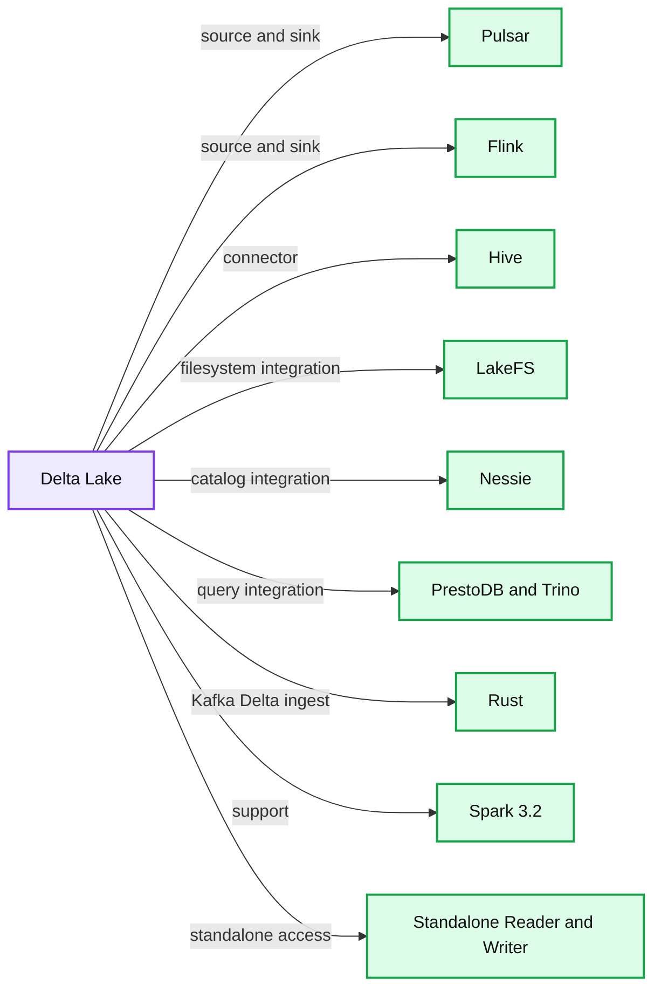

# The Foundation of Your Lakehouse Starts With Delta Lake

*Simplify data reliability and data engineering with Delta Lake integrations*

- Source: https://www.databricks.com/blog/2021/12/01/the-foundation-of-your-lakehouse-starts-with-delta-lake.html
- Published: 2021-12-01
- Authors: Denny Lee, Vini Jaiswal
- Categories: engineering, open-source
- Images: 15 total, 8 extracted as architecture

It’s been an exciting last few years with the Delta Lake project. The release of Delta Lake 1.0 as [announced by Michael Armbrust](https://www.youtube.com/watch?v=pzLyzwBdqck&feature=youtu.be) in the [Data+AI Summit](https://www.databricks.com/dataaisummit/north-america-2021) in May 2021 represents a great milestone for the open source community and we’re just getting started! To better streamline community involvement and ask, we recently published [Delta Lake 2021 H2 Roadmap](https://www.youtube.com/watch?v=NBcn2J6V-MM) and associated [Delta Lake User Survey (2021 H2)](https://www.linkedin.com/feed/update/urn:li:activity:6844471899892801536/) - the result of which we will discuss in a future blog.  In this blog, we review the major features released so far and provide an overview of the upcoming roadmap.

**Summary:** Delta Lake organizes streaming and batch inputs from existing data lakes into bronze, silver, and gold layers for analytics and machine learning.

**Components:**

- Streaming data input
- Batch data input
- Delta Lake
- Ingestion Tables, Bronze
- Refined Tables, Silver
- Feature/Agg Data Store, Gold
- Existing Data Lake
- Hadoop HDFS
- Azure Data Lake Storage
- Amazon S3
- Analytics and Machine Learning

**Flows:**

- Streaming -> Ingestion Tables Bronze: streaming data
- Batch -> Ingestion Tables Bronze: batch data
- Ingestion Tables Bronze -> Refined Tables Silver: ingested data
- Refined Tables Silver -> Feature/Agg Data Store Gold: refined data
- Feature/Agg Data Store Gold -> Analytics and Machine Learning: feature and aggregate data
- Existing Data Lake -> Delta Lake: underlying storage

**Numbers:** none



<sub>source image: https://www.databricks.com/wp-content/uploads/2019/08/Delta-Lake-Multi-Hop-Architecture-Overview.png</sub>

```mermaid
%% Shows Delta Lake data flow from source inputs through lakehouse layers
flowchart LR
    streaming[Streaming data]
    batch[Batch data]
    bronze[Ingestion Tables Bronze]
    delta[Delta Lake]
    silver[Refined Tables Silver]
    gold[Feature Agg Data Store Gold]
    analytics[Analytics and Machine Learning]
    lake[Your Existing Data Lake]
    hdfs[Hadoop HDFS]
    adls[Azure Data Lake Storage]
    s3[Amazon S3]

    streaming -->|streaming data| bronze
    batch -->|batch data| bronze
    bronze -->|ingested data| silver
    silver -->|refined data| gold
    gold -->|feature and aggregate data| analytics
    lake -->|underlying storage| delta
    hdfs -.-> lake
    adls -.-> lake
    s3 -.-> lake
    delta -.-> bronze
    delta -.-> silver
    delta -.-> gold

    classDef client fill:#dbeafe,stroke:#2563eb,stroke-width:2px,color:#111
    classDef service fill:#dcfce7,stroke:#16a34a,stroke-width:2px,color:#111
    classDef store fill:#ede9fe,stroke:#7c3aed,stroke-width:2px,color:#111
    classDef cache fill:#fef3c7,stroke:#d97706,stroke-width:2px,color:#111
    classDef queue fill:#cffafe,stroke:#0891b2,stroke-width:2px,color:#111
    classDef critical fill:#fee2e2,stroke:#dc2626,stroke-width:4px,color:#111
    classDef external fill:#e5e7eb,stroke:#6b7280,stroke-width:2px,color:#111,stroke-dasharray:4 3
    classDef decision fill:#fce7f3,stroke:#db2777,stroke-width:2px,color:#111

    class streaming,batch client
    class delta service
    class bronze,silver,gold store
    class analytics client
    class lake,hdfs,adls,s3 external
```

Let’s first start with what Delta Lake is. [Delta Lake](https://www.databricks.com/wp-content/uploads/2020/08/p975-armbrust.pdf) is an open-source project that enables building a [Lakehouse architecture](http://cidrdb.org/cidr2021/papers/cidr2021_paper17.pdf) on top of your existing storage systems such as S3, ADLS, GCS, and HDFS. The features of Delta Lake improve both the manageability and performance of working with data in cloud storage objects and enable the *lakehouse* paradigm that combines the key features of data warehouses and data lakes: standard DBMS management functions usable against low-cost object stores.   Together with the multi-hop Delta medallion architecture data quality framework, Delta Lake ensures the reliability of your batch and streaming data with ACID transactions.

## Delta Lake adoption

Today, Delta Lake is used all over the world. Exabytes of data get processed daily on Delta Lake, which accounts for 75% of the data that is scanned on the Databricks Data + AI Platform *alone*.  Moreover, Delta Lake has been deployed to more than 3000 customers in their production lakehouse architectures on Databricks alone!

## Delta Lake pace of innovation highlights

The journey to Delta Lake 1.0 has been full of innovation highlights - so how did we get here?

**Summary:** A chronological timeline highlights Delta Lake feature releases from April 2019 through February 2021.

**Components:**

- Apr 2019 0.1: Open source Delta Lake, ACID transactions, schema management, scalable metadata handling, time travel, unified batch and streaming
- Sep 2019 0.4: Scala and Java APIs, Python DML APIs, Convert-to-Delta, SQL utility operations
- Dec 2019 0.5: Other processing engines, improved concurrency, file compaction, insert-only merge performance, Convert-to-Delta using SQL, Snowflake and Redshift Spectrum support
- Apr 2020 0.6: Schema evolution in merge operations, improved merge performance, DESCRIBE HISTORY metrics, filesystem table access
- Jun 2020 0.7: Hive metastore tables, SQL DML, automatic incremental manifest generation, table history retention, user-defined metadata, Azure Data Lake Storage Gen2, streaming one-time triggers
- Feb 2021 0.8: Expanded merge clauses, nested column schema evolution, nested struct resolution, constraints, version-specific streaming, parallel deletes with VACUUM, Scala implicits

**Flows:**

- Apr 2019 0.1 -> Sep 2019 0.4: Feature evolution
- Sep 2019 0.4 -> Dec 2019 0.5: Feature evolution
- Dec 2019 0.5 -> Apr 2020 0.6: Feature evolution
- Apr 2020 0.6 -> Jun 2020 0.7: Feature evolution
- Jun 2020 0.7 -> Feb 2021 0.8: Feature evolution

**Numbers:**

- 2019
- 2020
- 2021
- 0.1
- 0.4
- 0.5
- 0.6
- 0.7
- 0.8

```text
%% mermaid failed to render; kept as text
%% Delta Lake release timeline and innovation highlights
flowchart LR
    A[Apr 2019 0.1] -->|Feature evolution| B[Sep 2019 0.4]
    B -->|Feature evolution| C[Dec 2019 0.5]
    C -->|Feature evolution| D[Apr 2020 0.6]
    D -->|Feature evolution| E[Jun 2020 0.7]
    E -->|Feature evolution| F[Feb 2021 0.8]

    classDef client fill:#dbeafe,stroke:#2563eb,stroke-width:2px,color:#111
    classDef service fill:#dcfce7,stroke:#16a34a,stroke-width:2px,color:#111
    classDef store fill:#ede9fe,stroke:#7c3aed,stroke-width:2px,color:#111
    classDef cache fill:#fef3c7,stroke:#d97706,stroke-width:2px,color:#111
    classDef queue fill:#cffafe,stroke:#0891b2,stroke-width:2px,color:#111
    classDef critical fill:#fee2e2,stroke:#dc2626,stroke-width:4px,color:#111
    classDef external fill:#e5e7eb,stroke:#6b7280,stroke-width:2px,color:#111,stroke-dasharray:4 3
    classDef decision fill:#fce7f3,stroke:#db2777,stroke-width:2px,color:#111
    A,B,C,D,E,F service
    client = clients/edge/gateway/LB, service = stateless compute, store = databases/durable storage, cache = Redis/CDN/anything losable, queue = Kafka/streams/async pipes, critical = the bottleneck or SPOF, external = third-party, decision = a trade-off point
```

<sub>source image: https://www.databricks.com/wp-content/uploads/2021/11/delta-lake-rm-2.png</sub>

As Michael highlighted in his keynote at the Data + AI Summit 2021, the Delta Lake project was initially created at Databricks based on customer feedback back in 2017. Through continuous collaboration efforts with early adopters, Delta Lake was open-sourced in 2019 and was announced at the [Spark+AI Summit keynote by Ali Ghodsi](https://www.youtube.com/watch?v=5I5pqDsvGEc). The first release Delta Lake 0.1 included ACID transactions, schema management, and unified streaming and batch source and sink. Version 0.4 included the support for DML commands and vacuuming for both Scala and Python APIs were added. In version 0.5,  Delta Lake saw improvements around compaction and concurrency. It was possible to convert Parquet into Delta Lake tables using SQL only. Other things added in the next version, 0.6, were improvements around merge operations and describe history, which allows you to understand how your table has been evolving over time. In 0.7, the support for different engines like Presto and Athena via manifest generation was added. And finally, a lot of work went into adding merge and other features in the 0.8 release.

To dive deeper into each of these innovations, please check out the blogs below for each of these releases.

- [Open Sourcing Delta Lake](https://www.databricks.com/blog/2019/04/24/open-sourcing-delta-lake.html)
- [Announcing the Delta Lake 0.3.0 Release](https://www.databricks.com/blog/2019/08/02/announcing-delta-lake-0-3-0-release.html)
- [Simple, Reliable Upserts and Deletes on Delta Lake Tables using Python APIs](https://www.databricks.com/blog/2019/10/03/simple-reliable-upserts-and-deletes-on-delta-lake-tables-using-python-apis.html)
- [What’s New in Delta Lake 0.5.0 Release -- Presto/Athena Support and More](https://www.databricks.com/blog/2020/01/29/query-delta-lake-tables-presto-athena-improved-operations-concurrency-merge-performance.html)
- [Use Delta Lake 0.6.0 to Automatically Evolve Table Schema and Improve Operational Metrics](https://www.databricks.com/blog/2020/05/19/schema-evolution-in-merge-operations-and-operational-metrics-in-delta-lake.html)
- [Delta Lake Year in Review and Overview](https://www.databricks.com/blog/2020/06/18/time-traveling-with-delta-lake-a-retrospective-of-the-last-year.html)
- [How to Automatically Evolve Your Nested Column Schema & Stream From a Delta Table & Check Your Constraints](https://www.databricks.com/blog/2021/02/10/automatically-evolve-your-nested-column-schema-stream-from-a-delta-table-version-and-check-your-constraints.html)

## Delta Lake 1.0

The Delta Lake 1.0 release was certified by the community in May 2021 and was announced at the [Data and AI summit](https://www.databricks.com/dataaisummit/) with a suite of new features that make Delta Lake available everywhere.

Let’s go through each of the features that made it into the 1.0 release.

 

The key themes of the release covered as part of the [’Announcing Delta Lake 1.0’ keynote](https://youtu.be/pzLyzwBdqck) can be broken down into the following:

- Generated Columns
- Multi-cluster writes
- Cloud Independence
- Apache Spark™ 3.1 support
- PyPI Installation
- Delta Everywhere
- Connectors

### Generated columns

A common problem when working with distributed systems is how you partition your data to better organize your data for ingestion and querying.  A common approach is to partition your data by date, as this allows your ingestion to naturally organize the data as new data arrives, as well as query the data by date range.

The problem with this approach is that most of the time, your data column is in the form of a timestamp; if you were to partition by a timestamp, this would result in too many partitions.  To partition by date (instead of by milliseconds), you can manually create a date column that is calculated by the insert.  The creation of this *derived column would* require you to manually create columns and manually add predicates; this process is error-prone and can be easily forgotten.

A better solution is to create *generated columns*, which are a special type of columns whose values are automatically generated based on a user-specified function over other columns that already exist in your  Delta table. When you write to a table with generated columns, and you do not explicitly provide values for them, Delta Lake automatically computes the values. For example, you can automatically generate a date column (for partitioning the table by date) from the timestamp column; any writes into the table need only specify the data for the timestamp column.

This can be done using standard SQL syntax to easily support your lakehouse.

### Cloud independence

Out of the box, Delta Lake has always worked with a variety of storage systems - Hadoop HDFS, Amazon S3, Azure Data Lake Storage (ADLS) Gen2 - though the cluster would previously be specific for one storage system.

**Summary:** Delta Lake’s Delegating Log Store enables one cluster to read from and write to multiple storage systems across clouds.

**Components:**

- Delta Lake: lakehouse transaction layer
- Delegating Log Store: storage abstraction and delegation layer
- Hadoop HDFS: distributed file system
- Google Cloud: cloud storage platform
- Amazon S3: object storage
- IBM Cloud: cloud storage platform
- ADLS Gen2: Azure Data Lake Storage
- Cloud Independence: multi-cloud capability

**Flows:**

- Delta Lake -> Delegating Log Store: delegates storage operations
- Delegating Log Store -> Hadoop HDFS: reads and writes data
- Delegating Log Store -> Google Cloud: reads and writes data
- Delegating Log Store -> Amazon S3: reads and writes data
- Delegating Log Store -> IBM Cloud: reads and writes data
- Delegating Log Store -> ADLS Gen2: reads and writes data

**Numbers:** 1.0



<sub>source image: https://www.databricks.com/wp-content/uploads/2021/11/delta-lake-rm-6.png</sub>

 

Now, with Delta Lake 1.0 and the [DelegatingLogStore](https://github.com/delta-io/delta/blob/ef76d4dc45748b2d3f7781555a740fe8954fde62/core/src/test/scala/org/apache/spark/sql/delta/DelegatingLogStoreSuite.scala), you can have a single cluster that reads and writes from different storage systems.  This means you can do federated querying across data stored in multiple clouds or use this for cross-region consolidation.  At the same time, the Delta community has been extending support for additional filesystems, including IBM Cloud and Google Cloud Storage (GCS) and Oracle Cloud Infrastructure. For more information, please refer to [Storage configuration — Delta Lake Documentation](https://docs.delta.io/latest/delta-storage.html).

### Multi-cluster transactions

Delta Lake has always had support for multiple clusters writing to a single table - mediating the updates with an ACID transaction protocol, preventing conflicts.  This has worked on Hadoop HDFS, ADLS Gen2, and now Google Cloud Storage. AWS S3 is missing the transactional primitives needed to build this functionality without depending on external systems.

**Summary:** Multiple Delta Lake clusters use an ACID transaction protocol, mediated by Amazon DynamoDB, to read and write a shared Delta Lake table across storage platforms.

**Components:**

- Multi-cluster transactions
- Amazon DynamoDB
- ACID transaction protocol
- Delta Lake
- Hadoop HDFS
- ADLS Gen2
- Google Cloud
- Amazon S3
- Multiple cluster writers

**Flows:**

- Multiple cluster writers -> ACID transaction protocol: transaction requests
- ACID transaction protocol -> Delta Lake: coordinated reads and writes
- Amazon DynamoDB -> ACID transaction protocol: transaction mediation
- Hadoop HDFS -> Delta Lake: storage
- ADLS Gen2 -> Delta Lake: storage
- Google Cloud -> Delta Lake: storage
- Amazon S3 -> Delta Lake: storage

**Numbers:** 1.0, #41, PR#339, Gen2, PR#11, *



<sub>source image: https://www.databricks.com/wp-content/uploads/2021/11/delta-lake-rm-7.png</sub>

Now, in Delta Lake 1.0, open-source contributors from Scribd and Samba TV are adding support in the Delta transaction protocol to use Amazon DynamoDB to mediate between multiple writers of Amazon S3 endpoints. Now, multiple Delta Lake clusters can read and write from the same table.

### Delta Standalone reader

Previously Delta Lake was pretty much an Apache Spark project -- great integration with streaming and batch APIs to read and write from Delta tables. While Apache Spark is integrated seamlessly with Delta, there are a bunch of different engines out there and a variety of reasons you might want to use them.

With the Delta Standalone reader, we’ve created an implementation for the JVM that understands the Delta transaction protocol but doesn’t rely on an Apache Spark cluster. This makes it significantly easier to build support for other engines. We already use the Delta Standalone reader on the Hive connector, and there’s work underway for a Presto connector as well.

### Delta Lake Rust implementation

The [Delta Rust implementation](https://github.com/delta-io/delta-rs) supports write transactions (though that has not yet been implemented in the other languages).

 

Now that we've got great Python support it's important to make it easier for Python users to get started. There are two different packages depending on how you're going to be using Delta Lake from Python:

1. If you want to use it along with Apache Spark, you can pip install delta-spark, and it'll set up everything you need to run Apache Spark jobs against your Delta Lake
2. If you're going to be working with smaller data, use pandas, or use some other library; you no longer need to use Apache Spark to access Delta tables from Python. Users can use pip install deltalake command to install the Delta Rust API with Python bindings.

### Delta Lake 1.0 supports Apache Spark 3.1

The Apache Spark community has made a large number of improvements around performance and compatibility. And it is super important that Delta Lake keeps up to date with that innovation.

This means that you can take advantage of increased performance in predicate pushdowns and pruning that are available in Apache Spark 3.1.  Furthermore, Delta Lake integration with Apache Spark streaming catalog APIs ensures Delta tables available for streaming are present in the catalog without manually handling the path metadata.

### Delta Lake everywhere

With the introduction of all the features that we walked through above, Delta is now available everywhere you could want to use it. This project has come a really long way, and this is what the ecosystem of Delta looks like now.

**Summary:** The diagram shows the Delta Lake ecosystem across languages, services, connectors, and databases.

**Components:**

- Languages: Java, Scala, Rust, Python, Ruby, Golang, and Node.js
- Services: Databricks, Azure Synapse Analytics, Google DataProc, Confluent Cloud, and Oracle Cloud
- Connectors: Hive, Kafka Delta Ingest, Power BI, Airbyte, and dbt
- Databases: AWS Athena, AWS Redshift and Redshift Spectrum, Presto, and Snowflake
- Delta Lake: the common ecosystem foundation
- Footnotes: Airbyte and Confluent Cloud are currently in development; Golang and Node.js are coming soon

**Flows:**

- none

**Numbers:** none



<sub>source image: https://www.databricks.com/wp-content/uploads/2021/11/delta-lake-rm-10.png</sub>

 

- Languages: Native code for working with a Delta Lake makes it easy to use your data from a variety of languages. Delta Lake now has the Python, Kafka, and Ruby support using Rust bindings.
- Services: Delta Lake is available from a variety of services, including Databricks, Azure Synapse Analytics, Google DataProc, Confluent Cloud, and Oracle.
- Connectors: There are connectors for all of the popular tools for data engineers, thanks to native support for Delta Lake (standalone reader), through which data can be easily queried from many different databases without the need for any manifest files.
- Databases: Delta Lake is also queryable from many different databases. You can access Delta tables from Apache Spark and other database systems.

## Delta Lake OSS:2021 H2 Roadmap

The following are some of the highlights from the ever-expanding Delta Lake ecosystem.  For more information, refer to [Delta Lake Roadmap 2021 H2: Features Overview by Vini and Denny](https://youtu.be/NBcn2J6V-MM)

 

The following are some key highlights of the current Delta Lake ecosystem roadmap.

### Delta Standalone

The first thing in the roadmap that we want to highlight is the Delta Standalone.

**Summary:** The diagram shows Delta Standalone interacting with Delta Lake and a directional flow from a reader to a writer.

**Components:**

- Delta Standalone: standalone Delta Lake technology
- Delta Lake: durable table storage
- Reader: reads data
- Writer: writes data

**Flows:**

- Delta Standalone -> Delta Lake: Delta Lake operations
- Reader -> Writer: directional data flow

**Numbers:** 0, 1



<sub>source image: https://www.databricks.com/wp-content/uploads/2021/11/delta-lake-rm-12.png</sub>

 

In the Delta Lake 1.0 overview, we covered the Delta Standalone Reader which allows other engines to read from Delta Lake directly without relying on an Apache Spark cluster. Given the demand for write capabilities, the  Delta Standalone Writer was the natural next step.  Thus, work is underway to build Delta Standalone Writer (DSW #85) that allows developers to write to Delta tables without Apache Spark. It enables developers to build connectors so other streaming engines like Flink, Kafka, and Pulsar can write to Delta tables.  For more information, refer to the [[2021-09-13] Delta Standalone Writer Design Document](https://docs.google.com/document/d/1MJhmW_H7doGWY2oty-I78vciziPzBy_nzuuB-Wv5XQ8/edit?usp=sharing).

### Flink/Delta sink

Apache Flink is a framework and distributed processing engine for stateful computations over unbounded and bounded data streams. The most common types of applications that are powered by Flink are event-driven, data analytics, and data pipeline applications. Currently, the community is working on a Flink/Delta Sink (#111) using the upcoming Delta Standalone Writer to allow Flink to write to Delta tables.

If you are interested, you can participate in active discussions on slack #[flink-delta-connector](https://app.slack.com/client/TGABZH3N0/C023YA69W6B) or through bi-weekly meetings on Tuesdays.

### Pulsar/Delta connector

Pulsar is an open-source streaming project that was originally built at Yahoo! as a streaming platform. The Delta community is bringing streaming enhancements to the Delta Standalone Reader to support Pulsar. There are two connectors that are being worked on - one for reading from the Delta table as a source and another writing to the Delta table as a sink (#112). This is a community effort, and there’s an active slack group that you can join via the Delta Users Slack #[connector-pulsar](https://app.slack.com/client/TGABZH3N0/C028MGBP4JY) channel or participate in biweekly Tuesdays. For more information, check out the recent Pulsar EU summit where [Ryan Zhu](https://www.linkedin.com/in/ACoAAAoVrlMBb_GNcPuHShpxFhQjpDW25IHKBpM?lipi=urn%3Ali%3Apage%3Ad_flagship3_search_srp_content%3BlFU3erxjT9Cqv3c4L%2F7yqA%3D%3D) and [Addison Higham](https://www.linkedin.com/in/ACoAAAMnWlkBk3aDiGtDaWhUUDzfWCoT0Is4dRI?lipi=urn%3Ali%3Apage%3Ad_flagship3_search_srp_content%3BlFU3erxjT9Cqv3c4L%2F7yqA%3D%3D) were keynote speakers.

 

### Trino/Delta connector

Trino is an ANSI SQL compliant query engine that works with BI tools such as R, Tableau, Power BI, Superset, etc. The community is working on a Trino/Delta reader leveraging the Delta Standalone Reader. This is a community effort, and all are welcome. Join us via the Delta User Slack channel [#trino](https://app.slack.com/client/TGABZH3N0/C021Z8G1AE5) channel, and we will have bi-weekly meetings on Thursdays.

### PrestoDB/Delta connector

Presto is an open-source distributed SQL query engine for running interactive analytic queries
 Presto Delta reader will allow Presto to read from Delta tables. It’s a community effort, and you can join the slack [#connector-presto](https://app.slack.com/client/TGABZH3N0/C027N87GJF9). We also have bi-weekly meetings on Thursdays.

### Kafka-delta-ingest

delta-rs is a library that provides low-level access to Delta tables in Rust which currently support Python, Kafka, and Ruby bindings. The Rust implementation supports write transactions, and the kafka-delta-ingest project recently went into production as noted in the following tech talk: [Tech Talk | Diving into Delta-rs: kafka-delta-ingest](https://youtu.be/mLmsZ3qYfB0).

You can also participate in the discussions by joining slack [#kafka-delta-ingest](https://app.slack.com/client/TGABZH3N0/C01Q2RXCVSQ)or biweekly Tuesday meetings.

### Hive 3 connector

Hive to delta connector is a library to make Hive read Delta Lake tables. We are updating the existing Hive 2 connector just like Delta Standalone Reader to support Hive 3. To participate, you can join the  [Delta Slack](https://delta-users.slack.com/) channel or attend our monthly core Delta office hours.

### Spark enhancements

We have seen a great pace of innovation in Apache Spark, and with that, we have two main things coming up in the roadmap.

- Support for Apache Spark’s column drop and rename commands
- Support Apache Spark 3.2

## Delta Sharing

Another powerful feature of Delta Lake is  [Delta Sharing](https://delta.io/sharing/). There is a growing demand to share data beyond the walls of the organization with external entities. Users are frustrated by the constraints to how they can share their data and once that data is shared, version control and data freshness are tricky to maintain. For example, take a group of data scientists who are collaborating.   They’re in the flow and on the verge of insight but need to analyze another data set. So they submit a ticket and wait. In the two or more weeks it takes them to get that missing data set, time is lost, conditions change, and momentum stalls. Data sharing shouldn’t be a barrier to innovation.  This is why we are excited about [Delta Sharing](https://delta.io/sharing/), which is the industry’s first open protocol for secure data sharing, making it simple to share data with other organizations regardless of which computing platforms they use.

**Summary:** The diagram shows Delta Sharing securely connecting a Delta Lake table and its Parquet objects to external clients through a Delta Sharing Server.

**Components:**

- Delta Lake Table
- Delta Sharing Server
- ADLS, S3, and GCS objects in Parquet format
- Delta Sharing Client
- Authentication file
- Tableau
- Apache Spark
- Pandas
- Access permissions

**Flows:**

- Delta Lake Table -> Delta Sharing Server: table data access
- Delta Sharing Server -> Delta Lake Table: table metadata or access interaction
- Delta Lake Table -> ADLS, S3, and GCS Objects: data stored in Parquet format
- Delta Sharing Client -> Delta Sharing Server: request to read table sales
- Delta Sharing Server -> Delta Sharing Client: short-lived URLs to read data
- ADLS, S3, and GCS Objects -> Delta Sharing Client: direct access
- Authentication file -> Delta Sharing Client: authentication

**Numbers:** 3 in S3



<sub>source image: https://www.databricks.com/wp-content/uploads/2021/11/delta-lake-rm-14.png</sub>

 

Delta Sharing allows you to:

- **Share live data directly**: Easily share existing, live data in your Delta Lake without copying it to another system.
- **Support diverse clients**: Data recipients can directly connect to Delta Shares from Pandas, Apache Spark™, Rust, and other systems without having to first deploy a specific compute platform. Reduce the friction to get your data to your users.
- **Security and governance**: Delta Sharing allows you to easily govern, track, and audit access to your shared data sets.
- **Scalability**: Share terabyte-scale datasets reliably and efficiently by leveraging cloud storage systems like S3, ADLS, and GCS.

## Delta Lake committers

Since the Delta Lake project is community-driven and with that, we want to highlight a bunch of new Delta Lake committers from many different companies.  In particular,  we want to highlight the contributions of [QP Hou](https://www.linkedin.com/in/qingpinghou/) , [R. Tyler Croy](https://brokenco.de/about), [Christian Williams](https://www.linkedin.com/in/christian-williams-71431b3/), and [Mykhailo Osypov](https://www.linkedin.com/in/mykhailo-osypov/) from Scribd and [Florian Valeye](https://www.linkedin.com/in/florianvaleye/) from Back Marketto delta.rs, kafka-delta-ingest, sql-delta-import, and the Delta community.

## Delta Lake roadmap in a nutshell

Putting it all together — we reviewed how the Delta Lake community is rapidly expanding from connectors to committers.  To learn more about Delta Lake, check out the [*Delta Lake Definitive Guide*](https://www.databricks.com/p/ebook/delta-lake-the-definitive-guide-by-oreilly?link=bitly), a new O’Reilly book available in Early Release for free.

**Summary:** Delta Lake is shown at the center of an expanding ecosystem of connectors, integrations, readers, writers, and Spark support projects.

**Components:**

- Delta Lake: central lakehouse storage technology
- Pulsar: Delta source and sink integration
- Flink: Delta source and sink integration
- Hive: Hive3 connector
- LakeFS: LakeFS integration
- Nessie: Nessie integration
- PrestoDB: PrestoDB and Trino integration
- Rust: Rust integration for Kafka Delta ingest
- Spark: Spark 3.2 support
- Delta Standalone Reader and Writer: standalone Delta access

**Flows:**

- Delta Lake -> Pulsar: source and sink integration
- Delta Lake -> Flink: source and sink integration
- Delta Lake -> Hive: connector integration
- Delta Lake -> LakeFS: filesystem integration
- Delta Lake -> Nessie: catalog integration
- Delta Lake -> PrestoDB: query integration
- Delta Lake -> Rust: Kafka Delta ingest integration
- Delta Lake -> Spark: Spark support

**Numbers:**

- GitHub issue 748
- Y21 Q3
- Y21 Q4
- Y22 Q1
- Q3/Q4
- Oct 7
- 10/06
- Spark 3.2



<sub>source image: https://www.databricks.com/wp-content/uploads/2021/11/delta-lake-rm-16.png</sub>

 

## How to engage in the Delta Lake project

We encourage you to get involved in the Delta community through [Slack](https://delta-users.slack.com/), [Google Groups](https://groups.google.com/forum/#!forum/delta-users), [GitHub](https://github.com/delta-io/delta/issues/748), and more.

 

Our recently closed [Delta Lake survey](https://docs.google.com/forms/d/e/1FAIpQLSeUckBKyd1N5E1JQY-A7__ulQApfiIqUyE7EMoDVL04ed_l_g/viewform?usp=send_form) received over 600 responses.  We will be analyzing and publishing the survey results to help guide the Delta Lake community.   For those of you who would like to provide your feedback, please join one of the many Delta community forums.

For those that completed the survey, you will receive Delta swag and get a chance to win a hard copy of the upcoming [Delta Lake Definitive Guide](https://www.databricks.com/blog/2021/06/22/get-your-free-copy-of-delta-lake-the-definitive-guide-early-release.html) authored by [TD](https://www.linkedin.com/in/tathadas/), [Denny](https://www.linkedin.com/in/dennyglee/), and [Vini](https://www.linkedin.com/in/vinijaiswal/) (you can download the raw, unedited early preview now)!

Early Release of Delta Lake: The Definitive Guide

With that, we want to conclude the blog with a quote from [R. Tyler Croy](mailto:rtyler@scribd.com), Director of Platform Engineering, Scribd:

*“With Delta Lake 1.0, Delta Lake is now ready for every workload!*
