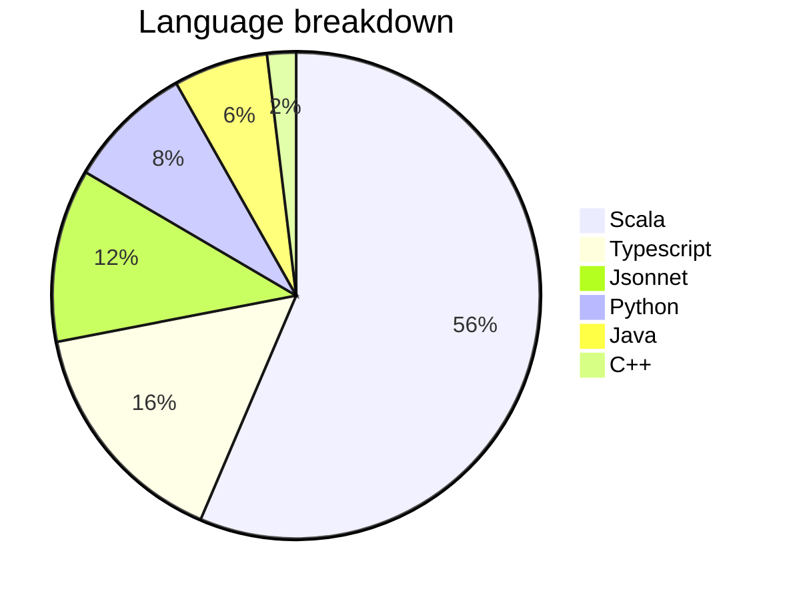
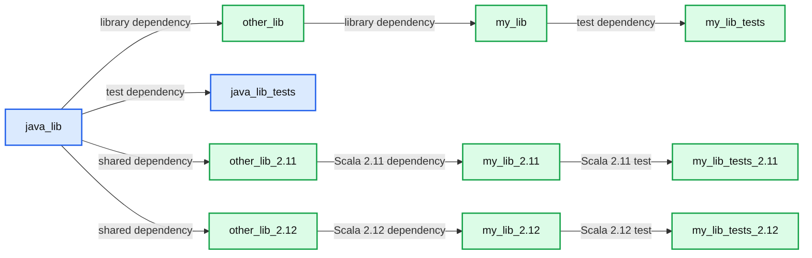
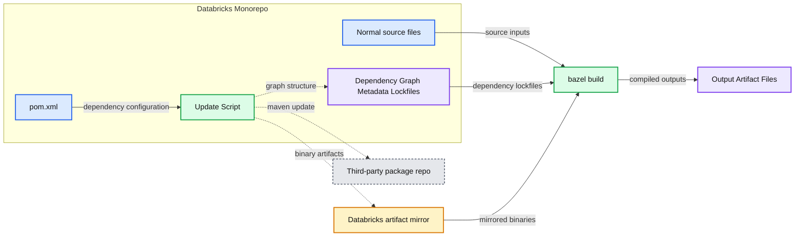
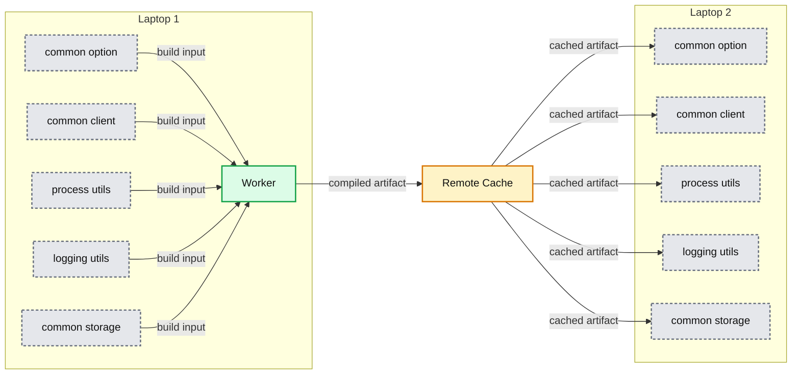
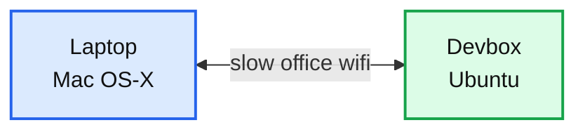
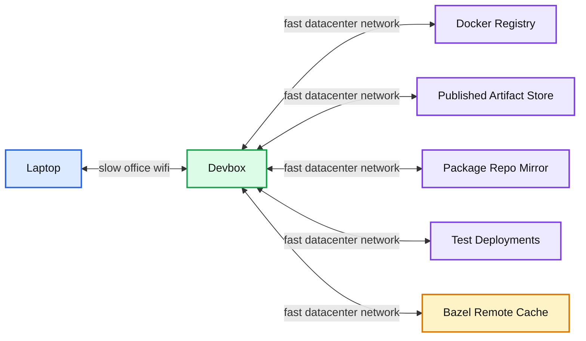
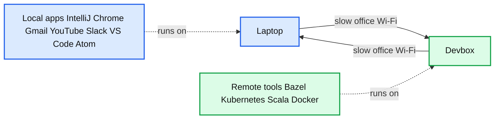
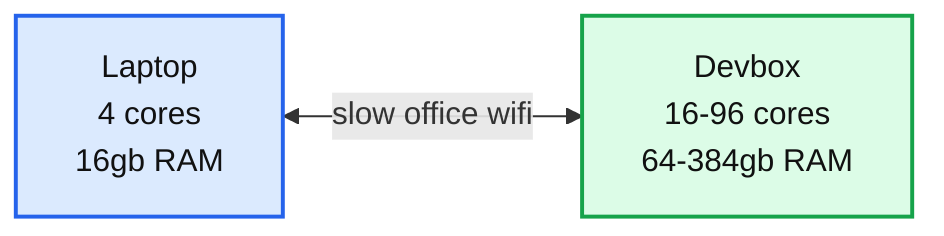
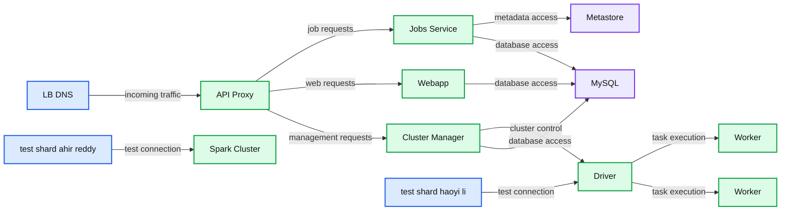

# Scala at Scale at Databricks

- Source: https://www.databricks.com/blog/2021/12/03/scala-at-scale-at-databricks.html
- Published: 2021-12-03
- Authors: Li Haoyi
- Categories: engineering, open-source
- Images: 10 total, 9 extracted as architecture

With hundreds of developers and millions of lines of code, Databricks is one of the largest Scala shops around. This post will be a broad tour of Scala at Databricks, from its inception to usage, style, tooling and challenges. We will cover topics ranging from cloud infrastructure and bespoke language tooling to the human processes around managing our large Scala codebase. From this post, you'll learn about everything big and small that goes into making Scala at Databricks work, a useful case study for anyone supporting the use of Scala in a growing organization.

## Usage

Databricks was built by the original creators of Apache Spark™, and began as distributed Scala collections. Scala was picked because it is one of the few languages that had serializable lambda functions, and because its JVM runtime allows easy interop with the Hadoop-based big-data ecosystem. Since then, both Spark and Databricks have grown far beyond anyone’s initial imagination. The details of that growth are beyond the scope of this post, but the initial Scala foundation remained.

### Language breakdown

Scala is today a sort of *lingua franca* within Databricks. Looking at our codebase, the most popular language is Scala, with millions of lines, followed by Jsonnet (for configuration management), Python (scripts, ML, PySpark) and Typescript (Web). We use Scala everywhere: in distributed big-data processing, backend services, and even some CLI tooling and script/glue code. Databricks isn't averse to writing non-Scala code; we also have high-performance C++ code, some Jenkins Groovy, Lua running inside Nginx, bits of Go and other things. But the large bulk of code remains in Scala.

**Summary:** The chart shows Databricks’ codebase language breakdown, dominated by Scala.

**Components:**

- Scala: 55.9%
- Typescript: 15.4%
- Jsonnet: 11.4%
- Python: 8.3%
- Java: 6.2%
- C++: 1.9%

**Flows:**

- none

**Numbers:** 55.9%, 15.4%, 11.4%, 8.3%, 6.2%, 1.9%

source image: https://www.databricks.com/wp-content/uploads/2021/12/scala-blog-img-1a.png

### Scala style

Scala is a flexible language; it can be written as a Java-like object-oriented language, a Haskell-like functional language, or a Python-like scripting language. If I had to describe the style of Scala written at Databricks, I'd put it at 50% Java-ish, 30% Python-ish, 20% functional:

- Backend services tend to rely heavily on Java libraries: Netty, Jetty, Jackson, AWS/Azure/GCP-Java-SDK, etc.
- Script-like code often uses libraries from the [com-lihaoyi ecosystem](https://github.com/com-lihaoyi): os-lib, requests-scala, upickle, etc.
- We use basic functional programming features throughout: things like function literals, immutable data, case-class hierarchies, pattern matching, collection transformations, etc.
- Zero usage of "archetypical" Scala frameworks: Play, Akka, Scalaz, Cats, ZIO, etc.

While the Scala style varies throughout the codebase, it generally remains somewhere between a better-Java and type-safe-Python style, with some basic functional features. Newcomers to Databricks generally do not have any issue reading the code even with zero Scala background or training and can immediately start making contributions. Databricks' complex systems have their own barrier to understanding and contribution (writing large-scale high-performance multi-cloud systems is non-trivial!) but learning enough Scala to be productive is generally not a problem.

### Scala proficiency

Almost everyone at Databricks writes some Scala, but few people are enthusiasts. We do no formal Scala training. People come in with all sorts of backgrounds and write Scala on their first day and slowly pick up more functional features as time goes on. The resultant Java-Python-ish style is the natural result of this.

Despite almost everyone writing some Scala, most folks at Databricks don't go too deep into the language. People are first-and-foremost infrastructure engineers, data engineers, ML engineers, product engineers, and so on. Once in a while, we have to dive deep to deal with something tricky (e.g., shading, reflection, macros, etc.), but that's far outside the norm of what most Databricks engineers need to deal with.

## Local tooling

By and large, most Databricks code lives in a mono-repo. Databricks uses the Bazel build tool for everything in the mono-repo: Scala, Python, C++, Groovy, Jsonnet config files, Docker containers, Protobuf code generators, etc. Given that we started with Scala, this used to be all SBT, but we largely migrated to Bazel for its better support for large codebases. We still maintain some smaller open-source repos on SBT or Mill, and some code has parallel Bazel/SBT builds as we try to complete the migration, but the bulk of our code and infrastructure is built around Bazel.

### Bazel at Databricks

Bazel is excellent for large teams. It is the only build tool that runs all your build steps and tests inside separate LXC containers by default, which helps avoid unexpected interactions between parts of your build. By default, it is parallel and incremental, something that is of increasing importance as the size of the codebase grows. Once set up and working, it tends to work the same on everyone's laptop or build machines. While not 100% hermetic, in practice it is good enough to largely avoid a huge class of problems related to inter-test interference or accidental dependencies, which is crucial for keeping the build reliable as the codebase grows. We discuss using Bazel to parallelize and speed up test runs in the blog post [*Fast Parallel Testing with Bazel at Databricks*](https://www.databricks.com/blog/2019/07/23/fast-parallel-testing-at-databricks-with-bazel.html).

The downside of Bazel is it *requires* a large team. Bazel encapsulates 20 years of evolution from python-generating-makefiles, and it shows: there's a lot of accumulated cruft and sharp edges and complexity. While it tends to work well once set up, configuring Bazel to do what you want can be a challenge. It's to the point where you basically need a 2-4 person team specializing in Bazel to get it running well.

Furthermore, by using Bazel you give up on a lot of the existing open-source tooling and knowledge. Some library tells you to pip install something? Provides an SBT/Maven/Gradle/Mill plugin to work with? Some executable wants to be apt-get installed? With Bazel you can use none of that, and would need to write a lot of integrations yourself. While any individual integration is not too difficult to set up, you often end up needing a lot of them, which adds up to become quite a significant time investment.

While these downsides are an acceptable cost for a larger organization, it makes Bazel a total non-starter for solo projects and small teams. Even Databricks has some small open-source codebases still on SBT or Mill where Bazel doesn’t make sense. For the bulk of our code and developers, however, they’re all on Bazel.

### Compile times

Scala compilation speed is a common concern, and we put in significant effort to mitigate the problem:

- Set up Bazel to compile Scala using a long-lived background compile worker to keep the compiler JVM hot and fast.
- Set up incremental compilation (via Zinc) and parallel compilation (via Hydra) on an opt-in basis for people who want to use it.
- Upgraded to a more recent version of Scala 2.12, which is much faster than previous versions.

More details on the work are in the blog post [*Speedy Scala Builds with Bazel at Databricks*](https://www.databricks.com/blog/2019/02/27/speedy-scala-builds-with-bazel-at-databricks.html). While the Scala compiler is still not particularly fast, our investment in this means that Scala compile times are not among the top pain points faced by our engineers.

### Cross building

Cross building is another common concern for Scala teams: Scala is binary incompatible between major versions, meaning code meant to support multiple versions needs to be separately compiled for both. Even ignoring Scala, supporting multiple Spark versions has similar requirements. Databricks' Bazel-Scala integration has cross-building built in, where every build target (equivalent to a "module" or "subproject") can specify a list of Scala versions it supports:

With the above inputs, our cross_scala_lib function generates my_lib_2.11 and my_lib_2.12 versions of the build target, with dependencies on the corresponding other_lib_2.11 and other_lib_2.12 targets. Effectively, each Scala version gets its own sub-graph of build targets within the larger Bazel build graph.

**Summary:** Bazel macros duplicate the Scala build graph into separate Scala 2.11 and Scala 2.12 sub-graphs while retaining shared Java targets.

**Components:**

- `java_lib`: shared Java Bazel target.
- `other_lib`: cross-Scala library target supporting Scala 2.11 and 2.12.
- `my_lib`: cross-Scala library target supporting Scala 2.11 and 2.12.
- `java_lib_tests`: shared Java test target.
- `my_lib_tests`: cross-Scala test target.
- `my_lib_2.11`, `other_lib_2.11`: Scala 2.11 Bazel targets.
- `my_lib_2.12`, `other_lib_2.12`: Scala 2.12 Bazel targets.
- `Bazel Macros`: generates version-specific build targets.

**Flows:**

- `java_lib -> other_lib`: Java library dependency.
- `java_lib -> java_lib_tests`: Java test dependency.
- `other_lib -> my_lib`: library dependency.
- `my_lib -> my_lib_tests`: test dependency.
- `java_lib -> other_lib_2.11`: shared Java dependency.
- `java_lib -> other_lib_2.12`: shared Java dependency.
- `java_lib -> java_lib_tests`: Java test dependency.
- `other_lib_2.11 -> my_lib_2.11`: Scala 2.11 library dependency.
- `my_lib_2.11 -> my_lib_tests_2.11`: Scala 2.11 test dependency.
- `other_lib_2.12 -> my_lib_2.12`: Scala 2.12 library dependency.
- `my_lib_2.12 -> my_lib_tests_2.12`: Scala 2.12 test dependency.

**Numbers:** 2.11, 2.12

source image: https://www.databricks.com/wp-content/uploads/2021/12/scala-blog-img-crossbuild.png

This style of duplicating the build graph for cross-building has several advantages over the more traditional mechanism for cross-building, which involves a global configuration flag set in the build tool (e.g., ++2.12.12 in SBT):

- Different versions of the same build target are automatically built and tested in parallel since they’re all a part of the same big Bazel build graph.
- A developer can clearly see which build targets support which Scala versions.
- We can work with multiple Scala versions simultaneously, e.g., deploying a multi-JVM application where a backend service on Scala 2.12 interacts with a Spark driver on Scala 2.11.
- We can incrementally roll out support for a new Scala version, which greatly simplifies migrations since there's no "big bang" cut-over from the old version to the new.

While this technique for cross-building originated at Databricks for our own internal build, it has spread elsewhere: to the [Mill](https://github.com/com-lihaoyi/mill) build tool's cross-build support, and even the old SBT build tool via [SBT-CrossProject](https://github.com/portable-scala/sbt-crossproject).

### Managing third-party dependencies

Third-party dependencies are pre-resolved and mirrored; dependency resolution is removed from the "hot" edit-compile-test path and only needs to be re-run if you update/add a dependency. This is a common pattern within the Databricks' codebase.

Every external download location we use inevitably goes down; whether it's Maven Central being flaky, PyPI having an outage, or even www.7-zip.org returning 500s. Somehow it doesn't seem to matter *who* we are downloading *what* from: external downloads inevitably stop working, which causes downtime and frustration for Databricks developers.

The way we mirror dependencies resembles a lockfile, common in some ecosystems: when you change a third-party dependency, you run a script that updates the lockfile to the latest resolved set of dependencies. But we add a few twists:

- Rather than just recording dependency versions, we mirror the respective dependency to our internal package repository. Thus we not only avoid depending on third-party package hosts for version resolution but we also avoid depending on them for downloads as well.
- Rather than recording a flat list of dependencies, we also record the dependency graph between them. This allows any internal build target depending on a third-party package to pull in exactly the transitive dependencies without reaching out over the network.
- We can manage multiple incompatible sets of dependencies in the same codebase by resolving multiple lockfiles. This gives us the flexibility for dealing with incompatible ecosystems, e.g., Spark 2.4 and Spark 3.0, while still having the guarantee that as long as someone sticks to dependencies from a single lockfile, they won't have any unexpected dependency conflicts.

**Summary:** The diagram shows Databricks managing external dependencies through Maven updates and Bazel builds within a monorepo.

**Components:**

- Databricks Monorepo - repository containing source files and dependency metadata
- pom.xml - Maven dependency declaration
- Update Script - dependency update process
- Third-party package repo - external Maven package repository
- Dependency Graph Metadata Lockfiles - locked dependency graph metadata
- Databricks artifact mirror - internal binary artifact mirror
- Normal source files - application source code
- bazel build - reproducible build process
- Output Artifact Files - generated build artifacts

**Flows:**

- pom.xml -> Update Script: dependency configuration
- Update Script -> Third-party package repo: maven/update requests
- Update Script -> Dependency Graph Metadata Lockfiles: graph structure
- Update Script -> Databricks artifact mirror: binary artifacts
- Normal source files -> bazel build: source inputs
- Dependency Graph Metadata Lockfiles -> bazel build: dependency lockfiles
- Databricks artifact mirror -> bazel build: mirrored binaries
- bazel build -> Output Artifact Files: compiled outputs

**Numbers:** none

source image: https://www.databricks.com/wp-content/uploads/2021/12/scala-blog-img-depend.png

As you can see, while the “maven/update” process to modify external dependencies (dashed arrows) requires access to the third-party package repos, the more common “bazel build” process (solid arrows) takes places entirely within code and infrastructure that we control.

This way of managing external dependencies gives us the best of both worlds. We get the fine-grained dependency resolution that tools like Maven or SBT provide, while also providing the pinned dependency versions that lock-file-based tools like Pip or Npm provide, as well as the hermeticity of running our own package mirror. This is different from how most open-source build tools manage third-party dependencies, but in many ways it is better. Vendoring dependencies in this way is faster, more reliable, and less likely to be affected by third-party service outages than the normal way of directly using the third-party package repositories as part of your build.

### Linting workflows

Perhaps the last interesting part of our local development experience is linting: things that are *probably* a good idea, but for which there are enough exceptions that you can't just turn them into errors. This category includes Scalafmt, Scalastyle, compiler warnings, etc. To handle these, we:

- Do not enforce linters during local development, which helps streamline the dev loop keeping it fast.
- Enforce linters when merging into master; this ensures that code in master is of high quality.
- Provide escape hatches for scenarios in which the linters are wrong and need to be overruled.

This strategy applies equally to all linters, just with minor syntactic differences (e.g., // scalafmt:off vs // scalastyle:off vs @SuppressWarnings as the escape hatch). This turns warnings from transient things that scrolled past in the terminal to long-lived artifacts that appear in the code:

The goal of all this ceremony around linting is to force people to pay attention to lint errors. By their nature, linters always have false positives, but much of the time, they highlight real code smells and issues. Forcing people to silence the linter with an annotation forces both author and reviewer to consider each warning and decide whether it is truly false positive or whether it is highlighting a real problem. This approach also avoids the common failure mode of warnings piling up in the console output unheeded. Lastly, we can be more aggressive in rolling out new linters, as even without 100% accuracy the false positives can always be overridden after proper consideration.

## Remote infrastructure

Apart from the build tool that runs locally on your machine, Scala development at Databricks is supported by a few key services. These run in our AWS dev and test environment and are crucial for development work at Databricks to make progress.

### Bazel remote cache

The idea of the Bazel Remote Cache is simple: never compile the same thing twice, company-wide. If you are compiling something that your colleague compiled on their laptop, using the same inputs, you should be able to simply download the artifact they compiled earlier.

**Summary:** The diagram shows two laptops sharing compiled artifacts through a Bazel Remote Cache.

**Components:**

- `//common/option` build module
- `//common/client` build module
- `//utils/process-utils` build module
- `//logging/utils` build module
- `//common/storage` build module
- Worker on Laptop 1
- Remote Cache
- Mirrored build modules on Laptop 2 using the same paths

**Flows:**

- `//common/option -> Worker`: build input
- `//common/client -> Worker`: build input
- `//utils/process-utils -> Worker`: build input
- `//logging/utils -> Worker`: build input
- `//common/storage -> Worker`: build input
- `Worker -> Remote Cache`: compiled artifact
- `Remote Cache -> //common/option`: cached artifact
- `Remote Cache -> //common/client`: cached artifact
- `Remote Cache -> //utils/process-utils`: cached artifact
- `Remote Cache -> //logging/utils`: cached artifact
- `Remote Cache -> //common/storage`: cached artifact

**Numbers:** none

source image: https://www.databricks.com/wp-content/uploads/2021/11/scala-blog-img-2-1024x538.png

Remote Caching is a feature of the Bazel build tool, but requires a backing server implementing the [Bazel Remote Cache Protocol](https://docs.bazel.build/versions/main/remote-caching.html). At the time, there were no good open-source implementations, so we built our own: a tiny golang server built on top of [GroupCache](https://github.com/golang/groupcache) and S3. This greatly speeds up work, especially if you're working on incremental changes from a recent master version and almost everything has been compiled already by some colleague or CI machine.

The Bazel Remote Cache is not problem-free. It’s yet another service we need to baby-sit. Sometimes bad artifacts get cached, causing the build to fail. Nevertheless, the speed benefits of the Bazel Remote Cache are enough that our development process cannot live without it.

### Devbox

The idea of the Databricks Devbox is simple: edit code locally, run it on a beefy cloud VM co-located with all your cloud infrastructure.

A typical workflow is to edit code in Intellij, run bash commands to build/test/deploy on devbox. Below you can see the devbox in action: every time the user edits code in IntelliJ, the green "tick" icon in the menu bar briefly flashes to a blue "sync" icon before flashing back to green, indicating that sync has completed:

The Devbox has a bespoke high-performance file synchronizer to bring code changes from your local laptop to the remote VM. Hooking into [fsevents](https://developer.apple.com/library/archive/documentation/Darwin/Conceptual/FSEvents_ProgGuide/UsingtheFSEventsFramework/UsingtheFSEventsFramework.html) on OS-X and [inotify](https://man7.org/linux/man-pages/man7/inotify.7.html) on Linux, it can respond to code changes in real-time. By the time you click over from your editor to your console, your code is synced and ready to be used.

This has a host of advantages over developing locally on your laptop:

- The Devbox runs Linux, which is identical to our CI environments, and closer to our production environments than developers' Mac-OSX laptops. This helps ensure your code behaves the same in dev, CI, and prod.

**Summary:** A Mac OS-X laptop communicates bidirectionally with an Ubuntu devbox over slow office wifi.

**Components:**

- Laptop - Mac OS-X
- Devbox - Ubuntu

**Flows:**

- Laptop -> Devbox: slow office wifi
- Devbox -> Laptop: slow office wifi

**Numbers:** none

source image: https://www.databricks.com/wp-content/uploads/2021/11/scala-blog-img-3-1024x538.png

- Devbox lives in EC2 with our Kubernetes-clusters, remote-cache, and docker-registries. This means great network performance between the devbox and anything you care about.

**Summary:** The diagram shows a Devbox connected over slow office WiFi to a laptop and over a fast datacenter network to development infrastructure.

**Components:**

- Laptop: developer workstation
- Devbox: Linux development environment running in EC2
- Docker Registry: Docker image registry
- Published Artifact Store: artifact storage
- Package Repo Mirror: package repository mirror
- Test Deployments: test deployment environments
- Bazel Remote Cache: remote build cache
- Slow office WiFi: laptop network connection
- Fast datacenter network: Devbox infrastructure network

**Flows:**

- Laptop -> Devbox: development access over slow office WiFi
- Devbox -> Laptop: development responses over slow office WiFi
- Devbox -> Docker Registry: Docker image access
- Docker Registry -> Devbox: Docker image delivery
- Devbox -> Published Artifact Store: artifact access
- Published Artifact Store -> Devbox: artifact delivery
- Devbox -> Package Repo Mirror: package access
- Package Repo Mirror -> Devbox: package delivery
- Devbox -> Test Deployments: test deployment access
- Test Deployments -> Devbox: test deployment feedback
- Devbox -> Bazel Remote Cache: build cache access
- Bazel Remote Cache -> Devbox: cached build outputs

**Numbers:** none

source image: https://www.databricks.com/wp-content/uploads/2021/11/scala-blog-img-4-1024x538.png

- Bazel/Docker/Scalac don't need to fight with IntelliJ/Youtube/Hangouts for system resources. Your laptop doesn't get so hot, your fans don't spin up, and your operating system (mostly Mac-OSX for Databricks developers) doesn't get laggy.

**Summary:** The diagram shows a laptop running local productivity and development tools connected over slow office Wi-Fi to a customizable Devbox running resource-intensive build and infrastructure tools.

**Components:**

- Laptop: local development machine
- IntelliJ, Chrome, Gmail, YouTube, Slack, Visual Studio Code, Atom: laptop applications
- Devbox: remote development environment
- Bazel, Kubernetes, Scala, Docker: Devbox tools

**Flows:**

- Laptop -> Devbox: development traffic over slow office Wi-Fi
- Devbox -> Laptop: development responses over slow office Wi-Fi

**Numbers:** none

source image: https://www.databricks.com/wp-content/uploads/2021/11/scala-blog-img-5-1024x538.png

- The Devbox is customizable and can run any EC2 instance type. Want RAID0-ed ephemeral disks for better filesystem perf? 96 cores and 384gb of RAM to test something compute-heavy? Go for it! We shut down instances when not in use, so even more expensive instances won't break the bank when used for a short period of time.

**Summary:** A laptop connects to a customizable Devbox over slow office Wi-Fi.

**Components:**

- Laptop - 4-core machine with 16gb RAM
- Devbox - customizable machine with 16-96 cores and 64-384gb RAM
- Slow office Wi-Fi - network connection between the laptop and Devbox

**Flows:**

- Laptop <-> Devbox: development traffic over slow office Wi-Fi

**Numbers:** 4 cores, 16gb RAM, 16-96 cores, 64-384gb RAM

source image: https://www.databricks.com/wp-content/uploads/2021/12/scala-blog-img-6b.png

- The Devbox is disposable. apt-get install the wrong thing? Accidentally rm some system files you shouldn't? Some third-party installer left your system in a bad state? It's just an EC2 instance, so throw it away and get a new one.

The speed difference from doing things on the Devbox is dramatic: multi-minute uploads or downloads cut down to a few seconds. Need to deploy to Kubernetes? Upload containers to a docker registry? Download big binaries from the remote cache? Doing it on the Devbox with 10G data center networking is orders of magnitudes faster than doing it from your laptop over home or office wifi. Even local compute/disk-bound workflows are often faster running on the Devbox as compared to running them on a developer's laptop.

### Runbot

Runbot is a bespoke CI platform, written in Scala, managing our elastic "bare EC2" cluster with 100s of instances and 10,000s of cores. Basically a hand-crafted Jenkins, but with all the things we want, and without all the things we don't want. It is about 10K-LOC of Scala, and serves to validate all pull requests that merge into Databricks' main repositories.

Runbot leverages the Bazel build graph to selectively run tests on pull requests depending on what code was changed, aiming to return meaningful CI results to the developer as soon as possible. Runbot also integrates with the rest of our dev infrastructure:

- We intentionally keep the Runbot CI test environment and the Devbox remote dev environments as similar as possible - even running the same AMIs - to try and avoid scenarios where code behaves differently in one or the other.
- Runbot's worker instances make full use of the Bazel Remote Cache, allowing them to skip "boilerplate" build steps and only re-compiling and re-testing things that may have been affected by a pull request.

A more detailed dive into the Runbot system can be found in the blog post [Developing Databricks' Runbot CI Solution](https://www.databricks.com/blog/2021/10/14/developing-databricks-runbot-ci-solution.html).

### Test Shards

Test Shards let a developer easily spin up a hermetic-ish Databricks-in-a-box, letting you run integration tests or manual tests via the browser or API. As Databricks is a multi-cloud product supporting Amazon/Azure/Google cloud platforms, Databricks' Test Shards can similarly be spun up on any cloud to give you a place for integration-testing and manual-testing of your code changes.

**Summary:** The diagram shows Databricks test shards routing through shared services to MySQL and Metastore, while connecting to Spark clusters in separate VPCs.

**Components:**

- LB-DNS: load balancer and DNS entry
- test-shard-haoyi-li: test shard environment
- API Proxy: API routing service
- Cluster Manager: Spark cluster management service
- Webapp: browser-facing application
- Jobs Service: job submission service
- MySQL: MySQL database
- Metastore: metadata store
- VPC: virtual private cloud
- Spark Cluster: Spark compute cluster
- Driver: Spark driver
- Worker: Spark worker
- test-shard-ahir-reddy: test shard environment

**Flows:**

- LB-DNS -> API Proxy: incoming browser or API traffic
- API Proxy -> Cluster Manager: cluster management requests
- API Proxy -> Webapp: web application requests
- API Proxy -> Jobs Service: job requests
- Cluster Manager -> MySQL: database access
- Webapp -> MySQL: database access
- Jobs Service -> MySQL: database access
- Jobs Service -> Metastore: metadata access
- Cluster Manager -> Driver: Spark cluster control
- Driver -> Worker: task execution
- Driver -> Worker: task execution
- test-shard-haoyi-li -> VPC Spark Cluster: test shard connection
- test-shard-ahir-reddy -> VPC Spark Cluster: test shard connection

**Numbers:** none

source image: https://www.databricks.com/wp-content/uploads/2021/11/scala-blog-img-8.jpg

A test shard more-or-less comprises the entirety of the Databricks platform - all our backend services - just with reduced resource allocations and some simplified infrastructure. Most of these are Scala services, although we have some other languages mixed in as well.

Maintaining Databricks' Test Shards is a constant challenge:

- Our Test Shards are meant to accurately reflect the current production environment with as high fidelity as possible.
- As Test Shards are used as part of the iterative development loop, creating and updating them should be as fast as possible.
- We have hundreds of developers using test shards, it's unfeasible to spin up a full-sized production deployment for each one, and we must find ways to cut corners while preserving fidelity.
- Our production environment is rapidly evolving, with new services, new infrastructural components, even new cloud platforms sometimes, and our Test Shards have to keep up.

Test shards require infrastructure that is large scale and complex, and we hit all sorts of limitations we never imagined existed. What do you do when your Azure account runs out of resource groups? When AWS load balancer creation becomes a bottleneck? When the number of pods makes your Kubernetes cluster start misbehaving? While "Databricks in a box" sounds simple, the practicality of providing such an environment to 100s of developers is an ongoing challenge. A lot of creative techniques are used to deal with the four constraints above and ensure the experience of Databricks' developers using test shards remains as smooth as possible.

Databricks currently runs hundreds of test shards spread over multiple clouds and regions. Despite the challenge of maintaining such an environment, test shards are non-negotiable. They provide a crucial integration and manual testing environment before your code is merged into master and shipped to staging and production.

## Good parts

### Scala/JVM performance is generally great

Databricks has had no shortage of performance issues, some past and some ongoing. Nevertheless, virtually none of these issues were due to Scala or the JVM.

That's not to say Databricks doesn't have performance issues sometimes. However, they tend to be in the database queries, in the RPCs, or in the overall system architecture. While sometimes some inefficiently-written application-level code can cause slowdowns, that kind of thing is usually straightforward to sort out with a profiler and some refactoring.

Scala lets us write some surprisingly high-performance code, e.g., our Sjsonnet configuration compiler is orders of magnitude faster than the C++ implementation it replaced, as discussed in our earlier blog post [*Writing a Faster Jsonnet Compiler*](https://www.databricks.com/blog/2018/10/12/writing-a-faster-jsonnet-compiler.html).

But overall, the main benefit of Scala/JVM's good performance is *how little we think about* the compute performance of our Scala code. While performance can be a tricky topic in large-scale distributed systems, the compute performance of our Scala code running on the JVM just isn’t a problem.

### A flexible lingua franca makes it easy to share tooling and expertise

Being able to share tooling throughout the organization is great. We can use the same build-tool integration, IDE integration, profilers, linters, code style, etc. on backend web services, our high-performance big data runtime, and our small scripts and executables.

Even as code style varies throughout the org, all the same tooling still applies, and it's familiar enough that the language poses no barrier for someone jumping in.

This is especially important when manpower is limited. Maintaining a single toolchain with the rich collection of tools described above is already a big investment. Even with the small number of languages we have, it is clear that the "secondary" language toolchains are not as polished as our toolchain for Scala, and the difficulty of bringing them up to the same level is apparent. Having to duplicate our Scala toolchain investment N times to support a wide variety of different languages would be a very costly endeavor we have so far managed to avoid.

### Scala is surprisingly good for scripting/glue!

People usually think of Scala as a language for compilers or Serious Business™ backend services. However, we have found that Scala is also an excellent language for script-like glue code! By this, I mean code juggling subprocesses, talking to HTTP APIs, mangling JSON, etc. While the high-performance of Scala's JVM runtime doesn't matter for scripting, many other platform benefits still apply:

- Scala is concise. Depending on the libraries you use, it can be as or even more concise than "traditional" scripting languages like Python or Ruby, and is just as readable.
- Scripting/glue code is often the hardest to unit test. Integration testing, while possible, is often slow and painful; more than once we've had third-party services throttle us for running too many integration tests! In this kind of environment, having a basic level of compile-time checking is a godsend.
- Deployment is good: assembly jars are far better than Python PEXs, for example, as they are more standard, simple, hermetic, performant, etc. Trying to deploy Python code across different environments has been a constant headache, with someone always brew install or apt-get installing something that would cause our deployed-and-tested Python executables to break. This doesn’t happen with Scala assembly jars.

Scala/JVM isn't perfect for scripting: there's a 0.5-1s JVM startup overhead for any non-trivial program, memory usage is high, and the iteration loop of edit/compile/running a Scala program is comparatively slow. Nevertheless, we have found that there are plenty of benefits of using Scala over a traditional scripting language like Python, and we have introduced Scala in a number of scenarios where someone would naturally expect a scripting language to be used. Even Scala's REPL has proven to be a valuable tool for interacting with services, both internal and third-party, in a convenient and flexible manner.

## Conclusion

Scala at Databricks has proven to be a solid foundation for us to build upon

Scala is not without its challenges or problems, but neither would any other language or platform. Large organizations running dynamic languages inevitably put huge effort into speeding them up or adding compile-time checking; large organizations on other static languages inevitably put effort into DSLs or other tools to try and speed up development. While Scala does not suffer from either problem, it has its own issues, which we had to put in the effort to overcome.

One point of interest is how generic many of our tools and techniques are. Our CI system, devboxes, remote cache, test shards, etc. are not Scala-specific. Neither is our strategy for dependency management or linting. Much of these apply regardless of language or platform and benefit our developers writing Python or Typescript or C++ as much as those writing Scala. It turns out Scala is not special; Scala developers face many of the same problems developers using other languages face, with many of the same solutions.

Another interesting thing is how separate Databricks is from the rest of the Scala ecosystem; we have never really bought into the "reactive" mindset or the "hardcore-functional-programming" mindset. We do things like cross-building, dependency management, and linting very differently from most in the community. Despite that, or perhaps even because of that, we have been able to scale our Scala-using engineering teams without issue and reap the benefits of using Scala as a lingua franca across the organization.

Databricks is not particularly dogmatic about Scala. We are first and foremost big data engineers, infrastructure engineers, and product engineers. Our engineers want things like faster compile times, better IDE support, or clearer error messages, and are generally uninterested in pushing the limits of the Scala language. We use different languages where they make sense, whether configuration management via Jsonnet, machine learning in Python, or high-performance data processing in C++. As the business and team grows, it is inevitable that we see some degree of divergence and fragmentation. Nevertheless, we are reaping the benefits of a unified platform and tooling around Scala on the JVM, and hope to stretch that benefit for as long as possible.

Databricks is one of the largest Scala shops around these days, with a growing team and a growing business. If you think our approach to Scala and development in general resonates, you should definitely [come work with us](https://www.databricks.com/company/careers)!
