# Building a Geospatial Lakehouse, Part 1

*One system, unified architecture design, all functional teams, diverse use cases*

- Source: https://www.databricks.com/blog/2021/12/17/building-a-geospatial-lakehouse-part-1.html
- Published: 2021-12-17
- Authors: Alex Barreto, Yong Sheng Huang, Jake Therianos
- Categories: engineering, data-engineering
- Images: 1 total, 1 extracted as architecture

This blog is outdated. Please refer to [this Spatial SQL blog](https://www.databricks.com/blog/introducing-spatial-sql-databricks-80-functions-high-performance-geospatial-analytics) for up-to-date approaches to storing and processing geospatial data within your Databricks Lakehouse.

An open secret of geospatial data is that it contains priceless information on behavior, mobility, business activities, natural resources, points of interest and more. Geospatial data can turn into critically valuable insights and create significant competitive advantages for any organization. Look no further than Google, Amazon, Facebook to see the necessity for adding a dimension of physical and spatial context to an organization's digital data strategy, impacting nearly every aspect of business and financial decision making. For example:

- Retail: Display all the Starbucks coffeehouses in this neighborhood and the foot traffic pattern nearby so that we can better understand return on investment of a new store
- Marketing: For brand awareness, how many people/automobiles pass by a billboard each day?  Which ads should we place in this area?
- Telecommunications: In which areas do mobile subscribers encounter network issues? When is capacity planning needed in order to maintain competitive advantage?
- Operation: How much time will it take to deliver food/services to a location in New York City?  How can we optimize the routing strategy to improve delivery efficiency?

Despite its immense value, geospatial data remains under-utilized in most businesses across industries. Only a handful of companies -- primarily the technology giants such as Google, Facebook, Amazon, across the world -- have successfully “cracked the code” for geospatial data. By integrating geospatial data in their core business processes Consider how location is used to drive supply-chain and logistics for Amazon, or routing and planning for ride-sharing companies like Grab, or support agricultural planning at scale for John Deere. These companies are able to systematically exploit the insights of what geospatial data has to offer and continuously drive business value realization.

**At the root of this disparity is the lack of an effective data system that evolves with geospatial technology advancement.** With the proliferation of mobile and IoT devices -- effectively, sensor arrays -- cost effective and ubiquitous positioning technologies, high resolution imaging and a growing number of open source technologies have changed the scene of geospatial data analytics. The data is massive in size -- 10s TBs of data can be generated on a daily basis; complex in structure with various formats, and compute intensive with geospatial-specific transformations and queries requiring hours and hours of compute. The traditional data warehouses and data lake tools are not well disposed toward effective management of these data and fall short in supporting cutting-edge geospatial analysis and analytics.

To help level the playing field, this blog presents a new Geospatial Lakehouse architecture as a **general design pattern**. In our experience, the critical factor to success is to establish the right architecture of a geospatial data system, simplifying the remaining implementation choices -- such as libraries, visualization tools, etc. -- and enabling the open interface design principle allowing users to make purposeful choices regarding deployment. In this blog, we provide insights on the complexity and practical challenges of geospatial data management, key advantages of the Geospatial Lakehouse architecture and walk through key steps on how it can be built from scratch, with best-practice guidance on how an organization can build a cost-effective and scalable geospatial analytics capability.

## The challenges

As organizations race to close the gap on their location intelligence, they actively seek to evaluate and internalize commercial and public geospatial datasets. When taking these data through traditional ETL processes into target systems such as a data warehouse, organizations are challenged with requirements that are unique to geospatial data and not shared by other enterprise business data. As a result, organizations are forced to rethink many aspects of the design and implementation of their geospatial data system.

Until recently, the data warehouse has been the go-to choice for managing and querying large data. However the use cases of spatial data have expanded rapidly to include advanced machine learning and graph analytics with sophisticated geospatial data visualizations. As a result, enterprises require geospatial data systems to support a much more diverse data applications including SQL-based analytics, real-time monitoring, data science and machine learning. Most of the recent advances in AI and its applications in spatial analytics have been in better frameworks to model unstructured data (text, images, video, audio), but these are precisely the types of data that a data warehouse is not optimized for.

**A common approach up until now, is to forcefully patch together several systems — a data lake, several data warehouses, and other specialized systems, such as streaming, time-series, graph, and image databases.** Having a multitude of systems increases complexity and more importantly, introduces delay as data professionals invariably need to move or copy data between each system. Data engineers are asked to make tradeoffs and tap dance to achieve flexibility, scalability and performance while saving cost, all at the same time.

Data scientists and ML engineers,  struggle to navigate the decision space for geospatial data and use cases, which compounds data challenges inherent therein:

- Ingesting among myriad formats, from multiple data sources, including GPS, satellite imagery, video, sensor data, lidar, hyper spectral,  along with a variety of coordinate systems.
- Preparing, storing and indexing spatial data (raster and vector),
- Managing geometry classes as abstractions of spatial data, running various spatial predicates and functions.
- Visualizing spatial manipulations in a GIS (geographic information systems) environment.
- Integrating spatial data in data-optimized platforms such as Databricks with the rest of their GIS tooling.
- Context switching between pure GIS operations and blended data operations as involved in DS and AI/ML.

This dimension of functional complexity is coupled with a surfeit of:

- **Tools**, **libraries** and **solutions**, all with specific usage models,  along with  a plurality of architectures that at times fail to maximize parallelism and scale; each created to solve a subset of geospatial analysis and modeling problems, supported and maintained by many new organizations and open-source projects.
- Exploding rich **data** **quantities**, driven by new cost effective solutions for massive data acquisition, including IoT, satellites, aircraft, drones, automobiles as well as smartphones.
- Evolving **data entities**, with more third parties collecting, processing, maintaining and serving Geospatial data, effectively challenging approaches to organize and analyze this data.
- Difficulty extracting value from data at scale, due to an inability to find clear, non-trivial examples which account for the geospatial data engineering and computing power required, leaving the data scientist or data engineer without validated guidance for enterprise analytics and machine learning capabilities, covering oversimplified use cases with the most advertised technologies, working nicely as “toy” laptop examples, yet ignoring the fundamental issue which is the data.

## The Databricks Geospatial Lakehouse

It turns out that many of the challenges faced by the Geospatial field can be addressed by the [Databricks Lakehouse](http://cidrdb.org/cidr2021/papers/cidr2021_paper17.pdf) Platform. Designed to be **simple**, **open** and **collaborative**, the Databricks Lakehouse combines the best elements of data lakes and data warehouses. It simplifies and standardizes *data engineering pipelines* with the same design pattern, which begins with raw data of diverse types as a “single source of truth” and progressively adds structure and enrichment through the “data flow.”  Structured, semi-structured and unstructured data can be sourced under one system and effectively eliminates the need to silo Geospatial data from other datasets. Subsequent transformations and aggregations can be performed end-to-end with continuous refinement and optimization. As a result, data scientists gain new capabilities to scale advanced geospatial analytics and ML use cases. They are now provided with context-specific metadata that is fully integrated with the remainder of enterprise data assets and a diverse yet well-integrated toolbox to develop new features and models to drive business insights.

Additional details on Lakehouse can be found in the [seminal paper](http://cidrdb.org/cidr2021/papers/cidr2021_paper17.pdf) by the Databricks co-founders, and related Databricks [blog](https://www.databricks.com/blog/2020/01/30/what-is-a-data-lakehouse.html).

### Architecture overview

In this section, we present the Databricks Geospatial Lakehouse, highlighting key design principles and practical considerations in implementation.

The overall design anchors on ** ONE SYSTEM, UNIFIED DESIGN, ALL FUNCTIONAL TEAMS, DIVERSE USE CASES**; the design goals based on these include:

- Clean and catalog all your data in one system with [Delta Lake](https://www.databricks.com/product/delta-lake-on-databricks): batch, streaming, structured or unstructured, and make it discoverable to your entire organization via a centralized data store.
- Unify and simplify the design of data engineering pipelines so that best practice patterns can be easily applied to optimize cost and performance while reducing DevOps efforts.  A pipeline consists of a minimal set of three stages (Bronze/Silver/Gold). Data naturally flows through the pipeline where fit-for-purpose transformations and proper optimizations are applied.
- Self-service compute with one-click access to pre-configured clusters are readily available for all functional teams within an organization. Teams can bring their own environment(s) with multi-language support (Python, Java, Scala, SQL) for maximum flexibility. Migrate or execute current solution and code remotely on pre-configurable and customizable clusters.
- Operationalize geospatial data for a diverse range of use cases -- spatial query, advanced analytics and ML at scale. Simplified scaling on Databricks helps you go from small to big data, from query to visualization, from model prototype to production effortlessly. You don’t have to be limited with how much data fits on your laptop or the performance bottleneck of your local environment.

The foundational components of the lakehouse include:

- Delta Lake powered Multi-hop ingestion layer:
  - Bronze tables: optimized for raw data ingestion
  - Silver tables: optimized for performant and cost-effective ETL
  - Gold tables: optimized for fast query and cross-functional collaboration to accelerate extraction of business insights
- Databricks SQL powered Serving + Presentation layer: GIS visualization driven by Databricks SQL data serving, with support of wide range of tools (GIS tools, Notebooks, PowerBI)
- Machine Learning Runtime powered ML / AI layer: Built-in, best off-the-shelf frameworks and ML-specific optimizations streamline the end-to-end data science workflow from data prep to modeling to insights sharing. Managed MLflow service automates model life cycle management and reproduce results

**Summary:** The diagram shows a Databricks Geospatial Lakehouse transforming raw spatial-temporal data through Bronze, Silver, and Gold tables into visualization, reporting, business intelligence, and machine learning use cases.

**Components:**

- POI, CBG, sensor, mobile pings, and map or satellite imagery data sources
- Bronze Tables storing raw spatial-temporal data in Delta format
- Silver Tables containing preprocessed, clean data and extracted features
- Gold Tables containing high-level aggregates
- Databricks SQL serving layer
- Visualization and reporting layer using Databricks Notebooks
- Business intelligence tools
- Machine learning and AI layer
- GIS tools

**Flows:**

- POI data -> Raw spatial temporal data: raw points of interest data
- CBG data -> Raw spatial temporal data: raw census block group data
- Sensor data -> Raw spatial temporal data: raw sensor data
- Mobile pings data -> Raw spatial temporal data: raw mobile location data
- Map or satellite imagery -> Raw spatial temporal data: raw imagery data
- Raw spatial temporal data -> Preprocessed and clean data: geo-pings and POI data drops
- Raw spatial temporal data -> Feature Extraction: spatial-temporal feature input
- Preprocessed and clean data -> High level aggregates: cleaned structured data
- High level aggregates -> Databricks SQL: aggregated geospatial data
- High level aggregates -> Visualization and reporting: notebook visualization data
- Databricks SQL -> Business intelligence: SQL-served data
- Databricks SQL -> GIS tools: geospatial query results
- Databricks SQL -> Machine learning and AI: feature and aggregate data

**Numbers:** none

```mermaid
%% Shows the Databricks Geospatial Lakehouse data flow
flowchart LR
    I[Geospatial data sources]
    B[Bronze Tables raw spatial temporal data]
    S[Silver Tables clean data]
    F[Feature Extraction]
    G[Gold Tables high level aggregates]
    Q[Databricks SQL]
    V[Visualization and reporting]
    BI[Business intelligence]
    GIS[GIS tools]
    ML[Machine learning and AI]

    I -->|raw data drops| B
    B -->|clean and preprocess| S
    B -->|extract features| F
    S -->|aggregate| G
    F -->|feature data| G
    G -->|serve queries| Q
    G -->|notebook data| V
    Q -->|SQL data| BI
    Q -->|geospatial results| GIS
    Q -->|features and aggregates| ML

    classDef client   fill:#dbeafe,stroke:#2563eb,stroke-width:2px,color:#111
    classDef service  fill:#dcfce7,stroke:#16a34a,stroke-width:2px,color:#111
    classDef store    fill:#ede9fe,stroke:#7c3aed,stroke-width:2px,color:#111
    classDef cache    fill:#fef3c7,stroke:#d97706,stroke-width:2px,color:#111
    classDef queue    fill:#cffafe,stroke:#0891b2,stroke-width:2px,color:#111
    classDef critical fill:#fee2e2,stroke:#dc2626,stroke-width:4px,color:#111
    classDef external fill:#e5e7eb,stroke:#6b7280,stroke-width:2px,color:#111,stroke-dasharray:4 3
    classDef decision fill:#fce7f3,stroke:#db2777,stroke-width:2px,color:#111

    class I external
    class B,S,G store
    class F,ML service
    class Q critical
    class V,BI,GIS client
```

source image: https://www.databricks.com/wp-content/uploads/2021/12/db-14-blog-img-1.png

### Major benefits of the design

The Geospatial Lakehouse combines the best elements of data lakes and data warehouses for spatio-temporal data:

- **single source of truth** for data and guarantees for data validity, with cost effective data upsert operations natively supporting SCD1 and SCD2, from which the organization can reliably base decisions
- **easy extensibility** for various processing methods and GIS feature engineering
- **easy scalability**, in terms of both **storage** and **compute**, by decoupling both to leverage separate resources
- **distributed** **collaboration**, as all datasets, applying the salient data standards, are directly accessible from an object store without having to onboard users on the same compute resources, making it straightforward to share data regardless of which teams produce and consume it,  and assure the teams have the most complete and up-to-data data available
- **flexibility **in choosing the **indexing strategy** and **schema definitions**, along with governance mechanisms to control these, so that data sets can be repurposed and optimized specifically for varied Geospatial use cases, all while maintaining data integrity and robust audit trail mechanisms
- **simplified data pipeline** using the multi-hop architecture supporting all of the above

### Design principles

By and large, a Geospatial Lakehouse Architecture follows primary principles of Lakehouse -- open, simple and collaborative.  It added additional design considerations to accommodate requirements specific for geospatial data and use cases.  We describe them as the following:

#### Open interface:

The core technology stack is based on open source projects (Apache Spark, Delta Lake, MLflow). It is by design to work with any distributable geospatial data processing library or algorithm, and with common deployment tools or languages. It is built around Databricks’ REST APIs; simple, standardized geospatial data formats; and well-understood, proven patterns, all of which can be used from and by a variety of components and tools instead of providing only a small set of built-in functionality. You can most easily choose from an established, recommended set of geospatial data formats, standards and technologies, making it easy to add a Geospatial Lakehouse to your existing pipelines so you can benefit from it immediately, and to share code using any technology that others in your organization can run.

#### Simplicity:

We define simplicity as without unnecessary additions or modifications. Geospatial information itself is already complex, high-frequency, voluminous and with a plurality of formats. Scaling out the analysis and modeling of such data on a distributed system means there can be any number of reasons something doesn’t work the way you expect it to. The easiest path to success is to understand & determine the minimal viable data sets, granularities, and processing steps; divide your logic into minimal viable processing units; coalesce these into components; validate code unit by unit, then component by component; integrate (then, integration test) after each component has met provenance.

#### The right tool for the right job:

The challenges of processing Geospatial data means that there is no all-in-one technology that can address every problem to solve in a performant and scalable manner. Some libraries perform and scale well for Geospatial data ingestion; others for geometric transformations; yet others for point-in-polygon and polygonal querying.

For example, libraries such as GeoSpark/Apache Sedona and GeoMesa can perform geometric transformations over terabytes of data very quickly. More expensive operations, such as polygonal or point in polygon queries require increased focus on geospatial data engineering. One technique to scale out point-in-polygon queries, would be to geohash the geometries,  or hexagonally index them with a library such as H3; once done, the overall number of points to be processed are reduced.

#### Democratization:

Providing the right information at the right time for business and end-users to take strategic and tactical decisions forms the backbone of accessibility. Accessibility has historically been a challenge with Geospatial data due to the plurality of formats, high-frequency nature, and the massive volumes involved. By distilling Geospatial data into a smaller selection of highly optimized standardized formats and further optimizing the indexing of these, you can easily mix and match datasets from different sources and across different pivot points in real time at scale.

#### Expressibility:

When your Geospatial data is available, you will want to be able to express it in a highly workable format for exploratory analyses, engineering and modeling. The Geospatial Lakehouse is designed to easily surface and answer *who*,* what* and *where* of your Geospatial data: in which who are the entities subject to analysis (e.g., customers, POIs, properties), *what* are the properties of the entities, and *where* are the locations respective of the entities. The answers to the *who*, *what* and *where* will provide insights and models necessary to formulate what is your actual Geospatial *problem-to-solve*. This is further extended by the Open Interface to empower a wide range of visualization options.

#### AI-enabled:

With the problem-to-solve formulated, you will want to understand *why* it occurs, the most difficult question of them all. To enable and facilitate teams to focus on the *why* -- using any number of advanced statistical and mathematical analyses (such as correlation, stochastics, similarity analyses) and modeling (such as  Bayesian Belief Networks, Spectral Clustering, Neural Nets) -- you need a platform designed to ease the process of automating recurring decisions while supporting human intervention to monitor the performance of models and to tweak them. The Databricks Geospatial Lakehouse is designed with this experimentation methodology in mind.

#### The Multi-hop data pipeline:

Standardizing on how data pipelines will look like in production is important for maintainability and data governance. This enables decision-making on cross-cutting concerns without going into the details of every pipeline. What has worked very well as a big data pipeline concept is the multi-hop pipeline. This has been used before at both small and large companies (including Databricks itself).

The idea is that incoming data from external sources is unstructured, unoptimized, and does not adhere to any quality standards per se. In the multi-hop pipelines, this is called the **Bronze Layer**. Our Raw Ingestion and History layer, it is the physical layer that contains a well-structured and properly formatted copy of the source data such that it performs well in the primary data processing engine, in this case Databricks.

After the bronze stage, data would end up in the **Silver Layer** where data becomes queryable by data scientists and/or dependent data pipelines. Our Filtered, Cleansed and Augmented Shareable Data Assets layer, provides a persisted location for validations and acts as a security measure before impacting customer-facing tables. Additionally, Silver is where all history is stored for the next level of refinement (i.e. Gold tables) that don’t need this level of detail. Omitting unnecessary versions is a great way to improve performance and lower costs in production. *All* transformations (mappings) are completed between the raw version (Bronze) and this layer (Silver).

Finally, there is the **Gold Layer **in which one or more Silver Table is combined into a materialized view that is specific for a use case. As our Business-level Aggregates layer, it is the physical layer from which the broad user group will consume data, and the final, high-performance structure that solves the widest range of business needs given some scope.

## Additional Resources:

For a more hands-on view of how you can work with geospatial data in the Lakehouse, check out this webinar entitled [Geospatial Analytics and AI at Scale](https://www.youtube.com/watch?v=LP198QMdDbY). In the webinar, you will find a great customer example from Stantec and their work on flood prediction, further examples and approaches to geospatial analysis (some found in this [joint-effort blog with UK’s Ordnance Survey](https://www.databricks.com/blog/2021/10/11/efficient-point-in-polygon-joins-via-pyspark-and-bng-geospatial-indexing.html)), and sneak peak at the developing geospatial roadmap for Databricks. The Lakehouse future also includes key geospatial partners such as CARTO ([see recent announcement](https://www.databricks.com/blog/2021/12/09/announcing-cartos-spatial-extension-for-databricks-powering-geospatial-analysis-for-jll.html)), who are building on and extending the Lakehouse to help scale solutions for spatial problems.

## Summary

Geospatial analytics and machine learning at scale will continue to defy a one-size-fits-all model. Through the application of design principles, which are uniquely fitted to the Databricks Lakehouse, you can leverage this infrastructure for nearly any spatiotemporal solution at scale.

In [Part 2](https://www.databricks.com/blog/2022/03/28/building-a-geospatial-lakehouse-part-2.html), we will delve into the practical aspects of the design, and walk through the implementation steps in detail.
