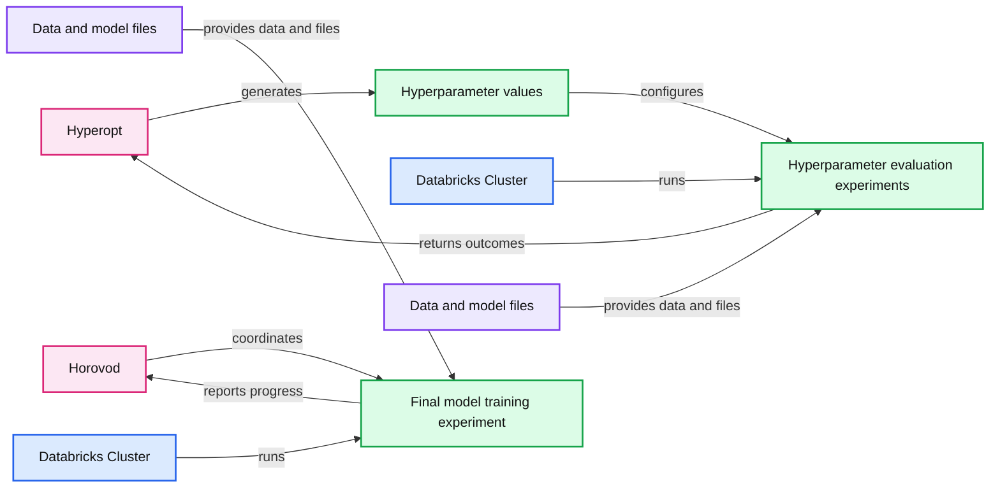
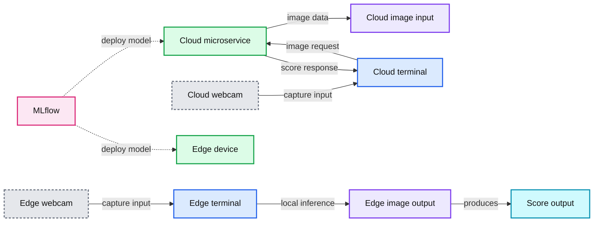

# Enabling Computer Vision Applications With the Data Lakehouse

- Source: https://www.databricks.com/blog/2021/12/17/enabling-computer-vision-applications-with-the-data-lakehouse.html
- Published: 2021-12-17
- Authors: Paulo Borges, Bala Amavasai, Bryan Smith
- Categories: engineering, data-science-machine-learning
- Images: 4 total, 4 extracted as architecture

[Read Rise of the Data Lakehouse](https://www.databricks.com/resources/ebook/rise-data-lakehouse?itm_data=computervisiondatalakehouse-blog-riselakehousebook) to explore why lakehouses are the data architecture of the future with the father of the data warehouse, Bill Inmon.

The potential for computer vision applications to transform retail and manufacturing operations, as explored in the blog [Tackle Unseen Quality, Operations and Safety Challenges with Lakehouse enabled Computer Vision](https://www.databricks.com/blog/2021/11/30/tackle-unseen-quality-operations-and-safety-challenges-with-lakehouse-enabled-computer-vision.html), can not be overstated. That said, numerous technical challenges prevent organizations from realizing this potential. In this first introductory installment of our multi-part technical series on the development and implementation of computer vision applications, we dig deeper into these challenges and explore the foundational patterns employed for data ingestion, model training and model deployment.

The unique nature of image data means we need to carefully consider how we manage these information assets, and the integration of trained models with frontline applications means we need to consider some non-traditional deployment paths. There is no one-size-fits-all solution to every computer vision challenge, but many techniques and technologies have been developed by companies who've pioneered the use of computer vision systems to solve real-world business problems. By leveraging these, as explored in this post, we can move more rapidly from demonstration to operationalization.

## Data ingestion

The first step in the development of most computer vision applications (after design and planning) is the accumulation of image data. Image files are captured by camera-enabled devices and transmitted to a central storage repository, where they are prepared for use in model training exercises.

It's important to note that many of the popular formats, such as PNG and JPEG, support embedded metadata. Basic metadata, such as image height and width, supports the conversion of pixel values into two-dimensional representations. Additional metadata, such as Exchange Information File Format (Exif) metadata, may be embedded as well to provide additional details about the camera, its configuration, and potentially its location (assuming the device is equipped with GPS sensors).

When building an image library, metadata as well as image statistics, useful to data scientists as they sift through the thousands or even millions of images typically accumulating around computer vision applications, are processed as they land in Lakehouse storage. Leveraging common open-source libraries such as [Pillow](https://pypi.org/project/Pillow/), both metadata and statistics can be extracted and persisted to queryable tables in a [Lakehouse](https://www.databricks.com/discoverlakehouse?utm_medium=cpc&utm_source=google&utm_campaign=13039235745&utm_offer=discoverlakehouse&utm_adgroup=125064728314&utm_term=data%20lakehouse&utm_content=microsite&gclid=Cj0KCQiA-K2MBhC-ARIsAMtLKRsIFf-5SgwGhn-t8PpmO4TO-6T6K79NTuVXs9Eb0fU49YVpaB3H9NIaAuFdEALw_wcB) environment for easier access. The binary data comprising the image may also be persisted to these tables along with path information for the original file in the storage environment.

**Summary:** The diagram shows incoming image files being loaded with Auto Loader, processed for data parsing, metadata extraction, and statistics calculations, then written to a table.

**Components:**

- Camera and terminal sources
- Image files named with timestamp, device ID, and label
- Auto Loader using cloudFiles
- Incoming folder
- Data parsing
- Metadata extraction
- Statistics calculations
- Databricks table

**Flows:**

- Camera and terminal sources -> Image files: image file creation
- Image files -> Auto Loader: incoming files
- Auto Loader -> Data parsing: file loading
- Data parsing -> Metadata extraction: parsed image data
- Metadata extraction -> Statistics calculations: extracted metadata
- Statistics calculations -> Databricks table: processed data and statistics

**Numbers:** none

source image: https://www.databricks.com/wp-content/uploads/2021/12/com-vis-blog-img-1.png

 Figure 1. Data processing workflow for incoming image files

## Model training

The size of the individual image files combined with the large number of them needed to train a robust model means that we need to carefully consider how they will be handled during model training. Techniques commonly used in data science exercises such as collecting model inputs to a pandas dataframe will not often work at an enterprise scale due to memory limitations on individual computers. Spark™ dataframes, which distribute the data volumes over multiple computer nodes configured as a computing cluster, are not accessible by most computer vision libraries so another solution to this problem is needed.
To overcome this first model training challenge, Petastorm, a data caching technology built specifically for the large-scale training of advanced deep learning model types, can be used. Petastorm allows retrieval of large volumes of data from the Lakehouse and places it in a temporary, storage-based cache. Models leveraging Tensorflow and PyTorch, the two most popular libraries for deep neural network development and commonly employed in computer vision applications, can read small subsets of data in batches from the cache as they iterate over the larger Petastorm dataset.

**Summary:** Images from an Images Table are processed by a Databricks Cluster and persisted to temporary Petastorm Cache in Cloud Storage.

**Components:**

- Images Table using Databricks
- Databricks Cluster using distributed compute
- Petastorm Cache using temporary storage-based caching
- Cloud Storage using durable cloud object storage

**Flows:**

- Images Table -> Databricks Cluster: image data
- Databricks Cluster -> Petastorm Cache: processed lakehouse data

**Numbers:** none

source image: https://www.databricks.com/wp-content/uploads/2021/12/com-vis-blog-img-2.png

 Figure 2. Lakehouse data persisted to temporary Petastorm cache

With data volumes manageable, the next challenge is the acceleration of the model training itself. Machine learning models learn through iteration. This means that training will consist of a series of repeated passes over the input dataset. With each pass, the model learns optimized weights for various features that lead to better prediction accuracy.

The model's learning algorithm is governed by a set of parameters referred to as hyperparameters. The values of these hyperparameters are often difficult to set based on domain knowledge alone, and so the typical pattern for discovering an optimal hyperparameter configuration is to train multiple models to determine which performs best. This process, referred to as hyperparameter tuning, implies iterations on top of iterations.

The trick to working through so many iterations in a timely manner is to distribute the hyperparameter tuning runs across the cluster's compute nodes so that they may be performed in a parallel manner. Leveraging Hyperopt, these runs can be commissioned in waves, between which the [Hyperopt](http://hyperopt.github.io/hyperopt/) software can evaluate which hyperparameter values lead to which outcomes and then intelligently set the hyperparameter values for the next wave. After repeated waves, the software converges on an optimal set of hyperparameter values much faster than if an exhaustive evaluation of values were to have been performed.

**Summary:** Hyperopt distributes hyperparameter evaluation across a Databricks Cluster, while Horovod distributes final model training across the cluster.

**Components:**

- Hyperopt for selecting hyperparameter values
- Hyperparameter values
- Databricks Cluster for distributed computation
- Hyperparameter evaluation experiments
- Horovod for coordinating distributed model training
- Final model training experiment
- Data and model files in durable storage

**Flows:**

- Hyperopt -> Hyperparameter values: generates hyperparameter values
- Hyperparameter values -> Hyperparameter evaluation experiments: configures parallel experiments
- Data and model files -> Hyperparameter evaluation experiments: provides data and files
- Hyperparameter evaluation experiments -> Hyperopt: returns experiment outcomes
- Horovod -> Final model training experiment: coordinates distributed training
- Data and model files -> Final model training experiment: provides data and files
- Final model training experiment -> Horovod: reports training progress

**Numbers:** none

source image: https://www.databricks.com/wp-content/uploads/2021/12/com-vis-blog-img-3.png

 Figure 3. Leveraging Hyperopt and Horovod to distribute hyperparameter tuning and model training, respectively

Once the optimal hyperparameter values have been determined, [Horovod](https://horovod.readthedocs.io/en/stable/pytorch.html) can be used to distribute the training of a final model across the cluster. Horovod coordinates the independent training of models on each of the cluster's compute nodes using non-overlapping subsets of the input training data. Weights learned from these parallel runs are consolidated with each pass over the full input set, and models are rebalanced based on their collective learning. The end result is an optimized model, trained using the collective computational power of the cluster.

## Model deployment

With computer vision models, the goal is often to bring model predictions into a space where a human operator would typically perform a visual inspection. While centralized scoring of images in the back office may make sense in some scenarios, more typically, a local (edge) device will be handed responsibility for capturing an image and calling the trained model to generate scored output in real time. Depending on the complexity of the model, the capacity of the local device and the tolerance for latency and/or network disruptions, edge deployments typically take one of two forms.

With a microservices deployment, a model is presented as a network-accessible service. This service may be hosted in a centralized location or across multiple locations more closely aligned with some number of the edge devices. An application running on the device is then configured to send images to the service to receive the required scores in return. This approach has the advantage of providing the application developer with greater flexibility for model hosting and access to far more resources for the service than are typically available on an edge device. It has the disadvantage of requiring additional infrastructure, and there is some risk of network latency and/or disruption affecting the application.

**Summary:** MLflow supports deploying a computer vision model either to a cloud microservice or directly to an edge device.

**Components:**

- MLflow deployment platform
- Cloud microservice for model serving
- Cloud-side image input
- Cloud-side terminal or application
- Cloud-side webcam
- Edge device with local model
- Edge-side terminal or application
- Edge-side webcam
- Edge-side image output
- Score output

**Flows:**

- MLflow -> Cloud microservice: deploy model
- MLflow -> Edge device: deploy model
- Cloud webcam -> Cloud terminal: capture input
- Cloud terminal -> Cloud microservice: image request
- Cloud microservice -> Cloud terminal: score response
- Edge webcam -> Edge terminal: capture input
- Edge terminal -> Edge image output: local inference
- Cloud microservice -> Cloud image input: image data

**Numbers:** none

source image: https://www.databricks.com/wp-content/uploads/2021/12/com-vis-blog-img-4.png

 Figure 4. Edge deployment paths facilitated by MLflow

With an edge deployment, a previously trained model is sent directly to the local device. This eliminates concerns over networking once the model has been delivered, but limited hardware resources on the device can impose constraints. In addition, many edge devices make use of processors that are significantly different from the systems on which the models are trained. This can create software compatibility challenges, which may need to be carefully explored before committing resources to such a deployment.

In either scenario, we can leverage [MLflow](https://mlflow.org/), a model management repository, to assist us with the packaging and delivery of the model.

## Bringing it all together with Databricks

To demonstrate how these different challenges may be addressed, we have developed a series of notebooks leveraging data captured from a [PiCamera](https://www.raspberrypi.com/products/camera-module-v2/)-equipped [Raspberry Pi device](https://www.raspberrypi.com/products/raspberry-pi-4-model-b/). Images taken by this device have been transmitted to a cloud storage environment so that these image ingestion, model training and deployment patterns can be demonstrated using the Databricks ML Runtime, which comes preconfigured with all the capabilities described above. To see the details behind this demonstration, please refer to the following notebooks:

[Get the notebook](https://notebooks.databricks.com/notebooks/RCG/Computer_Vision_Foundations/index.html)
