# Implementing MLOps on Databricks using Databricks notebooks and Azure DevOps, Part 2

- Source: https://www.databricks.com/blog/2022/01/05/implementing-mlops-on-databricks-using-databricks-notebooks-and-azure-devops-part-2.html
- Published: 2022-01-05
- Authors: Piotr Majer, Michael Shtelma
- Categories: engineering, data-science-machine-learning
- Images: 2 total, 2 extracted as architecture

This is the second part of a two-part series of blog posts that show an end-to-end [MLOps](https://www.databricks.com/glossary/mlops) framework on Databricks, which is based on Notebooks. In the first post, we presented a complete [CI/CD framework on Databricks with notebooks](https://www.databricks.com/blog/2021/09/20/part-1-implementing-ci-cd-on-databricks-using-databricks-notebooks-and-azure-devops.html). The approach is based on the Azure[DevOps](https://docs.microsoft.com/en-us/azure/databricks/dev-tools/ci-cd/ci-cd-azure-devops) ecosystem for the Continuous Integration (CI) part and Repos API for the Continuous Delivery (CD). This post extends the presented CI/CD framework with machine learning providing a complete ML Ops solution.

The post is structured as follows:

- Introduction of the ML Ops methodology.
- Using notebooks in the development and deployment lifecycle.
- A detailed example that includes code snippets and showcases a complete pipeline with an ML-specific testing suite, version control and development, staging, and production environments.

## Why do we need MLOps?

Artificial intelligence and machine learning are some of the biggest phenomena in the past two decades, changing and shaping our everyday life. This automated decision-making comes, however, with its own set of challenges and risks, and there is no free lunch here. Productionizing ML is difficult as it is not only underlying software changes that affect the output but even more, so a good quality model is powered by high-quality data.

Furthermore, versioning of data, code and models becomes even more difficult if an organization tries to apply it at a massive scale to really become an AI-first company. Putting a single machine learning model to use comes with completely different costs and risks than having thousands of models iterated and improved frequently. Therefore, a holistic approach is needed across the entire product lifecycle, from an early prototype to every single release, repeatedly testing multiple aspects of the end result and highlighting any issues prior to end-customer exposure. Only that practice lets teams and companies scale their operations and deliver high-quality autonomous systems. This development practice for data products powered by ML is called MLOps.

## What is MLOps?

DevOps practices are a common IT toolbox and a philosophy that enables fast, iterative release processes for software in a reliable and performant manner. This de-facto standard for software engineering becomes much more challenging in Machine Learning projects, where there are new dimensions of complexity - data and derived model artifacts, that need to be accounted for. The changes in data, popularly known as drift, which may affect the models and model-related outputs, yield the birth of new terminology: MLOps.

In a nutshell, MLOps extends and profoundly inherits practices from DevOps, adding new tools and methodology that allow for the CI/CD process on the system, where not only code but also data changes. Thus the suite of tools needed addresses typical software development techniques but also adds similar programmatic and automated rigor to the underlying data.

Therefore, hand in hand with the growing adaptation of AI and ML across businesses and organizations, there is a growing need for best-in-class MLOps practices and monitoring. This essential functionality provides organizations with the necessary tools, safety nets, and confidence in automation solutions enabling them to scale and drive value. The Databricks platform comes equipped with all the necessary solutions as a managed service, allowing companies to automate and use ready technologies focusing on high-level business challenges.

**Summary:** The diagram shows an iterative MLOps lifecycle from model building through monitoring and observability, with code, models, and data moving between stages.

**Components:**

- Model Building - training code and training data
- Model Evaluation and Experimentation - candidate models, test metrics, and test data
- Productionize Model - chosen model and productionized model
- Testing - test code, test data, and model
- Deployment - application code and production deployment
- Monitoring and Observability - production data and feedback loop
- Training code - technology not specified
- Candidate models - technology not specified
- Chosen model - technology not specified
- Productionized model - technology not specified
- Test code - technology not specified
- Application code - technology not specified
- Code and model in production - cloud-hosted technology not specified
- Training data - data store not specified
- Test metrics - data store not specified
- Production data - data store not specified

**Flows:**

- Training code -> Model Building: builds models
- Training data -> Model Building: supplies training data
- Model Building -> Candidate models: produces candidate models
- Candidate models -> Model Evaluation and Experimentation: evaluates candidates
- Test data -> Model Evaluation and Experimentation: supplies test data
- Test metrics -> Model Evaluation and Experimentation: records evaluation metrics
- Model Evaluation and Experimentation -> Chosen model: selects a model
- Chosen model -> Productionize Model: productionizes the chosen model
- Productionize Model -> Productionized model: produces a productionized model
- Productionized model -> Testing: supplies the model for testing
- Test code -> Testing: tests the model
- Test data -> Testing: supplies test data
- Testing -> Model: produces a tested model
- Model -> Deployment: supplies the tested model
- Application code -> Deployment: supplies application code
- Deployment -> Code and model in production: deploys code and model
- Code and model in production -> Production data: generates production data
- Production data -> Monitoring and Observability: supports monitoring
- Monitoring and Observability -> Model Building: feeds back into model building

**Numbers:** none

source image: https://www.databricks.com/wp-content/uploads/2021/12/mlops-pt2-blog-img-1.png

```mermaid
%% MLOps lifecycle showing code, model, and data flows
flowchart LR
    A[Model Building] -->|builds| B[Model Evaluation and Experimentation]
    B -->|selects| C[Productionize Model]
    C -->|prepares| D[Testing]
    D -->|validates| E[Deployment]
    E -->|deploys| F[Monitoring and Observability]
    F -->|feedback loop| A

    G[Training code] -->|builds models| A
    H[Training data] -->|supplies data| A
    A -->|produces| I[Candidate models]
    I -->|evaluates| B
    B -->|chosen model| C
    C -->|productionized model| D
    J[Test code] -->|tests| D
    K[Test data] -->|supplies data| D
    D -->|tested model| E
    L[Application code] -->|supplies code| E
    E -->|code and model| F
    M[Production data] -->|supports monitoring| F

    classDef client fill:#dbeafe,stroke:#2563eb,stroke-width:2px,color:#111
    classDef service fill:#dcfce7,stroke:#16a34a,stroke-width:2px,color:#111
    classDef store fill:#ede9fe,stroke:#7c3aed,stroke-width:2px,color:#111
    classDef cache fill:#fef3c7,stroke:#d97706,stroke-width:2px,color:#111
    classDef queue fill:#cffafe,stroke:#0891b2,stroke-width:2px,color:#111
    classDef critical fill:#fee2e2,stroke:#dc2626,stroke-width:4px,color:#111
    classDef external fill:#e5e7eb,stroke:#6b7280,stroke-width:2px,color:#111,stroke-dasharray:4 3
    classDef decision fill:#fce7f3,stroke:#db2777,stroke-width:2px,color:#111
    class A,B,C,D,E,F service
    class G,J,L client
    class H,K,M store
    class I store
```

 source: [martinfowler.com](https://martinfowler.com/articles/cd4ml.html)

## Why is it hard to implement MLOps using notebooks?

While notebooks have gained tremendous popularity over the past decade and have become synonymous with data science, there are still a few challenges faced by machine learning practitioners working in agile development. Most of the machine learning projects have their roots in notebooks, where one can easily explore, visualize and understand the data. Most of the coding starts in a notebook where data scientists can promptly experiment, brainstorm, build and implement a modeling approach in a collaborative and flexible manner. While historically, most of the hardening and production code had to be rewritten and reimplemented in IDEs, over the last few years, we have observed a sharp rise in using notebooks for production workloads. That is usually feasible whenever the code base has small and manageable interdependencies and mostly consumes libraries. In that case, teams can minimize and simplify the implementation time while keeping the code base transparent, robust, and agile in notebooks. One of the key reasons for that dramatic shift has been the growing wealth of CI/CD tools now at our disposal. Machine learning, however, adds another dimension of complexity to the CI/CD pipelines delivered in notebooks with multiple dependencies between modules/notebooks.

## Continuous delivery and monitoring of ML projects

In the previous paragraph, we depicted a framework for testing our codebase, as well as testing and quality assurance of newly trained ML models -- MLOps. Now we can discuss how we use these tools to implement our ML project using the following principles:

- The model interface is unified. Establishing a common structure of each model, similarly to packages like scikit-learn with common .fit() and .predict() methods, is essential for the reusability of the framework for various ML techniques that can be easily interchanged. That allows us to start with potentially simpler baseline ML models in an end-to-end fashion and iterate with other ML algorithms without changing the pipeline code.
- Model training must be decoupled from evaluation and scoring and implemented as independent pipelines/notebooks. The decoupling principle makes the code base modular and allows us, again, to compare various ML architectures/frameworks with each other. This is an important part of MLOps, where we can easily evaluate various ML models and test the predictive power prior to promotion. Furthermore, the trained model persisted in MLflow can be easily reused in other jobs and frameworks, without dependency on the training/environment setup, e.g., deployed as a REST API service.
- Model scoring must be able to always rely on a model repository to get the latest approved version of our model. This, in conjunction j with the MLOps framework, where only tested and well-performing models are promoted, ensures the right, high-quality model version is being deployed in a fully-automated fashion to our production environment while keeping the training pipeline proposing new models regularly using new data inputs.

We can fulfill the requirements defined earlier by using the architecture depicted in the following illustration:

**Summary:** The diagram shows Databricks feature engineering, model training, evaluation, deployment, and inference pipelines integrated with Delta Lake and MLflow.

**Components:**

- Feature engineering pipelines using Databricks
- Silver tables using Delta Lake
- Databricks Feature Store using Delta Lake
- Training pipeline with feature engineering and model training using Databricks
- Model evaluation pipeline with feature engineering, model evaluation, and redeployment using Databricks
- Consumer pipeline with feature engineering, inference, and result storage using Databricks
- MLflow for candidate model tracking and production model deployment
- Candidate models
- Production model

**Flows:**

- Silver tables -> Feature engineering pipelines: source data
- Feature engineering pipelines -> Databricks Feature Store: engineered features
- Databricks Feature Store -> Training feature engineering: stored features
- Databricks Feature Store -> Model evaluation feature engineering: stored features
- Databricks Feature Store -> Consumer feature engineering: stored features
- Training feature engineering -> Train models: engineered features
- Train models -> MLflow: candidate models
- MLflow -> Model evaluation pipeline: candidate models
- Model evaluation pipeline -> MLflow: evaluated models and redeployment
- MLflow -> Consumer pipeline: production model
- Consumer feature engineering -> Run inference: engineered features
- Run inference -> Store results: inference outputs

**Numbers:** none

source image: https://www.databricks.com/wp-content/uploads/2021/12/mlops-pt2-blog-img-2.png

```mermaid
%% Shows Databricks ML training, evaluation, deployment, and inference flows
flowchart LR
    S[Silver tables] -->|source data| F[Feature engineering pipelines]
    F -->|engineered features| FS[Databricks Feature Store]
    FS -->|stored features| TFE[Training feature engineering]
    FS -->|stored features| EFE[Evaluation feature engineering]
    FS -->|stored features| CFE[Consumer feature engineering]
    TFE -->|engineered features| TM[Train models]
    TM -->|candidate models| M[MLflow]
    M -->|candidate models| E[Evaluate models and redeploy]
    E -->|evaluated models| M
    M -->|production model| I[Run inference]
    CFE -->|engineered features| I
    I -->|inference outputs| R[Store results]

    classDef client fill:#dbeafe,stroke:#2563eb,stroke-width:2px,color:#111
    classDef service fill:#dcfce7,stroke:#16a34a,stroke-width:2px,color:#111
    classDef store fill:#ede9fe,stroke:#7c3aed,stroke-width:2px,color:#111
    classDef cache fill:#fef3c7,stroke:#d97706,stroke-width:2px,color:#111
    classDef queue fill:#cffafe,stroke:#0891b2,stroke-width:2px,color:#111
    classDef critical fill:#fee2e2,stroke:#dc2626,stroke-width:4px,color:#111
    classDef external fill:#e5e7eb,stroke:#6b7280,stroke-width:2px,color:#111,stroke-dasharray:4 3
    classDef decision fill:#fce7f3,stroke:#db2777,stroke-width:2px,color:#111

    class S,FS,R store
    class F,TFE,TM,EFE,E,CFE,I service
    class M external
```

As depicted above, the training pipeline (you can review the code [here](https://github.com/mshtelma/databricks_ml_demo/blob/main/jobs/model_trainning_job.py)) trains models and logs them to MLflow. We can have multiple training pipelines for different model architectures or different model types. All models trained by these pipelines can be logged to MLflow and used for scoring using a unified MLflow interface. The evaluation pipeline  (you can review the code [here](https://github.com/mshtelma/databricks_ml_demo/blob/main/jobs/model_eval_job.py))  can then be run after every training pipeline and be used at the outset to compare all these new models against one another. In this way, the candidate models can be evaluated against the current production model too. An example of the ideal evaluation pipeline, implemented using MLFlow, is discussed below.

**Let's implement model comparison and selection!**

We will need a couple of building blocks to implement the full functionality, which we will place into individual functions. The first one will allow us to get all the newly trained models from our MLflow training pipelines. To do this, we will leverage [the MLflow-experiment data source](https://docs.databricks.com/data/data-sources/mlflow-experiment.html) that allows us to use Apache Spark™ to query MLflow experiment data. Having MLflow experiment data available as a Spark dataframe makes the job really easy:

To compare models, we will need to come up with some metrics first. This is usually case specific and should be aligned to business requirements. The functions shown below load the model using run_id from the MLflow experiment and calculate the predictions using the latest available data. For a more robust evaluation, we apply bootstrapping and derive multiple metrics for samples drawn, with repetition from the original evaluation set. Then it calculates the ROC AUC metric for each randomly drawn set that will be used to compare the models. If the candidate model outperforms the current version on at least 90% of samples, it is then promoted to production. In an actual project, this metric must be selected carefully.

Now let's put all these building blocks together and see how we can evaluate all new models and compare the best new model with the ones in production. After determining the best newly trained model, we will leverage the MLflow API to load all production model versions and compare them using the same function that we have used to compare newly trained models.
 After that, we can compare the metrics of the best production model and the new one and decide whether or not to put the latest model to production. In the case of a positive decision, we can leverage MLflow Model Registry API to register our best newly-trained model as a registered model and promote it to a production state.

## Summary

In this blog post, we presented an end-to-end approach for MLOps on Databricks using notebook-based projects. This machine learning workflow is based on the Repos API functionality that not only lets the data teams structure and version control their projects in a more practical way but also greatly simplifies the implementation and execution of the CI/CD tools. We showcased an architecture where all operational environments are fully isolated, ensuring a high degree of security for production workloads powered by ML. An exemplary workflow was discussed that spans all steps in the model lifecycle with a strong focus on an automated testing suite. These quality checks may not only cover typical software development steps (unit, integration, etc.) but also focus on the automated evaluation of any new iteration of the retrained model. The CI/CD pipelines are powered by a framework of choice and integrate with the Databricks Lakehouse platform smoothly, triggering execution of the code and infrastructure provisioning end-to-end. Repos API radically simplifies not only the version management, code structuring, and development part of a project lifecycle but also the Continuous Delivery, allowing to deploy the production artifacts and code between environments. It is an important improvement that adds to the overall efficiency and scalability of Databricks and greatly improves software developer experience.

---

References:

1. Github repository with implemented example project: [https://github.com/mshtelma/databricks_ml_demo/](https://github.com/mshtelma/databricks_ml_demo/)
2. [https://www.databricks.com/blog/2021/06/23/need-for-data-centric-ml-platforms.html](https://www.databricks.com/blog/2021/06/23/need-for-data-centric-ml-platforms.html)
3. Continuous Delivery for Machine Learning, Martin Fowler, [https://martinfowler.com/articles/cd4ml.html](https://martinfowler.com/articles/cd4ml.html),
4. Overview of MLOps, [https://www.kdnuggets.com/2021/03/overview-mlops.html](https://www.kdnuggets.com/2021/03/overview-mlops.html)
5. Part 1: Implementing CI/CD on Databricks Using Databricks Notebooks and Azure DevOps, [https://www.databricks.com/blog/2021/09/20/part-1-implementing-ci-cd-on-databricks-using-databricks-notebooks-and-azure-devops.html](https://www.databricks.com/blog/2021/09/20/part-1-implementing-ci-cd-on-databricks-using-databricks-notebooks-and-azure-devops.html)
6. Introducing Azure DevOps, [https://azure.microsoft.com/en-us/blog/introducing-azure-devops/](https://azure.microsoft.com/en-us/blog/introducing-azure-devops/)
