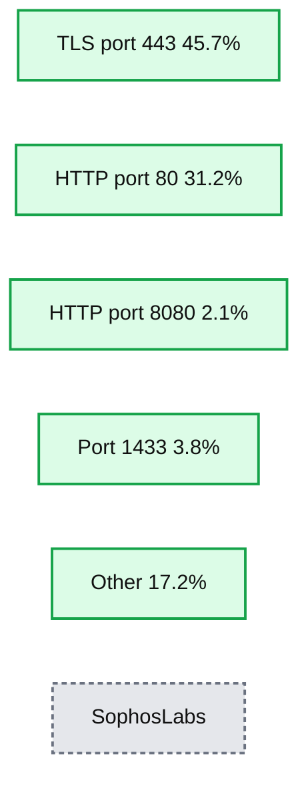
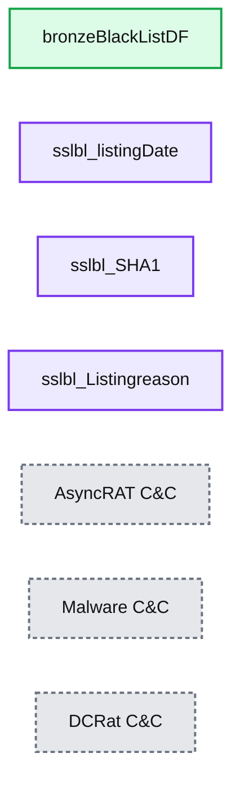
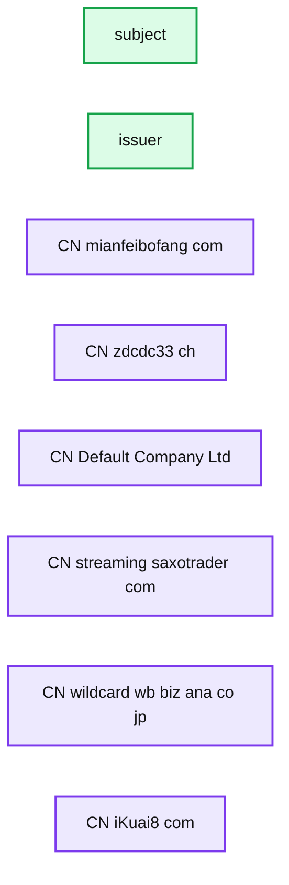

# Hunting Anomalous Connections and Infrastructure With TLS Certificates

*TLS hashes as a source for the cybersecurity threat hunting program*

- Source: https://www.databricks.com/blog/2022/01/20/hunting-anomalous-connections-and-infrastructure-with-tls-certificates.html
- Published: 2022-01-20
- Authors: Derek King
- Categories: cybersecurity, security-and-trust, engineering
- Images: 12 total, 6 extracted as architecture

*Free Edition has replaced Community Edition, offering enhanced features at no cost. Start using *[*Free Edition *](https://login.databricks.com/?intent=SIGN_UP&amp;signup_experience_step=EXPRESS&amp;provider=DB_FREE_TIER&amp;dbx_source=www)*today.*
 

According to Sophos, 46% of all malware now uses Transport Layer Security (TLS) to conceal its communication channels. A number that has doubled in the last year alone. Malware, such as LockBit ransomware, AgentTesla and Bladabini remote access tools (RATs), has been observed using TLS for powerShell based droppers, for accessing pastebin to retrieve code and many others recently.

In this blog, we will walk through how security teams can ingest x509 certificates (found in the TLS handshake) into Delta Lake from AWS S3 storage, enrich it, and perform threat hunting techniques on it.

**Summary:** Donut chart showing malware command-and-control communication methods and their shares in Q1 2021.

**Components:**

- TLS using port 443
- HTTP using port 80
- HTTP using port 8080
- Port 1433
- Other communication methods
- SophosLabs

**Flows:**

- TLS communication -> TLS using port 443: malware C2 traffic

**Numbers:** Q1 2021, port 443, 45.7%, port 80, 31.2%, port 8080, 2.1%, port 1433, 3.8%, other, 17.2%



<sub>source image: https://www.databricks.com/wp-content/uploads/2022/01/hunt-anom-blog-1.jpg</sub>

During the initial connection from a client to server, the TLS protocol performs a two-phase handshake, whereby the web server proves its identity to the client by way of information held in the x509 certificate. Following this, both parties agree on a number of algorithms, then generate and exchange symmetric keys, which are subsequently used to transmit encrypted data.

For all practical purposes x509 certificates are totally unique and can be identified using hashing algorithms (commonly SHA1, SHA256 and MD5) called fingerprints. The nature of hashing makes them great threat indicators and are commonly used in threat intelligence feeds to represent objects. Since the information within them is used for cryptographic key material (agreement, exchange, creation etc), they themselves are encoded but not encrypted and therefore, can be read.

Capturing, storing and analyzing network traffic is a challenging task. However, landing it into cheap cloud object storage, processing it at scale with Databricks and only keeping the interesting bits could be a valuable workflow for security analysts and threat hunters. If we can identify suspicious connections, we have an opportunity to create indicators of compromise (iocs) and have our SIEM security tools help to prevent further malicious activity downstream.

## About the data sets

We are using x509 data collected from a network scan, and alongside it, we will use the [Cisco Umbrella](http://s3-us-west-1.amazonaws.com/umbrella-static/index.html) top 1 million list and the [SSL blacklist](https://sslbl.abuse.ch/blacklist/#ssl-certificates-csv) produced by [abuse.ch](https://abuse.ch/) as lookups.

One of the best places within an enterprise network to get hold of certificate data is off the wire using packet capture techniques. Zeek, TCPDump and Wireshark are all good examples.

If you are not aware of the cyber threat hunting tool SSLblacklist, it is run by abuse.ch with the goal of detecting malicious SSL connections. The Cisco Umbrella top 1m are the most popular DNS lookups on the planet as seen by Cisco. We will use this to demonstrate filtering and lookup techniques. If you or your hunt team want to follow along with the notebook and data you can import the [accompanying notebook](https://www.databricks.com/wp-content/uploads/notebooks/tls_cert_analysis-public.html).

*Source:*[*https://sslbl.abuse.ch*](https://sslbl.abuse.ch/)

## Ingesting the data sets

For simplicity, if you are following along at home, we will be using [Delta Lake](https://www.databricks.com/product/delta-lake-on-databricks) batch capability to ingest the data from an AWS S3 bucket to a bronze table, refine and enrich it into a silver table ([medallion architecture](https://www.databricks.com/blog/2021/06/09/how-to-simplify-cdc-with-delta-lakes-change-data-feed.html)).  However, you can upgrade your experience in real-world applications using [structured streaming](https://www.databricks.com/solutions/data-pipelines)!

We’ll focus on the blacklist and umbrella files first, followed by x509 certificate data.

 

# Alexa-Top1m
rawTop1mDF = read_batch(spark, top1m_file, format='csv', schema=alexa_schema)

 

 

# Write to Bronze Table
alexaTop1mBronzeWriter = create_batch_writer(spark=spark, df=rawTop1mDF, mode='overwrite')
alexaTop1mBronzeWriter.saveAsTable(databaseName + ".alexaTop1m_bronze")

 

 

# Make Transformations to Top1m
bronzeTop1mDF = spark.table(databaseName + ".alexaTop1m_bronze")
bronzeTop1mDF = bronzeTop1mDF.filter(~bronzeTop1mDF.alexa_top_host.rlike('localhost')).drop("RecordNumber")
display(bronzeTop1mDF)

 

 

# Write to Silver Table
alexaTop1mSilverWriter = create_batch_writer(spark=spark, df=bronzeTop1mDF, mode='overwrite')
alexaTop1mSilverWriter.saveAsTable(databaseName + ".alexaTop1m_silver")

 

The above code snippets read the csv file from an s3 bucket, writes it directly to the bronze table unaltered, then reads the bronze delta table, makes transformations and writes it to the silver table. That’s the top 1 million data ready for use!

<sub>source image: https://www.databricks.com/wp-content/uploads/2022/01/anom-threat-blog-4.png</sub>

*Resulting Dataframe*

Next we follow the same format for the SSL blacklist data

 

# SSLBlacklist
rawBlackListDF = read_batch(spark, blacklist_file, format='csv')
rawBlackListDF = rawBlackListDF.withColumnRenamed(, # Write to Bronze Table
sslBlBronzeWriter = create_batch_writer(spark=spark, df=rawBlackListDF, mode='overwrite')
sslBlBronzeWriter.saveAsTable(databaseName + ".sslBlacklist_bronze")

 

 

# Make Transformations to the SSLBlacklist
bronzeBlackListDF = spark.table(databaseName + ".sslBlackList_bronze")
bronzeBlackListDF = bronzeBlackListDF.select(*(col(x).alias('sslbl_' + x) for x in bronzeBlackListDF.columns)

 

 

# Write to Silver Table
BlackListSilverWriter = create_batch_writer(spark=spark, df=bronzeBlackListDF, mode='overwrite')
BlackListSilverWriter.saveAsTable(databaseName + ".sslBlackList_silver")

 

The above process is the same, as for the top 1 million file presented below. Our transformation simply prefixes all columns with ‘sslbl_’ so it is easily identified later. 

**Summary:** The image shows a Databricks Spark dataframe containing SSL blacklist entries with listing dates, SHA1 hashes, and listing reasons.

**Components:**

- bronzeBlackListDF using PySpark DataFrame
- sslbl_listingDate
- sslbl_SHA1
- sslbl_Listingreason
- AsyncRAT C&C
- Malware C&C
- DCRat C&C

**Flows:**

- none

**Numbers:** 1, 2, 3, 4, 5, 6, 2021-11-02 14:02:11, 2021-11-02 05:55:22, 2021-11-01 09:12:50, 2021-11-01 08:54:19, 2021-11-01 08:53:51, 2021-10-31 07:01:25, 1 more field



<sub>source image: https://www.databricks.com/wp-content/uploads/2022/01/hunt-anom-blog-6.jpg</sub>

*Resulting sslblacklist dataframe*
Next we ingest the x509 certificate data using exactly the same methodologies. Here’s how that dataframe looks after ingestion and transformation into the silver table. 

**Summary:** A sample dataframe displays x509 certificate records with subject and issuer fields.

**Components:**

- Subject column containing certificate subject distinguished names
- Issuer column containing certificate issuer distinguished names
- x509 certificate records represented as dataframe rows

**Flows:**

- none

**Numbers:** 33, 8, 256, 202



<sub>source image: https://www.databricks.com/wp-content/uploads/2022/01/hunt-anom-blog-7.jpg</sub>

X509 certificates are complex and there are many fields available. Some of the most interesting for our initial purposes are; 

- subject, issuer, common_name, valid to/from fields, dest_ip, dest_port, rdns

## Analyze the data

Looking for certificates of interest can be done in many ways. We’ll begin by looking for distinct values in the issuer field.

If you are new to [pyspark](https://spark.apache.org/docs/latest/api/python/), it is a python API for Apache Spark. The above search makes use of collect_set, countDistinct, agg, and groupBy. You can read more about those in the links.

A hypothesis we have is that when certificates are either temporary, self-signed or otherwise not used for genuine purposes, the issuer field tends to have limited detail. Let’s create a search looking at the length of that field.

withColumn adds a new column, after evaluating the given expression.

The top entry has the shortest length and has unique subject and issuer fields. This is a good candidate for some OSINT!

A google search shows a number of hits that believe this certificate is or has been used on malicious websites. This hash is a great candidate to pivot from and explore further in our network.

Let's now use our ssl blacklist table to correlate with known malicious hashes. 

 

# SSLBlacklist
isSSLBlackListedDF = silverX509DF.select(
"sslbl_Listingreason","common_name", "country", "dest_ip","rdns","issuer",
"sha1_fingerprint", "not_valid_before", "not_valid_after"
).filter(silverX509DF.sslbl_SHA1 != 'null')
display(isSSLBlackListedDF)

 

**Summary:** A Databricks SSL blacklist search-results table correlates malware families with certificate names, destination infrastructure, issuers, and SHA1 fingerprints.

**Components:**

- Row identifiers 1 through 13
- `sslbl_Listingreason`
- `common_name`
- `country`
- `dest_ip`
- `rdns`
- `issuer`
- `sha1_fingerprint`
- SSL blacklist records for TorrentLocker, CobaltStrike, RaccoonStealer, BuerLoader, and ransomware command and control

**Flows:**

- None visible

**Numbers:** 1, 2, 3, 4, 5, 6, 7, 8, 9, 10, 11, 12, 13; 192.99.28.191; 176.99.4.38; 8.210.77.76; 91.107.119.67; 102.130.119.184; 46.38.41.222; 90.188.22.161; 95.79.227.122; 185.117.155.50; 196.35.139.183; 41.185.22.146; 85.202.8.75; 185.87.50.141; 92.126.253.130; 1173.dedic.reg.ru; 10; 1417.mgn-host.ru; 161; 90.188.22.161.xdsl.ab.ru; 95-79-227-122.pppoe; 13.ru; 102-win1.hostserv.co.za; 18.ru; SHA1 fingerprint values beginning `d01a12`, `cbdc03`, `52881`, `d0dbc`, and `b0238c`

```text
%% mermaid failed to render; kept as text
%% Shows the SSL blacklist search-results table and its visible fields
flowchart LR
    A[SSL blacklist records] --> B[Listing reason]
    A --> C[Common name]
    A --> D[Country]
    A --> E[Destination IP]
    A --> F[Reverse DNS]
    A --> G[Issuer]
    A --> H[SHA1 fingerprint]

    classDef client fill:#dbeafe,stroke:#2563eb,stroke-width:2px,color:#111
    classDef service fill:#dcfce7,stroke:#16a34a,stroke-width:2px,color:#111
    classDef store fill:#ede9fe,stroke:#7c3aed,stroke-width:2px,color:#111
    classDef cache fill:#fef3c7,stroke:#d97706,stroke-width:2px,color:#111
    classDef queue fill:#cffafe,stroke:#0891b2,stroke-width:2px,color:#111
    classDef critical fill:#fee2e2,stroke:#dc2626,stroke-width:4px,color:#111
    classDef external fill:#e5e7eb,stroke:#6b7280,stroke-width:2px,color:#111,stroke-dasharray:4 3
    classDef decision fill:#fce7f3,stroke:#db2777,stroke-width:2px,color:#111
    A,B,C,D,E,F,G,H service
```

<sub>source image: https://www.databricks.com/wp-content/uploads/2022/01/hunt-anom-blog-13.jpg</sub>

This search raises some interesting findings. The top four entries show hits for a number of different malware families' command and control infrastructure. We also see the same sha1 fingerprint being used for ransomware command and control, using different IP addresses and DNS names. There could be a number of reasons for this but the observation would be that  adversary infrastructure is moving around over time. First seen, last seen work should be done using the threat data’s listing date and other techniques such as passive DNS lookups to further understand this and gain more situational awareness. New information discovered here should also be used to pivot back into an organisation for any other signs of communication with any of these hosts or IP addresses.

Finally, a great technique for hunting command and control communication is to use a [Shannon entropy](https://en.wikipedia.org/wiki/Entropy_(information_theory)) calculation to look for randomized strings.

 

def entropy(string):
"Calculates the Shannon entropy of a string"
try:
# get probability of chars in string
prob = [ float(string.count(c)) / len(string) for c in dict.fromkeys(list(string)) ]

# calculate the entropy
entropy = - sum([ p * math.log(p) / math.log(2.0) for p in prob ])
except Exception as e:
print(e)
entropy = -1

return entropy

entropy_udf = udf(entropy, StringType())

entropyDF = silverX509DF.where(length(col("subject")) 15).select(
""common_name","subject","issuer","subject_alternative_names","sha1_fingerprint"
).withColumn("entropy_score",
entropy_udf(col('common_name'))).orderBy(col("entropy_score").desc()).where(col('entropy_score') > 1.5)

display(entropyDF)

 

**Summary:** Search results table ranking TLS certificates by entropy score and showing certificate identity fields.

**Components:**

- Common name
- Subject
- Issuer
- Subject alternative names
- SHA1 fingerprint
- Entropy score
- Certificate result rows

**Flows:**

- none

**Numbers:**

- Rows 1 through 9
- Subject length threshold 15
- Entropy threshold 1.5
- Entropy score 1.584962500721156
- IP address 197.155.80.202
- IP address 77.238.99.42
- SHA1 fingerprints: dcb0d37a8c107a0e842be4edbff61ec2332977f6, 12747d6dd40f6578eee3c4bb014558059fc24fb8, e8bad05664a8bee3345cee17039de80cdb c4302ee, 550f4463fdd2b9170c5ea77da84e7eb53f07c197, 88f14aa8d5121fb788090e8842e0acb9d78dfced, 19f548cc8cd37c32771b8825d975ecfb5c50e814, 21993d11bc4d9428c879cb688186e88d6dae19975, 449db277583e0ab0f7915e5cb71567b592a34ebce, 56b1b9ce86c009e50a77f56f3de532ed29f66799

```text
%% mermaid failed to render; kept as text
%% Shows TLS certificate search results ranked by entropy
flowchart LR
    A[Common name] --> T[Certificate result table]
    B[Subject] --> T
    C[Issuer] --> T
    D[Subject alternative names] --> T
    E[SHA1 fingerprint] --> T
    F[Entropy score] --> T

    classDef client fill:#dbeafe,stroke:#2563eb,stroke-width:2px,color:#111
    classDef service fill:#dcfce7,stroke:#16a34a,stroke-width:2px,color:#111
    classDef store fill:#ede9fe,stroke:#7c3aed,stroke-width:2px,color:#111
    classDef cache fill:#fef3c7,stroke:#d97706,stroke-width:2px,color:#111
    classDef queue fill:#cffafe,stroke:#0891b2,stroke-width:2px,color:#111
    classDef critical fill:#fee2e2,stroke:#dc2626,stroke-width:4px,color:#111
    classDef external fill:#e5e7eb,stroke:#6b7280,stroke-width:2px,color:#111,stroke-dasharray:4 3
    classDef decision fill:#fce7f3,stroke:#db2777,stroke-width:2px,color:#111
    A,B,C,D,E,F client
    T store
```

<sub>source image: https://www.databricks.com/wp-content/uploads/2022/01/hunt-anom-blog-14.jpg</sub>

As the saying goes, ‘the internet is a bad place’ and ‘math is a bad mistress’! Our initial search included all certificates, which produces a lot of noise due to the nature of the fields content. Experimenting further, we learned from our earlier search and focused only on those with a subject length of less than fifteen characters, and surfaced only the highest entropy of that data set. The resulting nine entries can be manually googled, or further automation could be applied. The top entry in this scenario is of interest, as this appears to be used as part of the CobaltStrike exploit kit.

## Further work

This walk through has demonstrated some techniques we can use to identify suspicious or malicious traffic using simple unique properties of x509 certificates. Further exploration using machine learning techniques may also provide benefits.

## Conclusion

Analyzing certificates for unusual properties, or against known threat data can identify infrastructure known to host malicious software. It can be used as an initial pivot point to gather further information that can be used to search for signs of compromise. However, since the certificate identifies a host and not the content it serves, it cannot provide high confidence alerts alone.

Before being eligible for operationalization in a security operations centre (soc), the initial indicators need to be triaged further. Data from other internal and external sources such as, firewalls, [passive DNS](https://docs.umbrella.com/investigate-ui/docs/passive-dns#:~:text=Passive%20DNS%20is%20a%20way,incidents%20or%20discover%20malicious%20infrastructures.&text=Without%20passive%20DNS%2C%20it%20can,records%20were%20in%20the%20past.), [VirusTotal](https://www.virustotal.com/gui/home/upload), [who is](https://www.whois-search.com/) and also process creation events from endpoints should be used.

Let us know at [cybersecurity@databricks.com](mailto:cybersecurity@databricks.com) how you think processing TLS/x509 data either in an enterprise or more passively on the internet can be used to track adversaries and their infrastructure. If you are not already a Databricks customer, feel free to spin up a [community edition.](https://www.databricks.com/try-databricks)

[Download the notebook.](https://www.databricks.com/wp-content/uploads/notebooks/tls_cert_analysis-public.html)
