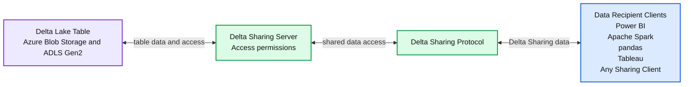

# Extending Delta Sharing for Azure

*Delta Sharing 0.3.0 includes Azure support, token expiration time, query limit parameters, and improve APIs*

- Source: https://www.databricks.com/blog/2022/01/21/delta-sharing-release-0-3-0.html
- Published: 2022-01-21
- Authors: Will Girten, Shixiong Zhu, Denny Lee
- Categories: engineering, open-source
- Images: 1 total, 1 extracted as architecture

We are excited for the [release](https://github.com/delta-io/delta-sharing/releases/tag/v0.3.0) of Delta Sharing 0.3.0, which introduces several key improvements and bug fixes, including the following features:

- **Delta Sharing is now available for Azure Blob Storage and Azure Data Lake Gen2:** You can now share Delta Tables on Azure Blob Storage and Azure Data Lake Gen2 ([#56](https://github.com/delta-io/delta-sharing/pull/56), [#59](https://github.com/delta-io/delta-sharing/pull/59)).
- **Token expiration time:** An optional expirationTime field has been added to the [Delta Sharing](https://www.databricks.com/blog/2021/05/26/introducing-delta-sharing-an-open-protocol-for-secure-data-sharing.html) profile to specify a token expiration time ([#77](https://github.com/delta-io/delta-sharing/pull/77)).
- **Query limit parameters:** The Python Connector now accepts an optional limit parameter to allow fetching a subset of rows when using the load_as_pandas function ([#76](https://github.com/delta-io/delta-sharing/pull/76)). Similarly, users can also send a limitHint parameter when submitting a sharing query using the Apache Spark™ Connector ([#55](https://github.com/delta-io/delta-sharing/pull/55)).
- **Improved API to list all tables in a share:** A new API has been added for listing all tables in a share that supports pagination ([#63](https://github.com/delta-io/delta-sharing/pull/63), [#66](https://github.com/delta-io/delta-sharing/pull/66), [#67](https://github.com/delta-io/delta-sharing/pull/67), [#88](https://github.com/delta-io/delta-sharing/pull/88)).
- **Automatic Refresh of Pre-signed URLs:** A new cache has been added to the Apache Spark driver that automatically refreshes pre-signed file URLs for long-running queries ([#69](https://github.com/delta-io/delta-sharing/pull/69)).

In this blog post, we will go through some of the great improvements in this release.

## Delta Sharing on Azure Blob Storage and Azure Data Lake Gen2

Azure Blob Storage has proven to be a cost-effective solution for storing Delta Tables in the Azure cloud. New to this release, you can now share Delta Tables stored on Azure Blob Storage and Azure Data Lake Gen2 in the reference implementation of Delta Sharing Server.

**Summary:** The diagram shows a data provider sharing Delta Lake tables through a Delta Sharing Server and protocol with data recipients.

**Components:**

- Delta Lake Table on Azure Blob Storage and ADLS Gen2
- Delta Sharing Server with access permissions
- Delta Sharing Protocol
- Power BI recipient client
- Apache Spark recipient client
- pandas recipient client
- Tableau recipient client
- Any Sharing Client

**Flows:**

- Delta Lake Table -> Delta Sharing Server: Delta table data
- Delta Sharing Server -> Delta Lake Table: Table access
- Delta Sharing Server -> Delta Sharing Protocol: Shared data access
- Delta Sharing Protocol -> Data recipient clients: Delta Sharing data

**Numbers:** 0.3.0

source image: https://www.databricks.com/wp-content/uploads/2022/01/delta-sharing-release-blog-img-1.jpg

### Delta Sharing on Azure Blob Storage example

Sharing Delta Tables on [Azure Blob Storage](https://azure.microsoft.com/en-us/services/storage/blobs/) is easier than ever! For example, to share a Delta Table called `classics` in an Azure Blob container called `movie_recommendations`, you can simply update the Delta Sharing profile with the location of the Delta table on Azure Blob Storage:

*delta-sharing-profile.yaml*

### Delta Sharing on Azure Data Lake Storage Gen2 example

For those who would prefer to leverage the built-in hierarchical directory structure and fine-grained access controls, you can share Delta Tables on [Azure Data Lake Storage Gen2](https://docs.microsoft.com/en-us/azure/storage/blobs/data-lake-storage-introduction) as well. Simply update the Delta Sharing profile with the location on Azure Data Lake Storage Gen2 of your Delta Table, and the Delta Sharing server will automatically process the data for a Delta Sharing query:

*delta-sharing-profile.yaml*

## Query limit parameters

Sometimes it might be helpful to explore just a few records in a shared dataset. Rather than loading the entire dataset into memory from blob storage, you can now add a limit hint in your Delta Sharing queries. The query limit will be pushed down and sent to the Delta Sharing server as a limit hint.

For example, to load a shared Delta Table as a Pandas DataFrame and limit the number of rows to 100, you can now add the limit as a parameter to the `load_as_pandas()` function call:

Similarly, if the Apache Spark Connector finds a LIMIT clause in your Spark SQL query, it will try to push down the limit to the server to request less data:

## Improved API for listing all tables

Included in this release is a new and improved API for listing all the tables under all schemas in a share. The new API supports pagination similar to other APIs.

For example, to list all the tables in the Delta share `my_share`, you can simply send a GET request to the `/shares/{share_name}/all-tables` endpoint on the sharing server.

## Automatic refresh of pre-signed URLs

When reading a Delta Sharing table, the Delta Sharing server automatically generates the pre-signed file URLs for a Delta Table. However, for long-running queries, the pre-signed file URLs may expire before the sharing client has a chance to read the files. This release adds a pre-signed URL cache in the Spark driver, which automatically refreshes pre-signed file URLs inside of a background thread. Tasks running in Spark executors communicate to the Spark driver to fetch the latest pre-signed file URLs.

## What’s next

We are already gearing up for our next release of Delta Sharing. One of the major features we are currently working on is [Google Cloud Storage support](https://github.com/delta-io/delta-sharing/issues/20). You can track all the upcoming releases and planned features in [github milestones](https://github.com/delta-io/delta-sharing/milestones).

---

**Credits**
 We’d like to extend a special thanks for the contributions to this release to Denny Lee, Felix Cheung, Lin Zhou, Matei Zaharia, Shixiong Zhu, Will Girten, Xiaotong Sun, Yuhong Chen, kohei-tosshy, and William Chau.
