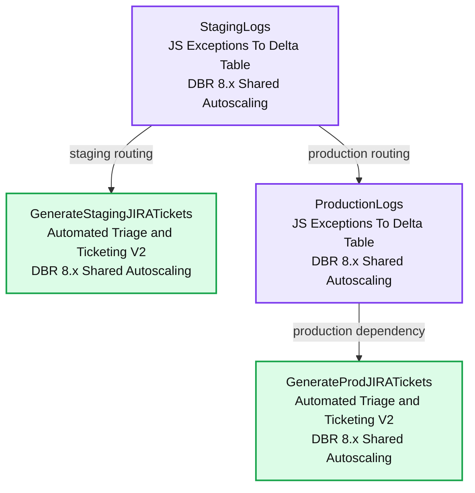

# Taming JavaScript Exceptions With Databricks

- Source: https://www.databricks.com/blog/2022/01/25/taming-javascript-exceptions-with-databricks.html
- Published: 2022-01-25
- Authors: George Pantazis
- Categories: engineering
- Images: 9 total, 2 extracted as architecture

*This post is a part of our blog series on our frontend work. You can see the previous one on “[Simplifying Data + AI, One Line of TypeScript at a Time.](https://www.databricks.com/blog/2021/10/21/simplifying-data-ai-one-line-of-typescript-at-a-time.html)” and “[Building the Next Generation Visualization Tools at Databricks](https://www.databricks.com/blog/2021/11/03/building-the-next-generation-visualization-tools-at-databricks.html).” *

At Databricks, we take the quality of our customer experience very seriously. As such, we track many metrics for product reliability. One metric we focus on is the percentage of sessions that see no JavaScript (JS) exceptions. Our goal is to keep this happy case above 99.9%, but historically, these issues have been tracked manually, which for many reasons wasn't sufficient for keeping errors at bay.

 Image: A JS exception in the wild on Databricks

In the past, we used Sentry to aggregate and categorize a variety of exceptions, including those from JS. Sentry both ingests the errors and, on the front end, aggregates sourcemaps to decode minified stack traces.

 Image: An example Sentry issue

## Using Databricks to track JS exceptions

While considering how we could better automate our exception tracking and, thus, decrease the number of issues being shipped out, we looked into extending Sentry. Unfortunately, we found that the effort required was high. As we looked into what Sentry was solving for our use case, we realized that Databricks' products could largely accomplish the same tasks, with an easier path for extensibility.

*Image: Diagram of our JS exception pipeline*

**Summary:** The diagram shows a JavaScript exception pipeline that collects client errors, enriches them with source maps in a Databricks ETL pipeline, and sends results to dashboards and JIRA.

**Components:**

- Customers: JavaScript clients
- Endpoint: Exception collection endpoint
- Client log storage: Usage logs and exceptions
- Frontend Build CI: Frontend build system
- Source Maps: JSON source map files
- Exceptions: Captured JavaScript errors
- ETL Pipeline: Databricks ETL processing
- Structured Error Database: Structured exception storage
- DBSQL Dashboards: Error monitoring dashboards
- JIRA: Issue tracking system
- JIRA Tasks and Dashboard: JIRA task management and reporting

**Flows:**

- Customers -> Endpoint: JavaScript exception events
- Endpoint -> Client log storage: Usage logs and exceptions
- Frontend Build CI -> Source Maps: Generated source maps
- Source Maps -> ETL Pipeline: Source map data
- Exceptions -> ETL Pipeline: Captured exceptions
- ETL Pipeline -> Structured Error Database: Enriched exceptions
- Structured Error Database -> DBSQL Dashboards: Structured error data
- ETL Pipeline -> JIRA: Create JIRA tickets
- JIRA -> JIRA Tasks and Dashboard: JIRA tasks and status data

**Numbers:** none

```mermaid
%% Shows the Databricks JavaScript exception pipeline
flowchart LR
    C[Customers] -->|JavaScript exception events| E[Endpoint]
    E -->|Usage logs and exceptions| L[Client log storage]
    CI[Frontend Build CI] -->|Generated source maps| S[Source Maps]
    S -->|Source map data| ETL[ETL Pipeline]
    X[Exceptions] -->|Captured exceptions| ETL
    L -->|Stored exceptions| ETL
    ETL -->|Enriched exceptions| DB[Structured Error Database]
    DB -->|Structured error data| D[DBSQL Dashboards]
    ETL -->|Create JIRA tickets| J[JIRA]
    J -->|Tasks and status data| JD[JIRA Tasks and Dashboard]

    classDef client fill:#dbeafe,stroke:#2563eb,stroke-width:2px,color:#111
    classDef service fill:#dcfce7,stroke:#16a34a,stroke-width:2px,color:#111
    classDef store fill:#ede9fe,stroke:#7c3aed,stroke-width:2px,color:#111
    classDef cache fill:#fef3c7,stroke:#d97706,stroke-width:2px,color:#111
    classDef queue fill:#cffafe,stroke:#0891b2,stroke-width:2px,color:#111
    classDef critical fill:#fee2e2,stroke:#dc2626,stroke-width:4px,color:#111
    classDef external fill:#e5e7eb,stroke:#6b7280,stroke-width:2px,color:#111,stroke-dasharray:4 3
    classDef decision fill:#fce7f3,stroke:#db2777,stroke-width:2px,color:#111

    class C client
    class E,CI,ETL service
    class L,S,X,DB store
    class D,J,JD external
```

source image: https://www.databricks.com/wp-content/uploads/2022/01/taming-javascript-exceptions-with-databricks-blog-image-3.jpg

 Image: Diagram of our JS exception pipeline

First, Databricks is more than a data platform; it's essentially a general-purpose computing and app infrastructure that sits on top of your data. This lets you create an ETL where you ingest all kinds of information and apply programmatic transformations, all from within the web product.

And once you’ve constructed that ETL, you can use the results to build dynamic dashboards, connect to third-party APIs or anything else. Databricks even has GUIs to orchestrate pipelines of tasks and handles alerting when anything fails.

With that in mind, our challenge was to build an internal, maintainable pipeline for our JS exceptions, with the goal of automatically creating tickets whenever we detected issues in staging or production.

## Moving from Sentry to Databricks

### Aggregating into Delta

The first step in constructing our ETL was to find our source of truth. This was our usage_logs table, which contains a wide variety of different logs and metrics for customer interactions with the product. Every JS exception was stored here with the minified stack traces.

We started by building a [Databricks Notebook](https://www.databricks.com/product/collaborative-notebooks) to process our usage_logs. This table is gigantic and difficult to optimize, so querying it for exceptions can take thirty minutes or more. So, we aggregated the data we wanted into a standalone Delta Table, which enabled us to query and slice the data (approximately a year's worth of exceptions) in seconds.

### Data enrichment: stack trace decoding

Critically, we needed to find a way to decode the minified stack traces in our usage_logs as a part of the ETL. This would let us know what file and line caused a given issue and take further steps to enrich the exception based on that knowledge.

 Image: An example minified stack, with only some indication of where the problem was happening.

The first step here was to store our sourcemaps in an AWS S3 bucket as a part of our build. Databricks helpfully gives you the ability to mount S3 buckets into your workspace's file system, which makes those sourcemaps easily-accessible to our code.

Once we had the sourcemaps in S3, we had the ability to decode the stack traces on Databricks. This was done entirely in Databricks Notebooks, which have the ability to install Python libraries via pip. We installed the [sourcemap](https://pypi.org/project/sourcemap/) package to handle the decode, then built a small Python script to evaluate a given stacktrace and fetch the relevant sourcemaps from the file system.

 Image: An outline of how we decode stack traces within the Databricks product

Once we had that, we wrapped the script in a UDF so that we could run it directly from SQL queries in our notebooks! This gave us the ability to decode the stack trace and return the file that caused the error, the line and context of source code, and the decoded stack itself, all of which were saved in separate columns.

### Code ownership

Once we decoded the stack traces, we had high confidence on which file was responsible for each error and could use that to determine which team owned the issue. To do this, we used Github's API to crawl the repository, find the nearest OWNERS file and map the owning team to a JIRA component.

We built this into another UDF and added it to our aggregator, so when an exception came in, it was pre-triaged to the correct team!

### Databricks SQL dashboards

To gain visibility into what was going on in the product, we used [Databricks SQL](https://www.databricks.com/product/databricks-sql) to build dashboards for high-level metrics. This helped us visualize trends and captured the fine-grain issues happening in the current release.

 Image: A high-level dashboard for JS exceptions in the Databricks product

We also built dashboards for analyzing particular issues, which show error frequency, variations of the error and more. This, in effect, replaces Sentry’s UI, and we can augment it to provide whichever data is the most relevant to our company.

 Image: Detailed dashboard for an individual JS exception in Databricks SQL

### Ticketing

Once we had our ETL built and populated, we looked at the incident frequency in staging and production relative to the number of Databricks users in those environments. We decided that it made sense to automatically raise a JIRA ticket anytime an exception occurred in staging, while in production, we set the threshold at ten distinct sessions during a release.

This immediately raised dozens of tickets. The majority were in some way or another known but were all low enough impact that the team hadn't tackled them. In aggregate, however, dozens of small tickets were greatly regressing our experience. Around this time, we calculated that 20% of sessions saw at least one error!

With all the data we could pull and enrich, our engineers were able to effectively jump right into a fix rather than wading through different services and logs to get the information they needed to act. As a result, we quickly burned down a large portion of our issues and got back above our 99.9% error-free goal.

 Image: The current evolution of our exception tickets, with decoded stack traces and code context

### Task [orchestration](https://www.databricks.com/glossary/orchestration) with Jobs

When executing our pipeline, we have one notebook that handles the ETL and another that compares the state of the delta table to JIRA and opens any necessary issues. Running these requires some orchestration, but luckily, Databricks Jobs [makes it easy](https://www.databricks.com/blog/2021/07/13/announcement-orchestrating-multiple-tasks-with-databricks-jobs-public-preview.html)to handle this.

*Image: A job pipeline on Databricks*

**Summary:** A Databricks Jobs pipeline routes staging logs to staging ticket generation and production logs to production ticket generation.

**Components:**

- StagingLogs using JS Exceptions To Delta Table and DBR 8.x Shared Autoscaling
- GenerateStagingJIRATickets using Automated Triage and Ticketing V2 and DBR 8.x Shared Autoscaling
- ProductionLogs using JS Exceptions To Delta Table and DBR 8.x Shared Autoscaling
- GenerateProdJIRATickets using Automated Triage and Ticketing V2 and DBR 8.x Shared Autoscaling

**Flows:**

- StagingLogs -> GenerateStagingJIRATickets: staging job dependency
- StagingLogs -> ProductionLogs: pipeline routing
- ProductionLogs -> GenerateProdJIRATickets: production job dependency

**Numbers:** 8.x, V2

source image: https://www.databricks.com/wp-content/uploads/2022/01/taming-javascript-exceptions-with-databricks-blog-image-9.jpg

 Image: A job pipeline on Databricks

With Jobs, we can run those notebooks for staging and production in sequence. This is very easy to set up in the web GUI to handle routing of failures to our team's alert inbox.

## Final thoughts

Overall, the products we’ve been building at Databricks are incredibly powerful and give us the capability to build bespoke tracking and analytics for anything we’re working on. We're using processes like these to monitor frontend performance, keep track of React component usage, manage dashboards for code migrations and much more.

Projects like this one present us with an opportunity to use our products as a customer would, to feel their pain and joy and to give other teams the feedback they need to make Databricks even better.

If working on a platform like this sounds interesting, we're hiring! There's an incredible variety of frontend work being done and being planned, and we could use your help. Come and [join us](https://www.databricks.com/company/careers)!
