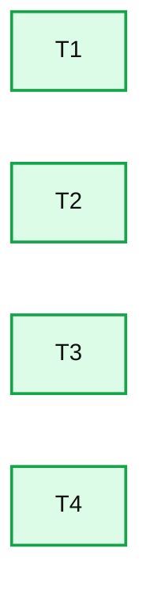
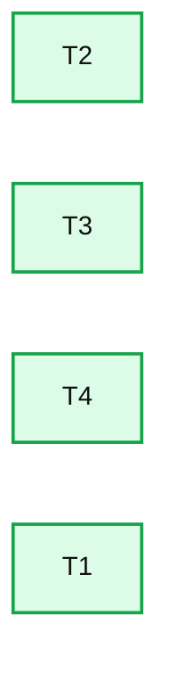
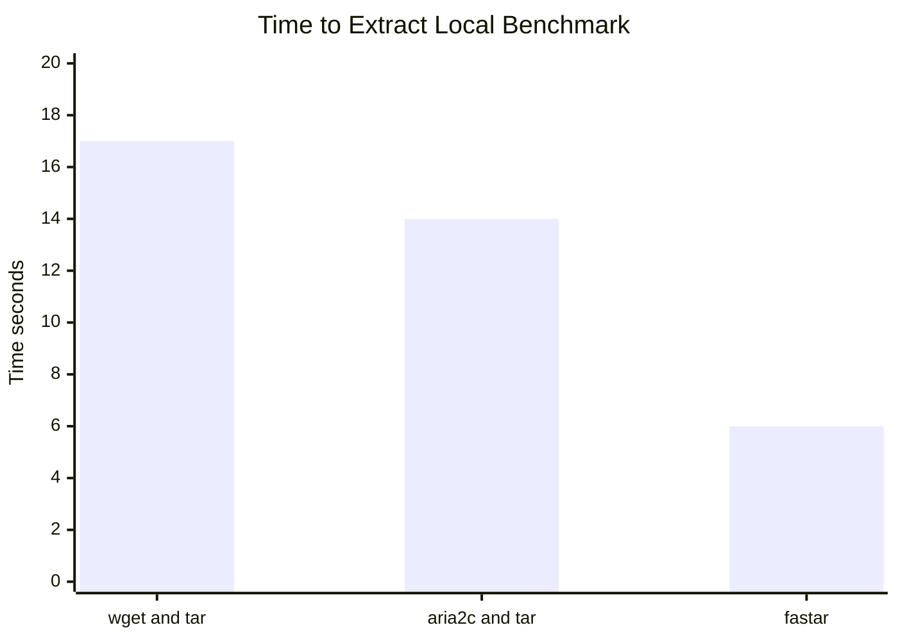
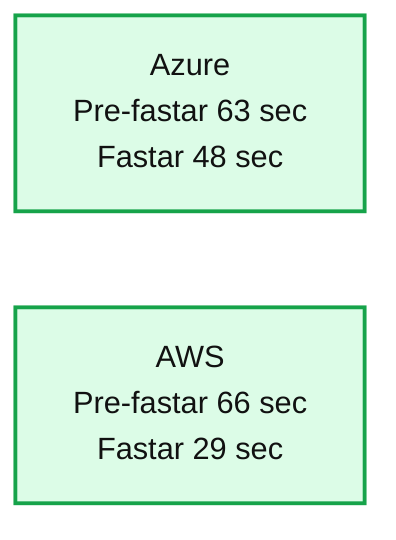

# Creating a Faster TAR Extractor

- Source: https://www.databricks.com/blog/2022/01/26/creating-a-faster-tar-extractor.html
- Published: 2022-01-26
- Authors: Christopher Denny
- Categories: engineering, open-source
- Images: 4 total, 4 extracted as architecture

Tarballs are used industry-wide for packaging and distributing files, and this is no different at Databricks. Every day we launch millions of VMs across multiple cloud providers. One of the first steps on every one of these VMs is extracting a fairly sizable tar.lz4 file containing a specific Apache Spark™ runtime. As part of an effort to help bring down bootstrap times, we wanted to see what could be done to help speed up the process of extracting this large tarball.

## Existing methods

Right now, the most common method for extracting tarballs is to invoke some command (e.g. curl, wget, or even their browser) to download the raw tarball locally, and then use tar to extract the contents to their final location on disk. There are two general methods that exist right now to improve upon this.

### Piping the download directly to tar

Tar uses a sequential file format, which means that extraction always starts at the beginning of the file and makes its way towards the end. A side effect of this is that you don't need the entire file present to begin extraction. Indeed tar can take in “-“ as the input file and it will read from standard input. Couple this with a downloader dumping to standard output (wget -O -) and you can effectively start untarring the file in parallel as the rest is still being downloaded. If both the download phase and the extraction phase take approximately the same time, this can theoretically halve the total time needed.

### Parallel download

Single stream downloaders often don't maximize the full bandwidth of a machine due to bottlenecks in the I/O path (e.g., bandwidth caps set per download stream from the download source). Existing tools like [aria2c](https://github.com/aria2/aria2) help mitigate this by downloading with parallel streams from one or more sources to the same file on disk. This can offer significant speedups, both by utilizing multiple download streams and by writing them in parallel to disk.

## What fastar does different

### Parallel downloads + piping

The first goal of fastar was to combine the benefits of piping downloads directly to tar with the increased speed of parallel download streams. Unfortunately aria2c is designed for writing directly to disk. It doesn't have the necessary synchronization mechanisms needed for converting the multiple download streams to a single logical stream for standard output.

Fastar employs a group of worker threads that are all responsible for downloading their own slices of the overall file. Similar to other parallel downloaders, it takes advantage of the HTTP RANGE header to make sure each worker only downloads the chunk it's responsible for. The main difference is that these workers make use of golang channels and a shared io.Writer object to synchronize and merge the different download streams. This allows for multiple workers to be constantly pulling data in parallel while the eventual consumer only sees a sequential, in-order stream of bytes.

Assuming 4 worker threads (this number is user configurable), the high-level logic is as follows:

1. Kick off threads (T1 - T4), which start downloading chunks in parallel starting at the beginning of the file. T1 starts immediately writing to stdout while threads T2-T4 save to in-memory buffers until it's their turn.

**Summary:** A horizontal layout showing four parallel worker threads labeled T1 through T4.

**Components:**

- T1: Worker thread
- T2: Worker thread
- T3: Worker thread
- T4: Worker thread

**Flows:**

- none

**Numbers:** 1, 2, 3, 4

source image: https://www.databricks.com/wp-content/uploads/2022/01/creating-faster-tar-extractor-blog-img-1.jpg

1. Once T1 is finished writing its current chunk to stdout, it signals T2 that it's their turn, and starts downloading the next chunk it's responsible for (right after T4's current chunk). T2 starts writing the data they saved in their buffer to stdout while the rest of the threads continue with their downloads. This process continues for the whole file.

**Summary:** The diagram shows four thread slots arranged in sequence: T2, T3, T4, and T1.

**Components:**

- T2 thread
- T3 thread
- T4 thread
- T1 thread

**Flows:**

- none

**Numbers:** 2, 3, 4, 1

source image: https://www.databricks.com/wp-content/uploads/2022/01/creating-faster-tar-extractor-blog-img-2.jpg

### Multithreaded tar extraction

The other big area for improvement was actual extraction of files to disk by tar itself. As alluded to earlier, one of the reasons aria2c is such a fast file downloader is that it writes to disk with multiple streams. Keeping a high queue depth when writing ensures that the disk always has work to do and isn't sitting idle waiting for the next command. It also allows the disk to constantly rearrange write operations to maximize throughput. This is especially important when, for example, untarring many small files. The built in tar command is single threaded, extracting all files from the archive in a single hot loop.

To get around this, fastar also utilizes multiple threads for writing individual extracted files to disk. For each file in the stream, fastar will copy the file data to a buffer, which is then passed to a thread to write to disk in the background. Some file types need to be handled differently here for correctness. Folders are written synchronously to ensure they exist before any subfiles are written to disk. Another special case here is hard links. Since they require the dependent file to exist unlike symlinks, we need to take care to synchronize file creation around them.

### Quality of life features

Fastar also includes a few features to improve ease of use:

- S3 hosted download support. Fastar also supports downloading from S3 buckets using the s3://bucket/key format
- Compression support. Fastar internally handles decompression of gzip and lz4 compressed tarballs. It can even automatically infer which compression schema is used by sniffing the first few bytes for a [magic number](https://en.wikipedia.org/wiki/List_of_file_signatures).

## Performance numbers

To test locally, we used an lz4 compressed tarball of a container filesystem (2.6GB compressed, 4.3GB uncompressed). This was hosted on a local HTTP server serving from an in-memory file system. The tarball was then downloaded and extracted to the same in-memory file system. This should represent a theoretical best case scenario as we aren’t IO bound with the memory backed file system.

**Summary:** Local benchmark comparing extraction time for wget and tar, aria2c and tar, and fastar.

**Components:**

- wget and tar
- aria2c and tar
- fastar
- Time axis measured in seconds

**Flows:**

- none

**Numbers:** 0, 5, 10, 15, 20, 3 times faster, 2.6GB compressed, 4.3GB uncompressed, 7.6GB compressed, 16.1GB uncompressed

source image: https://www.databricks.com/wp-content/uploads/2022/01/creating-faster-tar-extractor-blog-img-3.jpg

For production impact, the following shows the speed difference when extracting one of the largest images we support on a live cluster (7.6GB compressed, 16.1GB uncompressed). Pre-fastar, we used aria2c on Azure and boto3 on AWS to download the image before extracting it with tar.

**Summary:** The chart compares TAR extraction times for Pre-fastar and Fastar on Azure and AWS production environments.

**Components:**

- Azure production environment
- AWS production environment
- Pre-fastar benchmark
- Fastar benchmark
- Time axis in seconds

**Flows:**

- none

**Numbers:** 0, 20, 40, 60, 80 seconds; Azure Pre-fastar approximately 63 seconds; Azure Fastar approximately 48 seconds; AWS Pre-fastar approximately 66 seconds; AWS Fastar approximately 29 seconds

source image: https://www.databricks.com/wp-content/uploads/2022/01/creating-faster-tar-extractor-blog-img-4.jpg

From the tests above, fastar can offer significant speed improvements, both in synthetic and real-world benchmarks. In synthetic workloads we achieve a nearly 3x improvement over naively calling wget && tar and double the performance compared to using the already fast aria2c && tar. Finally in production workloads we see a 1.3x improvement in Azure Databricks and over a 2x improvement in Databricks on AWS.

Interested in working on problems like this? Consider [applying](https://www.databricks.com/company/careers) to Databricks!

Also let us know if you would find this tool useful and we can look into open sourcing it!
