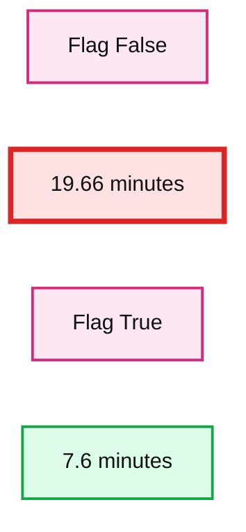
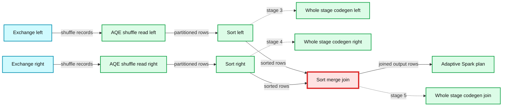
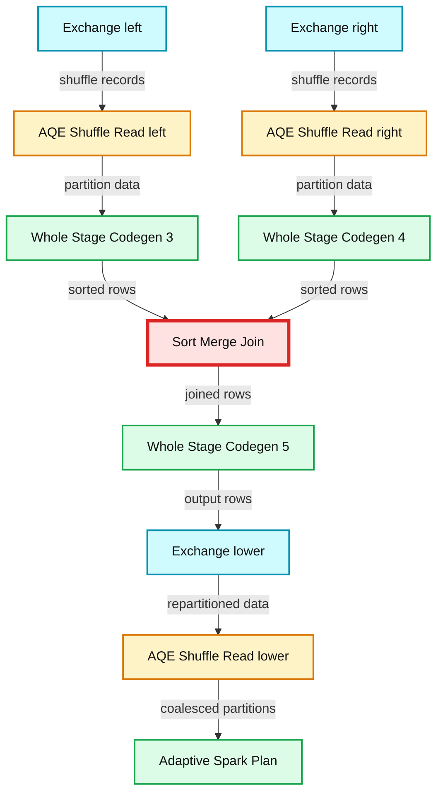

# Make Your Data Lakehouse Run, Faster With Delta Lake 1.1

- Source: https://www.databricks.com/blog/2022/01/31/make-your-data-lakehouse-run-faster-with-delta-lake-1-1.html
- Published: 2022-01-31
- Authors: Scott Sandre, Ryan Zhu, Denny Lee, Vini Jaiswal
- Categories: engineering, open-source
- Images: 8 total, 5 extracted as architecture

### Delta Lake 1.1 improves performance for merge operations, adds the support for generated columns and improves nested field resolution

With the tremendous contributions from the open-source community, the Delta Lake community recently announced the release of [Delta Lake 1.1.0](https://github.com/delta-io/delta/releases) on [Apache Spark™ 3.2](https://spark.apache.org/releases/spark-release-3-2-0.html). Similar to Apache Spark, the Delta Lake community has released [Maven artifacts](https://mvnrepository.com/artifact/io.delta/delta-core) for both Scala 2.12 and Scala 2.13 and in PyPI (delta_spark).

This release includes notable improvements around MERGE operation and nested field resolution, as well as support for generated columns in a MERGE operation, Python type annotations, arbitrary expressions in ‘replaceWhere’ and more. It is super important that Delta Lake keeps up to date with the innovation in Apache Spark. This means that you can take advantage of increased performance in Delta Lake using the features that are available in [Spark Release 3.2.0](https://spark.apache.org/releases/spark-release-3-2-0.html).

This post will go over the major changes and notable features in the new 1.1.0 release. Check out the [project’s Github repository](https://github.com/delta-io/delta/releases) for details.

> Want to get started with Delta Lake right away instead? Learn more about what is [Delta Lake](https://docs.delta.io/latest/delta-intro.html) and use this [guide](https://docs.delta.io/latest/quick-start.html) to build lakehouses with Delta Lake.

## Key features of Delta Lake 1.1.0

- **Performance improvements in MERGE operation: **On partitioned tables, MERGE operations will automatically [repartition the output data before writing to files](https://docs.delta.io/latest/delta-update.html#performance-tuning). This ensures better performance out-of-the-box for both the MERGE operation as well as subsequent read operations.
- **Support for passing Hadoop configurations via DataFrameReader/Writer options: ** You can now set Hadoop FileSystem configurations (e.g., access credentials) via DataFrameReader/Writer options. Earlier, the only way to pass such configurations was to set Spark session configuration, which would set them to the same value for all reads and writes. Now you can set them to different values for each read and write. See the documentation for more details.
- **Support for arbitrary expressions in replaceWhere DataFrameWriter option:** Instead of expressions only on partition columns, you can now use arbitrary expressions in the replaceWhere DataFrameWriter option. That is you can replace arbitrary data in a table directly with DataFrame writes. See the documentation for more details.
- **Improvements to nested field resolution and schema evolution in MERGE operation on an array of structs: **When applying the MERGE operation on a target table having a column typed as an array of nested structs, the nested columns between the source and target data are now resolved by name instead of the position in the struct. This ensures structs in arrays have a consistent behavior with structs outside arrays. When automatic schema evolution is enabled for MERGE, nested columns in structs in arrays will follow the same evolution rules (e.g., column added if no column by the same name exists in the table) as columns in structs outside arrays. See the documentation for more details.
- **Support for Generated Columns in MERGE operation:** You can now apply MERGE operations on tables having [Generated Columns](https://docs.delta.io/latest/delta-batch.html#use-generated-columns).
- **Fix for rare data corruption issue on GCS:** Experimental GCS support released in Delta Lake 1.0 has a rare bug that can lead to Delta tables being unreadable due to partially written transaction log files. This issue has now been fixed ([1](https://github.com/delta-io/delta/commit/7a3f1e8ec626e80880d524c2b897a969c8b4d63a), [2](https://github.com/delta-io/delta/commit/95e90763fd9f54df8880911b28b97b023a485d5f)).
- **Fix for the incorrect return object in Python DeltaTable.convertToDelta(): **This existing API [now returns](https://github.com/delta-io/delta/commit/c586f9a7374923867c36f61df4ed133725c8df2c) the correct Python object of type delta.tables.DeltaTable instead of an incorrectly-typed, and therefore, unusable object.
- **Python type annotations:** We have added Python type annotations, which improve auto-completion performance in editors that support type hints. Optionally, you can enable static checking through [mypy](http://mypy-lang.org/) or built-in tools (for example Pycharm tools).

Other Notable features in the Delta Lake 1.1.0 release are as follows:

1. Removed support to read tables with certain special characters in the partition column name. See the migration guide for details.
2. [Support](https://github.com/delta-io/delta/commit/1470e33f3f728a1670a77da63f3fb78780c30873) for “delta.`path`” in DeltaTable.forName() for consistency with other APIs.
3. Improvements to DeltaTableBuilder API introduced in Delta 1.0.0:
  - [Fix](https://github.com/delta-io/delta/commit/59aa330c403f8a71b3eef0e90bd61cd54aab108c) for bug that prevented the passing of multiple partition columns in Python DeltaTableBuilder.partitionBy.
  - [Throw error](https://github.com/delta-io/delta/commit/104e2a472b5a0a5c718c42ac14ac8b851a1a7fe8) when the column data type is not specified.
4. Improved [support](https://github.com/delta-io/delta/commit/83277eb30c0834bd837d9658864261fc31d366f6) for MERGE/UPDATE/DELETE on temp views.
5. [Support](https://github.com/delta-io/delta/commit/a2722f8b17369a47dd8d23696fc4958f022bb496) for setting user metadata in the commit information when creating or replacing tables.
6. [Fix](https://github.com/delta-io/delta/commit/4e1c53c6984ba7d56fd2a0d9fe27ac2573df27ea) for an incorrect analysis exception in MERGE with multiple INSERT and UPDATE clauses and automatic schema evolution enabled.
7. [Fix](https://github.com/delta-io/delta/commit/4359484368b4a06c32b663826ac60bf12d9e8025) for incorrect handling of special characters (e.g. spaces) in paths by MERGE/UPDATE/DELETE operations.
8. [Fix](https://github.com/delta-io/delta/commit/7f46e91cf0950e437ffbce93d8a5925ebd0a3991) for Vacuum parallel mode from being affected by the Adaptive Query Execution enabled by default in Apache Spark 3.2.
9. [Fix](https://github.com/delta-io/delta/commit/4243bccbe397e0f47dc36b525f14983d57bbc848) for earliest valid time travel version.
10. [Fix](https://github.com/delta-io/delta/commit/43d14226cc802d721d1683495cdc8511acf460a1)for Hadoop configurations not being used to write checkpoints.
11. Multiple fixes ([1](https://github.com/delta-io/delta/commit/83780aeeadd67893ad69ed6481f7c6bce5be563c), [2](https://github.com/delta-io/delta/commit/685820b66ec42de7ef8f8a61ef3fd0fcfb702a70), [3](https://github.com/delta-io/delta/commit/db113dab3db5bdc371f3d49734e26a7403372c24)) to Delta Constraints.

In the next section, let’s dive deeper into the most notable features of this release.

## Better performance out-of-the-box for MERGE operation

**Summary:** Benchmark comparison showing execution time dropping when `repartitionBeforeWrite_enabled` changes from False to True.

**Components:**

- `repartitionBeforeWrite_enabled` set to False
- `repartitionBeforeWrite_enabled` set to True
- Execution time measured in minutes

**Flows:**

- none

**Numbers:** 20, 15, 10, 5, 0, 19.66 minutes, 7.6 minutes

source image: https://www.databricks.com/wp-content/uploads/2022/01/data-lakehouse-run-faster-img-blog-11.jpg

- The above graph shows the significant reduction in execution time from 19.66 minutes (before) to 7.6 minutes (after) the feature flag was enabled.
- Notice the difference in stages in the DAG visualization below for both the queries before and after. There is an additional stage for AQE ShuffleRead after the SortMergeJoin.

*disabled.*

**Summary:** The diagram shows the Spark execution DAG for a Delta Lake MERGE query with repartitionBeforeWrite disabled.

**Components:**

- Scan parquet: Parquet data scan
- WholeStageCodegen 1: Spark whole-stage code generation
- Exchange: Spark shuffle exchange
- WholeStageCodegen 2: Spark whole-stage code generation
- AQEShuffleRead: Spark adaptive query execution shuffle read
- WholeStageCodegen 3: Spark whole-stage code generation
- WholeStageCodegen 4: Spark whole-stage code generation
- WholeStageCodegen 5: Spark whole-stage code generation
- Sort: Spark sort operation

**Flows:**

- Scan parquet -> WholeStageCodegen 1: scanned rows
- WholeStageCodegen 1 -> Exchange: partitioned rows
- Exchange -> AQEShuffleRead: shuffled data
- Scan parquet -> WholeStageCodegen 2: scanned rows
- WholeStageCodegen 2 -> Exchange: partitioned rows
- Exchange -> AQEShuffleRead: shuffled data
- AQEShuffleRead -> WholeStageCodegen 3: shuffle-read rows
- AQEShuffleRead -> WholeStageCodegen 4: shuffle-read rows
- WholeStageCodegen 3 -> WholeStageCodegen 5: processed rows
- WholeStageCodegen 4 -> WholeStageCodegen 5: processed rows
- WholeStageCodegen 5 -> Sort: rows to sort

**Numbers:** Job 28; submitted 2022/01/30 22:49:03; duration 17 min; SQL query 14; completed stages 1; skipped stages 2; Stage 50; Stage 51; Stage 52; WholeStageCodegen 1; WholeStageCodegen 2; WholeStageCodegen 3; WholeStageCodegen 4; WholeStageCodegen 5

```mermaid
%% Spark DAG for a Delta Lake MERGE query with repartitionBeforeWrite disabled
flowchart LR
    A[Scan parquet] -->|scanned rows| B[WholeStageCodegen 1]
    B -->|partitioned rows| C[Exchange]
    C -->|shuffled data| E[AQEShuffleRead]

    D[Scan parquet] -->|scanned rows| F[WholeStageCodegen 2]
    F -->|partitioned rows| G[Exchange]
    G -->|shuffled data| H[AQEShuffleRead]

    E -->|shuffle-read rows| I[WholeStageCodegen 3]
    H -->|shuffle-read rows| J[WholeStageCodegen 4]
    I -->|processed rows| K[WholeStageCodegen 5]
    J -->|processed rows| K
    K -->|rows to sort| L[Sort]

    M[Legend]:::external

    classDef client fill:#dbeafe,stroke:#2563eb,stroke-width:2px,color:#111
    classDef service fill:#dcfce7,stroke:#16a34a,stroke-width:2px,color:#111
    classDef store fill:#ede9fe,stroke:#7c3aed,stroke-width:2px,color:#111
    classDef cache fill:#fef3c7,stroke:#d97706,stroke-width:2px,color:#111
    classDef queue fill:#cffafe,stroke:#0891b2,stroke-width:2px,color:#111
    classDef critical fill:#fee2e2,stroke:#dc2626,stroke-width:4px,color:#111
    classDef external fill:#e5e7eb,stroke:#6b7280,stroke-width:2px,color:#111,stroke-dasharray:4 3
    classDef decision fill:#fce7f3,stroke:#db2777,stroke-width:2px,color:#111

    class A,D store
    class B,C,E,F,G,H,I,J,K,L service
    class M external
```

source image: https://www.databricks.com/wp-content/uploads/2022/01/data-lakehouse-run-faster-img-blog-5-2.jpg

 Figure: DAG for the delta merge query with repartitionBeforeWrite

disabled.

*enabled.*

**Summary:** The diagram shows a Spark DAG for a Delta Lake MERGE query with repartitionBeforeWrite enabled, including skipped stages, AQE shuffle reads, code generation, exchanges, and a final sort.

**Components:**

- Job 37 using Apache Spark
- Stage 68 skipped with Scan parquet, WholeStageCodegen 1, and Exchange
- Stage 69 skipped with Scan parquet, WholeStageCodegen 2, and Exchange
- Stage 70 skipped with AQEShuffleRead, WholeStageCodegen 3, WholeStageCodegen 4, WholeStageCodegen 5, and Exchange
- Stage 71 with AQEShuffleRead and Sort

**Flows:**

- Scan parquet 68 -> WholeStageCodegen 1: parquet records
- WholeStageCodegen 1 -> Exchange 68: transformed records
- Scan parquet 69 -> WholeStageCodegen 2: parquet records
- WholeStageCodegen 2 -> Exchange 69: transformed records
- Exchange 68 -> AQEShuffleRead 1: shuffled data
- Exchange 69 -> AQEShuffleRead 2: shuffled data
- AQEShuffleRead 1 -> WholeStageCodegen 3: shuffle records
- AQEShuffleRead 2 -> WholeStageCodegen 4: shuffle records
- WholeStageCodegen 3 -> WholeStageCodegen 5: joined records
- WholeStageCodegen 4 -> WholeStageCodegen 5: joined records
- WholeStageCodegen 5 -> Exchange 70: repartitioned records
- Exchange 70 -> AQEShuffleRead 3: shuffled records
- AQEShuffleRead 3 -> Sort: sorted records

**Numbers:** Job 37; submitted 2021/01/30 23:09:56; duration 5.0 min; associated SQL query 20; completed stages 1; skipped stages 3; stages 68, 69, 70, 71; WholeStageCodegen 1, 2, 3, 4, 5, 6.

```mermaid
%% Spark DAG for a Delta Lake merge query with repartitioning enabled
flowchart LR
    A[Scan parquet 68] -->|parquet records| B[WholeStageCodegen 1]
    B -->|transformed records| C[Exchange 68]
    D[Scan parquet 69] -->|parquet records| E[WholeStageCodegen 2]
    E -->|transformed records| F[Exchange 69]
    C -->|shuffled data| G[AQEShuffleRead 1]
    F -->|shuffled data| H[AQEShuffleRead 2]
    G -->|shuffle records| I[WholeStageCodegen 3]
    H -->|shuffle records| J[WholeStageCodegen 4]
    I -->|joined records| K[WholeStageCodegen 5]
    J -->|joined records| K
    K -->|repartitioned records| L[Exchange 70]
    L -->|shuffled records| M[AQEShuffleRead 3]
    M -->|sorted records| N[Sort]

    classDef client fill:#dbeafe,stroke:#2563eb,stroke-width:2px,color:#111
    classDef service fill:#dcfce7,stroke:#16a34a,stroke-width:2px,color:#111
    classDef store fill:#ede9fe,stroke:#7c3aed,stroke-width:2px,color:#111
    classDef cache fill:#fef3c7,stroke:#d97706,stroke-width:2px,color:#111
    classDef queue fill:#cffafe,stroke:#0891b2,stroke-width:2px,color:#111
    classDef critical fill:#fee2e2,stroke:#dc2626,stroke-width:4px,color:#111
    classDef external fill:#e5e7eb,stroke:#6b7280,stroke-width:2px,color:#111,stroke-dasharray:4 3
    classDef decision fill:#fce7f3,stroke:#db2777,stroke-width:2px,color:#111

    class A,D store
    class B,E,I,J,K service
    class C,F,L queue
    class G,H,M cache
    class N critical
```

source image: https://www.databricks.com/wp-content/uploads/2022/01/data-lakehouse-run-faster-img-blog-6.jpg

 Figure: DAG for the delta merge query with repartitionBeforeWrite

enabled.

Let’s take a look at the **example **now:
In the data set used for this example, customers1 and customers2 have 200000 rows and 11 columns with information about customers and sales. To showcase the difference between enabling the flag when running a MERGE operation on the bare minimum, we limited the Spark job to 1GB RAM and 1 core running on Macbook Pro 2019 laptop. These numbers can be further reduced by tweaking the RAM and cores used. In the MERGE table, customers_merge with 45000 rows was used to perform a MERGE operation on the former tables. Full script and results for the example are available [here](https://github.com/vinijaiswal/delta-lake/tree/main/delta1.1_merge).

*To ensure that the feature was disabled, you can run the following command*:

CODE:

**Results:**
***Note: The full operation took ******19.66 minutes****** while the feature flag was disabled.** *You can refer to this [full result](https://github.com/vinijaiswal/delta-lake/blob/main/delta1.1_merge/repartitionBeforeWrite.enabled%3Dfalse.pdf) for the details of the query.

**Summary:** The diagram shows a Spark adaptive execution plan for a Delta Lake MERGE, with two shuffle exchanges feeding sorted stages and a final sort merge join.

**Components:**

- Exchange left: Apache Spark shuffle exchange
- Exchange right: Apache Spark shuffle exchange
- AQEShuffleRead left: Spark Adaptive Query Execution shuffle reader
- AQEShuffleRead right: Spark Adaptive Query Execution shuffle reader
- WholeStageCodegen left: Spark whole-stage code generation stage
- WholeStageCodegen right: Spark whole-stage code generation stage
- Sort left: Spark sort operator
- Sort right: Spark sort operator
- WholeStageCodegen join: Spark whole-stage code generation stage
- SortMergeJoin: Spark sort merge join
- AdaptiveSparkPlan: Spark Adaptive Query Execution plan

**Flows:**

- Exchange left -> AQEShuffleRead left: shuffle records and partition data
- Exchange right -> AQEShuffleRead right: shuffle records and partition data
- AQEShuffleRead left -> Sort left: partitioned rows for sorting
- AQEShuffleRead right -> Sort right: partitioned rows for sorting
- Sort left -> SortMergeJoin: sorted left-side rows
- Sort right -> SortMergeJoin: sorted right-side rows
- SortMergeJoin -> AdaptiveSparkPlan: joined output rows

**Numbers:**

- Exchange left: 65,000 shuffle records written; 2.6 m total shuffle write time; 43 ms minimum, 70 ms median, 466 ms maximum; 65,000 records read; 20.1 MiB local bytes read total; 841.6 KiB minimum, 1234.4 KiB median, 1282.0 KiB maximum; 0 ms fetch wait time; 0.0 B remote bytes read; 27,049 local blocks read; 0 remote blocks read; 19.5 MiB data size total; 1872.0 B minimum, 9.8 KiB median, 38.8 KiB maximum; 200 number of partitions; 0.0 B remote bytes read to disk; 20.1 MiB shuffle bytes written total; 1845.0 B minimum, 10.2 KiB median, 36.3 KiB maximum
- Exchange right: 243,000 shuffle records written; 9.7 m total shuffle write time; 45 ms minimum, 83 ms median, 881 ms maximum; 243,000 records read; 26.1 MiB local bytes read total; 1088.7 KiB minimum, 1596.7 KiB median, 1636.8 KiB maximum; 0 ms fetch wait time; 0.0 B remote bytes read; 59,218 local blocks read; 0 remote blocks read; 18.5 MiB data size total; 800.0 B minimum, 2.5 KiB median, 30.9 KiB maximum; 200 number of partitions; 0.0 B remote bytes read to disk; 26.1 MiB shuffle bytes written total; 1240.0 B minimum, 3.8 KiB median, 35.6 KiB maximum
- AQEShuffleRead left: 17 number of partitions; 21.1 MiB partition data size total; 884.0 KiB minimum, 1297.7 KiB median, 1347.8 KiB maximum; 17 coalesced partitions
- AQEShuffleRead right: 17 number of partitions; 27.3 MiB partition data size total; 1141.1 KiB minimum, 1673.7 KiB median, 1715.7 KiB maximum; 17 coalesced partitions
- WholeStageCodegen left: stage 3; 2.1 m total duration; 5.3 s minimum, 7.5 s median, 7.6 s maximum
- WholeStageCodegen right: stage 4; 9.2 s total duration; 4.6 s minimum, 4.6 s median, 4.6 s maximum
- Sort left: 734 ms total sort time; 1 ms minimum, 46 ms median, 48 ms maximum; 35.1 MiB peak memory total; 1088.0 KiB minimum, 2.1 MiB median, 2.1 MiB maximum; 0.0 B spill size
- Sort right: 422 ms total sort time; 6 ms minimum, 25 ms median, 84 ms maximum; 41.3 MiB peak memory total; 1280.0 KiB minimum, 2.5 MiB median, 2.5 MiB maximum; 0.0 B spill size
- WholeStageCodegen join: stage 5; 1.3 m total duration; 2.8 s minimum, 4.6 s median, 4.6 s maximum
- SortMergeJoin: 65,000 output rows

source image: https://www.databricks.com/wp-content/uploads/2022/01/data-lakehouse-run-faster-img-blog-7.jpg

For partitioned tables, the MERGE can produce a much larger number of small files than the number of shuffle partitions. This is because every shuffle task can write multiple files in multiple partitions, and can become a performance bottleneck. To enable faster MERGE operation on our partitioned table, let's enable repartitionBeforeWrite using the code snippet below.

### Enable the flag and run the merge again.

This will allow MERGE operation to automatically repartition the output data of partitioned tables before writing to files. In many cases, it helps to repartition the output data by the table’s partition columns before writing it. This ensures better performance out-of-the-box for both the MERGE operation as well as subsequent read operations. Let’s run the MERGE operation on our table customer_t0 now.

***Note:*** After enabling the feature “repartitionBeforeWrite”, the merge query took 7.68 minutes. You can refer to this [full result](https://github.com/vinijaiswal/delta-lake/blob/main/delta1.1_merge/repartitionBeforeWrite.enabled%3Dtrue.pdf) for the details of the query.

**Summary:** The diagram shows a Spark SQL adaptive execution plan where two exchanged datasets are shuffled, sorted, joined, repartitioned, and read into an adaptive Spark plan.

**Components:**

- Exchange, Apache Spark shuffle and partition exchange
- AQEShuffleRead, Apache Spark Adaptive Query Execution shuffle reader
- WholeStageCodegen, Apache Spark whole-stage code generation
- Sort, Apache Spark sort operator
- SortMergeJoin, Apache Spark sort-merge join
- AdaptiveSparkPlan, Apache Spark adaptive execution plan

**Flows:**

- Exchange left -> AQEShuffleRead left: shuffled records
- Exchange right -> AQEShuffleRead right: shuffled records
- AQEShuffleRead left -> WholeStageCodegen 3: partition data
- AQEShuffleRead right -> WholeStageCodegen 4: partition data
- WholeStageCodegen 3 -> SortMergeJoin: sorted rows
- WholeStageCodegen 4 -> SortMergeJoin: sorted rows
- SortMergeJoin -> WholeStageCodegen 5: joined rows
- WholeStageCodegen 5 -> Exchange lower: output rows for shuffle
- Exchange lower -> AQEShuffleRead lower: repartitioned shuffle data
- AQEShuffleRead lower -> AdaptiveSparkPlan: coalesced partitions

**Numbers:**

- Left top Exchange: 65,000 shuffle records written; 2.9 ms shuffle write; 65,000 records read; 20.1 MiB local bytes read; 0 ms fetch wait; 0 remote bytes read; 27.0 ms local blocks read; 0 remote blocks read; 19.5 MiB data size; 20 partitions; 20.1 MiB shuffle bytes written; stages 67.0, 63.0; tasks 15960, 21618, 21610, 15955
- Right top Exchange: 243,000 shuffle records written; 11.1 ms shuffle write; 243,000 records read; 26.1 MiB local bytes read; 0 ms fetch wait; 0 remote bytes read; 59.2 s local blocks read; 0 remote blocks read; 18.5 MiB data size; 20 partitions; 26.1 MiB shuffle bytes written; stages 67.0, 64.0; tasks 21612, 17793, 21610, 17782
- Left AQEShuffleRead: 17 partitions; 21.1 MiB partition data size; 17 coalesced partitions
- Right AQEShuffleRead: 17 partitions; 27.3 MiB partition data size; 17 coalesced partitions
- WholeStageCodegen 3: 2.2 s duration; stage 67.0; task 21616
- WholeStageCodegen 4: 9.7 s duration; stage 67.0; task 21611
- Left Sort: 16 ms sort time; 35.1 MiB peak memory; 0.0 B spill size; stage 67.0; task 21610
- Right Sort: 174 ms sort time; 41.3 MiB peak memory; 0.0 B spill size; stage 67.0; task 21615
- WholeStageCodegen 5: 1.3 s duration; stage 67.0; task 21614
- SortMergeJoin: 65,000 output rows
- Lower Exchange: 65,000 shuffle records written; 15.8 s shuffle write; 65,000 records read; 12.1 MiB local bytes read; 0 ms fetch wait; 0 remote bytes read; 204 local blocks read; 0 remote blocks read; 19.5 MiB data size; 200 partitions; 12.1 MiB shuffle bytes written; stages 67.0, 71.0; tasks 21624, 21638, 21632, 21618
- Lower AQEShuffleRead: 12 partitions; 12.7 MiB partition data size; 12 coalesced partitions
- Visible units: ms, s, MiB, KiB, B

source image: https://www.databricks.com/wp-content/uploads/2022/01/delta-11-blog-image-7.jpg

**Tip**: Organizations working around the GDPR and CCPA use case can highly appreciate this feature, as it provides a cost-effective way to do fast point updates and deletes without rearchitecting your entire data lake.

## Support for arbitrary expressions in replaceWhere DataFrameWriter option

To atomically replace all the data in a table, you can use overwrite mode:

With Delta Lake 1.1.0 and above, you can also selectively overwrite only the data that matches an arbitrary expression using dataframes. The following command atomically replaces records with the birth year ‘1924’ in the target table, which is partitioned by c_birth_year, with the data in customer_t1:

This query will result in a successful run and an output like below:

However, for the past releases of Delta Lake which were before 1.1.0, the same query would result in the following error:

You can try it by disabling the replaceWhere flag.

## Python Type Annotations

Python type annotations improve auto-completion performance in editors, which support type hints. Optionally, you can enable static checking through [mypy](http://mypy-lang.org/) or built-in tools (for example Pycharm tools). Here is a [video](https://asciinema.org/a/TyWTbNNXRkk8h4YBHRTAPJ9L7)from the original author of the PR, [Maciej Szymkiewicz](https://github.com/zero323) describing the changes in the behavior of python within delta lake 1.1.

Hope you got to see some cool Delta Lake features through this blog post. Excited to find out where you are using these features and if you have any feedback or examples of your work, please share with the [community](https://delta.io/#:~:text=Join%20the%20Delta%20Lake%20Community).

## Summary

Lakehouse has become a new norm for organizations wanting to build Data platforms and architecture. And all thanks to Delta Lake - which allowed in excess of 5000 organizations out there to build successful production Lakehouse Platform for their data and Artificial Intelligence applications. With the exponential data increase, it's important to process volumes of data faster and reliably. With Delta lake, developers can make their lakehouses run much faster with the improvements in version 1.1 and keep the pace of innovation.

**Interested in the open-source Delta Lake?**
Visit the [Delta Lake online hub](https://delta.io/) to learn more, you can join the Delta Lake community via Slack and [Google Group](https://groups.google.com/forum/#!forum/delta-users). You can track all the upcoming releases and planned features in [GitHub milestones](https://github.com/delta-io/delta/milestones) and try out Managed Delta Lake on Databricks with a [free account](https://www.databricks.com/try-databricks).

---

**Credits**
We want to thank the following contributors for updates, doc changes, and contributions in Delta Lake 1.1.0: Abhishek Somani, Adam Binford, Alex Jing, Alexandre Lopes, Allison Portis, Bogdan Raducanu, Bart Samwel, Burak Yavuz, David Lewis, Eunjin Song, ericfchang, Feng Zhu, Flavio Cruz, Florian Valeye, Fred Liu, gurunath, Guy Khazma, Jacek Laskowski, Jackie Zhang, Jarred Parrett, JassAbidi, Jose Torres, Junlin Zeng, Junyong Lee, KamCheung Ting, Karen Feng, Lars Kroll, Li Zhang, Linhong Liu, Liwen Sun, Maciej, Max Gekk, Meng Tong, Prakhar Jain, Pranav Anand, Rahul Mahadev, Ryan Johnson, Sabir Akhadov, Scott Sandre, Shixiong Zhu, Shuting Zhang, Tathagata Das, Terry Kim, Tom Lynch, Vijayan Prabhakaran, Vítor Mussa, Wenchen Fan, Yaohua Zhao, Yijia Cui, YuXuan Tay, Yuchen Huo, Yuhong Chen, Yuming Wang, Yuyuan Tang, and Zach Schuermann.
