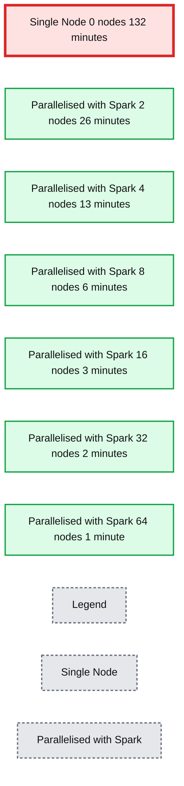
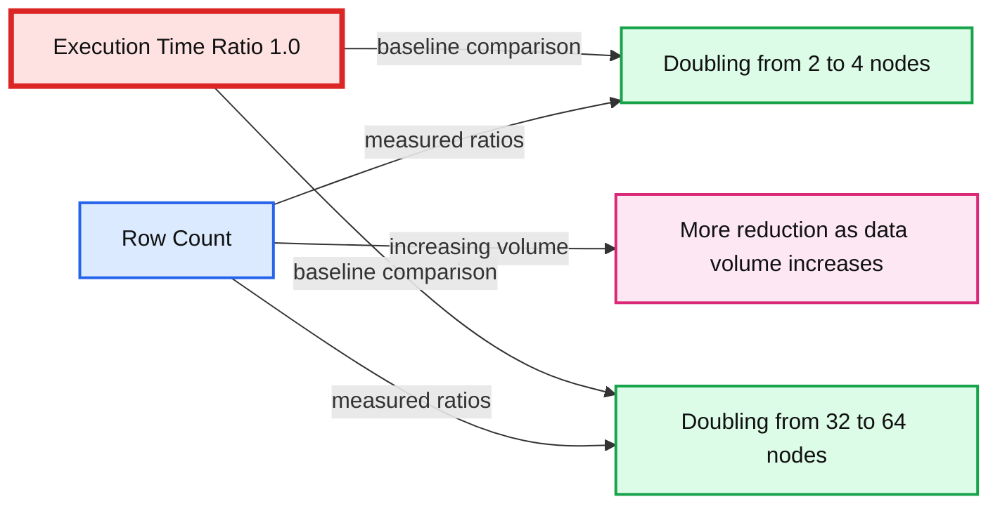

# Scaling SHAP Calculations With PySpark and Pandas UDF

- Source: https://www.databricks.com/blog/2022/02/02/scaling-shap-calculations-with-pyspark-and-pandas-udf.html
- Published: 2022-02-02
- Authors: Sepideh Ebrahimi, P. Patel
- Categories: data-science-machine-learning
- Images: 4 total, 4 extracted as architecture

## Motivation

With the proliferation of applications of Machine Learning (ML) and especially Deep Learning (DL) models in decision making, it is becoming more crucial to see through the black box and justify key business decisions based off the back of such models’ outputs. For example, if an ML model rejects a customer’s loan request or assigns a credit risk in peer-to-peer lending to a certain customer, giving business stakeholders an explanation about why this decision was made could be a powerful tool in encouraging the adaptation of the models. In many cases, interpretable ML is not just a business requirement but a regulatory requirement to understand why a certain decision or option was given to a customer. [SHapley Additive exPlanations](https://en.wikipedia.org/wiki/Shapley_value) (SHAP) is an important tool one can leverage towards explainable AI and to help establish trust in the outcome of ML models and neural networks in solving business problems.

SHAP is a state-of-the-art framework for model explanation based on [Game Theory](https://en.wikipedia.org/wiki/Game_theory). The approach involves finding a linear relationship between features in a model and the model output for each data point in your dataset. Using this framework, you can interpret your model’s output globally or locally. Global interpretability helps you understand how much each feature contributes to the outcomes positively or negatively. On the other hand, local interpretability helps you understand the effect of each feature for any given observation.

The most common SHAP implementations adopted widely in the data science community are run on single node machines, meaning that they run all the computations on a single core, regardless of how many cores are available.Therefore, they do not take advantage of distributed computation capabilities and are bounded by the limitations of a single core.

In this post, we will demonstrate a simple way to parallelize SHAP value calculations across several machines, specifically for local interpretability. We will then explain how this solution scales with the growing number of rows and columns in the dataset. Finally, we will highlight some of our findings on what works and what to avoid when parallelizing SHAP calculations with Spark.

## Single-node SHAP

To realize explainability, SHAP turns a model into an Explainer; individual model predictions are then explained by applying the Explainer to them. There are several implementations of SHAP value calculations in different programming languages including a [popular one in Python](https://shap.readthedocs.io/en/latest/index.html). With this implementation, to get explanations for each observation, you can apply an explainer appropriate for your model. The following code snippet illustrates how to apply a TreeExplainer to a Random Forest Classifier.

This method works well for small data volumes, but when it comes to explaining an ML model’s output for millions of records, it does not scale well due to the single-node nature of the implementation. For example, the visualization in figure 1 below shows the growth in execution time of a SHAP value calculation on a single node machine (4 cores and 30.5 GB of memory) for an increasing number of records. The machine ran out of memory for data shapes bigger than 1M rows and 50 columns, therefore, those values are missing in the figure. As you can see, the execution time grows almost linearly with the number of records, which is not sustainable in real-life scenarios. Waiting, for example, 10 hours to understand why a machine learning model has made a model prediction is neither efficient nor acceptable in many business settings.

*Figure 1: Single-node SHAP Calculation Execution Time*

**Summary:** The chart shows single-node SHAP execution time increasing with row count for datasets with 10 or 50 columns.

**Components:**

- Row Count axis
- Execution Time axis in hours
- 10-column dataset series
- 50-column dataset series

**Flows:**

- Row count -> Execution time: larger datasets require longer SHAP calculations

**Numbers:** 10, 50, 0.1 M, 1.0 M, 3.0 M, 5.0 M, 0, 2, 4, 6, 8, 10, approximately 0.2 hours, 0.9 hours, 2.2 hours, 6.3 hours, 9.4 hours, 10.6 hours

```mermaid
%% Single-node SHAP execution time benchmark by row count and column count
xychart-beta
    title "Single-node SHAP Calculation Execution Time"
    x-axis "Row Count" ["0.1 M", "1.0 M", "3.0 M", "5.0 M"]
    y-axis "Execution Time hours" 0 --> 11
    bar "10 columns" [0.2, 2.2, 6.3, 10.6]
    bar "50 columns" [0.9, 9.4, 0, 0]
```

source image: https://www.databricks.com/wp-content/uploads/2022/02/scaling-shap-calculations-with-pyspark-blog-img-1.jpg

Figure 1: Single-node SHAP Calculation Execution Time

One way you may look to solve this problem is the use of approximate calculation. You can set the approximate argument to True in the shap_values method. That way, the lower splits in the tree will have higher weights and there is no guarantee that the SHAP values are consistent with the exact calculation. This will speed up the calculations, but you might end up with an inaccurate explanation of your model output. Furthermore, the approximate argument is only available in TreeExplainers.

An alternative approach would be to take advantage of a distributed processing framework such as Apache Spark™ to parallelize the application of the Explainer across multiple cores.

## Scaling SHAP calculations with PySpark

To distribute SHAP calculations, we are working with [this](https://shap.readthedocs.io/en/latest/index.html) Python implementation and [Pandas UDFs](https://docs.databricks.com/spark/latest/spark-sql/udf-python-pandas.html) in PySpark. We are using the [kddcup99](http://kdd.ics.uci.edu/databases/kddcup99/) dataset to build a network intrusion detector, a predictive model capable of distinguishing between bad connections, called intrusions or attacks, and good normal connections. This dataset is [known to be flawed](https://www.scientific.net/AMM.667.218) for intrusion detection purposes. However, in this post, we are purely focusing on SHAP value calculations and not the semantics of the underlying ML model.

The two models we built for our experiments are simple Random Forest classifiers trained on datasets with 10 and 50 features to show scalability of the solution over different column sizes. Please note that the original dataset has less than 50 columns, and we have replicated some of these columns to reach our desired volume of data. The data volumes we have experimented with range from 4MB to 1.85GB.

Before we dive into the code, let’s provide a quick overview of how Spark Dataframes and UDFs work. Spark Dataframes are distributed (by rows) across a cluster, each grouping of rows is called a partition and each partition (by default) can be operated on by 1 core. This is how Spark fundamentally achieves parallel processing. Pandas UDFs are a natural choice, as pandas can easily feed into SHAP and is performant. A pandas UDF, sometimes known as a vectorized UDF, gives us better performance over Python UDFs by using [Apache Arrow](https://arrow.apache.org/) to optimize the transfer of data.

The code snippet below demonstrates how to parallelize applying an Explainer with a Pandas UDF in PySpark. We define a pandas UDF called calculate_shap and then pass this function to mapInPandas. This method is then used to apply the parallelized method to the PySpark dataframe. We will use this UDF to run our SHAP performance tests.

Figure 2 compares the execution time of 1M rows and 10 columns on a single-node machine vs clusters of sizes 2, 4, 8, 16, 32, and 64 respectively. The underlying machines for all clusters are similar (4 cores and 30.5 GB of memory). One interesting observation is that the parallelized code takes advantage of all the cores across the nodes in the cluster. Therefore, even using a cluster of size 2 improves performance almost 5 fold.

*Figure 2: Single-node vs Parallel SHAP Calculation Execution Time (1M rows, 10 columns)*

**Summary:** Benchmark comparing single-node and Spark-parallelized SHAP execution time across increasing cluster node counts.

**Components:**

- Single Node - single-machine SHAP execution
- Parallelised with Spark - distributed SHAP execution
- Node Count - cluster size dimension
- Execution Time minutes - performance metric

**Flows:**

- none

**Numbers:** 0, 2, 4, 8, 16, 32, 64 nodes; execution-time ticks 0, 20, 40, 60, 80, 100, 120 minutes; approximately 132, 26, 13, 6, 3, 2, and 1 minutes.

source image: https://www.databricks.com/wp-content/uploads/2022/02/scaling-shap-calculations-with-pyspark-blog-img-2.jpg

Figure 2: Single-node vs Parallel SHAP Calculation Execution Time (1M rows, 10 columns)

### Scaling with growing data size

Due to how SHAP is implemented, additional features have a greater impact on performance than additional rows. Now we know that SHAP values can be calculated faster using Spark and Pandas UDF. Next we will look at how SHAP performs with additional features/columns.

Intuitively growing data size means more calculations to crunch through for the SHAP algorithm. Figure 3 illustrates SHAP values execution times on a 16-node cluster for different numbers of rows and columns. You can see that scaling the rows increases the execution time almost directly proportional, that is, doubling the row count almost doubles execution time. Scaling the number of columns has a proportional relationship with the execution time; adding one column increases the execution time by almost 80%.

These observations (Figure 2 and Figure 3) led us to conclude that the more data you have, the more you can scale your computation horizontally (adding more worker nodes) to keep the execution time reasonable.

*Figure 3: 16-node Parallel SHAP Calculation Execution Time for Different Row and Column*

**Summary:** Benchmark chart showing SHAP execution time across row counts for datasets with 10 or 50 columns on a 16-node cluster.

**Components:**

- Row Count axis
- Execution Time axis in minutes
- 10-column dataset series
- 50-column dataset series
- Legend titled Column Count

**Flows:**

- none

**Numbers:** 16 nodes, 10 columns, 50 columns, 0.1 M, 1.0 M, 3.0 M, 5.0 M, 10.0 M rows, 0, 20, 40, 60, 80, 100, 120 minutes

```mermaid
%% Shows SHAP execution time by row count and column count
xychart-beta
    title "16-node Parallel SHAP Calculation Execution Time"
    x-axis "Row Count" ["0.1 M", "1.0 M", "3.0 M", "5.0 M", "10.0 M"]
    y-axis "Execution Time in minutes" 0 --> 130
    bar "10 columns" [0.5, 3.5, 9.5, 16, 32]
    bar "50 columns" [1.5, 13, 38, 63, 125]
```

source image: https://www.databricks.com/wp-content/uploads/2022/02/scaling-shap-calculations-with-pyspark-blog-img-3.jpg

Figure 3: 16-node Parallel SHAP Calculation Execution Time for Different Row and Column

### When to consider parallelization?

Questions we wanted to answer are: *when is parallelization worth it? When should one start using PySpark to parallelize SHAP calculations - even with the knowledge that might add to the computation?* We set up an experiment to measure the effect of doubling cluster size on improving SHAP calculation execution time. The aim of the experiment is to figure out what size of data justifies throwing more horizontal resources (i.e., adding more worker nodes) at the problem.

We ran the SHAP calculations for 10 columns of data and for row counts of 10, 100, 1000, and so forth up to 10M. For each row count, we measured the SHAP calculation execution time 4 times for cluster sizes of 2, 4, 32, and 64. The execution time ratio is the ratio of execution time of SHAP value calculation on the bigger cluster sizes (4 and 64) over running the same calculation on a cluster size with half the number of nodes (2 and 32 respectively).

Figure 4 illustrates the result of this experiment. Here are the key takeaways:

-
  - For small row counts, doubling cluster sizes does not improve execution time and, in some cases, worsens it due to the overhead added by Spark task management (hence Execution Time Ratio > 1).
  - As we increase the number of rows, doubling the cluster size gets more effective. For 10M rows of data, doubling the cluster size almost halves the execution time.
  - For all row counts, doubling the cluster size from 2 to 4 is more effective than doubling from 32 to 64 (notice the gap between blue and orange lines). As your cluster size grows, the overhead of adding more nodes also grows. This is due to having partition sizes where the data size per partition is too small, and it adds more overhead to create a separate task to process the small amount of data than to use a more optimal data/partition size.

*Figure 4: The Effect of Doubling Cluster Size on Execution Time for Different Data Volumes*

**Summary:** The chart compares execution-time ratios when doubling cluster size from 2 to 4 nodes versus 32 to 64 nodes across increasing row counts.

**Components:**

- Row Count: logarithmic data-volume scale
- Execution Time Ratio: measured performance metric
- Blue series: doubling from 2 to 4 nodes
- Orange series: doubling from 32 to 64 nodes
- Red baseline: execution-time ratio of 1.0
- Annotation: greater reduction as data volume increases

**Flows:**

- Row Count -> Blue series: execution-time ratios for doubling from 2 to 4
- Row Count -> Orange series: execution-time ratios for doubling from 32 to 64
- Data volume increases -> Annotation: more reduction in execution time

**Numbers:** 10¹, 10², 10³, 10⁴, 10⁵, 10⁶, 10⁷; 0.4, 0.6, 0.8, 1.0, 1.2, 1.4; blue values 0.94, 1.12, 0.98, 0.73, 0.55, 0.53, 0.49; orange values 1.29, 1.20, 1.29, 1.07, 0.82, 0.61, 0.53; 2 to 4; 32 to 64

source image: https://www.databricks.com/wp-content/uploads/2022/02/scaling-shap-calculations-with-pyspark-blog-img-4-1.jpg

Figure 4: The Effect of Doubling Cluster Size on Execution Time for Different Data Volumes

## Gotchas

### Repartitioning

As mentioned above, Spark implements parallelism through the notion of partitions; data is partitioned into chunks of rows and each partition is processed by a single core by default. When data is initially read by Apache Spark it may not necessarily create partitions that are optimal for the computation that you want to run on your cluster. In particular, for calculating SHAP values, we can potentially get better performance by repartitioning our dataset.

It is important to strike a balance between creating small enough partitions and not so small that the overhead of creating them outweighs the benefits of parallelizing the calculations.
 For our performance test we decided to make use of all the cores in the cluster using the following code:

For even bigger volumes of data you may want to set the number of partitions to 2 or 3 times the number of cores. The key is to experiment with it and find out the best partitioning strategy for your data.

### Use of display()

If you are working on a Databricks Notebook, you may want to avoid the use of [display()](https://docs.databricks.com/notebooks/visualizations/index.html#display-function-1) function when benchmarking the execution times. The use of display() may not necessarily show you how long a full transformation takes; it has an implicit row limit, which is injected into the query and, depending on the operation you want to measure, e.g., writing to a file, there is additional overhead in gathering results back to the driver. Our execution times were measured using Spark’s write method using “noop” format.

## Conclusion

In this blog post, we introduced a solution to speed up SHAP calculations by parallelizing it with PySpark and Pandas UDFs. We then evaluated the performance of the solution on increasing volumes of data, different machine types and changing configurations. Here are the key takeaways:

-
  -
    - Single-node SHAP calculation grows linearly with the number of rows and columns.
    - Parallelizing SHAP calculations with PySpark improves the performance by running computation on all CPUs across your cluster.
    - Increasing cluster size is more effective when you have bigger data volumes. For small data, this method is not effective.

## Future work

**Scaling Vertically** - The purpose of the blog post was to show how scaling horizontally with large datasets can improve the performance of calculating SHAP values. We started on the premise that each node in our cluster had 4 cores, 30.5 GB. In the future, it would be interesting to test the performance of scaling vertically as well as horizontally; for example, comparing performance between a cluster of 4 nodes (4 cores, 30.5GB each) with a cluster of 2 nodes (8 cores, 61GB each).

**Serialize/Deserialize** - As mentioned, one of the core reasons to use Pandas UDFs over Python UDFs is that Pandas UDFs uses Apache Arrow to improve the serialization/deserialization of data between the JVM and python process. There could be some potential optimizations when converting Spark data partitions to Arrow record batches, experimenting with the Arrow batch size could lead to further performance gains.

**Comparison with distributed SHAP implementations** - It would be interesting to compare the results of our solution to distributed implementations of SHAP, such as [Shparkley](https://github.com/Affirm/shparkley). In conducting such a comparative study, it would be important to make sure the outputs of both solutions are comparable in the first place.
