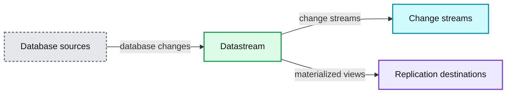
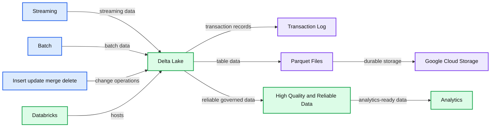

# Google Datastream Integration With Delta Lake for Change Data Capture

- Source: https://www.databricks.com/blog/2022/02/03/google-datastream-integration-with-delta-lake-for-change-data-capture.html
- Published: 2022-02-03
- Authors: Eugene Miretsky, Steven Deutscher-Kobayashi, Binu Mathew, Etai Margolin
- Categories: partners, data-streaming
- Images: 3 total, 3 extracted as architecture

This is a collaborative post between the data teams as Badal, Google and Databricks. We thank Eugene Miretsky, Partner, and Steven Deutscher-Kobayashi, Senior Data Engineer, of Badal, and Etai Margolin, Product Manager, Google, for their contributions.

Operational databases capture business transactions that are critical to understanding the current state of the business. Having [real-time insights](https://www.databricks.com/product/data-streaming) into how your business is performing enables your data teams to quickly make business decisions in response to market conditions.

Databricks provides a managed cloud platform to analyze data collected from source systems, including operational databases, in real-time. With [the Databricks Lakehouse Platform](https://www.databricks.com/product/data-lakehouse), you can store all of your data in a secure and open lakehouse architecture that combines the best of data warehouses and data lakes to unify all of your analytics and AI workloads. Today, we’re excited to share our partner [Badal.io](https://badal.io/)’s release of their[Google Datastream Delta Lake connector](https://github.com/badal-io/datastream-deltalake-connector), which enables Change Data Capture (CDC) for MySQL and Oracle relational databases. CDC is a software-based process that identifies and tracks changes to data in a source data management system, such as a relational database (RDBMS). CDC can provide real-time activity of data by processing data continuously as new database events occur.

## Why log-based CDC

Log-based CDC is an alternative approach to traditional batch data ingestion. It reads the database’s native transaction log (sometimes called redo or binary log) and provides real-time or near-real-time replication of data by streaming the changes continuously to the destination as events occur.

CDC presents the following benefits:

- **Simplified ingestion:** Batch ingestion typically requires intimate knowledge of the source data model to handle incremental uploads and deletes; data engineers need to work with domain experts to configure the ingestion for each table. CDC decreases both the time and cost of ingesting new datasets.
- **Real-time data:** CDC streams changes with seconds or minutes latency, enabling a variety of real-time use cases, such as near real-time dashboards, database replication and real-time analytics.
- **Minimal disruption to production workloads:** While regular batch ingestion utilizes database resources to query data, CDC reads changes from the database’s redo or archive log, resulting in minimal consumption of resources.
- **Event-based architecture:** Microservices can subscribe to changes in the database in the form of events. The microservices can then build their own views, caches and indexes while maintaining data consistency.

## Why Datastream

Google Cloud Datastream is an easy-to-use CDC and replication service that allows you to synchronize data across heterogeneous databases, storage systems and applications reliably and with minimal latency.

The benefits of Datastream include:

- **Serverless**, so there are no resources to provision or manage, and the service automatically scales up and down as needed.
- **Easy to use setup and monitoring experiences** that achieve super fast time-to-value
- **Secure**, with private connectivity options and the security you expect from Google Cloud, with no impact to source databases.
- **Accurate and reliable** with transparent status reporting and robust processing flexibility in the face of data and schema changes.
- **Data written to the destination is normalized into a unified-type schema**. This means that downstream consumers are almost entirely source-agnostic, making it a simple solution that is easily scalable to support a wide range of different sources.

**Summary:** Google Datastream captures changes from database sources and delivers them to change streams or replication destinations.

**Components:**

- Sources: Oracle, MySQL, PostgreSQL, SQL Server, MongoDB, SAP, and custom sources
- Datastream: serverless CDC and replication service
- Change streams: Cloud Storage, Pub/Sub, Kafka, and custom destinations
- Replication materialized views: BigQuery, Spanner, Cloud SQL, Bigtable, MongoDB, Databricks, and custom destinations
- Datastream capabilities: serverless architecture, easy-to-use setup, secure connectivity, and unmatched flexibility

**Flows:**

- Sources -> Datastream: database change records
- Datastream -> Change streams: change streams
- Datastream -> Replication destinations: replicated materialized views

**Numbers:** none

source image: https://www.databricks.com/wp-content/uploads/2022/02/google-datastream-integration-with-delta-lake-blog-img-1.png

## Connector design

[Badal.io](https://badal.io/) and Databricks collaborated on writing a Datastream [connector for Delta Lake](https://github.com/badal-io/datastream-deltalake-connector).

### Architecture

Datastream writes change log records to files in Google Cloud Storage (GCS) files in either avro or JSON format. The datastream-delta connector uses Spark Structured Streaming to read files as they arrive and streams them to a Delta Lake table.

**Summary:** The diagram shows database sources flowing through Google Datastream and Cloud Storage into Databricks change sets, staging, and final Delta Lake tables.

**Components:**

- Sources: Oracle, MySQL, PostgreSQL, SQL Server, and additional custom sources
- Datastream: Google Cloud change data capture service
- Cloud Storage: Google Cloud Storage for Avro or JSON change records
- Change Sets: Databricks change log files
- Staging Table: Databricks table containing every source change
- Final Table: Databricks table representing the resulting database state
- Databricks Benefits: Advanced analytics, data democratization, integrated workspace, elastic scalability, and support

**Flows:**

- Sources -> Datastream: Database changes
- Datastream -> Cloud Storage: Change log records
- Cloud Storage -> Change Sets: Arriving change records
- Change Sets -> Staging Table: Individual insert, update, and delete events
- Staging Table -> Final Table: Applied changes producing the final state

**Numbers:** none

source image: https://www.databricks.com/wp-content/uploads/2022/02/google-datastream-integration-with-delta-lake-blog-img-2.jpg

```mermaid
%% Shows CDC data flowing from database sources through Google Cloud into Databricks tables
flowchart LR
    A[Database Sources] -->|Database changes| B[Datastream]
    B -->|Change log records| C[Cloud Storage]
    C -->|Arriving change records| D[Change Sets]
    D -->|Insert update delete events| E[Staging Table]
    E -->|Applied changes| F[Final Table]
    F -.-> G[Databricks Benefits]

    classDef client   fill:#dbeafe,stroke:#2563eb,stroke-width:2px,color:#111
    classDef service  fill:#dcfce7,stroke:#16a34a,stroke-width:2px,color:#111
    classDef store    fill:#ede9fe,stroke:#7c3aed,stroke-width:2px,color:#111
    classDef cache    fill:#fef3c7,stroke:#d97706,stroke-width:2px,color:#111
    classDef queue    fill:#cffafe,stroke:#0891b2,stroke-width:2px,color:#111
    classDef critical fill:#fee2e2,stroke:#dc2626,stroke-width:4px,color:#111
    classDef external fill:#e5e7eb,stroke:#6b7280,stroke-width:2px,color:#111,stroke-dasharray:4 3
    classDef decision fill:#fce7f3,stroke:#db2777,stroke-width:2px,color:#111

    class A external
    class B service
    class C store
    class D queue
    class E,F store
    class G service
```

The connector creates two Delta Lake tables per source table:

1. Staging table: This table contains every single change that was made in the source database since the replication started. Each row represents a Datastream DML statement (insert, update, delete). It can be replayed to rebuild the state of the database at any given point in the past. Below is an example of the staging table.

| read_timestamp | source_timestamp | object | source_metadata | payload |
|---|---|---|---|---|
| 2021-05-16 T00:40:05.000 +0000 | 2021-05-16 T00:40:05.000 +0000 | demo_inventory. voters | {"table":"inventory.voters","database":"demo", "primary_keys":["id"],"log_file":"mysql-bin.000002", "log_position":27105167,"change_type" :"INSERT","is_deleted":false} | {"id":"743621506","name":"Mr. Joshua Jackson","address":"567 Jessica Plains Apt. 106\nWhitestad, HI 51614","gender":"t"} |
| 2021-05-16 T00:40:06.000 +0000 | 2021-05-16 T00:40:06.000 +0000 | demo_inventory. voters | {"table":"inventory.voters","database":"demo", "primary_keys":["id"],"log_file":"mysql-bin.000002", "log_position":27105800,"change_type": "UPDATE","is_deleted":false} | {"id":"299594688","name":"Ronald Stokes","address":"940 Jennifer Burg Suite 133\nRyanfurt, AR 92355","gender":"m"} |
| 2021-05-16 T00:40:07.000 +0000 | 2021-05-16 T00:40:07.000 +0000 | demo_inventory. voters | {"table":"inventory.voters","database":"demo", "primary_keys":["id"],"log_file":"mysql-bin.000002", "log_position":27106451,"change_type": "DELETE","is_deleted":false} | {"id":"830510405","name":"Thomas Olson","address":"2545 Cruz Branch Suite 552\nWest Edgarton, KY 91433","gender":"n"} |

1. Target table: Contains the most recent snapshot of the source table.

| id | name | address | gender | datastream_metadata _source_timestamp | datastream_metadata _source_metadata_log _file | datastream_metadata _source_metadata_log _position |
|---|---|---|---|---|---|---|
| **207846446** | Michael Thompson | 508 Potter Mountain | m | 2021-05-16 T00:21:02.000 +0000 | mysql-bin.000002 | 26319210 |
| **289483866** | Lauren Jennings | 03347 Brown Islands | t | 2021-05-16 T02:55:40.000 +0000 | mysql-bin.000002 | 31366461 |
| **308466169** | Patricia Riley | 991 Frederick Dam | t | 2021-05-16 T00:59:59.000 +0000 | mysql-bin.000002 | 27931699 |
| **348656975** | Dr. Riley Moody | 89422 Devin Ridge | t | 2021-05-16 T00:08:32.000 +0000 | mysql-bin.000002 | 25820266 |
| **385058605** | Elizabeth Gill | 728 Dorothy Locks | f | 2021-05-16 T00:18:47.000 +0000 | mysql-bin.000002 | 26226299 |

The connector breaks the data ingestion into a multi-step process:

1. Scans GCS to discover all active tables. The Datastream stores each table in a separate sub directory.
2. Parses the table metadata to create a new Delta Lake database and table if required.
3. Initialize two streams for each table:

- Structured Stream from a GCS source
- Structured Stream using Delta table as a [source](https://docs.delta.io/latest/delta-streaming.html)

- Modify the schema of the staging and target tables if it’s different from the schema of the current micro-batch. Staging table schema is migrated using Delta Lake automatic [schema migration feature](https://www.databricks.com/blog/2019/09/24/diving-into-delta-lake-schema-enforcement-evolution.html), which has a target table schema that is modified programmatically before executing the MERGE statement.
- Stream the changes (for each table) into a staging table. The staging table is an append-only table that stores rows of the change log, in which each row represents a DML statement (insert, update, delete).
- Stream changes from the staging table, and merge them into the final table using Delta Lake [MERGE statements](https://docs.databricks.com/spark/latest/spark-sql/language-manual/delta-merge-into.html).

### Table metadata discovery

Datastream sends each event with all metadata required to operate on it: table schema, primary keys, sort keys, database, table info, etc.

As a result, users don’t need to provide an additional configuration for each table they want to ingest. Instead, tables are auto-discovered and all relevant information is extracted from the events for each batch. This includes:

1. Table and Database name
2. Table Schema
3. Primary keys, and sort keys to use in the merge statement.

### Merge logic

This section will describe how the MERGE operation works at a high-level. This code is executed by the library and is not implemented by the user. The MERGE into the target table needs to be designed with care to make sure that all the records are updated correctly, in particular:

1. Records representing the same entity are identified correctly using the primary key.
2. If a micro-batch has multiple entries for the same record, only the latest entry is used.
3. Out-of-order records are handled properly by comparing the timestamp of the record in the target table to the record in the batch, and using the latest version.
4. Delete records are handled properly.

First, for each microbatch, we execute an operations such as:

Then a merge operation comparable to the following SQL is executed:

### Compaction and clean up

Streaming workloads can result in a sub-optimal size of parquet files being written. Typically, if the data volume is not large enough, a tradeoff needs to be made between writing smaller files and increasing streaming latency to allow accumulating more data to write. Small files may lead to degraded read and merge performance, as the job needs to scan a lot of files.

Further, MERGE queries tend to result in a lot of unused data when new entries for updated records overwrite older entries. The unused records don’t affect query correctness, but degrade both CDC and user query performance over time.

To alleviate the problem, users are encouraged to do one of the following:

1. If using a Databricks managed cluster, the best option is to use [Auto optimize and compaction](https://docs.databricks.com/delta/optimizations/auto-optimize.html) to optimize file sizes
2. Schedule a query to periodically call OPTIMIZE and VACUUM
3. Use the connector’s built-in feature to coalesce partitions before writing to the target table, by setting the DELTA_MICROBATCH_PARTITIONS option. This is a simplified (and less effective) version using Databrick auto-optimize.

## Why Delta Lake to build the Lakehouse

[Delta Lake](https://docs.gcp.databricks.com/delta/index.html) is an open-source project to build reliable data lakes that you can easily govern and scale out to billions of files. Delta Lake uses open-source Apache Parquet as the columnar file format for data that can be stored in cloud object storage, including Google Cloud Storage (GCS), Azure Blob Storage, Azure Data Lake Storage (ADLS), AWS Simple Storage Service (S3) and the Hadoop Distributed File System (HDFS). Thousands of organizations use Delta Lake as the foundation for their enterprise data and analytics platforms. Reliability, scalability and governance for data lakes are achieved through the following features of Delta Lake:

- ACID transactions for Apache Spark workloads: Serializable isolation levels ensure that multiple concurrent readers and writers can operate in parallel and never see inconsistent data. Supports merge, update and delete operations to enable complex use cases like change-data-capture, slowly-changing-dimension (SCD) operations and streaming upserts.
- Scalable metadata handling: Can handle large tables consisting of billions of partitions and files at ease.
- Schema enforcement: Schema on read is useful for certain use cases, but this can lead to poor data quality and reporting anomalies. Delta Lake provides the ability to specify a schema and enforce it.
- Audit History: A transaction log records all changes made to data providing a full audit trail of the operation performed, by who, when, and more.
- Time travel: Data versioning enables rollbacks for point-in-time recovery to restore data.

Delta Lake is fully compatible with Apache Spark APIs so you can use it with existing data pipelines with minimal change. Databricks provides a managed cloud service to build your data lake and run your analytics workloads with several additional performance features for Delta Lake:

- [Photon](https://www.databricks.com/product/photon) execution engine: New execution engine that provides extremely fast performance and is compatible with Apache Spark APIs.
- Data Skipping Indexes: Create file-level statistics to avoid scanning files that do not contain the relevant data. Imagine having millions of files containing sales data, but only a dozen of the files contain the actual information you need. With data skipping indexes, the optimizer will know exactly which files to read and skip the rest, thereby avoiding a full scan of the millions of files.
- File Compaction (bin-packing): Improve the speed of read queries by coalescing small files into larger ones. Data lakes can accumulate lots of small files, especially when data is being streamed and incrementally updated. Small files cause read operations to be slow. Coalescing small files into fewer larger ones through compaction is a critical data lake maintenance technique for fast read access.
- Z-Ordering: Sort related fields in the same set of files to reduce the amount of data that needs to be read.
- Bloom Filter Indexes: Quickly search through billions of rows to test for membership of an element in a set.

**Summary:** The diagram shows streaming and batch change data flowing into Databricks Delta Lake on Google Cloud Storage to produce high-quality, reliable data ready for analytics.

**Components:**

- Streaming input
- Batch input
- Insert update merge delete operations
- Databricks
- Delta Lake
- Transaction Log
- Parquet Files
- Google Cloud Storage
- High Quality and Reliable Data
- Analytics
- ACID Transactions
- Table Audit History
- Time Travel and Data Snapshots
- Indexes
- Schema Enforcement
- Schema Evolution
- File Compaction

**Flows:**

- Streaming input -> Delta Lake: streaming data
- Batch input -> Delta Lake: batch data
- Insert update merge delete operations -> Delta Lake: change operations
- Delta Lake -> Transaction Log: transaction records
- Delta Lake -> Parquet Files: table data files
- Parquet Files -> Google Cloud Storage: durable storage
- Delta Lake -> High Quality and Reliable Data: governed and reliable data
- High Quality and Reliable Data -> Analytics: analytics-ready data

**Numbers:** none

source image: https://www.databricks.com/wp-content/uploads/2022/02/google-datastream-integration-with-delta-lake-blog-img-3.png

To get started, visit the [Google Datastream Delta Lake connector](https://github.com/badal-io/datastream-deltalake-connector) GitHub project. If you don’t already have a Databricks account, then try Databricks for [free](https://www.databricks.com/product/google-cloud).
