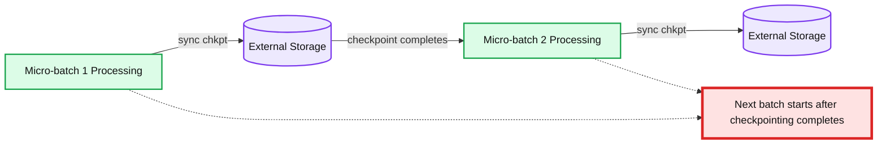

# Structured Streaming: A Year in Review

- Source: https://www.databricks.com/blog/2022/02/07/structured-streaming-a-year-in-review.html
- Published: 2022-02-07
- Authors: Steven Yu, Ray Zhu
- Categories: data-engineering, data-streaming
- Images: 2 total, 2 extracted as architecture

As we enter 2022, we want to take a moment to reflect on the great strides made on the [streaming](https://www.databricks.com/product/data-streaming) front in Databricks and Apache Spark™ ! In 2021, the engineering team and open source contributors made a number of advancements with three goals in mind:

1. Lower latency and improve stateful stream processing
2. Improve observability of Databricks and Spark Structured Streaming workloads
3. Improve resource allocation and scalability

Ultimately, the motivation behind these goals was to enable more teams to run streaming workloads on Databricks and Spark, make it easier for customers to operate mission critical production streaming applications on Databricks and simultaneously optimizing for cost effectiveness and resource usage.

## Goal # 1: Lower latency & improved stateful processing

There are two new key features that specifically target lowering latencies with stateful operations, as well as improvements to the stateful APIs. The first is asynchronous checkpointing for large stateful operations, which improves upon a historically synchronous and higher latency design.

### Asynchronous Checkpointing

**Summary:** The diagram shows micro-batch processing writing synchronous checkpoints to external storage before the next batch starts.

**Components:**

- Micro-batch 1 Processing - streaming compute, technology unspecified
- External Storage - checkpoint storage, technology unspecified
- Micro-batch 2 Processing - streaming compute, technology unspecified
- Checkpoint completion boundary - next batch starts after checkpointing completes

**Flows:**

- Micro-batch 1 Processing -> External Storage: sync chkpt
- External Storage -> Micro-batch 2 Processing: checkpoint completion enables next batch
- Micro-batch 2 Processing -> External Storage: sync chkpt

**Numbers:** 1, 2

source image: https://www.databricks.com/wp-content/uploads/2022/01/stream-ynr-blog-img-1.png

In this model, state updates are written to a cloud storage checkpoint location before the next microbatch begins. The advantage is that if a stateful streaming query fails, we can easily restart the query by using the information from the last successfully completed batch. In the asynchronous model, the next microbatch does not have to wait for state updates to be written, improving the end-to-end latency of the overall microbatch execution.

**Summary:** The diagram shows micro-batches processing sequentially while asynchronously checkpointing state to external storage, allowing the next batch to begin before checkpointing completes.

**Components:**

- Micro-batch 1 Processing
- Micro-batch 2 Processing
- Micro-batch 3 Processing
- External Storage
- Async chkpt
- Time

**Flows:**

- Micro-batch 1 Processing -> Micro-batch 2 Processing: next batch begins
- Micro-batch 2 Processing -> Micro-batch 3 Processing: next batch begins
- Micro-batch 1 Processing -> External Storage: async checkpoint
- Micro-batch 2 Processing -> External Storage: async checkpoint
- Micro-batch 3 Processing -> External Storage: async checkpoint

**Numbers:** 1, 2, 3

```mermaid
%% Shows sequential micro-batch processing with asynchronous checkpoints
flowchart LR
    B1[Micro batch 1 Processing] -. next batch starts .-> B2[Micro batch 2 Processing]
    B2 -. next batch starts .-> B3[Micro batch 3 Processing]
    B1 -->|async checkpoint| S1[External Storage]
    B2 -->|async checkpoint| S2[External Storage]
    B3 -->|async checkpoint| S3[External Storage]

    subgraph Legend
        L1[client = clients edge gateway LB]
        L2[service = stateless compute]
        L3[store = databases durable storage]
        L4[cache = Redis CDN anything losable]
        L5[queue = Kafka streams async pipes]
        L6[critical = bottleneck or SPOF]
        L7[external = third party]
        L8[decision = trade off point]
    end

    classDef client fill:#dbeafe,stroke:#2563eb,stroke-width:2px,color:#111
    classDef service fill:#dcfce7,stroke:#16a34a,stroke-width:2px,color:#111
    classDef store fill:#ede9fe,stroke:#7c3aed,stroke-width:2px,color:#111
    classDef cache fill:#fef3c7,stroke:#d97706,stroke-width:2px,color:#111
    classDef queue fill:#cffafe,stroke:#0891b2,stroke-width:2px,color:#111
    classDef critical fill:#fee2e2,stroke:#dc2626,stroke-width:4px,color:#111
    classDef external fill:#e5e7eb,stroke:#6b7280,stroke-width:2px,color:#111,stroke-dasharray:4 3
    classDef decision fill:#fce7f3,stroke:#db2777,stroke-width:2px,color:#111

    class B1,B2,B3 service
    class S1,S2,S3 store
    class L1 client
    class L2 service
    class L3 store
    class L4 cache
    class L5 queue
    class L6 critical
    class L7 external
    class L8 decision
```

source image: https://www.databricks.com/wp-content/uploads/2022/01/stream-ynr-blog-img-2.png

You can learn more about this feature in an upcoming deep-dive blog post, and try it in Databricks Runtime 10.3 and above.

### Arbitrary stateful operator improvements

In a much [earlier post](https://www.databricks.com/blog/2017/10/17/arbitrary-stateful-processing-in-apache-sparks-structured-streaming.html), we introduced Arbitrary Stateful Processing in Structured Streaming with [flat]MapGroupsWithState. These operators provide a lot of flexibility and enable more advanced stateful operations beyond aggregations. We’ve introduced improvements to these operators that:

- Allow initial state, avoiding the need to reprocess all your streaming data.
- Enable easier logic testing by exposing a new TestGroupState interface, allowing users to create instances of GroupState and access internal values for what has been set, simplifying unit tests for the state transition functions.

#### Allow Initial State

Let’s start with the following flatMapGroupswithState operator:

This custom state function maintains a running count of fruit that have been encountered.

In this example, we specify the initial state to the this operator by setting starting values for certain fruit:

#### Easier Logic Testing

You can also now test state updates using the TestGroupState API.

You can find these, and more examples in the [Databricks documentation](https://docs.databricks.com/spark/latest/structured-streaming/production.html#state-operator-flatmapgroupswithstate-improvements).

### Native support for Session Windows

Structured Streaming introduced the ability to do [aggregations over event-time based windows](https://www.databricks.com/blog/2017/05/08/event-time-aggregation-watermarking-apache-sparks-structured-streaming.html) using tumbling or sliding windows, both of which are windows of fixed-length. In Spark 3.2, we introduced the concept of [session windows](https://www.databricks.com/blog/2021/10/12/native-support-of-session-window-in-spark-structured-streaming.html), which allow dynamic window lengths. This historically required custom state operators using flatMapGroupsWithState.

An example of using dynamic gaps:

## Goal #2: Improve observability of streaming workloads

While the StreamingQueryListener API allows you to asynchronously monitor queries within a SparkSession and define custom callback functions for query state, progress, and terminated events, understanding back pressure and reasoning about where the bottlenecks are in a microbatch were still challenging. As of Databricks Runtime 8.1, the StreamingQueryProgress object reports data source specific back pressure metrics for [Kafka](https://docs.databricks.com/spark/latest/structured-streaming/kafka.html#metrics), [Kinesis](https://docs.databricks.com/spark/latest/structured-streaming/kinesis.html#metrics), [Delta Lake](https://docs.databricks.com/delta/delta-streaming.html#metrics) and [Auto Loader](https://docs.databricks.com/spark/latest/structured-streaming/auto-loader-s3.html#metrics) streaming sources.

An example of the metrics provided for Kafka:

Databricks Runtime 8.3 introduces real-time metrics to help understand the performance of the [RocksDB state store](https://docs.databricks.com/spark/latest/structured-streaming/production.html#rocksdb-state-store-metrics) and debug the performance of state operations. These can also help [identify target workloads](https://docs.databricks.com/spark/latest/structured-streaming/production.html#identifying-target-workloads) for asynchronous checkpointing.

An example of the new state store metrics:

## Goal # 3: Improve resource allocation and scalability

### Streaming Autoscaling with Delta Live Tables (DLT)

At Data + AI Summit last year, we announced [Delta Live Tables](https://www.databricks.com/blog/2021/05/27/announcing-the-launch-of-delta-live-tables-reliable-data-engineering-made-easy.html), which is a framework that allows you to declaratively build and orchestrate data pipelines, and largely abstracts the need to configure clusters and node types. We’re taking this a step further and introducing an intelligent autoscaling solution for streaming pipelines that improves upon the existing [Databricks Optimized Autoscaling](https://www.databricks.com/blog/2018/05/02/introducing-databricks-optimized-auto-scaling.html). These benefits include:

The new algorithm takes advantage of the new back pressure metrics to adjust cluster sizes to better handle scenarios in which there are fluctuations in streaming workloads, which ultimately leads to better cluster utilization.

While the existing autoscaling solution retires nodes only if they are idle, the new DLT Autoscaler will proactively shut down selected nodes when utilization is low, while simultaneously guaranteeing that there will be no failed tasks due to the shutdown.

- **Better Cluster Utilization**:
- **Proactive Graceful Worker Shutdown**:

As of writing, this feature is currently in [Private Preview](https://docs.databricks.com/release-notes/release-types.html#databricks-runtime-preview-releases). Please reach out to your account team for more information.

### Trigger.AvailableNow

In Structured Streaming, triggers allow a user to define the timing of a streaming query’s data processing. These trigger types can be micro-batch (default), fixed interval micro-batch (Trigger.ProcessingTime(“”), one-time micro-batch (Trigger.Once), and continuous (Trigger.Continuous).

[Databricks Runtime 10.1](https://docs.databricks.com/release-notes/runtime/10.1.html#triggeravailablenow-for-delta-source-streaming-queries) introduces a new type of trigger; Trigger.AvailableNow that is similar to Trigger.Once but provides better scalability. Like Trigger Once, all available data will be processed before the query is stopped, but in multiple batches instead of one. This is supported for Delta Lake and Auto Loader streaming sources.

Example:

## Summary

As we head into 2022, we will continue to accelerate innovation in Structured Streaming, further improving performance, decreasing latency and implementing new and exciting features. Stay tuned for more information throughout the year!
