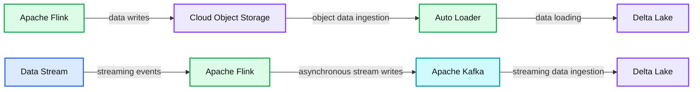
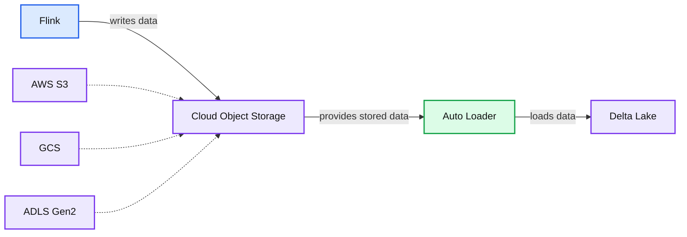

# Using Apache Flink With Delta Lake

*Incorporating Flink datastreams into your Lakehouse Architecture*

- Source: https://www.databricks.com/blog/2022/02/10/using-apache-flink-with-delta-lake.html
- Published: 2022-02-10
- Authors: Max Fisher, Dylan Gessner, Vini Jaiswal
- Categories: open-source, data-streaming
- Images: 3 total, 3 extracted as architecture

As with all parts of our platform, we are constantly raising the bar and adding new features to enhance developers’ abilities to build the applications that will make their Lakehouse a reality. Building [real-time applications](https://www.databricks.com/product/data-streaming) on Databricks is no exception. Features like [asynchronous checkpointing](https://docs.databricks.com/spark/latest/structured-streaming/production.html#asynchronous-state-checkpointing), [session windows](https://www.databricks.com/blog/2021/10/12/native-support-of-session-window-in-spark-structured-streaming.html), and [Delta Live Tables](https://www.databricks.com/discover/demos/delta-live-tables-demo) allow organizations to build even more powerful, [real-time pipelines](https://www.databricks.com/product/data-streaming) on Databricks using Delta Lake as the foundation for all the data that flows through the lakehouse.

However, for organizations that leverage Flink for real-time transformations, it might appear that they are unable to take advantage of some of the great Delta Lake and Databricks features, but that is not the case. In this blog we will explore how Flink developers can build pipelines to integrate their Flink applications into the broader Lakehouse architecture.

**Summary:** The diagram shows Apache Flink writing data to Delta Lake through cloud object storage and Auto Loader, or through Kafka for streaming data.

**Components:**

- Apache Flink application
- AWS S3 cloud object storage
- Google Cloud Storage cloud object storage
- ADLS Gen2 cloud object storage
- Databricks Auto Loader
- Delta Lake
- Data Stream
- Apache Kafka

**Flows:**

- Flink -> Cloud Object Storage: data writes
- Cloud Object Storage -> Auto Loader: object data ingestion
- Auto Loader -> Delta Lake: data loading
- Data Stream -> Flink: streaming events
- Flink -> Kafka: asynchronous stream writes
- Kafka -> Delta Lake: streaming data ingestion

**Numbers:** none

source image: https://www.databricks.com/wp-content/uploads/2022/02/apache-flink-with-delta-lake-blog-image-1.png

## A stateful Flink application

Let’s use a credit card company to explore how we can do this.

For credit card companies, preventing fraudulent transactions is table-stakes for a successful business. Credit card fraud poses both reputational and revenue risk to a financial institution and, therefore, credit card companies must have systems in place to remain constantly vigilant in preventing fraudulent transactions. These organizations may implement monitoring systems using Apache Flink, a distributed event-at-a-time processing engine with fine-grained control over streaming application state and time.

Below is a simple example of a fraud detection application in Flink. It monitors transaction amounts over time and sends an alert if a small transaction is immediately followed by a large transaction within one minute for any given credit card account. By leveraging Flink’s [ValueState data type](https://nightlies.apache.org/flink/flink-docs-master/docs/dev/datastream/fault-tolerance/state/) and [KeyedProcessFunction](https://nightlies.apache.org/flink/flink-docs-master/docs/dev/datastream/operators/process_function/) together, developers can implement their business logic to trigger downstream alerts based on event and time states.

## Integrating Flink applications using cloud object store sinks with Delta Lake

**Summary:** Flink writes data to cloud object storage, which is consumed by Auto Loader into Delta Lake.

**Components:**

- Flink application using Apache Flink
- AWS S3 cloud object storage
- GCS cloud object storage
- ADLS Gen2 cloud object storage
- Auto Loader using Databricks Auto Loader
- Delta Lake

**Flows:**

- Flink -> Cloud object storage: writes data
- Cloud object storage -> Auto Loader: provides stored data
- Auto Loader -> Delta Lake: loads data

**Numbers:** none

source image: https://www.databricks.com/wp-content/uploads/2022/02/apache-flink-with-delta-lake-blog-image-2.png

 There is a tradeoff between very low-latency operational use-cases and running performant OLAP on big datasets. To meet operational SLAs and prevent fraudulent transactions, records need to be produced by Flink nearly as quickly as events are received, resulting in small files (on the order of a few KBs) in the Flink application’s sink. This “small file problem” can lead to very poor performance in downstream queries, as execution engines spend more time listing directories and pulling files from cloud storage than they do actually processing the data within those files. Consider the same fraud detection application that writes transactions as parquet files with the following schema:

Fortunately, [Databricks Auto Loader](https://docs.databricks.com/spark/latest/structured-streaming/auto-loader.html) makes it easy to stream data landed into object storage from Flink applications into Delta Lake tables for downstream ML and BI on that data.

Delta Lake tables [automatically optimize](https://docs.databricks.com/delta/optimizations/auto-optimize.html) the physical layout of data in cloud storage through compaction and indexing to mitigate the small file problem and enable performant downstream analytics.

Much like Auto-Loader can transform a static source like cloud storage into a streaming datasource, Delta Lake tables also function as streaming sources despite being stored in object storage. This means that organizations using Flink for operational use cases can leverage this architectural pattern for streaming analytics without sacrificing their real-time requirements.

## Integrating Flink applications using Apache Kafka and Delta Lake

Let’s say the credit card company wanted to use their fraud detection model that they built in Databricks, and the model to score the data in real-time. Pushing files to cloud storage might not be fast enough for some SLAs around fraud detection, so they can write data from their Flink application to message bus systems like Kafka, AWS Kinesis, or Azure Event Hub. Once the data is written to Kafka, a Databricks job can read from Kafka and write to Delta Lake.

**Summary:** Data flows from a raw data stream through Flink and Kafka into Delta Lake.

**Components:**

- Data Stream: raw streaming data
- Flink: Apache Flink stream processing
- kafka: Kafka messaging system
- DELTA LAKE: Delta Lake storage

**Flows:**

- Data Stream -> Flink: data stream
- Flink -> kafka: processed data
- kafka -> DELTA LAKE: streamed data

**Numbers:** none

source image: https://www.databricks.com/wp-content/uploads/2022/02/apache-flink-with-delta-lake-blog-image-3.png

```mermaid
%% Raw streaming data flows through Flink and Kafka into Delta Lake
flowchart LR
    A[Data Stream] -->|data stream| B[Flink]
    B -->|processed data| C[kafka]
    C -->|streamed data| D[DELTA LAKE]

    classDef client   fill:#dbeafe,stroke:#2563eb,stroke-width:2px,color:#111
    classDef service  fill:#dcfce7,stroke:#16a34a,stroke-width:2px,color:#111
    classDef store    fill:#ede9fe,stroke:#7c3aed,stroke-width:2px,color:#111
    classDef cache    fill:#fef3c7,stroke:#d97706,stroke-width:2px,color:#111
    classDef queue    fill:#cffafe,stroke:#0891b2,stroke-width:2px,color:#111
    classDef critical fill:#fee2e2,stroke:#dc2626,stroke-width:4px,color:#111
    classDef external fill:#e5e7eb,stroke:#6b7280,stroke-width:2px,color:#111,stroke-dasharray:4 3
    classDef decision fill:#fce7f3,stroke:#db2777,stroke-width:2px,color:#111

    %% Legend
    %% client = clients edge gateway LB
    %% service = stateless compute
    %% store = databases durable storage
    %% cache = Redis CDN or anything losable
    %% queue = Kafka streams async pipes
    %% critical = bottleneck or SPOF
    %% external = third party
    %% decision = trade off point

    class A external
    class B service
    class C queue
    class D store
```

For Flink developers, there is a [Kafka Connector](https://nightlies.apache.org/flink/flink-docs-master/docs/connectors/datastream/kafka/) that can be integrated with your Flink projects to allow for DataStream API and Table API-based streaming jobs to write out the results to an organization’s Kafka cluster. Note that as of the writing of this blog, Flink does not come packaged with this connector, so you will need to include the Kafka Connector JAR in your project’s build file (i.e. pom.xml, build.sbt, etc).

Here is an example of how you would write the results of your DataStream in Flink to a topic on the Kafka Cluster:

Now you can easily leverage Databricks to write a Structured Streaming application to read from the Kafka topic that the results of the Flink DataStream wrote out to. To establish the read from Kafka...

Once the data has been schematized, we can load our model and score the microbatch of data that Spark processes after each trigger. For a more detailed example of Machine Learning models and Structured streaming, check [this article](https://docs.azuredatabricks.net/_static/notebooks/using-mllib-with-structured-streaming.html) out in our documentation.

Now we can write to Delta by configuring the writeStream and pointing it to our fraud_predictions Delta Lake table. This will allow us to build important reports on how we track and handle fraudulent transactions for our customers; we can even use the outputs to understand how our model is doing over time in terms of how many false positives it outputs or accurate assessments.

## Conclusion

With both of these options, Flink and Autoloader or Flink and Kafka, organizations can still leverage the features of Delta Lake and ensure they are integrating their Flink applications into their broader Lakehouse architecture. Databricks has also been working with the Flink community to build a direct Flink to Delta Lake connector.
