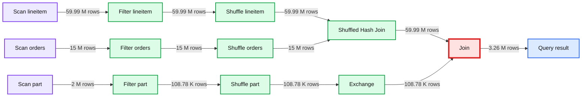
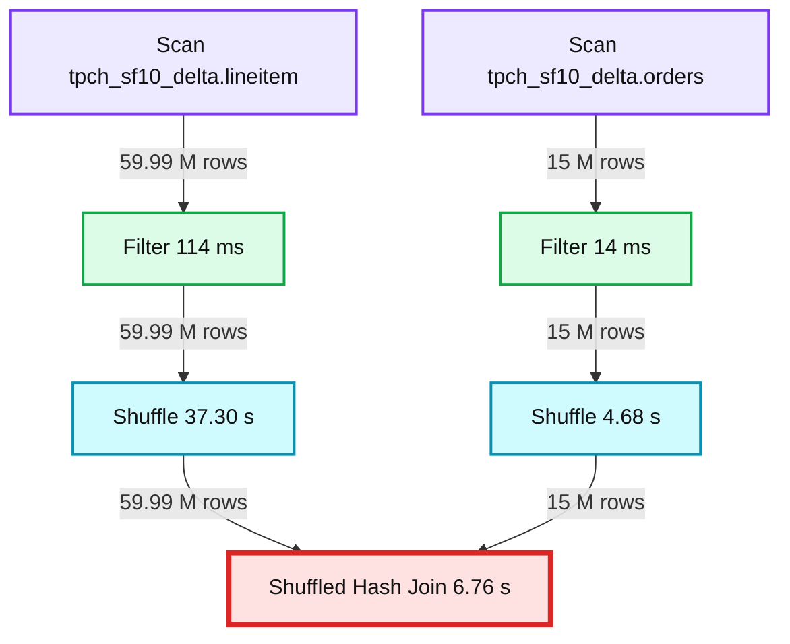

# Get to Know Your Queries With the New Databricks SQL Query Profile!

- Source: https://www.databricks.com/blog/2022/02/23/get-to-know-your-queries-with-the-new-databricks-sql-query-profile.html
- Published: 2022-02-23
- Authors: Bilal Aslam, Lucas Cerdan
- Categories: product, data-warehousing
- Images: 5 total, 2 extracted as architecture

[Databricks SQL](https://www.databricks.com/product/databricks-sql) provides data warehousing capabilities and first class support for SQL on the [Databricks Lakehouse Platform](https://www.databricks.com/product/data-lakehouse) - allowing analysts to discover and share new insights faster at a fraction of the cost of legacy cloud data warehouses.

This blog is part of a series on Databricks SQL that covers critical capabilities across performance, ease of use, and governance. In a previous [blog post](https://www.databricks.com/blog/2021/09/30/databricks-sql-delivering-a-production-sql-development-experience-on-the-data-lake.html), we covered recent user experience enhancements. In this article, we’ll cover improvements that help our users understand queries and query performance.

## Speed up queries by identifying execution bottlenecks

Databricks SQL is great at automatically speeding up queries - in fact, we recently set a [world record](https://www.databricks.com/blog/2021/11/02/databricks-sets-official-data-warehousing-performance-record.html) for it! Even with today’s advancements, there are still times when you need to open up the hood and look at query execution (e.g. when a query is unexpectedly slow). That’s why we’re excited to introduce Query Profile, a new feature that provides execution details for a query and granular metrics to see where time and compute resources are being spent. The UI should be familiar to administrators who have used databases before.

**Summary:** Databricks SQL Query Profile shows query execution flowing from table scans through filters, shuffles, exchange, and a Photon broadcast hash join.

**Components:**

- Scan `tpch_sf10_delta.lineitem`
- Scan `tpch_sf10_delta.orders`
- Scan `tpch_sf10_delta.part`
- Filter operators
- Shuffle operators
- Shuffled Hash Join
- Exchange
- Join using Photon Broadcast Hash
- Query Profile graph view with time, rows, and peak memory metrics

**Flows:**

- `Scan lineitem -> Filter lineitem`: 59.99M rows
- `Filter lineitem -> Shuffle lineitem`: 59.99M rows
- `Scan orders -> Filter orders`: 15M rows
- `Filter orders -> Shuffle orders`: 15M rows
- `Shuffle lineitem -> Shuffled Hash Join`: 59.99M rows
- `Shuffle orders -> Shuffled Hash Join`: 15M rows
- `Scan part -> Filter part`: 2M rows
- `Filter part -> Shuffle part`: 108.78K rows
- `Shuffle part -> Exchange`: 108.78K rows
- `Shuffled Hash Join -> Join`: 59.99M rows
- `Exchange -> Join`: 108.78K rows
- `Join -> Query result`: 3.26M rows

**Numbers:** 01ec792a-1e86-1dc7-8a1a-4d05701ab746; 1.96 s; 3.26 M rows; 64 MB; 23,643; 56.32 ms; 15.82 s; 3,261,613; 59.99 M rows; 108.78 K rows; 15 M rows; 2 M rows; 37.30 s; 6.76 s; 4.68 s; 82 ms; 1.94 m; 51.03 s; 10.14 s; 114 ms; 14 ms; 70 ms

source image: https://www.databricks.com/wp-content/uploads/2022/02/get-to-know-your-queries-with-the-new-databricks-blog-new-img-1.png

Query Profile includes these key capabilities:

- A breakdown of the main components of query execution and related metrics: time spent in tasks, rows processed, and memory consumption.
- Multiple graphical representations. This includes a condensed tree view for spotting the slowest operations at a glance and a graph view to understand how data is flowing between query operators.
- The ability to easily discover common mistakes in queries (e.g. exploding joins or full table scans).
- Better collaboration via the ability to download and share a query profile.

A common methodology for speeding up queries is to first identify the longest running query operators. We are more interested in total time spent on a task rather than the exact “wall clock time” of an operator as we’re dealing with a distributed system and operators can be executed in parallel.

From the Query Profile above of a TPC-H query, it’s easy to identify the most expensive query operator: scan of the table lineitem. The second most expensive operator is the scan of another table (orders).

**Summary:** Databricks SQL Query Profile graph showing two table scans feeding filters, shuffles, and a shuffled hash join.

**Components:**

- Scan `tpch_sf10_delta.lineitem` using Databricks SQL and Delta
- Filter operator
- Shuffle operator
- Scan `tpch_sf10_delta.orders` using Databricks SQL and Delta
- Filter operator
- Shuffle operator
- Shuffled Hash Join operator

**Flows:**

- `tpch_sf10_delta.lineitem` scan -> Filter: 59.99 M rows
- Lineitem Filter -> Shuffle: 59.99 M rows
- Lineitem Shuffle -> Shuffled Hash Join: 59.99 M rows
- `tpch_sf10_delta.orders` scan -> Filter: 15 M rows
- Orders Filter -> Shuffle: 15 M rows
- Orders Shuffle -> Shuffled Hash Join: 15 M rows

**Numbers:**

- 59.99 M rows
- 15 M rows
- 6.76 s
- 37.30 s
- 4.68 s
- 114 ms
- 14 ms
- 1.94 m
- 51.03 s

source image: https://www.databricks.com/wp-content/uploads/2022/02/get-to-know-your-queries-with-the-new-databricks-blog-img-3.jpg

Each query operator comes with a slew of statistics. In the case of a scan operator, metrics include number of files or data read, time spent waiting for cloud storage or time spent reading files. As a result, it is easy to answer questions such as which table should be optimized or whether a join could be improved.

## Spring cleaning Query History

We are also happy to announce a few small but handy tweaks in Query History. We have enhanced the details that can be accessed for each query. You can now see a query’s status, SQL statement, duration breakdown and a summary of the most important execution metrics.

To avoid back and forth between the SQL editor and Query History, all the features announced above are also directly available from the SQL editor.

## Query performance best practices

Query Profile is available today in Databricks SQL. Get started now with Databricks SQL by signing up for a [free trial](https://www.databricks.com/try-databricks). To learn how to maximize lakehouse performance on Databricks SQL, join us for a [webinar](https://www.databricks.com/p/webinar/performance-tuning-best-practices-on-the-lakehouse) on February 24th. This webinar includes demos, live Q&As and lessons learned in the field so you can dive in and find out how to harness all the power of the Lakehouse Platform.

In this webinar, you’ll learn how to:

- Quickly and easily ingest business-critical data into your lakehouse and continuously refine data with optimized Delta tables for best performance
- Write, share and reuse queries with a native first-class SQL development experience on Databricks SQL — and unlock maximum productivity
- Get full transparency and visibility into query execution with an in-depth breakdown of operation-level details so you can dive in

Register [here](https://www.databricks.com/p/webinar/performance-tuning-best-practices-on-the-lakehouse)!
